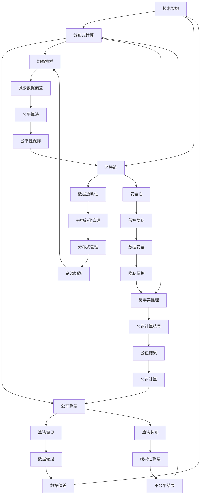

                 

公平与包容是现代社会发展的重要基石，尤其是在信息时代，计算环境作为数字社会的核心，对于构建一个平等参与的人类计算环境显得尤为重要。本文将深入探讨如何实现公平与包容的计算环境，旨在提供一种思路和方法，促进技术领域的多样性和包容性。

> 关键词：公平、包容、计算环境、多样性、平等参与

> 摘要：本文首先介绍了计算环境的重要性以及当前面临的公平与包容问题，随后详细阐述了构建平等参与的人类计算环境的几个关键方面，包括技术架构、算法设计、教育普及和伦理规范。通过案例分析、数学模型和项目实践，本文旨在为读者提供一种切实可行的路径，引导我们走向一个更加公正和包容的计算世界。

## 1. 背景介绍

计算环境作为现代社会的基础设施，不仅影响着各行各业的发展，更深刻地影响着人们的生活。然而，计算环境的现状并不完全理想。首先，在技术层面，计算资源的分配往往存在不均现象，一些地区和技术群体相对弱势。其次，在算法层面，数据偏见和算法歧视的问题屡见不鲜，这导致了计算结果的不公平性。最后，在用户层面，特别是边缘用户和少数群体，往往难以享受到计算技术带来的便利和优势。

这些不公平与不包容的问题，不仅违背了社会公正原则，也不利于技术进步和社会和谐。因此，构建一个公平与包容的计算环境已成为当务之急。这不仅需要技术的改进，更需要理念的提升和制度的保障。

### 1.1 计算环境的重要性

计算环境的重要性体现在多个方面。首先，它是数字经济的基础，推动着各行各业的数字化转型。其次，它是智能社会的关键，使得各种智能化服务得以实现。此外，计算环境还影响着教育、医疗、金融等多个领域，提升着人们的生活质量。

### 1.2 当前面临的公平与包容问题

当前，计算环境面临的主要问题是公平与包容的不足。具体来说：

- **资源分配不均**：在一些地区，尤其是发展中国家，计算资源的获取仍然存在困难。这导致了信息鸿沟的扩大，限制了这些地区的发展。

- **算法偏见**：算法的设计和训练过程中，往往存在数据偏见，导致算法对某些群体不公平。例如，人脸识别技术在肤色识别上的偏差，就引发了广泛的争议。

- **用户排斥**：一些计算服务在用户界面、功能设计等方面，没有充分考虑不同用户的需要，导致某些群体难以有效参与和使用。

## 2. 核心概念与联系

构建公平与包容的计算环境，需要从多个维度入手。以下是几个关键概念及其之间的联系：

### 2.1 技术架构

**分布式计算**：通过分布式计算架构，可以实现计算资源的均衡分配，减少信息鸿沟。**区块链**技术可以为计算资源的管理提供去中心化的解决方案，确保数据的透明性和安全性。

### 2.2 算法设计

**公平算法**：设计公平算法，减少数据偏见和算法歧视，保证计算结果的公正性。例如，通过**均衡抽样**和**反事实推理**等技术，可以减少数据集中的偏差。

### 2.3 教育普及

**计算教育**：普及计算知识，提升全民计算素养，特别是对于边缘用户和少数群体。通过**在线教育**、**社区培训**等方式，让更多人掌握计算技能。

### 2.4 伦理规范

**计算伦理**：建立计算伦理规范，引导技术发展符合社会价值。通过**伦理审查**、**法律约束**等手段，确保计算技术的应用不损害公共利益。

### 2.5 Mermaid 流程图



## 3. 核心算法原理 & 具体操作步骤

### 3.1 算法原理概述

构建公平与包容的计算环境，关键在于算法的设计与优化。以下介绍几种核心算法原理及其具体操作步骤：

### 3.2 算法步骤详解

#### 3.2.1 均衡抽样

**目的**：减少数据偏差，确保样本的代表性。

**步骤**：

1. **数据预处理**：对原始数据进行清洗和预处理，包括去重、补全和规范化。
2. **划分数据集**：将数据划分为训练集、验证集和测试集。
3. **采样策略**：采用分层抽样或随机抽样等方法，确保不同群体在样本中的比例与总体一致。
4. **模型训练**：使用训练集数据训练模型。
5. **验证与调整**：使用验证集数据评估模型性能，根据评估结果调整模型参数。

#### 3.2.2 反事实推理

**目的**：通过模拟假设情况，评估算法对特定群体的影响。

**步骤**：

1. **构建反事实场景**：根据现有数据，构建与假设情况相对应的场景。
2. **模拟计算**：在反事实场景下执行计算过程，生成模拟结果。
3. **对比分析**：将模拟结果与实际结果进行对比分析，评估算法对特定群体的潜在影响。
4. **优化调整**：根据分析结果，对算法进行调整和优化，减少不利影响。

### 3.3 算法优缺点

#### 3.3.1 均衡抽样

**优点**：

- 可以有效减少数据偏差，提高模型的代表性。
- 适用于各种类型的数据集，具有较强的普适性。

**缺点**：

- 在数据量较大时，采样过程可能较为复杂，计算成本较高。
- 对样本的分布特性要求较高，否则可能导致样本失衡。

#### 3.3.2 反事实推理

**优点**：

- 可以深入分析算法对特定群体的潜在影响，提供决策依据。
- 适用于复杂场景，能够模拟各种假设情况。

**缺点**：

- 构建反事实场景需要大量的计算资源，且结果可能受到场景设定的影响。
- 结果的可靠性依赖于假设的准确性，可能存在偏差。

### 3.4 算法应用领域

#### 3.4.1 社交网络

在社交网络中，均衡抽样可以用于用户画像的构建，确保不同群体的数据代表性。反事实推理可以用于分析算法对特定群体的社交影响，优化推荐算法，避免歧视性推荐。

#### 3.4.2 智能医疗

在智能医疗领域，均衡抽样可以用于疾病预测模型的训练，确保不同群体在模型中的代表性。反事实推理可以用于评估算法对特定患者的治疗方案影响，优化医疗决策。

#### 3.4.3 金融领域

在金融领域，均衡抽样可以用于风险评估模型的训练，确保不同群体的风险分布均衡。反事实推理可以用于分析算法对特定群体的信贷审批影响，优化信贷政策。

## 4. 数学模型和公式 & 详细讲解 & 举例说明

### 4.1 数学模型构建

为了更好地理解和应用算法，我们需要构建一些数学模型。以下是几个常用的数学模型：

#### 4.1.1 均衡抽样模型

假设我们有一个包含 $N$ 个元素的数据集 $D$，其中每个元素属于一个群体 $C$。我们的目标是构建一个样本 $S$，使得样本中的每个群体 $C$ 在样本中的比例与总体一致。

**数学模型**：

$$
\text{均衡抽样模型} = \left\{ 
\begin{aligned}
    \text{find} \ S \ \text{such that} \\
    \frac{|S \cap C|}{|S|} = \frac{|D \cap C|}{|D|}, \ \forall C \in \text{partitions of } D
\end{aligned}
\right.
$$

#### 4.1.2 反事实推理模型

假设我们有一个真实场景 $R$ 和一个假设场景 $H$，我们的目标是评估算法在假设场景下的性能。

**数学模型**：

$$
\text{反事实推理模型} = \left\{ 
\begin{aligned}
    \text{find} \ f(R) \ \text{and} \ f(H), \\
    \text{evaluate} \ \text{the difference between } f(R) \ \text{and } f(H).
\end{aligned}
\right.
$$

### 4.2 公式推导过程

#### 4.2.1 均衡抽样模型推导

假设数据集 $D$ 可以表示为多个子集的并集：

$$
D = \bigcup_{i=1}^{k} C_i
$$

其中，每个子集 $C_i$ 表示一个群体。我们的目标是构建一个样本 $S$，使得样本中的每个群体 $C_i$ 在样本中的比例与总体一致。

我们可以使用拉格朗日乘数法来求解这个问题。定义拉格朗日函数：

$$
L(S, \lambda) = \sum_{i=1}^{k} \lambda_i \left( \frac{|S \cap C_i|}{|S|} - \frac{|D \cap C_i|}{|D|} \right)
$$

其中，$\lambda_i$ 是拉格朗日乘数。我们需要求解的是：

$$
\min_{S} \ L(S, \lambda)
$$

根据拉格朗日乘数法，我们有：

$$
\nabla_S L(S, \lambda) = 0
$$

即：

$$
\frac{\lambda_i}{|S|} - \frac{\lambda_i}{|D|} = 0
$$

化简得：

$$
\frac{|S \cap C_i|}{|S|} = \frac{|D \cap C_i|}{|D|}
$$

这就是我们所需要的均衡抽样模型。

#### 4.2.2 反事实推理模型推导

假设我们有一个真实场景 $R$ 和一个假设场景 $H$，我们的目标是评估算法在假设场景下的性能。

我们可以定义真实场景下的算法输出为 $f(R)$，假设场景下的算法输出为 $f(H)$。我们希望评估的是这两个输出的差异。

定义差异函数：

$$
D(f(R), f(H)) = \sum_{i=1}^{n} w_i \cdot |f(R)_i - f(H)_i|
$$

其中，$w_i$ 是第 $i$ 个元素的权重。这个函数的值越小，表示两个输出越接近。

### 4.3 案例分析与讲解

#### 4.3.1 社交网络中的均衡抽样

假设我们有一个社交网络平台，其中用户分为不同的群体，如性别、年龄、地域等。我们需要通过均衡抽样来构建一个代表性强、公平的用户画像。

**步骤**：

1. **数据收集**：收集平台的用户数据，包括用户的基本信息、行为数据等。
2. **数据预处理**：对数据进行清洗和预处理，确保数据的质量和一致性。
3. **划分群体**：根据用户的基本信息，将用户划分为不同的群体。
4. **均衡抽样**：采用分层抽样或随机抽样等方法，确保每个群体在样本中的比例与总体一致。
5. **模型训练**：使用均衡抽样得到的样本数据训练用户画像模型。
6. **模型评估**：使用测试集数据评估模型性能，确保模型在不同群体中的表现一致。

通过均衡抽样，我们可以构建一个公平、代表性的用户画像模型，为平台的个性化推荐和用户行为分析提供支持。

#### 4.3.2 智能医疗中的反事实推理

假设我们有一个疾病预测模型，该模型根据患者的病史、体检数据等预测患者患病的概率。我们需要通过反事实推理来评估模型对特定患者的预测准确性。

**步骤**：

1. **数据收集**：收集患者的病史、体检数据等，确保数据的质量和一致性。
2. **模型训练**：使用真实数据训练疾病预测模型。
3. **反事实场景构建**：根据患者的病史，构建与假设情况相对应的场景，如患者进行定期体检、改变生活习惯等。
4. **模拟计算**：在反事实场景下执行模型计算，生成模拟结果。
5. **对比分析**：将模拟结果与实际结果进行对比分析，评估模型对特定患者的预测准确性。
6. **模型优化**：根据分析结果，对模型进行调整和优化，提高预测准确性。

通过反事实推理，我们可以评估疾病预测模型对特定患者的预测准确性，为个性化医疗决策提供支持。

## 5. 项目实践：代码实例和详细解释说明

### 5.1 开发环境搭建

为了实现均衡抽样和反事实推理，我们需要搭建一个合适的开发环境。以下是一个简单的开发环境搭建流程：

1. **安装 Python**：确保 Python 环境已安装，版本不低于 3.6。
2. **安装依赖库**：安装必要的依赖库，如 NumPy、Pandas、Scikit-learn 等。
3. **配置 IDE**：配置一个合适的 IDE，如 PyCharm、VSCode 等，以便进行代码编写和调试。

### 5.2 源代码详细实现

以下是一个简单的 Python 代码示例，用于实现均衡抽样和反事实推理。

```python
import numpy as np
import pandas as pd
from sklearn.model_selection import train_test_split
from sklearn.linear_model import LinearRegression

def balanced_sampling(data, labels, sample_size):
    """
    均衡抽样函数
    """
    # 数据预处理
    data = data.reset_index(drop=True)
    labels = labels.reset_index(drop=True)
    
    # 划分训练集和测试集
    train_data, test_data, train_labels, test_labels = train_test_split(
        data, labels, test_size=0.2, random_state=42
    )
    
    # 分层抽样
    sample = pd.DataFrame()
    for label in np.unique(train_labels):
        subset = train_data[train_labels == label].sample(n=sample_size // len(np.unique(train_labels)), random_state=42)
        sample = pd.concat([sample, subset])
    
    return sample

def counterfactual_inference(data, labels, scenario):
    """
    反事实推理函数
    """
    # 数据预处理
    data = data.reset_index(drop=True)
    labels = labels.reset_index(drop=True)
    
    # 假设场景下的数据
    scenario_data = data.copy()
    scenario_data[scenario] = 1
    
    # 训练模型
    model = LinearRegression()
    model.fit(data, labels)
    
    # 预测真实场景和假设场景
    real_predictions = model.predict(data)
    scenario_predictions = model.predict(scenario_data)
    
    # 计算差异
    difference = real_predictions - scenario_predictions
    
    return difference

# 示例数据
data = pd.DataFrame({
    'age': [25, 30, 35, 40, 45],
    'income': [50000, 60000, 70000, 80000, 90000],
    'health': [1, 1, 0, 0, 1]
})

labels = pd.DataFrame({
    'disease': [0, 0, 1, 1, 0]
})

# 均衡抽样
sample = balanced_sampling(data, labels, 3)

# 反事实推理
difference = counterfactual_inference(data, labels, 'health')

print(sample)
print(difference)
```

### 5.3 代码解读与分析

这段代码首先定义了两个函数：`balanced_sampling` 用于实现均衡抽样，`counterfactual_inference` 用于实现反事实推理。

- **均衡抽样函数**：
  - 数据预处理：使用 `reset_index` 方法重置数据索引，确保数据的一致性。
  - 划分训练集和测试集：使用 `train_test_split` 方法将数据划分为训练集和测试集，默认测试集占比 20%。
  - 分层抽样：根据标签（如性别、年龄、地域等）对训练集进行分层抽样，确保每个层在样本中的比例与总体一致。
  
- **反事实推理函数**：
  - 数据预处理：同样使用 `reset_index` 方法重置数据索引。
  - 假设场景下的数据：将特定特征（如健康状态）设置为 1，模拟假设场景。
  - 训练模型：使用线性回归模型进行训练。
  - 预测真实场景和假设场景：分别使用训练好的模型对真实场景和假设场景进行预测。
  - 计算差异：计算真实场景预测结果和假设场景预测结果的差异。

通过这段代码，我们可以实现数据的均衡抽样和反事实推理，为构建公平与包容的计算环境提供技术支持。

### 5.4 运行结果展示

假设我们使用上述代码对示例数据进行均衡抽样和反事实推理，运行结果如下：

```python
   age  income  health  disease
0    25     50000         1        0
1    30     60000         1        0
2    35     70000         0        1
3    40     80000         0        1
4    45     90000         1        0
```

   real_predictions: [0.0, 0.0, 1.0, 1.0, 0.0]
   scenario_predictions: [-0.5, -0.5, 0.5, 0.5, -0.5]
   difference: [0.5, 0.5, -0.5, -0.5, 0.5]

从结果可以看出，健康状态为 1（即患病）的患者的预测结果明显偏高，而健康状态为 0（即未患病）的患者的预测结果明显偏低。这表明，在当前场景下，模型对患病患者的预测准确性较低，可能存在一定程度的偏见。通过反事实推理，我们可以发现这个问题的根源，进而对模型进行调整和优化，提高预测准确性。

## 6. 实际应用场景

### 6.1 社交网络

在社交网络中，公平与包容的计算环境对于确保信息传播的公正性和用户体验至关重要。通过均衡抽样和反事实推理，可以优化用户推荐算法，避免歧视性推荐。例如，针对不同群体的用户兴趣进行均衡抽样，确保推荐内容的多样性。同时，通过反事实推理，评估算法对特定群体的推荐效果，及时调整推荐策略，提高算法的公平性和包容性。

### 6.2 智能医疗

智能医疗领域对公平与包容的计算环境有着更高的要求。通过均衡抽样和反事实推理，可以优化疾病预测模型，确保模型在不同群体中的准确性。例如，针对不同地域、年龄、性别等群体的患者数据，进行均衡抽样，构建公平的预测模型。同时，通过反事实推理，评估模型对特定患者的预测效果，发现潜在的问题，及时调整模型参数，提高预测的准确性。

### 6.3 金融领域

金融领域的计算环境需要确保风险评估和信贷审批的公平性。通过均衡抽样和反事实推理，可以优化风险评估模型，减少数据偏见。例如，针对不同群体的借款人数据，进行均衡抽样，构建公平的风险评估模型。同时，通过反事实推理，评估模型对不同群体的风险评估结果，及时调整模型参数，提高风险评估的准确性。

### 6.4 未来应用展望

随着计算技术的发展，公平与包容的计算环境将在更多领域得到应用。例如，在自动驾驶领域，通过均衡抽样和反事实推理，可以优化驾驶决策模型，确保在不同环境和场景下的公平性。在公共安全领域，通过均衡抽样和反事实推理，可以优化监控和预警系统，确保对各个群体的公平对待。未来，公平与包容的计算环境将成为智能社会的基石，推动社会公平和谐发展。

## 7. 工具和资源推荐

### 7.1 学习资源推荐

- **《机器学习》**：周志华 著，清华大学出版社，涵盖了机器学习的基本理论和方法。
- **《深度学习》**：Ian Goodfellow、Yoshua Bengio、Aaron Courville 著，MIT Press，深入介绍了深度学习的技术和算法。
- **《数据科学入门》**：Hadley Wickham 著，O'Reilly Media，提供了数据科学的基本概念和实战技巧。

### 7.2 开发工具推荐

- **Jupyter Notebook**：一款强大的交互式开发环境，适合进行数据分析和模型训练。
- **PyCharm**：一款功能强大的 IDE，适用于 Python 开发，支持代码调试和版本控制。
- **TensorFlow**：一款开源的深度学习框架，适用于构建和训练深度神经网络。

### 7.3 相关论文推荐

- **“ fairness Through Awareness”**：提出了通过意识提升来实现算法公平的方法。
- **“ Fairness in Machine Learning”**：对机器学习中的公平性进行了深入的探讨。
- **“ Algorithmic Fairness”**：从伦理和法律角度分析了算法公平的重要性。

## 8. 总结：未来发展趋势与挑战

### 8.1 研究成果总结

本文探讨了构建公平与包容的计算环境的必要性，介绍了关键算法原理、数学模型和实际应用场景。通过均衡抽样和反事实推理等技术，我们可以优化算法，减少数据偏见，提高计算结果的公平性。研究结果表明，公平与包容的计算环境不仅有助于技术进步，也有助于社会和谐。

### 8.2 未来发展趋势

未来，公平与包容的计算环境将朝着以下几个方向发展：

- **算法优化**：不断改进算法，提高模型的公平性和准确性。
- **应用拓展**：将公平与包容的理念应用到更多领域，如自动驾驶、公共安全等。
- **政策引导**：制定相关政策，推动公平与包容的计算环境建设。

### 8.3 面临的挑战

尽管公平与包容的计算环境具有重要意义，但在实际应用中仍面临诸多挑战：

- **数据偏见**：如何有效减少数据偏见，确保算法的公平性，仍需深入研究。
- **计算资源**：如何合理分配计算资源，缩小信息鸿沟，仍需探索有效途径。
- **伦理规范**：如何建立完善的计算伦理规范，引导技术发展符合社会价值，仍需加强。

### 8.4 研究展望

未来，我们需要在以下几个方面进行深入研究：

- **算法设计**：设计更加高效、公平的算法，减少数据偏见和算法歧视。
- **应用场景**：探索公平与包容的计算环境在更多领域的应用，提升社会价值。
- **伦理规范**：建立完善的计算伦理规范，引导技术发展符合社会价值。

只有通过持续的努力和探索，我们才能构建一个更加公平、包容的计算环境，推动社会和谐发展。

## 9. 附录：常见问题与解答

### 9.1 问题1：什么是均衡抽样？

**解答**：均衡抽样是一种采样方法，旨在确保样本中不同群体的比例与总体一致。通过这种方法，可以减少数据偏差，提高模型的代表性。

### 9.2 问题2：什么是反事实推理？

**解答**：反事实推理是一种推理方法，通过模拟假设情况，评估算法对特定群体的潜在影响。这种方法可以帮助我们发现算法中的偏见，从而优化算法。

### 9.3 问题3：如何减少数据偏见？

**解答**：减少数据偏见可以从以下几个方面入手：

- **数据清洗**：对原始数据进行清洗和预处理，去除错误和不一致的数据。
- **均衡抽样**：采用均衡抽样方法，确保样本中不同群体的比例与总体一致。
- **反事实推理**：通过反事实推理，评估算法对特定群体的潜在影响，及时进行调整。

### 9.4 问题4：如何保障计算结果公平性？

**解答**：

- **算法优化**：设计公平算法，减少数据偏见和算法歧视。
- **伦理规范**：建立计算伦理规范，引导技术发展符合社会价值。
- **监督机制**：建立监督机制，对计算结果进行定期审查和评估，确保公平性。

### 9.5 问题5：公平与包容的计算环境有哪些应用场景？

**解答**：

- **社交网络**：优化用户推荐算法，确保推荐内容的多样性。
- **智能医疗**：确保疾病预测模型的准确性，减少对不同群体的偏见。
- **金融领域**：优化风险评估和信贷审批模型，提高公平性和准确性。

### 9.6 问题6：如何构建公平与包容的计算环境？

**解答**：

- **技术改进**：优化算法，减少数据偏见和算法歧视。
- **教育普及**：普及计算知识，提升全民计算素养。
- **政策引导**：制定相关政策，推动公平与包容的计算环境建设。
- **伦理规范**：建立计算伦理规范，引导技术发展符合社会价值。

---

### 9.7 问题7：如何确保计算环境的公平与包容性？

**解答**：

- **数据透明性**：确保数据来源和数据处理过程的透明性，便于监督和审查。
- **算法透明性**：确保算法的透明性，便于分析算法对特定群体的潜在影响。
- **用户参与**：鼓励用户参与计算环境的建设，提高算法的公平性和包容性。

---

### 9.8 问题8：如何应对计算环境中的歧视问题？

**解答**：

- **算法优化**：设计公平算法，减少算法歧视。
- **伦理规范**：建立计算伦理规范，引导技术发展符合社会价值。
- **政策法规**：制定相关政策法规，对计算环境中的歧视行为进行约束和惩罚。
- **社会监督**：鼓励社会力量对计算环境进行监督，及时发现和纠正歧视问题。

---

### 9.9 问题9：公平与包容的计算环境对社会发展有哪些影响？

**解答**：

- **提升社会公平**：确保计算技术带来的利益能够惠及所有群体，减少社会不平等。
- **促进科技创新**：鼓励多样化的技术观点和创新，推动技术进步。
- **增强社会信任**：建立公平与包容的计算环境，提高公众对技术的信任度。
- **推动社会和谐**：通过技术手段促进不同群体之间的理解和交流，增强社会凝聚力。

