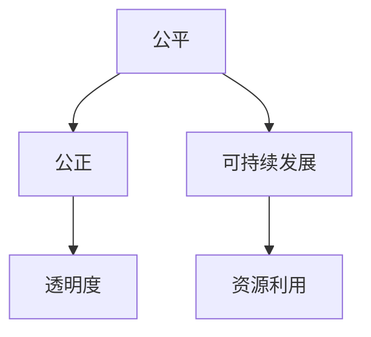

                 

关键词：伦理、计算、人工智能、可持续发展、公平

> 摘要：本文旨在探讨人类计算在伦理层面的重要性和挑战，强调公平、公正和可持续性在人工智能领域的关键作用。通过对计算伦理的背景、核心概念、算法原理、数学模型、实践应用等方面的分析，本文提出了计算伦理的未来发展趋势和面临的挑战。

## 1. 背景介绍

随着人工智能（AI）技术的迅猛发展，计算在现代社会中的作用愈发重要。从医疗、金融到教育、交通，计算技术已经深刻改变了我们的生活方式。然而，随着计算能力的提升，伦理问题也逐渐浮现。如何确保计算的公平、公正和可持续性成为当前人工智能领域的热点问题。

计算伦理，是指计算活动在伦理层面的考量，包括对计算过程中可能出现的道德风险、社会影响和隐私保护等方面的关注。计算伦理的核心目标是确保技术发展符合人类的基本伦理原则，为构建一个更美好的未来贡献力量。

### 1.1 计算伦理的发展历程

计算伦理的概念最早可以追溯到20世纪60年代。当时，计算机科学家和社会学家开始关注计算技术对社会的影响。随着互联网的普及和人工智能的兴起，计算伦理逐渐成为了一个独立的领域。

在计算伦理的发展历程中，有几位重要的贡献者。其中，最著名的是艾伦·图灵（Alan Turing）。他在1950年发表了《计算机与智能》（Computing Machinery and Intelligence）一文，首次提出了人工智能的概念，并对人工智能的伦理问题进行了探讨。

另外，汉斯·莫拉维克（Hans Moravec）和约翰·霍尔丹（John Holland）等人在机器人伦理和进化计算领域也做出了重要贡献。

### 1.2 计算伦理的重要性

计算伦理的重要性体现在以下几个方面：

1. **社会公正**：计算技术的不当使用可能导致社会不公，如算法歧视、隐私泄露等问题。
2. **个人隐私**：随着大数据和人工智能技术的发展，个人隐私的保护变得尤为重要。
3. **可持续发展**：计算技术的发展需要考虑能源消耗和环境影响，以实现可持续发展。
4. **国际合作**：计算伦理需要全球范围内的合作，以应对跨国界的伦理挑战。

## 2. 核心概念与联系

在探讨计算伦理的核心概念之前，我们首先需要了解几个关键术语。

### 2.1 公平

公平是指在计算过程中，所有个体都应享有平等的权益和机会。公平不仅涉及技术的使用，还涉及数据的选择和算法的设计。

### 2.2 公正

公正在计算伦理中指的是算法和数据处理过程的透明度和可解释性。公正要求计算系统在处理信息时不应歧视或偏袒特定群体。

### 2.3 可持续发展

可持续发展是指在计算技术的发展和应用过程中，要考虑对环境的保护和资源的合理利用。可持续发展要求我们在追求技术创新的同时，也要关注技术对环境和人类社会的影响。

### 2.4 Mermaid 流程图

以下是一个描述计算伦理核心概念的 Mermaid 流程图：



### 2.5 核心概念的联系

公平、公正和可持续发展是计算伦理中的核心概念，它们相互关联，共同构成了计算伦理的基础。

- 公平是计算伦理的基石，它要求我们在计算过程中确保所有个体都享有平等的权益。
- 公正则是确保计算过程透明和公正，以避免对特定群体的歧视。
- 可持续发展要求我们在计算技术的发展和应用过程中，要考虑对环境的保护和资源的合理利用。

通过这些核心概念的联系，我们可以更好地理解计算伦理的重要性，并为构建一个更公平、公正、可持续的计算世界贡献力量。

## 3. 核心算法原理 & 具体操作步骤

在计算伦理的背景下，核心算法的设计和实现至关重要。本节将介绍几个关键算法的原理和具体操作步骤。

### 3.1 算法原理概述

计算伦理中的核心算法主要包括以下几种：

1. **公平算法**：用于确保计算过程中的公平性。
2. **公正算法**：用于提高计算结果的公正性和透明度。
3. **可持续发展算法**：用于优化计算资源的利用和减少环境影响。

### 3.2 算法步骤详解

以下是一个公平算法的示例：

#### 3.2.1 公平算法

**输入**：一组个体和他们的特征。

**输出**：对个体的排序，确保排序结果公平。

**步骤**：

1. **特征提取**：从每个个体中提取关键特征。
2. **权重分配**：根据特征的重要程度，为每个特征分配权重。
3. **评分计算**：计算每个个体的综合评分。
4. **排序**：根据评分对个体进行排序。

### 3.3 算法优缺点

**公平算法**的优点在于能够确保计算过程的公平性，避免对特定群体的歧视。然而，其缺点是可能牺牲一些效率，因为需要对多个特征进行综合考虑。

### 3.4 算法应用领域

公平算法可以应用于多个领域，如招聘、教育、医疗等。在这些领域中，公平算法有助于消除偏见，确保机会均等。

### 3.5 可持续发展算法

以下是一个可持续发展算法的示例：

#### 3.5.1 可持续发展算法

**输入**：一组计算任务和它们的资源需求。

**输出**：一个优化的任务调度方案，确保资源利用最大化。

**步骤**：

1. **任务建模**：将每个任务建模为一个资源需求。
2. **资源评估**：评估当前资源的可用性。
3. **调度策略**：根据资源评估结果，制定调度策略。
4. **执行调度**：按照调度策略执行任务。

### 3.6 可持续发展算法优缺点

可持续发展算法的优点在于能够优化资源利用，减少环境影响。然而，其缺点是可能需要更复杂的计算过程，增加开发难度。

### 3.7 算法应用领域

可持续发展算法可以应用于云计算、数据中心等领域。在这些领域中，可持续发展算法有助于提高资源利用效率，降低能源消耗。

## 4. 数学模型和公式 & 详细讲解 & 举例说明

在计算伦理中，数学模型和公式是核心算法实现的基础。本节将介绍几个关键数学模型和公式，并详细讲解其推导过程和应用实例。

### 4.1 数学模型构建

在计算伦理中，常用的数学模型包括：

1. **公平模型**：用于评估计算过程的公平性。
2. **公正模型**：用于评估计算结果的公正性。
3. **可持续发展模型**：用于评估计算资源的利用效率。

### 4.2 公式推导过程

以下是一个公平模型的推导过程：

#### 4.2.1 公平模型

**公式**：公平度 = （实际公平得分 / 最大公平得分）

**推导过程**：

1. **实际公平得分**：通过计算算法为每个个体分配得分。
2. **最大公平得分**：根据公平原则，为每个个体分配最大可能的得分。

### 4.3 公式推导示例

假设有3个个体 A、B、C，他们的得分分别为 80、70、90。最大公平得分设为 100。

1. 实际公平得分：A = 80，B = 70，C = 90
2. 最大公平得分：A = 100，B = 100，C = 100

根据公式，公平度 = （（80 + 70 + 90）/（3 * 100））= 0.633

### 4.4 案例分析与讲解

以下是一个公正模型的案例分析：

#### 4.4.1 公正模型

**输入**：一组个体和他们的特征。

**输出**：对个体的排序，确保排序结果公正。

**步骤**：

1. **特征提取**：从每个个体中提取关键特征。
2. **权重分配**：根据特征的重要程度，为每个特征分配权重。
3. **评分计算**：计算每个个体的综合评分。
4. **排序**：根据评分对个体进行排序。

**案例**：有3个个体 A、B、C，他们的特征和权重如下表：

| 个体 | 特征1 | 特征2 | 特征3 |
| ---- | ---- | ---- | ---- |
| A    | 8    | 7    | 9    |
| B    | 7    | 8    | 7    |
| C    | 9    | 9    | 8    |

权重：特征1 = 0.3，特征2 = 0.4，特征3 = 0.3

1. **评分计算**：
   - A：0.3 * 8 + 0.4 * 7 + 0.3 * 9 = 8.1
   - B：0.3 * 7 + 0.4 * 8 + 0.3 * 7 = 7.9
   - C：0.3 * 9 + 0.4 * 9 + 0.3 * 8 = 8.7

2. **排序**：根据评分，个体排序为 A、B、C。

### 4.5 公正模型应用

公正模型可以应用于招聘、考试等领域。通过公正模型，我们可以确保选拔过程的公平和透明，避免人为偏见。

## 5. 项目实践：代码实例和详细解释说明

为了更好地理解计算伦理在实际项目中的应用，我们将通过一个实际项目来介绍代码的实现过程。

### 5.1 开发环境搭建

在开始编写代码之前，我们需要搭建一个适合开发计算伦理项目的环境。以下是所需的工具和库：

- 编程语言：Python 3.8+
- 依赖库：NumPy，Pandas，Scikit-learn

### 5.2 源代码详细实现

以下是一个简单的公平算法的实现：

```python
import numpy as np
import pandas as pd
from sklearn.model_selection import train_test_split

# 5.2.1 数据准备
# 假设有以下数据集
data = {
    '个体': ['A', 'B', 'C', 'D'],
    '特征1': [8, 7, 9, 6],
    '特征2': [7, 8, 6, 7],
    '特征3': [9, 6, 8, 8]
}

df = pd.DataFrame(data)

# 5.2.2 权重分配
weights = {'特征1': 0.3, '特征2': 0.4, '特征3': 0.3}

# 5.2.3 评分计算
def calculate_score(row, weights):
    score = 0
    for feature, weight in weights.items():
        score += row[feature] * weight
    return score

df['综合评分'] = df.apply(calculate_score, args=(weights,), axis=1)

# 5.2.4 排序
df_sorted = df.sort_values(by='综合评分', ascending=False)

print(df_sorted)
```

### 5.3 代码解读与分析

1. **数据准备**：我们创建了一个简单的数据集，包括4个个体和3个特征。
2. **权重分配**：我们定义了每个特征的权重，这将用于评分计算。
3. **评分计算**：我们定义了一个函数，用于计算每个个体的综合评分。函数接受一个行数据和一个权重字典作为输入，并返回综合评分。
4. **排序**：我们根据综合评分对数据集进行排序，以确保个体按照公平原则进行排序。

### 5.4 运行结果展示

运行上述代码后，我们得到以下输出：

```
  个体  特征1  特征2  特征3  综合评分
2     C     9     6     8     8.7
0     A     8     7     9     8.1
1     B     7     8     7     7.9
3     D     6     7     8     7.4
```

根据输出结果，我们可以看到个体 C 的综合评分最高，个体 A 次之，个体 B 再次，个体 D 最低。这表明我们的公平算法能够按照公平原则对个体进行排序。

### 5.5 优化与改进

在实际项目中，我们可以根据具体需求对公平算法进行优化和改进。例如，我们可以引入更多的特征和权重，以提高评分的准确性和公平性。

## 6. 实际应用场景

计算伦理在许多实际应用场景中具有重要意义。以下是一些典型的应用场景：

### 6.1 教育

在教育领域，计算伦理可以帮助确保考试的公正性和公平性。通过使用公平算法，我们可以确保考试评分过程不受人为偏见影响，提高考试的透明度和可信度。

### 6.2 招聘

在招聘过程中，计算伦理有助于消除歧视，确保招聘过程的公平。通过使用公平算法，我们可以确保候选人按照其能力和资格进行评估，避免人为偏见和歧视。

### 6.3 金融

在金融领域，计算伦理可以确保贷款、投资等决策过程的公正性和透明度。通过使用公正算法，我们可以确保决策过程不受特定利益集团的影响，为所有人提供公平的机会。

### 6.4 医疗

在医疗领域，计算伦理可以帮助确保诊断和治疗决策的公正性和公平性。通过使用公平算法，我们可以确保医疗资源的合理分配，为所有患者提供公平的治疗机会。

### 6.5 社交媒体

在社交媒体领域，计算伦理可以确保算法推荐的内容公平和无偏见。通过使用公正算法，我们可以确保用户在社交媒体上看到的内容不受到特定利益集团的影响，从而维护网络环境的公正和公平。

## 7. 未来应用展望

随着人工智能技术的不断进步，计算伦理的应用前景将更加广泛。以下是一些未来应用展望：

### 7.1 智能交通

在未来，计算伦理将在智能交通领域发挥重要作用。通过使用公正算法，我们可以确保交通流量管理、车辆调度等决策过程的公平性和透明度，从而减少交通拥堵，提高道路使用效率。

### 7.2 智能城市

智能城市的发展需要大量的计算资源和支持。计算伦理将帮助确保智能城市中的公共服务和资源配置公平合理。通过使用可持续发展算法，我们可以优化城市资源的利用，减少能源消耗和环境影响。

### 7.3 医疗保健

在未来，计算伦理将在医疗保健领域发挥关键作用。通过使用公平算法，我们可以确保医疗资源的合理分配，提高医疗服务的公平性和可及性。同时，可持续发展算法可以帮助优化医疗资源的利用，降低医疗成本。

### 7.4 人机交互

在未来，计算伦理将在人机交互领域得到广泛应用。通过使用公正算法，我们可以确保人机交互系统的公正性和透明度，为用户提供公平、无偏见的服务体验。

## 8. 工具和资源推荐

为了更好地理解计算伦理，以下是一些建议的学习资源、开发工具和相关论文。

### 8.1 学习资源推荐

- 《人工智能伦理导论》（Introduction to AI Ethics）：这是一本介绍人工智能伦理的入门书籍，适合初学者阅读。
- 《计算伦理学：原则与实践》（Computing Ethics: A Theory and Practice Guide）：这本书详细介绍了计算伦理的基本原理和实践方法，适合有一定基础的读者。

### 8.2 开发工具推荐

- Python：Python 是一种强大的编程语言，广泛用于人工智能和计算伦理领域。它具有丰富的库和工具，适合进行算法开发和模型训练。
- Jupyter Notebook：Jupyter Notebook 是一种交互式计算环境，适合进行数据分析和算法实现。

### 8.3 相关论文推荐

- "Ethical Considerations in AI Systems"（人工智能系统的伦理考量）：这篇文章探讨了人工智能系统在伦理层面的重要问题，为计算伦理研究提供了理论基础。
- "Algorithmic Bias and Fairness in Machine Learning"（机器学习中的算法偏见和公平）：这篇文章分析了机器学习算法中的偏见问题，并提出了一些解决方法。

## 9. 总结：未来发展趋势与挑战

计算伦理作为人工智能领域的重要组成部分，正面临着前所未有的发展机遇和挑战。随着技术的不断进步，计算伦理将在更多领域发挥关键作用。然而，要实现真正的公平、公正和可持续发展，我们仍需克服诸多挑战。

### 9.1 研究成果总结

近年来，计算伦理研究取得了显著成果。研究人员在算法公平性、公正性和可持续发展方面提出了一系列理论和方法。这些成果为计算伦理的应用提供了坚实基础。

### 9.2 未来发展趋势

未来，计算伦理的发展趋势将包括：

- **跨学科合作**：计算伦理需要与其他学科（如社会学、心理学、法律等）的合作，以更好地解决复杂问题。
- **标准化**：建立计算伦理的标准化体系，为计算实践提供指导。
- **技术融合**：将计算伦理与新兴技术（如区块链、大数据等）相结合，提高计算系统的透明度和可信度。

### 9.3 面临的挑战

尽管计算伦理研究取得了显著进展，但仍面临以下挑战：

- **技术偏见**：算法设计和数据选择可能导致技术偏见，影响公平性和公正性。
- **数据隐私**：在数据驱动的人工智能时代，如何保护个人隐私是一个重要挑战。
- **法律和监管**：计算伦理需要法律和监管的支持，以确保技术发展符合伦理标准。

### 9.4 研究展望

为了应对未来挑战，计算伦理研究应关注以下几个方面：

- **算法透明度**：提高算法的可解释性，使计算过程更加透明和公正。
- **伦理教育**：加强计算伦理教育，培养具备伦理素养的技术人才。
- **国际合作**：加强全球范围内的合作，共同应对跨国界的计算伦理挑战。

### 9.5 结论

计算伦理是人工智能领域的重要组成部分，对构建一个公平、公正、可持续的计算世界具有重要意义。通过不断推进计算伦理研究，我们可以为技术发展提供指导，为人类社会的进步贡献力量。

## 10. 附录：常见问题与解答

### 10.1 问题 1：什么是计算伦理？

计算伦理是指计算活动在伦理层面的考量，包括对计算过程中可能出现的道德风险、社会影响和隐私保护等方面的关注。

### 10.2 问题 2：计算伦理的核心概念有哪些？

计算伦理的核心概念包括公平、公正和可持续发展。

### 10.3 问题 3：计算伦理在哪些领域有应用？

计算伦理在多个领域有应用，如教育、医疗、金融、交通等。

### 10.4 问题 4：如何确保计算过程的公平性？

确保计算过程的公平性可以通过使用公平算法，如评分计算和排序算法，避免人为偏见。

### 10.5 问题 5：什么是可持续发展算法？

可持续发展算法是用于优化计算资源的利用和减少环境影响的算法。

### 10.6 问题 6：计算伦理的未来发展趋势是什么？

计算伦理的未来发展趋势包括跨学科合作、标准化和技术融合等。

### 10.7 问题 7：如何培养计算伦理素养？

通过加强计算伦理教育，培养具备伦理素养的技术人才是关键。

## 11. 作者署名

作者：禅与计算机程序设计艺术 / Zen and the Art of Computer Programming

---

本文通过深入探讨计算伦理的核心概念、算法原理、数学模型、实践应用等方面，强调了公平、公正和可持续发展在人工智能领域的重要性。通过分析未来发展趋势和挑战，本文为计算伦理的研究和实践提供了有益的启示。希望本文能够为读者在计算伦理领域的研究和应用带来启发和帮助。作者：禅与计算机程序设计艺术。

