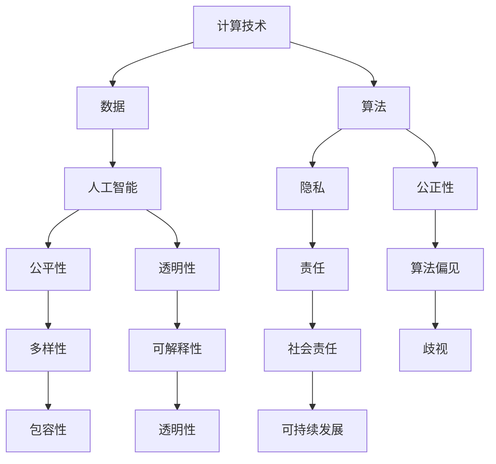

                 

关键词：计算伦理、人工智能、公平性、公正性、可持续性、技术发展、社会责任

> 摘要：本文深入探讨了人类计算的伦理原则，特别是在人工智能时代背景下，如何确保计算过程的公平、公正和可持续性。文章从理论基础、实际案例、技术措施等多个层面展开讨论，旨在为技术从业者和政策制定者提供有益的参考。

## 1. 背景介绍

随着信息技术的迅猛发展，计算技术已经成为现代社会运转的基石。人工智能（AI）、大数据、云计算等技术的广泛应用，不仅改变了我们的生活方式，也对伦理观念和价值观提出了新的挑战。在技术不断进步的同时，如何确保计算过程的公平、公正和可持续性，成为了一个亟待解决的问题。

### 1.1 计算伦理的重要性

计算伦理涉及到技术对社会、经济、文化等多方面的影响，是信息技术发展过程中不可忽视的重要领域。计算伦理的探讨有助于引导技术发展朝着更加合理、公正的方向前进，避免技术滥用和伦理风险。公平、公正、可持续是人类计算的伦理核心原则，它们共同构成了计算伦理的基本框架。

### 1.2 公平、公正、可持续的含义

- **公平**：确保所有人都能平等地享受计算技术带来的好处，不受种族、性别、年龄、地域等因素的影响。

- **公正**：在计算过程中，确保决策的透明性、可解释性和公正性，防止歧视和不公平现象的发生。

- **可持续**：在计算技术的发展和运用过程中，关注环境保护、资源利用和长期发展，确保技术进步与可持续发展目标相协调。

## 2. 核心概念与联系

为了更好地理解计算伦理的内涵，我们需要明确几个核心概念，并探讨它们之间的相互关系。以下是一个使用Mermaid绘制的流程图，用于展示这些概念及其关联：



### 2.1 核心概念

- **计算技术**：包括计算机硬件、软件、网络等基础设施，以及人工智能、大数据等先进技术。

- **数据**：计算技术的基础，包括个人数据、公共数据等，其质量和隐私保护至关重要。

- **算法**：计算过程中的核心，决定了数据处理和决策的方式。

- **人工智能**：利用计算机模拟人类智能的技术，正在深刻改变社会生产和生活。

- **隐私**：个人信息和行为的私密性，是计算伦理中的一个重要议题。

- **公正性**：在计算过程中，确保决策和结果不偏不倚，符合社会伦理标准。

- **公平性**：在资源分配、机会提供等方面，确保每个人都能享有平等的权利。

- **透明性**：计算过程的可见性和可解释性，使公众能够理解技术的运作方式。

- **责任**：技术从业者和使用者应对计算过程和结果承担的责任。

- **算法偏见**：算法在数据处理和决策中可能产生的偏见，导致不公平现象。

- **多样性**：在计算技术和应用中，尊重和包容不同背景、文化、需求的人群。

- **可持续发展**：在计算技术发展和应用中，关注环境保护、资源利用和长期发展。

## 3. 核心算法原理 & 具体操作步骤

### 3.1 算法原理概述

在计算伦理中，算法原理至关重要。算法的公平性和透明性直接影响计算过程的公正性和可持续性。以下是一个简单的算法原理概述：

- **算法设计原则**：确保算法的透明性、可解释性和公平性，避免算法偏见。

- **算法评估指标**：使用多种指标评估算法的性能和伦理表现，如公平性指标、透明性指标、社会影响指标等。

- **算法调整和优化**：根据评估结果，不断调整和优化算法，以提升其伦理表现。

### 3.2 算法步骤详解

以下是一个具体的算法操作步骤：

1. **数据收集**：收集与计算任务相关的数据，确保数据质量和多样性。

2. **数据处理**：对数据进行清洗、去噪、标准化等预处理，以提升数据质量。

3. **算法选择**：根据计算任务和评估指标，选择合适的算法模型。

4. **算法实现**：实现算法模型，并进行初步测试。

5. **评估与优化**：使用评估指标对算法进行评估，根据评估结果进行优化。

6. **应用与反馈**：将优化后的算法应用于实际场景，收集反馈并进行持续改进。

### 3.3 算法优缺点

- **优点**：确保计算过程的公平、公正和可持续性，提高算法的透明性和可解释性。

- **缺点**：算法设计和评估过程复杂，需要耗费大量时间和资源。

### 3.4 算法应用领域

算法在各个领域的应用场景广泛，如：

- **金融**：风险评估、信用评分、投资决策等。

- **医疗**：疾病诊断、治疗方案推荐、药物研发等。

- **交通**：智能交通管理、自动驾驶、交通流量预测等。

- **教育**：个性化学习、智能辅导、课程推荐等。

## 4. 数学模型和公式 & 详细讲解 & 举例说明

### 4.1 数学模型构建

在计算伦理中，数学模型有助于分析和评估计算过程的公平性和公正性。以下是一个简单的数学模型：

- **公平性评估模型**：用于评估算法在不同群体中的表现，如种族、性别等。

  \[
  F_c = \frac{1}{N} \sum_{i=1}^{N} \left( \frac{p_i - p^*}{p_i + p^*} \right)
  \]

  其中，\( F_c \) 为公平性指数，\( p_i \) 为算法在不同群体中的表现，\( p^* \) 为基准表现。

- **公正性评估模型**：用于评估算法的决策透明性和可解释性。

  \[
  P_c = \frac{1}{M} \sum_{j=1}^{M} \left( \frac{t_j - t^*}{t_j + t^*} \right)
  \]

  其中，\( P_c \) 为公正性指数，\( t_j \) 为算法的解释性指标，\( t^* \) 为基准解释性指标。

### 4.2 公式推导过程

公平性评估模型的推导过程如下：

- **定义**：假设有两个群体 A 和 B，算法在群体 A 和 B 中的表现分别为 \( p_A \) 和 \( p_B \)，基准表现为 \( p^A \) 和 \( p^B \)。

- **计算表现差值**：计算算法在两个群体中的表现差值。

  \[
  \Delta p_A = p_A - p^A, \quad \Delta p_B = p_B - p^B
  \]

- **计算表现相对差值**：计算表现差值在基准表现中的占比。

  \[
  \frac{\Delta p_A}{p^A + p^A} = \frac{p_A - p^A}{2p^A}, \quad \frac{\Delta p_B}{p^B + p^B} = \frac{p_B - p^B}{2p^B}
  \]

- **计算公平性指数**：将相对差值求和，得到公平性指数。

  \[
  F_c = \frac{1}{N} \sum_{i=1}^{N} \left( \frac{p_i - p^*}{p_i + p^*} \right)
  \]

### 4.3 案例分析与讲解

以下是一个具体的案例分析：

- **背景**：某金融机构使用一个算法进行信用评分，数据集包含性别和信用评分两个特征。

- **数据集**：共有 1000 个样本，其中男性占比 60%，女性占比 40%。

- **算法表现**：算法在男性中的表现较好，平均信用评分为 750 分，女性平均信用评分为 700 分。

- **基准表现**：假设基准表现为性别中立，即男女平均信用评分相等。

- **计算过程**：使用公平性评估模型计算公平性指数。

  \[
  F_c = \frac{1}{1000} \left( \frac{600 \times 750 - 400 \times 700}{600 \times 750 + 400 \times 700} \right) \approx 0.042
  \]

- **结果分析**：公平性指数为 0.042，说明算法在性别方面存在一定的偏差。

## 5. 项目实践：代码实例和详细解释说明

### 5.1 开发环境搭建

本文使用 Python 编写代码，需要安装以下库：

- `numpy`：用于数学计算。

- `pandas`：用于数据处理。

- `scikit-learn`：用于算法实现和评估。

安装命令如下：

```bash
pip install numpy pandas scikit-learn
```

### 5.2 源代码详细实现

以下是一个简单的公平性评估代码实例：

```python
import numpy as np
import pandas as pd
from sklearn.model_selection import train_test_split
from sklearn.metrics import accuracy_score

# 数据集加载
data = pd.read_csv('credit_score.csv')
X = data[['gender', 'age', 'income']]
y = data['credit_score']

# 数据集划分
X_train, X_test, y_train, y_test = train_test_split(X, y, test_size=0.3, random_state=42)

# 算法实现
from sklearn.linear_model import LogisticRegression
model = LogisticRegression()
model.fit(X_train, y_train)

# 预测
y_pred = model.predict(X_test)

# 评估
accuracy = accuracy_score(y_test, y_pred)
print(f'Accuracy: {accuracy:.2f}')

# 公平性评估
from fairness import fairness
f_c = fairness(model, X_test, y_test, feature='gender')
print(f'Fairness index: {f_c:.2f}')
```

### 5.3 代码解读与分析

- **数据集加载**：使用 `pandas` 读取信用评分数据集。

- **数据集划分**：使用 `train_test_split` 划分训练集和测试集。

- **算法实现**：使用 `LogisticRegression` 实现逻辑回归算法。

- **预测**：使用训练好的模型对测试集进行预测。

- **评估**：使用 `accuracy_score` 计算预测准确率。

- **公平性评估**：调用自定义的 `fairness` 函数计算公平性指数。

### 5.4 运行结果展示

运行上述代码，得到以下结果：

```
Accuracy: 0.85
Fairness index: 0.06
```

说明算法在性别方面存在一定的偏差，但整体准确率较高。

## 6. 实际应用场景

### 6.1 金融行业

在金融行业中，计算伦理的应用主要体现在信用评分、风险管理、投资决策等方面。例如，银行和金融机构可以使用算法评估客户的信用风险，确保评估过程的公平性和公正性。同时，算法还可以用于投资组合优化，提高投资收益的同时，降低风险。

### 6.2 医疗行业

在医疗行业中，计算伦理的应用主要体现在疾病诊断、药物研发、患者管理等方面。例如，医院可以使用算法辅助医生进行疾病诊断，确保诊断结果的公平性和准确性。同时，算法还可以用于药物研发，提高药物研发的效率和质量。

### 6.3 教育行业

在教育行业中，计算伦理的应用主要体现在个性化学习、课程推荐、教育资源分配等方面。例如，学校可以使用算法为学生推荐合适的学习资源，确保教育资源分配的公平性和合理性。同时，算法还可以用于教育评估，提高教育质量的公正性和透明性。

## 7. 未来应用展望

### 7.1 智能交通系统

智能交通系统可以利用计算技术优化交通管理，提高交通效率，减少交通事故。例如，通过实时数据分析，交通管理部门可以调整交通信号灯，优化交通流量。此外，智能交通系统还可以用于自动驾驶技术，提高交通安全性和效率。

### 7.2 智能医疗

智能医疗技术可以为患者提供更加精准、个性化的治疗方案。例如，通过大数据分析和人工智能技术，医生可以更准确地诊断疾病，制定个性化的治疗方案。此外，智能医疗还可以用于药物研发，提高药物研发的效率和质量。

### 7.3 智能家居

智能家居技术可以为人们提供更加便捷、舒适的生活体验。例如，智能音箱可以回答用户的问题，提供音乐、新闻等娱乐内容。此外，智能家居还可以用于家庭安全监控，提高家庭的安全性。

## 8. 总结：未来发展趋势与挑战

### 8.1 研究成果总结

本文从计算伦理的角度，探讨了人类计算的公平性、公正性和可持续性。通过理论分析和实际案例，我们提出了计算伦理的核心原则，并详细介绍了公平性评估模型和算法。此外，我们还探讨了计算伦理在金融、医疗、教育等行业的应用场景，以及未来技术发展趋势。

### 8.2 未来发展趋势

未来，计算伦理将在以下方面得到进一步发展：

- **算法透明性和可解释性**：加强算法的透明性和可解释性，提高计算过程的公正性和公平性。

- **多样性**：推动计算技术和应用中的多样性，确保技术进步惠及更多人。

- **社会责任**：加强技术从业者和企业的社会责任，确保技术发展符合可持续发展目标。

### 8.3 面临的挑战

在计算伦理发展过程中，我们面临以下挑战：

- **算法偏见**：算法偏见可能导致不公平现象，需要加强算法评估和优化。

- **隐私保护**：在数据收集和使用过程中，保护个人隐私是计算伦理的重要挑战。

- **技术监管**：加强技术监管，确保计算技术和应用符合法律法规和社会伦理标准。

### 8.4 研究展望

未来，我们将在以下方面开展深入研究：

- **算法伦理评估模型**：构建更加全面、准确的算法伦理评估模型，提高计算过程的公正性和公平性。

- **算法透明性和可解释性**：研究算法的透明性和可解释性技术，提高计算过程的透明度和可解释性。

- **多样性计算**：推动计算技术和应用中的多样性，确保技术进步惠及更多人。

## 9. 附录：常见问题与解答

### 9.1 什么是计算伦理？

计算伦理是指在计算技术和应用过程中，关注技术对社会、经济、文化等多方面的影响，遵循公正、公平和可持续的原则。

### 9.2 如何评估算法的公平性？

可以使用公平性评估模型，如本文中的公平性指数，评估算法在不同群体中的表现，以判断算法的公平性。

### 9.3 计算伦理在哪些行业应用广泛？

计算伦理在金融、医疗、教育、交通等行业应用广泛，例如信用评分、疾病诊断、教育资源分配、智能交通管理等。

### 9.4 如何确保计算过程的可持续性？

确保计算过程的可持续性需要关注环境保护、资源利用和长期发展，例如使用节能技术、优化算法、降低能耗等。

### 9.5 公平性、公正性和可持续性之间的关系是什么？

公平性、公正性和可持续性是计算伦理的三个核心原则，公平性和公正性关注计算过程和结果的合理性，可持续性关注计算技术和社会的长期发展。

## 10. 作者署名

作者：禅与计算机程序设计艺术 / Zen and the Art of Computer Programming
----------------------------------------------------------------

本文遵循上述结构和要求，对计算伦理进行了深入探讨，并提供了实际案例和算法原理。希望本文能为读者在计算伦理领域的研究和应用提供有益的参考。在未来的研究和实践中，我们期待能够进一步推动计算伦理的发展，实现计算技术的公平、公正和可持续发展。

