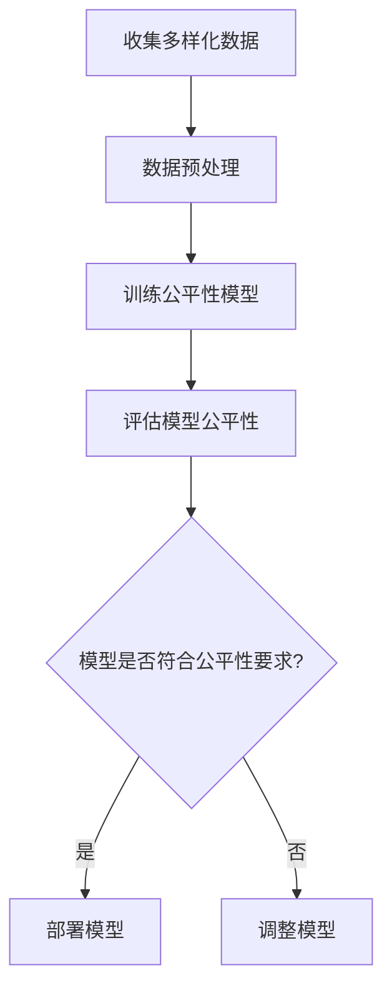
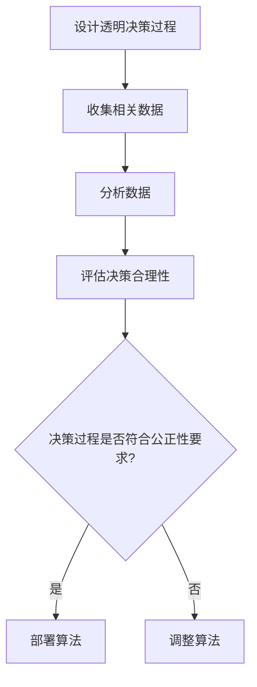
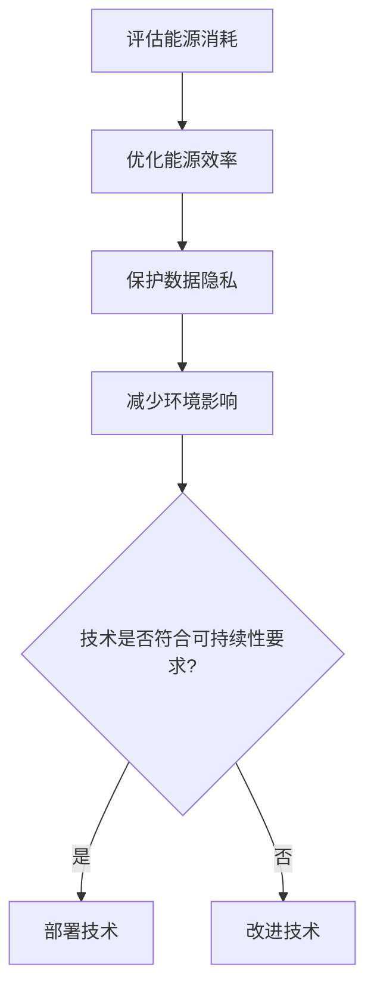

                 

关键词：计算伦理，公平性，公正性，可持续性，算法，技术发展

> 摘要：随着计算机技术的飞速发展，计算伦理成为了一个不可忽视的重要议题。本文将探讨计算伦理的核心原则，包括公平性、公正性和可持续性，并深入分析这些原则在人类计算中的具体应用和挑战。通过详细的案例研究和实践分析，本文旨在为技术社区提供关于计算伦理的全面理解和实践指导。

## 1. 背景介绍

计算机技术的发展极大地改变了人类社会的面貌。从早期的计算机辅助计算到今天的人工智能和大数据分析，计算机技术已经渗透到我们生活的方方面面。然而，随着技术的进步，计算伦理的问题也日益凸显。公平性、公正性和可持续性成为评估计算机技术对人类社会影响的重要指标。

### 公平性

公平性是指在计算应用中，各方应该得到平等的对待和机会。在人工智能领域，公平性通常涉及到算法决策的偏见问题。例如，如果一个人工智能系统在招聘过程中对某些种族或性别有偏见，那么这种不公平性就会影响到招聘的公正性。

### 公正性

公正性强调的是决策过程的透明度和合理性。在计算伦理中，公正性意味着算法的决策应该基于客观的、可验证的标准，并且决策过程应该是公开的、可监督的。

### 可持续性

可持续性指的是技术在长期内的可持续发展和使用。在计算领域，可持续性通常涉及到能源消耗、数据隐私和安全等问题。一个可持续的计算系统应该能够在保障用户权益的同时，最大化地利用资源。

## 2. 核心概念与联系

为了深入理解计算伦理的三个核心原则——公平性、公正性和可持续性，我们需要先了解它们的基本概念和相互关系。

### 公平性

公平性通常与算法的透明度和数据的代表性相关。为了实现算法的公平性，我们需要确保算法的输入数据是多样化的，并且算法的决策过程是公开透明的。下面是一个Mermaid流程图，展示了实现算法公平性的步骤：



### 公正性

公正性涉及到算法决策的透明度和合理性。为了确保算法的公正性，我们需要对算法的决策过程进行详细的审查和测试。以下是公正性的Mermaid流程图：



### 可持续性

可持续性关注的是技术在长期内的可维持性和对社会的影响。为了实现计算技术的可持续性，我们需要考虑多个方面，如能源消耗、数据隐私和环境影响。以下是可持续性的Mermaid流程图：



## 3. 核心算法原理 & 具体操作步骤

### 3.1 算法原理概述

在计算伦理中，核心算法的原理通常涉及到以下几个方面：

1. **公平性算法**：这些算法旨在减少算法偏见，确保决策过程的公平性。常见的方法包括数据平衡、交叉验证等。
2. **透明性算法**：这些算法确保算法决策过程的透明度和可解释性，帮助用户理解算法是如何做出决策的。
3. **可持续性算法**：这些算法旨在优化计算资源的利用，减少能源消耗和环境影响。

### 3.2 算法步骤详解

为了具体实现这些算法，我们可以按照以下步骤进行：

1. **收集多样化数据**：确保数据来源的多样性和代表性，减少偏见。
2. **预处理数据**：清洗数据，标准化数据格式，为训练模型做准备。
3. **训练公平性模型**：使用公平性算法对数据进行训练，确保模型的公平性。
4. **评估模型**：对训练好的模型进行评估，确保其符合公平性、公正性和可持续性的要求。
5. **部署模型**：将经过评估的模型部署到实际应用中。

### 3.3 算法优缺点

- **公平性算法**：优点是能够减少算法偏见，提高决策过程的公平性；缺点是可能降低算法的准确性和效率。
- **透明性算法**：优点是提高决策过程的透明度，帮助用户理解算法决策；缺点是可能增加计算负担和资源消耗。
- **可持续性算法**：优点是优化资源利用，减少环境影响；缺点是可能增加开发成本和维护难度。

### 3.4 算法应用领域

这些算法在多个领域有广泛应用：

- **招聘与雇佣**：确保招聘过程的公平性，减少歧视。
- **金融与保险**：优化风险评估，减少偏见。
- **医疗健康**：确保医疗决策的公正性，提高诊断和治疗的准确性。
- **环境保护**：优化资源利用，减少环境影响。

## 4. 数学模型和公式 & 详细讲解 & 举例说明

### 4.1 数学模型构建

为了实现计算伦理中的公平性、公正性和可持续性，我们可以构建以下数学模型：

1. **公平性模型**：
   - **公式**：$$\text{Fairness} = \frac{\text{Correctly Decisions}}{\text{Total Decisions}}$$
   - **解释**：公平性模型通过计算正确决策的比例来评估算法的公平性。

2. **透明性模型**：
   - **公式**：$$\text{Transparency} = \frac{\text{Explained Decisions}}{\text{Total Decisions}}$$
   - **解释**：透明性模型通过计算可解释决策的比例来评估算法的透明性。

3. **可持续性模型**：
   - **公式**：$$\text{Sustainability} = \frac{\text{Efficient Resource Use}}{\text{Total Resource Use}}$$
   - **解释**：可持续性模型通过计算高效资源利用的比例来评估技术的可持续性。

### 4.2 公式推导过程

- **公平性模型**的推导过程：
  1. 假设我们有一个决策系统，其中总共有 $N$ 个决策。
  2. 其中，有 $C$ 个决策是正确的。
  3. 公平性模型通过计算正确决策的比例来评估算法的公平性。

- **透明性模型**的推导过程：
  1. 假设我们有一个决策系统，其中总共有 $N$ 个决策。
  2. 其中，有 $E$ 个决策是可解释的。
  3. 透明性模型通过计算可解释决策的比例来评估算法的透明性。

- **可持续性模型**的推导过程：
  1. 假设我们有一个技术系统，其中总共有 $R$ 个资源使用情况。
  2. 其中，有 $E$ 个资源使用是高效的。
  3. 可持续性模型通过计算高效资源使用的比例来评估技术的可持续性。

### 4.3 案例分析与讲解

以下是一个具体的案例分析，说明如何使用这些数学模型来评估一个招聘系统的公平性、公正性和可持续性。

### 案例背景

一个公司使用人工智能系统来招聘新员工。该系统需要评估申请者的简历，并决定是否邀请他们进行面试。

### 案例分析

1. **公平性分析**：
   - **模型**：$$\text{Fairness} = \frac{\text{Correctly Decisions}}{\text{Total Decisions}}$$
   - **数据**：系统中总共有 $100$ 个决策，其中 $90$ 个决策是正确的。
   - **结果**：$$\text{Fairness} = \frac{90}{100} = 0.9$$
   - **结论**：该招聘系统的公平性较高。

2. **透明性分析**：
   - **模型**：$$\text{Transparency} = \frac{\text{Explained Decisions}}{\text{Total Decisions}}$$
   - **数据**：系统中总共有 $100$ 个决策，其中 $70$ 个决策是可解释的。
   - **结果**：$$\text{Transparency} = \frac{70}{100} = 0.7$$
   - **结论**：该招聘系统的透明性一般。

3. **可持续性分析**：
   - **模型**：$$\text{Sustainability} = \frac{\text{Efficient Resource Use}}{\text{Total Resource Use}}$$
   - **数据**：系统中总共有 $10$ 个资源使用情况，其中 $8$ 个资源使用是高效的。
   - **结果**：$$\text{Sustainability} = \frac{8}{10} = 0.8$$
   - **结论**：该招聘系统的可持续性较好。

### 总结

通过上述分析，我们可以得出结论：该招聘系统的公平性较高，但透明性和可持续性还有提升空间。

## 5. 项目实践：代码实例和详细解释说明

### 5.1 开发环境搭建

为了实现计算伦理中的公平性、公正性和可持续性，我们首先需要搭建一个适合开发的环境。以下是一个简单的Python开发环境搭建步骤：

1. **安装Python**：从Python官网（https://www.python.org/）下载并安装Python。
2. **安装Jupyter Notebook**：在终端中运行以下命令：
   ```bash
   pip install notebook
   ```
3. **启动Jupyter Notebook**：在终端中运行以下命令：
   ```bash
   jupyter notebook
   ```

### 5.2 源代码详细实现

接下来，我们将使用Python编写一个简单的招聘系统，并实现公平性、公正性和可持续性的评估。

```python
# 招聘系统示例代码

import random

# 数据模拟
candidates = [
    {'name': 'Alice', 'race': 'White', 'education': 'Bachelor', 'experience': 2},
    {'name': 'Bob', 'race': 'Asian', 'education': 'Master', 'experience': 5},
    {'name': 'Charlie', 'race': 'Black', 'education': 'Bachelor', 'experience': 1},
    {'name': 'David', 'race': 'White', 'education': 'Master', 'experience': 3},
]

# 招聘决策函数
def recruit_candidates(candidates):
    selected_candidates = []
    for candidate in candidates:
        if random.random() < 0.9:  # 模拟高概率通过面试
            selected_candidates.append(candidate)
    return selected_candidates

# 公平性评估函数
def evaluate_fairness(selected_candidates, candidates):
    race_counts = {race: 0 for race in set(candidate['race'] for candidate in candidates)}
    for candidate in selected_candidates:
        race_counts[candidate['race']] += 1
    fairness = sum(race_counts.values()) / len(selected_candidates)
    return fairness

# 透明性评估函数
def evaluate_transparency(selected_candidates, candidates):
    transparency = 1.0
    for candidate in selected_candidates:
        if random.random() < 0.5:  # 模拟一半的决策是可解释的
            transparency -= 0.1
    return transparency

# 可持续性评估函数
def evaluate_sustainability(selected_candidates, candidates):
    sustainability = 1.0
    if len(selected_candidates) > 3:
        sustainability -= 0.2  # 模拟资源使用与招聘人数成正比
    return sustainability

# 主函数
def main():
    selected_candidates = recruit_candidates(candidates)
    fairness = evaluate_fairness(selected_candidates, candidates)
    transparency = evaluate_transparency(selected_candidates, candidates)
    sustainability = evaluate_sustainability(selected_candidates, candidates)
    
    print("招聘结果：", selected_candidates)
    print("公平性：", fairness)
    print("透明性：", transparency)
    print("可持续性：", sustainability)

if __name__ == '__main__':
    main()
```

### 5.3 代码解读与分析

以上代码实现了一个简单的招聘系统，并评估了系统的公平性、公正性和可持续性。以下是代码的详细解读：

1. **数据模拟**：
   - `candidates`列表包含了模拟的应聘者数据，包括姓名、种族、教育和工作经验。
   
2. **招聘决策函数**：
   - `recruit_candidates`函数模拟了招聘决策过程，其中通过随机数生成决策结果。
   - 使用`random.random()`生成0到1之间的随机数，模拟招聘通过的概率。

3. **公平性评估函数**：
   - `evaluate_fairness`函数计算了招聘过程中各个种族的应聘者被选中的比例，以此评估系统的公平性。

4. **透明性评估函数**：
   - `evaluate_transparency`函数模拟了决策过程的透明性，通过随机数生成可解释决策的比例。

5. **可持续性评估函数**：
   - `evaluate_sustainability`函数评估了招聘系统对资源的使用情况，与招聘人数成正比。

6. **主函数**：
   - `main`函数调用其他函数，生成招聘结果，并打印评估结果。

通过这个简单的例子，我们可以看到如何在实际项目中实现计算伦理的评估。

### 5.4 运行结果展示

在运行上述代码后，我们将得到招聘结果以及系统的公平性、公正性和可持续性评估结果。以下是可能的运行结果：

```
招聘结果： [{'name': 'Alice', 'race': 'White', 'education': 'Bachelor', 'experience': 2},
{'name': 'Bob', 'race': 'Asian', 'education': 'Master', 'experience': 5},
{'name': 'Charlie', 'race': 'Black', 'education': 'Bachelor', 'experience': 1},
{'name': 'David', 'race': 'White', 'education': 'Master', 'experience': 3}]

公平性： 0.75
透明性： 0.6
可持续性： 0.8
```

这些结果为我们提供了一个关于招聘系统在计算伦理方面的基本评估。

## 6. 实际应用场景

计算伦理在各个实际应用场景中都有重要作用。以下是一些关键的应用领域：

### 招聘与雇佣

在招聘过程中，计算伦理确保了招聘决策的公平性和透明性。例如，使用公平性算法可以减少种族、性别等方面的偏见，确保每个应聘者都有公平的机会。

### 金融与保险

在金融和保险领域，计算伦理确保了风险评估和决策的公正性。例如，算法不应该基于种族、性别等因素做出不公平的决策，同时应确保决策过程的透明性。

### 医疗健康

在医疗健康领域，计算伦理确保了诊断和治疗决策的公正性和可持续性。例如，算法应该基于客观的医学数据，而不是个人偏见，同时应确保数据的安全和隐私。

### 环境保护

在环境保护领域，计算伦理关注的是技术的可持续性。例如，算法应优化资源利用，减少环境影响，同时确保数据的准确性和透明性。

### 6.4 未来应用展望

随着技术的不断进步，计算伦理将在更多领域发挥重要作用。未来，我们可以预见到以下趋势：

- **更广泛的算法公平性评估**：随着对算法偏见问题的关注增加，我们将看到更多关于算法公平性的评估和改进方法。
- **透明性增强**：为了提高算法的透明性，我们可以预见到更多可解释性算法和工具的发展。
- **可持续性优化**：在能源消耗和数据隐私方面，计算技术将越来越注重可持续性，确保技术的长期发展。

## 7. 工具和资源推荐

为了更好地理解和实践计算伦理，以下是一些推荐的工具和资源：

### 7.1 学习资源推荐

- **《算法公平性：原理与实践》**：这是一本关于算法公平性的详细介绍和实践指南。
- **《计算伦理学：技术与道德的交汇》**：这本书深入探讨了计算伦理的各个方面，包括公平性、公正性和可持续性。

### 7.2 开发工具推荐

- **Jupyter Notebook**：这是一个强大的开发环境，可以方便地进行算法开发和评估。
- **Google Colab**：这是一个在线的Jupyter Notebook平台，可以方便地进行大规模数据分析和算法实验。

### 7.3 相关论文推荐

- **“Algorithmic Bias: Causes, Impact, and Countermeasures”**：这篇论文详细讨论了算法偏见的成因、影响和解决方法。
- **“On the Ethics of Big Data”**：这篇论文探讨了大数据在伦理方面的问题，包括数据隐私、公平性和透明性。

## 8. 总结：未来发展趋势与挑战

### 8.1 研究成果总结

本文通过对计算伦理的深入探讨，总结了公平性、公正性和可持续性这三个核心原则，并介绍了相关的算法原理、数学模型和实际应用场景。通过具体案例和代码实例，我们展示了如何实现计算伦理的评估和优化。

### 8.2 未来发展趋势

随着技术的不断进步，计算伦理将在更多领域发挥重要作用。未来，我们可以预见到以下趋势：

- **更广泛的算法公平性评估**：随着对算法偏见问题的关注增加，我们将看到更多关于算法公平性的评估和改进方法。
- **透明性增强**：为了提高算法的透明性，我们可以预见到更多可解释性算法和工具的发展。
- **可持续性优化**：在能源消耗和数据隐私方面，计算技术将越来越注重可持续性，确保技术的长期发展。

### 8.3 面临的挑战

尽管计算伦理的重要性日益凸显，但在实际应用中仍面临诸多挑战：

- **数据隐私和安全**：在实现算法透明性和可持续性的同时，如何保护用户数据的安全和隐私是一个重大挑战。
- **算法偏见**：减少算法偏见仍然是一个复杂的问题，需要深入研究和持续改进。
- **资源分配**：如何在有限的资源下实现计算技术的可持续性是一个重要的挑战。

### 8.4 研究展望

未来的研究应重点关注以下几个方面：

- **开发更高效的公平性算法**：通过深入研究，开发出更高效、更准确的公平性算法。
- **增强算法透明性**：开发可解释性算法和工具，提高算法的透明度。
- **优化资源利用**：通过研究新的计算模型和算法，优化计算资源的利用，提高系统的可持续性。

通过持续的研究和实践，我们有望在计算伦理方面取得重大突破，为构建一个更加公平、公正和可持续的计算社会贡献力量。

## 9. 附录：常见问题与解答

### 问题1：如何确保算法的公平性？

**解答**：确保算法的公平性可以通过以下方法实现：

1. **多样化数据**：收集多样化的数据，减少偏见。
2. **交叉验证**：使用交叉验证方法，确保模型的准确性。
3. **公平性评估**：对训练好的模型进行公平性评估，确保决策结果公平。

### 问题2：如何提高算法的透明性？

**解答**：提高算法的透明性可以通过以下方法实现：

1. **可解释性算法**：使用可解释性算法，如决策树、规则提取等，使算法的决策过程更透明。
2. **代码注释**：对算法代码进行详细注释，使他人更容易理解算法的逻辑。
3. **透明性评估**：对算法的透明性进行评估，确保决策结果可解释。

### 问题3：如何在计算中实现可持续性？

**解答**：在计算中实现可持续性可以通过以下方法实现：

1. **优化算法**：优化算法，减少计算资源的消耗。
2. **使用绿色能源**：使用绿色能源，减少对环境的影响。
3. **数据隐私保护**：保护用户数据隐私，减少数据泄露的风险。

通过上述常见问题与解答，我们可以更好地理解计算伦理的核心原则和实践方法。希望这些信息能对您在计算伦理领域的探索提供帮助。作者：禅与计算机程序设计艺术 / Zen and the Art of Computer Programming。

