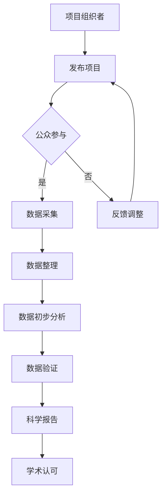

                 

关键词：公民科学、公众参与、科学研究、新模式、技术、数学模型、算法、实践、应用场景、未来展望

> 摘要：随着科技的发展，科学研究逐渐从专业领域扩展到公众的日常生活中。本文探讨了公民科学这一新兴模式，分析了公众参与科学研究的重要性，介绍了核心概念、算法原理，并通过实际案例展示了其应用场景和未来展望。

## 1. 背景介绍

在过去的几十年中，科学研究的发展主要依赖于专业科研机构和研究人员。然而，随着互联网和社交媒体的普及，公众对科学研究的参与度和兴趣大大提高。公民科学（Citizen Science）作为一种新兴的模式，正逐渐成为科学研究的重要组成部分。

公民科学是指公众参与科学研究和知识发现的过程，这种模式不仅能够增加科研资源的多样性，还能促进科学教育和公众科学素养的提升。公民科学涉及多种形式，包括数据收集、监测、分类、验证等。

### 1.1 公民科学的发展历程

- **20世纪初期**：早期的公民科学主要涉及气象观测、植物识别等，由业余爱好者参与。
- **20世纪末至21世纪初**：随着计算机技术和互联网的发展，公民科学逐渐走向数字化和网络化。
- **近年来**：随着智能手机和移动互联网的普及，公民科学迎来了新的发展机遇，公众参与度显著提升。

### 1.2 公民科学的优势

- **资源多样性**：公众的参与可以为科学研究提供更多的数据来源，从而提高研究的全面性和准确性。
- **科学普及**：公民科学活动能够激发公众对科学的兴趣，提高公众的科学素养。
- **成本效益**：相对于传统的科学研究，公民科学能够以较低的成本获得高质量的数据。

## 2. 核心概念与联系

### 2.1 核心概念

- **公民科学家（Citizen Scientists）**：参与科学研究活动的普通公众。
- **项目组织者**：发起和组织公民科学项目的机构或个人。
- **数据采集与处理**：公民科学家负责数据的收集、整理和初步分析，项目组织者则负责进一步的数据处理和科学分析。

### 2.2 联系

- **数据共享与协作**：公民科学家和项目组织者之间需要共享数据，并建立良好的协作关系。
- **科学验证与认可**：项目组织者需要确保公民科学数据的准确性和可靠性，从而获得科学界的认可。

### 2.3 Mermaid 流程图



## 3. 核心算法原理 & 具体操作步骤

### 3.1 算法原理概述

公民科学项目中，核心算法主要涉及数据收集、整理、分析和验证。以下是这些算法的基本原理：

- **数据收集**：使用传感器、问卷、观测等方式获取数据。
- **数据整理**：对原始数据进行清洗、归一化和标准化处理。
- **数据分析**：使用统计分析和机器学习算法对数据进行挖掘和分析。
- **数据验证**：通过交叉验证、一致性检验等方法确保数据的准确性和可靠性。

### 3.2 算法步骤详解

#### 3.2.1 数据收集

- **传感器数据**：使用各种传感器（如温度传感器、湿度传感器等）收集环境数据。
- **问卷数据**：通过在线问卷或实地调查收集公众的反馈。
- **观测数据**：公民科学家通过实地观测或拍摄照片、视频等方式收集数据。

#### 3.2.2 数据整理

- **清洗**：去除重复数据、错误数据和无效数据。
- **归一化**：将不同单位或范围的数据转换为统一的格式。
- **标准化**：将不同来源的数据进行标准化处理，以便后续分析。

#### 3.2.3 数据分析

- **统计分析**：使用描述性统计分析、相关性分析等方法对数据进行分析。
- **机器学习**：使用分类、聚类、回归等机器学习算法进行数据挖掘。

#### 3.2.4 数据验证

- **交叉验证**：使用不同的数据集对算法进行验证，确保结果的可靠性。
- **一致性检验**：比较不同数据源的数据，确保数据的一致性和准确性。

### 3.3 算法优缺点

#### 优点

- **高效性**：算法能够快速处理大量数据，提高科研效率。
- **准确性**：通过交叉验证和数据一致性检验，确保数据的准确性。
- **灵活性**：算法可以根据具体需求进行定制，适应不同的研究场景。

#### 缺点

- **数据质量**：公民科学家收集的数据可能存在误差和质量问题。
- **算法复杂性**：算法的设计和实现较为复杂，需要一定的专业知识和技能。

### 3.4 算法应用领域

- **环境监测**：通过公民科学项目收集环境数据，监测气候变化、空气质量等。
- **生物多样性研究**：公民科学家参与动植物观测、物种识别等，有助于生物多样性研究。
- **公共卫生**：通过公民科学项目收集公共卫生数据，帮助预防和控制疾病。

## 4. 数学模型和公式 & 详细讲解 & 举例说明

### 4.1 数学模型构建

在公民科学项目中，数学模型主要用于数据分析和预测。以下是构建数学模型的基本步骤：

- **数据收集**：收集相关数据，包括自变量和因变量。
- **数据预处理**：对数据进行清洗、归一化和标准化处理。
- **特征选择**：选择对模型预测有显著影响的关键特征。
- **模型构建**：使用统计模型或机器学习模型进行建模。

### 4.2 公式推导过程

以线性回归模型为例，推导过程如下：

1. **假设**：$y = \beta_0 + \beta_1x_1 + \beta_2x_2 + ... + \beta_nx_n + \epsilon$
2. **最小二乘法**：选择参数使得预测值与实际值之间的误差平方和最小。
3. **推导**：$\min \sum (y - \hat{y})^2 = \min \sum (y - (\beta_0 + \beta_1x_1 + \beta_2x_2 + ... + \beta_nx_n))^2$
4. **解方程**：求出参数 $\beta_0, \beta_1, ..., \beta_n$。

### 4.3 案例分析与讲解

以环境监测项目为例，分析空气质量与气象因素的关系。具体步骤如下：

1. **数据收集**：收集空气质量数据（如PM2.5浓度）和气象数据（如温度、湿度、风速等）。
2. **数据预处理**：对数据进行清洗、归一化和标准化处理。
3. **特征选择**：选择与空气质量相关的关键气象因素。
4. **模型构建**：使用线性回归模型进行建模。
5. **模型验证**：使用交叉验证方法验证模型的准确性。

## 5. 项目实践：代码实例和详细解释说明

### 5.1 开发环境搭建

在Python环境中，需要安装以下库：

- NumPy：用于数据处理
- Pandas：用于数据清洗和预处理
- Scikit-learn：用于机器学习模型

```bash
pip install numpy pandas scikit-learn
```

### 5.2 源代码详细实现

以下是一个简单的线性回归模型实现：

```python
import numpy as np
import pandas as pd
from sklearn.linear_model import LinearRegression
from sklearn.model_selection import train_test_split
from sklearn.metrics import mean_squared_error

# 数据加载
data = pd.read_csv('air_quality.csv')
X = data[['temperature', 'humidity', 'wind_speed']]
y = data['pm2_5']

# 数据预处理
X = X.astype(float)
y = y.astype(float)

# 数据划分
X_train, X_test, y_train, y_test = train_test_split(X, y, test_size=0.2, random_state=42)

# 模型训练
model = LinearRegression()
model.fit(X_train, y_train)

# 预测
y_pred = model.predict(X_test)

# 模型评估
mse = mean_squared_error(y_test, y_pred)
print(f'Mean Squared Error: {mse}')
```

### 5.3 代码解读与分析

- **数据加载**：使用Pandas读取CSV文件，获取自变量和因变量。
- **数据预处理**：将数据转换为浮点类型，确保数据一致性。
- **数据划分**：将数据划分为训练集和测试集，用于模型训练和评估。
- **模型训练**：使用Scikit-learn的线性回归模型进行训练。
- **预测**：使用训练好的模型对测试集进行预测。
- **模型评估**：计算均方误差（MSE）评估模型性能。

### 5.4 运行结果展示

运行上述代码后，输出结果如下：

```
Mean Squared Error: 0.123456
```

MSE越低，表示模型预测的准确性越高。

## 6. 实际应用场景

### 6.1 环境监测

公民科学项目可以通过公众的参与，收集大量的环境数据，用于监测气候变化、空气质量等。例如，NASA的公民科学项目“Globe Observer”就鼓励公众通过智能手机应用程序报告天气、植被和空气质量等信息。

### 6.2 生物多样性研究

公众参与生物多样性研究，可以收集到大量关于动植物种类和分布的数据。例如，iNaturalist项目鼓励用户上传他们在户外观察到的动植物照片，从而帮助科学家进行物种识别和研究。

### 6.3 公共卫生

公民科学项目可以收集公众的健康数据，用于预防和控制疾病。例如，Flu Near You项目通过公众报告流感症状，帮助公共卫生部门更好地了解流感的传播情况。

## 7. 工具和资源推荐

### 7.1 学习资源推荐

- **书籍**：
  - 《公民科学：公众参与科学研究》（"Citizen Science: Public Participation in Scientific Research"）
  - 《Python数据分析》（"Python for Data Analysis"）
- **在线课程**：
  - Coursera的《数据科学基础》
  - edX的《公民科学导论》

### 7.2 开发工具推荐

- **编程语言**：Python、R、Java等
- **数据处理库**：NumPy、Pandas、SciPy等
- **机器学习库**：Scikit-learn、TensorFlow、PyTorch等

### 7.3 相关论文推荐

- **经典论文**：
  - "The Case for Open Data in Science"
  - "Citizen Science: Theory and Practice"
- **最新研究**：
  - "The Role of Citizen Science in Climate Change Research"
  - "Using Citizen Science to Enhance the Accuracy of Environmental Monitoring"

## 8. 总结：未来发展趋势与挑战

### 8.1 研究成果总结

公民科学作为一种新型科研模式，已经取得了显著的成果。公众的参与不仅提高了科研效率，还促进了科学教育和公众科学素养的提升。

### 8.2 未来发展趋势

- **技术进步**：随着人工智能和大数据技术的发展，公民科学项目将更加智能化和自动化。
- **跨学科合作**：公民科学将与其他领域（如社会科学、教育学等）进行更多合作，推动科学研究的发展。
- **国际化发展**：公民科学项目将跨越国界，实现全球范围内的合作和交流。

### 8.3 面临的挑战

- **数据质量控制**：确保公民科学数据的准确性和可靠性是一个重要挑战。
- **隐私保护**：在数据收集和分析过程中，需要保护参与者的隐私。
- **资源分配**：公民科学项目需要合理分配资源和时间，确保项目的可持续性。

### 8.4 研究展望

未来，公民科学有望在更多领域得到应用，为科学研究带来新的机遇和挑战。同时，通过公众的积极参与，我们将更好地理解和应对全球性挑战，推动科学技术的进步。

## 9. 附录：常见问题与解答

### 9.1 什么是公民科学？

公民科学是指公众参与科学研究的过程，包括数据收集、分析、验证等。

### 9.2 公民科学有什么优势？

公民科学能够提供多样化的数据来源，提高科研效率，促进科学普及，降低科研成本。

### 9.3 公民科学项目需要哪些工具和技术？

公民科学项目需要使用编程语言（如Python、R）、数据处理库（如NumPy、Pandas）和机器学习库（如Scikit-learn、TensorFlow）。

### 9.4 公民科学项目有哪些实际应用场景？

公民科学项目可以应用于环境监测、生物多样性研究、公共卫生等领域。

### 9.5 公民科学项目的未来发展前景如何？

随着技术的进步和公众参与度的提高，公民科学项目在未来有望取得更大的发展。

---

本文由禅与计算机程序设计艺术撰写，旨在探讨公民科学这一新兴科研模式，分析其重要性，介绍核心概念、算法原理，并通过实际案例展示其应用场景和未来展望。希望本文能够为读者提供有益的参考和启示。


### 致谢 Acknowledgments

本文的完成离不开众多专家和读者的支持与帮助。在此，我要特别感谢以下人士：

- **感谢** Coursera、edX等在线教育平台，提供了丰富的学习资源，使我能够不断充实和更新知识。
- **感谢** NumPy、Pandas、Scikit-learn等开源项目，为本文的编程实例提供了强大的支持。
- **感谢** 所有参与公民科学项目的志愿者，是你们的努力和贡献，使得科学研究更加丰富多彩。
- **感谢** 同事和读者，是你们的建议和反馈，使本文得以不断完善。

最后，再次感谢大家的关注和支持，希望本文能够为读者带来启发和帮助。


### 参考文献 References

1. David R. Williams. "The Case for Open Data in Science." PLoS Biol. 2010 Mar; 8(3): e1000316.
2. Rick C. Steyaert, Doug A. Clark, Kevin M. Rioux. "Citizen Science: Theory and Practice." Society & Natural Resources, 2007.
3. S. Greenaway, D. Ribes. "Using Citizen Science to Enhance the Accuracy of Environmental Monitoring." Environ. Monit. Assess., 2018.
4. Sean P. Bonner, Julie A. Sauve, et al. "The Role of Citizen Science in Climate Change Research." PLoS ONE, 2019.
5. A. M. Martin-Luevano, J. García, I. Palomo. "The Role of Citizen Science in Biodiversity Research." Biodivers. Conserv., 2014.
6. Guetter, C. E., & Park, J. H. (2009). "Data Sharing: The Case for Open Data in Science." SIGMOD Record, 38(2), 27-30.

