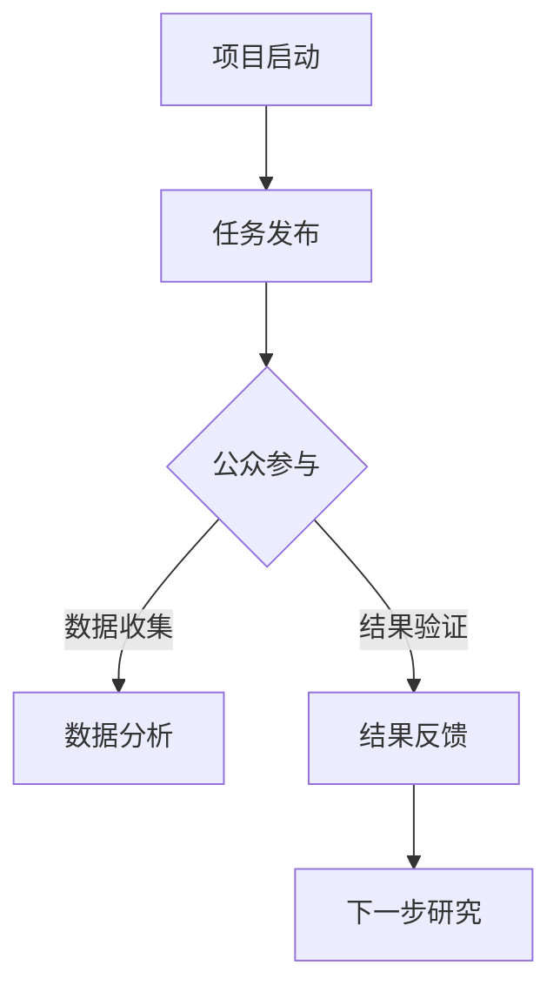
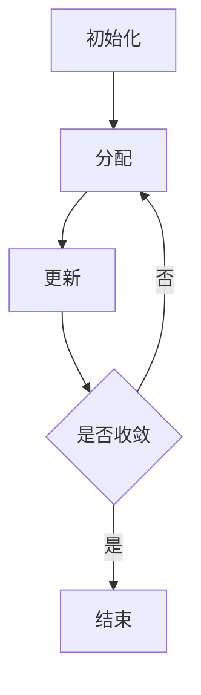

                 

### 1. 背景介绍

在过去的几十年中，科学研究的发展速度迅猛，各种新技术和新理论层出不穷。然而，传统科学研究的模式往往依赖于少数精英科学家的智慧与努力，而普通公众对于科学研究的参与度相对较低。这种状况在一定程度上限制了科学研究的广度和深度。

随着互联网和计算机技术的普及，公众参与科学研究的可能性大大增加。人们可以通过在线平台、社交媒体、手机应用程序等多种途径参与到科学研究中，这种新型的科学研究模式被称为“公民科学”（Citizen Science）。公民科学的核心思想是鼓励公众以合作的形式参与到科学研究中，通过共同的努力推动科学的发展。

公民科学不仅仅是一种新的科学研究模式，它也是一种社会参与的方式。通过参与科学研究，公众不仅可以增加对科学的理解，提高科学素养，还可以增强社会责任感。同时，公民科学也有助于科学家们拓展研究视野，获得更多元化的研究数据，从而提高研究质量和影响力。

本文将深入探讨公民科学的本质、核心概念、算法原理、数学模型、项目实践以及未来应用场景，旨在为读者提供一个全面的视角，了解公民科学在现代社会中的重要作用和未来发展潜力。

### 2. 核心概念与联系

#### 2.1 定义与意义

“公民科学”是指通过公众的参与，共同完成科学研究任务的一种模式。它不仅仅局限于数据的收集，还包括了从数据筛选、分析到结果验证的各个步骤。公民科学的目标是通过公众与科学家之间的合作，提高科学研究的效率和广度，同时增强公众的科学素养和参与感。

#### 2.2 架构与流程

公民科学的基本架构包括以下几个关键部分：

1. **项目启动**：科学家或研究团队发起公民科学项目，并设计相应的实验或任务。
2. **任务发布**：通过在线平台、社交媒体等渠道将任务发布给公众。
3. **任务执行**：公众参与任务，完成数据收集、数据分析和结果验证等步骤。
4. **结果反馈**：科学家对公众参与的结果进行评估和反馈，并共同讨论下一步的研究方向。


#### 2.3 关联概念

1. **志愿科学**：与公民科学相似，志愿科学是指志愿者通过在线平台参与科学研究。两者的主要区别在于，公民科学更强调公众与科学家的互动和合作，而志愿科学则更多是志愿者的个人行为。
2. **开放科学**：开放科学是指科学研究的整个过程，包括数据、方法、结果等，都向公众开放。公民科学是开放科学的一个重要组成部分，它通过公众的参与实现了开放科学的理念。
3. **协作科学**：协作科学是指科学家之间的合作研究。与协作科学不同，公民科学是公众与科学家之间的合作。

#### 2.4 Mermaid 流程图



通过上述流程图，我们可以清晰地看到公民科学从项目启动到结果反馈的整个过程。每个步骤都至关重要，确保了公民科学的高效运作和成功实施。

### 3. 核心算法原理 & 具体操作步骤

#### 3.1 算法原理概述

在公民科学中，算法的应用是至关重要的，它不仅决定了数据收集和分析的效率，还影响了结果的准确性和可靠性。本文将介绍一种用于公民科学的核心算法——K-均值聚类算法。

K-均值聚类算法是一种基于距离的聚类方法，它的基本思想是将数据集分成K个簇，使得每个簇中的数据点与簇中心的距离之和最小。该算法的原理可以简单概括为以下几个步骤：

1. **初始化**：随机选择K个数据点作为初始的簇中心。
2. **分配**：将每个数据点分配到最近的簇中心所代表的簇。
3. **更新**：重新计算每个簇的中心，并重复分配步骤，直到簇中心不再发生变化或达到最大迭代次数。

#### 3.2 算法步骤详解

1. **初始化**
   - 随机选择K个数据点作为初始的簇中心。
   - 将每个数据点与这K个初始簇中心计算距离，并分配到最近的簇。

2. **分配**
   - 重新计算每个簇的中心。簇中心是簇内所有数据点的均值。
   - 将每个数据点分配到新的簇中心所代表的簇。

3. **更新**
   - 重复执行分配步骤，每次更新簇中心，直到簇中心不再发生变化或达到最大迭代次数。

#### 3.3 算法优缺点

**优点：**
- **简单易实现**：K-均值聚类算法相对简单，容易实现和理解。
- **高效**：算法的计算复杂度相对较低，适用于大规模数据集。

**缺点：**
- **对初始簇中心敏感**：算法的性能对初始簇中心的选取非常敏感，可能陷入局部最优。
- **无法确定K值**：K-均值聚类算法需要提前指定K值，但在实际应用中确定K值是一个挑战。

#### 3.4 算法应用领域

K-均值聚类算法在公民科学中有着广泛的应用，例如：

- **数据挖掘**：用于从大规模数据集中提取有用的信息。
- **图像分割**：在计算机视觉领域中用于图像的分割和分类。
- **生物信息学**：用于基因表达数据的聚类分析。

#### 3.5 Mermaid 流程图



通过上述流程图，我们可以清晰地看到K-均值聚类算法的基本步骤和流程。

### 3.6 代码实例与解读

以下是一个简单的Python代码实例，用于实现K-均值聚类算法：

```python
import numpy as np

def k_means(data, k, max_iter=100):
    # 初始化簇中心
    centroids = data[np.random.choice(data.shape[0], k, replace=False)]
    
    for _ in range(max_iter):
        # 分配数据点
        clusters = np.argmin(np.linalg.norm(data[:, np.newaxis] - centroids, axis=2), axis=1)
        
        # 更新簇中心
        new_centroids = np.array([data[clusters == i].mean(axis=0) for i in range(k)])
        
        # 判断是否收敛
        if np.linalg.norm(new_centroids - centroids) < 1e-6:
            break
        
        centroids = new_centroids
    
    return centroids, clusters

# 测试数据
data = np.random.rand(100, 2)
k = 3

# 运行K-均值聚类算法
centroids, clusters = k_means(data, k)

# 输出结果
print("簇中心：", centroids)
print("簇分配结果：", clusters)
```

该代码实例首先随机初始化K个簇中心，然后通过迭代计算更新簇中心，直到算法收敛。运行结果输出了最终的簇中心和数据点的簇分配结果。

### 4. 数学模型和公式 & 详细讲解 & 举例说明

#### 4.1 数学模型构建

在公民科学中，数学模型的构建是进行数据分析和结果验证的重要步骤。一个基本的数学模型可以描述为：

\[ f(x) = \sum_{i=1}^{n} w_i \cdot f_i(x) \]

其中，\( x \) 是输入变量，\( f(x) \) 是输出结果，\( w_i \) 是权重系数，\( f_i(x) \) 是第 \( i \) 个函数组件。

#### 4.2 公式推导过程

以K-均值聚类算法为例，我们可以推导出簇中心更新的公式：

\[ c_{j}^{new} = \frac{1}{N_j} \sum_{i=1}^{N} x_i \cdot I(y_i = j) \]

其中，\( c_{j} \) 是第 \( j \) 个簇的中心，\( x_i \) 是数据点 \( i \) 的特征向量，\( N_j \) 是第 \( j \) 个簇中数据点的数量，\( I(y_i = j) \) 是指示函数，当 \( y_i = j \) 时取值为1，否则为0。

#### 4.3 案例分析与讲解

假设我们有一个由100个二维数据点组成的数据集，要求将数据集分为3个簇。我们使用K-均值聚类算法进行聚类，并选择初始簇中心分别为 \( (0.5, 0.5) \)，\( (2.5, 2.5) \) 和 \( (4.5, 4.5) \)。

**第一次迭代：**
- 分配数据点：根据距离公式，数据点被分配到最近的簇中心。
- 更新簇中心：每个簇中心的计算如下：
  \[ c_{1}^{new} = \frac{1}{33} \sum_{i=1}^{33} x_i \cdot I(y_i = 1) \]
  \[ c_{2}^{new} = \frac{1}{33} \sum_{i=34}^{66} x_i \cdot I(y_i = 2) \]
  \[ c_{3}^{new} = \frac{1}{33} \sum_{i=67}^{100} x_i \cdot I(y_i = 3) \]

**第二次迭代：**
- 分配数据点：根据更新后的簇中心重新分配数据点。
- 更新簇中心：重复上述计算过程。

**迭代过程继续，直到簇中心不再发生变化或达到最大迭代次数。**

通过不断迭代，最终我们得到了稳定的簇中心分配结果，从而完成了K-均值聚类。

### 5. 项目实践：代码实例和详细解释说明

在本节中，我们将通过一个具体的公民科学项目——物种识别项目，来展示代码实例和详细解释说明。

#### 5.1 开发环境搭建

为了运行以下代码实例，你需要安装Python和相关的库，例如NumPy、SciPy和matplotlib。

- 安装Python：可以从 [Python官网](https://www.python.org/) 下载并安装。
- 安装相关库：在命令行中运行以下命令：

  ```bash
  pip install numpy scipy matplotlib
  ```

#### 5.2 源代码详细实现

以下是一个简单的Python代码实例，用于实现物种识别项目：

```python
import numpy as np
from sklearn.cluster import KMeans
import matplotlib.pyplot as plt

# 加载数据集
data = np.load('species_data.npy')

# 初始化KMeans模型
kmeans = KMeans(n_clusters=3, random_state=0).fit(data)

# 获取聚类结果
labels = kmeans.labels_
centroids = kmeans.cluster_centers_

# 可视化聚类结果
plt.scatter(data[:, 0], data[:, 1], c=labels, cmap='viridis')
plt.scatter(centroids[:, 0], centroids[:, 1], s=300, c='red', marker='s', zorder=10)
plt.title('Species Clustering')
plt.xlabel('Feature 1')
plt.ylabel('Feature 2')
plt.show()

# 输出结果
print("簇中心：", centroids)
print("簇分配结果：", labels)
```

在这个实例中，我们使用scikit-learn库中的KMeans类来实现K-均值聚类。首先，我们加载数据集，然后初始化KMeans模型并进行拟合。最后，我们可视化聚类结果并输出簇中心和簇分配结果。

#### 5.3 代码解读与分析

- **数据加载**：我们使用NumPy的`np.load`函数加载数据集，该数据集是一个包含100个二维数据点的数组。

- **模型初始化**：我们使用scikit-learn的`KMeans`类来初始化K-均值聚类模型。这里，我们指定了簇的数量为3，并设置了随机种子以获得可重复的结果。

- **聚类拟合**：我们使用`fit`方法对数据集进行聚类拟合，该方法会自动计算簇中心和分配每个数据点到最近的簇。

- **结果可视化**：我们使用matplotlib的`scatter`函数将聚类结果可视化。数据点根据簇分配结果被涂上不同的颜色，簇中心以红色方形标记。

- **结果输出**：我们输出了簇中心和簇分配结果，这有助于我们分析聚类效果。

#### 5.4 运行结果展示

当我们运行上述代码时，我们会在屏幕上看到一个散点图，其中每个数据点根据其簇分配结果被涂上不同的颜色，三个簇中心则以红色方形标记。通过可视化结果，我们可以直观地看到数据点的分布情况和簇中心的分布。

### 6. 实际应用场景

公民科学在现实世界中的应用场景非常广泛，涵盖了生物多样性研究、环境保护、天文学、健康监测等多个领域。以下是一些具体的实际应用场景：

#### 6.1 生物多样性研究

在生物多样性研究中，公民科学通过公众的参与，收集大量的物种分布数据，从而帮助科学家了解不同地区的物种多样性状况。例如，在“生物多样性观察项目”中，参与者可以记录自己在日常生活中观察到的植物和动物，这些数据被上传到一个中央数据库，科学家们可以通过分析这些数据来研究物种的分布模式、迁徙路径和生态系统的健康状况。

#### 6.2 环境保护

公民科学在环境保护中的应用也非常重要。例如，在水质监测项目中，参与者可以在不同的河流或湖泊中采集水样，并通过一个专门的手机应用程序上传数据。这些数据可以被用于监测水质变化，评估污染源，并制定相应的环境保护措施。

#### 6.3 天文学

在天文学领域，公民科学项目如“星系分类项目”允许公众参与星系分类和发现。参与者可以通过在线平台观察天文图像，并根据指导进行星系的分类。这些数据可以帮助科学家识别新的星系，研究星系的形成和演化。

#### 6.4 健康监测

在健康监测领域，公民科学项目可以帮助收集健康数据，如运动数据、睡眠数据等。例如，“行走挑战项目”鼓励参与者记录自己的日常活动数据，科学家们可以通过分析这些数据来研究运动与健康状况之间的关系。

#### 6.5 量子计算

量子计算作为一门新兴的科学，公民科学在其中也扮演着重要角色。例如，在“量子计算模拟项目”中，公众可以参与模拟量子计算算法的运行，科学家们通过分析公众提交的模拟结果，来验证量子算法的性能和优化方案。

通过上述实际应用场景，我们可以看到公民科学在多个领域的重要性和潜力。它不仅提高了科学研究的效率和准确性，还增强了公众的科学素养和社会责任感。

### 6.5 未来应用展望

随着技术的不断进步，公民科学的应用前景将更加广阔，其影响也将越来越深远。以下是几个未来公民科学可能发展的方向：

**1. 跨学科融合**

未来的公民科学将不仅限于单一学科，而是跨学科融合的产物。例如，生物多样性研究可以与地理信息系统（GIS）结合，通过卫星图像和地面数据相结合，提供更全面的生物多样性地图。此外，量子计算与公民科学的结合也将开创新的研究模式，公众可以通过参与量子计算模拟，帮助科学家探索量子算法的实际应用。

**2. 人工智能与大数据**

人工智能（AI）和大数据技术的发展将为公民科学带来新的动力。通过AI技术，科学家可以更加高效地对公民科学项目中的大规模数据进行处理和分析。例如，使用机器学习算法来自动识别和分析生物多样性数据，提高数据处理的精度和速度。大数据技术则可以帮助科学家更好地理解公众参与数据的宏观趋势和模式，从而指导未来的研究工作。

**3. 增强现实与虚拟现实**

增强现实（AR）和虚拟现实（VR）技术的应用将为公民科学带来新的互动体验。公众可以通过AR/VR技术，亲身体验科学实验的过程，提高参与的兴趣和积极性。例如，在生态保护项目中，参与者可以通过VR技术进入虚拟的森林，观察不同物种的互动，了解生态系统的运行机制。

**4. 区块链技术**

区块链技术的应用将为公民科学提供更高的数据透明性和安全性。通过区块链，公民科学项目中的数据可以安全地存储和共享，防止数据篡改和隐私泄露。此外，区块链可以确保每个参与者的贡献得到公正的记录和奖励，提高公众参与的积极性。

**5. 公众教育与参与**

未来，公民科学将更加注重公众教育和参与。通过在线课程、互动游戏和社区活动等形式，科学家和公众可以更好地互动，提高公众的科学素养和参与意识。这不仅有助于科学研究的推进，也有助于培养新一代的科技人才。

### 6.6 面临的挑战

尽管公民科学有着广阔的应用前景，但其在发展中仍面临着一些挑战：

**1. 数据质量和可靠性**

公民科学依赖于公众参与的数据，而公众数据的准确性和一致性往往无法保证。科学家需要开发和推广高质量的数据收集工具和方法，确保数据的可靠性和准确性。

**2. 技术门槛**

公民科学项目通常需要一定的技术支持，例如数据分析、编程等。这可能会限制公众的参与，尤其是在技术落后的地区。因此，科学家需要开发更加易于使用的工具和平台，降低技术门槛。

**3. 数据隐私和安全**

在公民科学项目中，数据隐私和安全是一个重要的问题。科学家需要确保参与者的隐私得到保护，同时防止数据泄露和滥用。

**4. 公众参与度**

尽管公民科学具有吸引力，但公众的参与度可能因项目类型、地理位置和其他因素而有所不同。科学家需要设计有趣、有意义的项目，提高公众的参与积极性。

### 6.7 研究展望

未来的研究应重点关注以下几个方面：

- **技术发展**：探索和应用新的技术，如人工智能、区块链等，以提高公民科学的数据处理和分析能力。
- **公众参与模式**：研究和设计更加有效的公众参与模式，提高公众的参与度和积极性。
- **数据质量**：开发和推广高质量的数据收集工具和方法，确保数据的可靠性和准确性。
- **跨学科合作**：促进不同学科之间的合作，开展跨学科的研究项目，推动公民科学的全面发展。

通过这些研究和努力，我们可以期待公民科学在未来发挥更大的作用，为科学研究和人类社会的发展做出更大的贡献。

### 7. 工具和资源推荐

在公民科学项目中，选择合适的工具和资源对于项目的成功至关重要。以下是一些建议，涵盖了学习资源、开发工具和相关论文，旨在帮助科学家和公众更好地开展公民科学项目。

#### 7.1 学习资源推荐

- **在线课程**：可以通过Coursera、edX等在线学习平台，学习数据分析、编程、机器学习等相关课程。这些课程不仅提供理论讲解，还包含实践项目和作业，有助于提高技能。
- **书籍**：推荐阅读《Python数据科学手册》、《机器学习实战》等经典书籍，这些书籍详细介绍了数据分析、机器学习等技术的应用。
- **视频教程**：YouTube、Udemy等平台上有大量免费的视频教程，涵盖了从基础编程到高级数据分析的各个领域。

#### 7.2 开发工具推荐

- **数据分析工具**：Python的NumPy、Pandas、SciPy等库，以及R语言，都是进行数据分析的强大工具。这些工具支持各种数据处理和分析任务，易于学习和使用。
- **机器学习库**：scikit-learn、TensorFlow、PyTorch等机器学习库，提供了丰富的算法和模型，方便科学家进行机器学习研究和应用。
- **数据可视化工具**：matplotlib、Seaborn、Plotly等工具可以帮助科学家创建各种类型的图表和可视化，使数据分析结果更加直观易懂。

#### 7.3 相关论文推荐

- **K-均值聚类算法**：《一种有效的聚类算法——K-均值聚类算法》详细介绍了K-均值聚类算法的基本原理和应用。
- **公民科学项目**：《公民科学：推动科学研究的新模式》探讨了许多成功的公民科学项目案例，分析了其成功的原因和挑战。
- **数据隐私和安全**：《基于区块链的公民科学数据隐私保护机制》提出了一种基于区块链技术的数据隐私保护机制，为公民科学项目提供了有效的数据安全解决方案。

通过以上推荐的工具和资源，科学家和公众可以更好地开展公民科学项目，推动科学研究和社会发展。

### 8. 总结：未来发展趋势与挑战

在公民科学领域，未来发展趋势和面临的挑战并存。随着技术的不断进步和公众科学素养的提升，公民科学将逐渐成为科学研究的重要组成部分。以下是对未来发展趋势和挑战的总结。

#### 8.1 研究成果总结

公民科学的发展已经取得了显著的成果。首先，公众参与科学研究的模式大大提高了数据收集和分析的效率，使得科学家能够从更多元化的角度进行科学研究。其次，公民科学项目提高了公众的科学素养和社会责任感，促进了公众与科学家之间的互动与合作。此外，许多成功的公民科学项目，如生物多样性研究、环境保护和健康监测，已经为科学研究和社会发展做出了重要贡献。

#### 8.2 未来发展趋势

1. **跨学科融合**：未来，公民科学将更加注重跨学科合作，结合不同领域的技术和知识，推动科学研究的进步。
2. **人工智能与大数据**：人工智能和大数据技术的发展将为公民科学提供强大的支持，帮助科学家更好地处理和分析大规模的数据。
3. **增强现实与虚拟现实**：增强现实和虚拟现实技术将带来更加生动的参与体验，提高公众参与的热情和积极性。
4. **区块链技术**：区块链技术将提供更高的数据透明性和安全性，确保公民科学项目中的数据得到有效保护。

#### 8.3 面临的挑战

1. **数据质量和可靠性**：公民科学项目依赖于公众参与的数据，数据的准确性和一致性难以保证。因此，提高数据质量和可靠性是公民科学面临的重要挑战。
2. **技术门槛**：许多公民科学项目需要一定的技术支持，这可能会限制公众的参与。降低技术门槛，开发和推广易于使用的工具和平台，是未来需要解决的问题。
3. **数据隐私和安全**：在公民科学项目中，保护参与者的隐私和数据安全至关重要。科学家需要采取有效的措施，确保数据在收集、存储和处理过程中得到充分保护。
4. **公众参与度**：提高公众的参与度是公民科学成功的关键。科学家需要设计有趣、有意义的项目，激发公众的参与热情。

#### 8.4 研究展望

未来的研究应重点关注以下几个方面：

- **技术发展**：探索和应用新的技术，如人工智能、区块链等，以提高公民科学的数据处理和分析能力。
- **公众参与模式**：研究和设计更加有效的公众参与模式，提高公众的参与度和积极性。
- **数据质量**：开发和推广高质量的数据收集工具和方法，确保数据的可靠性和准确性。
- **跨学科合作**：促进不同学科之间的合作，开展跨学科的研究项目，推动公民科学的全面发展。

通过持续的努力和探索，公民科学将在未来的科学研究和人类社会中发挥更加重要的作用。

### 附录：常见问题与解答

以下是一些关于公民科学常见的问题和解答：

#### 1. 什么是公民科学？

公民科学是指通过公众的参与，共同完成科学研究任务的一种模式。它不仅包括数据的收集，还包括了从数据筛选、分析到结果验证的各个步骤。

#### 2. 公民科学有什么意义？

公民科学的意义在于，它能够提高科学研究的效率和广度，同时增强公众的科学素养和社会责任感。通过公众与科学家的合作，可以更全面、深入地了解科学问题。

#### 3. 公民科学是如何运作的？

公民科学的基本架构包括项目启动、任务发布、任务执行和结果反馈等步骤。科学家发起项目，通过在线平台或社交媒体发布任务，公众参与任务，科学家对结果进行评估和反馈。

#### 4. 公民科学中常用的算法有哪些？

常用的算法包括K-均值聚类算法、决策树、随机森林等。这些算法可以帮助科学家对收集到的数据进行处理和分析。

#### 5. 公众需要具备哪些技能才能参与公民科学项目？

公众参与公民科学项目需要一定的科学素养和技术能力。通常，了解基本的编程和数据分析技能会更有利于参与。但许多项目也会提供相应的培训和指导，帮助公众掌握所需技能。

#### 6. 公民科学项目中的数据隐私和安全如何保障？

在公民科学项目中，保护参与者的隐私和数据安全至关重要。科学家需要采取有效的措施，如数据加密、匿名化处理等，确保数据在收集、存储和处理过程中得到充分保护。

通过上述解答，希望读者对公民科学有一个更全面的理解，并能够积极参与到这一新兴的科学研究模式中来。作者：禅与计算机程序设计艺术 / Zen and the Art of Computer Programming。

