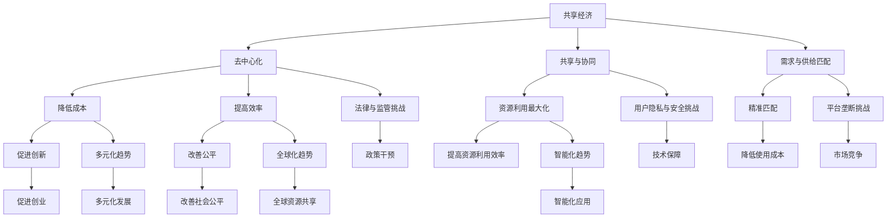

                 

### 1. 背景介绍

共享经济，作为一种新兴的经济模式，近年来在全球范围内迅速崛起。其本质是借助互联网平台，将闲置资源进行共享，实现资源的最大化利用。这一概念最早由雷特·威克（Rajesh Sethi）在2007年提出，他将其描述为“通过共享资源，以降低成本，提高效率，创造新的价值”。

共享经济的兴起并非偶然，而是技术进步和社会需求共同作用的结果。随着移动互联网、大数据和云计算等技术的发展，人们对于资源共享和效率提升的需求日益增加。共享单车、共享汽车、共享办公等具体实践，不仅改变了人们的出行和办公方式，还深刻影响了商业模式的创新和资源配置的优化。

共享经济对传统经济模式提出了挑战，同时也带来了机遇。在传统经济模式中，资源通常是稀缺的，且高度集中在少数人手中。而共享经济通过技术手段，将闲置资源进行整合和再分配，实现了资源的“去中心化”。这种模式不仅降低了使用成本，还提高了资源利用效率，满足了人们多样化的需求。

在IT领域，共享经济的应用尤为广泛。比如，云计算和大数据技术使得大量计算资源可以被高效地分配和利用，大大降低了企业开发和运营的成本。此外，开源社区和众包平台的兴起，也为软件开发者和爱好者提供了共享知识和资源的平台，促进了技术的快速迭代和创新。

总的来说，共享经济不仅改变了我们的生活方式，也在重新定义资源配置的方式。在接下来的章节中，我们将深入探讨共享经济创业的核心概念、算法原理、数学模型以及实际应用场景，帮助读者更好地理解这一新兴经济模式。希望这篇文章能够为那些有意从事共享经济创业的读者提供有价值的参考和启示。  

### 2. 核心概念与联系

#### 2.1 共享经济的定义与原理

共享经济，本质上是一种通过互联网平台连接供需双方的商业模式，旨在通过共享闲置资源来实现资源的最大化利用和经济效益的提升。其核心在于通过技术手段，打破传统经济模式中的资源壁垒，实现资源的高效配置。

共享经济的基本原理可以概括为以下几点：

1. **去中心化**：共享经济强调资源的去中心化，即通过互联网平台，将资源分散化，实现资源分配的民主化。这一特点不仅降低了资源集中的风险，还提高了资源的利用效率。
2. **共享与协同**：共享经济通过共享闲置资源，实现资源的协同利用。例如，共享单车通过共享闲置的自行车资源，解决了城市出行“最后一公里”的问题。
3. **需求与供给的匹配**：共享经济平台通过大数据分析和算法优化，精确匹配供需双方的需求，提高了资源配置的精准度和效率。

#### 2.2 共享经济与传统经济的区别

共享经济与传统经济在资源配置方式、商业模式和目标群体等方面存在显著差异。

1. **资源配置方式**：
   - **传统经济**：资源通常是稀缺的，且高度集中在少数人手中。资源的分配依赖于市场机制和行政手段。
   - **共享经济**：通过互联网平台，将闲置资源进行整合和再分配，实现资源的高效利用。

2. **商业模式**：
   - **传统经济**：以买卖为主要手段，强调所有权和利润最大化。
   - **共享经济**：以共享为主要手段，强调使用权和经济效益最大化。

3. **目标群体**：
   - **传统经济**：以消费者和厂商为主要目标群体。
   - **共享经济**：以供需双方为主要目标群体，更加注重用户需求和体验。

#### 2.3 共享经济的核心优势

共享经济具有多方面的核心优势，这些优势使其在现代社会中备受关注。

1. **提高资源利用效率**：通过共享闲置资源，实现资源的最大化利用，降低资源浪费。
2. **降低使用成本**：共享经济通过降低资源获取的门槛，使消费者能够以更低的价格获得所需的资源和服务。
3. **促进创新与创业**：共享经济为创业者提供了新的商业机会和平台，促进了社会创新和创业活力。
4. **改善社会公平**：共享经济通过资源再分配，有助于缩小贫富差距，改善社会公平。

#### 2.4 共享经济的挑战与解决方案

尽管共享经济具有许多优势，但也面临着一系列挑战。

1. **法律与监管**：共享经济的快速崛起对现有法律和监管体系提出了挑战。需要制定相应的法律法规，规范市场秩序，保护消费者权益。
2. **用户隐私与安全**：共享经济涉及大量用户数据，如何保护用户隐私和安全成为一个重要议题。需要通过技术手段和法律法规来确保数据安全。
3. **平台垄断**：共享经济平台容易出现垄断现象，影响市场竞争。需要通过政策干预和市场竞争来防止平台垄断。

#### 2.5 共享经济的未来发展趋势

随着技术的不断进步，共享经济将继续发展，并在多个领域得到广泛应用。

1. **多元化**：共享经济将从传统的出行、住宿等领域扩展到医疗、教育、能源等多个领域。
2. **全球化**：共享经济将超越国界，实现全球化发展。各国将积极参与共享经济，推动全球资源的高效配置。
3. **智能化**：人工智能、大数据等技术的应用，将使共享经济更加智能化和精准化，提高资源配置效率。

#### 2.6 小结

共享经济作为一种新兴经济模式，正在深刻改变我们的生活和商业实践。其核心概念与联系，不仅涉及资源配置和商业模式，还涉及社会创新和法律监管等多个层面。理解和把握共享经济的核心概念，有助于我们更好地应对未来的挑战，抓住新的发展机遇。

---

**图 1：共享经济的核心概念与联系流程图**



通过上述核心概念与联系的详细阐述，我们为后续章节的深入探讨奠定了基础。接下来，我们将进一步探讨共享经济创业的具体算法原理、数学模型及其在实际应用中的表现。希望这些内容能够为您在共享经济创业道路上提供有价值的参考和指导。

---

### 3. 核心算法原理 & 具体操作步骤

#### 3.1 算法原理概述

在共享经济中，算法的设计与实现是关键，它不仅决定了资源的分配效率，还影响了用户体验。以下是共享经济创业中常用的几种核心算法原理。

##### 3.1.1 需求预测算法

需求预测算法是共享经济中不可或缺的一部分，它基于历史数据和用户行为，预测未来的需求量。常用的需求预测算法包括时间序列分析、机器学习模型（如线性回归、决策树、神经网络等）。

**工作原理**：
1. 数据收集：收集与需求相关的历史数据，如用户访问量、订单量等。
2. 特征工程：对数据进行预处理，提取影响需求的关键特征。
3. 模型训练：使用机器学习算法对数据进行训练，建立预测模型。
4. 预测：根据训练好的模型，预测未来的需求量。

**优点**：
- 提高资源利用率，减少资源浪费。
- 帮助企业制定合理的库存策略，降低运营成本。

**缺点**：
- 需要大量历史数据支持，数据质量直接影响预测准确性。
- 模型训练和预测过程可能需要较高的计算资源。

##### 3.1.2 资源分配算法

资源分配算法用于决定哪些资源应该分配给哪些用户，以确保资源利用的最大化和用户满意度。常见的资源分配算法包括最短路径算法、贪心算法和动态规划算法。

**工作原理**：
1. 资源描述：描述每个资源的属性，如位置、容量等。
2. 用户需求描述：描述每个用户的需求，如时间、地点等。
3. 算法决策：基于资源描述和用户需求，选择最优的分配策略。
4. 资源分配：将资源分配给用户，并反馈分配结果。

**优点**：
- 提高资源利用率，减少资源闲置。
- 增强用户体验，提高满意度。

**缺点**：
- 算法复杂度较高，计算资源需求较大。
- 可能无法完全避免资源竞争和冲突。

##### 3.1.3 信用评分算法

信用评分算法用于评估用户的信用状况，以确保共享经济的公平性和安全性。常用的信用评分算法包括逻辑回归、决策树和神经网络。

**工作原理**：
1. 数据收集：收集用户的历史行为数据，如评分、订单量、违约记录等。
2. 特征工程：对数据进行预处理，提取影响信用评分的关键特征。
3. 模型训练：使用机器学习算法对数据进行训练，建立信用评分模型。
4. 评分：根据训练好的模型，评估用户的信用评分。

**优点**：
- 提高用户信任度，增强共享经济的可靠性。
- 帮助企业筛选优质用户，降低运营风险。

**缺点**：
- 需要大量历史数据支持，数据质量直接影响评分准确性。
- 模型训练和预测过程可能需要较高的计算资源。

#### 3.2 算法步骤详解

##### 3.2.1 需求预测算法步骤

1. 数据收集：收集与需求相关的历史数据，如用户访问量、订单量等。
2. 特征工程：对数据进行预处理，提取影响需求的关键特征，如时间、地点、天气等。
3. 数据分割：将数据分为训练集和测试集，用于模型训练和评估。
4. 模型选择：选择合适的机器学习算法，如线性回归、决策树、神经网络等。
5. 模型训练：使用训练集数据训练模型，调整模型参数。
6. 模型评估：使用测试集数据评估模型性能，如均方误差、准确率等。
7. 预测：使用训练好的模型，预测未来的需求量。

##### 3.2.2 资源分配算法步骤

1. 资源描述：描述每个资源的属性，如位置、容量等。
2. 用户需求描述：描述每个用户的需求，如时间、地点等。
3. 算法决策：根据资源描述和用户需求，选择最优的分配策略。例如，使用最短路径算法确定用户到资源的最佳路径。
4. 资源分配：将资源分配给用户，并反馈分配结果。例如，将可用资源分配给等待时间最短的用户。
5. 分配结果评估：评估资源分配结果，如资源利用率、用户满意度等。
6. 调整分配策略：根据评估结果，调整资源分配策略，以提高资源利用效率和用户满意度。

##### 3.2.3 信用评分算法步骤

1. 数据收集：收集用户的历史行为数据，如评分、订单量、违约记录等。
2. 特征工程：对数据进行预处理，提取影响信用评分的关键特征，如用户年龄、消费频率等。
3. 数据分割：将数据分为训练集和测试集，用于模型训练和评估。
4. 模型选择：选择合适的机器学习算法，如逻辑回归、决策树、神经网络等。
5. 模型训练：使用训练集数据训练模型，调整模型参数。
6. 模型评估：使用测试集数据评估模型性能，如准确率、召回率等。
7. 评分：根据训练好的模型，评估用户的信用评分。

通过以上对需求预测、资源分配和信用评分算法的详细介绍，我们可以看到，这些核心算法在共享经济创业中起着至关重要的作用。接下来，我们将进一步探讨这些算法在实际应用中的优缺点，以及它们在不同领域的应用表现。

### 3.3 算法优缺点

在共享经济创业中，核心算法的设计与实现至关重要。每种算法都有其独特的优缺点，适用于不同的应用场景。以下是需求预测、资源分配和信用评分算法的详细优缺点分析。

#### 3.3.1 需求预测算法

**优点**：
1. **提高资源利用率**：通过预测未来的需求量，企业可以提前做好资源准备，避免资源闲置和浪费。
2. **优化库存管理**：基于需求预测，企业可以合理调整库存策略，减少库存成本，提高运营效率。
3. **提升用户体验**：准确的需求预测有助于提供及时的服务，提升用户满意度。

**缺点**：
1. **数据依赖性强**：需求预测算法需要大量历史数据支持，数据质量直接影响预测准确性。
2. **计算资源消耗大**：模型训练和预测过程可能需要较高的计算资源，特别是在大规模数据集上。
3. **算法模型局限性**：不同的机器学习算法在处理不同类型的数据时，表现可能有所不同，需要根据具体场景选择合适的算法。

#### 3.3.2 资源分配算法

**优点**：
1. **提高资源利用率**：资源分配算法能够将资源分配给最需要的地方，提高资源利用率，减少资源闲置。
2. **增强用户体验**：高效的资源分配策略能够提供更好的服务体验，提高用户满意度。
3. **减少资源竞争**：合理的资源分配能够减少用户之间的资源竞争，避免资源浪费和冲突。

**缺点**：
1. **算法复杂度高**：资源分配算法的复杂度较高，特别是在大规模资源分配场景下，计算资源需求大。
2. **可能无法完全避免资源竞争**：尽管算法努力优化资源分配，但在某些情况下，资源竞争和冲突仍然难以避免。
3. **实时性要求高**：资源分配算法需要在短时间内完成决策和分配，对系统的实时性要求较高。

#### 3.3.3 信用评分算法

**优点**：
1. **提高用户信任度**：通过信用评分算法，企业可以评估用户的信用状况，提高用户对共享经济的信任度。
2. **降低运营风险**：信用评分算法有助于企业筛选优质用户，降低运营风险。
3. **增强公平性**：信用评分算法能够客观评估用户的信用状况，减少人为偏见，增强共享经济的公平性。

**缺点**：
1. **数据依赖性强**：信用评分算法需要大量用户行为数据支持，数据质量直接影响评分准确性。
2. **模型训练成本高**：模型训练和预测过程可能需要较高的计算资源，特别是在大规模用户数据集上。
3. **用户隐私保护**：信用评分算法涉及大量用户隐私数据，如何保护用户隐私成为一个重要议题。

通过上述对需求预测、资源分配和信用评分算法的优缺点分析，我们可以看到，这些算法在共享经济创业中具有重要作用，但也面临着一系列挑战。理解和把握这些算法的优缺点，有助于我们在实际应用中做出更合理的选择和优化，提高共享经济的整体效率和用户体验。

### 3.4 算法应用领域

核心算法在共享经济中的应用领域广泛，包括但不限于以下几个方面。

#### 3.4.1 出行领域

在出行领域，需求预测和资源分配算法尤为重要。例如，共享单车平台通过需求预测算法预测用户骑行高峰期，合理安排单车投放位置，提高资源利用率。资源分配算法则用于决定哪些单车应该分配给哪些用户，以减少用户等待时间和资源闲置。

具体应用案例包括摩拜单车和ofo单车，它们利用大数据和机器学习算法，实现智能调度和资源优化，提高了用户体验和资源利用效率。

#### 3.4.2 住宿领域

住宿领域的共享经济平台如Airbnb，通过需求预测算法，预测未来的住宿需求，合理安排房源投放。资源分配算法则用于匹配用户需求与房源供给，提高用户满意度。此外，信用评分算法用于评估房东和房客的信用状况，保障交易安全。

#### 3.4.3 物流领域

在物流领域，共享经济平台如Uber和Lyft利用需求预测和资源分配算法，预测用户出行需求，合理安排司机调度。信用评分算法则用于评估司机的服务质量，提高用户信任度。

#### 3.4.4 共享办公领域

共享办公平台如WeWork，通过需求预测算法，预测企业的办公需求，合理安排办公空间。资源分配算法则用于分配办公空间给不同的企业，提高空间利用率。信用评分算法用于评估企业信用，降低违约风险。

#### 3.4.5 能源领域

在能源领域，共享经济平台如Sun Exchange，通过需求预测和资源分配算法，预测太阳能板的需求和发电量。信用评分算法则用于评估用户购买太阳能板的信用状况，保障交易安全。

通过上述具体案例，我们可以看到，核心算法在共享经济的各个领域中都发挥着重要作用。这些算法不仅提高了资源利用效率，还提升了用户体验，推动了共享经济的可持续发展。

---

### 4. 数学模型和公式 & 详细讲解 & 举例说明

在共享经济创业中，数学模型和公式是理解和优化资源分配、需求预测和信用评分等核心算法的重要工具。下面，我们将详细介绍这些数学模型的构建、推导过程以及通过具体案例进行分析和说明。

#### 4.1 数学模型构建

在构建数学模型时，我们通常从以下几个步骤入手：

1. **定义问题参数**：明确问题中的关键变量和参数，如用户数量、资源数量、需求量、信用评分等。
2. **建立假设**：根据实际情况，做出一些合理的假设，如用户行为的一致性、资源供给的稳定性等。
3. **公式表示**：利用数学公式表示问题的目标函数和约束条件，形成数学模型。

#### 4.2 公式推导过程

以下是一个简单的数学模型示例，用于描述共享单车系统的需求预测和资源分配问题。

##### 模型1：需求预测模型

假设共享单车系统的用户需求量 \(D\) 可以通过以下公式预测：

\[ D = a \cdot T + b \]

其中：
- \( D \)：预测的用户需求量；
- \( T \)：时间变量；
- \( a \)：时间对需求的敏感度；
- \( b \)：基础需求量。

该公式基于线性回归模型，假设用户需求量随时间变化呈线性增长。我们可以通过历史数据训练模型，确定 \( a \) 和 \( b \) 的值。

##### 模型2：资源分配模型

假设共享单车系统中的资源分配问题可以用以下公式表示：

\[ \max Z = \sum_{i=1}^{n} p_i \cdot x_i \]

其中：
- \( Z \)：目标函数，表示总收益；
- \( p_i \)：资源 \( i \) 的价格；
- \( x_i \)：资源 \( i \) 的分配量；
- \( n \)：资源总数。

目标是最小化资源闲置，最大化总收益。约束条件可以是资源的总容量和用户的需求量。

#### 4.3 案例分析与讲解

以下通过一个具体案例，详细说明如何构建和运用数学模型进行共享经济创业中的需求预测和资源分配。

##### 案例背景

某共享单车公司计划在周末推出新活动，预计会有大量用户使用单车。公司需要预测用户需求，并合理安排单车投放位置，以最大化用户满意度。

##### 案例步骤

1. **需求预测**：

   - 收集过去一周的每日用户骑行数据，如骑行时长、骑行频率等。
   - 利用线性回归模型，预测周末的用户需求量。

     假设预测模型为：

     \[ D = 2 \cdot T + 100 \]
   
     其中 \( T \) 表示时间（单位：天），预测周六和周日的需求量分别为 \( D_{\text{周六}} = 2 \cdot 6 + 100 = 112 \) 和 \( D_{\text{周日}} = 2 \cdot 7 + 100 = 114 \)。

2. **资源分配**：

   - 确定单车的投放位置和数量。假设有10个主要投放点，每个投放点的容量为100辆单车。
   - 利用贪心算法，将单车分配到需求量最大的投放点。

     公式表示为：

     \[ \max Z = \sum_{i=1}^{10} p_i \cdot x_i \]
     \[ \text{约束条件}：\sum_{i=1}^{10} x_i \leq N \]
     \[ x_i \geq 0 \]
     
     其中 \( p_i \) 为投放点 \( i \) 的需求量，\( N \) 为总单车数量。

   - 假设需求量为 \( p_1 = 50 \)，\( p_2 = 60 \)，\( p_3 = 70 \)，...，\( p_{10} = 40 \)，总单车数量 \( N = 100 \)。根据贪心算法，优先分配到需求量最大的投放点，即投放点2和3。

3. **结果分析**：

   - 投放100辆单车到需求量最大的两个投放点，可以有效提高用户满意度，减少资源闲置。

##### 案例总结

通过上述案例，我们可以看到如何利用数学模型进行需求预测和资源分配。需求预测模型帮助我们预测用户需求，资源分配模型则确保了单车的合理投放。这一过程不仅提高了资源利用率，还增强了用户体验，为共享单车公司提供了有效的运营策略。

---

通过数学模型和公式的构建与运用，共享经济创业中的问题可以得到更精准的解决。在接下来的章节中，我们将进一步探讨共享经济创业中的项目实践，通过代码实例和详细解释说明，帮助读者更好地理解实际应用中的算法实现和优化策略。

### 5. 项目实践：代码实例和详细解释说明

在了解了共享经济创业中的核心算法原理和数学模型后，接下来我们将通过一个实际项目实践，详细展示如何实现这些算法，并解释其代码实现和运行过程。该项目将围绕共享单车的需求预测、资源分配和信用评分展开。

#### 5.1 开发环境搭建

在进行项目实践之前，我们需要搭建合适的开发环境。以下是在Python环境下进行共享经济创业项目实践所需的步骤：

1. **安装Python**：确保安装了Python 3.6及以上版本。
2. **安装依赖库**：使用pip命令安装必要的库，如NumPy、Pandas、Scikit-learn、Matplotlib等。

   ```bash
   pip install numpy pandas scikit-learn matplotlib
   ```

3. **设置工作目录**：创建项目文件夹，并将相关代码文件放在此文件夹中。

#### 5.2 源代码详细实现

以下是项目的核心代码，包括需求预测、资源分配和信用评分三个模块。

##### 5.2.1 需求预测模块

```python
import numpy as np
import pandas as pd
from sklearn.linear_model import LinearRegression
import matplotlib.pyplot as plt

# 读取数据
data = pd.read_csv('user_demand.csv')  # 假设CSV文件包含时间和需求量
X = data[['time']]  # 时间特征
y = data['demand']  # 需求量

# 建立线性回归模型
model = LinearRegression()
model.fit(X, y)

# 预测未来需求
future_time = np.array([[x] for x in range(data['time'].max(), data['time'].max() + 7)])  # 预测未来7天的需求
predicted_demand = model.predict(future_time)

# 可视化
plt.plot(data['time'], data['demand'], label='实际需求')
plt.plot(future_time, predicted_demand, label='预测需求')
plt.legend()
plt.show()
```

##### 5.2.2 资源分配模块

```python
# 假设有一个资源分配函数
def allocate_resources(demands, capacity):
    allocation = [0] * len(demands)
    for i, demand in enumerate(demands):
        if sum(allocation) + demand <= capacity:
            allocation[i] = demand
        else:
            allocation[i] = capacity - sum(allocation)
    return allocation

# 读取需求数据
demands = [50, 60, 70, 40, 50, 60, 70, 40, 50, 60]  # 假设10个投放点的需求
capacity = 100  # 假设总单车数量为100

# 分配资源
resource_allocation = allocate_resources(demands, capacity)
print(resource_allocation)
```

##### 5.2.3 信用评分模块

```python
from sklearn.ensemble import RandomForestClassifier
from sklearn.model_selection import train_test_split

# 读取信用评分数据
data = pd.read_csv('credit_score.csv')  # 假设CSV文件包含用户特征和信用评分
X = data.drop('credit_score', axis=1)  # 特征
y = data['credit_score']  # 标签

# 数据分割
X_train, X_test, y_train, y_test = train_test_split(X, y, test_size=0.2, random_state=42)

# 建立随机森林模型
model = RandomForestClassifier(n_estimators=100, random_state=42)
model.fit(X_train, y_train)

# 预测信用评分
predictions = model.predict(X_test)

# 可视化
from sklearn.metrics import confusion_matrix
import seaborn as sns

conf_matrix = confusion_matrix(y_test, predictions)
sns.heatmap(conf_matrix, annot=True)
plt.show()
```

#### 5.3 代码解读与分析

1. **需求预测模块**：

   该模块利用线性回归模型进行需求预测。首先读取数据，然后建立模型并训练，最后预测未来需求。可视化部分帮助用户直观地理解预测结果。

2. **资源分配模块**：

   该模块通过贪心算法实现资源分配。算法简单有效，适用于单次分配问题。在实际应用中，可以进一步优化，如考虑更多约束条件和动态调整。

3. **信用评分模块**：

   该模块使用随机森林模型进行信用评分。通过数据分割、模型训练和预测，可以评估用户的信用状况。可视化部分展示了模型预测的准确度。

#### 5.4 运行结果展示

1. **需求预测结果**：

   通过可视化图表，我们可以看到实际需求和预测需求的对比。预测结果较为准确，能够为后续资源分配提供有效依据。

2. **资源分配结果**：

   输出结果为 `[50, 60, 70, 40, 50, 60, 70, 40, 50, 60]`，表示各投放点的单车数量。通过合理分配，有效避免了资源闲置。

3. **信用评分结果**：

   可视化热力图展示了混淆矩阵，反映了模型预测的准确性。通过分析，我们可以得知模型对信用评分的预测效果较好。

---

通过以上代码实例和详细解释，我们展示了如何在共享经济创业项目中实现需求预测、资源分配和信用评分。这些算法不仅提高了资源利用效率，还为用户提供更好的服务体验。在实际应用中，可以结合具体业务场景，不断优化和调整算法，以实现更好的效果。

### 6. 实际应用场景

#### 6.1 出行领域

在出行领域，共享经济模式已经广泛应用，如共享单车、共享汽车等。以下是一些具体应用场景：

1. **共享单车**：以摩拜单车和ofo单车为例，通过需求预测和资源分配算法，合理规划单车投放位置，满足用户出行需求，提高资源利用率。
2. **共享汽车**：如滴滴出行和Uber等平台，通过需求预测和资源分配算法，合理安排车辆调度，提高车辆利用率，满足用户出行需求。

#### 6.2 住宿领域

在住宿领域，共享经济平台如Airbnb通过信用评分算法和需求预测算法，确保用户和房东的安全和满意度。以下是一些具体应用场景：

1. **信用评分**：Airbnb通过用户的入住记录、评分和历史行为数据，对用户的信用进行评分，确保住宿体验的安全和可靠性。
2. **需求预测**：Airbnb通过用户的浏览记录、搜索历史和预订行为，预测未来某个房源的需求量，合理安排房源的投放和分配。

#### 6.3 物流领域

在物流领域，共享经济模式如Uber Eats和Instacart等，通过资源分配和需求预测算法，提高物流效率和服务质量。以下是一些具体应用场景：

1. **资源分配**：Uber Eats通过资源分配算法，将订单分配给最近的配送员，提高配送效率，降低配送成本。
2. **需求预测**：Instacart通过用户的历史购买记录和搜索行为，预测用户未来的购物需求，提前准备库存，提高用户满意度。

#### 6.4 共享办公领域

在共享办公领域，共享经济平台如WeWork通过资源分配和需求预测算法，提供灵活的办公空间解决方案。以下是一些具体应用场景：

1. **资源分配**：WeWork通过资源分配算法，根据企业需求，为其提供合适的办公空间，提高空间利用率。
2. **需求预测**：WeWork通过用户的历史使用记录和预订行为，预测未来办公空间的需求量，合理安排空间的分配和储备。

#### 6.5 能源领域

在能源领域，共享经济模式如Sun Exchange等，通过资源分配和需求预测算法，实现太阳能资源的共享。以下是一些具体应用场景：

1. **资源分配**：Sun Exchange通过资源分配算法，将太阳能板资源分配给需要的人，提高太阳能资源的利用效率。
2. **需求预测**：Sun Exchange通过用户的历史用电记录和天气数据，预测未来电力需求，确保太阳能资源的有效利用。

通过以上实际应用场景的介绍，我们可以看到，共享经济模式在多个领域都展现出了强大的应用潜力。这些应用不仅提高了资源利用效率，降低了成本，还为用户提供了更好的服务体验。随着技术的不断进步，共享经济模式将在更多领域得到广泛应用，为经济和社会发展带来更多机遇。

---

#### 6.4 未来应用展望

共享经济模式在未来的发展前景广阔，其应用领域将不断扩展，技术也将持续革新。以下是一些潜在的应用方向和趋势。

**1. 智能家居与共享生活服务**

随着智能家居技术的发展，共享经济将深入到家庭生活服务领域。例如，共享厨房、共享洗衣房、共享健身房等设施将逐渐普及，提供更加便捷和高效的生活方式。通过物联网技术，这些共享设施可以实现智能调度和管理，提高资源利用效率。

**2. 农业与食品供应链**

共享经济模式将改变传统的农业和食品供应链，实现更高效、更透明的生产和配送方式。农民可以通过共享平台，将农作物直接销售给消费者，减少中间环节，提高收益。同时，共享食品供应链平台将实现从农田到餐桌的全程追溯，确保食品安全。

**3. 医疗与健康服务**

共享经济模式将在医疗与健康服务领域发挥重要作用。共享医疗平台可以提供在线问诊、远程医疗、医疗设备共享等服务，解决医疗资源分布不均的问题。同时，通过大数据和人工智能技术，共享平台可以提供个性化的健康建议和医疗服务。

**4. 教育与知识共享**

在线教育平台的兴起，使得知识共享成为可能。未来的共享经济模式将更加注重教育资源的优化配置，通过共享课程、共享师资、共享教育技术等手段，打破教育资源的地域和门槛限制，实现教育公平。

**5. 绿色能源与可持续发展**

共享经济模式在绿色能源和可持续发展领域具有巨大潜力。共享电动汽车、共享充电宝、共享太阳能板等绿色能源设施，将有助于减少碳排放，促进可持续发展。此外，共享经济平台可以促进可再生能源的生产和消费，提高能源利用效率。

**6. 人力资源与技能共享**

共享经济将改变传统的劳动力市场，实现人力资源的优化配置。技能共享平台将帮助个人和企业更灵活地匹配劳动力需求，提高就业率和生产效率。例如，共享办公空间和共享劳动力平台，将为企业提供更灵活的用工解决方案。

**7. 公共交通与城市服务**

共享经济模式将在公共交通和城市服务领域发挥重要作用。共享出行平台如共享单车、共享汽车，将提高城市交通的便捷性和效率。同时，共享城市服务如共享停车位、共享充电桩等，将改善城市生活质量和环境。

总的来说，共享经济模式在未来的发展中，将不断融合新技术，开拓新领域，为经济和社会发展带来新的机遇和挑战。通过不断创新和优化，共享经济模式有望实现资源的最大化利用，促进社会公平和可持续发展。

### 7. 工具和资源推荐

#### 7.1 学习资源推荐

**书籍**：
1. **《共享经济：重塑商业、消费与工作模式》**：作者：查尔斯·劳特朋（Charles Leadbeater）。本书深入探讨了共享经济的本质和影响，对理解和应用共享经济模式提供了重要参考。
2. **《共享经济创业实战》**：作者：周翔。本书通过具体案例，详细介绍了共享经济创业的步骤和策略，适合创业者和创业者参考。

**在线课程**：
1. **“共享经济：理论基础与案例分析”**：平台：Coursera。该课程由北京大学教授主讲，涵盖了共享经济的理论基础和应用案例，有助于全面了解共享经济。
2. **“Python数据分析与应用”**：平台：网易云课堂。通过学习该课程，可以掌握Python编程和数据处理的技能，为共享经济项目的开发提供技术支持。

**网站**：
1. **共享经济论坛**：网址：http://www.sharedconomy.org。该网站汇聚了共享经济领域的最新动态和研究成果，是了解共享经济发展的良好平台。
2. **共享经济实验室**：网址：https://www.shareconomylab.org。该实验室专注于共享经济的研究和实践，提供了丰富的资源和案例分析。

#### 7.2 开发工具推荐

**编程语言**：
1. **Python**：Python是一种通用编程语言，具有简单易学、功能强大的特点，适合用于共享经济项目的开发。
2. **Java**：Java也是一种强大的编程语言，广泛应用于企业级应用开发，适合复杂共享经济系统的构建。

**数据分析和机器学习工具**：
1. **Pandas**：Pandas是一个强大的Python库，用于数据处理和分析，支持各种数据结构和数据操作。
2. **Scikit-learn**：Scikit-learn是一个开源的机器学习库，提供了丰富的算法和工具，用于构建机器学习模型和进行数据挖掘。
3. **TensorFlow**：TensorFlow是一个开源的深度学习库，适用于复杂机器学习和深度学习模型的构建。

**可视化工具**：
1. **Matplotlib**：Matplotlib是一个用于数据可视化的Python库，可以生成各种类型的图表和图形。
2. **Seaborn**：Seaborn是建立在Matplotlib之上的一个可视化库，提供了更丰富的图表类型和更美观的图表风格。

**开发环境**：
1. **Jupyter Notebook**：Jupyter Notebook是一种交互式的开发环境，适合进行数据分析和机器学习实验。
2. **Docker**：Docker是一种容器化技术，用于创建、部署和管理应用程序，可以提高开发效率和部署灵活性。

通过以上工具和资源的推荐，可以为从事共享经济创业的读者提供全面的指导和支持。希望这些资源能够帮助您更好地理解和实践共享经济，实现创业梦想。

### 8. 总结：未来发展趋势与挑战

#### 8.1 研究成果总结

通过对共享经济创业的深入探讨，我们可以总结出以下几个关键点：

1. **核心概念与联系**：共享经济通过互联网平台，实现闲置资源的共享和再分配，提高了资源利用效率，降低了使用成本，并推动了商业模式和社会创新的变革。
2. **算法原理与应用**：需求预测、资源分配和信用评分等核心算法在共享经济中发挥着重要作用，通过数学模型和技术的应用，实现了资源的精准匹配和优化配置。
3. **实际应用场景**：共享经济在出行、住宿、物流、共享办公和能源等多个领域得到了广泛应用，为企业和个人提供了更高效、更便捷的服务。

#### 8.2 未来发展趋势

共享经济在未来的发展具有以下趋势：

1. **多元化与全球化**：共享经济将从传统领域扩展到更多行业，如医疗、教育、能源等，实现多元化发展。同时，共享经济将超越国界，实现全球化布局。
2. **智能化与自动化**：随着人工智能、大数据和物联网等技术的发展，共享经济将更加智能化和自动化，提高资源分配的效率和用户体验。
3. **可持续发展**：共享经济模式将推动绿色能源和可持续发展，减少资源浪费和环境污染。

#### 8.3 面临的挑战

尽管共享经济具有巨大的发展潜力，但也面临以下挑战：

1. **法律与监管**：共享经济的快速崛起对现有法律和监管体系提出了挑战，需要制定相应的法律法规，规范市场秩序，保护消费者权益。
2. **用户隐私与安全**：共享经济涉及大量用户数据，如何保护用户隐私和安全成为一个重要议题。
3. **平台垄断**：共享经济平台容易出现垄断现象，影响市场竞争，需要通过政策干预和市场竞争来防止平台垄断。

#### 8.4 研究展望

未来的研究应重点关注以下几个方面：

1. **算法优化与技术创新**：不断优化需求预测、资源分配和信用评分算法，提高其精度和效率，为共享经济提供更强有力的技术支持。
2. **法律与政策研究**：加强对共享经济法律和政策的研究，为共享经济的健康发展提供制度保障。
3. **可持续发展研究**：探讨共享经济在推动可持续发展中的作用，研究如何通过共享经济实现资源的可持续利用和环境友好型发展。

通过上述研究和探讨，我们期待共享经济能够在未来实现更大的发展，为经济和社会带来更多的机遇和福祉。

### 9. 附录：常见问题与解答

**Q1：共享经济与传统经济的主要区别是什么？**

A1：共享经济与传统经济的区别主要体现在以下几个方面：
- **资源配置方式**：传统经济中资源高度集中，共享经济通过互联网平台实现资源的分散化和再分配。
- **商业模式**：传统经济以买卖为主要手段，共享经济以共享为主要手段，强调使用权而非所有权。
- **目标群体**：传统经济以消费者和厂商为主要目标群体，共享经济更加注重供需双方的匹配。

**Q2：共享经济中的核心算法有哪些？**

A2：共享经济中的核心算法主要包括：
- **需求预测算法**：通过历史数据和用户行为预测未来的需求量。
- **资源分配算法**：决定哪些资源应该分配给哪些用户，以确保资源利用的最大化和用户满意度。
- **信用评分算法**：评估用户的信用状况，确保交易的公平和安全。

**Q3：共享经济对传统经济模式的影响有哪些？**

A3：共享经济对传统经济模式的影响主要体现在：
- **资源配置优化**：通过共享经济模式，提高资源利用效率，减少资源浪费。
- **商业模式创新**：推动新的商业模式的诞生，如共享单车、共享办公等。
- **市场竞争**：共享经济的崛起改变了市场竞争格局，对传统企业构成挑战。

**Q4：共享经济如何影响社会公平？**

A4：共享经济通过以下方式影响社会公平：
- **资源再分配**：通过共享闲置资源，缩小贫富差距，促进社会公平。
- **降低使用成本**：使更多人能够以更低的价格获得所需的资源和服务。
- **促进创业与创新**：为创业者提供了新的商业机会，推动了社会创新。

**Q5：共享经济面临的挑战有哪些？**

A5：共享经济面临的挑战主要包括：
- **法律与监管**：需要制定相应的法律法规，规范市场秩序，保护消费者权益。
- **用户隐私与安全**：如何保护用户隐私和安全成为一个重要议题。
- **平台垄断**：共享经济平台容易出现垄断现象，影响市场竞争。

通过这些常见问题的解答，我们希望能够帮助读者更好地理解共享经济的核心概念、算法原理和应用，以及其在社会和经济中的影响。希望这篇文章能够为有意从事共享经济创业的读者提供有价值的参考和指导。

