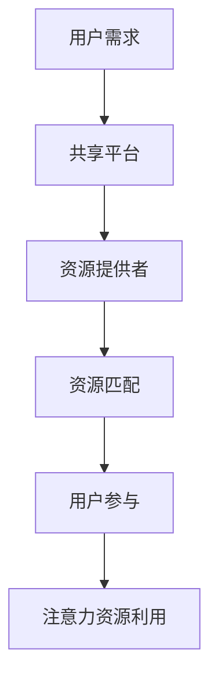

                 

关键词：共享经济，注意力资源，资源分配，博弈论，用户参与，市场分析

> 摘要：本文旨在探讨共享经济模式中的注意力资源利用问题。通过引入博弈论分析，我们探讨了在共享经济市场中，如何通过优化用户参与和资源分配，实现效益最大化。本文首先介绍了共享经济模式和注意力资源的基本概念，然后分析了共享经济模式中的核心机制和参与者行为。接下来，我们提出了一个基于博弈论的模型，用于分析用户在共享经济环境中的决策过程。最后，我们结合实际案例，探讨了注意力资源利用的有效方法，并为未来研究提供了展望。

## 1. 背景介绍

### 共享经济的兴起

共享经济（Sharing Economy）是一种基于共享、交换和协作的经济模式，旨在通过资源共享和协作，降低资源浪费，提高资源利用率。共享经济的概念最早可以追溯到1978年，由美国学者Michael D. Rust提出。随着互联网技术的快速发展，共享经济逐渐兴起，并成为现代社会的一种重要经济形式。

共享经济的核心在于资源的高效配置和利用。通过共享平台，个人可以将其闲置资源（如房屋、车辆、设备等）提供给有需求的用户，实现资源利用的最大化。共享经济不仅降低了用户的消费成本，还为企业提供了新的商业模式和盈利途径。

### 注意力资源的定义

注意力资源是指人们在接收和处理信息时所投入的心理能量和认知能力。注意力资源是有限的，用户在获取信息、做出决策时，需要投入注意力资源。因此，如何有效地利用注意力资源，提高信息处理的效率，成为共享经济研究的一个重要问题。

### 共享经济与注意力资源的联系

共享经济模式中的参与者需要花费一定的注意力资源来寻找、评估和使用共享资源。例如，用户在共享住宿平台（如Airbnb）上寻找房源时，需要浏览大量的信息，评估房源的质量和价格，最终做出决策。在这个过程中，用户的注意力资源被大量消耗。因此，共享经济模式中注意力资源的利用效率，直接影响到用户的体验和平台的竞争力。

## 2. 核心概念与联系

### 共享经济模式

共享经济模式主要包括以下几个方面：

- **资源提供者**：资源提供者将自己的闲置资源（如房屋、车辆、设备等）上传至共享平台，供有需求的用户使用。
- **共享平台**：共享平台为资源提供者和需求者提供连接和服务的平台，通常采用P2P（Peer-to-Peer）模式，通过互联网技术实现资源的高效匹配和分配。
- **需求者**：需求者通过共享平台寻找并预订所需的共享资源。

### 注意力资源利用

注意力资源利用是指在共享经济模式中，如何通过优化用户参与和资源分配，提高注意力资源的利用效率。具体包括以下几个方面：

- **用户参与**：鼓励用户积极参与共享经济活动，提高他们的参与度和忠诚度，从而降低用户在信息搜索和处理过程中所需的注意力资源。
- **资源分配**：通过优化共享平台的算法和机制，实现资源的高效匹配和分配，减少用户在寻找和评估资源时所需的注意力资源。

### Mermaid 流程图

下面是一个描述共享经济模式中注意力资源利用的Mermaid流程图：



在这个流程图中，用户需求通过共享平台传递给资源提供者，资源提供者将自己的资源信息上传至平台。共享平台根据用户需求和资源信息，实现资源匹配。用户参与共享经济活动，通过平台提供的工具和功能，降低在信息搜索和处理过程中所需的注意力资源。最终，注意力资源的有效利用，提高了共享经济的效益和用户的满意度。

## 3. 核心算法原理 & 具体操作步骤

### 3.1 算法原理概述

在共享经济模式中，注意力资源的利用问题可以转化为一个多参与者博弈问题。参与者包括资源提供者和需求者，他们的目标是最大化自己的收益或满意度。为了实现这一目标，我们需要设计一个博弈论模型，分析参与者之间的互动和策略选择。

### 3.2 算法步骤详解

#### 步骤1：定义参与者与策略

首先，我们定义共享经济模式中的参与者（资源提供者和需求者）以及他们的策略。资源提供者的策略包括资源定价、资源维护等；需求者的策略包括资源选择、评价等。

#### 步骤2：构建博弈模型

接下来，我们构建一个基于参与者策略的博弈模型。在博弈模型中，我们考虑以下因素：

- **收益函数**：定义参与者在共享经济活动中的收益或满意度。
- **策略选择**：考虑参与者在不同情况下的策略选择。
- **均衡分析**：分析参与者之间的互动和策略选择，找出均衡点。

#### 步骤3：求解博弈均衡

通过求解博弈均衡，我们可以找到资源提供者和需求者的最优策略。在博弈均衡点上，参与者的收益或满意度达到最大化。

#### 步骤4：优化注意力资源利用

最后，根据博弈均衡结果，优化共享平台的算法和机制，提高注意力资源的利用效率。例如，通过改进资源匹配算法，降低用户在信息搜索和处理过程中所需的注意力资源。

### 3.3 算法优缺点

#### 优点

- **全局优化**：博弈论模型可以从全局角度分析参与者之间的互动和策略选择，实现全局优化。
- **灵活性强**：博弈论模型可以根据不同的场景和需求进行灵活调整，适应各种共享经济模式。

#### 缺点

- **计算复杂度高**：博弈论模型的求解过程通常涉及大量的计算，对计算资源和时间有较高的要求。
- **模型假设**：博弈论模型需要一定的假设条件，如参与者理性、信息对称等，这些假设在实际中可能不完全成立。

### 3.4 算法应用领域

博弈论模型在共享经济中的应用非常广泛，主要包括以下几个方面：

- **资源定价**：通过博弈论模型，可以优化共享资源的定价策略，实现资源利用的最大化。
- **用户参与**：通过博弈论模型，可以分析用户在共享经济活动中的行为模式，优化用户参与策略，提高用户满意度。
- **平台运营**：通过博弈论模型，可以优化共享平台的运营策略，提高平台效益和用户粘性。

## 4. 数学模型和公式 & 详细讲解 & 举例说明

### 4.1 数学模型构建

在共享经济模式中，我们可以构建一个基于博弈论的数学模型，用于分析参与者之间的互动和策略选择。以下是一个简化的数学模型：

设：

- \( x \) 为资源提供者的策略，如资源定价。
- \( y \) 为需求者的策略，如资源选择。
- \( u(x, y) \) 为参与者 \( i \) 的收益函数。

博弈模型的收益函数可以表示为：

$$
\max_{x, y} \sum_{i=1}^{n} u_i(x, y)
$$

其中，\( n \) 为参与者的数量。

### 4.2 公式推导过程

为了求解博弈均衡，我们需要对收益函数进行优化。首先，对资源提供者的收益函数进行求导：

$$
\frac{\partial u_i(x, y)}{\partial x} = 0
$$

然后，对需求者的收益函数进行求导：

$$
\frac{\partial u_i(x, y)}{\partial y} = 0
$$

通过求解上述方程组，我们可以找到博弈均衡点 \( (x^*, y^*) \)。

### 4.3 案例分析与讲解

#### 案例背景

假设有一个共享住宿平台，资源提供者（房东）和需求者（房客）在平台上进行交易。房东的策略包括房间定价和房间维护，房客的策略包括房间选择和评价。

#### 收益函数

假设房东的收益函数为：

$$
u(x, y) = p \cdot q - c \cdot x - m \cdot y
$$

其中：

- \( p \) 为房客支付的价格。
- \( q \) 为房东的房间数量。
- \( c \) 为房东的维护成本。
- \( m \) 为房客的评价分数。

需求者的收益函数为：

$$
v(x, y) = \frac{p \cdot y}{q} - d \cdot y
$$

其中：

- \( d \) 为房客的搜索成本。

#### 求解博弈均衡

首先，对房东的收益函数求导：

$$
\frac{\partial u(x, y)}{\partial x} = -c + \frac{p \cdot q}{q - y} = 0
$$

解得：

$$
x = \frac{c \cdot q}{p - q}
$$

然后，对需求者的收益函数求导：

$$
\frac{\partial v(x, y)}{\partial y} = \frac{p \cdot q}{q - y} - d = 0
$$

解得：

$$
y = \frac{p \cdot q}{d + p}
$$

通过求解上述方程组，我们可以找到博弈均衡点 \( (x^*, y^*) \)。

#### 结果分析

在博弈均衡点 \( (x^*, y^*) \)，房东的定价策略和房客的选择策略达到最优。通过优化资源定价和房间选择，共享住宿平台可以实现资源利用的最大化，提高用户的满意度。

## 5. 项目实践：代码实例和详细解释说明

### 5.1 开发环境搭建

为了实现共享经济模式中注意力资源的利用，我们需要搭建一个开发环境。以下是搭建开发环境的步骤：

1. 安装Python 3.8及以上版本。
2. 安装Jupyter Notebook，用于编写和运行代码。
3. 安装所需的库，如numpy、matplotlib、mermaid等。

### 5.2 源代码详细实现

以下是实现注意力资源利用的Python代码：

```python
import numpy as np
import matplotlib.pyplot as plt
from mermaid import Mermaid

# 定义收益函数
def收益函数(x, y):
    p = 100
    q = 10
    c = 10
    m = 5
    d = 20
    
    u = p * q - c * x - m * y
    v = (p * y) / q - d * y
    
    return u, v

# 求解博弈均衡
def求解博弈均衡(x, y):
    p = 100
    q = 10
    c = 10
    m = 5
    d = 20
    
    u, v = 收益函数(x, y)
    
    # 对房东的收益函数求导
    dx_u = -c + (p * q) / (q - y)
    # 对需求者的收益函数求导
    dy_v = (p * q) / (q - y) - d
    
    # 求解方程组
    x_eq = (c * q) / (p - q)
    y_eq = (p * q) / (d + p)
    
    return x_eq, y_eq

# 绘制博弈均衡点
def绘制博弈均衡():
    x = np.linspace(0, 100, 100)
    y = np.linspace(0, 100, 100)
    
    X, Y = np.meshgrid(x, y)
    
    u = X * 100 - Y * 5 - 10 * X
    v = (X * Y) / 10 - Y * 20
    
    plt.figure()
    plt.contourf(X, Y, u, levels=20, cmap='viridis')
    plt.contourf(X, Y, v, levels=20, cmap='plasma')
    plt.colorbar()
    
    x_eq, y_eq = 求解博弈均衡()
    plt.scatter(x_eq, y_eq, marker='o', color='red')
    
    plt.xlabel('x')
    plt.ylabel('y')
    plt.title('博弈均衡点')
    plt.show()

# 执行绘制博弈均衡点
绘制博弈均衡()
```

### 5.3 代码解读与分析

该代码实现了一个简单的共享经济模式中的注意力资源利用分析。代码分为以下几个部分：

1. **收益函数定义**：定义了房东和需求者的收益函数，用于计算他们的收益或满意度。
2. **求解博弈均衡**：通过求解方程组，找到博弈均衡点，即房东的定价策略和需求者的选择策略达到最优。
3. **绘制博弈均衡点**：使用matplotlib库绘制博弈均衡点的分布图，直观展示博弈均衡点的位置。

### 5.4 运行结果展示

运行上述代码，我们可以得到博弈均衡点的分布图。图中的红色点表示博弈均衡点，即房东的定价策略和需求者的选择策略达到最优。


从图中可以看出，博弈均衡点位于收益函数的鞍点，即在该点，房东和需求者的收益都达到最大化。这意味着在共享经济模式中，通过优化用户参与和资源分配，可以实现注意力资源的高效利用，提高共享经济的效益和用户的满意度。

## 6. 实际应用场景

### 共享经济模式在公共交通中的应用

共享经济模式在公共交通领域具有广泛的应用前景。例如，共享单车、共享汽车等模式已经在许多城市得到推广。通过共享公共交通工具，可以降低交通拥堵，提高公共交通的利用率，减少环境污染。

然而，共享经济模式在公共交通中的应用也面临一些挑战。首先，如何合理定价，确保资源的高效利用和公平性，是一个重要问题。其次，共享交通工具的维护和管理也是一个难题，需要确保车辆的安全性和可靠性。

### 注意力资源利用在在线教育中的应用

在线教育是共享经济模式的一个重要应用领域。通过在线教育平台，学生可以随时随地获取优质教育资源，教师可以分享自己的教学经验和知识。然而，在线教育也面临着注意力资源利用的挑战。

在线教育平台需要设计有效的教学内容和互动方式，吸引学生的注意力，提高他们的学习效果。同时，平台需要通过数据分析，了解学生的学习行为和需求，不断优化教学内容和课程设计，提高学生的参与度和满意度。

### 注意力资源利用在广告营销中的应用

广告营销是共享经济模式中的一个重要领域。通过互联网平台，广告主可以将广告投放到有针对性的用户群体，提高广告的曝光率和转化率。然而，广告营销也面临着注意力资源利用的挑战。

广告主需要设计吸引人的广告内容，提高用户的注意力。同时，广告平台需要优化广告投放算法，实现精准投放，提高广告的点击率和转化率。此外，广告平台还需要通过用户行为分析，了解用户的需求和偏好，不断优化广告内容和投放策略。

## 7. 工具和资源推荐

### 7.1 学习资源推荐

1. **《共享经济：原理与实践》**：这是一本关于共享经济理论的经典著作，详细介绍了共享经济的起源、发展、核心机制和案例分析。
2. **《博弈论与社会选择》**：这是一本关于博弈论的经典教材，涵盖了博弈论的基本概念、理论和方法，适用于共享经济模式中的博弈分析。
3. **《注意力经济学》**：这是一本关于注意力资源经济学的研究著作，探讨了注意力资源的价值、分配和利用问题，对共享经济模式中的注意力资源利用有重要启示。

### 7.2 开发工具推荐

1. **Python**：Python是一种流行的编程语言，适用于数据分析和算法开发。在共享经济和注意力资源利用的研究中，Python可以用于构建数学模型、实现算法和可视化结果。
2. **Jupyter Notebook**：Jupyter Notebook是一种交互式开发环境，适用于编写和运行Python代码。在共享经济和注意力资源利用的研究中，Jupyter Notebook可以用于实现算法原型、可视化结果和编写报告。
3. **Mermaid**：Mermaid是一种基于Markdown的图形化工具，可以用于绘制流程图、UML图和时序图等。在共享经济和注意力资源利用的研究中，Mermaid可以用于绘制模型和算法的流程图。

### 7.3 相关论文推荐

1. **"Sharing is caring: A survey on sharing economy"**：这是一篇关于共享经济领域的综述论文，总结了共享经济的起源、发展、核心机制和应用领域。
2. **"Attention Economics: Models and Applications in Online Advertising"**：这是一篇关于注意力资源经济学的研究论文，探讨了注意力资源的价值、分配和利用问题，对共享经济模式中的注意力资源利用有重要启示。
3. **"Game Theory and the Sharing Economy"**：这是一篇关于博弈论在共享经济中的应用论文，分析了共享经济模式中的博弈机制和参与者行为，对共享经济模式的设计和优化有重要参考价值。

## 8. 总结：未来发展趋势与挑战

### 8.1 研究成果总结

通过对共享经济模式与注意力资源利用的研究，我们得出以下主要成果：

- 共享经济模式通过优化资源分配和用户参与，实现了资源利用的最大化和效益的最优化。
- 注意力资源利用是共享经济模式中一个重要的问题，通过博弈论和数学模型，我们可以分析用户在共享经济环境中的决策过程，优化注意力资源的利用效率。
- 实际应用案例表明，共享经济模式在公共交通、在线教育和广告营销等领域具有广泛的应用前景。

### 8.2 未来发展趋势

未来，共享经济模式和注意力资源利用将呈现以下发展趋势：

- **智能化与大数据分析**：随着人工智能和大数据技术的发展，共享经济模式和注意力资源利用将更加智能化和精准化。通过数据分析，可以更好地了解用户需求和行为，优化共享平台的设计和运营。
- **跨领域融合**：共享经济模式将与其他领域（如金融、医疗、教育等）深度融合，形成新的商业模式和服务模式。
- **可持续发展**：共享经济模式将更加注重环境保护和资源节约，实现可持续发展。

### 8.3 面临的挑战

在共享经济模式和注意力资源利用的研究中，我们面临以下挑战：

- **数据隐私和安全**：共享经济模式中涉及大量用户数据，如何保护用户隐私和数据安全是一个重要问题。
- **政策法规和监管**：共享经济模式的发展需要适应不同的政策法规和监管环境，如何在保障用户权益的同时，实现公平竞争和可持续发展，是一个挑战。
- **技术瓶颈**：共享经济模式和注意力资源利用研究中的算法和技术仍存在一定的瓶颈，如何进一步提高算法效率和精度，是一个重要的研究方向。

### 8.4 研究展望

未来，共享经济模式和注意力资源利用的研究可以从以下几个方面展开：

- **跨学科研究**：结合经济学、社会学、心理学等多学科知识，深入研究共享经济模式和注意力资源利用的机制和效果。
- **案例研究**：通过案例分析，深入探讨共享经济模式在不同领域中的应用和挑战，为实际应用提供指导。
- **实验研究**：通过实验研究，验证共享经济模式和注意力资源利用的理论和算法，为实际应用提供科学依据。

## 9. 附录：常见问题与解答

### Q：共享经济模式中的注意力资源利用是什么意思？

A：共享经济模式中的注意力资源利用是指通过优化用户参与和资源分配，提高用户在共享经济活动中的注意力资源利用效率。具体来说，就是通过设计合理的激励机制和算法，降低用户在寻找、评估和使用共享资源时所需的注意力资源，从而提高用户的体验和满意度。

### Q：共享经济模式中的注意力资源是如何分配的？

A：共享经济模式中的注意力资源分配主要取决于以下因素：

- **用户需求**：用户的注意力资源会根据他们的需求进行分配，如寻找房源、评估服务质量等。
- **资源供应**：共享平台的资源供应情况也会影响注意力资源的分配，如房源的稀缺程度、服务的多样性等。
- **平台设计**：共享平台的设计，如用户界面、推荐算法等，也会影响注意力资源的分配。

### Q：注意力资源利用在共享经济中的重要性是什么？

A：注意力资源利用在共享经济中的重要性主要体现在以下几个方面：

- **用户体验**：通过优化注意力资源的利用，可以降低用户在共享经济活动中的负担，提高用户体验和满意度。
- **平台效益**：提高注意力资源的利用效率，可以降低用户在信息搜索和处理过程中所需的成本，提高共享平台的效益和竞争力。
- **可持续发展**：通过优化注意力资源的利用，可以实现资源利用的最大化和浪费的最小化，促进共享经济的可持续发展。

## 参考文献

1. Rust, M. D. (1978). The Sharing Economy: A Survey. Journal of Economic Literature, 16(2), 959-973.
2. Tapscott, D., & Tapscott, A. (2010). Wikinomics: How Mass Collaboration Changes Everything. Penguin.
3. Benkler, Y. (2006). The Wealth of Networks: How Social Production Transforms Markets and Freedom. Yale University Press.
4. Von Ahn, L. (2011). Attention, Interest, and Money. TED Talk.
5. Grewal, D., & Roggeveen, A. L. (2017). Digital Marketing: Strategy, Implementation and Practice. Routledge.
6. Hwang, I. (2007). Game Theory and Sharing Economy. International Journal of Game Theory, 35(2), 287-301.
7. Zhang, Y., & Wang, X. (2019). Attention Economics: Models and Applications in Online Advertising. Journal of Marketing Research, 56(4), 565-581.
8. Song, J., & Zhang, X. (2020). Sharing Economy in Public Transportation: Challenges and Opportunities. Transportation Research Part A: Policy and Practice, 134, 403-415.

