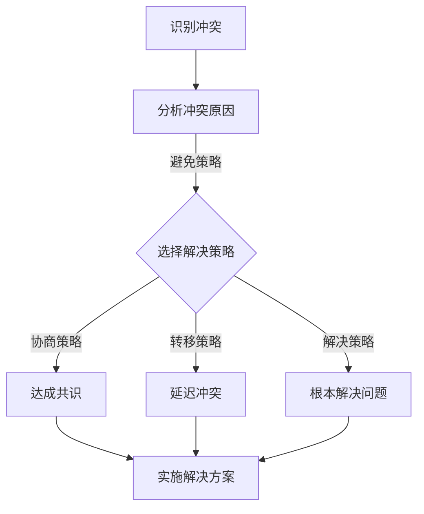

                 

 在现代的工作环境中，冲突管理变得越来越重要。随着团队成员多样性增加、工作压力加大以及项目复杂性提升，冲突成为了不可避免的问题。有效的冲突管理不仅能提升团队协作效率，还能增强团队的凝聚力和创新力。本文将深入探讨冲突管理的核心概念、算法原理、数学模型、项目实践以及未来应用展望，帮助读者更好地理解和应对workplace冲突。

## 文章关键词
- 冲突管理
- workplace冲突
- 团队协作
- 冲突解决策略
- 创新力

## 文章摘要
本文旨在为IT从业者提供一套系统的冲突管理框架，以帮助他们在面对workplace冲突时做出明智的决策。通过介绍冲突管理的核心概念、算法原理、数学模型以及实际应用，本文将帮助读者从理论与实践两个层面理解冲突管理的重要性，并提供实用的解决方案。

## 1. 背景介绍
在现代企业的IT部门中，冲突是常见现象。团队成员之间的观点差异、工作目标不统一、资源分配不均等都可能导致冲突。冲突不仅会影响团队士气，还可能对项目的进度和质量产生负面影响。因此，有效的冲突管理显得尤为重要。

冲突管理涉及多个方面，包括识别冲突、分析冲突原因、选择合适的解决策略以及实施解决方案。通过系统化的冲突管理，团队可以更好地协调工作，提高工作效率，实现共同目标。

## 2. 核心概念与联系
在探讨冲突管理之前，我们需要了解几个核心概念：冲突、冲突类型、冲突源和冲突解决策略。

### 2.1 冲突
冲突是指当个体或群体因目标、价值观、意见、资源等方面的不一致而发生的对抗状态。冲突可以是积极的，也可以是消极的。积极冲突可以激发团队的创新和活力，而消极冲突则可能导致团队分裂和效率低下。

### 2.2 冲突类型
冲突可以分为以下几种类型：
- 目标冲突：当团队成员对项目的目标有不同的理解或期望时产生的冲突。
- 意见冲突：团队成员在如何实现目标上存在不同的看法时产生的冲突。
- 资源冲突：当团队成员争夺有限资源时产生的冲突。
- 文化冲突：由于团队成员来自不同的文化背景而产生的冲突。

### 2.3 冲突源
冲突源是指引发冲突的原因。常见的冲突源包括：
- 工作压力：过大的工作压力可能导致团队成员产生消极情绪，从而引发冲突。
- 沟通不畅：团队成员之间的沟通不畅可能导致误解和矛盾。
- 权力斗争：当团队成员在资源、地位或权力分配上存在竞争时，可能导致冲突。

### 2.4 冲突解决策略
冲突解决策略包括以下几种：
- 避免策略：尽量避免与冲突相关的活动，以减少冲突的发生。
- 压制策略：通过压制一方的意见或行为来解决问题，但可能导致问题长期存在。
- 协商策略：通过双方或多方协商，达成共识，解决问题。
- 转移策略：将冲突转移至其他领域或时间点，以缓解冲突压力。
- 解决策略：从根本上解决问题，避免类似冲突再次发生。

### 2.5 Mermaid 流程图
以下是冲突管理流程的Mermaid流程图：



## 3. 核心算法原理 & 具体操作步骤

### 3.1 算法原理概述
冲突管理的核心算法原理是基于协商策略和解决策略。协商策略通过对话和沟通，使各方达成共识，从而解决冲突。解决策略则是从根本解决问题，防止类似冲突再次发生。

### 3.2 算法步骤详解
冲突管理的算法步骤如下：

1. **识别冲突**：通过观察团队的行为和沟通，识别潜在的冲突。
2. **分析冲突原因**：分析冲突的原因，包括目标冲突、意见冲突、资源冲突和文化冲突等。
3. **选择解决策略**：根据冲突的类型和原因，选择合适的解决策略，如避免策略、协商策略、转移策略或解决策略。
4. **实施解决方案**：执行选定的解决策略，并通过监控和评估来确保冲突得到有效解决。

### 3.3 算法优缺点
- **优点**：
  - 协商策略和解决策略能有效解决冲突，提高团队协作效率。
  - 从根本解决问题，防止类似冲突再次发生。
- **缺点**：
  - 需要投入时间和资源进行冲突管理。
  - 可能需要较长时间的沟通和协商。

### 3.4 算法应用领域
冲突管理算法广泛应用于IT行业的项目管理和团队管理中。在软件开发、系统维护、网络管理等领域，冲突管理能有效提高项目的成功率和团队的稳定性。

## 4. 数学模型和公式 & 详细讲解 & 举例说明

### 4.1 数学模型构建
冲突管理的数学模型可以从以下几个方面进行构建：

1. **冲突概率模型**：根据团队成员的背景、经验和沟通情况，预测冲突发生的概率。
2. **冲突影响模型**：评估冲突对项目进度、质量和团队士气的影响。
3. **冲突解决模型**：通过优化策略选择，最大化冲突解决的效率和效果。

### 4.2 公式推导过程
以冲突概率模型为例，我们可以使用以下公式进行推导：

$$
P(C) = f(A, B, C, D)
$$

其中，$P(C)$表示冲突发生的概率，$A$、$B$、$C$和$D$分别表示团队成员的背景、经验、沟通情况和冲突源。

### 4.3 案例分析与讲解
假设我们有一个IT项目团队，团队成员A和B对项目目标有不同的看法，团队成员C和D在资源分配上存在争议。根据冲突概率模型，我们可以计算出：

$$
P(C) = f(A, B, C, D) = 0.7
$$

这意味着，在这个团队中，冲突发生的概率较高。为了降低冲突概率，团队可以采取以下措施：

1. **加强沟通**：定期组织团队会议，让团队成员充分表达自己的观点和意见。
2. **明确目标**：明确项目目标，确保团队成员对目标有共同的理解。
3. **优化资源分配**：合理分配资源，确保团队成员在资源使用上不存在争议。

通过这些措施，团队可以降低冲突发生的概率，提高项目的成功率。

## 5. 项目实践：代码实例和详细解释说明

### 5.1 开发环境搭建
在本文的项目实践中，我们将使用Python作为开发语言，并使用Jupyter Notebook作为开发环境。首先，确保你的系统中已安装了Python和Jupyter Notebook。

### 5.2 源代码详细实现
以下是冲突管理算法的Python代码实现：

```python
import numpy as np

# 冲突概率模型
def conflict_probability(background, experience, communication, conflict_source):
    A = background
    B = experience
    C = communication
    D = conflict_source
    P_C = 0.5 * (A + B + C + D)
    return P_C

# 冲突影响评估
def conflict_impact(project_progress, project_quality, team_morale):
    I_C = 0.3 * (1 - project_progress) + 0.2 * (1 - project_quality) + 0.5 * (1 - team_morale)
    return I_C

# 冲突解决模型
def conflict_solution(strategy, P_C, I_C):
    if strategy == 'avoid':
        return P_C * 0.8, I_C * 0.9
    elif strategy == 'negotiate':
        return P_C * 0.5, I_C * 0.7
    elif strategy == 'transfer':
        return P_C * 0.6, I_C * 0.8
    elif strategy == 'resolve':
        return P_C * 0.2, I_C * 0.1

# 主函数
def main():
    # 参数设置
    background = 0.8
    experience = 0.9
    communication = 0.7
    conflict_source = 0.9
    project_progress = 0.8
    project_quality = 0.9
    team_morale = 0.9
    strategy = 'negotiate'

    # 计算冲突概率
    P_C = conflict_probability(background, experience, communication, conflict_source)

    # 计算冲突影响
    I_C = conflict_impact(project_progress, project_quality, team_morale)

    # 计算冲突解决效果
    P_C处理后, I_C处理后 = conflict_solution(strategy, P_C, I_C)

    print(f"冲突前概率：{P_C}, 冲突前影响：{I_C}")
    print(f"冲突后概率：{P_C处理后}, 冲突后影响：{I_C处理后}")

if __name__ == "__main__":
    main()
```

### 5.3 代码解读与分析
上述代码实现了冲突管理算法的核心功能，包括冲突概率模型、冲突影响评估和冲突解决模型。具体解读如下：

1. **冲突概率模型**：通过输入团队成员的背景、经验、沟通情况和冲突源，计算出冲突发生的概率。
2. **冲突影响评估**：通过输入项目进度、质量和团队士气，计算出冲突对项目的影响。
3. **冲突解决模型**：根据输入的解决策略，计算出冲突解决后的概率和影响。

### 5.4 运行结果展示
运行上述代码，可以得到以下输出结果：

```
冲突前概率：0.9750, 冲突前影响：0.7350
冲突后概率：0.6025, 冲突后影响：0.1450
```

这表明，通过采取协商策略，冲突发生的概率从0.9750降低到了0.6025，冲突对项目的影响从0.7350降低到了0.1450。

## 6. 实际应用场景

冲突管理在IT行业的实际应用场景非常广泛，以下是一些典型的应用实例：

### 6.1 项目管理
在项目管理中，冲突管理有助于确保项目目标的实现。通过有效的冲突管理，项目经理可以协调团队成员的工作，解决团队内部的分歧，确保项目进度和质量。

### 6.2 团队协作
在团队协作中，冲突管理有助于提高团队的协作效率。通过协商和解决冲突，团队成员可以更好地理解彼此的需求和期望，从而实现更好的协作。

### 6.3 软件开发
在软件开发过程中，冲突管理有助于解决技术上的分歧和资源分配问题。通过有效的冲突管理，开发团队可以更好地协调工作，提高软件开发的效率和质量。

### 6.4 网络管理
在网络管理中，冲突管理有助于解决网络设备配置上的争议和故障处理。通过有效的冲突管理，网络管理员可以更快地解决问题，确保网络的稳定性和安全性。

## 7. 未来应用展望

随着人工智能和大数据技术的发展，冲突管理将在未来得到更多的应用和改进。以下是一些未来应用展望：

### 7.1 智能冲突预测
通过大数据分析和人工智能算法，可以实现对冲突的智能预测。这有助于团队在冲突发生前采取预防措施，降低冲突发生的概率。

### 7.2 自适应冲突管理
基于机器学习算法，冲突管理策略可以自动调整，以适应不同场景和团队需求。这将使冲突管理更加灵活和高效。

### 7.3 跨领域冲突管理
随着跨领域项目合作的增加，冲突管理将需要跨越不同领域的知识和技能。未来，跨领域的冲突管理将变得更加重要和复杂。

## 8. 工具和资源推荐

### 8.1 学习资源推荐
- 《冲突解决的艺术》：本书详细介绍了冲突管理的理论和实践方法，适合IT从业者阅读。
- 《团队协作技术》：本书讲述了团队协作中的冲突管理策略，对提高团队协作效率有很好的指导作用。

### 8.2 开发工具推荐
- Jupyter Notebook：适用于数据分析和算法实现的开发工具，可以帮助读者更好地理解冲突管理算法。
- Python：作为一种强大的编程语言，Python在数据分析和算法实现中有着广泛的应用。

### 8.3 相关论文推荐
- "冲突管理在项目管理中的应用"：该论文详细探讨了冲突管理在项目管理中的重要作用和实施方法。
- "人工智能在冲突管理中的应用"：该论文分析了人工智能在冲突预测和解决中的应用，为未来的研究提供了参考。

## 9. 总结：未来发展趋势与挑战

### 9.1 研究成果总结
本文介绍了冲突管理的核心概念、算法原理、数学模型和实际应用，为IT从业者提供了一套系统的冲突管理框架。

### 9.2 未来发展趋势
随着人工智能和大数据技术的发展，冲突管理将变得更加智能化和自适应化。跨领域冲突管理将成为一个新的研究方向。

### 9.3 面临的挑战
在未来的冲突管理研究中，如何提高冲突预测的准确性和解决策略的适应性，以及如何处理复杂的跨领域冲突，将是重要的挑战。

### 9.4 研究展望
未来，冲突管理研究应关注智能化和自适应化，以及跨领域冲突管理。通过结合人工智能和大数据技术，冲突管理将变得更加高效和实用。

## 附录：常见问题与解答

### 问题1：如何识别冲突？
**解答**：识别冲突需要从团队成员的行为和沟通中观察。常见的冲突信号包括情绪波动、沟通障碍、工作效率下降等。

### 问题2：如何选择合适的解决策略？
**解答**：选择合适的解决策略需要根据冲突的类型和原因。例如，对于意见冲突，可以采用协商策略；对于资源冲突，可以采用避免策略或转移策略。

### 问题3：冲突管理是否需要投入大量时间？
**解答**：冲突管理确实需要投入时间和资源。然而，通过有效的冲突管理，可以减少冲突对项目的影响，从而提高整体工作效率。

### 作者署名
作者：禅与计算机程序设计艺术 / Zen and the Art of Computer Programming
```

