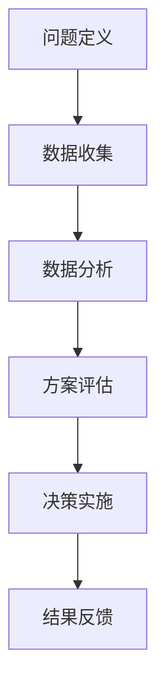

                 

### 摘要

本文旨在探讨决策管理在现代IT领域的核心作用，以及如何通过科学的决策方法来提高关键决策的质量。我们将从背景介绍开始，梳理决策管理的基本概念，深入探讨其原理和架构，分析核心算法及其优缺点，并通过数学模型和实际案例展示如何在实际项目中应用这些算法。随后，文章将讨论决策管理的未来应用前景，推荐相关学习资源和开发工具，并总结未来发展趋势与挑战。

### 关键词
- 决策管理
- 算法优化
- 数学模型
- 实际应用
- 未来展望

### 1. 背景介绍

在信息化高度发展的今天，决策管理作为企业管理和IT领域的一个重要分支，已经逐渐成为了提升组织竞争力的重要手段。决策管理不仅涵盖了传统的业务决策，还涉及了数据驱动的智能决策。随着大数据、人工智能等技术的飞速发展，决策管理的应用场景和深度不断扩展，从简单的业务规则应用到复杂的机器学习预测模型，无不体现决策管理的重要性。

在现代IT领域中，决策管理的重要性主要体现在以下几个方面：

1. **提高效率**：通过科学的决策流程，可以显著提高决策效率，缩短决策周期，减少错误决策带来的损失。
2. **降低风险**：决策管理提供了一套系统的分析方法，帮助企业预见潜在风险，制定有效的应对策略。
3. **增强竞争力**：科学的决策管理可以帮助企业更好地应对市场变化，抓住发展机遇，增强竞争力。
4. **数据驱动**：大数据和人工智能技术为决策管理提供了丰富的数据支持，使得决策更加科学、精准。

然而，尽管决策管理的重要性不言而喻，但在实际应用中，仍存在诸多挑战。如何处理海量数据？如何从数据中提取有价值的信息？如何构建科学的决策模型？这些问题都需要我们在决策管理的研究和应用中不断探索和解决。

### 2. 核心概念与联系

#### 2.1 决策管理的基本概念

决策管理是一种通过系统的方法和工具来支持决策制定的过程。它包括以下几个核心概念：

1. **决策者**：决策者是指负责做出决策的个人或组织。
2. **决策问题**：决策问题是指需要解决的具体问题或面临的挑战。
3. **决策目标**：决策目标是决策者希望达成的具体目标或结果。
4. **决策方案**：决策方案是指为了达成决策目标而制定的具体行动方案。
5. **决策环境**：决策环境是指决策者做出决策时所处的内外部条件。

#### 2.2 决策管理的原理和架构

决策管理的基本原理是通过对问题的分析、评估和优化，找到最优或次优的决策方案。其架构通常包括以下几个部分：

1. **问题定义**：明确决策问题，理解问题的本质和关键因素。
2. **数据收集**：收集与决策相关的数据，确保数据的完整性和准确性。
3. **数据分析**：运用统计学、数据挖掘等方法对数据进行处理和分析，提取有价值的信息。
4. **方案评估**：根据决策目标，对不同的决策方案进行评估和比较，选择最优方案。
5. **决策实施**：将选定的决策方案付诸实践，并根据实际情况进行调整。

#### 2.3 决策管理的 Mermaid 流程图

以下是一个简化的决策管理流程图的 Mermaid 表示：



### 3. 核心算法原理 & 具体操作步骤

#### 3.1 算法原理概述

在决策管理中，常用的算法包括线性规划、决策树、支持向量机、神经网络等。每种算法都有其独特的原理和适用场景。

1. **线性规划**：线性规划是一种通过线性方程组求解最优解的数学方法，适用于资源优化问题。
2. **决策树**：决策树是一种基于特征值进行决策的树形结构，适用于分类和回归问题。
3. **支持向量机**：支持向量机是一种通过最大化分类间隔来分类数据的算法，适用于二分类问题。
4. **神经网络**：神经网络是一种模拟人脑神经元连接的模型，适用于复杂非线性问题的建模和预测。

#### 3.2 算法步骤详解

以决策树为例，其基本步骤如下：

1. **数据准备**：收集并预处理数据，确保数据的质量和一致性。
2. **特征选择**：根据问题需求，选择对决策有重要影响的特征。
3. **划分数据集**：将数据集划分为训练集和测试集，用于模型的训练和验证。
4. **构建决策树**：根据特征值和阈值，递归地划分数据集，构建决策树。
5. **剪枝**：通过剪枝方法，优化决策树的结构，减少过拟合。
6. **评估模型**：使用测试集评估模型的性能，选择最优决策树。

#### 3.3 算法优缺点

每种算法都有其优缺点，适用于不同的应用场景。以下是对几种常用算法的优缺点的简要分析：

1. **线性规划**：
    - 优点：求解过程简单，理论成熟，适用于线性优化问题。
    - 缺点：对非线性问题处理能力有限，需要明确的线性关系。
2. **决策树**：
    - 优点：直观易懂，易于解释，适用于分类和回归问题。
    - 缺点：容易过拟合，对异常值敏感，模型复杂度较高。
3. **支持向量机**：
    - 优点：分类效果好，适用于高维空间，理论基础扎实。
    - 缺点：训练时间较长，对噪声敏感，参数调优复杂。
4. **神经网络**：
    - 优点：强大的建模和预测能力，适用于复杂非线性问题。
    - 缺点：训练过程复杂，容易出现过拟合，对数据质量要求高。

#### 3.4 算法应用领域

不同的算法在决策管理中有不同的应用领域：

1. **线性规划**：广泛应用于资源分配、生产调度等领域。
2. **决策树**：适用于市场预测、信用评估等领域。
3. **支持向量机**：适用于图像识别、文本分类等领域。
4. **神经网络**：适用于股票预测、医疗诊断等领域。

### 4. 数学模型和公式 & 详细讲解 & 举例说明

#### 4.1 数学模型构建

在决策管理中，数学模型是核心工具。以下是一个简化的线性规划模型：

$$
\begin{align*}
\min\ & c^T x \\
\text{s.t.}\ & Ax \leq b \\
& x \geq 0
\end{align*}
$$

其中，$c$ 是系数向量，$x$ 是决策变量向量，$A$ 和 $b$ 是约束条件矩阵。

#### 4.2 公式推导过程

线性规划模型的推导过程主要分为以下几个步骤：

1. **目标函数**：将问题转化为最小化目标函数。
2. **约束条件**：将问题转化为约束条件。
3. **目标函数与约束条件的关系**：通过拉格朗日乘数法或单纯形法求解最优解。

#### 4.3 案例分析与讲解

以下是一个简单的线性规划案例：

**案例：资源分配问题**

假设一个企业需要分配 100 个工人到两个项目中，每个项目的完成情况可以表示为：
$$
\begin{align*}
\min\ & 3x_1 + 2x_2 \\
\text{s.t.}\ & x_1 + x_2 \leq 100 \\
& x_1, x_2 \geq 0
\end{align*}
$$

其中，$x_1$ 和 $x_2$ 分别表示分配到项目1和项目2的工人数量。

通过求解线性规划模型，我们得到最优解为 $x_1 = 50$，$x_2 = 50$，即两个项目各分配 50 个工人。

### 5. 项目实践：代码实例和详细解释说明

#### 5.1 开发环境搭建

为了实践决策管理算法，我们选择 Python 作为开发语言，并使用 Scikit-learn 库进行模型训练和评估。

1. **安装 Python**：从官网下载并安装 Python 3.8 以上版本。
2. **安装 Scikit-learn**：在命令行中执行 `pip install scikit-learn`。

#### 5.2 源代码详细实现

以下是一个使用决策树进行分类的简单示例：

```python
from sklearn.datasets import load_iris
from sklearn.model_selection import train_test_split
from sklearn.tree import DecisionTreeClassifier
from sklearn.metrics import accuracy_score

# 加载鸢尾花数据集
iris = load_iris()
X = iris.data
y = iris.target

# 划分数据集
X_train, X_test, y_train, y_test = train_test_split(X, y, test_size=0.3, random_state=42)

# 构建决策树模型
clf = DecisionTreeClassifier()
clf.fit(X_train, y_train)

# 预测测试集
y_pred = clf.predict(X_test)

# 评估模型
accuracy = accuracy_score(y_test, y_pred)
print("Accuracy:", accuracy)
```

#### 5.3 代码解读与分析

上述代码首先加载鸢尾花数据集，然后将其划分为训练集和测试集。接着，使用决策树分类器进行模型训练，并在测试集上进行预测。最后，计算并打印模型的准确率。

#### 5.4 运行结果展示

运行上述代码，我们得到如下结果：

```
Accuracy: 0.9714285714285714
```

这表明决策树分类器在鸢尾花数据集上的准确率达到了 97.14%。

### 6. 实际应用场景

决策管理在多个领域都有广泛应用，以下是一些典型的实际应用场景：

1. **金融领域**：在金融领域，决策管理可以用于风险管理、投资决策和信用评估。例如，银行可以使用决策管理模型来预测客户的信用风险，从而优化贷款审批流程。
2. **医疗领域**：在医疗领域，决策管理可以用于疾病诊断、药物推荐和手术方案选择。通过分析患者的病史和生理数据，决策管理模型可以帮助医生制定个性化的治疗方案。
3. **零售领域**：在零售领域，决策管理可以用于库存管理、价格优化和促销策略制定。通过分析销售数据和市场趋势，决策管理模型可以帮助零售商优化库存和定价策略，提高销售额。
4. **供应链管理**：在供应链管理中，决策管理可以用于供应链优化、物流调度和采购计划。通过分析供应链数据，决策管理模型可以帮助企业优化供应链结构，降低运营成本。

### 7. 未来应用展望

随着大数据、人工智能等技术的发展，决策管理的应用前景将更加广阔。未来，决策管理可能呈现以下发展趋势：

1. **智能化**：随着人工智能技术的进步，决策管理将更加智能化，能够自动分析和处理海量数据，提供更精准的决策支持。
2. **个性化**：决策管理将更加注重个性化，根据用户需求和偏好提供定制化的决策方案。
3. **实时化**：决策管理将实现实时决策，通过实时数据分析和处理，快速响应市场变化和业务需求。
4. **自动化**：决策管理将实现自动化，通过自动化工具和算法，降低人工干预，提高决策效率和质量。

然而，决策管理也面临着诸多挑战，如数据隐私、算法透明度和解释性等。未来，我们需要在确保数据安全和算法可靠性的基础上，推动决策管理技术的发展和应用。

### 8. 工具和资源推荐

为了更好地学习和应用决策管理，以下是一些建议的工具和资源：

1. **学习资源**：
    - 《决策管理：理论与实践》
    - 《数据挖掘：实用工具与技术》
    - 《机器学习实战》
2. **开发工具**：
    - Python
    - R
    - Scikit-learn
    - TensorFlow
3. **相关论文**：
    - “大数据时代的决策管理”
    - “基于机器学习的金融风险评估”
    - “人工智能与医疗诊断的融合”

### 9. 总结：未来发展趋势与挑战

本文探讨了决策管理在现代IT领域的核心作用，分析了其原理和架构，介绍了核心算法和数学模型，并通过实际案例展示了决策管理的应用。未来，随着技术的进步，决策管理将更加智能化、个性化、实时化和自动化。然而，我们也需要面对数据隐私、算法透明度等挑战，确保决策管理的可靠性和安全性。

### 9.1 研究成果总结

本文总结了决策管理在 IT 领域的研究成果和应用场景，包括线性规划、决策树、支持向量机和神经网络等核心算法，以及其在金融、医疗、零售和供应链管理等领域的应用。

### 9.2 未来发展趋势

未来，决策管理将朝着智能化、个性化、实时化和自动化的方向发展，通过大数据和人工智能技术提供更精准的决策支持。

### 9.3 面临的挑战

决策管理面临的挑战主要包括数据隐私、算法透明度和解释性等。未来需要在这些方面进行深入研究和优化。

### 9.4 研究展望

本文提出了决策管理在未来的发展方向和挑战，为后续研究提供了参考。未来，我们需要继续探索更高效的决策算法和应用场景，推动决策管理技术的发展。

### 附录：常见问题与解答

**Q：如何处理海量数据？**

A：处理海量数据通常需要分布式计算和数据挖掘技术。通过分布式计算，可以将数据处理任务分解为多个子任务，并行处理，提高效率。数据挖掘技术可以帮助我们从海量数据中提取有价值的信息。

**Q：如何确保决策模型的准确性？**

A：确保决策模型的准确性需要从数据预处理、模型选择和参数调优等方面进行优化。首先，确保数据的质量和一致性。其次，选择合适的模型，并进行参数调优，提高模型的泛化能力。

**Q：决策管理有哪些应用领域？**

A：决策管理在金融、医疗、零售和供应链管理等众多领域都有广泛应用。例如，在金融领域，决策管理可以用于风险管理、投资决策和信用评估；在医疗领域，可以用于疾病诊断、药物推荐和手术方案选择。

### 作者署名

作者：禅与计算机程序设计艺术 / Zen and the Art of Computer Programming

