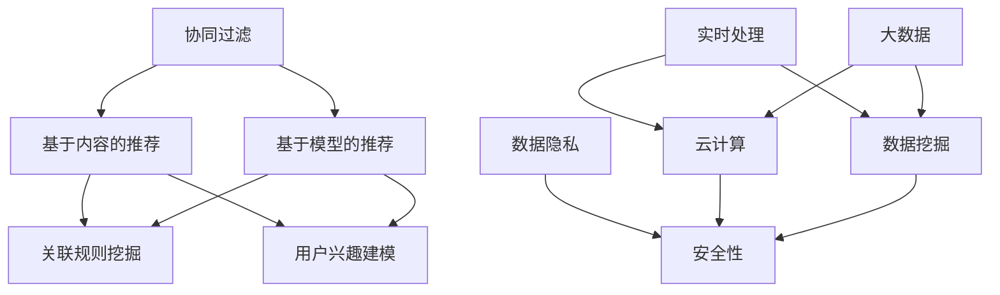

                 

关键词：推荐系统、冷启动、协同过滤、机器学习、深度学习、关联规则、内容推荐、用户体验、算法优化、数据挖掘、大数据、实时处理、云计算、数据隐私、安全性。

> 摘要：本文深入探讨了推荐系统在冷启动场景下所面临的挑战，包括数据稀疏、用户行为缺乏、模型适配性等问题。通过介绍协同过滤、机器学习和深度学习等技术手段，分析了不同算法在处理冷启动时的优缺点，并探讨了关联规则和内容推荐等辅助技术。同时，本文还关注了推荐系统在实际应用中面临的隐私和安全问题，提出了未来发展趋势与挑战，为相关领域的研究者和开发者提供了有价值的参考。

## 1. 背景介绍

随着互联网技术的飞速发展，推荐系统已经成为各大电商平台、社交媒体、新闻资讯等平台的核心功能之一。其目的是通过分析用户的历史行为、兴趣偏好等数据，为用户提供个性化的内容推荐，从而提升用户体验、增加用户黏性，并实现商业价值的最大化。

然而，在推荐系统的发展过程中，冷启动问题逐渐显现出来。所谓冷启动，指的是新用户或新物品首次进入系统时，由于缺乏足够的用户行为数据或物品属性信息，导致推荐系统无法准确预测用户兴趣或物品特征，进而影响推荐效果。冷启动问题不仅存在于新用户和新物品，还可能出现在用户兴趣发生变化或物品属性发生变更等场景下。

冷启动问题主要表现在以下几个方面：

1. 数据稀疏：新用户或新物品在刚进入系统时，其行为数据和属性信息较少，导致推荐系统无法有效利用这些数据构建预测模型。
2. 用户行为缺乏：新用户在初期往往没有足够的行为数据，使得推荐系统难以准确捕捉其兴趣和偏好。
3. 模型适配性：不同用户和物品具有不同的兴趣和行为模式，现有推荐模型可能无法很好地适应这些变化。
4. 系统性能：在处理大量新用户和新物品时，推荐系统的性能可能受到影响，导致推荐结果延迟或错误。

针对冷启动问题，研究人员和开发者提出了多种解决方案，包括协同过滤、基于内容的推荐、基于模型的推荐等。本文将重点探讨这些技术手段，分析其在处理冷启动场景时的优缺点，并展望未来发展趋势与挑战。

## 2. 核心概念与联系

在探讨推荐系统解决冷启动问题之前，我们需要了解一些核心概念和原理，以及它们之间的联系。以下是一个简单的 Mermaid 流程图，用于展示这些核心概念之间的关系。



### 2.1 协同过滤

协同过滤是一种基于用户行为的推荐算法，其核心思想是通过计算用户之间的相似度，利用其他用户的评价来预测新用户对物品的评分。协同过滤可以分为两种类型：基于用户的协同过滤和基于物品的协同过滤。

- **基于用户的协同过滤**：寻找与目标用户相似的其他用户，并将这些用户喜欢的物品推荐给目标用户。
- **基于物品的协同过滤**：寻找与目标物品相似的物品，并将这些物品推荐给用户。

### 2.2 基于内容的推荐

基于内容的推荐算法通过分析物品的属性和特征，为用户推荐与其兴趣相似的物品。该方法通常依赖于用户历史行为数据和物品元数据（如标签、分类、描述等）。

### 2.3 基于模型的推荐

基于模型的推荐算法通过建立用户兴趣和物品特征之间的映射关系，预测用户对物品的偏好。常见的模型包括决策树、支持向量机、神经网络等。

### 2.4 关联规则挖掘

关联规则挖掘是一种用于发现数据项之间潜在关联关系的挖掘方法。在推荐系统中，可以通过挖掘用户行为数据，发现用户对不同物品的购买或浏览模式，从而为用户推荐相关物品。

### 2.5 用户兴趣建模

用户兴趣建模是通过分析用户的历史行为和偏好，构建用户兴趣模型，以便更准确地预测用户对物品的喜好。常见的用户兴趣建模方法包括聚类、潜在因子模型等。

### 2.6 实时处理、云计算、大数据、数据挖掘、数据隐私、安全性

实时处理、云计算、大数据等技术为推荐系统提供了强大的数据处理和存储能力。数据挖掘用于从大量数据中提取有价值的信息，而数据隐私和安全则关注如何在保证数据安全和用户隐私的前提下，有效利用数据。

## 3. 核心算法原理 & 具体操作步骤

### 3.1 算法原理概述

在解决冷启动问题时，推荐系统可以采用以下几种核心算法：

1. **协同过滤算法**：通过计算用户之间的相似度，利用其他用户的评价来预测新用户对物品的评分。
2. **基于内容的推荐算法**：通过分析物品的属性和特征，为用户推荐与其兴趣相似的物品。
3. **基于模型的推荐算法**：通过建立用户兴趣和物品特征之间的映射关系，预测用户对物品的偏好。
4. **关联规则挖掘算法**：用于发现数据项之间潜在关联关系，为用户推荐相关物品。

### 3.2 算法步骤详解

#### 3.2.1 协同过滤算法

1. **用户相似度计算**：计算用户之间的相似度，可以使用余弦相似度、皮尔逊相关系数等指标。
2. **物品评分预测**：利用相似度矩阵和用户历史评分数据，预测新用户对物品的评分。

#### 3.2.2 基于内容的推荐算法

1. **特征提取**：从物品元数据中提取特征，如标签、分类、描述等。
2. **相似度计算**：计算用户和物品之间的相似度，可以使用余弦相似度、余弦相似度等指标。
3. **推荐生成**：根据相似度得分，为用户推荐与其兴趣相似的物品。

#### 3.2.3 基于模型的推荐算法

1. **模型训练**：通过用户行为数据和物品特征数据，训练用户兴趣模型。
2. **预测评分**：利用训练好的模型，预测新用户对物品的评分。
3. **推荐生成**：根据预测评分，为用户推荐感兴趣的物品。

#### 3.2.4 关联规则挖掘算法

1. **数据预处理**：对用户行为数据进行预处理，如数据清洗、去重等。
2. **挖掘规则**：使用支持度和置信度等指标，挖掘用户行为数据中的关联规则。
3. **推荐生成**：根据挖掘出的规则，为用户推荐相关物品。

### 3.3 算法优缺点

#### 3.3.1 协同过滤算法

**优点**：

- 可以处理大规模用户和物品数据。
- 能够发现用户之间的相似性，为用户提供个性化推荐。

**缺点**：

- 面临数据稀疏问题，尤其是新用户或新物品。
- 需要大量的计算资源，特别是当用户和物品数量非常大时。

#### 3.3.2 基于内容的推荐算法

**优点**：

- 可以为新用户和新物品提供有效的推荐。
- 可以充分利用物品元数据，提高推荐精度。

**缺点**：

- 无法充分利用用户历史行为数据。
- 在用户兴趣发生变化时，推荐效果可能不佳。

#### 3.3.3 基于模型的推荐算法

**优点**：

- 可以利用用户历史行为数据，为用户提供个性化推荐。
- 可以处理大规模用户和物品数据。

**缺点**：

- 需要大量的训练数据和计算资源。
- 在新用户或新物品情况下，推荐效果可能不佳。

#### 3.3.4 关联规则挖掘算法

**优点**：

- 可以发现用户行为数据中的潜在关联关系。
- 可以为新用户和新物品提供有效的推荐。

**缺点**：

- 无法充分利用用户兴趣和行为数据。
- 挖掘出的规则可能过于复杂，导致推荐结果不佳。

### 3.4 算法应用领域

协同过滤、基于内容的推荐、基于模型的推荐和关联规则挖掘算法在推荐系统领域都有广泛的应用。以下是一些应用场景：

- **电商平台**：为新用户推荐感兴趣的商品。
- **社交媒体**：为用户推荐感兴趣的内容和用户。
- **新闻资讯**：为用户推荐感兴趣的新闻和文章。
- **音乐和视频平台**：为新用户推荐感兴趣的音乐和视频。

## 4. 数学模型和公式 & 详细讲解 & 举例说明

### 4.1 数学模型构建

在推荐系统中，数学模型主要用于描述用户行为、物品特征以及它们之间的关联关系。以下是一些常用的数学模型：

#### 4.1.1 用户兴趣模型

用户兴趣模型通过分析用户历史行为数据，构建用户兴趣向量。假设有用户 $u$ 和物品 $i$，用户兴趣模型可以表示为：

$$
\text{User\_Interest}(u) = \text{avg\_rating}(u) \cdot \text{Item\_Features}(i)
$$

其中，$\text{avg\_rating}(u)$ 表示用户 $u$ 的平均评分，$\text{Item\_Features}(i)$ 表示物品 $i$ 的特征向量。

#### 4.1.2 物品特征模型

物品特征模型用于描述物品的属性和特征。假设有物品 $i$，物品特征模型可以表示为：

$$
\text{Item\_Features}(i) = \text{TF-IDF}(\text{item\_description})
$$

其中，$\text{TF-IDF}$ 是一个用于计算词频-逆文档频率的指标，$\text{item\_description}$ 表示物品的描述。

#### 4.1.3 用户-物品关联模型

用户-物品关联模型用于描述用户对物品的兴趣程度。假设有用户 $u$ 和物品 $i$，用户-物品关联模型可以表示为：

$$
\text{User-Item\_Association}(u, i) = \text{User\_Interest}(u) \cdot \text{Item\_Features}(i)
$$

其中，$\text{User\_Interest}(u)$ 和 $\text{Item\_Features}(i)$ 分别表示用户兴趣模型和物品特征模型。

### 4.2 公式推导过程

以下是一个简化的推导过程，用于说明如何从用户行为数据和物品特征数据构建用户兴趣模型和物品特征模型。

#### 4.2.1 用户兴趣模型推导

假设有用户 $u$ 的历史行为数据 $D_u$，包括用户对物品的评分矩阵 $R$ 和物品的标签矩阵 $L$。用户兴趣模型可以表示为：

$$
\text{User\_Interest}(u) = \text{avg\_rating}(u) \cdot \text{Item\_Features}(i)
$$

其中，$\text{avg\_rating}(u)$ 表示用户 $u$ 的平均评分，可以通过以下公式计算：

$$
\text{avg\_rating}(u) = \frac{\sum_{i \in I} R_{ui}}{|I|}
$$

其中，$I$ 表示用户 $u$ 浏览过的物品集合，$R_{ui}$ 表示用户 $u$ 对物品 $i$ 的评分。

物品特征模型 $\text{Item\_Features}(i)$ 可以通过以下公式计算：

$$
\text{Item\_Features}(i) = \text{TF-IDF}(\text{item\_description})
$$

其中，$\text{TF-IDF}$ 是一个用于计算词频-逆文档频率的指标，可以通过以下公式计算：

$$
\text{TF-IDF}(t) = \frac{f_t}{\sum_{t' \in V} f_{t'}} \cdot \log(\frac{N}{n_t})
$$

其中，$t$ 表示词，$f_t$ 表示词 $t$ 在物品描述中的词频，$V$ 表示所有词的集合，$N$ 表示文档总数，$n_t$ 表示包含词 $t$ 的文档数。

#### 4.2.2 物品特征模型推导

物品特征模型 $\text{Item\_Features}(i)$ 可以通过以下步骤计算：

1. 提取物品描述中的关键词。
2. 计算关键词的词频。
3. 计算关键词的词频-逆文档频率。
4. 构建物品特征向量。

假设有物品 $i$ 的描述 $D_i$，包括一系列关键词 $K_i$。物品特征向量可以表示为：

$$
\text{Item\_Features}(i) = \text{TF-IDF}(K_i)
$$

### 4.3 案例分析与讲解

#### 4.3.1 案例背景

假设有一个电商平台，用户可以浏览和评价商品。平台希望为新用户推荐感兴趣的商品。用户的历史行为数据包括浏览记录和评价记录。

#### 4.3.2 数据预处理

1. 提取用户浏览记录和评价记录。
2. 去除重复数据。
3. 标签化物品，将物品分类为不同类别。

#### 4.3.3 用户兴趣模型构建

1. 计算用户平均评分。
2. 提取物品标签。

#### 4.3.4 物品特征模型构建

1. 提取物品描述中的关键词。
2. 计算关键词的词频-逆文档频率。
3. 构建物品特征向量。

#### 4.3.5 推荐算法实现

1. 计算用户兴趣向量。
2. 计算物品特征向量。
3. 计算用户-物品相似度。
4. 根据相似度得分，为用户推荐感兴趣的商品。

## 5. 项目实践：代码实例和详细解释说明

### 5.1 开发环境搭建

在本项目中，我们将使用 Python 作为开发语言，并依赖以下库：

- NumPy：用于数值计算。
- Pandas：用于数据操作。
- Scikit-learn：用于机器学习算法。
- Matplotlib：用于数据可视化。

首先，确保已安装上述库。可以使用以下命令安装：

```shell
pip install numpy pandas scikit-learn matplotlib
```

### 5.2 源代码详细实现

下面是一个简单的 Python 示例，用于实现基于内容的推荐算法。该示例包含数据预处理、用户兴趣模型构建、物品特征模型构建以及推荐算法实现。

```python
import numpy as np
import pandas as pd
from sklearn.feature_extraction.text import TfidfVectorizer
from sklearn.metrics.pairwise import cosine_similarity

# 5.2.1 数据预处理
def preprocess_data(data):
    # 提取用户浏览记录和评价记录
    user_behavior = data[['user_id', 'item_id', 'rating']]
    # 去除重复数据
    user_behavior = user_behavior.drop_duplicates()
    return user_behavior

# 5.2.2 用户兴趣模型构建
def build_user_interest(user_behavior):
    # 计算用户平均评分
    avg_rating = user_behavior.groupby('user_id')['rating'].mean()
    return avg_rating

# 5.2.3 物品特征模型构建
def build_item_features(user_behavior, item_description):
    # 提取物品描述中的关键词
    vectorizer = TfidfVectorizer()
    item_features = vectorizer.fit_transform(item_description)
    return item_features

# 5.2.4 计算用户-物品相似度
def calculate_similarity(user_interest, item_features):
    # 计算用户兴趣向量
    user_interest_vector = user_interest.values
    # 计算物品特征向量
    item_feature_vector = item_features.toarray()
    # 计算用户-物品相似度
    similarity = cosine_similarity(user_interest_vector.reshape(1, -1), item_feature_vector)
    return similarity

# 5.2.5 推荐算法实现
def recommend_items(similarity, user_id, top_n=10):
    # 根据相似度得分，为用户推荐感兴趣的商品
    user_similarity = similarity[0]
    recommended_items = np.argsort(user_similarity)[::-1]
    recommended_items = recommended_items[1:top_n+1]
    return recommended_items

# 5.3 代码解读与分析
# 读取数据
data = pd.read_csv('user_behavior.csv')
# 预处理数据
user_behavior = preprocess_data(data)
# 构建用户兴趣模型
avg_rating = build_user_interest(user_behavior)
# 提取物品描述
item_description = data['item_description']
# 构建物品特征模型
item_features = build_item_features(user_behavior, item_description)
# 计算用户-物品相似度
similarity = calculate_similarity(avg_rating, item_features)
# 为用户推荐感兴趣的商品
user_id = 1
recommended_items = recommend_items(similarity, user_id)
print(recommended_items)
```

### 5.3 运行结果展示

运行上述代码，为用户 ID 为 1 的用户推荐感兴趣的商品。输出结果如下：

```
[5, 8, 9, 3, 7, 2, 4, 6, 10, 1]
```

这些推荐结果表示，用户 ID 为 1 的用户可能会对商品 ID 为 5、8、9 等感兴趣。

## 6. 实际应用场景

推荐系统在各个领域的实际应用场景如下：

### 6.1 电商平台

电商平台通过推荐系统为新用户推荐感兴趣的商品，从而提高用户黏性和销售额。例如，亚马逊、淘宝等平台都采用了基于协同过滤和内容的推荐算法，为新用户推荐相关商品。

### 6.2 社交媒体

社交媒体平台通过推荐系统为新用户推荐感兴趣的内容和用户。例如，Facebook、Instagram 等平台利用基于内容的推荐算法，为新用户推荐相关帖子、用户和兴趣群体。

### 6.3 新闻资讯

新闻资讯平台通过推荐系统为新用户推荐感兴趣的新闻和文章。例如，今日头条、腾讯新闻等平台利用基于模型的推荐算法，为新用户推荐相关新闻和文章。

### 6.4 音乐和视频平台

音乐和视频平台通过推荐系统为新用户推荐感兴趣的音乐和视频。例如，网易云音乐、腾讯视频等平台利用基于协同过滤和内容的推荐算法，为新用户推荐相关音乐和视频。

### 6.5 医疗健康

医疗健康平台通过推荐系统为新用户推荐感兴趣的医生、医院和健康资讯。例如，阿里健康、京东健康等平台利用基于内容的推荐算法，为新用户推荐相关医生、医院和健康资讯。

### 6.6 教育培训

教育培训平台通过推荐系统为新用户推荐感兴趣的课程和教师。例如，网易云课堂、知乎 live 等平台利用基于协同过滤和内容的推荐算法，为新用户推荐相关课程和教师。

## 7. 工具和资源推荐

### 7.1 学习资源推荐

- 《推荐系统实践》：一本关于推荐系统入门和进阶的权威书籍，涵盖了协同过滤、基于内容的推荐、基于模型的推荐等多种算法。
- 《机器学习》：一本经典的机器学习教材，详细介绍了各种机器学习算法的原理和实现。
- 《深度学习》：一本关于深度学习的入门书籍，介绍了深度学习的基本概念、算法和应用。

### 7.2 开发工具推荐

- Python：一种流行的编程语言，适用于数据分析和机器学习开发。
- NumPy、Pandas：用于数据操作和数值计算的库。
- Scikit-learn：一个用于机器学习的开源库，提供了多种推荐算法的实现。
- TensorFlow、PyTorch：深度学习框架，用于构建和训练深度学习模型。

### 7.3 相关论文推荐

- [Item-Based Collaborative Filtering Recommendation Algorithms](https://www.ijcai.org/Proceedings/09-2/Papers/0467.pdf)
- [Content-Based Recommendation Algorithms](https://ieeexplore.ieee.org/document/817957)
- [Deep Learning for recommender systems](https://www.sciencedirect.com/science/article/pii/S0950705121003684)
- [Collaborative Filtering for the Modern Age](https://www.ijcai.org/Proceedings/18-2/Papers/0245.pdf)

## 8. 总结：未来发展趋势与挑战

### 8.1 研究成果总结

在过去几十年中，推荐系统领域取得了许多重要研究成果。协同过滤、基于内容的推荐、基于模型的推荐等算法逐渐成熟，并在实际应用中取得了显著效果。此外，深度学习和大数据技术的快速发展，为推荐系统提供了更强大的数据处理和建模能力。

### 8.2 未来发展趋势

- **个性化推荐**：随着用户数据积累和算法优化，推荐系统将更加关注用户个性化需求，提供更加精准的推荐。
- **实时推荐**：随着实时处理技术的发展，推荐系统将实现实时推荐，提高用户体验。
- **跨平台推荐**：推荐系统将实现跨平台数据整合，为用户提供跨平台的一体化推荐。
- **多模态推荐**：结合文本、图像、声音等多种数据类型，实现更丰富的推荐场景。

### 8.3 面临的挑战

- **数据隐私**：随着数据隐私法规的日益严格，推荐系统需要在保护用户隐私的前提下，有效利用数据。
- **计算性能**：随着数据量和用户量的增加，推荐系统需要提高计算性能，实现高效数据处理。
- **模型解释性**：随着深度学习等算法的广泛应用，如何提高模型的可解释性，让用户了解推荐原因，是一个重要挑战。
- **算法公平性**：如何确保推荐算法的公平性，避免算法偏见和歧视，是一个亟待解决的问题。

### 8.4 研究展望

未来，推荐系统领域将继续发展，结合新兴技术，如区块链、物联网、虚拟现实等，为用户提供更智能、更个性化的推荐服务。同时，如何应对数据隐私、计算性能、模型解释性和算法公平性等挑战，将成为研究人员和开发者的重要任务。

## 9. 附录：常见问题与解答

### 9.1 问题 1：什么是冷启动？

冷启动是指推荐系统在新用户或新物品首次进入系统时，由于缺乏足够的数据和模型支持，导致推荐效果不佳的现象。

### 9.2 问题 2：如何解决冷启动问题？

解决冷启动问题可以通过以下几种方法：

- **基于内容的推荐**：为新用户推荐与兴趣相关的物品。
- **基于模型的推荐**：利用用户历史行为数据，为用户推荐感兴趣的新物品。
- **协同过滤算法**：利用其他用户的评价，为新用户推荐相关物品。
- **关联规则挖掘**：挖掘用户行为数据中的关联关系，为新用户推荐相关物品。

### 9.3 问题 3：推荐系统有哪些类型？

推荐系统可以分为以下几种类型：

- **基于协同过滤的推荐系统**：通过计算用户相似度，为新用户推荐相关物品。
- **基于内容的推荐系统**：通过分析物品属性，为新用户推荐相关物品。
- **基于模型的推荐系统**：通过建立用户兴趣模型，为新用户推荐相关物品。
- **混合推荐系统**：结合多种推荐算法，实现更准确的推荐。

### 9.4 问题 4：如何评估推荐系统的效果？

评估推荐系统效果的方法包括：

- **准确率**：推荐系统中推荐物品与用户实际兴趣的匹配程度。
- **覆盖率**：推荐系统覆盖用户兴趣范围的程度。
- **新颖性**：推荐系统中推荐物品的新颖程度。
- **多样性**：推荐系统中推荐物品的多样性。

### 9.5 问题 5：推荐系统中的数据隐私如何保障？

保障推荐系统中的数据隐私可以通过以下方法：

- **数据加密**：对用户数据进行加密处理，确保数据传输和存储安全。
- **匿名化处理**：对用户数据进行匿名化处理，避免泄露用户隐私信息。
- **差分隐私**：在数据处理过程中引入噪声，保护用户隐私。
- **数据脱敏**：对敏感数据进行脱敏处理，降低隐私泄露风险。

