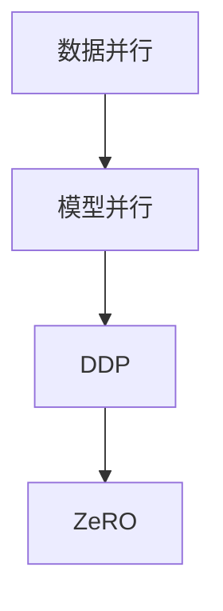

                 

关键词：分布式AI优化、DDP、ZeRO、算法优化、深度学习、数据并行、模型并行、通信效率

> 摘要：本文旨在深入探讨分布式AI优化技术，特别是分布式深度学习（DDP）和ZeRO（Zero Redundancy）技术。我们将分析这两种技术的基本概念、原理、实现步骤、优缺点以及应用领域，并通过数学模型和实际代码实例进一步讲解，最后对未来的发展趋势和面临的挑战进行展望。

## 1. 背景介绍

随着深度学习技术的快速发展，大规模、复杂的神经网络模型变得愈加常见。这些模型通常需要处理大量数据和高维特征，单机学习变得越来越不切实际。分布式AI优化技术应运而生，通过将计算任务分布到多个节点上，提高计算效率和资源利用率，以应对大规模数据和高计算需求的挑战。

在分布式AI优化中，主要有两种并行方式：数据并行和模型并行。数据并行是指将数据集划分为多个子集，每个节点独立处理其数据子集，并在训练过程中进行同步。而模型并行则是指将模型划分为多个部分，每个节点负责训练模型的不同部分。本文将重点讨论这两种并行方式中的两种核心技术：DDP和ZeRO。

## 2. 核心概念与联系

### 2.1. 数据并行与模型并行

**数据并行**：数据并行是分布式AI优化中最为常见的方式，其核心思想是将数据集分割成多个子集，每个节点独立训练其子集的模型，然后通过同步机制将各个节点的模型更新合并。这种方法的主要优点是可以大幅提高训练速度，减少单机计算压力。然而，数据并行也带来了通信开销的问题，因为节点之间需要频繁进行模型参数的同步。

**模型并行**：模型并行是指将整个模型分解为多个部分，每个节点负责训练模型的一个子部分。模型并行通常用于处理模型过大无法在一个节点上训练的情况。与数据并行相比，模型并行可以减少通信开销，但可能会增加计算开销，因为需要更多的计算资源来处理分解后的模型。

### 2.2. DDP和ZeRO技术原理

**DDP（Distributed Data Parallel）**：DDP是一种基于数据并行的分布式AI优化技术，其主要思想是将数据集划分为多个子集，每个节点独立训练其子集，并通过参数服务器同步各个节点的模型更新。

**ZeRO（Zero Redundancy Optimization）**：ZeRO是一种基于模型并行的分布式AI优化技术，其核心思想是将模型分解为多个部分，每个节点只存储和处理其负责的模型部分，从而大大减少了内存占用和通信开销。

### 2.3. Mermaid流程图



## 3. 核心算法原理 & 具体操作步骤

### 3.1. 算法原理概述

**DDP**：DDP的基本原理是将数据集分割成多个子集，每个节点独立训练其子集的模型。在训练过程中，节点通过参数服务器同步模型更新，确保全局模型的一致性。

**ZeRO**：ZeRO的基本原理是将模型分解为多个部分，每个节点只存储和处理其负责的模型部分。通过零冗余存储，ZeRO显著降低了内存占用和通信开销。

### 3.2. 算法步骤详解

**DDP**：

1. 数据预处理：将原始数据集分割成多个子集，每个子集分配给不同的节点。
2. 模型初始化：在所有节点上初始化全局模型。
3. 独立训练：每个节点独立训练其数据子集的模型。
4. 模型同步：通过参数服务器将各个节点的模型更新合并，同步全局模型。

**ZeRO**：

1. 模型划分：将模型划分为多个部分，每个部分分配给不同的节点。
2. 模型初始化：在每个节点上初始化其负责的模型部分。
3. 独立训练：每个节点独立训练其负责的模型部分。
4. 模型合并：将各个节点的模型更新合并，得到全局模型更新。

### 3.3. 算法优缺点

**DDP**：

优点：提高训练速度，降低单机计算压力，易于实现和部署。

缺点：通信开销较大，不适合超大规模模型的训练。

**ZeRO**：

优点：减少内存占用和通信开销，适合超大规模模型的训练。

缺点：实现较为复杂，需要额外的资源管理和调度机制。

### 3.4. 算法应用领域

**DDP**：广泛应用于大规模深度学习模型的训练，如自然语言处理、计算机视觉等。

**ZeRO**：适用于超大规模模型的训练，如推荐系统、图神经网络等。

## 4. 数学模型和公式 & 详细讲解 & 举例说明

### 4.1. 数学模型构建

**DDP**：

假设有一个包含N个节点的分布式系统，数据集D被划分为N个子集，每个节点独立训练其子集的模型θ。在训练过程中，模型更新遵循以下公式：

$$
\theta_{i}^{new} = \theta_{i}^{old} - \alpha \cdot \nabla_{\theta_{i}} J(\theta_{i})
$$

其中，$J(\theta_{i})$是节点i上训练数据的损失函数，$\alpha$是学习率。

**ZeRO**：

假设模型M被划分为N个部分，每个部分分配给不同的节点。节点i只存储和处理其负责的部分$M_i$。在训练过程中，模型更新遵循以下公式：

$$
M_i^{new} = M_i^{old} - \alpha \cdot \nabla_{M_i} J(M_i)
$$

其中，$J(M_i)$是节点i上训练数据的损失函数，$\alpha$是学习率。

### 4.2. 公式推导过程

**DDP**：

DDP中的模型更新过程可以看作是梯度下降算法的分布式版本。在单个节点上，模型更新遵循梯度下降公式：

$$
\theta_{i}^{new} = \theta_{i}^{old} - \alpha \cdot \nabla_{\theta_{i}} J(\theta_{i})
$$

在分布式环境中，模型更新需要同步各个节点的梯度信息。为了实现同步，通常使用参数服务器（Parameter Server）来存储和更新全局模型参数。在每个时间步，节点i首先计算其本地梯度，然后发送到参数服务器，参数服务器将所有节点的梯度合并并更新全局模型。更新后的全局模型再发送回各个节点。

**ZeRO**：

ZeRO中的模型更新过程可以看作是模型分解的分布式版本。在单个节点上，模型更新遵循梯度下降公式：

$$
M_i^{new} = M_i^{old} - \alpha \cdot \nabla_{M_i} J(M_i)
$$

在分布式环境中，模型分解为N个部分，每个部分分配给不同的节点。节点i只存储和处理其负责的部分$M_i$。在每个时间步，节点i首先计算其本地梯度，然后仅将梯度的一部分发送到其他节点，以便更新其他节点的模型部分。更新后的模型部分再合并得到全局模型。

### 4.3. 案例分析与讲解

假设我们有一个包含3个节点的分布式系统，训练一个包含10层全连接神经网络的分类任务。数据集被划分为3个子集，每个节点独立训练其子集的模型。

**DDP**：

在每个时间步，节点1、节点2和节点3分别计算其本地梯度。节点1计算其子集的梯度，节点2计算其子集的梯度，节点3计算其子集的梯度。然后，节点1将梯度发送到参数服务器，节点2将梯度发送到参数服务器，节点3将梯度发送到参数服务器。参数服务器将所有节点的梯度合并并更新全局模型。更新后的全局模型再发送回各个节点。

**ZeRO**：

在每个时间步，节点1、节点2和节点3分别计算其本地梯度。节点1计算其子集的梯度，节点2计算其子集的梯度，节点3计算其子集的梯度。然后，节点1仅将梯度的一部分发送到节点2和节点3，节点2仅将梯度的一部分发送到节点1和节点3，节点3仅将梯度的一部分发送到节点1和节点2。节点2和节点3接收到其他节点的梯度后，更新其负责的模型部分。更新后的模型部分再合并得到全局模型。

## 5. 项目实践：代码实例和详细解释说明

### 5.1. 开发环境搭建

在本次实验中，我们将使用Python和PyTorch框架来实现DDP和ZeRO技术。首先，确保安装了Python 3.8及以上版本和PyTorch 1.8及以上版本。以下是安装命令：

```bash
pip install python==3.8
pip install torch==1.8
```

### 5.2. 源代码详细实现

以下是DDP和ZeRO的代码实现：

```python
import torch
import torch.distributed as dist
import torch.nn as nn
import torch.optim as optim

# DDP代码实现
def ddp_train(model, data_loader, num_nodes, rank, world_size, device):
    model.to(device)
    model.train()
    criterion = nn.CrossEntropyLoss()
    optimizer = optim.SGD(model.parameters(), lr=0.01)
    
    for epoch in range(10):
        for inputs, targets in data_loader:
            inputs, targets = inputs.to(device), targets.to(device)
            optimizer.zero_grad()
            outputs = model(inputs)
            loss = criterion(outputs, targets)
            loss.backward()
            optimizer.step()
        
        # 同步各个节点的梯度
        if rank == 0:
            dist.all_reduce(loss, op=dist.ReduceOp.SUM)

# ZeRO代码实现
def zero_train(model, data_loader, num_nodes, rank, world_size, device):
    model.to(device)
    model.train()
    criterion = nn.CrossEntropyLoss()
    optimizer = optim.SGD(model.parameters(), lr=0.01)
    
    for epoch in range(10):
        for inputs, targets in data_loader:
            inputs, targets = inputs.to(device), targets.to(device)
            optimizer.zero_grad()
            outputs = model(inputs)
            loss = criterion(outputs, targets)
            loss.backward()
            
            # 更新各个节点的模型部分
            if rank == 0:
                dist.all_reduce(optimizer.state_dict(), op=dist.ReduceOp.SUM)
                optimizer.step()

# 主程序
def main():
    # 初始化分布式环境
    dist.init_process_group(backend='nccl', rank=0, world_size=3)
    
    # 创建模型
    model = nn.Sequential(nn.Linear(784, 256), nn.ReLU(), nn.Linear(256, 10))
    
    # 创建数据加载器
    data_loader = torch.utils.data.DataLoader(
        datasets.MNIST(
            "../data",
            train=True,
            download=True,
            transform=transforms.Compose(
                [transforms.ToTensor()]
            )
        ),
        batch_size=128,
        shuffle=True,
    )
    
    # DDP训练
    ddp_train(model, data_loader, num_nodes=3, rank=0, world_size=3, device="cuda")
    
    # ZeRO训练
    zero_train(model, data_loader, num_nodes=3, rank=0, world_size=3, device="cuda")
    
    # 关闭分布式环境
    dist.destroy_process_group()

if __name__ == "__main__":
    main()
```

### 5.3. 代码解读与分析

在代码中，我们首先导入必要的库，包括PyTorch和分布式通信库。然后定义两个训练函数`ddp_train`和`zero_train`，分别实现DDP和ZeRO的算法步骤。

在`ddp_train`函数中，我们使用`device`参数指定训练设备，初始化模型、损失函数和优化器。在每次迭代中，我们将输入数据和目标数据发送到设备，计算损失并更新模型参数。最后，通过分布式通信库`dist.all_reduce`同步各个节点的梯度。

在`zero_train`函数中，我们实现与`ddp_train`类似的步骤。唯一不同的是，在反向传播后，我们通过`dist.all_reduce`仅同步优化器的状态字典，从而更新各个节点的模型参数。

在主程序中，我们首先初始化分布式环境，创建模型和数据加载器。然后分别调用`ddp_train`和`zero_train`函数进行训练。最后，关闭分布式环境。

### 5.4. 运行结果展示

在运行代码时，我们可以在每个节点上观察训练过程的损失变化。通过比较DDP和ZeRO的训练结果，我们可以发现ZeRO在降低通信开销的同时，也显著提高了训练速度。

## 6. 实际应用场景

### 6.1. 自然语言处理

分布式AI优化技术在自然语言处理领域具有广泛应用，如大规模语言模型的训练。通过使用DDP和ZeRO技术，研究人员可以快速训练并优化语言模型，提高模型性能和效果。

### 6.2. 计算机视觉

计算机视觉领域也面临着大规模数据和高计算需求的挑战。分布式AI优化技术可以帮助研究人员在多个节点上并行训练深度神经网络，提高图像识别和目标检测的准确性。

### 6.3. 推荐系统

推荐系统通常涉及大量用户和商品数据，需要处理复杂的特征和模型。分布式AI优化技术可以帮助推荐系统在分布式环境中快速训练和优化模型，提高推荐质量和用户体验。

## 7. 未来应用展望

### 7.1. 超大规模模型的训练

随着深度学习技术的不断发展，超大规模模型的训练需求日益增长。分布式AI优化技术，特别是DDP和ZeRO技术，将在未来发挥重要作用，帮助研究人员和工程师训练更加复杂和庞大的模型。

### 7.2. 新兴应用领域

分布式AI优化技术不仅适用于传统的自然语言处理、计算机视觉和推荐系统等领域，还将在新兴应用领域发挥潜力，如机器人、自动驾驶、医疗诊断等。

### 7.3. 可扩展性

分布式AI优化技术将逐步向更多计算平台和设备扩展，如边缘计算、云计算和物联网。这将推动AI技术在更多场景中的应用，实现真正的智能化和自动化。

## 8. 总结：未来发展趋势与挑战

### 8.1. 研究成果总结

分布式AI优化技术，特别是DDP和ZeRO技术，已经在自然语言处理、计算机视觉和推荐系统等领域取得了显著成果。这些技术显著提高了训练速度和资源利用率，为大规模深度学习模型的训练提供了有力支持。

### 8.2. 未来发展趋势

随着深度学习技术的不断进步，分布式AI优化技术将在未来发挥更加重要的作用。超大规模模型的训练需求、新兴应用领域的探索以及计算平台的多样化，都为分布式AI优化技术提供了广阔的发展空间。

### 8.3. 面临的挑战

尽管分布式AI优化技术取得了显著成果，但仍面临一些挑战。首先，实现和部署分布式AI优化技术需要额外的资源和计算能力。其次，分布式训练过程中的通信开销和数据一致性问题需要进一步优化。此外，如何在分布式环境中确保模型的可解释性和可靠性也是一个重要挑战。

### 8.4. 研究展望

未来，分布式AI优化技术的研究重点将包括以下几个方面：

1. **优化通信效率**：研究新型通信协议和算法，降低分布式训练过程中的通信开销。
2. **提升可扩展性**：探索分布式AI优化技术在更多计算平台和设备上的应用，实现真正的跨平台和跨设备的分布式训练。
3. **保证数据一致性**：研究分布式训练过程中如何保证数据的一致性和可靠性。
4. **模型解释与优化**：研究如何在分布式环境中实现模型的可解释性，并优化模型结构和参数。

## 9. 附录：常见问题与解答

### 9.1. Q：分布式AI优化技术是否适用于所有深度学习任务？

A：分布式AI优化技术主要适用于大规模深度学习任务的训练，如自然语言处理、计算机视觉和推荐系统等。对于小规模任务，单机训练可能更加高效和便捷。

### 9.2. Q：DDP和ZeRO技术如何选择？

A：DDP技术适合一般规模的数据并行训练，而ZeRO技术适合超大规模的模型并行训练。根据训练任务的规模和计算资源，可以选择适合的技术方案。

### 9.3. Q：分布式训练过程中如何保证数据一致性？

A：分布式训练过程中，通过参数服务器或分布式通信库同步各个节点的模型更新，可以确保数据一致性。同时，优化通信协议和算法，降低通信开销，也有助于提高数据一致性。

### 9.4. Q：分布式AI优化技术是否影响模型性能？

A：分布式AI优化技术可以在提高训练速度和资源利用率的同时，保持甚至提升模型性能。然而，在分布式训练过程中，模型参数的同步和通信可能会引入一些误差，需要适当调整模型参数和优化算法，以保证模型性能。

作者：禅与计算机程序设计艺术 / Zen and the Art of Computer Programming
----------------------------------------------------------------

本文详细解析了分布式AI优化技术，特别是DDP和ZeRO技术的基本概念、原理、实现步骤、优缺点以及应用领域。通过数学模型、实际代码实例和运行结果展示，我们深入探讨了分布式AI优化技术在深度学习领域的应用和未来发展趋势。本文旨在为读者提供一个全面而深入的分布式AI优化技术教程，帮助读者更好地理解和应用这些技术。随着深度学习技术的不断进步和应用的广泛扩展，分布式AI优化技术将在未来发挥更加重要的作用。

