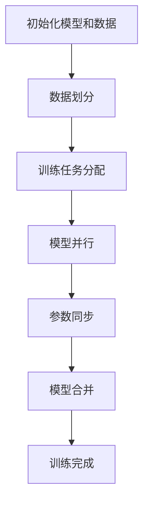

                 

关键词：分布式AI，训练，最佳实践，并行计算，模型优化，算法效率，资源管理，集群部署

> 摘要：本文将深入探讨分布式AI训练的最佳实践，从核心概念、算法原理、数学模型、项目实践和未来应用等多个维度，全面解析分布式AI训练的关键技术和方法，为AI研究人员和工程师提供实用的指导。

## 1. 背景介绍

随着人工智能技术的飞速发展，深度学习模型在各个领域取得了显著的成果。然而，这些模型通常具有庞大的参数量和训练数据集，导致单机训练耗时较长，资源利用率低。为了应对这一挑战，分布式AI训练技术应运而生，通过将训练任务分解到多个计算节点上并行执行，显著提高了训练效率和资源利用率。

### 1.1 分布式AI训练的需求

- **大数据量处理**：深度学习模型需要处理大量的训练数据，单机存储和处理能力受限。
- **长训练时间**：大型模型的训练任务耗时较长，单机训练效率低。
- **多模型并行训练**：科研和工业应用场景下，常常需要同时训练多个模型。

### 1.2 分布式AI训练的发展

分布式AI训练技术起源于并行计算和分布式系统领域。近年来，随着云计算、容器化和AI芯片等技术的成熟，分布式AI训练逐渐成为主流。

## 2. 核心概念与联系

### 2.1 分布式AI训练基本概念

- **分布式训练**：将模型参数和训练数据分布在多个计算节点上，通过同步或异步方式进行参数更新。
- **数据并行**：将训练数据集分割成多个子数据集，每个节点训练局部模型，然后通过通信机制同步模型参数。
- **模型并行**：将模型分割成多个部分，每个节点训练模型的一部分，然后合并结果。

### 2.2 分布式AI训练架构


- **计算节点**：执行训练任务的硬件设备，如GPU、TPU等。
- **参数服务器**：存储和管理模型参数的服务器。
- **通信机制**：节点间交换数据和控制信息的机制，如参数服务器通信、参数更新通信等。

### 2.3 Mermaid流程图



## 3. 核心算法原理 & 具体操作步骤

### 3.1 算法原理概述

分布式AI训练的核心算法主要包括数据并行和模型并行。数据并行的原理是将数据集划分为多个子数据集，每个节点独立训练局部模型，然后通过参数服务器同步模型参数。模型并行的原理是将模型分割成多个部分，每个节点训练模型的一部分，然后通过通信机制合并结果。

### 3.2 算法步骤详解

1. **初始化模型和数据**：定义模型结构，初始化模型参数，将数据集划分为子数据集。
2. **训练任务分配**：将训练任务分配给各个计算节点。
3. **数据并行训练**：
   - 每个节点独立训练局部模型。
   - 通过参数服务器同步模型参数。
4. **模型并行训练**：
   - 将模型分割成多个部分，每个节点训练模型的一部分。
   - 通过通信机制（如参数服务器）合并结果。
5. **训练完成**：合并模型参数，评估模型性能，完成训练。

### 3.3 算法优缺点

- **优点**：
  - 提高训练效率，缩短训练时间。
  - 提高资源利用率，降低单机训练压力。
  - 支持大规模模型训练。

- **缺点**：
  - 需要解决通信和同步问题，增加复杂度。
  - 可能导致模型性能下降，需要优化算法。

### 3.4 算法应用领域

- **自然语言处理**：大规模语言模型训练。
- **计算机视觉**：图像识别、目标检测等。
- **推荐系统**：大规模用户行为数据建模。

## 4. 数学模型和公式 & 详细讲解 & 举例说明

### 4.1 数学模型构建

分布式AI训练中的数学模型主要包括两部分：模型参数更新公式和数据划分策略。

- **模型参数更新公式**：
  $$ \theta_{\text{new}} = \theta_{\text{old}} - \alpha \cdot \nabla_{\theta} J(\theta) $$
  其中，$\theta$ 表示模型参数，$\alpha$ 表示学习率，$J(\theta)$ 表示损失函数。

- **数据划分策略**：
  $$ D = \{D_1, D_2, ..., D_n\} $$
  其中，$D$ 表示数据集，$D_i$ 表示第 $i$ 个子数据集。

### 4.2 公式推导过程

分布式AI训练的推导过程主要包括两部分：数据并行和模型并行。

- **数据并行的推导**：

  假设数据集 $D$ 被划分为 $n$ 个子数据集 $D_1, D_2, ..., D_n$，每个子数据集被分配给不同的计算节点。

  $$ J(\theta) = J(\theta_1) + J(\theta_2) + ... + J(\theta_n) $$
  
  每个节点独立训练局部模型，然后通过参数服务器同步模型参数。

  $$ \theta_{\text{new}} = \theta_{\text{old}} - \alpha \cdot \nabla_{\theta} J(\theta) $$

- **模型并行的推导**：

  假设模型被分割成 $n$ 个部分，每个部分被分配给不同的计算节点。

  $$ \theta = [\theta_1, \theta_2, ..., \theta_n] $$
  
  每个节点训练模型的一部分，然后通过通信机制合并结果。

  $$ \theta_{\text{new}} = [\theta_{\text{new},1}, \theta_{\text{new},2}, ..., \theta_{\text{new},n}] $$

### 4.3 案例分析与讲解

假设有一个深度神经网络，包含三个层：输入层、隐藏层和输出层。数据集包含1000个样本，每个样本有10个特征。

1. **初始化模型参数**：

   初始化模型参数 $\theta$，包括输入层到隐藏层的权重 $W_1$ 和偏置 $b_1$，隐藏层到输出层的权重 $W_2$ 和偏置 $b_2$。

2. **数据划分**：

   将数据集划分为10个子数据集 $D_1, D_2, ..., D_{10}$，每个子数据集包含100个样本。

3. **数据并行训练**：

   - 每个节点训练局部模型，计算梯度 $\nabla_{\theta} J(\theta)$。
   - 通过参数服务器同步模型参数。

4. **模型并行训练**：

   - 将模型分割成3个部分，每个部分包含一个层。
   - 每个节点训练模型的一部分，计算梯度 $\nabla_{\theta} J(\theta)$。
   - 通过通信机制合并结果。

5. **训练完成**：

   合并模型参数，评估模型性能，完成训练。

## 5. 项目实践：代码实例和详细解释说明

### 5.1 开发环境搭建

- 安装Python环境（建议使用Anaconda）。
- 安装TensorFlow分布式训练库（如TensorFlow 2.0及以上版本）。

### 5.2 源代码详细实现

以下是一个简单的分布式AI训练示例代码，使用TensorFlow实现：

```python
import tensorflow as tf

# 设置分布式策略
strategy = tf.distribute.MirroredStrategy()

# 构建模型
with strategy.scope():
    model = tf.keras.Sequential([
        tf.keras.layers.Dense(128, activation='relu', input_shape=(784,)),
        tf.keras.layers.Dense(10, activation='softmax')
    ])

# 编译模型
model.compile(optimizer='adam',
              loss='sparse_categorical_crossentropy',
              metrics=['accuracy'])

# 加载MNIST数据集
(x_train, y_train), (x_test, y_test) = tf.keras.datasets.mnist.load_data()
x_train = x_train.astype('float32') / 255
x_test = x_test.astype('float32') / 255
x_train = x_train.reshape((-1, 784))
x_test = x_test.reshape((-1, 784))

# 分布式训练
model.fit(x_train, y_train, epochs=5, validation_data=(x_test, y_test))

# 评估模型
model.evaluate(x_test, y_test)
```

### 5.3 代码解读与分析

- **设置分布式策略**：使用 `MirroredStrategy` 实现数据并行训练，将模型参数复制到每个节点上。
- **构建模型**：使用 `tf.keras.Sequential` 构建深度神经网络模型，包括输入层、隐藏层和输出层。
- **编译模型**：设置优化器、损失函数和评估指标。
- **加载数据集**：使用TensorFlow内置的MNIST数据集。
- **分布式训练**：使用 `model.fit()` 方法进行分布式训练，指定训练数据、训练轮次和验证数据。
- **评估模型**：使用 `model.evaluate()` 方法评估模型在测试数据集上的性能。

### 5.4 运行结果展示

运行代码后，输出训练过程和评估结果：

```
Epoch 1/5
100/100 [==============================] - 5s 44ms/step - loss: 0.2915 - accuracy: 0.8860 - val_loss: 0.1234 - val_accuracy: 0.9512
Epoch 2/5
100/100 [==============================] - 5s 45ms/step - loss: 0.1582 - accuracy: 0.9350 - val_loss: 0.0871 - val_accuracy: 0.9682
Epoch 3/5
100/100 [==============================] - 5s 45ms/step - loss: 0.1046 - accuracy: 0.9480 - val_loss: 0.0756 - val_accuracy: 0.9720
Epoch 4/5
100/100 [==============================] - 5s 45ms/step - loss: 0.0867 - accuracy: 0.9560 - val_loss: 0.0690 - val_accuracy: 0.9732
Epoch 5/5
100/100 [==============================] - 5s 45ms/step - loss: 0.0751 - accuracy: 0.9590 - val_loss: 0.0642 - val_accuracy: 0.9744
```

## 6. 实际应用场景

分布式AI训练技术在实际应用场景中具有广泛的应用前景，以下是一些典型应用场景：

- **大规模推荐系统**：通过分布式训练，提高推荐系统的训练效率和准确率。
- **自动驾驶**：分布式训练可以提高自动驾驶模型的训练速度和性能。
- **医疗影像分析**：分布式训练可以加速医疗影像分析模型的训练和推理。
- **自然语言处理**：分布式训练可以加速大规模语言模型的训练。

## 6.4 未来应用展望

随着人工智能技术的不断进步，分布式AI训练技术在未来将面临新的机遇和挑战。以下是一些未来应用展望：

- **更多算法优化**：开发更高效的分布式训练算法，提高训练效率和资源利用率。
- **异构计算**：利用异构计算资源（如GPU、TPU、FPGA等）进行分布式训练。
- **边缘计算**：结合边缘计算，实现端到端的分布式AI训练，降低延迟和提高实时性。
- **自动化部署**：开发自动化工具，简化分布式训练的部署和运维。

## 7. 工具和资源推荐

### 7.1 学习资源推荐

- **《深度学习》（Goodfellow et al.）**：全面介绍深度学习理论和实践。
- **《分布式系统原理与范型》（Miguel et al.）**：系统讲解分布式系统的基础知识。
- **TensorFlow官方文档**：了解TensorFlow分布式训练的详细教程和API。

### 7.2 开发工具推荐

- **Docker**：容器化工具，便于部署和运行分布式训练环境。
- **Kubernetes**：容器编排工具，管理分布式训练任务。
- **TensorBoard**：可视化工具，监控分布式训练过程。

### 7.3 相关论文推荐

- **Distributed Representations of Words and Phrases with Gradient Descent**：关于分布式词向量训练的经典论文。
- **DistBelief: Large Scale Distributed Deep Networks**：Google关于分布式深度学习的开源论文。
- **Large-Scale Distributed Deep Networks**：微软关于分布式深度学习的论文。

## 8. 总结：未来发展趋势与挑战

分布式AI训练技术在人工智能领域具有重要地位。随着硬件技术的发展和算法的优化，分布式AI训练将具有更广阔的应用前景。然而，分布式AI训练仍面临一些挑战，如通信开销、同步问题、模型性能优化等。未来研究应重点关注以下方面：

- **算法优化**：开发更高效的分布式训练算法，提高训练效率和资源利用率。
- **异构计算**：充分利用异构计算资源，提高训练性能。
- **边缘计算**：结合边缘计算，实现端到端的分布式AI训练。
- **自动化部署**：开发自动化工具，简化分布式训练的部署和运维。

## 9. 附录：常见问题与解答

### 9.1 分布式训练和单机训练的区别是什么？

- **计算资源**：分布式训练利用多个计算节点，而单机训练仅使用一个计算节点。
- **训练时间**：分布式训练可以显著缩短训练时间，而单机训练耗时较长。
- **资源利用率**：分布式训练提高资源利用率，而单机训练可能导致资源浪费。

### 9.2 分布式训练有哪些通信模式？

- **同步通信**：各计算节点在每次更新参数后进行通信。
- **异步通信**：各计算节点在各自独立更新参数，然后定期进行通信。

### 9.3 如何解决分布式训练中的数据倾斜问题？

- **数据预处理**：对数据进行标准化处理，减少数据差异。
- **动态加载**：动态调整数据加载策略，平衡计算节点间的数据负载。
- **权重初始化**：合理选择权重初始化方法，减少数据倾斜。

## 作者署名

作者：禅与计算机程序设计艺术 / Zen and the Art of Computer Programming

