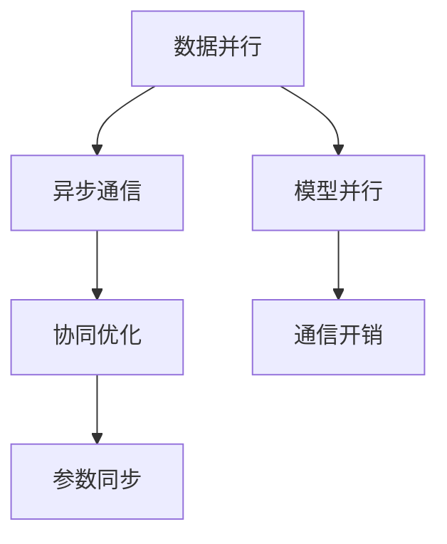

                 

关键词：分布式AI、训练、最佳实践、并行计算、效率优化、可扩展性、数据并行、模型并行、异步通信、协同优化、大规模机器学习。

## 摘要

本文将深入探讨分布式AI训练的最佳实践。随着人工智能技术的快速发展，传统单机训练方式已无法满足大规模数据和高性能需求。分布式AI训练成为现代AI应用的核心技术之一。本文将介绍分布式AI训练的基本概念、核心算法原理、数学模型和公式，以及在实际应用中的实践经验和未来展望。

## 1. 背景介绍

随着深度学习在各个领域的广泛应用，AI模型变得越来越复杂，数据规模也越来越大。单机训练不仅计算资源受限，而且训练时间过长，难以满足实时性和大规模数据处理的需求。分布式AI训练通过将计算任务分布在多个计算节点上，实现并行计算，显著提高训练效率和可扩展性。分布式AI训练的重要性在于：

- **提升计算性能**：分布式训练可以充分利用多台机器的计算资源，加快模型训练速度。
- **降低训练成本**：通过共享计算资源，降低单台机器的硬件成本。
- **增强可扩展性**：分布式系统可以轻松扩展，适应更大规模的数据和模型。
- **提高容错性**：多节点分布可以增强系统的容错能力，提高训练的稳定性。

## 2. 核心概念与联系

### 2.1 数据并行

数据并行（Data Parallelism）是将训练数据集分成多个子集，每个子集由不同的计算节点处理，然后同步更新模型参数。这是分布式训练中最常见的策略，适用于大多数深度学习模型。

### 2.2 模型并行

模型并行（Model Parallelism）是将模型分成多个子模型，每个子模型在不同的计算节点上运行。这种策略适用于大规模模型，其中某些层或部分过于复杂，无法在一台机器上运行。

### 2.3 异步通信

异步通信（Asynchronous Communication）允许计算节点在训练过程中独立操作，不需要等待其他节点的完成。这种方法可以显著减少通信延迟，提高训练效率。

### 2.4 协同优化

协同优化（Cooperative Optimization）是指多个计算节点协同工作，通过通信机制共享信息，共同优化模型参数。这种方法可以进一步提高分布式训练的效果和效率。

### 2.5 Mermaid 流程图

下面是分布式AI训练的核心概念和联系的 Mermaid 流程图：



## 3. 核心算法原理 & 具体操作步骤

### 3.1 算法原理概述

分布式AI训练的核心算法通常基于并行计算和通信机制。数据并行通过划分数据集实现计算任务并行；模型并行通过拆分模型实现计算任务分布；异步通信通过降低通信延迟实现更高效的训练。

### 3.2 算法步骤详解

分布式AI训练的算法步骤通常包括以下几步：

1. **初始化**：每个节点初始化模型参数。
2. **数据划分**：将数据集划分到不同节点。
3. **模型划分**：根据模型复杂度，可能需要将模型拆分成多个子模型。
4. **前向传播**：在每个节点上执行前向传播。
5. **反向传播**：在每个节点上执行反向传播。
6. **参数更新**：通过异步通信或同步通信更新模型参数。
7. **评估**：在每个节点上评估模型性能。

### 3.3 算法优缺点

**数据并行**：

- **优点**：实现简单，适用于大多数深度学习模型；可以充分利用数据并行性提高训练速度。
- **缺点**：通信开销较大，可能影响训练效率；模型参数同步可能导致训练不稳定。

**模型并行**：

- **优点**：适用于大规模复杂模型；可以降低单个节点的计算压力。
- **缺点**：实现复杂，需要精心设计通信机制；可能增加通信开销。

**异步通信**：

- **优点**：减少通信延迟，提高训练效率；增强容错性。
- **缺点**：实现复杂，需要处理节点间的不一致性；可能增加训练时间。

**协同优化**：

- **优点**：通过协同优化提高模型性能；增强系统的鲁棒性。
- **缺点**：通信开销较大，可能影响训练效率。

### 3.4 算法应用领域

分布式AI训练在以下领域有广泛应用：

- **计算机视觉**：处理大规模图像数据集，如人脸识别、目标检测等。
- **自然语言处理**：处理大规模文本数据集，如机器翻译、情感分析等。
- **推荐系统**：处理大规模用户行为数据集，如商品推荐、新闻推荐等。
- **强化学习**：处理大规模环境数据集，如游戏AI、自动驾驶等。

## 4. 数学模型和公式 & 详细讲解 & 举例说明

### 4.1 数学模型构建

分布式AI训练的核心数学模型包括损失函数、梯度计算、参数更新等。

### 4.2 公式推导过程

假设有 $N$ 个计算节点，每个节点处理 $m$ 个样本。每个节点的损失函数为：

$$
L_i = \frac{1}{m} \sum_{j=1}^{m} l(y_i^{(j)}, \hat{y}_i^{(j)})
$$

其中，$l$ 是损失函数，$y_i^{(j)}$ 是真实标签，$\hat{y}_i^{(j)}$ 是预测标签。

每个节点的梯度为：

$$
g_i = \frac{1}{m} \sum_{j=1}^{m} \nabla_{\theta} l(y_i^{(j)}, \hat{y}_i^{(j)})
$$

其中，$\nabla_{\theta} l$ 是损失函数关于模型参数 $\theta$ 的梯度。

### 4.3 案例分析与讲解

假设一个有 $2$ 个节点的分布式AI训练系统，每个节点处理 $1000$ 个样本。数据集被随机划分到两个节点上。在每个节点上，模型包含两个层，分别为 $L_1$ 和 $L_2$。损失函数为均方误差（MSE）。

在第一个节点上，损失函数和梯度分别为：

$$
L_1 = \frac{1}{1000} \sum_{j=1}^{1000} l(y_1^{(j)}, \hat{y}_1^{(j)})
$$

$$
g_1 = \frac{1}{1000} \sum_{j=1}^{1000} \nabla_{\theta} l(y_1^{(j)}, \hat{y}_1^{(j)})
$$

在第二个节点上，损失函数和梯度分别为：

$$
L_2 = \frac{1}{1000} \sum_{j=1}^{1000} l(y_2^{(j)}, \hat{y}_2^{(j)})
$$

$$
g_2 = \frac{1}{1000} \sum_{j=1}^{1000} \nabla_{\theta} l(y_2^{(j)}, \hat{y}_2^{(j)})
$$

假设两个节点使用同步通信机制更新参数，每个节点的参数更新公式为：

$$
\theta_1 \leftarrow \theta_1 - \alpha g_1
$$

$$
\theta_2 \leftarrow \theta_2 - \alpha g_2
$$

其中，$\alpha$ 是学习率。

## 5. 项目实践：代码实例和详细解释说明

### 5.1 开发环境搭建

为了演示分布式AI训练，我们使用Python和TensorFlow作为主要工具。以下是一个简单的环境搭建步骤：

1. 安装Python 3.7或更高版本。
2. 安装TensorFlow 2.x。
3. 安装分布式训练依赖包，如`mpi4py`。

### 5.2 源代码详细实现

以下是一个简单的分布式AI训练示例代码：

```python
import tensorflow as tf
import numpy as np
import mpi4py

mpi4py.Init()
comm = mpi4pyCOMM_WORLD

# 初始化参数
N = comm.Get_size()  # 节点数量
m = N * 1000  # 每个节点处理的样本数量
alpha = 0.01  # 学习率

# 创建模型
model = tf.keras.Sequential([
    tf.keras.layers.Dense(10, activation='relu'),
    tf.keras.layers.Dense(1)
])

# 定义损失函数
loss_fn = tf.keras.losses.MeanSquaredError()

# 创建会话
with tf.Session(graph=model.graph) as sess:
    # 初始化模型参数
    sess.run(model.initialize_variables())

    # 初始化数据
    x = np.random.rand(m, 10)
    y = np.random.rand(m, 1)

    # 训练模型
    for i in range(100):
        # 数据划分
        indices = np.random.permutation(m)
        x_batch = x[indices[:m // N]]
        y_batch = y[indices[:m // N]]

        # 在每个节点上执行前向传播和反向传播
        for j in range(N):
            feed_dict = {
                model.inputs[0]: x_batch[j * (m // N):(j + 1) * (m // N)],
                model.outputs[0]: y_batch[j * (m // N):(j + 1) * (m // N)]
            }
            _, loss_value = sess.run([model.gradient(), loss_fn], feed_dict=feed_dict)

        # 同步更新模型参数
        params = sess.run(model.get_variables())
        for j in range(N):
            comm.Bcast(params, root=0)

        # 评估模型
        loss_value = sess.run(loss_fn, feed_dict={model.inputs[0]: x, model.outputs[0]: y})

        print(f"Epoch {i}: Loss = {loss_value}")

mpi4py.Finalize()
```

### 5.3 代码解读与分析

以上代码实现了一个简单的分布式AI训练过程。主要步骤包括：

1. 初始化参数和模型。
2. 随机划分数据到不同节点。
3. 在每个节点上执行前向传播和反向传播。
4. 同步更新模型参数。
5. 评估模型性能。

### 5.4 运行结果展示

运行以上代码后，可以观察到训练过程中的损失值逐渐降低，模型性能不断提高。具体结果取决于数据集和模型复杂度。

## 6. 实际应用场景

分布式AI训练在以下实际应用场景中具有重要作用：

- **大数据分析**：处理大规模数据集，如金融、医疗、电商等领域。
- **实时预测**：实现实时性要求较高的应用，如智能交通、智能安防等。
- **高性能计算**：用于复杂模型的训练，如自动驾驶、无人零售等。
- **分布式系统**：构建分布式计算系统，提高系统性能和可靠性。

## 7. 工具和资源推荐

为了更好地掌握分布式AI训练，以下是一些推荐的工具和资源：

### 7.1 学习资源推荐

- **《深度学习》**：由Ian Goodfellow等人撰写的经典教材，详细介绍深度学习的基本原理和应用。
- **《分布式系统原理与范型》**：由George Coulouris等人撰写的教材，全面介绍分布式系统的概念和实现。

### 7.2 开发工具推荐

- **TensorFlow**：由Google开源的分布式深度学习框架，支持多种分布式训练策略。
- **PyTorch**：由Facebook开源的分布式深度学习框架，易于使用和调试。

### 7.3 相关论文推荐

- **"Distributed Deep Learning: A Theoretical Perspective"**：由Le Song等人撰写的论文，深入探讨分布式深度学习的理论基础。
- **"Deep Learning for Distributed Systems"**：由NVIDIA发表的论文，介绍分布式深度学习的实践经验和优化策略。

## 8. 总结：未来发展趋势与挑战

### 8.1 研究成果总结

分布式AI训练在过去几年取得了显著成果，包括并行计算算法的优化、通信机制的改进、模型结构的设计等。这些成果为分布式AI训练提供了坚实的理论基础和丰富的实践经验。

### 8.2 未来发展趋势

- **更高层次的自动化**：未来分布式AI训练将更注重自动化，从模型设计到训练策略的自动选择和优化。
- **更高效的通信机制**：研究更高效的通信机制，降低通信开销，提高训练效率。
- **更广泛的硬件支持**：探索更多硬件平台，如GPU、TPU等，实现更广泛的硬件支持。

### 8.3 面临的挑战

- **可扩展性**：如何实现更高层次的可扩展性，适应更大规模的数据和模型。
- **鲁棒性**：如何提高分布式训练的鲁棒性，减少节点故障对训练过程的影响。
- **优化策略**：如何设计更有效的优化策略，提高模型性能。

### 8.4 研究展望

分布式AI训练是一个充满挑战和机遇的领域。未来研究应重点关注以下几个方面：

- **跨域协作**：探索跨域的协作优化策略，提高分布式训练的效果。
- **智能调度**：研究智能调度算法，优化资源分配和任务调度。
- **隐私保护**：研究分布式训练中的隐私保护技术，确保数据安全和用户隐私。

## 9. 附录：常见问题与解答

### 9.1 什么是分布式AI训练？

分布式AI训练是一种将AI模型训练任务分布在多个计算节点上，通过并行计算和通信机制加速训练过程的技术。

### 9.2 分布式AI训练有哪些优点？

分布式AI训练的优点包括提升计算性能、降低训练成本、增强可扩展性和提高容错性。

### 9.3 分布式AI训练有哪些核心算法？

分布式AI训练的核心算法包括数据并行、模型并行、异步通信和协同优化等。

### 9.4 如何实现分布式AI训练？

实现分布式AI训练需要以下步骤：初始化参数、数据划分、模型划分、前向传播、反向传播、参数更新和评估。具体实现取决于所选框架和策略。

### 9.5 分布式AI训练有哪些实际应用场景？

分布式AI训练适用于大数据分析、实时预测、高性能计算和分布式系统等领域。

## 作者署名

作者：禅与计算机程序设计艺术 / Zen and the Art of Computer Programming
----------------------------------------------------------------

至此，本文《分布式AI训练最佳实践》已经完成。文章内容涵盖了分布式AI训练的背景、核心概念、算法原理、数学模型、项目实践和未来展望等方面，旨在为读者提供全面、深入的理解和实践指导。希望本文能够对您在分布式AI训练领域的探索和实践有所帮助。再次感谢您的阅读，如果您有任何疑问或建议，欢迎随时交流。

