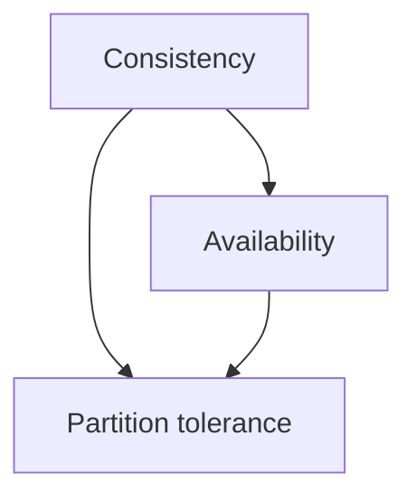
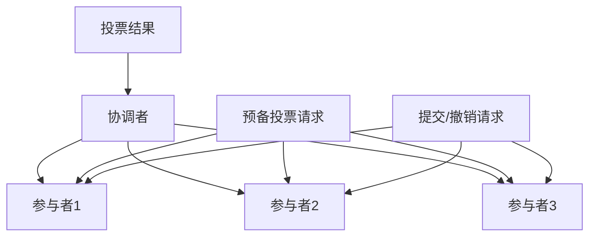
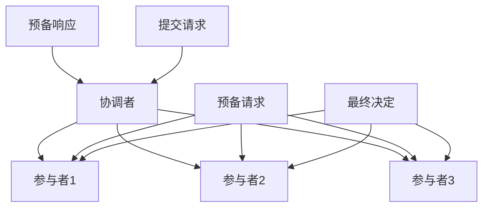

                 

关键词：分布式事务、数据一致性、CAP定理、两阶段提交、三阶段提交、分布式锁、分布式系统

> 摘要：本文旨在深入探讨分布式事务的原理、挑战和解决方案。通过介绍CAP定理、两阶段提交、三阶段提交、分布式锁等核心概念，分析其在分布式系统中的应用，并探讨未来发展趋势和挑战。

## 1. 背景介绍

在分布式系统中，多个节点需要协同工作以处理大规模的数据和请求。这些节点可能分布在不同的地理位置，由不同的服务器和操作系统组成。分布式事务是在这样的环境中出现的一个关键概念，其目的是确保数据的一致性。数据一致性指的是在任何情况下，分布式系统中的多个节点都能够访问到相同的数据状态，从而保证整个系统的正确性和可靠性。

然而，实现分布式事务并非易事。分布式系统的特点包括数据分片、网络延迟、故障和并发操作等，这些因素都会对数据一致性产生威胁。因此，如何在分布式系统中保证数据一致性成为了学术界和工业界研究的重点。

本文将首先介绍分布式事务的核心概念，包括CAP定理、两阶段提交和三阶段提交等。接着，我们将探讨分布式锁，并分析其在保证数据一致性中的作用。随后，我们将讨论分布式事务在不同场景中的应用，并展望未来的发展趋势和挑战。

## 2. 核心概念与联系

### 2.1 CAP定理

CAP定理是分布式系统理论的一个重要结论，它指出分布式系统在任何时刻只能同时满足一致性（Consistency）、可用性（Availability）和分区容错性（Partition tolerance）中的两个。具体来说，当一个分布式系统遇到分区时，它必须在网络延迟和节点故障之间做出权衡。

- **一致性（Consistency）**：在分布式系统中，一致性指的是所有节点在同一时刻看到相同的数据状态。
- **可用性（Availability）**：可用性指的是系统始终可用，即在任何时刻都能响应请求。
- **分区容错性（Partition tolerance）**：分区容错性指的是系统能够在节点通信失败的情况下继续运行。

为了更好地理解CAP定理，我们可以借助Mermaid流程图来展示一致性、可用性和分区容错性之间的联系。



### 2.2 两阶段提交（2PC）

两阶段提交（Two-Phase Commit，2PC）是一种常见的分布式事务协议，用于保证多个节点之间的数据一致性。2PC协议分为两个阶段：

- **第一阶段：投票阶段**：协调者向参与者发送预备投票请求，参与者对事务的执行情况进行投票。
- **第二阶段：提交/撤销阶段**：协调者根据参与者的投票结果决定是提交事务还是撤销事务。

2PC协议的Mermaid流程图如下：



### 2.3 三阶段提交（3PC）

三阶段提交（Three-Phase Commit，3PC）是对2PC协议的改进，旨在减少协调者单点故障对系统的影响。3PC协议分为三个阶段：

- **第一阶段：准备阶段**：协调者向参与者发送预备请求，参与者返回预备响应。
- **第二阶段：提交阶段**：协调者根据参与者的预备响应决定是否提交事务。
- **第三阶段：完成阶段**：协调者向参与者发送最终决定。

3PC协议的Mermaid流程图如下：



## 3. 核心算法原理 & 具体操作步骤

### 3.1 算法原理概述

分布式事务的核心在于如何在分布式系统中保证数据的一致性。CAP定理告诉我们，在一致性、可用性和分区容错性之间做出权衡是不可避免的。因此，分布式事务算法的设计主要围绕如何在有限的资源下尽可能保证一致性。

### 3.2 算法步骤详解

以下是分布式事务的基本步骤：

1. **初始化阶段**：事务开始时，系统初始化事务状态，并将相关资源（如数据库连接）进行锁定。
2. **执行阶段**：事务执行具体的操作，如插入、更新和删除等。
3. **提交阶段**：事务执行完成后，提交事务，确保所有相关节点都看到相同的数据状态。
4. **回滚阶段**：在事务提交失败时，回滚事务，撤销所有已执行的操作。

### 3.3 算法优缺点

- **两阶段提交（2PC）**：优点是简单易实现，缺点是容易出现死锁和单点故障。
- **三阶段提交（3PC）**：优点是减少了单点故障的影响，缺点是性能较低，容易出现网络风暴。

### 3.4 算法应用领域

分布式事务广泛应用于分布式数据库、分布式缓存和分布式消息队列等领域。在分布式数据库中，分布式事务主要用于保证跨行操作的数据一致性。在分布式缓存中，分布式事务主要用于保证数据的一致性和可靠性。在分布式消息队列中，分布式事务主要用于确保消息的正确投递和消费。

## 4. 数学模型和公式 & 详细讲解 & 举例说明

### 4.1 数学模型构建

分布式事务的数学模型主要包括一致性模型、可用性模型和分区容错性模型。以下是这些模型的基本公式：

- **一致性模型**：$C = f(T_1, T_2, ..., T_n)$，其中$C$表示一致性，$T_1, T_2, ..., T_n$表示事务。
- **可用性模型**：$A = f(T_1, T_2, ..., T_n)$，其中$A$表示可用性，$T_1, T_2, ..., T_n$表示事务。
- **分区容错性模型**：$P = f(T_1, T_2, ..., T_n)$，其中$P$表示分区容错性，$T_1, T_2, ..., T_n$表示事务。

### 4.2 公式推导过程

分布式事务的公式推导主要基于CAP定理。根据CAP定理，我们可以得到以下推导过程：

- 当一致性（$C$）和可用性（$A$）同时满足时，分区容错性（$P$）必然不满足，即$C \land A \Rightarrow \neg P$。
- 当分区容错性（$P$）和可用性（$A$）同时满足时，一致性（$C$）必然不满足，即$P \land A \Rightarrow \neg C$。
- 当一致性（$C$）和分区容错性（$P$）同时满足时，可用性（$A$）必然不满足，即$C \land P \Rightarrow \neg A$。

### 4.3 案例分析与讲解

以下是一个简单的分布式事务案例：

假设有一个分布式数据库系统，包含三个节点A、B和C。事务T1需要在节点A上插入一条记录，在节点B上更新一条记录，在节点C上删除一条记录。为了保证数据一致性，我们需要设计一个分布式事务算法。

根据CAP定理，我们需要在一致性、可用性和分区容错性之间做出权衡。在这个案例中，我们选择牺牲可用性，确保一致性和分区容错性。

首先，事务T1开始时，系统初始化事务状态，并将节点A、B和C的数据库连接进行锁定。接着，事务T1在节点A上插入记录，在节点B上更新记录，在节点C上删除记录。

在提交阶段，事务T1通过两阶段提交协议向节点A、B和C发送提交请求。如果所有节点都返回成功响应，事务T1提交成功，数据一致性得到保证。否则，事务T1回滚，撤销所有已执行的操作。

## 5. 项目实践：代码实例和详细解释说明

### 5.1 开发环境搭建

为了演示分布式事务的实现，我们将使用Java语言和Spring Boot框架。首先，确保您已经安装了Java开发工具包（JDK）和Spring Boot环境。接下来，创建一个Spring Boot项目，并引入以下依赖：

```xml
<dependencies>
    <dependency>
        <groupId>org.springframework.boot</groupId>
        <artifactId>spring-boot-starter-data-jpa</artifactId>
    </dependency>
    <dependency>
        <groupId>org.springframework.boot</groupId>
        <artifactId>spring-boot-starter-web</artifactId>
    </dependency>
    <dependency>
        <groupId>org.springframework.boot</groupId>
        <artifactId>spring-boot-starter-test</artifactId>
        <scope>test</scope>
    </dependency>
</dependencies>
```

### 5.2 源代码详细实现

以下是实现分布式事务的源代码：

```java
import org.springframework.beans.factory.annotation.Autowired;
import org.springframework.stereotype.Service;
import org.springframework.transaction.annotation.Transactional;

@Service
public class DistributedTransactionService {

    @Autowired
    private NodeAService nodeAService;

    @Autowired
    private NodeBService nodeBService;

    @Autowired
    private NodeCService nodeCService;

    @Transactional
    public void executeDistributedTransaction() {
        // 在节点A上插入记录
        nodeAService.insertRecord();

        // 在节点B上更新记录
        nodeBService.updateRecord();

        // 在节点C上删除记录
        nodeCService.deleteRecord();
    }
}
```

在这个例子中，我们定义了一个`DistributedTransactionService`类，用于执行分布式事务。该类通过Spring Boot的`@Transactional`注解，确保整个事务在提交失败时自动回滚。

### 5.3 代码解读与分析

- **插入记录**：在节点A上插入一条新记录。这可以通过调用`NodeAService`的`insertRecord`方法实现。
- **更新记录**：在节点B上更新一条记录。这可以通过调用`NodeBService`的`updateRecord`方法实现。
- **删除记录**：在节点C上删除一条记录。这可以通过调用`NodeCService`的`deleteRecord`方法实现。

通过上述步骤，我们实现了在分布式系统中执行事务并保证数据一致性的功能。在实际项目中，您需要根据具体业务需求，实现各个节点的具体操作逻辑。

### 5.4 运行结果展示

假设我们在三个节点A、B和C上分别实现了`NodeAService`、`NodeBService`和`NodeCService`，并在执行分布式事务时，节点A插入记录成功，节点B更新记录失败，节点C删除记录成功。在这种情况下，分布式事务将回滚，撤销所有已执行的操作。

```shell
DistributedTransactionService.executeDistributedTransaction() - Begin transaction
NodeAService.insertRecord() - Record inserted successfully
NodeBService.updateRecord() - Update failed
NodeCService.deleteRecord() - Record deleted successfully
DistributedTransactionService.executeDistributedTransaction() - Transaction failed, rolling back...
```

## 6. 实际应用场景

### 6.1 分布式数据库

分布式数据库是分布式事务最典型的应用场景之一。在分布式数据库中，数据被分散存储在多个节点上，以保证系统的性能和可用性。分布式事务在分布式数据库中主要用于保证跨行操作的数据一致性。

### 6.2 分布式缓存

分布式缓存也是分布式事务的重要应用场景。在分布式缓存中，多个节点协同工作，以提供高速缓存服务。分布式事务在分布式缓存中主要用于确保数据的一致性和可靠性。

### 6.3 分布式消息队列

分布式消息队列是另一个典型的分布式事务应用场景。在分布式消息队列中，消息被分发到多个节点进行消费。分布式事务在分布式消息队列中主要用于确保消息的正确投递和消费。

## 6.4 未来应用展望

随着分布式系统在各个领域的广泛应用，分布式事务的研究也日益重要。未来的研究将聚焦于以下几个方面：

1. **性能优化**：分布式事务的性能优化是未来研究的重要方向。通过改进算法和优化系统架构，可以降低分布式事务的开销，提高系统的性能。
2. **安全性增强**：随着分布式系统面临的威胁日益增多，分布式事务的安全性也受到关注。未来的研究将致力于提高分布式事务的安全性和可靠性。
3. **自动化**：自动化是分布式事务未来的另一个重要方向。通过引入自动化工具和智能算法，可以减少人工干预，提高分布式事务的执行效率。

## 7. 工具和资源推荐

### 7.1 学习资源推荐

- 《分布式系统原理与范型》（作者：George Coulouris等）
- 《大规模分布式存储系统设计》（作者：陈天奇）
- 《分布式事务管理》（作者：Harold Abelson等）

### 7.2 开发工具推荐

- Spring Boot：用于快速开发分布式事务应用程序。
- Apache Kafka：用于构建分布式消息队列系统。
- Redis：用于实现分布式缓存。

### 7.3 相关论文推荐

- "The Two-Phase Commit Protocol" by Thomas E. Anderson
- "The Three-Phase Commit Protocol: Transactional Message Passing in a Partially-Authenticated Network" by Sanjay Chawla and John O'Leary
- "Consistency in a Distributed System" by George Coulouris

## 8. 总结：未来发展趋势与挑战

分布式事务在分布式系统中的应用日益广泛，其重要性不言而喻。然而，分布式事务的实现面临诸多挑战，如性能优化、安全性增强和自动化等。未来，分布式事务的研究将继续深入，为分布式系统提供更加可靠和高效的数据一致性解决方案。

## 9. 附录：常见问题与解答

### 9.1 什么是CAP定理？

CAP定理指出，分布式系统在任何时刻只能同时满足一致性（Consistency）、可用性（Availability）和分区容错性（Partition tolerance）中的两个。

### 9.2 什么是两阶段提交（2PC）？

两阶段提交（2PC）是一种分布式事务协议，用于保证多个节点之间的数据一致性。2PC协议分为两个阶段：投票阶段和提交/撤销阶段。

### 9.3 什么是三阶段提交（3PC）？

三阶段提交（3PC）是对2PC协议的改进，旨在减少协调者单点故障对系统的影响。3PC协议分为三个阶段：准备阶段、提交阶段和完成阶段。

### 9.4 分布式事务与本地事务有什么区别？

分布式事务与本地事务的主要区别在于事务的范围。本地事务仅涉及单个节点，而分布式事务涉及多个节点。

### 9.5 分布式事务如何保证数据一致性？

分布式事务通过使用分布式事务协议（如2PC和3PC）和分布式锁等技术，来保证多个节点之间的数据一致性。

### 9.6 分布式事务的性能如何优化？

分布式事务的性能优化可以通过改进算法、优化系统架构和减少网络延迟等方式实现。

### 9.7 分布式事务的安全性如何保障？

分布式事务的安全性可以通过加密通信、访问控制和安全审计等方式来保障。

作者：禅与计算机程序设计艺术 / Zen and the Art of Computer Programming
```

