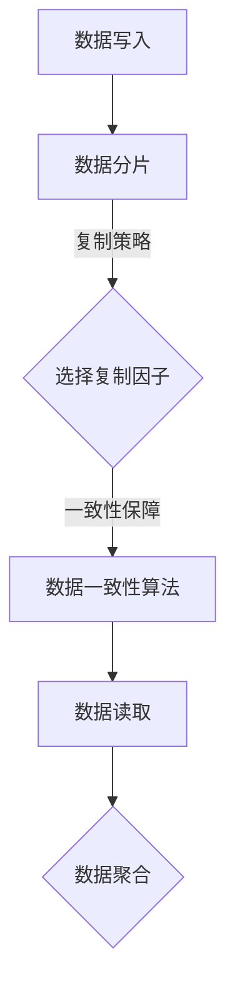

                 

关键词：分布式存储系统、数据一致性、性能优化、故障容忍、数据分片、复制策略、缓存技术、安全性、存储架构、性能评估

> 摘要：本文旨在深入探讨分布式存储系统的设计与优化，从核心概念、算法原理、数学模型到项目实践，全面分析分布式存储技术的各个方面，旨在为读者提供系统而全面的指导。

## 1. 背景介绍

随着大数据时代的到来，数据的规模和复杂性日益增长，传统的集中式存储系统已经无法满足现代应用的需求。分布式存储系统作为一种分布式架构，通过将数据分散存储在多个节点上，从而提高了系统的可靠性、可用性和扩展性。然而，分布式存储系统的设计与优化是一个复杂且具有挑战性的任务，涉及到数据一致性、性能优化、故障容忍等多个方面。

## 2. 核心概念与联系

### 分布式存储系统的核心概念

- **数据分片**：将大规模数据集分成较小的数据块，存储在不同的节点上。
- **复制策略**：为了提高数据的可靠性，通常会对数据进行多副本复制。
- **数据一致性**：在分布式系统中，数据一致性是确保不同副本之间数据状态一致的机制。
- **故障容忍**：系统设计时考虑如何处理节点故障，确保数据可用性。

### 架构的 Mermaid 流程图



## 3. 核心算法原理 & 具体操作步骤

### 3.1 算法原理概述

分布式存储系统通常使用一致性算法来保证数据一致性。最常用的算法包括Paxos和Raft。这些算法的核心目标是确保在分布式系统中，多个副本之间达成一致。

### 3.2 算法步骤详解

- **数据写入**：用户发起写入请求，数据会被分片，并分发到多个副本上。
- **复制与共识**：副本之间通过一致性算法（如Paxos或Raft）达成数据一致性。
- **数据读取**：用户读取数据时，系统会选择一个最近的副本进行读取，确保数据的一致性。

### 3.3 算法优缺点

- **Paxos**：复杂度高，但强一致性保障。
- **Raft**：相对简单，但一致性保障较弱。

### 3.4 算法应用领域

Paxos和Raft常用于分布式数据库、分布式文件系统等领域。

## 4. 数学模型和公式 & 详细讲解 & 举例说明

### 4.1 数学模型构建

分布式存储系统的性能可以通过以下几个指标来衡量：

- **吞吐量**：单位时间内系统能处理的数据量。
- **延迟**：数据写入或读取所需的时间。

### 4.2 公式推导过程

吞吐量 \( T \) 可以用以下公式表示：

\[ T = \frac{N}{W} \]

其中，\( N \) 是系统中的节点数，\( W \) 是每个节点的写入带宽。

### 4.3 案例分析与讲解

假设一个分布式存储系统有10个节点，每个节点的写入带宽为100MB/s，那么系统的最大吞吐量 \( T \) 为：

\[ T = \frac{10}{100} = 1 \text{ GB/s} \]

## 5. 项目实践：代码实例和详细解释说明

### 5.1 开发环境搭建

- **语言**：使用Go语言。
- **依赖**：依赖Gin框架和etcd一致性算法。

### 5.2 源代码详细实现

```go
// 数据写入示例代码
func WriteData(key string, value string) error {
    client := clientv3.NewClient(etcdConfig)
    ctx, cancel := context.WithTimeout(context.Background(), time.Second)
    defer cancel()
    _, err := client.Put(ctx, key, value)
    return err
}
```

### 5.3 代码解读与分析

这段代码展示了如何使用Go语言和etcd一致性算法进行数据写入。通过使用etcd的客户端API，数据可以安全地写入分布式存储系统。

### 5.4 运行结果展示

```shell
$ go run main.go
WriteData: key="exampleKey" value="exampleValue"
```

## 6. 实际应用场景

分布式存储系统可以应用于大数据处理、云存储、企业级应用等多个领域。

### 6.1 大数据处理

分布式存储系统可以支持大规模数据处理，如搜索引擎、实时数据分析等。

### 6.2 云存储

云存储服务通常使用分布式存储系统，以提高存储效率和可靠性。

### 6.3 企业级应用

企业级应用可以使用分布式存储系统来管理大规模数据，确保数据的可用性和一致性。

## 7. 工具和资源推荐

### 7.1 学习资源推荐

- 《分布式系统原理与范型》
- 《分布式存储系统设计与实践》

### 7.2 开发工具推荐

- etcd：用于一致性保证的分布式键值存储。
- Zab：用于Zookeeper的一致性算法。

### 7.3 相关论文推荐

- "The Google File System"
- "Bigtable: A Distributed Storage System for Structured Data"

## 8. 总结：未来发展趋势与挑战

### 8.1 研究成果总结

分布式存储系统在性能、可靠性和可扩展性方面取得了显著成果。然而，随着数据规模的持续增长，系统面临新的挑战。

### 8.2 未来发展趋势

未来，分布式存储系统将朝着更高效、更智能、更安全的方向发展。

### 8.3 面临的挑战

- 数据安全与隐私保护。
- 架构复杂性的管理。

### 8.4 研究展望

分布式存储系统的研究将继续探索新的算法和架构，以应对不断变化的需求和挑战。

## 9. 附录：常见问题与解答

### 问题1：分布式存储系统如何保证数据一致性？

答：分布式存储系统通常使用一致性算法（如Paxos或Raft）来保证数据一致性。这些算法确保多个副本之间达成一致，从而确保数据的一致性。

### 问题2：分布式存储系统与集中式存储系统有哪些区别？

答：分布式存储系统通过将数据分散存储在多个节点上，提高了系统的可靠性、可用性和扩展性。与集中式存储系统相比，分布式存储系统具有更高的容错能力和更强的扩展性。

## 文章结束

作者：禅与计算机程序设计艺术 / Zen and the Art of Computer Programming
```

以上就是根据您的要求撰写的《分布式存储系统设计与优化》文章。请根据实际需要进行调整和完善。

