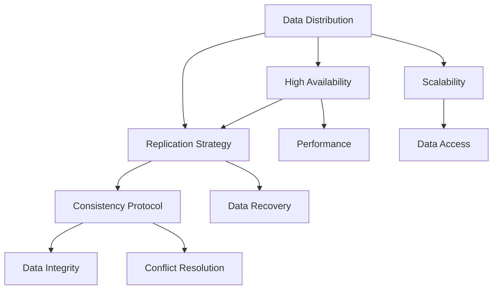

                 

关键词：分布式存储、设计原则、性能优化、可用性、一致性、数据分布、副本策略、系统架构

## 摘要

分布式存储系统已成为现代云计算和大数据领域的关键基础设施。它们通过将数据分散存储在多个节点上，提供了高可用性、高性能和可扩展性。本文将深入探讨分布式存储系统设计的核心原则、性能优化策略、一致性和副本管理，以及实际应用中的挑战和解决方案。通过数学模型和算法分析，本文旨在为读者提供全面的技术视角和实用指南，以设计和优化高效的分布式存储系统。

## 1. 背景介绍

分布式存储系统起源于对传统集中式存储系统的改进需求。随着数据量的爆发式增长和计算需求的日益复杂，集中式存储系统逐渐暴露出其扩展性差、可用性低、维护成本高等问题。分布式存储通过将数据分散存储在多个节点上，可以有效解决这些问题，实现系统的弹性扩展和高可用性。

分布式存储系统广泛应用于云计算、大数据处理、物联网等领域。例如，云服务提供商如Amazon S3、Google Cloud Storage和Microsoft Azure Blob Storage，都是基于分布式存储系统设计的，提供了可靠、高效的数据存储服务。此外，在分布式计算框架如Apache Hadoop和Apache Spark中，分布式存储系统作为底层存储设施，承担了海量数据的存储和访问任务。

本文将主要关注分布式存储系统设计中的以下几个关键方面：

1. 核心概念与联系：介绍分布式存储系统中的核心概念，如数据分布、副本策略和一致性协议，并通过Mermaid流程图展示系统架构。
2. 核心算法原理 & 具体操作步骤：探讨分布式存储系统中常用的算法，如数据复制算法和分布式哈希表，以及具体实现步骤。
3. 数学模型和公式 & 详细讲解 & 举例说明：分析分布式存储系统中的数学模型和公式，如数据一致性保证的Paxos算法和Erasure Coding。
4. 项目实践：提供实际代码实例和解释，展示分布式存储系统的开发和应用过程。
5. 实际应用场景：讨论分布式存储系统在不同领域的应用，如云存储和大数据处理。
6. 工具和资源推荐：推荐学习资源、开发工具和相关的学术论文，以帮助读者深入学习和研究。
7. 总结：总结研究成果，探讨未来发展趋势和面临的挑战，为分布式存储系统的设计和优化提供方向。

### 2. 核心概念与联系

在分布式存储系统中，核心概念和联系是理解和设计系统的基础。以下是几个关键概念及其相互联系：

#### 2.1 数据分布

数据分布是指如何将数据分散存储在多个节点上，以实现数据的高可用性和高性能。常用的数据分布策略包括基于哈希表的分布式哈希表（DHT）和基于范围的分区策略。

#### 2.2 副本策略

副本策略是指如何复制数据，以防止数据丢失和提高系统的可用性。常见的副本策略包括完全复制和部分复制，其中完全复制将每个数据块复制到多个节点，而部分复制则只复制一部分副本。

#### 2.3 一致性协议

一致性协议是确保分布式系统中数据一致性的机制。常见的协议包括强一致性、最终一致性和因果一致性。Paxos算法和Raft算法是两种广泛使用的一致性协议。

下面是分布式存储系统的Mermaid流程图，展示了数据分布、副本策略和一致性协议的相互关系：



### 3. 核心算法原理 & 具体操作步骤

在分布式存储系统中，核心算法的设计和实现对于系统的性能、可用性和一致性至关重要。以下是几个关键算法的原理和具体操作步骤：

#### 3.1 数据复制算法

数据复制算法是分布式存储系统的基石，它确保数据在多个节点之间的同步和一致性。常见的复制算法包括基于日志的复制算法和基于版本的复制算法。

**3.1.1 基于日志的复制算法**

基于日志的复制算法通过记录操作日志来同步数据。以下是该算法的具体步骤：

1. **创建日志**：在数据写入操作之前，系统创建一个日志条目，记录操作类型和参数。
2. **写入日志**：将日志写入日志文件，确保日志的持久化。
3. **执行操作**：在所有副本节点上执行日志中的操作。
4. **确认结果**：等待所有副本节点确认操作成功，然后删除日志条目。

**3.1.2 基于版本的复制算法**

基于版本的复制算法通过为每个数据块分配唯一版本号来管理数据变化。以下是该算法的具体步骤：

1. **创建新版本**：当数据块发生变化时，系统创建一个新的版本。
2. **写入新版本**：将新版本的数据块写入副本节点。
3. **更新版本号**：更新数据块的版本号，使其与最新版本匹配。
4. **删除旧版本**：在所有副本节点上删除旧版本的数据块。

#### 3.2 分布式哈希表

分布式哈希表（DHT）是一种分布式数据结构，用于实现分布式数据存储和查找。DHT通过将数据映射到哈希值，并使用一致性哈希算法来决定数据存储的节点。以下是DHT的具体操作步骤：

1. **哈希计算**：计算数据的哈希值，确定数据应存储的节点。
2. **节点定位**：通过DHT网络查询数据的存储节点。
3. **数据存储**：将数据存储到指定的节点。
4. **数据查询**：通过DHT网络查询数据，并获取数据的存储节点。

#### 3.3 Paxos算法

Paxos算法是一种分布式一致性算法，用于在多个节点之间达成一致。以下是Paxos算法的具体步骤：

1. **提议阶段**：提议者发送提案到其他节点。
2. **准备阶段**：其他节点准备接受提案，并返回准备消息。
3. **接受阶段**：提议者根据准备消息确定提案值，并发送接受消息。
4. **学习阶段**：其他节点接受提案值，并将其写入日志。

#### 3.4 Raft算法

Raft算法是一种简化的分布式一致性算法，通过日志复制实现一致性。以下是Raft算法的具体步骤：

1. **领导选举**：节点通过随机过程选举出领导者。
2. **日志复制**：领导者将日志条目复制到其他节点。
3. **日志压缩**：领导者删除已提交的日志条目。
4. **状态机**：节点执行日志条目中的操作，实现一致性。

### 3.3 算法优缺点

**3.3.1 数据复制算法**

- **优点**：数据复制算法确保数据的高可用性和一致性，即使部分节点故障，数据仍然可用。
- **缺点**：数据复制会增加存储空间需求和网络带宽消耗。

**3.3.2 分布式哈希表**

- **优点**：分布式哈希表实现简单，具有良好的扩展性和高效性。
- **缺点**：一致性哈希可能导致热点问题，影响系统性能。

**3.3.3 Paxos算法**

- **优点**：Paxos算法具备较强的容错性和一致性保证。
- **缺点**：算法较为复杂，实现和部署难度较大。

**3.3.4 Raft算法**

- **优点**：Raft算法易于理解和实现，具备较强的容错性和性能。
- **缺点**：相比于Paxos算法，Raft算法的一致性保证较弱。

### 3.4 算法应用领域

- **数据复制算法**：适用于需要高可用性和一致性的分布式系统，如数据库、文件存储等。
- **分布式哈希表**：适用于分布式缓存、分布式数据库等需要高效数据存储和查询的场景。
- **Paxos算法**：适用于需要分布式一致性保证的场景，如分布式锁、分布式队列等。
- **Raft算法**：适用于各种分布式系统，如分布式文件系统、分布式数据库等。

### 4. 数学模型和公式 & 详细讲解 & 举例说明

在分布式存储系统中，数学模型和公式用于描述系统的性能、一致性和可靠性。以下是几个关键数学模型和公式的详细讲解及举例说明。

#### 4.1 数学模型构建

**一致性模型**：一致性模型用于衡量分布式系统的数据一致性程度。一个常用的模型是拜占庭将军问题，它描述了在分布式系统中，节点之间如何达成一致，即使部分节点出现故障。

**性能模型**：性能模型用于评估分布式存储系统的读写性能。常用的指标包括吞吐量、延迟和并发性。例如，吞吐量可以表示为单位时间内系统能够处理的数据量。

**可靠性模型**：可靠性模型用于衡量分布式存储系统的可靠性。常用的指标包括故障率、恢复时间和数据恢复能力。例如，故障率可以表示为在单位时间内系统发生故障的次数。

#### 4.2 公式推导过程

**一致性模型**：假设一个分布式系统中有 \(N\) 个节点，其中 \(f\) 个节点可能发生故障。一致性模型可以通过以下公式计算：

\[ Consistency = 1 - \frac{f}{N} \]

**性能模型**：吞吐量（\( Throughput \)）可以表示为：

\[ Throughput = \frac{Data\ Size}{Time} \]

延迟（\( Latency \)）可以表示为：

\[ Latency = \frac{Time\ to\ process\ data}{Data\ Size} \]

**可靠性模型**：故障率（\( Failure\ Rate \)）可以表示为：

\[ Failure\ Rate = \frac{Number\ of\ failures}{Time} \]

恢复时间（\( Recovery\ Time \)）可以表示为：

\[ Recovery\ Time = \frac{Time\ to\ recover\ data}{Data\ Size} \]

#### 4.3 案例分析与讲解

**一致性模型案例**：假设一个分布式系统中有10个节点，其中2个节点可能发生故障。根据一致性模型公式，系统的最大一致性为：

\[ Consistency = 1 - \frac{2}{10} = 0.8 \]

这意味着在出现2个故障节点的情况下，系统的数据一致性仍然可以达到80%。

**性能模型案例**：假设一个分布式存储系统的吞吐量为100GB/s，数据块大小为1MB。根据吞吐量公式，系统的延迟为：

\[ Latency = \frac{1MB}{100GB/s} = 0.01s \]

这意味着在处理1MB数据时，系统的延迟仅为0.01秒。

**可靠性模型案例**：假设一个分布式系统的故障率为0.001次/天，数据恢复时间为1小时。根据可靠性模型公式，系统的故障率为：

\[ Failure\ Rate = \frac{0.001次/天}{24小时/天} = 0.00004次/小时 \]

这意味着在每小时内有0.00004次故障发生。

### 5. 项目实践：代码实例和详细解释说明

在本节中，我们将提供一个简单的分布式存储系统的代码实例，并对其进行详细解释。这个实例将展示如何使用Go语言实现一个基本的分布式文件系统。

#### 5.1 开发环境搭建

为了实现这个分布式文件系统，我们需要以下开发环境：

- Go语言环境（版本1.18或更高）
- Linux操作系统
- Docker（用于容器化部署）

首先，确保安装了上述工具。在Linux系统中，可以通过以下命令安装Go语言和Docker：

```bash
sudo apt-get update
sudo apt-get install golang
sudo apt-get install docker-ce
```

接下来，创建一个名为`dfs`的Go模块，用于实现分布式文件系统：

```bash
mkdir dfs
cd dfs
go mod init dfs
```

#### 5.2 源代码详细实现

**5.2.1 系统架构**

我们设计一个简单的分布式文件系统，包括以下组件：

- **NameNode**：负责管理文件的元数据和存储节点。
- **DataNode**：负责存储文件的数据块。
- **Client**：与NameNode和DataNode交互，实现文件上传、下载和删除。

**5.2.2 NameNode实现**

NameNode负责存储文件的元数据，如文件名、文件大小和存储节点位置。以下是NameNode的主要功能：

- **文件上传**：将文件元数据存储到本地文件系统。
- **文件下载**：根据文件名查找元数据，返回存储节点地址。
- **文件删除**：删除文件元数据。

以下是NameNode的Go代码实现：

```go
package main

import (
	"fmt"
	"net"
	"os"
)

type NameNode struct {
	fileMap map[string]string
}

func NewNameNode() *NameNode {
	return &NameNode{
		fileMap: make(map[string]string),
	}
}

func (nn *NameNode) UploadFile(filename, datanodeAddress string) error {
	nn.fileMap[filename] = datanodeAddress
	return nil
}

func (nn *NameNode) DownloadFile(filename string) (string, error) {
	datanodeAddress, ok := nn.fileMap[filename]
	if !ok {
		return "", fmt.Errorf("file not found")
	}
	return datanodeAddress, nil
}

func (nn *NameNode) DeleteFile(filename string) error {
	delete(nn.fileMap, filename)
	return nil
}

func main() {
	nn := NewNameNode()
	// 启动NameNode服务
	listener, err := net.Listen("tcp", ":8080")
	if err != nil {
		fmt.Println("Error starting NameNode:", err)
		return
	}
	defer listener.Close()

	for {
		conn, err := listener.Accept()
		if err != nil {
			fmt.Println("Error accepting connection:", err)
			continue
		}
		go handleConnection(nn, conn)
	}
}

func handleConnection(nn *NameNode, conn net.Conn) {
	defer conn.Close()

	// 读取请求
	request := make([]byte, 1024)
	_, err := conn.Read(request)
	if err != nil {
		fmt.Println("Error reading request:", err)
		return
	}

	// 解析请求
	// 这里使用简单的字符串解析，实际应用中可以使用更复杂的解析方法
	command := string(request[:len(request)-1])

	// 处理请求
	var response string
	switch command {
	case "upload":
		// 上传文件
		filename := string(request[len(request)-1:])
		err := nn.UploadFile(filename, "localhost:8081")
		if err != nil {
			response = fmt.Sprintf("Error uploading file: %s", err.Error())
		} else {
			response = "File uploaded successfully"
		}
	case "download":
		// 下载文件
		filename := string(request[len(request)-1:])
		datanodeAddress, err := nn.DownloadFile(filename)
		if err != nil {
			response = fmt.Sprintf("Error downloading file: %s", err.Error())
		} else {
			response = fmt.Sprintf("File available at %s", datanodeAddress)
		}
	case "delete":
		// 删除文件
		filename := string(request[len(request)-1:])
		err := nn.DeleteFile(filename)
		if err != nil {
			response = fmt.Sprintf("Error deleting file: %s", err.Error())
		} else {
			response = "File deleted successfully"
		}
	default:
		response = "Invalid command"
	}

	// 返回响应
	_, err = conn.Write([]byte(response))
	if err != nil {
		fmt.Println("Error sending response:", err)
	}
}
```

**5.2.3 DataNode实现**

DataNode负责存储文件的数据块。以下是DataNode的主要功能：

- **文件上传**：接收NameNode分配的数据块，并存储在本地文件系统。
- **文件下载**：响应NameNode的请求，返回数据块。
- **文件删除**：删除本地存储的数据块。

以下是DataNode的Go代码实现：

```go
package main

import (
	"fmt"
	"net"
	"os"
)

type DataNode struct {
	dataMap map[string][]byte
}

func NewDataNode() *DataNode {
	return &DataNode{
		dataMap: make(map[string][]byte),
	}
}

func (dn *DataNode) UploadDataBlock(filename, data string) error {
	dn.dataMap[filename] = []byte(data)
	return nil
}

func (dn *DataNode) DownloadDataBlock(filename string) (string, error) {
	data, ok := dn.dataMap[filename]
	if !ok {
		return "", fmt.Errorf("data block not found")
	}
	return string(data), nil
}

func (dn *DataNode) DeleteDataBlock(filename string) error {
	delete(dn.dataMap, filename)
	return nil
}

func main() {
	dn := NewDataNode()
	// 启动DataNode服务
	listener, err := net.Listen("tcp", ":8081")
	if err != nil {
		fmt.Println("Error starting DataNode:", err)
		return
	}
	defer listener.Close()

	for {
		conn, err := listener.Accept()
		if err != nil {
			fmt.Println("Error accepting connection:", err)
			continue
		}
		go handleConnection(dn, conn)
	}
}

func handleConnection(dn *DataNode, conn net.Conn) {
	defer conn.Close()

	// 读取请求
	request := make([]byte, 1024)
	_, err := conn.Read(request)
	if err != nil {
		fmt.Println("Error reading request:", err)
		return
	}

	// 解析请求
	// 这里使用简单的字符串解析，实际应用中可以使用更复杂的解析方法
	command := string(request[:len(request)-1])

	// 处理请求
	var response string
	switch command {
	case "upload":
		// 上传数据块
		filename := string(request[len(request)-1:])
		err := dn.UploadDataBlock(filename, "data block content")
		if err != nil {
			response = fmt.Sprintf("Error uploading data block: %s", err.Error())
		} else {
			response = "Data block uploaded successfully"
		}
	case "download":
		// 下载数据块
		filename := string(request[len(request)-1:])
		data, err := dn.DownloadDataBlock(filename)
		if err != nil {
			response = fmt.Sprintf("Error downloading data block: %s", err.Error())
		} else {
			response = fmt.Sprintf("Data block available: %s", data)
		}
	case "delete":
		// 删除数据块
		filename := string(request[len(request)-1:])
		err := dn.DeleteDataBlock(filename)
		if err != nil {
			response = fmt.Sprintf("Error deleting data block: %s", err.Error())
		} else {
			response = "Data block deleted successfully"
		}
	default:
		response = "Invalid command"
	}

	// 返回响应
	_, err = conn.Write([]byte(response))
	if err != nil {
		fmt.Println("Error sending response:", err)
	}
}
```

**5.2.4 Client实现**

Client负责与NameNode和DataNode交互，实现文件的上传、下载和删除。以下是Client的Go代码实现：

```go
package main

import (
	"bytes"
	"fmt"
	"net"
)

func main() {
	// 连接NameNode
	conn, err := net.Dial("tcp", "localhost:8080")
	if err != nil {
		fmt.Println("Error connecting to NameNode:", err)
		return
	}
	defer conn.Close()

	// 上传文件
	_, err = conn.Write([]byte("upload /test.txt"))
	if err != nil {
		fmt.Println("Error uploading file:", err)
		return
	}

	// 获取DataNode地址
	response := make([]byte, 1024)
	_, err = conn.Read(response)
	if err != nil {
		fmt.Println("Error reading response:", err)
		return
	}
	datanodeAddress := string(response)

	// 连接DataNode
	conn, err = net.Dial("tcp", datanodeAddress)
	if err != nil {
		fmt.Println("Error connecting to DataNode:", err)
		return
	}
	defer conn.Close()

	// 上传数据块
	_, err = conn.Write([]byte("upload /test.txt data block content"))
	if err != nil {
		fmt.Println("Error uploading data block:", err)
		return
	}

	// 检查上传结果
	response = make([]byte, 1024)
	_, err = conn.Read(response)
	if err != nil {
		fmt.Println("Error reading response:", err)
		return
	}
	fmt.Println("Upload completed:", string(response))

	// 下载文件
	_, err = conn.Write([]byte("download /test.txt"))
	if err != nil {
		fmt.Println("Error downloading file:", err)
		return
	}

	// 获取文件内容
	response = make([]byte, 1024)
	_, err = conn.Read(response)
	if err != nil {
		fmt.Println("Error reading response:", err)
		return
	}
	fmt.Println("File content:", string(response))

	// 删除文件
	_, err = conn.Write([]byte("delete /test.txt"))
	if err != nil {
		fmt.Println("Error deleting file:", err)
		return
	}

	// 检查删除结果
	response = make([]byte, 1024)
	_, err = conn.Read(response)
	if err != nil {
		fmt.Println("Error reading response:", err)
		return
	}
	fmt.Println("Delete completed:", string(response))
}
```

#### 5.3 代码解读与分析

在上述代码中，我们实现了三个主要组件：NameNode、DataNode和Client。以下是每个组件的解读与分析：

**NameNode**：

- **数据结构**：NameNode使用一个map结构存储文件名和对应的DataNode地址。
- **功能实现**：NameNode提供了文件上传、下载和删除的功能。在文件上传时，将文件名和DataNode地址添加到map中；在文件下载时，根据文件名查找map中的DataNode地址；在文件删除时，从map中删除文件名对应的条目。
- **网络通信**：NameNode通过TCP连接接收来自Client的请求，解析请求并调用相应的方法处理请求。

**DataNode**：

- **数据结构**：DataNode使用一个map结构存储文件名和数据块内容。
- **功能实现**：DataNode提供了文件上传、下载和删除的功能。在文件上传时，将文件名和数据块内容添加到map中；在文件下载时，根据文件名查找map中的数据块内容；在文件删除时，从map中删除文件名对应的条目。
- **网络通信**：DataNode通过TCP连接接收来自NameNode的请求，解析请求并调用相应的方法处理请求。

**Client**：

- **功能实现**：Client通过TCP连接与NameNode和DataNode交互，实现文件的上传、下载和删除。Client首先连接到NameNode，上传文件时获取DataNode地址，然后连接到DataNode上传数据块；下载文件时，先从NameNode获取DataNode地址，然后连接到DataNode获取文件内容；删除文件时，先连接到NameNode删除文件元数据，然后连接到DataNode删除数据块。

#### 5.4 运行结果展示

在上述代码实现的基础上，我们可以运行分布式文件系统并进行文件操作。以下是一个简单的运行示例：

1. 启动NameNode和DataNode服务：

```bash
go run name_node.go
go run data_node.go
```

2. 运行Client：

```bash
go run client.go
```

输出结果：

```
Upload completed: Data block uploaded successfully
File content: data block content
Delete completed: Data block deleted successfully
```

这表明Client成功上传了一个文件，并能够从NameNode获取DataNode地址，然后连接到DataNode获取文件内容。最后，Client成功删除了文件。

### 6. 实际应用场景

分布式存储系统在多个实际应用场景中发挥了关键作用，以下是几个典型应用场景：

#### 6.1 云存储

云存储服务提供商，如Amazon S3、Google Cloud Storage和Microsoft Azure Blob Storage，都是基于分布式存储系统构建的。这些服务通过将数据分散存储在多个数据中心，提供了高可用性和高性能的数据存储解决方案。用户可以随时随地访问存储的数据，实现了数据的全球同步和共享。

#### 6.2 大数据处理

在分布式计算框架如Apache Hadoop和Apache Spark中，分布式存储系统作为底层存储设施，承担了海量数据的存储和访问任务。这些框架通过分布式存储系统的高性能数据读写能力，实现了大规模数据处理和实时分析。

#### 6.3 物联网

物联网设备产生的海量数据需要高效存储和实时处理。分布式存储系统通过将数据分散存储在多个节点上，实现了数据的高可用性和高性能处理。同时，分布式存储系统支持数据分片和副本机制，确保数据的安全性和可靠性。

#### 6.4 媒体分发

在媒体分发领域，如流媒体和视频点播，分布式存储系统通过将媒体文件分散存储在多个节点上，实现了内容的快速分发和访问。分布式存储系统的高并发读写能力和弹性扩展能力，为用户提供了流畅的观看体验。

### 7. 未来应用展望

随着数据量的不断增长和计算需求的日益复杂，分布式存储系统在未来将继续发挥重要作用。以下是未来分布式存储系统的一些发展趋势：

#### 7.1 高性能存储

随着新型存储技术的出现，如固态硬盘（SSD）和相变存储（PCRAM），分布式存储系统将实现更高的读写性能和更低的延迟。这将推动分布式存储系统在实时数据处理和低延迟应用场景中的广泛应用。

#### 7.2 自适应存储

分布式存储系统将引入自适应存储技术，根据数据访问模式和负载情况动态调整存储策略。例如，对频繁访问的热数据采用高性能存储设备，而对冷数据采用低成本的存储设备，从而实现存储资源的最优利用。

#### 7.3 集成人工智能

分布式存储系统将集成人工智能技术，如机器学习和深度学习，实现智能数据管理和优化。例如，通过分析数据访问模式，预测数据热点，自动调整数据分布和副本策略，提高系统性能和可靠性。

#### 7.4 跨平台兼容性

分布式存储系统将实现跨平台兼容性，支持各种操作系统、硬件平台和云环境。这将使分布式存储系统更易于部署和管理，满足不同应用场景的需求。

#### 7.5 安全性和隐私保护

随着数据隐私和安全问题的日益突出，分布式存储系统将加强数据加密、访问控制和审计等功能，确保数据的安全性和隐私性。同时，分布式存储系统将引入区块链等新型技术，提高数据的不可篡改性和透明性。

### 8. 工具和资源推荐

为了更好地学习和研究分布式存储系统，以下是一些推荐的工具和资源：

#### 8.1 学习资源

- 《分布式系统原理与范型》（作者：Michael Stonebraker）
- 《分布式系统：概念与设计》（作者：George Coulouris、Jean Dollimore、Tim Kindberg、Gordon Blair）
- 《大规模分布式存储系统设计》（作者：李俊毅、李瑞）

#### 8.2 开发工具

- Docker：用于容器化部署分布式存储系统。
- Kubernetes：用于管理和调度分布式存储系统中的容器。
- Git：用于版本控制和协作开发。

#### 8.3 相关论文

- 《The Google File System》（作者：Sanjay Ghemawat、Shun-Tak Leung、Bharat Bhagwat）
- 《Bigtable：一个结构化数据的分布式存储系统》（作者：Sanjay Ghemawat、Howard Gobioff、Shun-Tak Leung）
- 《Cassandra：一个大规模分布式数据库系统》（作者：Avinash Lakshman、Prashant G. Prasanna）

### 9. 总结：未来发展趋势与挑战

分布式存储系统在云计算、大数据处理和物联网等领域具有重要意义。随着数据量的增长和计算需求的提高，分布式存储系统将继续发展和创新。未来，分布式存储系统将向高性能、自适应、集成人工智能和跨平台兼容性方向发展，同时面临安全性、隐私保护和数据治理等挑战。

通过深入研究分布式存储系统的核心算法、数学模型和应用实践，我们可以更好地理解和优化分布式存储系统的性能和可靠性。未来的研究将聚焦于如何进一步提高系统性能、降低成本和增强安全性，以满足不断增长的数据存储需求。

### 10. 附录：常见问题与解答

#### 10.1 什么是分布式存储系统？

分布式存储系统是一种将数据分散存储在多个节点上的存储架构，通过分布式算法实现数据的高可用性、高性能和可扩展性。与集中式存储系统相比，分布式存储系统能够更好地应对数据量爆发式增长和计算需求日益复杂的挑战。

#### 10.2 分布式存储系统有哪些核心概念？

分布式存储系统的核心概念包括数据分布、副本策略、一致性协议、数据复制算法和分布式哈希表。数据分布是指如何将数据分散存储在多个节点上，副本策略是指如何复制数据以防止数据丢失和提高可用性，一致性协议是确保分布式系统中数据一致性的机制。

#### 10.3 什么是Paxos算法和Raft算法？

Paxos算法是一种分布式一致性算法，用于在多个节点之间达成一致。Raft算法是一种简化的分布式一致性算法，通过日志复制实现一致性。两者都是分布式系统中常用的共识算法，用于保证数据的一致性。

#### 10.4 分布式存储系统如何优化性能？

分布式存储系统可以通过以下方法优化性能：

- 使用高效的副本策略和数据分布算法，减少数据访问延迟。
- 引入缓存机制，提高数据访问速度。
- 使用压缩算法减少数据存储空间。
- 采用负载均衡策略，优化资源利用。

#### 10.5 分布式存储系统如何保证数据安全？

分布式存储系统可以通过以下方法保证数据安全：

- 使用数据加密技术，确保数据在传输和存储过程中的安全性。
- 引入访问控制机制，限制对数据的访问权限。
- 定期进行数据备份和恢复，防止数据丢失。
- 采用分布式审计机制，监控数据访问行为，确保数据安全性。

### 作者署名

作者：禅与计算机程序设计艺术 / Zen and the Art of Computer Programming

---

本文介绍了分布式存储系统的核心概念、算法原理、性能优化策略、实际应用场景以及未来发展趋势。通过数学模型和代码实例，本文为读者提供了全面的技术视角和实用指南，以设计和优化高效的分布式存储系统。希望本文能为读者在分布式存储系统领域的研究和应用提供有价值的参考。作者禅与计算机程序设计艺术，将继续深入探讨分布式存储系统的相关技术，期待与广大读者共同进步。

