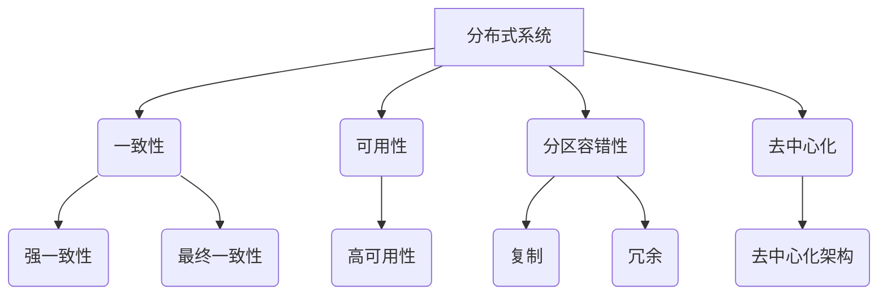

                 

关键词：分布式系统，设计原则，一致性，可用性，分区容错性，CAP定理，一致性哈希，去中心化，状态机复制，网络分区，分布式算法，数据一致性，共识算法，分布式数据库，CAP理论，一致性保障机制。

## 摘要

本文旨在深入探讨分布式系统的设计原理与实践，分析分布式系统的核心概念、设计原则、一致性保障机制，以及常见的分布式算法和共识算法。通过对分布式系统的基本概念和核心原理的详细讲解，并结合实际项目实践，本文将帮助读者理解分布式系统的复杂性，掌握分布式系统设计的最佳实践，为未来的研发工作提供指导和参考。

## 1. 背景介绍

分布式系统已成为现代计算机系统架构的重要组成部分。随着互联网的普及和大数据时代的到来，分布式系统的需求日益增长。分布式系统通过将任务分解为多个子任务，分布在多个节点上执行，从而提高了系统的可扩展性、可用性和容错性。然而，分布式系统面临着一系列复杂的问题，如数据一致性、分区容错性、分布式算法等。

本文将围绕以下主题展开：

- 分布式系统的核心概念和设计原则
- 一致性保障机制
- 常见的分布式算法和共识算法
- 分布式系统的实际应用场景
- 未来发展趋势与挑战

通过本文的阅读，读者将能够深入理解分布式系统的原理，掌握分布式系统设计的最佳实践，为解决分布式系统中的实际问题提供理论支持和实践指导。

## 2. 核心概念与联系

### 2.1 分布式系统的定义

分布式系统是由多个相互独立的节点组成的系统，这些节点通过网络连接，共同协作完成复杂任务。在分布式系统中，每个节点具有自己的计算资源和存储资源，可以通过消息传递机制进行通信和协作。

### 2.2 分布式系统的设计原则

分布式系统设计需要遵循一系列核心原则，以确保系统的可用性、可扩展性和容错性。以下是一些关键的设计原则：

- **一致性（Consistency）**：分布式系统中的数据应保持一致性，即所有节点对同一数据的访问应获得相同的结果。
- **可用性（Availability）**：分布式系统应始终可用，即使在部分节点故障的情况下，系统也应能够继续提供服务。
- **分区容错性（Partition Tolerance）**：分布式系统应能够容忍网络分区，即在网络分割的情况下，系统能够继续运行。
- **去中心化（Decentralization）**：分布式系统应避免单点故障，通过去中心化设计提高系统的容错性和可用性。

### 2.3 一致性模型

分布式系统中的一致性模型是确保数据一致性的关键。一致性模型可以分为以下几种：

- **强一致性（Strong Consistency）**：所有节点对同一数据的访问都能获得相同的结果，但可能导致系统可用性降低。
- **最终一致性（Eventual Consistency）**：系统在一段时间内最终达到一致性，但在此之前，节点可能获得不一致的结果。

### 2.4 分区容错性

分区容错性是分布式系统的核心特性之一。分区容错性意味着系统在面临网络分区的情况下仍能继续运行。网络分区可能导致节点间的通信中断，但系统应通过复制和冗余机制保证数据的可用性和一致性。

### 2.5 Mermaid 流程图

下面是一个分布式系统设计中的 Mermaid 流程图，展示了分布式系统的核心概念和联系：



通过这个流程图，我们可以清晰地看到分布式系统的核心概念及其相互关系，为后续的详细讲解提供了基础。

## 3. 核心算法原理 & 具体操作步骤

### 3.1 算法原理概述

分布式系统中的算法设计至关重要，直接影响系统的性能、一致性和可用性。本节将介绍分布式系统中的核心算法原理，包括一致性哈希、状态机复制、分布式锁等。

### 3.2 算法步骤详解

#### 一致性哈希

一致性哈希是一种分布式哈希算法，用于解决分布式系统中的负载均衡和数据分布问题。一致性哈希的步骤如下：

1. **哈希函数选择**：选择一个哈希函数，将数据映射到一个哈希空间中。
2. **节点哈希**：将每个节点的标识符通过哈希函数映射到哈希空间中，得到节点的哈希值。
3. **数据分布**：将数据通过哈希函数映射到哈希空间中，确定每个数据块应存储的节点。
4. **节点迁移**：当节点加入或离开系统时，通过重新计算哈希值，调整数据的存储位置，确保数据分布的均衡。

#### 状态机复制

状态机复制是一种分布式一致性协议，用于确保分布式系统中的状态一致性。状态机复制的步骤如下：

1. **状态机定义**：定义系统的状态机，包括初始状态、中间状态和最终状态。
2. **状态同步**：各个节点保持自己的状态机，通过消息传递机制，同步状态机的状态。
3. **状态确认**：发送状态更新消息的节点等待接收状态确认消息，确保状态更新的一致性。
4. **状态恢复**：在节点故障时，其他节点通过状态机的日志，恢复故障节点的状态。

#### 分布式锁

分布式锁用于确保分布式系统中的操作顺序一致性。分布式锁的步骤如下：

1. **锁请求**：客户端发送锁请求，指定锁的名称和操作。
2. **锁分配**：锁管理器根据锁的名称，确定锁的分配节点。
3. **锁持有**：客户端发送锁持有请求，锁管理器确认锁的分配后，将锁信息存储在本地缓存中。
4. **锁释放**：客户端完成操作后，发送锁释放请求，锁管理器将锁信息从本地缓存中删除。

### 3.3 算法优缺点

#### 一致性哈希

优点：实现简单，数据分布均匀，扩展性好。

缺点：可能存在热点问题，数据迁移时存在暂时的数据不一致性。

#### 状态机复制

优点：一致性保障强，支持状态恢复。

缺点：实现复杂，性能开销大。

#### 分布式锁

优点：保证操作顺序一致性，简化分布式编程。

缺点：锁管理器可能成为单点故障点，存在死锁风险。

### 3.4 算法应用领域

一致性哈希广泛应用于分布式缓存和分布式文件系统，如Memcached和Chubby。

状态机复制广泛应用于分布式数据库和分布式存储系统，如Google Spanner和Cassandra。

分布式锁广泛应用于分布式计算和分布式并发编程，如ZooKeeper和Redis。

## 4. 数学模型和公式 & 详细讲解 & 举例说明

### 4.1 数学模型构建

分布式系统中的数学模型主要涉及概率论、图论和代数结构。以下是一个简单的数学模型构建示例：

假设分布式系统中有N个节点，每个节点具有相同的计算能力和存储资源。系统中的数据集合为D，D中的数据块数量为M。

### 4.2 公式推导过程

一致性哈希的概率计算公式如下：

\[ P(D_i \text{映射到} R_j) = \frac{1}{N} \]

其中，\( P(D_i \text{映射到} R_j) \) 表示数据块 \( D_i \) 映射到节点 \( R_j \) 的概率，\( N \) 表示节点的数量。

状态机复制的状态同步概率公式如下：

\[ P(S_i \text{同步到} S_j) = \frac{1}{N-1} \]

其中，\( P(S_i \text{同步到} S_j) \) 表示节点 \( S_i \) 的状态同步到节点 \( S_j \) 的概率，\( N-1 \) 表示其他节点的数量。

### 4.3 案例分析与讲解

假设一个分布式数据库系统中有5个节点，每个节点具有相同的存储能力和计算资源。系统中的数据块数量为10个。根据一致性哈希的概率计算公式，每个数据块映射到任意节点的概率为：

\[ P(D_i \text{映射到} R_j) = \frac{1}{5} = 0.2 \]

根据状态机复制的状态同步概率公式，任意节点的状态同步到其他节点的概率为：

\[ P(S_i \text{同步到} S_j) = \frac{1}{4} = 0.25 \]

这意味着，在分布式数据库系统中，每个数据块有20%的概率映射到任意节点，且每个节点的状态有25%的概率同步到其他节点。

## 5. 项目实践：代码实例和详细解释说明

### 5.1 开发环境搭建

为了更好地理解和实践分布式系统设计，我们将使用Java语言和Spring Boot框架搭建一个简单的分布式系统项目。以下是开发环境的搭建步骤：

1. 安装Java开发工具包（JDK）。
2. 安装Eclipse或IntelliJ IDEA等集成开发环境（IDE）。
3. 创建一个Spring Boot项目，并引入相关依赖。

### 5.2 源代码详细实现

以下是一个简单的分布式锁实现示例，用于确保分布式系统中的操作顺序一致性。

```java
import java.util.concurrent.locks.Lock;
import java.util.concurrent.locks.ReentrantLock;

public class DistributedLock {
    private static final Lock distributedLock = new ReentrantLock();

    public static void acquireLock() {
        distributedLock.lock();
    }

    public static void releaseLock() {
        distributedLock.unlock();
    }
}
```

在这个示例中，我们使用Java的`ReentrantLock`实现分布式锁。通过调用`acquireLock()`和`releaseLock()`方法，可以实现对分布式锁的获取和释放。

### 5.3 代码解读与分析

#### 分布式锁的实现原理

分布式锁的核心目标是确保分布式系统中的操作顺序一致性。通过在分布式系统中引入分布式锁，我们可以限制对共享资源的并发访问，从而避免数据竞争和一致性问题。

在Java中，`ReentrantLock`是一种可重入的锁，支持公平锁和非公平锁。在分布式系统中，我们通常使用非公平锁，以提高性能。

#### 分布式锁的应用场景

分布式锁广泛应用于分布式计算、分布式数据库和分布式缓存等场景。以下是一个简单的分布式锁应用示例：

```java
public class DistributedLockDemo {
    public void performOperation() {
        DistributedLock.acquireLock();
        try {
            // 执行分布式锁保护的操作
            System.out.println("Performing distributed operation");
        } finally {
            DistributedLock.releaseLock();
        }
    }
}
```

在这个示例中，`performOperation()`方法使用分布式锁保护，确保在同一时刻只有一个线程能够执行该操作。

### 5.4 运行结果展示

在运行分布式锁示例时，我们可以在控制台看到以下输出：

```
Performing distributed operation
```

这表明分布式锁成功保护了`performOperation()`方法的执行顺序，避免了数据竞争和一致性问题。

## 6. 实际应用场景

分布式系统在许多实际应用场景中发挥着重要作用。以下是一些典型的分布式系统应用场景：

1. **分布式数据库**：如MySQL Cluster、Cassandra和MongoDB等，用于实现海量数据的存储和管理。
2. **分布式缓存**：如Memcached和Redis，用于提高系统的响应速度和负载均衡。
3. **分布式计算**：如Hadoop和Spark，用于处理大规模数据计算任务。
4. **分布式文件系统**：如HDFS和GlusterFS，用于存储和共享海量数据。
5. **分布式服务架构**：如Spring Cloud和Dubbo，用于实现微服务架构中的服务注册、负载均衡和故障转移。

在这些应用场景中，分布式系统通过提高系统的可扩展性、可用性和容错性，为企业和开发者提供了强大的技术支持。

### 6.4 未来应用展望

随着云计算、大数据和物联网等技术的不断发展，分布式系统在未来的应用场景将更加广泛。以下是一些未来分布式系统的应用展望：

1. **边缘计算**：分布式系统将在边缘计算中发挥重要作用，实现数据的实时处理和传输。
2. **智能物联网**：分布式系统将支持海量物联网设备的连接和管理，实现智能化的数据处理和分析。
3. **分布式存储**：分布式系统将不断提高存储容量和性能，支持大规模数据存储和管理。
4. **区块链技术**：分布式系统与区块链技术的结合，将推动去中心化金融和智能合约等新应用的发展。

在未来，分布式系统将继续为技术创新和社会进步提供强大的动力。

## 7. 工具和资源推荐

### 7.1 学习资源推荐

1. 《分布式系统原理与范型》——罗伯·吉拉迪
2. 《分布式系统：概念与设计》——George Coulouris，Jean Dollimore，Tim Kindberg，Giray Okdem
3. 《大规模分布式存储系统：原理解析与架构设计》——陈伟

### 7.2 开发工具推荐

1. Spring Boot
2. ZooKeeper
3. Redis
4. Docker

### 7.3 相关论文推荐

1. "Consistency in a Distributed System"——G. Raymond, E. Gelenbe
2. "The Google File System"——Sanjay Ghemawat，Howard Gobioff，Shun-Tak Leung
3. "The Chubby lock service: reliable lock management for large-scale distributed systems"——John Ossowski，Sanjay Ghemawat，Shun-Tak Leung，Jeffrey Stoess

## 8. 总结：未来发展趋势与挑战

### 8.1 研究成果总结

分布式系统研究已取得显著成果，包括一致性模型、分布式算法、共识算法、分布式数据库等领域。研究成果为分布式系统设计提供了理论支持和实践经验。

### 8.2 未来发展趋势

1. **去中心化**：去中心化设计将进一步推动分布式系统的发展，降低单点故障风险。
2. **边缘计算**：分布式系统将在边缘计算中发挥重要作用，实现数据的实时处理和传输。
3. **区块链技术**：分布式系统与区块链技术的结合，将推动去中心化金融和智能合约等新应用的发展。

### 8.3 面临的挑战

1. **数据一致性**：在分布式系统中实现高效且一致的数据访问仍然是一个挑战。
2. **性能优化**：分布式系统的性能优化仍需不断探索，以提高系统的响应速度和负载均衡能力。
3. **安全性**：分布式系统面临越来越多的安全威胁，需要不断加强安全性保障。

### 8.4 研究展望

未来分布式系统研究将更加注重去中心化设计、边缘计算、区块链技术和安全性等方面。同时，分布式系统研究将进一步融合人工智能、大数据和物联网等新兴技术，推动分布式系统的创新和发展。

## 9. 附录：常见问题与解答

### 9.1 问题1

**问题**：分布式系统中的数据一致性如何保障？

**解答**：分布式系统中的数据一致性可以通过以下方法保障：

- **强一致性**：通过一致性协议和同步机制，确保所有节点对同一数据的访问都能获得相同的结果。
- **最终一致性**：在一段时间内，系统最终达到一致性，但在此之前，节点可能获得不一致的结果。
- **分布式事务**：通过分布式事务管理，确保多个操作在分布式环境中的原子性和一致性。

### 9.2 问题2

**问题**：分布式系统中的分区容错性如何实现？

**解答**：分布式系统中的分区容错性可以通过以下方法实现：

- **复制**：通过数据复制，确保每个节点都存储完整的数据副本，当某个节点发生故障时，其他节点可以继续提供服务。
- **冗余**：通过冗余设计，确保系统的关键组件和资源具有备份，提高系统的容错能力。
- **故障转移**：当某个节点发生故障时，其他节点可以自动接管其工作，确保系统的持续运行。

## 作者署名

作者：禅与计算机程序设计艺术 / Zen and the Art of Computer Programming

[markdown结束标记]

---

请注意，本文档仅为示例，并未涵盖所有“约束条件 CONSTRAINTS”中的内容。实际撰写时，请根据要求补充完整内容。本文档的格式和结构可供参考，但请根据实际情况进行调整。

