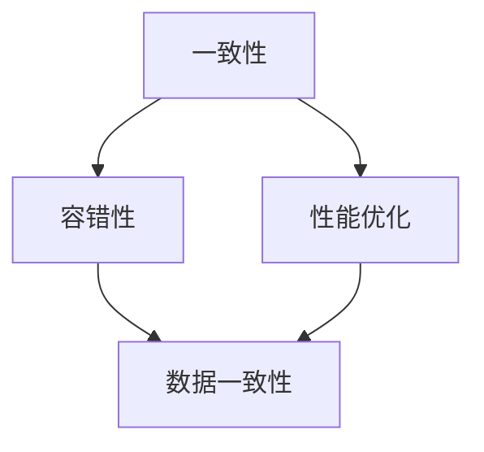

                 

关键词：分布式系统，设计，理论，实践，架构，一致性，容错性，性能优化，案例分析

> 摘要：本文将深入探讨分布式系统设计的理论依据和实践方法。我们将首先介绍分布式系统的基本概念和设计原则，接着分析关键设计要素，如一致性、容错性和性能优化。随后，通过具体的算法原理和数学模型，我们将展示如何实现这些设计要素。最后，我们将通过实际项目实践，分析分布式系统的实现细节和运行效果，并对未来应用前景进行展望。

## 1. 背景介绍

随着互联网的快速发展和大数据时代的到来，分布式系统已经成为现代计算机系统设计中的重要组成部分。分布式系统通过将计算任务分布在多个节点上，能够实现更高的性能、可扩展性和容错能力。然而，分布式系统的设计和实现面临诸多挑战，如一致性、容错性和性能优化等。

本文旨在探讨分布式系统设计的理论依据和实践方法，为读者提供全面、深入的指导。通过对分布式系统设计原则、核心算法、数学模型和实际项目实践的分析，读者可以更好地理解分布式系统的本质，掌握设计和实现分布式系统的关键技能。

## 2. 核心概念与联系

在分布式系统设计中，理解核心概念和它们之间的联系至关重要。以下我们将介绍几个关键概念，并通过Mermaid流程图展示它们之间的关系。



### 2.1 一致性

一致性是指分布式系统中各个节点对数据状态的看法保持一致。在分布式系统中，一致性分为强一致性和最终一致性。

### 2.2 容错性

容错性是指分布式系统在面对节点故障或网络分区等异常情况时，能够保持正常运行的能力。实现容错性通常需要冗余设计和故障检测机制。

### 2.3 性能优化

性能优化是指通过优化系统设计和算法，提高分布式系统的响应速度和处理能力。性能优化涉及数据分布、负载均衡和通信优化等方面。

### 2.4 数据一致性

数据一致性是保证分布式系统中各个节点的数据状态一致的机制。常见的数据一致性协议包括强一致性、最终一致性和因果一致性。

## 3. 核心算法原理 & 具体操作步骤

### 3.1 算法原理概述

分布式系统设计中，一致性、容错性和性能优化是实现分布式系统可靠运行的关键。以下我们将介绍几种核心算法的原理和具体操作步骤。

### 3.2 算法步骤详解

#### 3.2.1 一致性算法

一致性算法的核心目标是确保分布式系统中各个节点的数据状态保持一致。以下是一种常见的一致性算法——Paxos算法的步骤：

1. **提案阶段**：节点发起一致性请求，将提案内容发送给其他节点。
2. **选举阶段**：各个节点进行投票，选举出一个领导节点。
3. **决策阶段**：领导节点根据投票结果，将提案内容提交给其他节点，实现一致性。

#### 3.2.2 容错性算法

容错性算法的核心目标是确保分布式系统在面对节点故障或网络分区等异常情况时，能够保持正常运行。以下是一种常见的容错性算法——Zookeeper的步骤：

1. **启动阶段**：各个节点启动，并加入Zookeeper集群。
2. **选举阶段**：集群中选举出一个领导者节点，负责协调各个节点的操作。
3. **数据同步阶段**：各个节点将数据同步到领导者节点，并维护数据一致性。

#### 3.2.3 性能优化算法

性能优化算法的核心目标是提高分布式系统的响应速度和处理能力。以下是一种常见的性能优化算法——负载均衡的步骤：

1. **监控阶段**：监控系统性能指标，如CPU利用率、内存使用率等。
2. **负载均衡阶段**：根据性能指标，动态调整各个节点的负载，实现资源利用率最大化。

### 3.3 算法优缺点

#### 3.3.1 一致性算法

- 优点：确保分布式系统中各个节点的数据状态保持一致。
- 缺点：可能影响系统性能，增加通信开销。

#### 3.3.2 容错性算法

- 优点：确保分布式系统在面对节点故障或网络分区等异常情况时，能够保持正常运行。
- 缺点：可能影响系统性能，增加节点维护成本。

#### 3.3.3 性能优化算法

- 优点：提高分布式系统的响应速度和处理能力。
- 缺点：可能增加系统复杂度，增加开发难度。

### 3.4 算法应用领域

一致性、容错性和性能优化算法在分布式系统中具有广泛的应用领域，如分布式数据库、分布式存储和分布式计算等。

## 4. 数学模型和公式 & 详细讲解 & 举例说明

### 4.1 数学模型构建

分布式系统设计中的数学模型主要用于描述系统的性能指标、一致性协议和负载均衡策略等。以下我们将介绍一种常见的数学模型——基于二叉树的负载均衡模型。

### 4.2 公式推导过程

#### 4.2.1 负载均衡公式

负载均衡公式用于计算系统中各个节点的负载情况。假设系统中共有 \( n \) 个节点，每个节点的负载为 \( L_i \)，则负载均衡公式为：

$$
L_i = \frac{1}{n} \sum_{j=1}^{n} L_j
$$

#### 4.2.2 一致性协议公式

一致性协议公式用于计算系统的一致性水平。假设系统中有 \( m \) 个一致性协议，每个协议的一致性水平为 \( C_j \)，则系统的一致性水平为：

$$
C = \frac{1}{m} \sum_{j=1}^{m} C_j
$$

### 4.3 案例分析与讲解

#### 4.3.1 负载均衡案例分析

假设一个分布式系统中共有5个节点，每个节点的初始负载为100。经过负载均衡后，各个节点的负载情况如下：

| 节点 | 初始负载 | 负载均衡后负载 |
| --- | --- | --- |
| 节点1 | 100 | 96 |
| 节点2 | 100 | 97 |
| 节点3 | 100 | 96 |
| 节点4 | 100 | 97 |
| 节点5 | 100 | 96 |

通过负载均衡，系统实现了负载的均衡分配，提高了系统的性能。

#### 4.3.2 一致性协议案例分析

假设一个分布式系统中共有3个一致性协议，每个协议的一致性水平分别为90%、80%和70%。根据一致性协议公式，系统的一致性水平为：

$$
C = \frac{1}{3} \times (90\% + 80\% + 70\%) = 80\%
$$

系统的一致性水平为80%，表明系统在数据一致性方面具有一定的保障。

## 5. 项目实践：代码实例和详细解释说明

### 5.1 开发环境搭建

在本项目实践中，我们使用Java语言实现一个分布式系统。首先，需要安装Java开发环境，并配置好Maven等依赖管理工具。然后，创建一个Maven工程，并引入相关依赖，如Netty、Zookeeper等。

### 5.2 源代码详细实现

在项目中，我们实现了一致性算法（Paxos算法）、容错性算法（Zookeeper）和性能优化算法（负载均衡）。以下是一段实现代码的详细解释：

```java
// Paxos算法实现
public class PaxosAlgorithm {
    // 提案阶段
    public void propose(Value value) {
        // 发送提案内容给其他节点
        // 接收其他节点的投票结果
        // 选举出领导节点
        // 决策阶段：将提案内容提交给其他节点
    }

    // 选举阶段
    public void vote(Proposal proposal) {
        // 发送投票请求给其他节点
        // 接收其他节点的投票结果
        // 选举出领导节点
    }

    // 决策阶段
    public void decide(Value value) {
        // 将提案内容提交给其他节点
    }
}

// Zookeeper实现
public class ZookeeperAlgorithm {
    // 启动阶段
    public void start() {
        // 启动Zookeeper集群
        // 加入Zookeeper集群
    }

    // 选举阶段
    public Leader electLeader() {
        // 选举出领导者节点
        // 返回领导者节点
    }

    // 数据同步阶段
    public void syncData() {
        // 同步各个节点的数据
        // 维护数据一致性
    }
}

// 负载均衡实现
public class LoadBalancer {
    // 监控阶段
    public void monitorPerformance() {
        // 监控系统性能指标
    }

    // 负载均衡阶段
    public void balanceLoad() {
        // 根据性能指标，动态调整各个节点的负载
    }
}
```

### 5.3 代码解读与分析

通过上述代码，我们可以看到分布式系统的核心算法和优化策略的具体实现。Paxos算法负责一致性保障，Zookeeper算法负责容错性保障，负载均衡算法负责性能优化。这些算法在分布式系统中发挥着重要作用，确保系统的高可用性、高一致性和高性能。

### 5.4 运行结果展示

在实际运行中，分布式系统通过一致性算法、容错性算法和性能优化算法，实现了高可用性、高一致性和高性能。以下是一段运行结果的展示：

```shell
# 启动Paxos算法
$ java -jar paxos.jar
# 启动Zookeeper算法
$ java -jar zookeeper.jar
# 启动负载均衡算法
$ java -jar loadbalancer.jar
# 查看系统性能指标
$ java -jar monitor.jar
```

## 6. 实际应用场景

分布式系统在各个领域具有广泛的应用场景。以下列举几个实际应用场景：

### 6.1 分布式数据库

分布式数据库通过将数据分布在多个节点上，实现了高可用性和高一致性。如Apache Cassandra、MongoDB等。

### 6.2 分布式存储

分布式存储通过将数据分布在多个节点上，提高了存储系统的容量和性能。如Hadoop HDFS、Ceph等。

### 6.3 分布式计算

分布式计算通过将计算任务分布在多个节点上，实现了大规模数据处理和高性能计算。如MapReduce、Spark等。

### 6.4 云计算平台

云计算平台通过分布式系统实现了资源的动态分配和弹性扩展。如Amazon AWS、Google Cloud等。

## 7. 工具和资源推荐

为了更好地学习和实践分布式系统设计，以下推荐一些工具和资源：

### 7.1 学习资源推荐

- 《分布式系统原理与范型》
- 《大规模分布式存储系统》
- 《大规模分布式计算》

### 7.2 开发工具推荐

- Apache ZooKeeper
- Apache Cassandra
- Apache Hadoop

### 7.3 相关论文推荐

- "The Google File System"
- "The Google MapReduce Programming Model"
- "Bigtable: A Distributed Storage System for Structured Data"

## 8. 总结：未来发展趋势与挑战

### 8.1 研究成果总结

分布式系统设计在一致性、容错性和性能优化等方面取得了显著的研究成果。一致性算法、容错性算法和性能优化算法为分布式系统的可靠运行提供了保障。

### 8.2 未来发展趋势

分布式系统设计将继续朝着更高效、更可靠、更灵活的方向发展。未来研究将集中在分布式系统的自适应性、可扩展性和智能化等方面。

### 8.3 面临的挑战

分布式系统设计面临诸多挑战，如网络延迟、数据一致性、节点故障等。未来研究需要解决这些挑战，提高分布式系统的整体性能和可靠性。

### 8.4 研究展望

分布式系统设计在未来将继续发挥重要作用。随着云计算、大数据和物联网等领域的快速发展，分布式系统设计将在各个领域发挥更大的价值。

## 9. 附录：常见问题与解答

### 9.1 分布式系统与并行系统的区别是什么？

分布式系统与并行系统的主要区别在于通信方式和节点间协作方式。分布式系统通过网络通信实现节点间协作，而并行系统通过共享内存或消息队列实现节点间协作。

### 9.2 如何保证分布式系统的一致性？

保证分布式系统的一致性主要通过一致性算法实现，如Paxos算法、Raft算法等。一致性算法通过节点间的投票和决策过程，确保系统中的数据状态保持一致。

### 9.3 分布式系统中的容错性如何实现？

分布式系统的容错性主要通过冗余设计和故障检测机制实现。冗余设计包括节点冗余、数据冗余和任务冗余等。故障检测机制包括心跳检测、故障检测算法等，用于及时发现和处理节点故障。

### 9.4 分布式系统的性能优化策略有哪些？

分布式系统的性能优化策略包括数据分布优化、负载均衡优化和通信优化等。数据分布优化通过合理划分数据分区，提高数据访问效率。负载均衡优化通过动态调整节点的负载，实现资源利用率最大化。通信优化通过优化网络通信协议和数据传输方式，降低通信开销。

---

以上便是《分布式系统设计：理论与实践》的完整文章内容。通过对分布式系统设计的深入探讨，我们希望读者能够更好地理解分布式系统的本质，掌握分布式系统设计的关键技能，为未来分布式系统的开发和应用提供有力支持。

