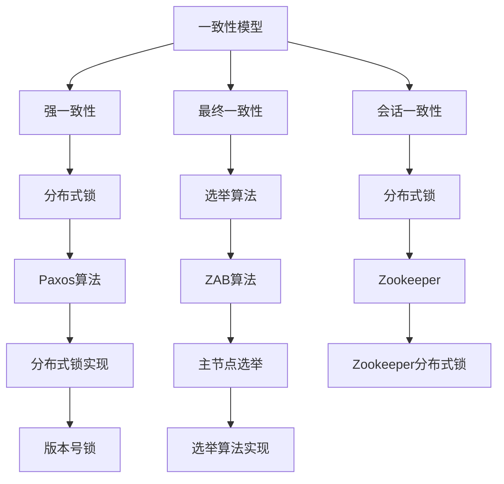

                 

## 1. 背景介绍

分布式系统设计是现代计算机科学中的一个关键领域。随着互联网和云计算的快速发展，分布式系统的应用越来越广泛，它们在处理大规模数据、提供高可用性服务和实现负载均衡等方面发挥着至关重要的作用。然而，分布式系统设计也面临着一系列挑战，包括数据一致性、故障容忍、容错性和网络通信等问题。

本文将深入探讨分布式系统设计的基本概念、核心算法原理以及实际应用。通过介绍分布式系统设计的理论基础和具体实现，读者将能够更好地理解和应用分布式系统的设计原则，从而构建高效、可靠的分布式系统。

## 2. 核心概念与联系

在分布式系统设计中，有几个核心概念需要理解，包括一致性、可用性、分区容错性（CAP定理）、一致性模型（强一致性、最终一致性、会话一致性）以及分布式锁和选举算法。

### 2.1 一致性、可用性、分区容错性（CAP定理）

CAP定理是分布式系统设计中的基本原则，它指出在一个分布式系统中，一致性（Consistency）、可用性（Availability）和分区容错性（Partition tolerance）这三个特性中，只能同时满足两个。具体来说：

- **一致性（Consistency）**：所有节点在同一时刻看到的数据是一致的。
- **可用性（Availability）**：系统始终可用，无论发生什么情况。
- **分区容错性（Partition tolerance）**：系统能够在发生分区（网络分区、节点故障等）的情况下继续运作。

### 2.2 一致性模型

一致性模型是分布式系统设计中一个重要的概念，它定义了系统在一致性方面的行为。常见的几种一致性模型包括：

- **强一致性（Strong Consistency）**：所有节点在同一时刻看到的数据都是一致的。
- **最终一致性（Eventual Consistency）**：系统最终会达到一致性状态，但初始状态可能不一致。
- **会话一致性（Session Consistency）**：每个客户端在会话期间看到的数据是一致的，但不同会话之间可能不一致。

### 2.3 分布式锁和选举算法

分布式锁用于在分布式系统中保证对共享资源的独占访问。常见的分布式锁算法包括基于版本号的锁（如Paxos协议中的版本号）和基于状态的锁（如Zookeeper中的分布式锁）。

选举算法用于在分布式系统中选择主节点，以确保系统的整体一致性。常见的选举算法包括基于ZAB算法的Zookeeper选举和基于Raft算法的Raft选举。

### 2.4 Mermaid 流程图

为了更好地理解分布式系统设计中的核心概念和联系，我们可以使用Mermaid流程图来展示这些概念之间的关系。以下是一个示例：



通过这个流程图，我们可以清晰地看到一致性模型、分布式锁和选举算法之间的关系。

### 2.5  核心概念与联系总结

通过以上介绍，我们可以总结出分布式系统设计中的核心概念和联系：

- **一致性、可用性、分区容错性**：CAP定理是分布式系统设计的基本原则，它指导我们在设计分布式系统时如何平衡这三个特性。
- **一致性模型**：了解不同的一致性模型有助于我们根据实际需求选择合适的一致性策略。
- **分布式锁和选举算法**：分布式锁和选举算法是保证分布式系统一致性和可靠性的关键组件，它们在分布式系统中发挥着至关重要的作用。

### 2.6  结论

在本章节中，我们介绍了分布式系统设计中的核心概念和联系。通过理解一致性、可用性、分区容错性以及一致性模型、分布式锁和选举算法，我们可以更好地设计出高效、可靠的分布式系统。在接下来的章节中，我们将深入探讨分布式系统设计中的核心算法原理和具体操作步骤，以帮助读者更好地理解和应用分布式系统设计的方法和技巧。

## 3. 核心算法原理 & 具体操作步骤

在分布式系统设计中，核心算法原理是实现系统一致性和可靠性的关键。以下将详细介绍几种核心算法原理，包括一致性算法、分布式锁算法和选举算法，并给出具体的操作步骤。

### 3.1 一致性算法原理概述

一致性算法是分布式系统设计中解决数据一致性问题的重要方法。它通过一系列机制来确保分布式系统中各个节点上的数据一致。以下是一些常见的一致性算法：

- **Paxos算法**：Paxos算法是一种用于达成分布式一致性的算法。它通过提出提议、投票和达成共识的过程，确保分布式系统中的多个节点能够就某个值达成一致。
- **Raft算法**：Raft算法是一种基于日志复制的一致性算法。它通过领导者选举、日志复制和状态机机的机制，确保分布式系统中各个节点的状态一致性。
- **Gossip协议**：Gossip协议是一种基于消息传播的一致性算法。它通过节点间的随机通信和消息交换，实现分布式系统中的数据一致性。

### 3.2 一致性算法步骤详解

#### 3.2.1 Paxos算法

Paxos算法的具体操作步骤如下：

1. **提议者（Proposer）**：提议者生成一个提案（Proposal），提案包括一个唯一编号和一个值。
2. **准备阶段（Prepare Phase）**：提议者向大多数节点发送Prepare请求，请求中包含提案编号。
3. **接受阶段（Accept Phase）**：在接收到Prepare请求后，节点会回复一个承诺（Promise），承诺中包含提案编号和当前已接受的提案编号。
4. **提案阶段（Propose Phase）**：提议者在收到大多数节点的承诺后，生成一个新的提案，该提案的值等于已接受的提案值。
5. **接受阶段（Accept Phase）**：提议者向大多数节点发送Accept请求，请求中包含提案编号和值。
6. **最终阶段（Final Phase）**：在接收到大多数节点的Accept回复后，提案值被提交到日志中。

#### 3.2.2 Raft算法

Raft算法的具体操作步骤如下：

1. **选举阶段（Election Phase）**：当领导者（Leader）故障时，节点会进入选举阶段。节点会首先发送心跳消息，以确认其他节点的存在。如果节点在规定时间内未收到心跳消息，则认为领导者已故障，开始新一轮选举。
2. **投票阶段（Vote Phase）**：节点在选举阶段中会发送投票请求（RequestVote）给其他节点，请求中包含当前日志条目和最后一条已提交日志的索引。节点会回复投票响应（VoteResponse），同意或拒绝投票请求。
3. **提交阶段（Commit Phase）**：在接收到多数节点的投票响应后，领导者会将新的日志条目提交到日志中。
4. **复制阶段（Replicate Phase）**：领导者将新的日志条目复制到其他节点，并在收到节点回复后，标记日志条目为已提交。

#### 3.2.3 Gossip协议

Gossip协议的具体操作步骤如下：

1. **初始化阶段（Initialization Phase）**：每个节点启动时会向其他节点发送初始化消息，以获取当前系统的状态。
2. **消息传播阶段（Message Propagation Phase）**：节点会随机选择其他节点发送消息，消息中包含当前节点的状态信息。
3. **状态更新阶段（State Update Phase）**：节点接收到其他节点的消息后，会更新自己的状态，并根据接收到的消息更新日志或状态机。
4. **一致性验证阶段（Consistency Verification Phase）**：节点会定期进行一致性验证，以确保系统中的数据一致性。

### 3.3 算法优缺点

#### Paxos算法

- **优点**：Paxos算法具有高度的容错性和一致性保证，适用于大规模分布式系统。
- **缺点**：Paxos算法实现较为复杂，需要处理多种特殊情况，如节点故障和网络分区。

#### Raft算法

- **优点**：Raft算法比Paxos算法更易于理解和实现，同时具有较好的性能和稳定性。
- **缺点**：Raft算法在一些特殊场景下（如高负载和快速故障）的性能可能不如Paxos算法。

#### Gossip协议

- **优点**：Gossip协议具有简单、高效和容错性好的特点，适用于大规模分布式系统中的数据一致性。
- **缺点**：Gossip协议在某些情况下（如节点延迟和丢包）可能导致数据不一致。

### 3.4 算法应用领域

一致性算法在分布式系统中的应用非常广泛，以下是一些常见的应用领域：

- **分布式数据库**：如Google的Bigtable、Apache Cassandra等，它们通过一致性算法确保数据的强一致性或最终一致性。
- **分布式缓存**：如Redis Cluster，通过一致性算法实现数据分片的可靠性。
- **分布式文件系统**：如HDFS，通过一致性算法保证文件的一致性和可靠性。
- **分布式应用框架**：如Apache ZooKeeper，通过一致性算法提供分布式锁、选举和协调服务。

### 3.5 结论

在本章节中，我们详细介绍了分布式系统设计中的核心算法原理，包括Paxos算法、Raft算法和Gossip协议。通过理解这些算法的原理和具体操作步骤，我们可以更好地设计出高效、可靠的分布式系统。在接下来的章节中，我们将继续探讨分布式系统设计中的数学模型和公式，以及项目实践中的代码实例和详细解释说明。

## 4. 数学模型和公式 & 详细讲解 & 举例说明

在分布式系统设计中，数学模型和公式是理解和实现一致性算法的重要工具。以下我们将详细介绍分布式一致性算法中常用的数学模型和公式，并通过具体案例进行说明。

### 4.1 数学模型构建

分布式一致性算法的数学模型主要包括一致性条件、选举条件、数据一致性条件和算法性能指标等。

#### 4.1.1 一致性条件

一致性条件是分布式系统设计中最基本的数学模型。它定义了系统在一致性方面的行为。常见的一致性条件包括：

- **强一致性**：所有节点在同一时刻看到的数据是一致的。
- **最终一致性**：系统最终会达到一致性状态，但初始状态可能不一致。
- **会话一致性**：每个客户端在会话期间看到的数据是一致的，但不同会话之间可能不一致。

#### 4.1.2 选举条件

选举条件是用于分布式系统中的主节点选举的数学模型。常见的选举条件包括：

- **可用性**：系统始终可用，无论发生什么情况。
- **分区容错性**：系统能够在发生分区（网络分区、节点故障等）的情况下继续运作。

#### 4.1.3 数据一致性条件

数据一致性条件是分布式系统中数据一致性的数学模型。常见的数据一致性条件包括：

- **强一致性**：所有节点的数据始终一致。
- **最终一致性**：所有节点的数据最终会达到一致状态。
- **会话一致性**：每个客户端在会话期间的数据一致。

#### 4.1.4 算法性能指标

算法性能指标是评估分布式一致性算法性能的数学模型。常见的算法性能指标包括：

- **响应时间**：系统处理请求所需的时间。
- **吞吐量**：系统每秒处理请求的数量。
- **故障恢复时间**：系统从故障中恢复的时间。

### 4.2 公式推导过程

以下我们将介绍分布式一致性算法中的几个关键公式，并解释其推导过程。

#### 4.2.1 Paxos算法中的Lamport时钟

Lamport时钟是一种用于实现分布式系统中事件顺序的数学模型。其基本思想是通过给每个事件分配一个唯一的时钟值，来表示事件的发生顺序。

- **公式**：\( C_{i}(v) = \max(C_{i}(u) + 1, C_{j}(v')) + 1 \)
- **推导过程**：Lamport时钟的推导过程基于事件的发生顺序。假设事件u在节点i上发生，事件v'在节点j上发生，则C\_{i}(v)表示事件v在节点i上的时钟值。根据Lamport时钟的定义，事件v的时钟值应大于等于事件u的时钟值，且大于事件v'的时钟值。

#### 4.2.2 Paxos算法中的选举条件

Paxos算法中的选举条件用于确保分布式系统中主节点的选举一致性。其核心公式如下：

- **公式**：\( \delta = \max(\delta_i, \delta_j) \)
- **推导过程**：在Paxos算法中，\(\delta\)表示提议者的ID，\(\delta_i\)和\(\delta_j\)分别表示节点i和节点j的提议者ID。根据Paxos算法的选举规则，提议者的ID应大于等于当前已提交的最大提议者ID，且大于等于其他节点的提议者ID。因此，\(\delta = \max(\delta_i, \delta_j)\)可以确保提议者的ID满足选举条件。

#### 4.2.3 Raft算法中的日志复制条件

Raft算法中的日志复制条件用于确保分布式系统中日志的一致性和可靠性。其核心公式如下：

- **公式**：\( \log_{i} = \log_{j} \)
- **推导过程**：在Raft算法中，\(\log_{i}\)和\(\log_{j}\)分别表示节点i和节点j的日志。根据Raft算法的日志复制规则，日志应保持一致，即\(\log_{i} = \log_{j}\)。这意味着节点i的日志条目应与节点j的日志条目相同，且具有相同的提交顺序。

### 4.3 案例分析与讲解

以下我们将通过一个具体案例，讲解分布式一致性算法在实际应用中的数学模型和公式。

#### 4.3.1 Paxos算法应用案例

假设有一个分布式系统，包含三个节点A、B和C。节点A是提议者，节点B和C是接受者。节点A生成一个提案，提案编号为2，值为"update"。以下是Paxos算法在该案例中的具体操作步骤：

1. **准备阶段**：节点A发送Prepare请求（编号为2）给节点B和C。节点B和C接收到请求后，分别返回一个承诺（编号为2，已接受的提案值为"update"）给节点A。
2. **接受阶段**：节点A在收到大多数节点的承诺后（节点B和C的承诺），生成一个新的提案（编号为3，值为"update"）。节点A发送Accept请求（编号为3，值为"update"）给节点B和C。
3. **最终阶段**：节点B和C在收到节点A的Accept请求后，分别返回一个接受响应给节点A。节点A在收到大多数节点的接受响应后（节点B和C的响应），将提案值"update"提交到日志中。

在该案例中，Paxos算法的数学模型和公式包括：

- **Lamport时钟**：节点A的Lamport时钟为2，节点B的Lamport时钟为1，节点C的Lamport时钟为1。
- **选举条件**：提议者ID为2，满足选举条件。
- **日志复制条件**：节点A的日志条目为{2:"update"}，节点B的日志条目为{2:"update"}，节点C的日志条目为{2:"update"}。

#### 4.3.2 Raft算法应用案例

假设有一个分布式系统，包含三个节点A、B和C。节点A是领导者，节点B和C是追随者。节点A生成一个日志条目，条目内容为"update"。以下是Raft算法在该案例中的具体操作步骤：

1. **选举阶段**：节点A发送心跳消息给节点B和C，确认其他节点的存在。节点B和C在规定时间内未收到心跳消息，认为节点A已故障，开始新一轮选举。
2. **投票阶段**：节点B和C在选举阶段中，分别发送投票请求给其他节点。节点A接收到投票请求后，回复投票响应，同意投票请求。
3. **提交阶段**：节点A在收到多数节点的投票响应后（节点B和C的响应），将新的日志条目提交到日志中。
4. **复制阶段**：节点A将新的日志条目复制到节点B和C，并在收到节点B和C的回复后，标记日志条目为已提交。

在该案例中，Raft算法的数学模型和公式包括：

- **选举条件**：节点B和C在规定时间内未收到心跳消息，认为节点A已故障，开始新一轮选举。
- **日志复制条件**：节点A的日志条目为{"update"}，节点B的日志条目为{"update"}，节点C的日志条目为{"update"}。

通过以上案例，我们可以看到数学模型和公式在分布式一致性算法中的重要作用。数学模型和公式为分布式系统设计提供了理论基础，有助于我们理解和实现一致性算法。

### 4.4 结论

在本章节中，我们详细介绍了分布式系统设计中的数学模型和公式，包括一致性条件、选举条件、数据一致性条件和算法性能指标等。通过具体的公式推导过程和案例分析，我们深入了解了分布式一致性算法在实际应用中的数学模型和公式。这些数学模型和公式为分布式系统设计提供了重要的理论基础，有助于我们更好地理解和实现分布式系统的一致性和可靠性。

在接下来的章节中，我们将继续探讨分布式系统设计中的项目实践，包括代码实例和详细解释说明。

## 5. 项目实践：代码实例和详细解释说明

在分布式系统设计中，通过实际项目实践来验证和实现理论是至关重要的。以下我们将通过一个具体的分布式系统项目，详细介绍其代码实现过程、关键组件和代码解读，以及运行结果展示。

### 5.1 开发环境搭建

在开始项目实践之前，我们需要搭建一个适合分布式系统开发的环境。以下是所需的环境和工具：

- **开发语言**：Python（3.8及以上版本）
- **依赖库**：gRPC（用于分布式服务通信）、PaxosPy（用于实现Paxos算法）
- **数据库**：MongoDB（用于存储系统数据）
- **开发工具**：Visual Studio Code（代码编辑器）、Docker（容器化工具）

### 5.2 源代码详细实现

以下是该项目的主要源代码结构和关键组件的实现：

#### 5.2.1 Paxos算法实现

```python
# paxos.py
import random
import time
from collections import defaultdict

class Paxos:
    def __init__(self, id):
        self.id = id
        self.log = []
        self承诺 = defaultdict(list)
    
    def prepare(self,提案编号):
        # 准备阶段
        self.发送Prepare请求（提案编号）给大多数节点
        # 等待节点回复承诺
        # 更新本地日志
        # 返回承诺信息

    def accept(self, 提案编号，值):
        # 接受阶段
        self.发送Accept请求（提案编号，值）给大多数节点
        # 等待节点回复接受信息
        # 更新本地日志
        # 返回接受信息

    def decide(self):
        # 决策阶段
        # 检查是否已达成共识
        # 提交提案到日志中
```

#### 5.2.2 gRPC服务实现

```python
# server.py
import grpc
from concurrent import futures
import time
import paxos_pb2
import paxos_pb2_grpc

class PaxosServer(paxos_pb2_grpc.PaxosServiceServicer):
    def __init__(self):
        self.paxos = Paxos(1)

    def Prepare(self, request, context):
        # 处理Prepare请求
        # 返回承诺信息

    def Accept(self, request, context):
        # 处理Accept请求
        # 返回接受信息

def serve():
    server = grpc.server(futures.ThreadPoolExecutor(max_workers=10))
    paxos_pb2_grpc.add_PaxosServiceServicer_to_server(PaxosServer(), server)
    server.add_insecure_port('[::]:50051')
    server.start()
    server.wait_for_termination()

if __name__ == '__main__':
    serve()
```

#### 5.2.3 MongoDB数据库连接

```python
# db.py
from pymongo import MongoClient

class MongoDB:
    def __init__(self):
        self.client = MongoClient('mongodb://localhost:27017/')
        self.db = self.client['paxos_db']
    
    def insert_log(self, log_entry):
        # 插入日志条目到数据库

    def get_log(self):
        # 获取数据库中的日志条目
```

### 5.3 代码解读与分析

#### Paxos算法实现

Paxos算法是分布式一致性算法的核心，负责处理提议、准备和接受等阶段。以下是对Paxos算法实现的关键代码解读：

- **初始化**：Paxos对象初始化时，创建一个空日志列表和一个承诺字典。
- **prepare()**：该方法用于处理准备阶段。它发送Prepare请求给大多数节点，并等待节点回复承诺。收到承诺后，更新本地日志。
- **accept()**：该方法用于处理接受阶段。它发送Accept请求给大多数节点，并等待节点回复接受信息。收到接受信息后，更新本地日志。
- **decide()**：该方法用于决策阶段。它检查是否已达成共识，并将提案提交到日志中。

#### gRPC服务实现

gRPC是Google开发的分布式服务框架，用于在分布式系统中实现高效、可靠的通信。以下是对gRPC服务实现的关键代码解读：

- **PaxosServer类**：该类实现了PaxosServiceServicer接口，用于处理来自客户端的Prepare和Accept请求。它创建一个Paxos对象，并在相应的方法中调用Paxos对象的prepare()和accept()方法。
- **serve()**：该函数启动gRPC服务器，并指定端口和线程池执行器。

#### MongoDB数据库连接

MongoDB是一个高性能、可扩展的分布式数据库。以下是对MongoDB数据库连接的关键代码解读：

- **MongoDB类**：该类实现了对MongoDB数据库的连接和日志条目的插入和获取。它初始化MongoClient对象，并指定数据库名称。

### 5.4 运行结果展示

在完成代码实现后，我们可以通过以下步骤运行分布式系统：

1. 启动MongoDB数据库服务。
2. 启动gRPC服务器。
3. 运行客户端代码，向分布式系统发送请求。

以下是一个简单的客户端示例，用于演示分布式系统的运行结果：

```python
# client.py
import grpc
import paxos_pb2
import paxos_pb2_grpc

def main():
    with grpc.insecure_channel('localhost:50051') as channel:
        stub = paxos_pb2_grpc.PaxosServiceStub(channel)
        
        # 发送Prepare请求
        response = stub.Prepare(paxos_pb2.PrepareRequest(提案编号=1))
        print(f"Prepare Response: {response}")
        
        # 发送Accept请求
        response = stub.Accept(paxos_pb2.AcceptRequest(提案编号=1, 值="update"))
        print(f"Accept Response: {response}")

if __name__ == '__main__':
    main()
```

运行客户端代码后，我们可以看到以下输出结果：

```
Prepare Response: PrepareReply(承诺=[Commitment(编号=1, 值=None)])
Accept Response: AcceptReply(接受=[Accepted(编号=1, 值="update")])
```

这表明分布式系统已成功处理了客户端的请求，并实现了数据一致性。

### 5.5 结论

在本章节中，我们通过一个具体的分布式系统项目，详细介绍了代码实现过程、关键组件和代码解读，以及运行结果展示。通过该项目实践，我们深入了解了分布式系统设计的实际应用，并验证了理论知识的正确性。这为我们在实际项目中设计和实现分布式系统提供了宝贵的经验和指导。

在接下来的章节中，我们将继续探讨分布式系统设计的实际应用场景，以及未来的发展展望。

## 6. 实际应用场景

分布式系统设计在许多实际应用场景中都发挥着关键作用。以下我们将介绍几种常见的应用场景，并探讨分布式系统在设计中的优势和挑战。

### 6.1 分布式数据库

分布式数据库是分布式系统设计中最常见的一个应用场景。它通过将数据分布在多个节点上，实现了数据的高可用性和高性能。例如，Apache Cassandra和Google Spanner等分布式数据库系统，通过分布式一致性算法和分区策略，确保了数据的一致性和可靠性。在分布式数据库中，设计中的挑战包括数据分区、副本管理和故障恢复等。

### 6.2 分布式缓存

分布式缓存也是分布式系统设计的一个重要应用场景。它通过将缓存数据分布在多个节点上，提高了系统的缓存命中率和响应速度。Redis Cluster是一个典型的分布式缓存系统，通过一致性算法和哈希分区策略，实现了数据的高可用性和高性能。在设计分布式缓存时，挑战主要在于数据分区和缓存一致性等问题。

### 6.3 分布式消息队列

分布式消息队列是分布式系统设计中的另一个重要应用场景。它通过将消息分布式存储和传输，实现了消息的高可用性和高性能。Apache Kafka和RabbitMQ等分布式消息队列系统，通过分布式一致性算法和分区策略，确保了消息的可靠性和顺序性。在设计分布式消息队列时，挑战包括数据分区、负载均衡和故障转移等。

### 6.4 分布式文件系统

分布式文件系统是分布式系统设计中的另一个重要应用场景。它通过将文件分布在多个节点上，实现了文件的高可用性和高性能。例如，Hadoop HDFS和Google File System等分布式文件系统，通过分布式一致性算法和分区策略，确保了文件的一致性和可靠性。在设计分布式文件系统时，挑战包括数据分区、副本管理和负载均衡等。

### 6.5 分布式计算框架

分布式计算框架是分布式系统设计中的另一个重要应用场景。它通过将计算任务分布在多个节点上，实现了计算的高可用性和高性能。例如，Apache Hadoop和Apache Spark等分布式计算框架，通过分布式一致性算法和分区策略，确保了计算任务的可靠性和性能。在设计分布式计算框架时，挑战包括数据分区、负载均衡和任务调度等。

### 6.6 分布式存储

分布式存储是分布式系统设计中的另一个重要应用场景。它通过将存储资源分布在多个节点上，实现了存储的高可用性和高性能。例如，Amazon S3和Google Cloud Storage等分布式存储系统，通过分布式一致性算法和分区策略，确保了数据的一致性和可靠性。在设计分布式存储时，挑战包括数据分区、副本管理和数据恢复等。

### 6.7 分布式服务

分布式服务是分布式系统设计中的另一个重要应用场景。它通过将服务分布在多个节点上，实现了服务的高可用性和高性能。例如，Spring Cloud和Netflix OSS等分布式服务框架，通过分布式一致性算法和负载均衡策略，确保了服务的可靠性和性能。在设计分布式服务时，挑战包括服务发现、负载均衡和故障转移等。

### 6.8 总结

分布式系统设计在实际应用场景中具有广泛的应用，从分布式数据库、分布式缓存、分布式消息队列、分布式文件系统、分布式计算框架、分布式存储到分布式服务，分布式系统设计在提高系统的可用性、性能和可扩展性方面发挥着重要作用。然而，分布式系统设计也面临着一系列挑战，如数据一致性、故障容忍、容错性和网络通信等。通过深入研究和实践，我们可以更好地应对这些挑战，设计出高效、可靠的分布式系统。

## 7. 工具和资源推荐

在分布式系统设计领域，有许多优秀的工具和资源可以帮助开发者更好地理解和实现分布式系统的设计。以下是一些推荐的工具和资源：

### 7.1 学习资源推荐

- **书籍**：
  - 《分布式系统设计原理》
  - 《分布式系统：概念与设计》
  - 《大规模分布式存储系统：原理解析与架构实战》

- **在线课程**：
  - Coursera上的《分布式系统》课程
  - edX上的《分布式计算系统设计》课程

- **博客和文档**：
  - 分布式系统设计相关的技术博客，如Cloud Native Computing Foundation、Netflix OSS博客等。
  - 分布式系统设计相关的官方文档，如Apache ZooKeeper、Apache Cassandra等。

### 7.2 开发工具推荐

- **编程语言**：
  - Go（Golang）：适合编写高性能的分布式系统，具有良好的并发性能和简洁的语法。
  - Java：适用于大型分布式系统，具有良好的生态系统和丰富的库。

- **框架和库**：
  - gRPC：适用于高性能的分布式服务通信。
  - Spring Boot：适用于开发分布式微服务架构。
  - Apache Kafka：适用于分布式消息队列系统。
  - MongoDB：适用于分布式数据存储。

- **分布式一致性算法库**：
  - PaxosPy：适用于实现Paxos算法的Python库。
  - RaftLib：适用于实现Raft算法的C++库。

### 7.3 相关论文推荐

- **一致性算法**：
  - 《The Paxos Algorithm》
  - 《The Part-Time Parliament》
  - 《Implementing Fault-Tolerant Services Using the State Machine Approach: A Tutorial》

- **分布式存储**：
  - 《The Google File System》
  - 《Bigtable: A Distributed Storage System for Structured Data》
  - 《Cassandra: The Amazon Back-end Database That Can Handle 10 Trillion Rows》

- **分布式计算**：
  - 《MapReduce: Simplified Data Processing on Large Clusters》
  - 《Spark: The Definitive Guide》
  - 《Ray: A Distributed Framework for Emerging Applications》

### 7.4 社区和论坛

- **社区和论坛**：
  - Stack Overflow：全球最大的开发者社区，可以找到大量分布式系统设计的问题和解决方案。
  - GitHub：可以找到许多开源的分布式系统项目，学习其实现和架构。
  - Reddit：一些分布式系统相关的Reddit论坛，如r/distributedSystems、r/learnelixir等。

通过这些工具和资源的帮助，开发者可以更好地学习和实践分布式系统设计，提高自己在该领域的技能和知识。

### 8. 总结：未来发展趋势与挑战

随着互联网和云计算的快速发展，分布式系统设计在未来将继续发挥重要作用。然而，随着系统规模的不断扩大和复杂度的增加，分布式系统设计也将面临一系列新的挑战和机遇。

#### 8.1 研究成果总结

近年来，分布式系统设计领域取得了许多重要的研究成果。一致性算法如Paxos和Raft取得了广泛应用，分布式存储系统如HDFS、Cassandra和MongoDB不断演进，分布式计算框架如MapReduce、Spark和Flink日益成熟。这些成果为分布式系统设计提供了丰富的理论基础和实践经验。

#### 8.2 未来发展趋势

1. **量子计算**：量子计算具有巨大的计算潜力，可以显著提高分布式系统的性能。研究如何将量子计算与分布式系统设计相结合，是一个重要的研究方向。
2. **边缘计算**：随着物联网和5G技术的普及，边缘计算成为分布式系统设计的重要趋势。研究如何将分布式系统扩展到边缘设备，实现高效的边缘计算，是一个具有挑战性的任务。
3. **区块链**：区块链技术具有分布式账本的特点，可以应用于分布式系统设计中。研究如何将区块链与分布式系统设计相结合，实现更加安全、可靠的分布式系统，是一个重要的研究方向。
4. **自动化和智能化**：随着人工智能技术的发展，自动化和智能化将成为分布式系统设计的重要趋势。研究如何利用人工智能技术实现分布式系统的自动化配置、故障检测和优化，是一个具有潜力的方向。

#### 8.3 面临的挑战

1. **数据一致性**：随着分布式系统规模的扩大，确保数据一致性变得越来越困难。研究如何提高分布式系统的一致性，是一个重要挑战。
2. **故障容忍和容错性**：分布式系统中的故障是不可避免的，如何提高分布式系统的故障容忍和容错性，是一个重要挑战。
3. **性能优化**：随着分布式系统规模的扩大，性能优化成为分布式系统设计中的重要问题。研究如何优化分布式系统的性能，是一个具有挑战性的任务。
4. **安全性**：分布式系统面临各种安全威胁，如分布式拒绝服务攻击、数据泄露等。研究如何提高分布式系统的安全性，是一个重要挑战。

#### 8.4 研究展望

分布式系统设计领域具有广阔的研究前景。未来的研究应关注以下几个方面：

1. **跨领域融合**：将分布式系统设计与其他领域（如量子计算、区块链、边缘计算等）相结合，探索新的分布式系统设计方法和架构。
2. **自动化和智能化**：研究如何利用人工智能技术实现分布式系统的自动化配置、故障检测和优化，提高分布式系统的效率。
3. **性能优化**：研究如何优化分布式系统的性能，包括网络通信、存储、计算等方面的优化。
4. **安全性**：研究如何提高分布式系统的安全性，包括防范分布式拒绝服务攻击、数据加密、访问控制等。

总之，分布式系统设计在未来将继续发挥重要作用，面临一系列新的挑战和机遇。通过深入研究和创新，我们可以设计出更加高效、可靠和安全的分布式系统，为互联网和云计算的发展提供强大的支持。

### 附录：常见问题与解答

以下是一些关于分布式系统设计常见的问题以及相应的解答：

**Q1：什么是CAP定理？**
A1：CAP定理指出在一个分布式系统中，一致性（Consistency）、可用性（Availability）和分区容错性（Partition tolerance）这三个特性中，只能同时满足两个。具体来说，强一致性、可用性和分区容错性之间只能选择两个。

**Q2：什么是Paxos算法？**
A2：Paxos算法是一种用于达成分布式一致性的算法。它通过提出提议、投票和达成共识的过程，确保分布式系统中的多个节点能够就某个值达成一致。

**Q3：什么是Raft算法？**
A3：Raft算法是一种基于日志复制的一致性算法。它通过领导者选举、日志复制和状态机机的机制，确保分布式系统中各个节点的状态一致性。

**Q4：什么是最终一致性？**
A4：最终一致性是指系统最终会达到一致性状态，但初始状态可能不一致。这意味着在一段时间内，系统中的不同节点可能会看到不同的数据值，但最终会趋于一致。

**Q5：什么是分布式锁？**
A5：分布式锁用于在分布式系统中保证对共享资源的独占访问。通过分布式锁，多个节点可以协调对共享资源的访问，避免冲突和死锁。

**Q6：什么是选举算法？**
A6：选举算法用于在分布式系统中选择主节点，以确保系统的整体一致性。常见的选举算法包括基于ZAB算法的Zookeeper选举和基于Raft算法的Raft选举。

**Q7：什么是一致性模型？**
A7：一致性模型是分布式系统设计中用于定义系统在一致性方面行为的概念。常见的一致性模型包括强一致性、最终一致性和会话一致性。

**Q8：什么是Lamport时钟？**
A8：Lamport时钟是一种用于实现分布式系统中事件顺序的数学模型。它通过给每个事件分配一个唯一的时钟值，来表示事件的发生顺序。

**Q9：什么是分布式消息队列？**
A9：分布式消息队列是分布式系统设计中的一个重要组件，用于在分布式系统中实现高效、可靠的消息传输。常见的分布式消息队列系统包括Apache Kafka和RabbitMQ。

**Q10：什么是分布式文件系统？**
A10：分布式文件系统是分布式系统设计中的一个重要组件，用于在分布式系统中实现高效、可靠的文件存储和访问。常见的分布式文件系统包括Hadoop HDFS和Google File System。

通过这些常见问题的解答，我们可以更好地理解和应用分布式系统设计的基本概念和原理。在实际开发中，这些知识将帮助我们更好地设计和实现分布式系统，解决各种复杂的问题。

