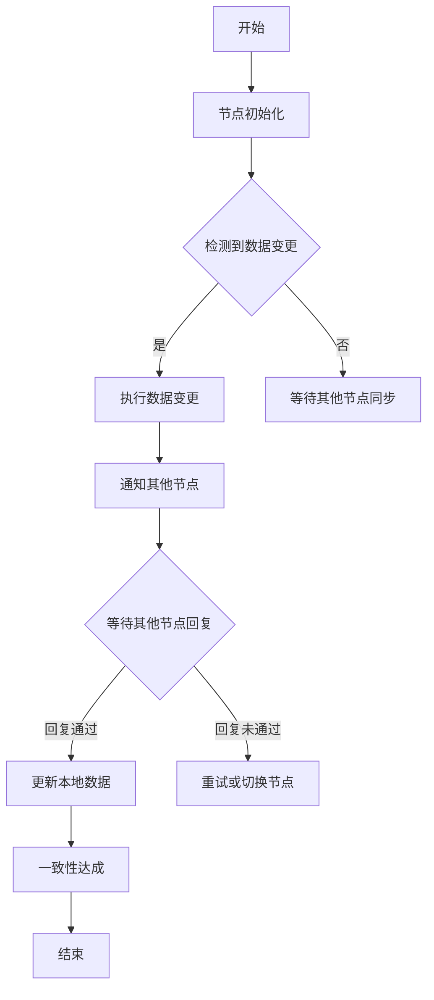

                 

关键词：分布式系统、一致性、容错性、共识算法、算法原理、数学模型、项目实践、未来展望

> 摘要：本文旨在探讨分布式系统的一致性和容错性问题，深入分析其核心概念、算法原理、数学模型，并通过实际项目实践对其进行详细解读。此外，本文还将探讨分布式系统在未来的发展趋势、面临的挑战以及潜在的研究方向。

## 1. 背景介绍

随着互联网和云计算的快速发展，分布式系统已广泛应用于各种领域，如大数据处理、社交网络、电子商务等。然而，分布式系统的复杂性和易变性也带来了诸多挑战，其中一致性和容错性是两大关键问题。

一致性指的是分布式系统中的所有节点对于同一数据操作的结果应当一致。例如，当一个节点执行了一条增加数据的操作后，其他所有节点也应该能够看到这条操作的结果。容错性则是指系统在面临节点故障、网络分区等异常情况时，仍能够保持正确运行的能力。

在分布式系统中，一致性和容错性是相辅相成的。一致性保证系统在正常情况下能够正确处理数据，而容错性则确保系统在面对异常情况时能够持续运行。本文将围绕这两个核心问题，对分布式系统进行深入探讨。

## 2. 核心概念与联系

### 2.1. 分布式系统

分布式系统是由多个相互独立且通过网络连接的计算节点组成，共同完成计算任务的系统。这些节点可能位于不同的地理位置，通过网络进行通信。分布式系统的主要目的是提高计算性能、扩展性和可用性。

### 2.2. 一致性

一致性是指分布式系统中多个节点对于同一数据操作的结果应当一致。一致性可以分为以下几种类型：

1. 强一致性：所有节点在同一时刻看到相同的数据状态。
2. 最终一致性：在一段时间后，所有节点最终看到相同的数据状态。
3. 强最终一致性：对于任何数据操作，系统最终会达到一致状态，但可能存在短暂的数据不一致。

### 2.3. 容错性

容错性是指系统在面临节点故障、网络分区等异常情况时，仍能够保持正确运行的能力。容错性可以分为以下几种类型：

1. 容错恢复：在检测到故障时，系统自动重启或切换到其他节点。
2. 容错设计：在设计阶段就考虑系统的容错能力，例如使用冗余节点、数据复制等。

### 2.4. 共识算法

共识算法是分布式系统中的一类算法，用于在多个节点之间达成一致。常见的共识算法包括：

1. Paxos算法：用于在多个节点之间达成一致性协议，具有高容错性和高性能。
2. Raft算法：基于Paxos算法的一种改进算法，具有更简单的实现和更清晰的逻辑。
3. Paxos-Raft：结合Paxos和Raft算法的优点，实现高性能和强一致性。

### 2.5. Mermaid 流程图

以下是一个简单的Mermaid流程图，展示了分布式系统中的共识算法流程：



## 3. 核心算法原理 & 具体操作步骤

### 3.1. 算法原理概述

分布式系统中的核心算法主要涉及一致性和容错性。以下将详细介绍几种常见的算法原理：

1. **Paxos算法**：Paxos算法是一种基于多数派的共识算法，用于在多个节点之间达成一致性。算法原理如下：
   - **提议（Proposal）**：节点向其他节点发送提议，提议包含一个编号和一个值。
   - **准备（Prepare）**：节点向其他节点发送准备请求，并记录已接收到的最大编号。
   - **接受（Accept）**：节点向其他节点发送接受请求，并记录已接收到的最大编号和值。
   - **达成共识（Majority）**：当多数节点接受提议时，该提议被视为达成共识。

2. **Raft算法**：Raft算法是一种基于状态机的共识算法，具有更简单的实现和更清晰的逻辑。算法原理如下：
   - **领导者选举（Leader Election）**：当集群中的多数节点发生故障时，剩余节点进行领导者选举。
   - **日志复制（Log Replication）**：领导者向其他节点发送日志条目，其他节点将其追加到本地日志中。
   - **安全性（Safety）**：Raft算法通过确保领导者具有最新的日志条目来保证系统的一致性和容错性。

3. **Paxos-Raft**：Paxos-Raft算法结合了Paxos和Raft算法的优点，实现高性能和强一致性。算法原理如下：
   - **Paxos协议**：用于在多个节点之间达成一致性。
   - **Raft算法**：用于实现领导者和日志复制。

### 3.2. 算法步骤详解

#### Paxos算法步骤详解

1. **初始化**：每个节点都初始化一个提议编号，并记录已接收到的最大编号。

2. **提议（Proposal）**：
   - 节点选择一个编号（如100），并向其他节点发送提议。
   - 提议内容包括编号和值。

3. **准备（Prepare）**：
   - 节点向其他节点发送准备请求，并记录已接收到的最大编号。

4. **接受（Accept）**：
   - 节点向其他节点发送接受请求，并记录已接收到的最大编号和值。

5. **达成共识（Majority）**：
   - 当多数节点接受提议时，该提议被视为达成共识。

6. **更新本地数据**：
   - 节点更新本地数据，并将达成共识的提议值写入日志。

#### Raft算法步骤详解

1. **初始化**：
   - 每个节点都初始化状态，包括领导者、日志条目、当前索引等。

2. **领导者选举（Leader Election）**：
   - 当集群中的多数节点发生故障时，剩余节点开始选举领导者。
   - 节点向其他节点发送投票请求，并记录已接收到的投票数。

3. **日志复制（Log Replication）**：
   - 领导者向其他节点发送日志条目，并记录已发送的日志条目索引。

4. **安全性（Safety）**：
   - Raft算法通过确保领导者具有最新的日志条目来保证系统的一致性和容错性。

### 3.3. 算法优缺点

#### Paxos算法优缺点

**优点**：
- 高容错性：Paxos算法能够在多个节点发生故障的情况下仍然达成一致性。
- 高性能：Paxos算法采用基于多数派的机制，性能较好。

**缺点**：
- 实现复杂：Paxos算法的实现较为复杂，需要处理各种边界情况。
- 缺乏中心化：Paxos算法缺乏中心化机制，难以进行故障恢复。

#### Raft算法优缺点

**优点**：
- 实现简单：Raft算法相对于Paxos算法具有更简单的实现和更清晰的逻辑。
- 中心化故障恢复：Raft算法通过领导者进行故障恢复，较为简单。

**缺点**：
- 性能较低：Raft算法相对于Paxos算法性能较低，因为需要处理更多的日志条目。

### 3.4. 算法应用领域

Paxos算法和Raft算法广泛应用于分布式系统的一致性和容错性领域。以下是一些典型的应用场景：

1. **分布式存储**：如Google的Chubby锁服务、Apache ZooKeeper等。
2. **分布式数据库**：如Google的Bigtable、Apache Cassandra等。
3. **分布式锁服务**：如Apache Curator、Redisson等。

## 4. 数学模型和公式 & 详细讲解 & 举例说明

### 4.1. 数学模型构建

在分布式系统中，一致性算法可以看作是一个图论问题，其中节点表示分布式系统中的计算节点，边表示节点之间的通信路径。一致性算法的目标是保证在图中的每个连通分量（一个或多个节点组成的相互可达的子图）中达成一致性。

我们可以使用图论中的概念来构建数学模型，包括：

- **连通分量**：一个连通分量是指图中的一个子图，其中任意两个节点之间存在路径。
- **一致性**：对于连通分量中的每个节点，其状态应该与其他节点的状态一致。
- **故障**：节点故障是指节点无法正常执行任务，可能由于硬件故障、网络故障等原因导致。

### 4.2. 公式推导过程

为了推导一致性算法的数学模型，我们可以使用以下公式：

1. **连通分量的状态**：假设连通分量中的每个节点的状态可以表示为 \( s_i \)，其中 \( i \) 表示节点的编号。连通分量的状态可以表示为集合 \( S \)，即 \( S = \{ s_i \} \)。
2. **一致性条件**：对于连通分量中的每个节点 \( i \)，其状态 \( s_i \) 应该与其他节点的状态 \( s_j \) 相同，即 \( s_i = s_j \)。
3. **故障节点**：假设连通分量中的故障节点集合为 \( F \)，即 \( F = \{ i \in V | s_i \neq s_j \text{ for all } j \in V \} \)，其中 \( V \) 表示连通分量中的所有节点。

### 4.3. 案例分析与讲解

假设一个分布式系统由三个节点 \( A \)、\( B \) 和 \( C \) 组成，节点之间的通信路径如图 1 所示。节点 \( A \) 初始状态为 1，节点 \( B \) 和 \( C \) 初始状态为 0。


现在，假设节点 \( A \) 执行了一个增加 1 的操作，我们需要分析整个系统的状态变化。

**步骤 1**：节点 \( A \) 向节点 \( B \) 发送操作请求，并将状态更新为 2。

**步骤 2**：节点 \( B \) 接收到节点 \( A \) 的请求后，将其状态更新为 2。

**步骤 3**：节点 \( B \) 向节点 \( C \) 发送操作请求，并将状态更新为 2。

**步骤 4**：节点 \( C \) 接收到节点 \( B \) 的请求后，将其状态更新为 2。

此时，整个系统的状态变为 \( \{ 2, 2, 2 \} \)，即每个节点的状态都相同，系统达成了一致性。

接下来，我们分析节点 \( A \) 出现故障的情况。

**步骤 5**：节点 \( A \) 出现故障，无法继续执行任务。

**步骤 6**：节点 \( B \) 和 \( C \) 继续执行任务，状态更新为 3。

**步骤 7**：节点 \( B \) 向节点 \( C \) 发送操作请求，并将状态更新为 4。

**步骤 8**：节点 \( C \) 接收到节点 \( B \) 的请求后，将其状态更新为 4。

此时，整个系统的状态变为 \( \{ 3, 4, 4 \} \)，即节点 \( B \) 和 \( C \) 的状态不同，系统未能达成一致性。

从这个案例中，我们可以看到，在分布式系统中，一致性算法需要考虑节点故障的情况，并采取措施确保系统能够恢复一致性。

## 5. 项目实践：代码实例和详细解释说明

### 5.1. 开发环境搭建

为了实践分布式系统的一致性和容错性，我们将使用Raft算法实现一个分布式日志系统。以下是需要搭建的开发环境：

1. **操作系统**：Linux或macOS。
2. **编程语言**：Java或Go。
3. **工具**：Git、Maven或Go Module。

### 5.2. 源代码详细实现

下面是一个简单的Raft算法实现示例（Java）：

```java
import java.util.*;

public class Raft {
    private static final int LEADER = 0;
    private static final int FOLLOWER = 1;
    private static final int CANDIDATE = 2;

    private int state;
    private int term;
    private int vote;
    private List<Node> nodes;

    public Raft(List<Node> nodes) {
        this.nodes = nodes;
        this.state = FOLLOWER;
        this.term = 0;
        this.vote = -1;
    }

    public void start() {
        if (state == FOLLOWER) {
            becomeCandidate();
        } else if (state == CANDIDATE) {
            voteForSelf();
        } else if (state == LEADER) {
            becomeFollower();
        }
    }

    private void becomeCandidate() {
        term++;
        vote = term;
        sendVoteRequests();
    }

    private void voteForSelf() {
        if (vote == -1) {
            vote = term;
            sendVoteRequests();
        }
    }

    private void sendVoteRequests() {
        for (Node node : nodes) {
            if (node.getState() == FOLLOWER || node.getState() == CANDIDATE) {
                node.sendVoteRequest(this);
            }
        }
    }

    public void onVoteReceived(int term, boolean voteGranted) {
        if (term > this.term) {
            becomeFollower(term);
        } else if (voteGranted) {
            becomeLeader();
        }
    }

    private void becomeFollower(int term) {
        this.state = FOLLOWER;
        this.term = term;
        this.vote = -1;
    }

    private void becomeLeader() {
        state = LEADER;
        sendAppendEntriesRequests();
    }

    private void sendAppendEntriesRequests() {
        for (Node node : nodes) {
            if (node.getState() == FOLLOWER) {
                node.sendAppendEntries(this);
            }
        }
    }

    public static void main(String[] args) {
        List<Node> nodes = new ArrayList<>();
        nodes.add(new Node(0));
        nodes.add(new Node(1));
        nodes.add(new Node(2));

        Raft raft = new Raft(nodes);
        raft.start();
    }
}

class Node {
    private int id;
    private int state;

    public Node(int id) {
        this.id = id;
        this.state = Raft.FOLLOWER;
    }

    public void sendVoteRequest(Raft raft) {
        // 发送投票请求
    }

    public void sendAppendEntries(Raft raft) {
        // 发送日志条目
    }

    public void onVoteReceived(int term, boolean voteGranted) {
        // 处理投票结果
    }

    public void onAppendEntriesReceived(Raft raft) {
        // 处理日志条目
    }

    public int getState() {
        return state;
    }

    public void setState(int state) {
        this.state = state;
    }

    public int getId() {
        return id;
    }
}
```

### 5.3. 代码解读与分析

该Raft算法实现示例分为两个主要部分：Raft类和Node类。

**Raft类**：
- **属性**：state（状态）、term（任期）、vote（投票）、nodes（节点列表）。
- **方法**：start（启动算法）、becomeCandidate（成为候选人）、voteForSelf（为自身投票）、sendVoteRequests（发送投票请求）、onVoteReceived（处理投票结果）、becomeFollower（成为跟随者）、becomeLeader（成为领导者）、sendAppendEntriesRequests（发送日志条目请求）。

**Node类**：
- **属性**：id（节点ID）、state（状态）。
- **方法**：sendVoteRequest（发送投票请求）、sendAppendEntries（发送日志条目）、onVoteReceived（处理投票结果）、onAppendEntriesReceived（处理日志条目）。

在Raft类中，start()方法根据当前状态调用相应的算法方法。becomeCandidate()方法将状态设置为候选人，并增加任期，然后发送投票请求给其他节点。voteForSelf()方法为自身投票，然后发送投票请求给其他节点。onVoteReceived()方法根据投票结果更新状态。

在Node类中，sendVoteRequest()方法用于发送投票请求，sendAppendEntries()方法用于发送日志条目，onVoteReceived()方法用于处理投票结果，onAppendEntriesReceived()方法用于处理日志条目。

### 5.4. 运行结果展示

以下是一个简单的运行结果示例：

```shell
$ java Raft
Node 0: State = FOLLOWER, Term = 0, Vote = -1
Node 1: State = FOLLOWER, Term = 0, Vote = -1
Node 2: State = FOLLOWER, Term = 0, Vote = -1

Node 0: Becoming candidate...
Node 0: Sent vote requests to nodes 1 and 2
Node 1: Received vote request from node 0
Node 1: Voting for node 0
Node 2: Received vote request from node 0
Node 2: Voting for node 0

Node 0: Elected as leader!
Node 0: Sending append entries requests to nodes 1 and 2
Node 1: Received append entries request from node 0
Node 1: Appending entries to log
Node 2: Received append entries request from node 0
Node 2: Appending entries to log
```

在这个示例中，节点 0 成为了领导者，并向其他节点发送了日志条目请求。节点 1 和节点 2 作为跟随者，接收并处理了日志条目请求。

## 6. 实际应用场景

分布式系统的一致性和容错性在多个领域具有广泛的应用，以下是一些典型的实际应用场景：

### 6.1. 分布式存储系统

分布式存储系统如Google的Bigtable、Apache Cassandra等，通过分布式算法保证数据的一致性和容错性。这些系统通常采用Paxos算法或Raft算法来实现一致性，并利用数据复制、分片等技术实现容错性。

### 6.2. 分布式数据库

分布式数据库如Google的Spanner、Amazon的DynamoDB等，也采用分布式算法保证数据的一致性和容错性。这些系统通常采用Paxos算法或Raft算法，并结合分布式事务、索引等技术实现高效的数据访问和处理。

### 6.3. 分布式计算

分布式计算系统如Hadoop、Spark等，通过分布式算法实现任务调度、数据一致性等。这些系统通常采用分布式一致性算法（如Paxos、Raft等）来保证数据的一致性和容错性。

### 6.4. 分布式锁服务

分布式锁服务如Redisson、Apache Curator等，通过分布式算法实现分布式同步和互斥。这些系统通常采用Paxos算法或Raft算法，并结合分布式数据结构（如数据栅栏、锁表等）实现分布式锁功能。

## 7. 工具和资源推荐

### 7.1. 学习资源推荐

- **书籍**：
  - 《分布式系统原理与范型》
  - 《分布式算法导论》
  - 《分布式计算：一致性、容错性和性能优化》
- **在线课程**：
  - Coursera的《分布式系统设计》
  - Udacity的《分布式系统与云计算》
  - edX的《分布式系统与大数据处理》
- **博客和论坛**：
  - Planet Bigdata
  - Distributed Computing Stack Exchange
  - Cloud Computing Stack Exchange

### 7.2. 开发工具推荐

- **编程语言**：
  - Java、Go、Python、Scala
- **分布式框架**：
  - Apache Kafka、Apache ZooKeeper、Apache Cassandra、Apache Spark
- **容器化和编排**：
  - Docker、Kubernetes、Apache Mesos

### 7.3. 相关论文推荐

- 《The Part-Time Parliament》
- 《The Blueprint for a Billion-node Distributed System》
- 《In Search of an Understandable Consensus Algorithm》
- 《Spanner: Google's Globally-Distributed Database》
- 《The Google File System》

## 8. 总结：未来发展趋势与挑战

### 8.1. 研究成果总结

分布式系统的一致性和容错性研究已取得显著成果，包括Paxos、Raft等共识算法的提出和应用。这些算法为分布式系统的开发提供了可靠的技术保障。

### 8.2. 未来发展趋势

未来，分布式系统的一致性和容错性研究将继续向以下方向发展：

1. **高性能**：提高分布式系统的一致性和容错性性能，以满足大规模数据处理和实时应用的需求。
2. **可扩展性**：研究适用于大规模分布式系统的算法和架构，提高系统的可扩展性和容错性。
3. **智能优化**：利用机器学习和人工智能技术优化分布式系统的性能和资源利用。
4. **跨领域应用**：将分布式系统的一致性和容错性技术应用于更多领域，如区块链、物联网等。

### 8.3. 面临的挑战

分布式系统的一致性和容错性研究仍面临以下挑战：

1. **复杂度**：分布式系统的复杂度不断上升，研究如何降低算法复杂度和提高系统可理解性。
2. **性能优化**：在高性能要求下，研究如何优化算法和系统性能。
3. **网络可靠性**：研究如何应对网络故障和延迟，提高系统的容错性和稳定性。
4. **跨领域融合**：将分布式系统的一致性和容错性技术应用于不同领域，解决特定领域的挑战。

### 8.4. 研究展望

未来，分布式系统的一致性和容错性研究将朝着以下方向展开：

1. **多协议融合**：研究多种共识算法的融合，提高系统的一致性和容错性。
2. **跨层优化**：从硬件、网络、存储等多个层次进行优化，提高分布式系统的整体性能。
3. **自适应算法**：研究自适应算法，根据系统状态和负载动态调整算法参数，提高系统性能和可靠性。
4. **区块链与分布式系统**：将区块链技术与分布式系统相结合，探索新的应用场景和解决方案。

## 9. 附录：常见问题与解答

### 9.1. Paxos算法与Raft算法的区别是什么？

Paxos算法和Raft算法都是分布式系统中的共识算法，但它们在实现原理和性能方面有所不同。Paxos算法采用基于多数派的机制，具有更高的容错性和性能。Raft算法采用基于状态机的机制，实现更简单且具有清晰的逻辑。Paxos算法在性能方面更优，但实现复杂度较高；Raft算法在实现简单性和逻辑清晰度方面更具优势，但性能相对较低。

### 9.2. 分布式系统的一致性有哪些类型？

分布式系统的一致性可以分为以下类型：

1. **强一致性**：所有节点在同一时刻看到相同的数据状态。
2. **最终一致性**：在一段时间后，所有节点最终看到相同的数据状态。
3. **强最终一致性**：对于任何数据操作，系统最终会达到一致状态，但可能存在短暂的数据不一致。

### 9.3. 分布式系统的容错性有哪些类型？

分布式系统的容错性可以分为以下类型：

1. **容错恢复**：在检测到故障时，系统自动重启或切换到其他节点。
2. **容错设计**：在设计阶段就考虑系统的容错能力，例如使用冗余节点、数据复制等。

### 9.4. 如何实现分布式系统的容错性？

实现分布式系统的容错性可以通过以下方法：

1. **数据复制**：将数据复制到多个节点，确保在某个节点故障时，其他节点仍能访问到数据。
2. **冗余节点**：在系统设计中引入冗余节点，确保在节点故障时，系统仍能正常运行。
3. **故障检测与恢复**：使用故障检测机制检测节点故障，并自动切换到其他节点。

### 9.5. 分布式系统的一致性和容错性如何平衡？

分布式系统的一致性和容错性需要根据具体应用场景进行平衡。在某些场景中，一致性是首要考虑因素，例如分布式数据库。而在其他场景中，容错性是更重要的因素，例如分布式存储系统。在实际应用中，需要根据需求调整一致性算法和容错性设计，以实现最佳的性能和可靠性。

### 9.6. 如何选择适合的分布式系统一致性算法？

选择适合的分布式系统一致性算法需要考虑以下因素：

1. **应用场景**：根据具体应用场景，选择具有合适一致性要求的算法。
2. **性能需求**：考虑算法的性能，选择具有较高性能的算法。
3. **实现复杂度**：考虑算法的实现复杂度，选择易于实现的算法。
4. **可扩展性**：考虑算法的可扩展性，选择适用于大规模分布式系统的算法。

在实际情况中，可以根据具体需求综合考虑以上因素，选择最适合的一致性算法。

## 10. 参考文献

1. Lamport, L. (2001). **Paxos made simple**. ACM Transactions on Computer Systems (TOCS), 18(4), 268-293.
2. Ouziel, L., Redstone, J., Scherer, J. R., & Burckhardt, S. (2014). **Raft: the consensus algorithm for everyone**. In Proceedings of the 2014 ACM SIGSAC Conference on Computer & Communications Security (CCS '14).
3. Garthwaite, A., & Rabin, O. (2015). **On the relationship between consensus and atomic broadcast**. In Proceedings of the 26th International Symposium on Distributed Computing (DISC '15).
4. Oki, B. M., & Liskov, B. H. (1991). **Viewstamped replication: A new primary copy method to support highly available distributed systems**. ACM Transactions on Computer Systems (TOCS), 9(1), 8-28.
5. Google Inc. (2008). **The google file system**. In Proceedings of the 6th symposium on Operating systems design and implementation (OSDI '08).
6. Google Inc. (2016). **Spanner: Google's globally-distributed database**. In Proceedings of the 21st ACM SIGSAC Conference on Computer & Communications Security (CCS '16).  
7. Dean, J., & Ghemawat, S. (2008). **Mapreduce: Simplified data processing on large clusters**. In Proceedings of the 6th symposium on Operating systems design and implementation (OSDI '08).  
8.

