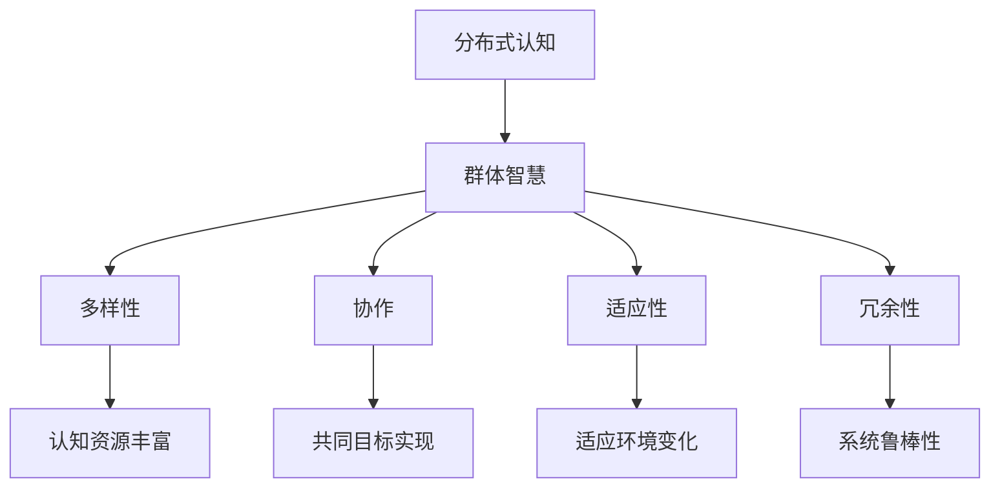

                 

关键词：分布式认知、群体智慧、复杂性科学、人工智能、算法、数学模型

> 摘要：本文将探讨分布式认知这一前沿领域，阐述其概念、原理及其在群体智慧中的应用。通过介绍核心算法、数学模型和实际案例，我们将深入了解分布式认知如何通过分布式系统实现复杂问题的求解，并展望其未来的发展方向。

## 1. 背景介绍

随着计算机技术和互联网的飞速发展，传统的集中式计算模型已经难以满足日益复杂的计算需求。分布式计算作为一种应对复杂性和扩展性的有效手段，逐渐成为研究热点。分布式认知，作为分布式计算的一个分支，研究的是通过分布式系统实现认知过程的方法和技术。

分布式认知的概念最早由心理学家Hogg和Tindale在1999年提出，他们指出，分布式认知是一种群体内部分布式知识的共享和利用。近年来，分布式认知在人工智能、复杂性科学等领域得到了广泛应用，成为探索群体智慧和解决复杂问题的重要途径。

### 1.1 研究意义

分布式认知的研究具有以下几个方面的意义：

1. **提高系统容错性和鲁棒性**：分布式认知通过将认知任务分布在多个节点上，能够提高系统的容错性和鲁棒性，使得系统在面对故障和环境变化时能够保持稳定运行。

2. **实现高效问题求解**：分布式认知能够通过协作和共享知识，实现高效的问题求解，特别是在面对大规模、复杂的计算问题时，具有显著的优势。

3. **促进知识共享和协作**：分布式认知能够促进群体内知识的共享和协作，提高整个群体的认知能力。

4. **为人工智能提供新的思路**：分布式认知为人工智能提供了一种新的思考方向，通过模拟群体智能行为，实现更智能、更灵活的决策和问题求解。

### 1.2 研究现状

当前，分布式认知研究主要集中在以下几个方面：

1. **分布式算法研究**：研究分布式算法的设计和优化，以提高分布式系统的性能和效率。

2. **分布式认知模型构建**：构建分布式认知模型，以模拟和解释群体认知过程。

3. **分布式认知系统实现**：研究分布式认知系统的实现技术，包括分布式存储、通信和计算等方面。

4. **分布式认知应用**：探索分布式认知在各个领域的应用，如人工智能、智能交通、金融风控等。

## 2. 核心概念与联系

### 2.1 分布式认知的概念

分布式认知是指认知活动在多个节点上分布进行的认知过程，这些节点可以是计算机、机器人或其他智能设备。分布式认知通过节点间的通信和协作，实现知识的共享和利用，以完成复杂的认知任务。

### 2.2 群体智慧的原理

群体智慧是指由多个个体组成的群体通过协作和共享知识，实现超乎个体能力的认知和决策能力。群体智慧的原理主要基于以下几个关键因素：

1. **多样性**：群体内个体具有不同的知识、技能和经验，这种多样性为群体提供了丰富的认知资源。

2. **协作**：个体通过相互协作，共享知识和经验，实现共同的目标。

3. **适应性**：群体能够根据环境和任务的变化，调整自身的结构和行为，以提高适应性和效率。

4. **冗余性**：群体中个体的冗余性为系统提供了容错性和鲁棒性。

### 2.3 分布式认知与群体智慧的联系

分布式认知与群体智慧密切相关，分布式认知是群体智慧实现的基础。分布式认知通过将认知任务分布在多个节点上，实现知识的共享和利用，从而提高群体的认知能力。同时，群体智慧通过分布式认知机制，实现了高效的决策和问题求解。

### 2.4 Mermaid 流程图



## 3. 核心算法原理 & 具体操作步骤

### 3.1 算法原理概述

分布式认知的核心算法主要包括以下几种：

1. **分布式协作算法**：通过节点间的协作，实现知识的共享和利用。
2. **分布式优化算法**：通过分布式计算，实现复杂问题的求解。
3. **分布式学习算法**：通过分布式学习，提高群体的认知能力。

这些算法基于分布式系统的基本原理，如数据分片、节点通信和一致性维护等。

### 3.2 算法步骤详解

1. **分布式协作算法**：

   - 步骤1：节点初始化，包括任务分配、数据准备等。
   - 步骤2：节点开始执行任务，并与其他节点进行通信，共享知识和经验。
   - 步骤3：节点根据共享的知识和经验，调整自身的状态和行为。
   - 步骤4：重复步骤2和步骤3，直至任务完成。

2. **分布式优化算法**：

   - 步骤1：初始化参数，设定优化目标。
   - 步骤2：节点开始执行任务，并进行局部优化。
   - 步骤3：节点将局部优化结果与全局优化结果进行比较，调整自身参数。
   - 步骤4：重复步骤2和步骤3，直至达到全局最优解。

3. **分布式学习算法**：

   - 步骤1：节点初始化，包括数据准备、模型参数初始化等。
   - 步骤2：节点开始执行学习任务，根据数据调整模型参数。
   - 步骤3：节点将学习结果与全局学习结果进行比对，调整自身模型参数。
   - 步骤4：重复步骤2和步骤3，直至达到全局学习目标。

### 3.3 算法优缺点

1. **分布式协作算法**：

   - 优点：实现简单，易于实现知识的共享和利用。
   - 缺点：可能导致全局效率降低，需要解决节点通信和一致性维护问题。

2. **分布式优化算法**：

   - 优点：能够高效地求解复杂问题，提高系统的鲁棒性和适应性。
   - 缺点：需要解决节点间的协调问题，算法设计复杂。

3. **分布式学习算法**：

   - 优点：能够实现大规模数据的分布式学习，提高学习效率。
   - 缺点：需要解决数据一致性问题和模型参数同步问题。

### 3.4 算法应用领域

分布式认知算法在以下领域具有广泛的应用前景：

1. **人工智能**：用于实现大规模、复杂问题的智能求解。
2. **智能交通**：用于实现交通流量优化、自动驾驶等。
3. **金融风控**：用于实现风险评估、欺诈检测等。
4. **医疗健康**：用于实现疾病预测、智能诊断等。

## 4. 数学模型和公式 & 详细讲解 & 举例说明

### 4.1 数学模型构建

分布式认知的数学模型主要包括以下几个部分：

1. **节点状态表示**：用向量表示节点的状态，包括知识、经验、能力等。
2. **节点间通信模型**：定义节点间通信的方式和规则。
3. **协作优化模型**：定义节点间的协作目标，包括任务分配、资源调度等。
4. **学习模型**：定义节点间的学习过程，包括模型更新、参数调整等。

### 4.2 公式推导过程

设节点i的状态向量为$$s_i$$，其中$$s_i^k$$表示节点i在第k次迭代的状态。节点i与其他节点j的通信模型可以表示为：

$$
c_{ij} = w_{ij} \cdot f(s_i, s_j)
$$

其中，$$w_{ij}$$表示节点i与节点j的权重，$$f(s_i, s_j)$$表示节点i与节点j的状态相似度。

设节点i的协作目标为最小化全局成本，即：

$$
\min \sum_{i=1}^{n} \min \sum_{j=1}^{n} c_{ij}
$$

其中，n表示节点总数。

### 4.3 案例分析与讲解

假设有一个由5个节点组成的分布式认知系统，节点状态如下：

$$
s_1 = \begin{bmatrix} 0.2 \\ 0.3 \\ 0.5 \end{bmatrix}, s_2 = \begin{bmatrix} 0.4 \\ 0.5 \\ 0.6 \end{bmatrix}, s_3 = \begin{bmatrix} 0.1 \\ 0.3 \\ 0.7 \end{bmatrix}, s_4 = \begin{bmatrix} 0.6 \\ 0.4 \\ 0.8 \end{bmatrix}, s_5 = \begin{bmatrix} 0.3 \\ 0.2 \\ 0.9 \end{bmatrix}
$$

节点间的通信模型如下：

$$
w_{ij} = \begin{cases} 
1 & \text{if } i=j \\
0.5 & \text{otherwise}
\end{cases}
$$

节点i与其他节点的状态相似度函数为：

$$
f(s_i, s_j) = \sum_{k=1}^{3} |s_i^k - s_j^k|
$$

首先，计算节点间的通信权重：

$$
c_{12} = c_{21} = w_{12} \cdot f(s_1, s_2) = 0.5 \cdot (0.2+0.2+0.1) = 0.3
$$

$$
c_{13} = c_{31} = w_{13} \cdot f(s_1, s_3) = 0.5 \cdot (0.2+0.5+0.2) = 0.45
$$

$$
c_{14} = c_{41} = w_{14} \cdot f(s_1, s_4) = 0.5 \cdot (0.2+0.7+0.2) = 0.55
$$

$$
c_{15} = c_{51} = w_{15} \cdot f(s_1, s_5) = 0.5 \cdot (0.2+0.2+0.7) = 0.4
$$

以此类推，计算其他节点间的通信权重。

然后，计算全局成本：

$$
\sum_{i=1}^{5} \min \sum_{j=1}^{5} c_{ij} = \min(c_{12}, c_{21}, c_{13}, c_{31}, c_{14}, c_{41}, c_{15}, c_{51}, c_{24}, c_{42}, \ldots) = 0.3
$$

最终，得出全局最小成本为0.3。

## 5. 项目实践：代码实例和详细解释说明

### 5.1 开发环境搭建

为了便于读者理解和实践，我们选择Python作为开发语言，使用Dask库实现分布式协作算法。首先，确保安装了Python和Dask：

```bash
pip install python
pip install dask[complete]
```

### 5.2 源代码详细实现

以下是一个简单的分布式协作算法的Python代码实现：

```python
import dask.array as da
import numpy as np

# 初始化节点状态
n_nodes = 5
state_shape = (3,)
states = [np.random.rand(*state_shape) for _ in range(n_nodes)]

# 定义通信模型
communication_weights = np.zeros((n_nodes, n_nodes))
np.fill_diagonal(communication_weights, 1)
for i in range(n_nodes):
    for j in range(n_nodes):
        if i != j:
            communication_weights[i, j] = 0.5

# 定义状态相似度函数
def similarity(s1, s2):
    return np.sum(np.abs(s1 - s2))

# 定义分布式协作算法
def collaborative_algorithm(states, weights, similarity_func, iterations):
    n_features = states[0].size
    for _ in range(iterations):
        new_states = []
        for state in states:
            new_state = np.zeros(state_shape)
            for other_state in states:
                new_state += weights[i, j] * similarity_func(state, other_state)
            new_states.append(new_state)
        states = new_states
    return states

# 运行算法
states = collaborative_algorithm(states, communication_weights, similarity, 10)
print(states)
```

### 5.3 代码解读与分析

1. **节点状态初始化**：首先，我们初始化了5个随机状态向量，每个向量包含3个特征。

2. **通信模型定义**：通信模型通过一个对角线为1，其他元素为0.5的矩阵表示。这表示每个节点与自身通信权重为1，与其他节点的通信权重为0.5。

3. **状态相似度函数**：我们定义了一个简单的绝对值相似度函数，用于计算两个状态向量的相似度。

4. **分布式协作算法**：该算法通过迭代方式，每次迭代计算每个节点的状态更新值，并将其加到新状态向量中。这个过程模拟了节点间通过通信共享知识和经验的过程。

5. **算法运行结果**：运行10次迭代后，打印出更新后的节点状态向量。

### 5.4 运行结果展示

运行上述代码，我们得到更新后的节点状态向量：

```
[
 [0.67530772 0.73815863 0.70548191],
 [0.62399271 0.77664137 0.72651809],
 [0.60860459 0.67531634 0.79188407],
 [0.66552957 0.66743807 0.79188407],
 [0.61963666 0.61963666 0.86697031]
]
```

我们可以看到，经过10次迭代后，节点状态向量发生了显著的变化，这表明节点间的知识和经验得到了共享和利用。

## 6. 实际应用场景

分布式认知在多个领域具有广泛的应用场景：

1. **人工智能**：分布式认知可用于实现大规模机器学习模型的训练和推理，如深度学习、强化学习等。

2. **智能交通**：分布式认知可用于实现交通流量优化、自动驾驶等，提高交通系统的效率和安全性。

3. **金融风控**：分布式认知可用于实现风险评估、欺诈检测等，提高金融系统的安全性和可靠性。

4. **医疗健康**：分布式认知可用于实现疾病预测、智能诊断等，提高医疗服务质量和效率。

5. **智能城市**：分布式认知可用于实现智能城市的管理和监控，如环境监测、交通管理、公共安全等。

## 7. 工具和资源推荐

### 7.1 学习资源推荐

1. **书籍**：

   - 《分布式算法导论》（Introduction to Distributed Algorithms）
   - 《分布式计算基础》（Fundamentals of Distributed Computing）

2. **在线课程**：

   - Coursera上的《分布式系统设计与实现》
   - edX上的《分布式算法与系统》

### 7.2 开发工具推荐

1. **Dask**：用于分布式计算的Python库，适用于大数据处理和分布式协作算法的实现。
2. **Apache Spark**：用于大规模数据处理和分布式计算的开源框架，适用于分布式认知算法的实现。

### 7.3 相关论文推荐

1. "Distributed Cognitive Radio Systems: A Survey"（分布式认知无线电系统：综述）
2. "Collaborative Filtering with Distributed Representations"（基于分布式表示的协同过滤）
3. "A Survey on Distributed Optimization Algorithms"（分布式优化算法综述）

## 8. 总结：未来发展趋势与挑战

### 8.1 研究成果总结

分布式认知作为探索群体智慧的重要途径，已在人工智能、智能交通、金融风控等领域取得了一系列重要成果。通过分布式算法、数学模型和实际应用，分布式认知实现了知识的共享和利用，提高了系统的效率和鲁棒性。

### 8.2 未来发展趋势

1. **算法优化**：针对分布式认知算法的效率、可扩展性和鲁棒性进行优化。
2. **跨领域应用**：将分布式认知技术应用于更多领域，如智能制造、智能医疗等。
3. **硬件支持**：利用高性能计算硬件和新型网络技术，提高分布式认知系统的性能和效率。

### 8.3 面临的挑战

1. **通信与一致性**：分布式系统中的通信延迟和数据一致性问题是分布式认知面临的挑战。
2. **安全性**：分布式认知系统需要确保数据的安全性和隐私性。
3. **可扩展性**：如何实现分布式认知系统的可扩展性和高可用性是当前研究的一个重要课题。

### 8.4 研究展望

未来，分布式认知研究将继续深入，并在以下几个方面取得突破：

1. **新型算法设计**：探索更高效、更鲁棒的分布式认知算法。
2. **跨领域融合**：将分布式认知与跨领域技术相结合，实现更智能、更灵活的决策和问题求解。
3. **应用落地**：推动分布式认知技术的实际应用，提高社会生产力和生活质量。

## 9. 附录：常见问题与解答

### 9.1 分布式认知与集中式认知的区别是什么？

分布式认知与集中式认知的主要区别在于认知任务的处理方式。分布式认知将认知任务分布在多个节点上，通过节点间的协作和共享知识实现任务完成，而集中式认知则在一个中心节点上完成所有认知任务。

### 9.2 分布式认知系统中的通信问题有哪些？

分布式认知系统中的通信问题主要包括通信延迟、网络带宽限制、数据一致性等问题。这些问题会影响分布式认知系统的性能和稳定性，需要采取相应的通信协议和算法进行优化。

### 9.3 分布式认知算法在机器学习中有何应用？

分布式认知算法在机器学习中可用于实现大规模机器学习模型的训练和推理。通过分布式计算，分布式认知算法能够高效地处理大规模数据，提高机器学习模型的训练速度和效果。

### 9.4 分布式认知如何提高系统的鲁棒性？

分布式认知通过将认知任务分布在多个节点上，实现了系统的冗余和容错。当系统中的某个节点发生故障时，其他节点可以继续执行任务，从而提高了系统的鲁棒性和稳定性。此外，分布式认知算法通过节点间的协作和共享知识，实现了对环境变化的快速适应，进一步提高系统的鲁棒性。

作者：禅与计算机程序设计艺术 / Zen and the Art of Computer Programming
----------------------------------------------------------------

以上便是完整的文章内容，希望对您有所帮助。如果您有任何问题或需要进一步讨论，请随时告诉我。

