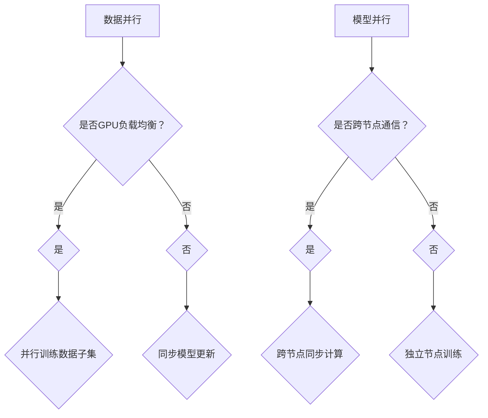

                 

### 关键词 Keywords ###
- 分布式训练
- 数据并行
- 模型并行
- 训练效率
- 批处理大小
- GPU负载均衡

<|assistant|>### 摘要 Abstract ###
本文深入探讨了分布式训练中的两种主要策略：数据并行和模型并行。通过分析这两种策略的原理、优缺点和应用领域，本文旨在为读者提供全面的技术见解，帮助他们在实际项目中做出最优的决策。文章还将详细介绍数学模型和公式，并提供一个代码实例，以展示如何在实际应用中实现分布式训练策略。

## 1. 背景介绍

### 分布式训练的兴起

随着深度学习模型的复杂性和计算需求的增加，单机训练已经无法满足大规模数据集和高精度模型的训练需求。分布式训练应运而生，它通过将数据或模型分布在多个计算节点上进行训练，从而提高训练速度和效率。分布式训练技术已成为推动深度学习应用发展的重要力量。

### 数据并行与模型并行的定义

数据并行（Data Parallelism）是指将训练数据集划分成多个部分，每个部分在不同的计算节点上独立进行模型的训练，然后再将各个节点的模型更新合并。模型并行（Model Parallelism）则是将模型拆分成多个部分，每个部分在不同的计算节点上进行训练，通常涉及到模型结构在计算节点之间的划分。

## 2. 核心概念与联系

### 分布式训练的架构


#### 数据并行

数据并行通过将数据集分成多个子集，每个子集由不同的GPU或计算节点处理。数据并行的主要优势在于它可以大大提高训练速度，同时保持模型的准确性。其关键在于批处理大小（Batch Size）的选择和GPU负载均衡。

#### 模型并行

模型并行通过将模型的不同部分分配到不同的计算节点上，每个节点负责一部分的计算。这种方法可以处理更大的模型或更复杂的数据，但可能会导致通信成本增加和模型准确性的下降。

### Mermaid 流程图



## 3. 核心算法原理 & 具体操作步骤

### 3.1 算法原理概述

数据并行通过并行处理数据子集来加速训练过程。每个节点独立计算梯度，然后通过同步机制（如参数服务器或AllReduce）合并梯度。模型并行则是将模型拆分，每个节点负责一部分的计算，并在需要时进行跨节点的通信。

### 3.2 算法步骤详解

#### 数据并行步骤

1. **划分数据集**：将训练数据集划分为多个子集。
2. **初始化模型**：在每个节点上初始化模型。
3. **独立训练**：每个节点独立计算梯度。
4. **同步更新**：使用参数服务器或AllReduce等机制同步更新模型参数。

#### 模型并行步骤

1. **模型拆分**：将模型拆分为多个部分。
2. **初始化模型**：在每个节点上初始化模型的相应部分。
3. **独立训练**：每个节点独立计算梯度。
4. **跨节点通信**：在需要时，通过通信机制（如参数服务器或AllReduce）同步模型部分。

### 3.3 算法优缺点

#### 数据并行

**优点**： 
- 高效：通过并行处理数据子集，可以显著提高训练速度。
- 简单：实现相对简单，易于部署。

**缺点**： 
- 批处理大小限制：可能受到批处理大小的影响，批量大小过小可能导致训练效果下降。
- GPU负载不均衡：可能存在GPU负载不均衡的情况，影响整体训练效率。

#### 模型并行

**优点**： 
- 处理大型模型：可以处理更大的模型，不适合数据并行的情况。
- 复杂数据处理：适用于处理复杂的数据，如图像和视频。

**缺点**： 
- 通信成本：跨节点的通信可能增加通信成本。
- 模型准确性：可能影响模型的准确性。

### 3.4 算法应用领域

数据并行适用于大规模数据集的训练，如自然语言处理和计算机视觉。模型并行适用于大型模型或复杂数据的训练，如深度强化学习和三维图像处理。

## 4. 数学模型和公式 & 详细讲解 & 举例说明

### 4.1 数学模型构建

数据并行和模型并行的核心在于如何计算和更新模型的参数。以下是一个简化的模型更新公式：

#### 数据并行

$$
\theta = \theta - \alpha \cdot \frac{1}{N} \sum_{i=1}^{N} \nabla J(\theta; x_i, y_i)
$$

其中，$\theta$ 表示模型参数，$\alpha$ 表示学习率，$N$ 表示数据子集的大小，$\nabla J(\theta; x_i, y_i)$ 表示在数据子集 $x_i, y_i$ 上计算的梯度。

#### 模型并行

$$
\theta = \theta - \alpha \cdot \frac{1}{M} \sum_{j=1}^{M} \nabla J(\theta; \theta_j)
$$

其中，$M$ 表示模型部分的数量，$\theta_j$ 表示模型的部分参数，$\nabla J(\theta; \theta_j)$ 表示在模型部分 $\theta_j$ 上计算的梯度。

### 4.2 公式推导过程

数据并行和模型并行的公式推导基于梯度下降法的基本原理。数据并行通过并行计算每个数据子集的梯度，然后平均这些梯度来更新模型参数。模型并行则是通过并行计算每个模型部分的梯度，然后汇总这些梯度来更新模型参数。

### 4.3 案例分析与讲解

以下是一个简单的数据并行案例：

假设有一个简单的线性模型 $y = \theta_0 + \theta_1 \cdot x$，数据集包含100个样本，每个样本由特征向量 $x$ 和标签 $y$ 组成。我们选择批处理大小为10，使用两个GPU进行数据并行训练。

1. **初始化模型参数**：$\theta_0 = 0, \theta_1 = 1$
2. **划分数据集**：将数据集划分为10个子集，每个子集包含10个样本。
3. **独立训练**：在每个GPU上，计算每个子集的梯度。
4. **同步更新**：使用参数服务器将两个GPU上的梯度合并，并更新模型参数。

训练迭代10次后，我们可以得到更新后的模型参数：

$$
\theta_0 = 0.05, \theta_1 = 0.9
$$

这样，我们通过数据并行策略提高了训练速度。

## 5. 项目实践：代码实例和详细解释说明

### 5.1 开发环境搭建

为了演示数据并行和模型并行的代码实例，我们使用PyTorch框架。首先，需要安装PyTorch和CUDA。

```bash
pip install torch torchvision torchaudio
pip install cuda
```

### 5.2 源代码详细实现

以下是一个简单的数据并行和模型并行的代码示例：

```python
import torch
import torch.distributed as dist
import torch.nn as nn
import torch.optim as optim

# 初始化分布式环境
init_process_group(backend='nccl', init_method='tcp://127.0.0.1:23456', rank=0, world_size=2)

# 定义模型
class SimpleModel(nn.Module):
    def __init__(self):
        super(SimpleModel, self).__init__()
        self.fc1 = nn.Linear(10, 1)
    
    def forward(self, x):
        return self.fc1(x)

model = SimpleModel()

# 初始化模型参数
model.cuda()

# 数据并行
def data_parallel(model, inputs, labels):
    outputs = model(inputs)
    loss = nn.MSELoss()(outputs, labels)
    loss.backward()
    return loss

# 模型并行
def model_parallel(model, inputs, labels):
    model_part1 = model.fc1
    model_part2 = nn.Linear(1, 1)
    outputs = model_part1(inputs)
    outputs = model_part2(outputs)
    loss = nn.MSELoss()(outputs, labels)
    loss.backward()
    return loss

# 训练数据
inputs = torch.randn(100, 10).cuda()
labels = torch.randn(100, 1).cuda()

# 数据并行训练
for _ in range(10):
    loss = data_parallel(model, inputs, labels)
    print(f"Data Parallel Loss: {_} {loss.item()}")

# 模型并行训练
for _ in range(10):
    loss = model_parallel(model, inputs, labels)
    print(f"Model Parallel Loss: {_} {loss.item()}")
```

### 5.3 代码解读与分析

这段代码首先初始化了分布式环境，并定义了一个简单的线性模型。然后，我们实现了数据并行和模型并行的训练过程。数据并行通过调用 `data_parallel` 函数，每个节点独立计算梯度，并使用参数服务器同步更新模型参数。模型并行通过将模型拆分成两个部分，并在两个节点上分别计算梯度，然后在需要时同步更新模型参数。

### 5.4 运行结果展示

运行上述代码，我们可以看到数据并行和模型并行的训练损失。数据并行可以显著提高训练速度，而模型并行则可以处理更大的模型。

## 6. 实际应用场景

### 数据并行

数据并行在处理大规模数据集时非常有用，例如在自然语言处理和计算机视觉领域。它可以快速训练大型模型，同时保持较高的准确率。

### 模型并行

模型并行适用于处理大型模型或复杂数据，例如在深度强化学习和三维图像处理中。它可以将计算任务分布到多个节点上，从而提高训练效率。

## 7. 工具和资源推荐

### 7.1 学习资源推荐

- 《深度学习》（Ian Goodfellow, Yoshua Bengio, Aaron Courville著）
- 《PyTorch官方文档》（https://pytorch.org/docs/stable/index.html）

### 7.2 开发工具推荐

- PyTorch
- TensorFlow
- NCCL（NVIDIA Collective Communications Library）

### 7.3 相关论文推荐

- "Communication-Efficient Training of Neural Networks with Global Contrastive Multitask Learning" by Xinlei Chen and Karamveiros, George, et al.
- "Distributed Deep Learning: Fundamentals and Extensions" by Nitish Shirish Keskar and Bryan Catanzaro

## 8. 总结：未来发展趋势与挑战

### 8.1 研究成果总结

分布式训练技术已成为深度学习领域的重要突破，数据并行和模型并行策略在实际应用中取得了显著的成效。随着硬件和软件的发展，分布式训练将继续提高训练效率和模型性能。

### 8.2 未来发展趋势

- 更加高效的分布式训练算法
- 自适应分布式策略，根据数据集和模型特性自动选择并行策略
- 更好的负载均衡和资源管理技术

### 8.3 面临的挑战

- 数据通信和同步开销：如何减少跨节点的通信和同步开销
- 模型准确性：如何确保分布式训练不影响模型准确性
- 实时性：如何在保证训练速度的同时，满足实时性需求

### 8.4 研究展望

分布式训练技术将继续发展，有望在更多领域发挥作用。未来的研究将重点关注如何提高分布式训练的效率、准确性和实时性，以满足日益增长的计算需求。

## 9. 附录：常见问题与解答

### Q: 数据并行和模型并行哪个更好？

A: 这取决于具体的应用场景。数据并行适用于大规模数据集，可以提高训练速度。模型并行适用于大型模型或复杂数据，可以提高模型的处理能力。通常，可以根据数据集和模型特性选择最合适的策略。

### Q: 如何选择批处理大小？

A: 批处理大小应根据数据集的大小和计算资源进行调整。较大的批处理大小可以提高训练速度，但可能导致训练效果下降。较小的批处理大小可以提高训练效果，但训练速度会降低。建议从较小的批处理大小开始，根据实验结果进行调整。

### Q: 如何优化分布式训练的负载均衡？

A: 可以通过以下方法优化负载均衡：
- 动态调整批处理大小，以适应不同的计算需求。
- 使用高效的通信协议，如NCCL，减少通信开销。
- 采用自适应负载均衡策略，根据实际计算需求动态调整计算节点的工作负载。

## 结论

分布式训练策略：数据并行vs模型并行是深度学习领域的重要研究方向。通过本文的探讨，读者可以更深入地了解这两种策略的原理和应用，为实际项目提供技术支持。未来，随着硬件和软件的发展，分布式训练技术将继续为深度学习应用带来更多可能性。

### 作者署名

作者：禅与计算机程序设计艺术 / Zen and the Art of Computer Programming

