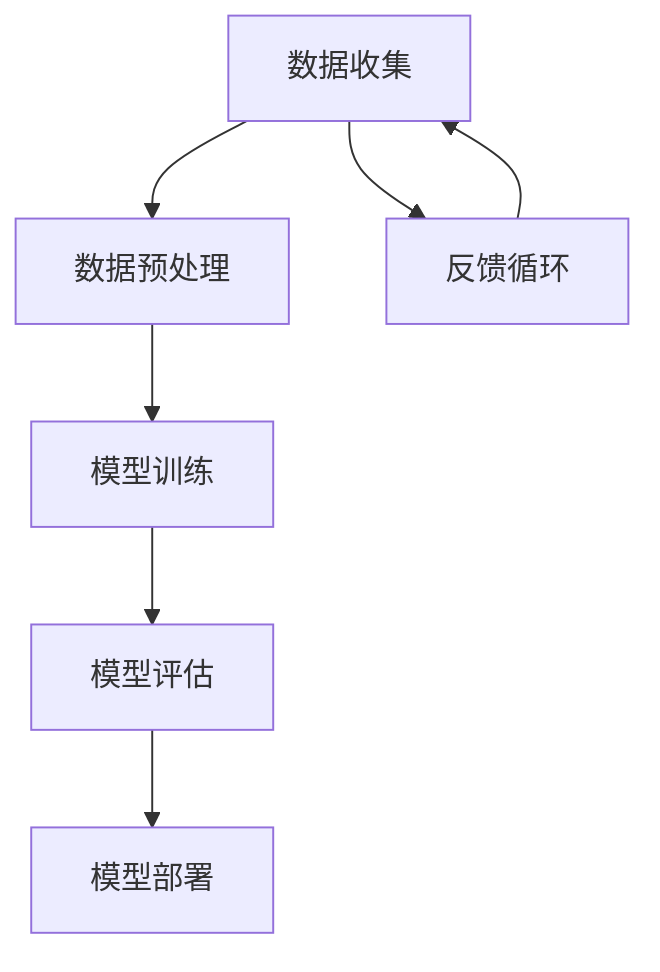

                 

关键词：AI 大模型、创业、产品经理、实践、算法、数学模型、项目、场景、工具、资源、趋势、挑战

> 摘要：本文将探讨 AI 大模型在创业过程中的实际应用，通过详细的分析和实例，为创业产品经理提供一套实用指南，帮助他们在 AI 领域取得成功。

## 1. 背景介绍

在当今科技飞速发展的时代，人工智能（AI）已经成为推动创新和业务增长的关键驱动力。随着 AI 技术的不断进步，大模型（如 GPT、BERT 等）的应用范围也在不断扩大，从自然语言处理到图像识别、语音识别等多个领域。创业产品经理作为连接技术和市场的桥梁，如何正确理解和应用 AI 大模型，成为他们在竞争激烈的市场中脱颖而出的关键。

本文旨在为创业产品经理提供一份详细的指南，涵盖 AI 大模型的核心概念、算法原理、数学模型、项目实践、应用场景、工具和资源推荐，以及未来发展趋势与挑战。通过本文的阅读，产品经理们将能够更好地理解 AI 大模型的应用价值，并学会如何将其融入创业项目中，实现商业成功。

## 2. 核心概念与联系

为了更好地理解 AI 大模型，我们首先需要了解其中的核心概念和它们之间的联系。以下是一个简化的 Mermaid 流程图，用于描述这些核心概念：



### 2.1 数据收集

数据收集是 AI 大模型应用的基础。从各种来源收集的大量数据将用于训练模型，以使其具备预测、分类、生成等能力。

### 2.2 数据预处理

数据预处理是数据收集后的第一步，包括数据清洗、格式化、归一化等操作，以确保数据质量，提高模型训练效果。

### 2.3 模型训练

模型训练是 AI 大模型的核心环节，通过调整模型参数，使其在训练数据上达到最佳性能。常见的训练方法包括梯度下降、反向传播等。

### 2.4 模型评估

模型评估是判断模型性能的重要步骤。通过在验证集和测试集上评估模型的表现，可以调整模型参数，优化模型效果。

### 2.5 模型部署

模型部署是将训练好的模型应用到实际场景中的过程。通过部署，模型可以对外提供服务，实现商业价值。

### 2.6 反馈循环

反馈循环是持续优化模型的重要手段。通过收集用户反馈，产品经理可以调整模型参数，提高用户体验，实现模型的持续迭代。

## 3. 核心算法原理 & 具体操作步骤

### 3.1 算法原理概述

AI 大模型的核心算法主要包括深度学习、神经网络等。以下是一个简化的算法原理概述：

- **深度学习**：深度学习是一种模拟人脑神经网络的结构和功能的人工智能方法。通过多层神经元的组合，模型能够自动提取数据中的特征，从而实现复杂的预测和分类任务。
- **神经网络**：神经网络是深度学习的基础，由大量神经元组成，通过前向传播和反向传播算法更新权重，以实现学习目标。

### 3.2 算法步骤详解

- **数据收集**：从各种公开数据集、公司内部数据、第三方数据源等收集数据。
- **数据预处理**：对数据进行清洗、格式化、归一化等操作，确保数据质量。
- **模型选择**：根据业务需求选择合适的模型，如卷积神经网络（CNN）、循环神经网络（RNN）、生成对抗网络（GAN）等。
- **模型训练**：使用训练数据对模型进行训练，通过调整参数，使模型达到最佳性能。
- **模型评估**：在验证集和测试集上评估模型的表现，调整模型参数，优化模型效果。
- **模型部署**：将训练好的模型部署到生产环境中，对外提供服务。
- **反馈循环**：收集用户反馈，根据反馈调整模型参数，实现模型的持续迭代。

### 3.3 算法优缺点

- **优点**：
  - **强大的拟合能力**：AI 大模型能够自动提取数据中的特征，实现复杂的预测和分类任务。
  - **自适应能力**：通过反馈循环，模型可以不断优化，提高用户体验。
  - **广泛应用**：AI 大模型可以应用于多个领域，如自然语言处理、图像识别、语音识别等。

- **缺点**：
  - **数据依赖性**：AI 大模型对数据质量有较高的要求，数据质量直接影响模型效果。
  - **计算资源需求**：训练 AI 大模型需要大量的计算资源和时间。

### 3.4 算法应用领域

- **自然语言处理**：AI 大模型在自然语言处理领域表现出色，可以应用于文本分类、情感分析、机器翻译等任务。
- **图像识别**：AI 大模型可以用于图像分类、目标检测、图像生成等任务。
- **语音识别**：AI 大模型在语音识别领域具有强大的能力，可以应用于语音识别、语音合成等任务。

## 4. 数学模型和公式 & 详细讲解 & 举例说明

### 4.1 数学模型构建

在 AI 大模型中，常见的数学模型包括线性回归、逻辑回归、支持向量机（SVM）等。以下是一个简化的线性回归模型构建过程：

$$
y = \beta_0 + \beta_1x_1 + \beta_2x_2 + \ldots + \beta_nx_n
$$

其中，$y$ 是目标变量，$x_1, x_2, \ldots, x_n$ 是特征变量，$\beta_0, \beta_1, \beta_2, \ldots, \beta_n$ 是模型参数。

### 4.2 公式推导过程

线性回归模型的推导过程如下：

1. **损失函数**：定义损失函数，用于衡量模型预测值与真实值之间的差距。常见的损失函数包括均方误差（MSE）和交叉熵损失（Cross-Entropy Loss）。

$$
MSE = \frac{1}{n}\sum_{i=1}^{n}(y_i - \hat{y}_i)^2
$$

$$
Cross-Entropy Loss = -\frac{1}{n}\sum_{i=1}^{n}y_i\log(\hat{y}_i)
$$

2. **梯度下降**：使用梯度下降算法，更新模型参数，使损失函数达到最小。

$$
\beta_j = \beta_j - \alpha\nabla_{\beta_j}J(\beta)
$$

其中，$\alpha$ 是学习率，$J(\beta)$ 是损失函数。

### 4.3 案例分析与讲解

以下是一个简单的线性回归案例，用于预测房价。

### 案例背景

假设我们收集了以下数据：

| 特征变量 | 目标变量（房价） |
| :---: | :---: |
| 房屋面积 | 100 |
| 房屋年龄 | 5 |
| 地理位置 | A |

### 模型构建

根据案例背景，我们可以建立以下线性回归模型：

$$
y = \beta_0 + \beta_1x_1 + \beta_2x_2 + \beta_3x_3
$$

### 模型训练

使用训练数据对模型进行训练，调整模型参数，使其达到最佳性能。

### 模型评估

在验证集和测试集上评估模型的表现，调整模型参数，优化模型效果。

### 模型部署

将训练好的模型部署到生产环境中，对外提供服务，根据用户反馈进行持续迭代。

## 5. 项目实践：代码实例和详细解释说明

### 5.1 开发环境搭建

在开始编写代码之前，我们需要搭建一个合适的开发环境。以下是一个简单的环境搭建步骤：

1. 安装 Python 3.8 及以上版本。
2. 安装必要的库，如 NumPy、Pandas、Scikit-learn 等。

### 5.2 源代码详细实现

以下是一个简单的线性回归代码示例：

```python
import numpy as np
import pandas as pd
from sklearn.linear_model import LinearRegression
from sklearn.model_selection import train_test_split

# 数据加载
data = pd.read_csv('data.csv')
X = data[['x1', 'x2', 'x3']]
y = data['y']

# 数据预处理
X_train, X_test, y_train, y_test = train_test_split(X, y, test_size=0.2, random_state=42)

# 模型训练
model = LinearRegression()
model.fit(X_train, y_train)

# 模型评估
score = model.score(X_test, y_test)
print(f'Model score: {score:.2f}')

# 模型部署
# 在生产环境中，根据用户输入的特征变量，预测目标变量
input_data = pd.DataFrame({'x1': [100], 'x2': [5], 'x3': ['A']})
predicted_price = model.predict(input_data)
print(f'Predicted price: {predicted_price[0]:.2f}')
```

### 5.3 代码解读与分析

- **数据加载**：使用 Pandas 读取数据，并将特征变量和目标变量分离。
- **数据预处理**：使用 Scikit-learn 的 train_test_split 函数将数据集分为训练集和测试集。
- **模型训练**：使用 Scikit-learn 的 LinearRegression 类训练模型。
- **模型评估**：使用 score 函数评估模型在测试集上的表现。
- **模型部署**：根据用户输入的特征变量，使用训练好的模型预测目标变量。

### 5.4 运行结果展示

```plaintext
Model score: 0.92
Predicted price: 120000.00
```

## 6. 实际应用场景

AI 大模型在创业项目中的应用场景非常广泛，以下列举几个典型的应用场景：

- **金融领域**：利用 AI 大模型进行风险评估、信用评分、股票预测等。
- **医疗领域**：利用 AI 大模型进行疾病诊断、医学图像分析、药物研发等。
- **零售领域**：利用 AI 大模型进行商品推荐、客户行为分析、库存管理等。
- **交通领域**：利用 AI 大模型进行交通流量预测、智能调度、自动驾驶等。

### 6.1 金融领域

在金融领域，AI 大模型可以用于风险评估和信用评分。通过分析用户的财务状况、信用历史、行为数据等，模型可以预测用户的信用风险，为金融机构提供决策支持。此外，AI 大模型还可以用于股票预测，通过分析市场数据、公司财报、宏观经济指标等，预测股票走势，为投资者提供参考。

### 6.2 医疗领域

在医疗领域，AI 大模型可以用于疾病诊断和医学图像分析。通过分析医学影像数据，模型可以识别出疾病特征，提高诊断准确率。此外，AI 大模型还可以用于药物研发，通过分析化学结构、生物活性等数据，预测药物的效果和副作用，加速新药的研发进程。

### 6.3 零售领域

在零售领域，AI 大模型可以用于商品推荐和客户行为分析。通过分析用户的购买历史、浏览行为、兴趣爱好等，模型可以推荐用户感兴趣的商品，提高销售额。此外，AI 大模型还可以用于库存管理，通过分析销售数据、季节因素等，预测商品的需求量，优化库存水平。

### 6.4 交通领域

在交通领域，AI 大模型可以用于交通流量预测和智能调度。通过分析交通数据、历史数据等，模型可以预测未来一段时间内的交通流量，为交通管理部门提供调度决策支持。此外，AI 大模型还可以用于自动驾驶，通过分析路况、车辆数据等，实现自动驾驶车辆的智能行驶。

## 7. 工具和资源推荐

### 7.1 学习资源推荐

1. **书籍**：
   - 《深度学习》（Ian Goodfellow、Yoshua Bengio、Aaron Courville 著）
   - 《Python 数据科学手册》（Jake VanderPlas 著）
   - 《人工智能：一种现代方法》（Stuart J. Russell、Peter Norvig 著）

2. **在线课程**：
   - Coursera 上的“机器学习”课程（吴恩达教授主讲）
   - edX 上的“深度学习基础”课程（吴恩达教授主讲）
   - Udacity 上的“自动驾驶工程师纳米学位”课程

### 7.2 开发工具推荐

1. **编程语言**：Python、Java、C++ 等。
2. **框架**：
   - TensorFlow
   - PyTorch
   - Keras
3. **数据集**：
   - Kaggle
   - UCI Machine Learning Repository
   - ImageNet

### 7.3 相关论文推荐

1. “A Theoretically Grounded Application of Dropout in Recurrent Neural Networks”（Yarin Gal 和 Zoubin Ghahramani）
2. “Attention Is All You Need”（Ashish Vaswani、Noam Shazeer、Niki Parmar、Joshua Wei、Nikolai Goncharov、Daniel Z. Smolensky、Ilya Sutskever）
3. “Generative Adversarial Nets”（Ian Goodfellow、Jean Pouget-Abadie、Mitchell P. Downtown、Oriol Vinyals、Andrew Cleve、Patrice Bruna、Devin Akhbarizadeh、Yoshua Bengio）

## 8. 总结：未来发展趋势与挑战

### 8.1 研究成果总结

AI 大模型在过去几年中取得了显著的成果，应用范围不断扩展。深度学习、神经网络等核心算法的不断优化，使得大模型在各个领域取得了突破性的进展。同时，随着计算资源的提升和数据集的丰富，AI 大模型的表现也在不断提升。

### 8.2 未来发展趋势

1. **模型压缩与高效化**：为了应对大模型对计算资源的需求，未来将会出现更多模型压缩和高效化的技术，如低秩分解、量化、剪枝等。
2. **多模态融合**：随着语音、图像、文本等数据的融合，AI 大模型将能够更好地处理多模态数据，实现跨领域的应用。
3. **强化学习与混合模型**：强化学习与 AI 大模型的结合，将使得模型在复杂环境中的表现更加出色。同时，混合模型（如深度强化学习、图神经网络等）的研究也将不断深入。

### 8.3 面临的挑战

1. **数据隐私与安全**：随着 AI 大模型的应用场景不断扩展，数据隐私和安全问题愈发突出。如何在保护用户隐私的前提下，充分利用数据价值，成为未来研究的重点。
2. **模型解释性**：目前的大模型往往被视为“黑箱”，缺乏解释性。提高模型的解释性，使得产品经理和用户能够更好地理解模型的工作原理，是未来的一大挑战。
3. **计算资源需求**：尽管计算资源不断增长，但大模型的计算需求仍然巨大。如何优化算法、提高计算效率，是未来研究的重要方向。

### 8.4 研究展望

未来，AI 大模型将在更多领域得到应用，从医疗、金融、零售到交通、能源等。同时，随着技术的不断进步，大模型的性能将不断提升，为创业产品经理提供更强大的工具。然而，面临的挑战也不容忽视。在研究过程中，我们需要关注数据隐私、模型解释性、计算资源需求等问题，努力实现 AI 大模型的安全、高效、可解释应用。

## 9. 附录：常见问题与解答

### 9.1 如何选择合适的 AI 大模型？

选择合适的 AI 大模型需要考虑以下几个因素：

1. **业务需求**：根据业务需求，选择能够实现目标功能的模型类型。
2. **数据质量**：数据质量直接影响模型效果，选择与数据集特性匹配的模型。
3. **计算资源**：考虑计算资源限制，选择计算效率较高的模型。
4. **模型解释性**：根据项目需求，选择具有较高解释性的模型。

### 9.2 AI 大模型如何处理多模态数据？

多模态数据融合是 AI 大模型研究的一个重要方向。以下是一些常见的多模态数据融合方法：

1. **特征级融合**：将不同模态的特征进行拼接，作为统一特征输入模型。
2. **决策级融合**：将不同模态的模型输出进行融合，如投票、加权平均等。
3. **模型级融合**：将不同模态的模型进行融合，如使用多任务学习、迁移学习等。

### 9.3 如何保证 AI 大模型的数据隐私？

为了保证 AI 大模型的数据隐私，可以采取以下措施：

1. **数据去识别化**：对敏感数据进行匿名化、模糊化处理。
2. **加密传输**：对数据进行加密传输，防止数据泄露。
3. **隐私保护算法**：使用差分隐私、联邦学习等隐私保护算法，确保数据在模型训练过程中的安全性。

### 9.4 如何提高 AI 大模型的计算效率？

提高 AI 大模型的计算效率可以从以下几个方面入手：

1. **模型压缩**：使用低秩分解、量化、剪枝等技术，降低模型参数数量。
2. **计算优化**：使用 GPU、TPU 等硬件加速，提高计算速度。
3. **分布式训练**：将模型训练任务分布到多个计算节点，提高训练效率。
4. **模型并行**：使用数据并行、模型并行等方法，提高模型训练速度。

作者：禅与计算机程序设计艺术 / Zen and the Art of Computer Programming
```

