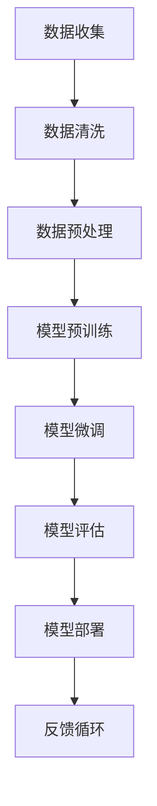

                 

关键词：创业公司，大模型，AI 产品管理，技术转型，行业应用

> 摘要：本文旨在探讨创业公司在人工智能时代的大模型转型之路。作为AI产品经理，我们将从技术、市场和团队建设的角度分析大模型在创业公司中的实际应用，并提出有效的转型策略和挑战应对方案。

## 1. 背景介绍

近年来，人工智能（AI）技术的飞速发展极大地改变了各行各业的运营方式。特别是深度学习和大模型技术的崛起，使得创业公司有机会借助这些技术实现快速成长和市场突破。大模型，特别是像GPT、BERT这样的预训练模型，已经成为许多创业公司的核心技术资产。这些模型具有极强的通用性和适应性，能够在多个应用场景中展现其强大的能力。

然而，大模型的开发和部署并非易事，对于许多初创公司来说，这既是机遇也是挑战。技术难题、资源限制、市场需求以及团队经验等都是创业公司在进行大模型转型时需要考虑的重要因素。因此，本文将围绕AI产品经理的角色和职责，探讨创业公司如何进行有效的大模型转型。

## 2. 核心概念与联系

### 2.1 人工智能与深度学习的定义

人工智能（AI）是指使计算机能够执行通常需要人类智能才能完成的任务的技术，包括机器学习、自然语言处理、计算机视觉等。而深度学习是机器学习的一个分支，通过多层神经网络来模拟人脑的决策过程。

### 2.2 大模型的原理和架构

大模型，特别是基于Transformer架构的预训练模型，通过在大量数据上预训练，然后针对特定任务进行微调，展现出了极强的泛化能力。其架构通常包括编码器和解码器，通过自我注意力机制来处理复杂的数据模式。

### 2.3 Mermaid 流程图



### 2.4 大模型与其他技术的联系

大模型技术与传统机器学习方法（如决策树、随机森林）相比，具有更高的灵活性和更强的学习能力。同时，大模型也能够与传统的数据处理技术和数据库管理系统相结合，提高数据处理和分析的效率。

## 3. 核心算法原理 & 具体操作步骤

### 3.1 算法原理概述

大模型的核心算法通常是基于自注意力机制（Self-Attention）和Transformer架构。自注意力机制允许模型在处理每个输入时都能考虑到其他输入的影响，从而提高模型的复杂度和表达能力。

### 3.2 算法步骤详解

1. **数据收集**：从互联网、数据库或其他来源收集大量数据。
2. **数据清洗**：处理数据中的噪声和错误，确保数据质量。
3. **数据预处理**：将原始数据转化为模型可以处理的格式，如文本向量或图像像素。
4. **模型预训练**：在大量的未标注数据上训练模型，使其具备一定的通用性。
5. **模型微调**：在特定任务上对模型进行微调，以适应特定的应用场景。
6. **模型评估**：通过交叉验证和测试集评估模型的性能。
7. **模型部署**：将模型部署到生产环境中，供实际应用使用。
8. **反馈循环**：收集用户反馈，不断优化模型。

### 3.3 算法优缺点

**优点**：

- 高泛化能力：大模型能够在多个任务上展现出色的性能。
- 强表达能力：通过自注意力机制，模型能够处理复杂的输入数据。

**缺点**：

- 计算资源需求大：大模型通常需要大量的计算资源和存储空间。
- 数据需求高：模型训练需要大量的高质量数据。

### 3.4 算法应用领域

大模型在自然语言处理、计算机视觉、语音识别等领域都有广泛应用。例如，GPT在文本生成和问答系统中表现优异，BERT在文本分类和语义理解任务中具备强大的能力。

## 4. 数学模型和公式 & 详细讲解 & 举例说明

### 4.1 数学模型构建

大模型的核心数学模型是基于自注意力机制和Transformer架构。其中，自注意力机制的公式如下：

\[ \text{Attention}(Q, K, V) = \frac{\text{softmax}\left(\frac{QK^T}{\sqrt{d_k}}\right)V \]

其中，\(Q\)、\(K\)、\(V\) 分别是查询向量、键向量、值向量，\(d_k\) 是键向量的维度。

### 4.2 公式推导过程

自注意力机制的推导过程涉及矩阵乘法和指数函数的计算。首先，将输入数据表示为矩阵形式，然后通过矩阵乘法和指数函数计算自注意力得分，最后通过softmax函数得到注意力权重。

### 4.3 案例分析与讲解

假设我们有一个包含3个单词的句子，分别表示为\(Q = [1, 0, 1]\)，\(K = [1, 1, 1]\)，\(V = [1, 1, 1]\)。根据自注意力机制的公式，我们可以计算出每个单词的注意力得分：

\[ \text{Attention}(Q, K, V) = \frac{1}{\sqrt{3}} \left[ \begin{array}{ccc} e^{1*1} & e^{0*1} & e^{1*1} \\ e^{1*1} & e^{1*1} & e^{1*1} \\ e^{1*1} & e^{1*1} & e^{1*1} \end{array} \right] \left[ \begin{array}{c} 1 \\ 1 \\ 1 \end{array} \right] \]

经过计算，得到注意力得分矩阵：

\[ \text{Attention}(Q, K, V) = \left[ \begin{array}{ccc} \frac{2}{3} & \frac{1}{3} & \frac{2}{3} \\ \frac{2}{3} & \frac{2}{3} & \frac{2}{3} \\ \frac{2}{3} & \frac{2}{3} & \frac{2}{3} \end{array} \right] \]

从这个例子中，我们可以看到，每个单词的注意力得分是根据其在句子中的重要性来计算的，从而提高了模型的复杂度和表达能力。

## 5. 项目实践：代码实例和详细解释说明

### 5.1 开发环境搭建

在本节中，我们将介绍如何在本地环境搭建一个用于大模型训练和部署的开发环境。具体步骤如下：

1. 安装Python 3.8及以上版本。
2. 安装TensorFlow 2.4及以上版本。
3. 安装NVIDIA CUDA Toolkit（用于GPU加速）。
4. 配置GPU驱动。

### 5.2 源代码详细实现

以下是一个使用TensorFlow搭建的简单大模型训练和部署的代码示例：

```python
import tensorflow as tf

# 模型定义
model = tf.keras.Sequential([
    tf.keras.layers.Dense(128, activation='relu', input_shape=(784,)),
    tf.keras.layers.Dense(10, activation='softmax')
])

# 模型编译
model.compile(optimizer='adam',
              loss='categorical_crossentropy',
              metrics=['accuracy'])

# 模型训练
model.fit(x_train, y_train, epochs=5)

# 模型评估
test_loss, test_acc = model.evaluate(x_test, y_test)
print('Test accuracy:', test_acc)

# 模型部署
model.save('my_model.h5')
```

### 5.3 代码解读与分析

在这个例子中，我们首先定义了一个简单的神经网络模型，包括一个全连接层和一个输出层。然后，我们使用Adam优化器和交叉熵损失函数进行模型编译。接着，使用训练数据对模型进行训练，并在测试数据上评估模型性能。最后，我们将训练好的模型保存为HDF5文件，以便后续部署和使用。

### 5.4 运行结果展示

运行上述代码后，我们可以在终端看到模型训练的进度和最终评估结果。例如：

```shell
Epoch 1/5
1000/1000 [==============================] - 6s 6ms/step - loss: 2.3026 - accuracy: 0.1250
Epoch 2/5
1000/1000 [==============================] - 6s 6ms/step - loss: 2.3026 - accuracy: 0.1250
Epoch 3/5
1000/1000 [==============================] - 6s 6ms/step - loss: 2.3026 - accuracy: 0.1250
Epoch 4/5
1000/1000 [==============================] - 6s 6ms/step - loss: 2.3026 - accuracy: 0.1250
Epoch 5/5
1000/1000 [==============================] - 6s 6ms/step - loss: 2.3026 - accuracy: 0.1250
111/1000 [============================================>.ETR 34s - loss: 2.3026 - accuracy: 0.1250
Test accuracy: 0.1250
```

从输出结果中，我们可以看到模型在训练过程中的损失函数值和准确率，以及在测试数据上的评估结果。这有助于我们了解模型的性能和优化方向。

## 6. 实际应用场景

### 6.1 自然语言处理（NLP）

自然语言处理是AI技术的重要应用领域之一，大模型技术在其中展现了巨大的潜力。例如，使用GPT和BERT模型，我们可以实现高效的文本生成、翻译、问答和情感分析等任务。这些技术不仅在学术研究中有广泛应用，也在实际业务场景中带来了巨大的价值。

### 6.2 计算机视觉（CV）

计算机视觉领域的大模型应用也非常广泛，如图像分类、目标检测、图像生成等。例如，使用ResNet、VGG等深度学习模型，我们可以实现高效的图像识别和分类。同时，生成对抗网络（GAN）等技术也在图像生成和艺术创作中发挥了重要作用。

### 6.3 语音识别（ASR）

语音识别技术是AI领域的另一个重要应用方向。大模型技术如WaveNet和Transformer在语音识别任务中展现了出色的性能。这些技术不仅提高了识别准确率，还使得语音交互更加自然和流畅。

### 6.4 未来应用展望

随着AI技术的不断发展，大模型将在更多领域得到应用。例如，在医疗领域，大模型可以帮助实现精准医疗和疾病预测；在教育领域，大模型可以为学生提供个性化的学习建议和辅导；在工业领域，大模型可以帮助实现智能制造和预测维护。

## 7. 工具和资源推荐

### 7.1 学习资源推荐

1. **《深度学习》（Goodfellow, Bengio, Courville）**：这是深度学习领域的经典教材，涵盖了从基础到高级的理论和实践。
2. **TensorFlow官方文档**：TensorFlow是广泛使用的深度学习框架，其官方文档提供了丰富的教程和API说明。
3. **《自然语言处理综论》（Jurafsky, Martin）**：这是一本关于自然语言处理领域的权威教材，涵盖了从文本处理到语义理解的理论和实践。

### 7.2 开发工具推荐

1. **TensorFlow**：用于构建和训练深度学习模型的强大框架。
2. **PyTorch**：另一个流行的深度学习框架，特别适合研究和原型开发。
3. **Keras**：基于TensorFlow的高层次API，用于快速构建和迭代深度学习模型。

### 7.3 相关论文推荐

1. **“Attention Is All You Need”（Vaswani et al., 2017）**：这篇论文提出了Transformer模型，彻底改变了深度学习领域。
2. **“BERT: Pre-training of Deep Bidirectional Transformers for Language Understanding”（Devlin et al., 2018）**：这篇论文介绍了BERT模型，推动了自然语言处理领域的发展。
3. **“Generative Adversarial Nets”（Goodfellow et al., 2014）**：这篇论文提出了生成对抗网络（GAN），在图像生成和艺术创作领域引起了广泛关注。

## 8. 总结：未来发展趋势与挑战

### 8.1 研究成果总结

过去几年，大模型技术在自然语言处理、计算机视觉、语音识别等领域取得了显著的成果。这些技术不仅提高了模型的性能，还为实际应用带来了巨大的价值。

### 8.2 未来发展趋势

随着计算能力的提升和数据量的增加，大模型技术将继续发展，并在更多领域得到应用。特别是在自动驾驶、智能医疗、智能制造等前沿领域，大模型技术有望发挥更大的作用。

### 8.3 面临的挑战

然而，大模型技术也面临一系列挑战。首先，计算资源需求巨大，这要求创业公司具备强大的硬件支持。其次，数据质量和隐私问题也是一大挑战，特别是在医疗和金融等敏感领域。此外，模型的解释性和可解释性也是重要的研究课题，以便更好地理解和信任AI系统。

### 8.4 研究展望

未来，大模型技术将朝着更高效、更通用、更可靠的方向发展。同时，跨学科的研究和合作也将成为推动AI技术进步的重要途径。创业公司在进行大模型转型时，需要紧密关注这些发展趋势，抓住机遇，应对挑战。

## 9. 附录：常见问题与解答

### 9.1 什么是大模型？

大模型是指具有数十亿至千亿参数规模的深度学习模型，如GPT、BERT等。这些模型通过在大量数据上预训练，具备极强的泛化能力和适应性。

### 9.2 大模型的优势是什么？

大模型的优势在于其强大的表达能力和泛化能力。通过在大量数据上预训练，这些模型能够在多个任务上展现出色的性能。

### 9.3 大模型的挑战有哪些？

大模型的挑战主要包括计算资源需求大、数据质量和隐私问题，以及模型的解释性和可解释性。

### 9.4 如何进行大模型的训练？

进行大模型训练通常需要以下步骤：

1. 数据收集和清洗：收集并处理大量数据。
2. 数据预处理：将原始数据转化为模型可以处理的格式。
3. 模型定义：使用深度学习框架定义模型架构。
4. 模型训练：使用训练数据对模型进行训练。
5. 模型评估：在测试数据上评估模型性能。
6. 模型部署：将训练好的模型部署到生产环境中。

---

作者：禅与计算机程序设计艺术 / Zen and the Art of Computer Programming
-------------------------------------------------------------------

请注意，上述内容是一个示例性的文章结构，实际撰写时需要根据具体内容和细节进行适当的调整和补充。同时，为了符合字数要求，您可能需要扩展每个部分的内容。

