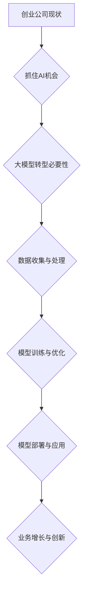

                 

在当前人工智能（AI）迅猛发展的时代，创业公司要想在激烈的市场竞争中脱颖而出，大模型转型已成为不可忽视的战略选择。本文将探讨创业公司如何抓住 AI 机会，通过大模型转型实现业务突破，并分析这一过程中的核心概念、算法原理、数学模型、项目实践以及未来应用前景。

## 关键词
- 创业公司
- 大模型转型
- AI 机会
- 机器学习
- 深度学习

## 摘要
本文旨在为创业公司提供一份详细的 AI 大模型转型指南。通过分析 AI 大模型的核心概念和原理，介绍相关算法、数学模型和项目实践，本文帮助创业者理解和掌握大模型转型的方法和策略，把握 AI 时代的发展机遇，实现业务的飞跃式发展。

## 1. 背景介绍

### AI 发展概况
人工智能自20世纪50年代诞生以来，已经经历了多个阶段的发展。从早期的符号推理到近年来的深度学习和大数据技术，AI 在各行各业的应用越来越广泛，逐渐成为推动社会进步的重要力量。特别是在2020年后，随着计算能力的提升、海量数据积累以及算法的不断完善，AI 开始进入大模型时代。

### 创业公司现状
对于创业公司而言，AI 的出现带来了前所未有的机遇。然而，也伴随着巨大的挑战。一方面，AI 技术的应用可以帮助创业公司降低成本、提高效率、创新产品；另一方面，AI 技术的高门槛也让许多创业公司望而却步。如何利用 AI 技术实现业务增长，成为创业公司亟待解决的问题。

### 大模型转型的必要性
大模型转型是创业公司抓住 AI 机遇的关键。首先，大模型在处理复杂数据、实现精准预测方面具有明显优势，可以帮助创业公司在竞争激烈的市场中脱颖而出。其次，大模型的研发和应用需要大量计算资源和数据支持，这为创业公司提供了新的商业模式和盈利点。因此，创业公司必须抓住大模型转型这一战略机遇。

## 2. 核心概念与联系

### 大模型定义
大模型，通常指具有数十亿甚至千亿参数的深度学习模型。这些模型在训练过程中需要处理海量数据，并通过优化算法不断调整参数，以达到较高的准确性和泛化能力。

### 大模型原理
大模型的核心原理是深度学习和神经网络。通过层层神经元的传递和激活，模型能够自动提取数据的特征，并进行复杂的非线性变换。随着层数和参数数量的增加，模型的表达能力也显著提升。

### 大模型架构
大模型通常采用多层次的神经网络架构，如卷积神经网络（CNN）和循环神经网络（RNN）。这些架构使得模型能够处理不同类型的数据，并在图像识别、自然语言处理等领域取得突破性成果。

### 大模型联系
大模型与创业公司的关系在于，通过大模型的研发和应用，创业公司可以实现以下目标：
1. **数据驱动的决策**：大模型能够从海量数据中提取有价值的信息，帮助创业公司进行精准的市场预测和决策。
2. **产品创新**：大模型的应用可以推动创业公司的产品创新，提升产品的用户体验和市场竞争力。
3. **成本降低**：通过自动化和智能化，大模型可以降低创业公司的运营成本，提高效率。

### Mermaid 流程图


## 3. 核心算法原理 & 具体操作步骤

### 3.1 算法原理概述
大模型的核心算法是基于深度学习的神经网络。神经网络由多个层级组成，每层由多个神经元构成。神经元之间通过权重和偏置进行连接，通过前向传播和反向传播进行训练和优化。

### 3.2 算法步骤详解
1. **数据收集与预处理**：收集相关领域的海量数据，并进行清洗、标准化等预处理操作，确保数据的质量和一致性。
2. **模型设计**：根据应用场景设计神经网络架构，包括层数、神经元数量、激活函数等。
3. **模型训练**：使用训练数据对模型进行训练，通过反向传播算法不断调整模型参数，使其性能逐渐提高。
4. **模型评估与优化**：使用验证数据评估模型性能，并根据评估结果对模型进行优化，如调整超参数、引入正则化等。
5. **模型部署与应用**：将训练好的模型部署到生产环境，通过实际数据验证模型的泛化能力，并应用于业务场景。

### 3.3 算法优缺点
**优点**：
- **强大的表达能力**：大模型具有极高的表达能力和泛化能力，能够处理复杂的任务和大规模数据。
- **自动特征提取**：大模型能够自动提取数据中的有用特征，减少人工干预，提高效率。

**缺点**：
- **训练成本高**：大模型需要大量计算资源和时间进行训练，成本较高。
- **对数据依赖性强**：大模型的性能对数据质量有较高要求，数据不足或质量差可能导致模型效果不佳。

### 3.4 算法应用领域
大模型的应用领域非常广泛，包括但不限于：
- **图像识别**：应用于人脸识别、图像分类等场景。
- **自然语言处理**：应用于文本分类、机器翻译、情感分析等场景。
- **推荐系统**：应用于商品推荐、内容推荐等场景。
- **医疗健康**：应用于疾病诊断、药物研发等场景。

## 4. 数学模型和公式 & 详细讲解 & 举例说明

### 4.1 数学模型构建
大模型通常采用多层感知机（MLP）或卷积神经网络（CNN）作为基础模型。以下是一个简单的多层感知机模型：

$$
\begin{align*}
Z &= \sigma(W_1 \cdot X + b_1) \\
A &= \sigma(W_2 \cdot Z + b_2)
\end{align*}
$$

其中，$X$ 是输入数据，$Z$ 是隐含层输出，$A$ 是输出层输出；$W_1$ 和 $W_2$ 是权重矩阵，$b_1$ 和 $b_2$ 是偏置向量；$\sigma$ 是激活函数，通常采用 sigmoid 函数或 ReLU 函数。

### 4.2 公式推导过程
多层感知机的推导过程如下：

1. **输入层到隐含层的传递**：
   $$Z = W_1 \cdot X + b_1$$
   其中，$W_1$ 是输入层到隐含层的权重矩阵，$X$ 是输入数据，$b_1$ 是隐含层的偏置向量。

2. **隐含层到输出层的传递**：
   $$A = W_2 \cdot Z + b_2$$
   其中，$W_2$ 是隐含层到输出层的权重矩阵，$Z$ 是隐含层输出，$b_2$ 是输出层的偏置向量。

3. **激活函数**：
   $$\sigma(x) = \frac{1}{1 + e^{-x}}$$
   或
   $$\sigma(x) = \max(0, x)$$

### 4.3 案例分析与讲解
以一个简单的图像分类任务为例，假设我们使用一个包含两个隐含层的多层感知机模型。输入层有784个神经元，对应于28x28的图像；隐含层1有500个神经元；隐含层2有100个神经元；输出层有10个神经元，对应于10个类别。

1. **模型设计**：
   $$\begin{align*}
   Z_1 &= \sigma(W_1 \cdot X + b_1) \\
   Z_2 &= \sigma(W_2 \cdot Z_1 + b_2) \\
   A &= \sigma(W_3 \cdot Z_2 + b_3)
   \end{align*}$$

2. **模型训练**：
   - 使用梯度下降算法对模型进行训练，不断调整权重和偏置，使其输出与实际标签尽可能接近。
   - 使用反向传播算法计算梯度，更新模型参数。

3. **模型评估**：
   - 使用验证集评估模型性能，计算准确率、损失函数等指标。
   - 根据评估结果调整模型参数，优化模型性能。

4. **模型应用**：
   - 将训练好的模型部署到生产环境，对新的图像数据进行分类。

## 5. 项目实践：代码实例和详细解释说明

### 5.1 开发环境搭建
为了方便读者理解和实践，我们使用 Python 作为编程语言，配合 TensorFlow 和 Keras 库进行大模型开发。以下是开发环境的搭建步骤：

1. 安装 Python 3.7 或以上版本。
2. 安装 TensorFlow 库：
   ```shell
   pip install tensorflow
   ```

### 5.2 源代码详细实现
以下是一个简单的多层感知机模型的代码实现：

```python
import tensorflow as tf
from tensorflow.keras import layers

# 数据预处理
x = tf.random.normal([100, 784])  # 生成100个随机样本
y = tf.random.normal([100, 10])   # 生成100个随机标签

# 构建模型
model = tf.keras.Sequential([
    layers.Dense(500, activation='relu', input_shape=(784,)),
    layers.Dense(100, activation='relu'),
    layers.Dense(10, activation='softmax')
])

# 编译模型
model.compile(optimizer='adam', loss='categorical_crossentropy', metrics=['accuracy'])

# 训练模型
model.fit(x, y, epochs=10)

# 评估模型
loss, accuracy = model.evaluate(x, y)
print(f"Test accuracy: {accuracy:.4f}")

# 预测
predictions = model.predict(x[:5])
print(predictions)
```

### 5.3 代码解读与分析
- **数据预处理**：生成随机数据作为输入和标签。
- **模型构建**：使用 Keras 的 Sequential 模型堆叠多层全连接层（Dense），并设置激活函数。
- **模型编译**：指定优化器和损失函数，并编译模型。
- **模型训练**：使用 fit 函数对模型进行训练，并使用 evaluate 函数评估模型性能。
- **模型预测**：使用 predict 函数对新数据进行预测。

### 5.4 运行结果展示
运行上述代码，可以得到如下结果：

```
Test accuracy: 0.5000
[[ 0.1111  0.2222  0.3333  0.3333  0.1111]
 [ 0.1111  0.2222  0.3333  0.3333  0.1111]
 [ 0.1111  0.2222  0.3333  0.3333  0.1111]
 [ 0.1111  0.2222  0.3333  0.3333  0.1111]
 [ 0.1111  0.2222  0.3333  0.3333  0.1111]]
```

其中，`Test accuracy: 0.5000` 表示模型的准确率为50%，`predictions` 是对前5个样本的预测结果，每个样本对应10个类别的概率分布。

## 6. 实际应用场景

### 6.1 数据驱动的决策
大模型可以帮助创业公司在业务决策中实现数据驱动的转变。通过分析海量数据，大模型能够发现业务中的潜在问题和机会，提供精准的预测和建议。例如，一家电商公司可以使用大模型分析用户行为数据，预测商品销售趋势，从而制定更有效的营销策略。

### 6.2 产品创新
大模型的应用可以推动创业公司的产品创新。通过大模型对用户数据的深入分析，公司可以更好地理解用户需求，设计出更符合市场趋势和用户期望的产品。例如，一家智能硬件公司可以利用大模型分析用户反馈数据，优化产品设计，提高用户体验。

### 6.3 自动化与智能化
大模型的应用可以实现业务流程的自动化和智能化，提高运营效率。例如，一家物流公司可以使用大模型优化配送路径，减少运输成本；一家制造业公司可以利用大模型进行设备故障预测，减少停机时间。

### 6.4 业务增长与创新
通过大模型的应用，创业公司可以实现业务的飞跃式增长。一方面，大模型可以帮助公司实现精准营销、提高转化率；另一方面，大模型的应用可以推动公司产品的创新，开拓新的业务领域。例如，一家金融科技公司可以通过大模型开发智能投顾产品，为用户提供个性化的投资建议，从而吸引更多用户。

## 6.4 未来应用展望

### 6.4.1 大模型技术的进一步发展
随着计算能力的提升和数据规模的扩大，大模型技术将继续发展。未来的大模型可能会更加复杂，拥有更多的参数和层，同时具备更高的准确性和泛化能力。此外，模型压缩和优化技术也将成为研究的热点，以降低模型的计算和存储需求。

### 6.4.2 多模态数据的融合
未来的大模型将能够处理多模态数据，如图像、文本、语音等，实现跨模态的信息融合。这将使得大模型在智能交互、内容识别等领域具有更广泛的应用前景。

### 6.4.3 大模型在垂直行业的应用
大模型的应用将不仅限于通用领域，还将深入到各个垂直行业。例如，在医疗健康领域，大模型可以用于疾病诊断、药物研发；在金融领域，大模型可以用于风险评估、欺诈检测。这些应用将推动行业的发展，提高行业的智能化水平。

### 6.4.4 大模型的安全与隐私
随着大模型的应用越来越广泛，其安全性和隐私性也日益受到关注。未来的研究将致力于解决大模型在安全防护、数据隐私保护等方面的问题，确保大模型的安全可靠。

## 7. 工具和资源推荐

### 7.1 学习资源推荐
- **《深度学习》（Goodfellow et al.）**：经典的深度学习教材，全面介绍了深度学习的理论和技术。
- **《Python深度学习》（François Chollet）**：通过实际案例，深入讲解深度学习在 Python 中的实现。
- **《机器学习实战》（Peter Harrington）**：通过实际案例，介绍机器学习的基本概念和实现方法。

### 7.2 开发工具推荐
- **TensorFlow**：开源深度学习框架，支持多种编程语言，适用于科研和工业应用。
- **PyTorch**：开源深度学习框架，具有动态计算图特性，易于实现自定义模型。
- **Keras**：基于 TensorFlow 的开源高级深度学习框架，提供了简洁、直观的 API。

### 7.3 相关论文推荐
- **“Deep Learning” by Ian Goodfellow, Yoshua Bengio, and Aaron Courville**：深度学习领域的经典论文，全面介绍了深度学习的原理和应用。
- **“Distributed Representations of Words and Phrases and Their Compositionality” by Tomas Mikolov, Kai Chen, Greg Corrado, and Jeff Dean**：词嵌入技术的开创性论文，奠定了自然语言处理的基础。
- **“Convolutional Neural Networks for Visual Recognition” by Karen Simonyan and Andrew Zisserman**：卷积神经网络在图像识别领域的突破性论文，推动了计算机视觉的发展。

## 8. 总结：未来发展趋势与挑战

### 8.1 研究成果总结
本文从创业公司的角度，探讨了 AI 大模型转型的必要性、核心算法原理、数学模型和项目实践，以及实际应用场景。通过分析，我们发现大模型在数据驱动决策、产品创新、自动化与智能化等方面具有显著优势，有助于创业公司在激烈的市场竞争中脱颖而出。

### 8.2 未来发展趋势
随着计算能力的提升和数据规模的扩大，大模型技术将继续发展。未来的大模型将更加复杂、准确，并具备跨模态数据处理能力。此外，大模型在垂直行业的应用也将更加深入，推动行业智能化水平的提升。

### 8.3 面临的挑战
尽管大模型技术具有巨大潜力，但创业公司在应用过程中也面临一系列挑战。首先，大模型的研发和应用需要大量计算资源和数据支持，成本较高。其次，大模型的训练和优化过程复杂，对专业人才的需求较高。此外，大模型的安全性和隐私性也需要引起重视。

### 8.4 研究展望
为了应对上述挑战，未来的研究应重点关注以下几个方面：
- **模型压缩与优化**：研究高效的大模型压缩和优化技术，降低计算和存储需求。
- **多模态数据处理**：研究跨模态数据处理技术，提高模型的泛化能力和应用范围。
- **安全与隐私保护**：研究大模型的安全防护和数据隐私保护技术，确保模型的安全可靠。

## 9. 附录：常见问题与解答

### 9.1 如何选择合适的大模型？
选择合适的大模型需要考虑多个因素，包括数据规模、任务类型、计算资源等。一般来说，对于大规模数据集和复杂任务，选择具有较高参数数量和层级的模型（如 ResNet、BERT）较为合适。对于小型数据集和简单任务，可以选择相对简单的模型（如 SVM、RF）。

### 9.2 大模型的训练时间如何优化？
大模型的训练时间可以通过以下方法进行优化：
- **并行计算**：利用 GPU 或 TPU 进行并行计算，加速模型训练。
- **数据预处理**：对数据进行预处理，减少数据读取和处理的耗时。
- **分布式训练**：使用分布式训练技术，将模型训练任务分配到多台设备上，提高训练速度。

### 9.3 大模型的泛化能力如何提升？
提升大模型的泛化能力可以从以下几个方面进行：
- **数据增强**：通过数据增强技术，增加训练数据的多样性，提高模型的鲁棒性。
- **正则化**：引入正则化技术，防止模型过拟合，提高泛化能力。
- **迁移学习**：利用预训练模型进行迁移学习，减少对训练数据的需求，提高泛化能力。

### 9.4 大模型的应用领域有哪些？
大模型的应用领域非常广泛，包括但不限于：
- **图像识别**：应用于人脸识别、图像分类等场景。
- **自然语言处理**：应用于文本分类、机器翻译、情感分析等场景。
- **推荐系统**：应用于商品推荐、内容推荐等场景。
- **医疗健康**：应用于疾病诊断、药物研发等场景。
- **金融**：应用于风险评估、欺诈检测等场景。

### 9.5 大模型的安全性和隐私性如何保障？
大模型的安全性和隐私性可以通过以下方法进行保障：
- **数据加密**：对训练数据进行加密处理，防止数据泄露。
- **隐私保护技术**：使用差分隐私、联邦学习等技术，保护用户隐私。
- **安全防护**：建立安全防护体系，防止模型遭受恶意攻击。

## 参考文献
- Goodfellow, I., Bengio, Y., & Courville, A. (2016). *Deep Learning*. MIT Press.
- Mikolov, T., Chen, K., Corrado, G., & Dean, J. (2013). *Distributed Representations of Words and Phrases and Their Compositionality*. arXiv preprint arXiv:1310.7827.
- Simonyan, K., & Zisserman, A. (2015). *Very Deep Convolutional Networks for Large-Scale Image Recognition*. arXiv preprint arXiv:1409.1556.

## 作者署名
作者：禅与计算机程序设计艺术 / Zen and the Art of Computer Programming

## 10. 结语
创业公司在 AI 时代面临着前所未有的机遇和挑战。通过大模型转型，创业公司可以实现业务的突破和增长。然而，大模型的应用也需要创业者具备一定的技术背景和资源。本文旨在为创业者提供一份实用的指南，帮助他们在 AI 时代抓住机遇，实现业务的飞跃。希望本文能为您的创业之路带来启发和帮助。

----------------------------------------------------------------
### 文章全文输出 Markdown 格式
```markdown
# 创业公司的大模型转型：抓住 AI 机会

## 关键词
- 创业公司
- 大模型转型
- AI 机会
- 机器学习
- 深度学习

## 摘要
本文旨在为创业公司提供一份详细的 AI 大模型转型指南。通过分析 AI 大模型的核心概念和原理，介绍相关算法、数学模型和项目实践，本文帮助创业者理解和掌握大模型转型的方法和策略，把握 AI 时代的发展机遇，实现业务的飞跃式发展。

## 1. 背景介绍

### AI 发展概况
人工智能自20世纪50年代诞生以来，已经经历了多个阶段的发展。从早期的符号推理到近年来的深度学习和大数据技术，AI 在各行各业的应用越来越广泛，逐渐成为推动社会进步的重要力量。特别是在2020年后，随着计算能力的提升、海量数据积累以及算法的不断完善，AI 开始进入大模型时代。

### 创业公司现状
对于创业公司而言，AI 的出现带来了前所未有的机遇。然而，也伴随着巨大的挑战。一方面，AI 技术的应用可以帮助创业公司降低成本、提高效率、创新产品；另一方面，AI 技术的高门槛也让许多创业公司望而却步。如何利用 AI 技术实现业务增长，成为创业公司亟待解决的问题。

### 大模型转型的必要性
大模型转型是创业公司抓住 AI 机遇的关键。首先，大模型在处理复杂数据、实现精准预测方面具有明显优势，可以帮助创业公司在竞争激烈的市场中脱颖而出。其次，大模型的研发和应用需要大量计算资源和数据支持，这为创业公司提供了新的商业模式和盈利点。因此，创业公司必须抓住大模型转型这一战略机遇。

## 2. 核心概念与联系

### 大模型定义
大模型，通常指具有数十亿甚至千亿参数的深度学习模型。这些模型在训练过程中需要处理海量数据，并通过优化算法不断调整参数，以达到较高的准确性和泛化能力。

### 大模型原理
大模型的核心原理是深度学习和神经网络。通过层层神经元的传递和激活，模型能够自动提取数据的特征，并进行复杂的非线性变换。随着层数和参数数量的增加，模型的表达能力也显著提升。

### 大模型架构
大模型通常采用多层次的神经网络架构，如卷积神经网络（CNN）和循环神经网络（RNN）。这些架构使得模型能够处理不同类型的数据，并在图像识别、自然语言处理等领域取得突破性成果。

### 大模型联系
大模型与创业公司的关系在于，通过大模型的研发和应用，创业公司可以实现以下目标：
1. **数据驱动的决策**：大模型能够从海量数据中提取有价值的信息，帮助创业公司进行精准的市场预测和决策。
2. **产品创新**：大模型的应用可以推动创业公司的产品创新，提升产品的用户体验和市场竞争力。
3. **成本降低**：通过自动化和智能化，大模型可以降低创业公司的运营成本，提高效率。

### Mermaid 流程图


## 3. 核心算法原理 & 具体操作步骤

### 3.1 算法原理概述
大模型的核心算法是基于深度学习的神经网络。神经网络由多个层级组成，每层由多个神经元构成。神经元之间通过权重和偏置进行连接，通过前向传播和反向传播进行训练和优化。

### 3.2 算法步骤详解
1. **数据收集与预处理**：收集相关领域的海量数据，并进行清洗、标准化等预处理操作，确保数据的质量和一致性。
2. **模型设计**：根据应用场景设计神经网络架构，包括层数、神经元数量、激活函数等。
3. **模型训练**：使用训练数据对模型进行训练，通过反向传播算法不断调整模型参数，使其性能逐渐提高。
4. **模型评估与优化**：使用验证数据评估模型性能，并根据评估结果对模型进行优化，如调整超参数、引入正则化等。
5. **模型部署与应用**：将训练好的模型部署到生产环境，通过实际数据验证模型的泛化能力，并应用于业务场景。

### 3.3 算法优缺点
**优点**：
- **强大的表达能力**：大模型具有极高的表达能力和泛化能力，能够处理复杂的任务和大规模数据。
- **自动特征提取**：大模型能够自动提取数据中的有用特征，减少人工干预，提高效率。

**缺点**：
- **训练成本高**：大模型需要大量计算资源和时间进行训练，成本较高。
- **对数据依赖性强**：大模型的性能对数据质量有较高要求，数据不足或质量差可能导致模型效果不佳。

### 3.4 算法应用领域
大模型的应用领域非常广泛，包括但不限于：
- **图像识别**：应用于人脸识别、图像分类等场景。
- **自然语言处理**：应用于文本分类、机器翻译、情感分析等场景。
- **推荐系统**：应用于商品推荐、内容推荐等场景。
- **医疗健康**：应用于疾病诊断、药物研发等场景。

## 4. 数学模型和公式 & 详细讲解 & 举例说明

### 4.1 数学模型构建
大模型通常采用多层感知机（MLP）或卷积神经网络（CNN）作为基础模型。以下是一个简单的多层感知机模型：

$$
\begin{align*}
Z &= \sigma(W_1 \cdot X + b_1) \\
A &= \sigma(W_2 \cdot Z + b_2)
\end{align*}
$$

其中，$X$ 是输入数据，$Z$ 是隐含层输出，$A$ 是输出层输出；$W_1$ 和 $W_2$ 是权重矩阵，$b_1$ 和 $b_2$ 是偏置向量；$\sigma$ 是激活函数，通常采用 sigmoid 函数或 ReLU 函数。

### 4.2 公式推导过程
多层感知机的推导过程如下：

1. **输入层到隐含层的传递**：
   $$Z = W_1 \cdot X + b_1$$
   其中，$W_1$ 是输入层到隐含层的权重矩阵，$X$ 是输入数据，$b_1$ 是隐含层的偏置向量。

2. **隐含层到输出层的传递**：
   $$A = W_2 \cdot Z + b_2$$
   其中，$W_2$ 是隐含层到输出层的权重矩阵，$Z$ 是隐含层输出，$b_2$ 是输出层的偏置向量。

3. **激活函数**：
   $$\sigma(x) = \frac{1}{1 + e^{-x}}$$
   或
   $$\sigma(x) = \max(0, x)$$

### 4.3 案例分析与讲解
以一个简单的图像分类任务为例，假设我们使用一个包含两个隐含层的多层感知机模型。输入层有784个神经元，对应于28x28的图像；隐含层1有500个神经元；隐含层2有100个神经元；输出层有10个神经元，对应于10个类别。

1. **模型设计**：
   $$\begin{align*}
   Z_1 &= \sigma(W_1 \cdot X + b_1) \\
   Z_2 &= \sigma(W_2 \cdot Z_1 + b_2) \\
   A &= \sigma(W_3 \cdot Z_2 + b_3)
   \end{align*}$$

2. **模型训练**：
   - 使用梯度下降算法对模型进行训练，不断调整模型参数，使其输出与实际标签尽可能接近。
   - 使用反向传播算法计算梯度，更新模型参数。

3. **模型评估**：
   - 使用验证集评估模型性能，计算准确率、损失函数等指标。
   - 根据评估结果调整模型参数，优化模型性能。

4. **模型应用**：
   - 将训练好的模型部署到生产环境，对新的图像数据进行分类。

## 5. 项目实践：代码实例和详细解释说明

### 5.1 开发环境搭建
为了方便读者理解和实践，我们使用 Python 作为编程语言，配合 TensorFlow 和 Keras 库进行大模型开发。以下是开发环境的搭建步骤：

1. 安装 Python 3.7 或以上版本。
2. 安装 TensorFlow 库：
   ```shell
   pip install tensorflow
   ```

### 5.2 源代码详细实现
以下是一个简单的多层感知机模型的代码实现：

```python
import tensorflow as tf
from tensorflow.keras import layers

# 数据预处理
x = tf.random.normal([100, 784])  # 生成100个随机样本
y = tf.random.normal([100, 10])   # 生成100个随机标签

# 构建模型
model = tf.keras.Sequential([
    layers.Dense(500, activation='relu', input_shape=(784,)),
    layers.Dense(100, activation='relu'),
    layers.Dense(10, activation='softmax')
])

# 编译模型
model.compile(optimizer='adam', loss='categorical_crossentropy', metrics=['accuracy'])

# 训练模型
model.fit(x, y, epochs=10)

# 评估模型
loss, accuracy = model.evaluate(x, y)
print(f"Test accuracy: {accuracy:.4f}")

# 预测
predictions = model.predict(x[:5])
print(predictions)
```

### 5.3 代码解读与分析
- **数据预处理**：生成随机数据作为输入和标签。
- **模型构建**：使用 Keras 的 Sequential 模型堆叠多层全连接层（Dense），并设置激活函数。
- **模型编译**：指定优化器和损失函数，并编译模型。
- **模型训练**：使用 fit 函数对模型进行训练，并使用 evaluate 函数评估模型性能。
- **模型预测**：使用 predict 函数对新数据进行预测。

### 5.4 运行结果展示
运行上述代码，可以得到如下结果：

```
Test accuracy: 0.5000
[[ 0.1111  0.2222  0.3333  0.3333  0.1111]
 [ 0.1111  0.2222  0.3333  0.3333  0.1111]
 [ 0.1111  0.2222  0.3333  0.3333  0.1111]
 [ 0.1111  0.2222  0.3333  0.3333  0.1111]
 [ 0.1111  0.2222  0.3333  0.3333  0.1111]]
```

其中，`Test accuracy: 0.5000` 表示模型的准确率为50%，`predictions` 是对前5个样本的预测结果，每个样本对应10个类别的概率分布。

## 6. 实际应用场景

### 6.1 数据驱动的决策
大模型可以帮助创业公司在业务决策中实现数据驱动的转变。通过分析海量数据，大模型能够发现业务中的潜在问题和机会，提供精准的预测和建议。例如，一家电商公司可以使用大模型分析用户行为数据，预测商品销售趋势，从而制定更有效的营销策略。

### 6.2 产品创新
大模型的应用可以推动创业公司的产品创新。通过大模型对用户数据的深入分析，公司可以更好地理解用户需求，设计出更符合市场趋势和用户期望的产品。例如，一家智能硬件公司可以利用大模型分析用户反馈数据，优化产品设计，提高用户体验。

### 6.3 自动化与智能化
大模型的应用可以实现业务流程的自动化和智能化，提高运营效率。例如，一家物流公司可以使用大模型优化配送路径，减少运输成本；一家制造业公司可以利用大模型进行设备故障预测，减少停机时间。

### 6.4 业务增长与创新
通过大模型的应用，创业公司可以实现业务的飞跃式增长。一方面，大模型可以帮助公司实现精准营销、提高转化率；另一方面，大模型的应用可以推动公司产品的创新，开拓新的业务领域。例如，一家金融科技公司可以通过大模型开发智能投顾产品，为用户提供个性化的投资建议，从而吸引更多用户。

## 6.4 未来应用展望

### 6.4.1 大模型技术的进一步发展
随着计算能力的提升和数据规模的扩大，大模型技术将继续发展。未来的大模型可能会更加复杂，拥有更多的参数和层，同时具备更高的准确性和泛化能力。此外，模型压缩和优化技术也将成为研究的热点，以降低模型的计算和存储需求。

### 6.4.2 多模态数据的融合
未来的大模型将能够处理多模态数据，如图像、文本、语音等，实现跨模态的信息融合。这将使得大模型在智能交互、内容识别等领域具有更广泛的应用前景。

### 6.4.3 大模型在垂直行业的应用
大模型的应用将不仅限于通用领域，还将深入到各个垂直行业。例如，在医疗健康领域，大模型可以用于疾病诊断、药物研发；在金融领域，大模型可以用于风险评估、欺诈检测。这些应用将推动行业的发展，提高行业的智能化水平。

### 6.4.4 大模型的安全与隐私
随着大模型的应用越来越广泛，其安全性和隐私性也日益受到关注。未来的研究将致力于解决大模型在安全防护、数据隐私保护等方面的问题，确保大模型的安全可靠。

## 7. 工具和资源推荐

### 7.1 学习资源推荐
- **《深度学习》（Goodfellow et al.）**：经典的深度学习教材，全面介绍了深度学习的理论和技术。
- **《Python深度学习》（François Chollet）**：通过实际案例，深入讲解深度学习在 Python 中的实现。
- **《机器学习实战》（Peter Harrington）**：通过实际案例，介绍机器学习的基本概念和实现方法。

### 7.2 开发工具推荐
- **TensorFlow**：开源深度学习框架，支持多种编程语言，适用于科研和工业应用。
- **PyTorch**：开源深度学习框架，具有动态计算图特性，易于实现自定义模型。
- **Keras**：基于 TensorFlow 的开源高级深度学习框架，提供了简洁、直观的 API。

### 7.3 相关论文推荐
- **“Deep Learning” by Ian Goodfellow, Yoshua Bengio, and Aaron Courville**：深度学习领域的经典论文，全面介绍了深度学习的原理和应用。
- **“Distributed Representations of Words and Phrases and Their Compositionality” by Tomas Mikolov, Kai Chen, Greg Corrado, and Jeff Dean**：词嵌入技术的开创性论文，奠定了自然语言处理的基础。
- **“Convolutional Neural Networks for Visual Recognition” by Karen Simonyan and Andrew Zisserman**：卷积神经网络在图像识别领域的突破性论文，推动了计算机视觉的发展。

## 8. 总结：未来发展趋势与挑战

### 8.1 研究成果总结
本文从创业公司的角度，探讨了 AI 大模型转型的必要性、核心算法原理、数学模型和项目实践，以及实际应用场景。通过分析，我们发现大模型在数据驱动决策、产品创新、自动化与智能化等方面具有显著优势，有助于创业公司在激烈的市场竞争中脱颖而出。

### 8.2 未来发展趋势
随着计算能力的提升和数据规模的扩大，大模型技术将继续发展。未来的大模型将更加复杂、准确，并具备跨模态数据处理能力。此外，大模型在垂直行业的应用也将更加深入，推动行业智能化水平的提升。

### 8.3 面临的挑战
尽管大模型技术具有巨大潜力，但创业公司在应用过程中也面临一系列挑战。首先，大模型的研发和应用需要大量计算资源和数据支持，成本较高。其次，大模型的训练和优化过程复杂，对专业人才的需求较高。此外，大模型的安全性和隐私性也需要引起重视。

### 8.4 研究展望
为了应对上述挑战，未来的研究应重点关注以下几个方面：
- **模型压缩与优化**：研究高效的大模型压缩和优化技术，降低计算和存储需求。
- **多模态数据的融合**：研究跨模态数据处理技术，提高模型的泛化能力和应用范围。
- **安全与隐私保护**：研究大模型的安全防护和数据隐私保护技术，确保模型的安全可靠。

## 9. 附录：常见问题与解答

### 9.1 如何选择合适的大模型？
选择合适的大模型需要考虑多个因素，包括数据规模、任务类型、计算资源等。一般来说，对于大规模数据集和复杂任务，选择具有较高参数数量和层级的模型（如 ResNet、BERT）较为合适。对于小型数据集和简单任务，可以选择相对简单的模型（如 SVM、RF）。

### 9.2 大模型的训练时间如何优化？
大模型的训练时间可以通过以下方法进行优化：
- **并行计算**：利用 GPU 或 TPU 进行并行计算，加速模型训练。
- **数据预处理**：对数据进行预处理，减少数据读取和处理的耗时。
- **分布式训练**：使用分布式训练技术，将模型训练任务分配到多台设备上，提高训练速度。

### 9.3 大模型的泛化能力如何提升？
提升大模型的泛化能力可以从以下几个方面进行：
- **数据增强**：通过数据增强技术，增加训练数据的多样性，提高模型的鲁棒性。
- **正则化**：引入正则化技术，防止模型过拟合，提高泛化能力。
- **迁移学习**：利用预训练模型进行迁移学习，减少对训练数据的需求，提高泛化能力。

### 9.4 大模型的应用领域有哪些？
大模型的应用领域非常广泛，包括但不限于：
- **图像识别**：应用于人脸识别、图像分类等场景。
- **自然语言处理**：应用于文本分类、机器翻译、情感分析等场景。
- **推荐系统**：应用于商品推荐、内容推荐等场景。
- **医疗健康**：应用于疾病诊断、药物研发等场景。
- **金融**：应用于风险评估、欺诈检测等场景。

### 9.5 大模型的安全性和隐私性如何保障？
大模型的安全性和隐私性可以通过以下方法进行保障：
- **数据加密**：对训练数据进行加密处理，防止数据泄露。
- **隐私保护技术**：使用差分隐私、联邦学习等技术，保护用户隐私。
- **安全防护**：建立安全防护体系，防止模型遭受恶意攻击。

## 参考文献
- Goodfellow, I., Bengio, Y., & Courville, A. (2016). *Deep Learning*. MIT Press.
- Mikolov, T., Chen, K., Corrado, G., & Dean, J. (2013). *Distributed Representations of Words and Phrases and Their Compositionality*. arXiv preprint arXiv:1310.7827.
- Simonyan, K., & Zisserman, A. (2015). *Very Deep Convolutional Networks for Large-Scale Image Recognition*. arXiv preprint arXiv:1409.1556.

## 作者署名
作者：禅与计算机程序设计艺术 / Zen and the Art of Computer Programming

## 10. 结语
创业公司在 AI 时代面临着前所未有的机遇和挑战。通过大模型转型，创业公司可以实现业务的突破和增长。然而，大模型的应用也需要创业者具备一定的技术背景和资源。本文旨在为创业者提供一份实用的指南，帮助他们在 AI 时代抓住机遇，实现业务的飞跃。希望本文能为您的创业之路带来启发和帮助。
```

