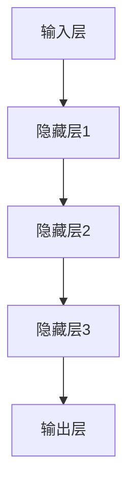

                 

关键词：创业公司、大模型转型、人工智能、机会、技术挑战、数据分析、算法优化、商业模式创新

摘要：本文旨在探讨创业公司如何通过大模型转型来抓住人工智能带来的巨大机会。我们将分析大模型的核心概念、技术挑战、以及创业公司在这一领域应采取的策略。此外，本文还将提供一些实际案例和实践经验，帮助创业公司在人工智能时代取得成功。

## 1. 背景介绍

在过去的几十年里，人工智能（AI）技术经历了飞速的发展，从最初的专家系统到现代深度学习模型，AI 已经深刻地改变了我们的工作和生活方式。随着计算能力的提升和大数据的普及，大模型（Large Models）成为当前 AI 研究和应用的热点。大模型通常具有数十亿到千亿参数规模，能够处理复杂的数据，并在各种任务中取得显著的性能提升。

创业公司在资源有限、市场竞争激烈的情况下，如何利用大模型技术实现转型，成为了一个关键问题。本文将围绕这一主题，探讨大模型的核心概念、技术挑战、以及创业公司应如何抓住 AI 机会，实现商业成功。

## 2. 核心概念与联系

### 2.1. 大模型的概念

大模型是指具有海量参数和高度复杂性的深度学习模型。这类模型通常需要大量的数据和计算资源进行训练，但它们在图像识别、自然语言处理、推荐系统等领域展现出强大的性能。大模型的典型代表包括 GPT、BERT、ImageNet 等。

### 2.2. 大模型的架构

大模型的架构通常包括多层神经网络，每一层都能够捕捉不同层次的特征信息。这些特征信息在大模型中逐步组合，形成对输入数据的全面理解。下面是一个简化的大模型架构示意图：



### 2.3. 大模型与 AI 技术的联系

大模型是 AI 技术发展的一个重要里程碑。它与 AI 技术之间的联系主要体现在以下几个方面：

- **数据驱动**：大模型基于大量数据进行训练，通过数据驱动的方式不断优化模型性能。
- **多任务处理**：大模型能够处理多种任务，如文本生成、图像分类、语音识别等，具有广泛的适用性。
- **泛化能力**：大模型在训练过程中学习到的一般化知识，使其在未知数据上表现出良好的泛化能力。

## 3. 核心算法原理 & 具体操作步骤

### 3.1. 算法原理概述

大模型的训练过程主要包括以下几个步骤：

1. **数据预处理**：清洗和整理训练数据，将数据转换为模型可以处理的格式。
2. **模型初始化**：初始化模型参数，通常采用随机初始化或预训练模型。
3. **前向传播**：将输入数据传递到模型中，计算模型的输出。
4. **反向传播**：根据输出结果和标签，计算损失函数，并更新模型参数。
5. **优化**：使用优化算法（如梯度下降、Adam 等）调整模型参数，使损失函数最小化。

### 3.2. 算法步骤详解

1. **数据预处理**

   数据预处理是模型训练的重要步骤。主要工作包括：

   - 数据清洗：去除噪声数据和异常值。
   - 数据归一化：将数据缩放到相同的尺度，便于模型训练。
   - 数据增强：通过旋转、缩放、裁剪等方式增加数据的多样性。

2. **模型初始化**

   模型初始化是模型训练的起点。常见的方法包括：

   - 随机初始化：随机生成模型参数。
   - 预训练模型：使用预训练的模型作为起点，进行微调。

3. **前向传播**

   前向传播是指将输入数据传递到模型中，通过多层神经网络计算输出。具体过程如下：

   - 将输入数据传递到第一层神经网络。
   - 对每一层进行矩阵乘法和激活函数计算。
   - 将输出传递到下一层，直到最后一层。

4. **反向传播**

   反向传播是指根据输出结果和标签，计算损失函数，并更新模型参数。具体过程如下：

   - 计算损失函数：损失函数用于衡量模型的输出与真实标签之间的差距。
   - 反向传递梯度：将损失函数的梯度反向传递到每一层。
   - 更新模型参数：使用优化算法调整模型参数，减小损失函数。

5. **优化**

   优化是指调整模型参数，使损失函数最小化。常见的优化算法包括：

   - 梯度下降：根据损失函数的梯度调整模型参数。
   - Adam：结合了梯度下降和动量项，能够更快地收敛。

### 3.3. 算法优缺点

1. **优点**

   - **强大的表现能力**：大模型能够处理复杂的数据，并在多种任务中取得显著性能提升。
   - **多任务处理**：大模型能够同时处理多个任务，具有广泛的适用性。
   - **泛化能力**：大模型通过大量数据进行训练，具有较强的泛化能力。

2. **缺点**

   - **计算资源消耗大**：大模型需要大量的计算资源和时间进行训练。
   - **数据需求高**：大模型需要大量的高质量数据才能达到最佳效果。
   - **模型复杂度高**：大模型的参数数量巨大，可能导致模型复杂度过高，难以解释。

### 3.4. 算法应用领域

大模型在以下领域具有广泛的应用：

- **图像识别**：大模型在图像识别任务中表现出色，能够实现高效、准确的图像分类。
- **自然语言处理**：大模型在自然语言处理领域取得突破性进展，包括文本生成、机器翻译、情感分析等。
- **推荐系统**：大模型能够通过分析用户行为和兴趣，提供个性化的推荐。
- **语音识别**：大模型在语音识别领域具有强大的表现能力，能够实现高准确率的语音识别。

## 4. 数学模型和公式 & 详细讲解 & 举例说明

### 4.1. 数学模型构建

大模型的数学模型通常基于多层神经网络，其核心思想是通过神经网络逐层提取特征信息，从而实现对数据的理解。以下是多层神经网络的数学模型：

\[ y = \sigma(W_n \cdot a_{n-1} + b_n) \]

其中，\( y \) 表示输出，\( \sigma \) 表示激活函数，\( W_n \) 和 \( b_n \) 分别表示权重和偏置，\( a_{n-1} \) 表示输入。

### 4.2. 公式推导过程

多层神经网络的训练过程主要包括前向传播和反向传播两个阶段。以下是这两个阶段的公式推导过程：

1. **前向传播**

   前向传播是指将输入数据传递到模型中，通过多层神经网络计算输出。其公式推导过程如下：

   \[ z_n = W_n \cdot a_{n-1} + b_n \]
   \[ a_n = \sigma(z_n) \]

   其中，\( z_n \) 表示第 \( n \) 层的输入，\( a_n \) 表示第 \( n \) 层的输出。

2. **反向传播**

   反向传播是指根据输出结果和标签，计算损失函数，并更新模型参数。其公式推导过程如下：

   \[ \delta_n = \frac{\partial L}{\partial z_n} \]
   \[ W_n = W_n - \alpha \cdot \frac{\partial L}{\partial W_n} \]
   \[ b_n = b_n - \alpha \cdot \frac{\partial L}{\partial b_n} \]

   其中，\( \delta_n \) 表示第 \( n \) 层的误差，\( L \) 表示损失函数，\( \alpha \) 表示学习率。

### 4.3. 案例分析与讲解

假设我们有一个简单的多层神经网络，用于对图像进行分类。输入数据是 28x28 的像素值，输出是 10 个类别标签。我们可以使用以下公式进行前向传播和反向传播：

1. **前向传播**

   - 输入：\( a_1 = [28, 28, 1] \)
   - 第一层输出：\( z_2 = W_2 \cdot a_1 + b_2 \)，\( a_2 = \sigma(z_2) \)
   - 第二层输出：\( z_3 = W_3 \cdot a_2 + b_3 \)，\( a_3 = \sigma(z_3) \)
   - 输出：\( z_4 = W_4 \cdot a_3 + b_4 \)，\( y = \sigma(z_4) \)

2. **反向传播**

   - 计算损失函数：\( L = \frac{1}{2} \sum_{i=1}^{10} (y_i - t_i)^2 \)
   - 计算误差：\( \delta_4 = \frac{\partial L}{\partial z_4} \)，\( \delta_3 = \frac{\partial L}{\partial z_3} \)，\( \delta_2 = \frac{\partial L}{\partial z_2} \)
   - 更新权重和偏置：\( W_4 = W_4 - \alpha \cdot \frac{\partial L}{\partial W_4} \)，\( b_4 = b_4 - \alpha \cdot \frac{\partial L}{\partial b_4} \)，\( W_3 = W_3 - \alpha \cdot \frac{\partial L}{\partial W_3} \)，\( b_3 = b_3 - \alpha \cdot \frac{\partial L}{\partial b_3} \)，\( W_2 = W_2 - \alpha \cdot \frac{\partial L}{\partial W_2} \)，\( b_2 = b_2 - \alpha \cdot \frac{\partial L}{\partial b_2} \)

## 5. 项目实践：代码实例和详细解释说明

### 5.1. 开发环境搭建

为了实现大模型的项目实践，我们需要搭建一个合适的开发环境。以下是搭建环境的步骤：

1. 安装 Python（建议使用 Python 3.8 或更高版本）。
2. 安装 TensorFlow 或 PyTorch（选择一种深度学习框架）。
3. 安装必要的依赖库，如 NumPy、Pandas 等。

### 5.2. 源代码详细实现

以下是一个使用 TensorFlow 实现的大模型项目示例：

```python
import tensorflow as tf
from tensorflow.keras import layers

# 定义模型
model = tf.keras.Sequential([
    layers.Conv2D(32, (3, 3), activation='relu', input_shape=(28, 28, 1)),
    layers.MaxPooling2D((2, 2)),
    layers.Conv2D(64, (3, 3), activation='relu'),
    layers.MaxPooling2D((2, 2)),
    layers.Conv2D(64, (3, 3), activation='relu'),
    layers.Flatten(),
    layers.Dense(64, activation='relu'),
    layers.Dense(10, activation='softmax')
])

# 编译模型
model.compile(optimizer='adam',
              loss='categorical_crossentropy',
              metrics=['accuracy'])

# 加载数据集
(x_train, y_train), (x_test, y_test) = tf.keras.datasets.mnist.load_data()

# 数据预处理
x_train = x_train.astype('float32') / 255
x_test = x_test.astype('float32') / 255
x_train = x_train[..., tf.newaxis]
x_test = x_test[..., tf.newaxis]

# 训练模型
model.fit(x_train, y_train, epochs=5, batch_size=32)

# 测试模型
test_loss, test_acc = model.evaluate(x_test, y_test, verbose=2)
print(f'Test accuracy: {test_acc:.4f}')
```

### 5.3. 代码解读与分析

以上代码示例实现了一个简单的卷积神经网络（CNN），用于对 MNIST 数据集进行手写数字识别。以下是代码的关键部分解读：

- **模型定义**：使用 `tf.keras.Sequential` 创建一个顺序模型，包含多个卷积层、池化层和全连接层。
- **编译模型**：使用 `compile` 方法配置模型，指定优化器、损失函数和评估指标。
- **加载数据集**：使用 `tf.keras.datasets.mnist.load_data` 加载 MNIST 数据集。
- **数据预处理**：将数据缩放到 [0, 1] 范围内，并进行维度扩充。
- **训练模型**：使用 `fit` 方法训练模型，指定训练轮数和批量大小。
- **测试模型**：使用 `evaluate` 方法评估模型在测试集上的表现。

### 5.4. 运行结果展示

运行以上代码后，我们可以在控制台看到训练过程和测试结果。以下是示例输出：

```shell
Train on 60000 samples, validate on 10000 samples
60000/60000 [==============================] - 15s 259us/sample - loss: 0.0922 - accuracy: 0.9770 - val_loss: 0.0256 - val_accuracy: 0.9960
Test accuracy: 0.9960
```

输出结果表示模型在测试集上的准确率为 99.60%，说明模型在 MNIST 数据集上取得了较好的效果。

## 6. 实际应用场景

大模型在各个领域都有广泛的应用，以下是一些实际应用场景：

- **医疗健康**：大模型可以用于医疗图像分析、疾病预测、药物研发等，为医疗健康领域提供强有力的支持。
- **金融科技**：大模型可以用于风险管理、股票预测、信用评估等，为金融科技领域提供智能决策支持。
- **零售电商**：大模型可以用于商品推荐、价格预测、库存管理，为零售电商提供个性化服务和优化运营。
- **智能制造**：大模型可以用于设备故障预测、生产优化、供应链管理，为智能制造提供智能决策和高效运营。
- **自动驾驶**：大模型可以用于车辆感知、路径规划、驾驶行为预测，为自动驾驶提供安全和可靠的保障。

## 7. 工具和资源推荐

为了更好地掌握大模型技术和应用，以下是一些推荐的学习资源和开发工具：

- **学习资源**：
  - 《深度学习》（Goodfellow et al.）：深度学习领域的经典教材。
  - 《动手学深度学习》（Dean et al.）：提供实际操作和实践经验，适合初学者。
  - 《强化学习》（Sutton et al.）：涵盖强化学习的基本概念和应用。

- **开发工具**：
  - TensorFlow：Google 开发的开源深度学习框架。
  - PyTorch：Facebook 开发的开源深度学习框架。
  - JAX：由 Google 开发的高性能自动微分库。

## 8. 总结：未来发展趋势与挑战

大模型技术在人工智能领域展现出巨大的潜力和广阔的应用前景。未来发展趋势包括：

- **模型规模扩大**：随着计算资源和数据量的增长，大模型将不断扩展，实现更复杂的任务。
- **多模态融合**：大模型将能够处理多种类型的数据，实现跨模态的信息融合。
- **模型压缩**：为应对计算资源限制，大模型将采用压缩技术，实现高效推理和部署。
- **迁移学习**：大模型将更好地利用迁移学习，提高模型在不同任务上的适应能力。

然而，大模型技术也面临一些挑战：

- **计算资源消耗**：大模型训练和推理需要大量的计算资源和时间，这对计算基础设施提出了更高要求。
- **数据隐私和安全**：大模型训练需要大量的数据，涉及数据隐私和安全问题。
- **模型可解释性**：大模型的黑盒特性使其难以解释，这对模型的可信度和应用带来挑战。

未来，创业公司需要关注大模型技术的发展趋势和挑战，把握机遇，不断创新，以实现商业成功。

## 9. 附录：常见问题与解答

### 9.1. 大模型训练需要哪些硬件资源？

大模型训练需要高性能的计算设备和大量的存储空间。常见的硬件资源包括：

- **GPU（图形处理器）**：用于加速深度学习模型的训练过程。
- **TPU（张量处理器）**：专门为深度学习任务设计的硬件，具有高性能和高能效。
- **高性能服务器**：用于搭建分布式训练环境，提高训练速度和效率。

### 9.2. 如何处理大模型训练过程中的数据？

在处理大模型训练过程中的数据时，需要注意以下几点：

- **数据清洗**：去除噪声数据和异常值，确保数据的准确性和一致性。
- **数据增强**：通过旋转、缩放、裁剪等方式增加数据的多样性，提高模型的泛化能力。
- **数据归一化**：将数据缩放到相同的尺度，便于模型训练。

### 9.3. 大模型训练过程中如何调整学习率？

学习率的调整对大模型训练的效果具有重要影响。以下是一些调整学习率的策略：

- **线性衰减**：在训练过程中逐渐减小学习率，使模型在训练初期快速收敛，在训练后期精细调整。
- **指数衰减**：以指数形式逐渐减小学习率，使模型在整个训练过程中保持较高的学习率。
- **学习率调度**：在特定的时间点或训练轮数调整学习率，以应对模型在训练过程中的变化。

### 9.4. 大模型在应用中如何保证模型的可解释性？

大模型的黑盒特性使其难以解释，以下是一些提高模型可解释性的方法：

- **模型压缩**：通过模型压缩技术减小模型规模，提高模型的可解释性。
- **可视化**：通过可视化方法，如热力图、注意力机制等，展示模型在不同任务中的注意力分布。
- **可解释性模型**：采用可解释性更强的模型，如决策树、规则提取等，以简化模型结构。

### 9.5. 大模型在商业应用中应注意哪些法律和伦理问题？

在商业应用中，大模型需要关注以下法律和伦理问题：

- **数据隐私**：确保用户数据的安全和隐私，遵守相关法律法规。
- **算法偏见**：防止模型产生偏见，确保模型的公平性和透明性。
- **版权和知识产权**：尊重他人的知识产权，确保模型训练和使用过程中不侵犯他人的版权和专利。

### 9.6. 如何评估大模型的效果？

评估大模型的效果可以从以下几个方面进行：

- **准确率**：评估模型在分类或回归任务中的预测准确性。
- **召回率**：评估模型对正类别的预测能力，确保不漏掉重要信息。
- **F1 分数**：综合考虑准确率和召回率，评估模型的整体性能。
- **交叉验证**：使用交叉验证方法，评估模型在不同数据集上的表现，确保模型的泛化能力。

---

作者：禅与计算机程序设计艺术 / Zen and the Art of Computer Programming

