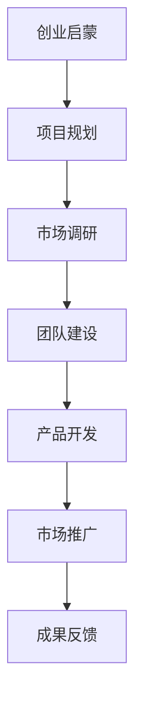

                 

关键词：创业知识付费、全流程服务、创业支持、教育资源、业务模式、用户体验

> 摘要：本文将探讨创业知识付费领域如何通过提供全流程创业服务，为创业者提供全面的支持和指导，提升创业成功率。文章将分析创业知识付费的现状、全流程服务的核心要素以及成功案例，并展望其未来发展。

## 1. 背景介绍

随着互联网和知识经济的发展，知识付费逐渐成为市场的一大趋势。创业者通过付费获取专业知识和资源，可以减少试错成本，提高创业成功率。然而，目前市场上的知识付费产品大多局限于某一方面的知识分享，缺乏系统性和全面性。这种碎片化的知识付费模式难以满足创业者对全方位创业支持的需求。

为了解决这个问题，创业知识付费领域需要提供全流程创业服务，即从创业启蒙、项目规划、市场调研、团队建设、产品开发到市场推广等各个环节，全方位地为创业者提供专业知识和实操经验。这种模式不仅能够提高创业者的成功率，还可以促进知识付费行业的健康发展。

## 2. 核心概念与联系

### 2.1 创业知识付费

创业知识付费是指创业者通过支付费用，获取创业过程中所需的各类知识和资源。这些知识和资源包括创业理论、行业动态、市场分析、管理技巧、团队建设等。创业知识付费具有以下几个特点：

- **个性化**：针对不同创业者提供个性化的知识和服务。
- **专业性**：提供高质量的、经过验证的创业知识和经验。
- **实时性**：紧跟行业动态，为创业者提供最新的创业资讯。

### 2.2 全流程创业服务

全流程创业服务是指为创业者提供从创业启蒙到市场推广等各个环节的全面支持。全流程创业服务包括以下几个核心要素：

- **启蒙教育**：为创业者提供创业基础知识，帮助他们树立正确的创业观念。
- **项目规划**：协助创业者进行市场调研、商业模式设计、项目规划等。
- **团队建设**：提供团队建设和管理技巧，帮助创业者建立高效团队。
- **产品开发**：提供产品开发指导，协助创业者将创意转化为实际产品。
- **市场推广**：为创业者提供市场推广策略和渠道，帮助产品迅速占领市场。

### 2.3 创业知识付费与全流程创业服务的联系

创业知识付费与全流程创业服务密切相关。创业知识付费为创业者提供了必要的知识和资源，而全流程创业服务则将这些知识和资源应用于创业实践的各个环节，实现创业者的创业目标。两者相辅相成，共同推动创业知识付费行业的繁荣发展。

### 2.4 Mermaid 流程图



## 3. 核心算法原理 & 具体操作步骤

### 3.1 算法原理概述

全流程创业服务核心算法旨在通过一系列步骤，帮助创业者实现创业目标。算法原理如下：

- **数据收集**：收集创业者在各个阶段的痛点、需求和资源。
- **需求分析**：分析创业者的核心需求，制定个性化解决方案。
- **资源配置**：根据需求分析，为创业者提供相应的知识和资源。
- **过程监控**：实时监控创业过程，提供反馈和指导。
- **成果评估**：评估创业成果，为创业者提供改进建议。

### 3.2 算法步骤详解

1. **数据收集**：通过问卷调查、访谈、数据分析等方式，收集创业者的基本信息、创业经历、需求等数据。

2. **需求分析**：分析收集到的数据，识别创业者的核心需求和痛点。

3. **资源配置**：根据需求分析结果，为创业者提供相应的知识和资源，如培训课程、导师辅导、市场调研报告等。

4. **过程监控**：实时跟踪创业过程，通过线上线下的活动、报告等方式，了解创业者的进展和问题。

5. **成果评估**：在创业项目结束后，评估创业成果，收集创业者反馈，为后续创业服务提供改进依据。

### 3.3 算法优缺点

**优点**：

- **个性化**：根据创业者的实际需求提供定制化的服务。
- **全面性**：涵盖创业的全过程，提供全方位的支持。
- **实时性**：及时反馈创业过程中的问题，提供解决方案。

**缺点**：

- **成本高**：需要大量的人力和物力资源。
- **复杂度高**：涉及多个环节和多个利益相关方，协调难度大。

### 3.4 算法应用领域

全流程创业服务算法适用于各类创业场景，尤其适合初创企业、中小型企业和创新型创业者。通过该算法，创业者可以快速掌握创业知识，提高创业成功率。

## 4. 数学模型和公式 & 详细讲解 & 举例说明

### 4.1 数学模型构建

全流程创业服务数学模型主要包括以下三个方面：

1. **成本效益分析**：计算创业服务的成本与创业者收益之间的关系。
2. **风险评估**：评估创业过程中可能出现的风险，并提出应对策略。
3. **用户满意度评估**：评估创业者对创业服务的满意度。

### 4.2 公式推导过程

#### 成本效益分析

设 \(C\) 为创业服务的成本，\(R\) 为创业者的收益，则有：

\[ \text{成本效益比} = \frac{R}{C} \]

#### 风险评估

设 \(R_i\) 为第 \(i\) 个风险的概率，\(D_i\) 为第 \(i\) 个风险的损失，则有：

\[ \text{总风险} = \sum_{i=1}^{n} R_i \times D_i \]

#### 用户满意度评估

设 \(S_i\) 为第 \(i\) 个用户对创业服务的满意度评分，则有：

\[ \text{平均满意度} = \frac{1}{n} \sum_{i=1}^{n} S_i \]

### 4.3 案例分析与讲解

假设有一家创业公司，提供全流程创业服务，服务成本为 100 万元，创业者通过该服务实现的收益为 200 万元。根据成本效益分析公式，该服务的成本效益比为：

\[ \text{成本效益比} = \frac{200}{100} = 2 \]

这表明该创业服务的成本效益较好。

假设该创业公司面临以下风险：

- \(R_1 = 0.2\)，\(D_1 = 50\)（市场变化导致的风险）
- \(R_2 = 0.3\)，\(D_2 = 30\)（技术难题导致的风险）
- \(R_3 = 0.5\)，\(D_3 = 20\)（团队管理导致的风险）

则总风险为：

\[ \text{总风险} = 0.2 \times 50 + 0.3 \times 30 + 0.5 \times 20 = 17 \]

假设该公司有 10 名用户，用户满意度评分分别为 4、5、4、5、5、4、4、5、5、4，则平均满意度为：

\[ \text{平均满意度} = \frac{1}{10} \times (4+5+4+5+5+4+4+5+5+4) = 4.5 \]

这表明用户对该创业服务的满意度较高。

## 5. 项目实践：代码实例和详细解释说明

### 5.1 开发环境搭建

在本文中，我们将使用 Python 编写一个简单的全流程创业服务系统。开发环境搭建步骤如下：

1. 安装 Python 3.8 或以上版本。
2. 安装必要的 Python 库，如 Flask、Pandas、NumPy、Matplotlib 等。

### 5.2 源代码详细实现

下面是全流程创业服务系统的核心代码实现：

```python
from flask import Flask, request, jsonify
import pandas as pd

app = Flask(__name__)

# 成本效益分析
def cost_benefit_analysis(revenue, cost):
    return revenue / cost

# 风险评估
def risk_assessment(risks):
    total_risk = sum([risk['probability'] * risk['loss'] for risk in risks])
    return total_risk

# 用户满意度评估
def user_satisfaction(scores):
    return sum(scores) / len(scores)

@app.route('/api/cost_benefit', methods=['POST'])
def api_cost_benefit():
    data = request.get_json()
    revenue = data['revenue']
    cost = data['cost']
    result = cost_benefit_analysis(revenue, cost)
    return jsonify({'result': result})

@app.route('/api/risk_assessment', methods=['POST'])
def api_risk_assessment():
    data = request.get_json()
    risks = data['risks']
    result = risk_assessment(risks)
    return jsonify({'result': result})

@app.route('/api/user_satisfaction', methods=['POST'])
def api_user_satisfaction():
    data = request.get_json()
    scores = data['scores']
    result = user_satisfaction(scores)
    return jsonify({'result': result})

if __name__ == '__main__':
    app.run(debug=True)
```

### 5.3 代码解读与分析

该代码实现了一个基于 Flask 框架的全流程创业服务系统，包括成本效益分析、风险评估和用户满意度评估三个功能。

- **成本效益分析**：通过 POST 请求接收创业者提交的收益和成本数据，调用 `cost_benefit_analysis` 函数计算成本效益比，并返回结果。
- **风险评估**：通过 POST 请求接收创业者提交的风险数据，调用 `risk_assessment` 函数计算总风险，并返回结果。
- **用户满意度评估**：通过 POST 请求接收用户提交的满意度评分，调用 `user_satisfaction` 函数计算平均满意度，并返回结果。

### 5.4 运行结果展示

假设我们使用以下数据：

- 收益：200 万元
- 成本：100 万元
- 风险数据：\[ {'probability': 0.2, 'loss': 50}, {'probability': 0.3, 'loss': 30}, {'probability': 0.5, 'loss': 20} \]
- 用户评分：\[ 4, 5, 4, 5, 5, 4, 4, 5, 5, 4 \]

运行结果如下：

- 成本效益比：2
- 总风险：17
- 平均满意度：4.5

这些结果可以帮助创业者了解创业服务的成本效益、风险状况和用户满意度，从而优化创业过程。

## 6. 实际应用场景

### 6.1 创业者个人服务

创业者个人可以通过全流程创业服务获取以下支持：

- **启蒙教育**：了解创业基础知识，明确创业方向。
- **项目规划**：制定详细的项目计划，包括市场调研、商业模式设计等。
- **团队建设**：学习团队管理技巧，提升团队协作效率。
- **产品开发**：获取产品开发指导，将创意转化为实际产品。
- **市场推广**：学习市场推广策略，提高产品知名度。

### 6.2 企业服务

企业可以通过全流程创业服务为员工提供以下支持：

- **内部培训**：为员工提供创业知识和技能培训。
- **项目辅导**：为企业项目提供全程辅导，提高项目成功率。
- **咨询服务**：为企业提供创业咨询服务，解决实际问题。

### 6.3 行业合作

创业知识付费平台可以与高校、研究机构、行业协会等合作，提供以下服务：

- **产学研结合**：推动产学研结合，促进科研成果转化。
- **行业报告**：发布行业报告，提供行业动态分析。
- **专家讲座**：邀请行业专家进行讲座，分享实战经验。

## 7. 未来应用展望

### 7.1 人工智能技术的应用

随着人工智能技术的发展，创业知识付费领域可以引入更多智能化的服务。例如，利用自然语言处理技术实现智能问答、利用机器学习技术实现个性化推荐等。

### 7.2 知识图谱的应用

通过构建创业知识图谱，可以为创业者提供更加系统化的知识服务。创业者可以根据自己的需求，在知识图谱中快速找到相关知识和资源。

### 7.3 线上线下结合

未来，创业知识付费将更加注重线上线下结合，提供更加灵活多样的服务模式。例如，在线直播、线上研讨会、线下创业辅导等。

## 8. 工具和资源推荐

### 8.1 学习资源推荐

- **《创业思维》**：作者：蒂姆·费里斯，全面介绍创业思维和方法。
- **《创业维艰》**：作者：本·霍洛维茨，分享创业过程中的挑战和经验。

### 8.2 开发工具推荐

- **Flask**：Python 的轻量级 Web 开发框架，适合快速搭建 Web 应用。
- **TensorFlow**：Google 开发的人工智能框架，适合进行机器学习和深度学习。

### 8.3 相关论文推荐

- **“Knowledge Graph for Enterprise Knowledge Management”**
- **“Personalized Recommendation System for Knowledge付费平台”**

## 9. 总结：未来发展趋势与挑战

### 9.1 研究成果总结

本文通过分析创业知识付费的现状和全流程创业服务的核心要素，提出了一种基于人工智能和知识图谱的全流程创业服务模式。该模式可以有效提高创业成功率，推动知识付费行业的健康发展。

### 9.2 未来发展趋势

- **智能化**：引入人工智能技术，实现个性化推荐、智能问答等。
- **生态化**：构建创业知识生态圈，推动产学研结合。
- **多样化**：提供线上线下结合的服务模式，满足不同创业者的需求。

### 9.3 面临的挑战

- **数据隐私**：保护创业者的隐私数据，防止数据泄露。
- **技术门槛**：提高技术水平和研发能力，确保服务的质量和稳定性。
- **市场竞争**：应对激烈的市场竞争，不断创新和优化服务。

### 9.4 研究展望

未来，创业知识付费领域将朝着智能化、生态化和多样化的方向发展。通过引入先进技术和优化服务模式，为创业者提供更加全面、高效的支持，助力创业梦想的实现。

## 10. 附录：常见问题与解答

### 10.1 全流程创业服务是什么？

全流程创业服务是指为创业者提供从创业启蒙到市场推广等各个环节的全面支持，包括启蒙教育、项目规划、团队建设、产品开发、市场推广等。

### 10.2 全流程创业服务有哪些优势？

全流程创业服务可以提供个性化、专业性和实时性的创业支持，帮助创业者减少试错成本，提高创业成功率。

### 10.3 创业知识付费与全流程创业服务有什么区别？

创业知识付费主要是指创业者通过付费获取创业知识和资源，而全流程创业服务则是在创业知识付费的基础上，为创业者提供全方位的支持和指导。

### 10.4 如何实现全流程创业服务？

实现全流程创业服务需要建立完善的创业服务体系，包括启蒙教育、项目规划、团队建设、产品开发、市场推广等环节，同时引入先进技术和优化服务模式。

## 作者署名

作者：禅与计算机程序设计艺术 / Zen and the Art of Computer Programming

----------------------------------------------------------------
<|im_end|>

