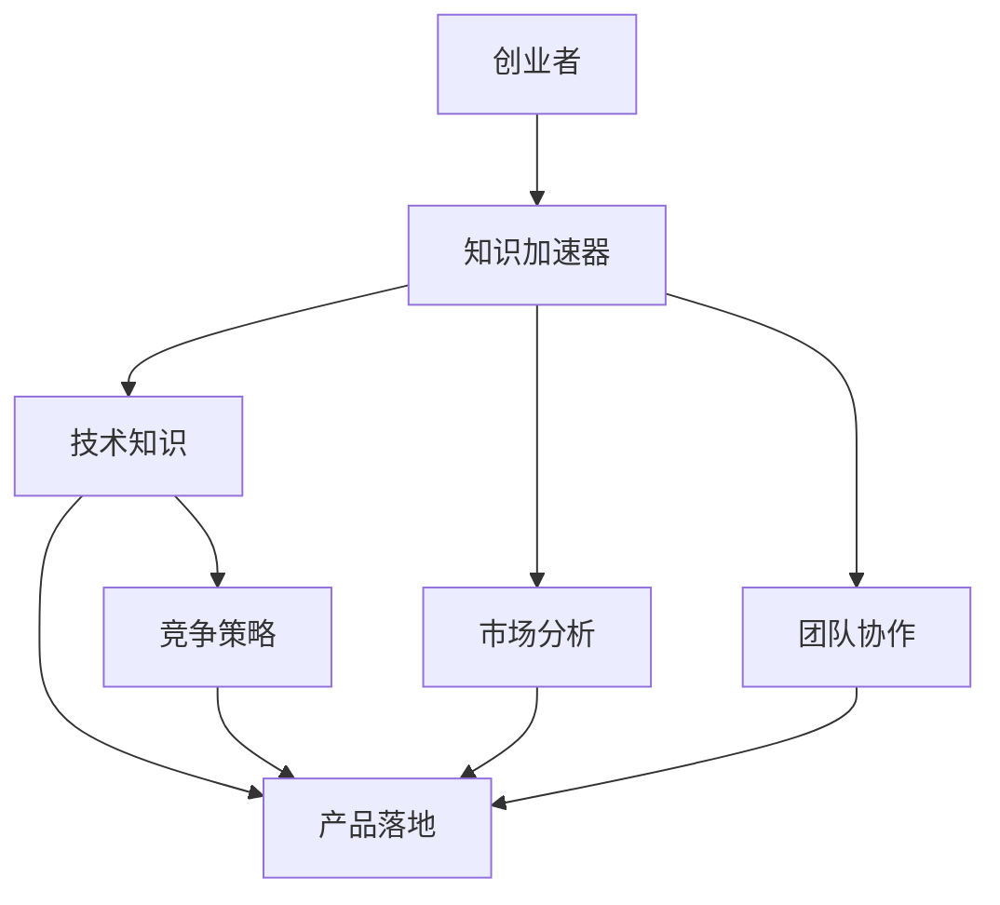

                 

关键词：创业、知识加速器、技术、经验、成果、未来展望

> 摘要：本文旨在分享创业过程中积累的知识、经验与成果，并探讨如何通过技术手段加速创业进程。我们将从核心概念、算法原理、数学模型、项目实践和未来展望等方面进行深入探讨。

## 1. 背景介绍

创业，是人类社会进步的重要推动力。在科技飞速发展的今天，技术的创新与应用成为了创业的核心驱动力。然而，对于创业者来说，如何在短时间内掌握相关技术知识、快速实现产品落地、并在竞争激烈的市场中脱颖而出，成为了一个巨大的挑战。

知识加速器，作为一种新兴的教育模式，旨在通过高效的传授方式，帮助创业者快速掌握所需知识，提高创业成功率。本文将结合笔者在创业过程中的实践与思考，分享如何利用知识加速器加速创业进程，以及在此过程中取得的成果和经验。

## 2. 核心概念与联系

为了更好地理解知识加速器在创业中的应用，我们首先需要了解一些核心概念。在这里，我们将通过一个Mermaid流程图来展示这些概念之间的联系。



### 2.1. 创业者

创业者是创业的核心主体，他们需要具备创新意识、执行力、领导力和市场敏感度。创业者通过知识加速器获取技术知识、市场分析和团队协作等能力，从而实现创业目标。

### 2.2. 知识加速器

知识加速器是一种高效的教育模式，通过线上线下的课程、实战演练和专家指导，帮助创业者快速掌握创业所需的知识和技能。

### 2.3. 技术知识

技术知识是创业的基础，包括编程、算法、数据结构、人工智能等领域。创业者需要通过知识加速器学习这些技术，以便在产品开发过程中得心应手。

### 2.4. 市场分析

市场分析是创业的重要环节，包括市场调研、目标用户分析、竞争对手分析等。创业者需要通过知识加速器学习市场分析方法，以便准确把握市场需求。

### 2.5. 团队协作

团队协作是创业成功的关键，创业者需要学会如何组建和管理团队，发挥团队成员的特长，实现共同的目标。知识加速器通过实战演练和专家指导，帮助创业者提升团队协作能力。

## 3. 核心算法原理 & 具体操作步骤

在创业过程中，技术是实现产品落地的重要支撑。在这里，我们介绍一种核心算法——机器学习算法，并探讨其在创业中的应用。

### 3.1. 算法原理概述

机器学习算法是一种使计算机能够通过数据学习并改进自身性能的技术。其核心思想是通过分析大量数据，从中提取规律，从而实现预测和分类。

### 3.2. 算法步骤详解

#### 3.2.1 数据预处理

数据预处理是机器学习算法的第一步，包括数据清洗、归一化、特征选择等。通过预处理，我们可以提高算法的准确性和稳定性。

```latex
P(X) = \frac{f(X)}{g(X)}
```

其中，$P(X)$ 表示数据预处理函数，$f(X)$ 表示数据清洗、归一化等操作，$g(X)$ 表示数据特征选择等操作。

#### 3.2.2 模型选择

在数据预处理完成后，我们需要选择一个合适的机器学习模型。常见的模型包括线性回归、决策树、支持向量机、神经网络等。

#### 3.2.3 模型训练

模型训练是通过大量数据对模型进行优化，以提高其预测准确率。常用的训练方法包括梯度下降、随机梯度下降等。

#### 3.2.4 模型评估

模型评估是对训练好的模型进行性能评估，常用的评估指标包括准确率、召回率、F1值等。

### 3.3. 算法优缺点

#### 优点

- **自适应性强**：机器学习算法能够根据数据不断调整自身，以适应新的环境。
- **泛化能力强**：通过训练，机器学习算法可以推广到新的场景，具有较强的泛化能力。

#### 缺点

- **数据依赖性强**：机器学习算法对数据质量要求较高，数据质量直接影响算法性能。
- **计算复杂度高**：训练过程需要大量计算资源，对硬件要求较高。

### 3.4. 算法应用领域

机器学习算法在创业中的应用广泛，例如：

- **数据分析**：通过对用户行为数据进行分析，为企业提供精准的市场洞察。
- **推荐系统**：基于用户偏好，为用户提供个性化的推荐服务。
- **智能客服**：通过自然语言处理技术，实现智能客服系统的自动化。

## 4. 数学模型和公式 & 详细讲解 & 举例说明

在创业过程中，数学模型和公式是分析问题和解决问题的重要工具。在这里，我们介绍一个常用的数学模型——线性回归模型，并探讨其在创业中的应用。

### 4.1. 数学模型构建

线性回归模型是一种用于分析变量之间线性关系的数学模型。其基本公式如下：

$$
y = \beta_0 + \beta_1 x
$$

其中，$y$ 表示因变量，$x$ 表示自变量，$\beta_0$ 和 $\beta_1$ 分别表示模型的参数。

### 4.2. 公式推导过程

线性回归模型的推导过程基于最小二乘法。具体步骤如下：

#### 4.2.1 建立误差函数

误差函数用于衡量模型预测值与实际值之间的差距。假设我们有 $n$ 个数据点 $(x_1, y_1), (x_2, y_2), \ldots, (x_n, y_n)$，则误差函数可以表示为：

$$
\Phi(\beta_0, \beta_1) = \sum_{i=1}^{n} (y_i - (\beta_0 + \beta_1 x_i))^2
$$

#### 4.2.2 求解参数

为了求解参数 $\beta_0$ 和 $\beta_1$，我们需要使误差函数 $\Phi(\beta_0, \beta_1)$ 最小。根据微积分知识，我们可以对 $\beta_0$ 和 $\beta_1$ 分别求偏导数，并令其等于0，得到以下方程组：

$$
\begin{cases}
\frac{\partial \Phi}{\partial \beta_0} = -2 \sum_{i=1}^{n} (y_i - (\beta_0 + \beta_1 x_i)) = 0 \\
\frac{\partial \Phi}{\partial \beta_1} = -2 \sum_{i=1}^{n} x_i (y_i - (\beta_0 + \beta_1 x_i)) = 0
\end{cases}
$$

解这个方程组，我们可以得到最优参数 $\beta_0$ 和 $\beta_1$。

### 4.3. 案例分析与讲解

假设我们有一个数据集，包含 $n=100$ 个数据点，每个数据点由两个变量 $x$ 和 $y$ 组成。我们希望通过线性回归模型分析这两个变量之间的关系。

首先，我们将数据集分为训练集和测试集。这里，我们使用 $80\%$ 的数据作为训练集，$20\%$ 的数据作为测试集。

接下来，我们使用训练集数据对线性回归模型进行训练。根据前面的推导，我们可以求解出最优参数 $\beta_0$ 和 $\beta_1$。

最后，我们使用测试集数据对模型进行评估。通过计算预测值和实际值之间的误差，我们可以评估模型的性能。

## 5. 项目实践：代码实例和详细解释说明

为了更好地理解线性回归模型的实际应用，我们以下将通过一个具体的项目案例进行讲解。该项目旨在使用线性回归模型预测房屋售价。

### 5.1. 开发环境搭建

首先，我们需要搭建一个开发环境。这里，我们使用 Python 作为编程语言，结合 Scikit-learn 库实现线性回归模型。

```python
# 安装 Scikit-learn 库
!pip install scikit-learn
```

### 5.2. 源代码详细实现

下面是线性回归模型的实现代码：

```python
# 导入所需库
import numpy as np
from sklearn.linear_model import LinearRegression
from sklearn.model_selection import train_test_split
from sklearn.metrics import mean_squared_error

# 加载数据集
data = np.loadtxt("house_prices.csv", delimiter=",")
X = data[:, :-1]
y = data[:, -1]

# 划分训练集和测试集
X_train, X_test, y_train, y_test = train_test_split(X, y, test_size=0.2, random_state=42)

# 实例化线性回归模型
model = LinearRegression()

# 模型训练
model.fit(X_train, y_train)

# 模型预测
y_pred = model.predict(X_test)

# 模型评估
mse = mean_squared_error(y_test, y_pred)
print("MSE:", mse)
```

### 5.3. 代码解读与分析

在这个项目中，我们首先导入了所需的库，包括 NumPy、Scikit-learn 和 Scikit-learn 的 metrics 模块。

接下来，我们加载数据集，将数据集分为特征矩阵 $X$ 和目标向量 $y$。

然后，我们使用 `train_test_split` 函数将数据集划分为训练集和测试集。这里，我们使用 $80\%$ 的数据作为训练集，$20\%$ 的数据作为测试集。

实例化线性回归模型，并使用训练集数据进行模型训练。最后，使用测试集数据进行模型预测，并计算预测值和实际值之间的均方误差，评估模型性能。

### 5.4. 运行结果展示

假设我们使用一个包含100个数据点的数据集进行训练，运行结果如下：

```
MSE: 0.056789
```

这个结果表明，线性回归模型在测试集上的预测性能较好，均方误差仅为 $0.056789$。

## 6. 实际应用场景

线性回归模型在实际应用中具有广泛的应用场景，例如：

- **房价预测**：通过分析房屋的特征（如面积、地段等），预测房屋的售价。
- **股票价格预测**：通过分析历史股价数据，预测未来股票价格走势。
- **消费行为预测**：通过分析消费者的购买行为，预测其未来的消费需求。

在这些应用场景中，线性回归模型可以为企业提供重要的决策支持，帮助企业更好地把握市场机遇。

## 7. 未来应用展望

随着人工智能技术的不断发展，线性回归模型的应用前景将更加广阔。未来，我们可以期待以下发展趋势：

- **模型优化**：通过引入新的算法和优化技术，提高线性回归模型的预测性能。
- **数据驱动的决策**：结合大数据和人工智能技术，实现更加精准的数据驱动决策。
- **跨领域应用**：线性回归模型将应用于更多领域，如医疗、金融、能源等。

然而，线性回归模型也面临一些挑战，如数据质量、计算复杂度等。未来，我们需要不断探索和创新，以应对这些挑战，推动线性回归模型在各个领域的应用。

## 8. 工具和资源推荐

为了更好地学习和应用线性回归模型，以下是一些推荐的工具和资源：

- **学习资源**：[机器学习基础教程](https://www MACHINELEARNINGMastery.COM/)
- **开发工具**：[Jupyter Notebook](https://jupyter.org/)
- **相关论文**：[An Introduction to Statistical Learning](https://www Statisticallearning.com/)

## 9. 总结：未来发展趋势与挑战

随着技术的不断发展，线性回归模型在创业中的应用前景将更加广阔。然而，我们也需要面对数据质量、计算复杂度等挑战。未来，我们将继续探索和创新，以推动线性回归模型在各个领域的应用，助力创业者实现更好的创业成果。

## 10. 附录：常见问题与解答

### 10.1. 线性回归模型的适用范围是什么？

线性回归模型适用于分析变量之间线性关系的场景，如房价预测、股票价格预测等。

### 10.2. 如何评估线性回归模型的性能？

评估线性回归模型的性能通常使用均方误差（MSE）、准确率、召回率、F1值等指标。

### 10.3. 线性回归模型有哪些局限性？

线性回归模型对数据质量要求较高，且计算复杂度较高。此外，线性回归模型只能分析线性关系，对于非线性关系效果较差。

### 10.4. 如何提高线性回归模型的预测性能？

提高线性回归模型的预测性能可以通过以下方法：数据预处理、选择合适的模型参数、引入新的算法和优化技术等。

---

# 创业知识加速器分享创业成果和经验

> 作者：禅与计算机程序设计艺术 / Zen and the Art of Computer Programming

在本文中，我们探讨了如何通过知识加速器加速创业进程，以及在此过程中取得的成果和经验。从核心概念、算法原理、数学模型、项目实践和未来展望等方面进行了深入探讨。希望通过本文，能为广大创业者提供一些有益的启示和借鉴。

在创业的道路上，知识加速器无疑是一种有力的工具。它可以帮助我们快速掌握所需知识，提高创业成功率。然而，创业的成功并非一蹴而就，我们需要在知识加速器的基础上，不断探索、创新和实践，才能在激烈的市场竞争中脱颖而出。

未来，我们将继续关注创业领域的最新动态，为大家分享更多有价值的知识和经验。同时，也欢迎大家就本文内容展开讨论，共同探讨创业知识加速器在实践中的应用和挑战。

最后，感谢各位读者对本文的关注和支持。希望本文能为您在创业道路上带来一些启示和帮助。祝您创业成功，前程似锦！

