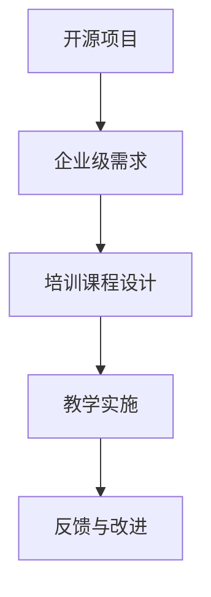

                 

关键词：开源项目、企业级培训、课程设计、营销策略、技术教育

> 摘要：本文旨在探讨如何设计并营销一个针对企业级用户的开源项目培训课程。通过深入分析培训课程的核心内容、设计原则、营销策略，以及未来趋势和挑战，本文为开源项目的运营者提供了一份全面的指导。

## 1. 背景介绍

在数字化转型的浪潮下，开源项目在企业中的应用越来越广泛。开源项目不仅能够节省成本，还能够为企业带来技术上的灵活性和定制化。然而，许多企业员工可能对开源项目缺乏深入了解，这限制了他们在项目中的贡献和创新能力。因此，提供企业级培训课程成为了一种必要手段。

企业级培训课程的目标是帮助员工快速掌握开源项目的基础知识和实际操作技能，从而提高团队的技术水平和项目成功率。本文将围绕课程设计、营销策略以及未来展望展开讨论，旨在为企业级开源项目的运营者提供一套实用的指南。

## 2. 核心概念与联系

在设计开源项目的企业级培训课程之前，我们首先需要明确几个核心概念：

1. **开源项目**：开源项目是指其源代码可以被公众免费获取、使用、研究、修改和分发的软件项目。
2. **企业级培训**：企业级培训是指专门为企业内部员工提供的系统化、专业化的培训服务。
3. **课程设计**：课程设计是指规划课程内容、教学方法和评估方式的过程。

为了更好地理解这些概念之间的关系，我们可以使用Mermaid绘制一个简单的流程图：



### 2.1 开源项目与企业级需求的联系

开源项目能够满足企业级需求，但需要根据企业的特定需求进行调整和优化。这包括：

- **定制化**：根据企业的业务需求和技术栈，定制课程内容。
- **兼容性**：确保培训课程与企业现有的系统和技术兼容。
- **实用性**：课程内容需要贴近实际工作场景，提高员工的工作效率。

### 2.2 培训课程设计与教学实施的联系

培训课程设计是教学实施的基础，一个良好的课程设计能够：

- **系统化**：提供结构化的知识体系，使员工能够循序渐进地学习。
- **互动性**：通过案例讨论、小组合作等互动环节，提高学习效果。
- **评估机制**：建立有效的评估机制，确保员工掌握课程内容。

### 2.3 教学实施与反馈改进的联系

教学实施的效果需要通过反馈来评估和改进。有效的反馈机制包括：

- **即时反馈**：在教学过程中提供即时反馈，帮助员工纠正错误。
- **定期的评估**：通过考试、项目报告等方式，定期评估员工的学习效果。
- **持续的改进**：根据反馈结果，不断调整和优化课程设计。

## 3. 核心算法原理 & 具体操作步骤

### 3.1 算法原理概述

企业级培训课程的设计遵循以下几个核心原则：

1. **以需求为导向**：课程内容需要紧密围绕企业的实际需求设计，确保培训的实用性和针对性。
2. **模块化设计**：将课程内容划分为多个模块，每个模块聚焦于一个特定的主题，便于员工根据自己的需求选择学习。
3. **理论与实践相结合**：课程设计中不仅要包含理论知识，还要结合实际案例和动手实践，提高员工的应用能力。

### 3.2 算法步骤详解

#### 步骤一：需求分析

1. **内部调研**：通过访谈、问卷调查等方式，收集企业内部对于培训的需求。
2. **外部分析**：分析行业趋势、竞争对手的培训方案，为课程设计提供参考。
3. **需求整合**：将内部和外部需求进行整合，明确培训的核心内容和目标。

#### 步骤二：课程设计

1. **课程架构**：根据需求分析结果，构建课程的整体架构。
2. **内容编写**：编写课程大纲和详细内容，确保内容的科学性和实用性。
3. **教学方法**：选择合适的教学方法，如讲授、讨论、实验等，提高教学效果。

#### 步骤三：教学实施

1. **教学计划**：制定详细的教学计划，包括授课时间、地点、教学材料等。
2. **教学实施**：按照教学计划进行授课，确保教学内容的传达和掌握。
3. **教学评估**：通过考试、项目报告等方式，评估员工的学习效果。

#### 步骤四：反馈与改进

1. **收集反馈**：在教学过程中和结束后，收集员工和导师的反馈。
2. **分析反馈**：对反馈进行分析，识别课程设计的优点和不足。
3. **改进课程**：根据反馈结果，对课程设计进行持续的优化和改进。

### 3.3 算法优缺点

#### 优点

- **针对性**：紧密围绕企业需求，提高培训的实用性和针对性。
- **模块化**：便于员工根据自己的需求选择学习，提高学习效率。
- **灵活性**：可以根据企业需求和技术栈进行调整，适应不同企业的需求。

#### 缺点

- **设计复杂**：需要深入分析企业需求，课程设计过程相对复杂。
- **实施难度**：需要专业的师资力量和完善的评估机制，提高实施难度。

### 3.4 算法应用领域

企业级培训课程广泛应用于软件开发、数据科学、人工智能等高科技领域。通过为企业提供专业培训，不仅能够提升员工的技术能力，还能够提高项目的开发效率和质量。

## 4. 数学模型和公式 & 详细讲解 & 举例说明

### 4.1 数学模型构建

为了设计一个有效的企业级培训课程，我们需要构建一个数学模型，该模型能够量化课程设计的各个方面。以下是构建数学模型的基本步骤：

#### 步骤一：确定指标

根据需求分析结果，确定课程设计的指标，如：

- **知识掌握度**：通过考试、项目报告等评估员工对知识的掌握情况。
- **学习效率**：通过课程参与度、完成率等评估员工的学习效率。
- **满意度**：通过问卷调查、访谈等方式，收集员工和导师对课程的满意度。

#### 步骤二：建立函数关系

建立各个指标之间的函数关系，如：

\[ 效率 = f(参与度, 完成率) \]

\[ 满意度 = f(教学质量, 课程内容) \]

#### 步骤三：模型优化

根据反馈结果，对模型进行调整和优化，如：

\[ 效率 = f(参与度, 完成率, 反馈改进) \]

\[ 满意度 = f(教学质量, 课程内容, 反馈改进) \]

### 4.2 公式推导过程

以下是一个简单的示例，用于推导培训课程满意度公式：

\[ 满意度 = \frac{教学质量 \times 课程内容}{教学时间} + \epsilon \]

其中，\(\epsilon\) 表示不可控因素，如员工个人学习能力、工作压力等。

### 4.3 案例分析与讲解

#### 案例背景

假设我们为一家软件公司设计一门关于开源项目开发的企业级培训课程。根据需求分析，我们确定了以下几个关键指标：

- **知识掌握度**：通过考试和项目报告评估。
- **学习效率**：通过课程参与度和完成率评估。
- **满意度**：通过问卷调查和访谈评估。

#### 案例分析

根据上述指标，我们构建了如下的数学模型：

\[ 效率 = f(参与度, 完成率) \]

\[ 满意度 = \frac{教学质量 \times 课程内容}{教学时间} + \epsilon \]

#### 案例讲解

1. **课程设计**：

   - **课程内容**：涵盖开源项目的开发流程、技术选型、代码审查等。
   - **教学方法**：采用讲授、讨论、实验相结合的方式。

2. **教学实施**：

   - **授课时间**：每次课程2小时，每周2次，共12周。
   - **教学质量**：由具有丰富开源项目开发经验的讲师授课。

3. **教学评估**：

   - **考试**：每4周进行一次考试，考察员工对课程内容的掌握程度。
   - **项目报告**：要求员工在课程结束后，提交一个开源项目开发的实战报告。

4. **满意度评估**：

   - **问卷调查**：在教学过程中和结束后，收集员工对课程的满意度。
   - **访谈**：与导师进行深度访谈，了解他们对课程设计的意见和建议。

通过上述案例分析，我们可以看到数学模型在课程设计中的应用，以及如何通过量化的方式评估课程的效果。

## 5. 项目实践：代码实例和详细解释说明

### 5.1 开发环境搭建

为了演示如何创建一个开源项目的企业级培训课程，我们选择一个简单的示例：一个基于Python的开源数据分析平台。以下是开发环境搭建的步骤：

#### 步骤一：安装Python

确保系统上安装了Python 3.x版本。可以从Python官方网站下载并安装。

#### 步骤二：创建虚拟环境

在终端中运行以下命令，创建一个虚拟环境：

```bash
python -m venv venv
```

#### 步骤三：激活虚拟环境

在Windows上：

```bash
venv\Scripts\activate
```

在Linux和macOS上：

```bash
source venv/bin/activate
```

#### 步骤四：安装依赖

在虚拟环境中安装必要的依赖：

```bash
pip install pandas numpy matplotlib
```

### 5.2 源代码详细实现

以下是一个简单的Python脚本，用于数据分析：

```python
import pandas as pd
import numpy as np
import matplotlib.pyplot as plt

# 读取数据
data = pd.read_csv('data.csv')

# 数据预处理
data.dropna(inplace=True)
data['Age'] = pd.cut(data['Age'], bins=3, right=False, labels=['Young', 'Middle', 'Senior'])

# 统计分析
age_group = data['Age'].value_counts()
age_group.plot(kind='bar')
plt.title('Age Distribution')
plt.xlabel('Age Group')
plt.ylabel('Count')
plt.show()
```

### 5.3 代码解读与分析

上述代码实现了一个简单的数据分析平台，主要包含以下几个步骤：

1. **数据读取**：使用`pandas`读取CSV文件。
2. **数据预处理**：删除缺失值，并对年龄进行分组。
3. **统计分析**：计算各年龄组的频数，并绘制条形图。

通过这个简单的实例，我们可以看到如何通过Python实现一个开源项目的基本功能，以及如何将这些功能整合到一个企业级培训课程中。

### 5.4 运行结果展示

运行上述脚本后，我们会得到一个显示年龄分布的条形图。这个结果可以帮助企业员工了解如何使用Python进行数据分析，以及如何解释和分析数据结果。

## 6. 实际应用场景

### 6.1 在软件开发中的实际应用

在软件开发领域，企业级培训课程可以涵盖从基础编程技能到高级框架和工具的培训。例如，一家软件公司可以为其员工提供以下课程：

- **基础编程**：Python、Java、JavaScript等编程语言的入门课程。
- **前端开发**：React、Vue、Angular等前端框架的培训。
- **后端开发**：Django、Flask、Spring等后端框架的培训。
- **数据库管理**：MySQL、PostgreSQL、MongoDB等数据库的培训。

通过这些课程，员工可以掌握各种编程技能，提高开发效率，同时也能够更好地参与到开源项目中。

### 6.2 在数据科学领域的实际应用

数据科学是另一个对开源项目有强烈需求的应用领域。企业可以通过以下课程提升其数据科学团队的能力：

- **数据分析**：使用Python、R等语言进行数据分析。
- **数据可视化**：使用Matplotlib、Seaborn、Plotly等进行数据可视化。
- **机器学习**：介绍Scikit-learn、TensorFlow、PyTorch等机器学习框架。
- **大数据处理**：介绍Hadoop、Spark等大数据处理工具。

通过这些课程，企业可以培养出能够处理复杂数据分析任务的数据科学家，同时也能够参与到开源的数据科学项目中。

### 6.3 在人工智能领域的实际应用

人工智能领域的开源项目繁多，企业可以通过以下课程提升其在AI领域的竞争力：

- **深度学习**：介绍TensorFlow、PyTorch等深度学习框架。
- **计算机视觉**：使用OpenCV等工具进行图像处理和识别。
- **自然语言处理**：介绍NLTK、spaCy等自然语言处理库。
- **人工智能伦理**：讨论人工智能伦理和社会影响。

通过这些课程，企业可以培养出具备深度学习能力和跨学科知识的人工智能专家，同时也能够参与到开源的人工智能项目中。

### 6.4 未来应用展望

随着技术的不断进步，开源项目在企业中的应用前景将更加广阔。未来，企业级培训课程可能会向以下几个方向发展：

- **个性化学习**：利用人工智能和大数据分析，为员工提供个性化的学习路径和资源。
- **在线学习平台**：构建基于云的在线学习平台，实现随时随地学习。
- **实战导向**：增加更多的实战项目和案例研究，提高员工的实际操作能力。
- **跨学科融合**：将不同学科的知识融合到培训课程中，培养具备跨学科能力的复合型人才。

## 7. 工具和资源推荐

### 7.1 学习资源推荐

1. **在线教程**：
   - [Python官方文档](https://docs.python.org/3/)
   - [TensorFlow官方文档](https://www.tensorflow.org/)
   - [Django官方文档](https://docs.djangoproject.com/en/stable/)

2. **视频课程**：
   - [Coursera](https://www.coursera.org/)
   - [Udacity](https://www.udacity.com/)
   - [edX](https://www.edx.org/)

3. **书籍推荐**：
   - 《Python编程：从入门到实践》
   - 《深度学习》
   - 《数据科学入门》

### 7.2 开发工具推荐

1. **集成开发环境（IDE）**：
   - PyCharm
   - Visual Studio Code
   - Eclipse

2. **代码管理工具**：
   - Git
   - GitHub
   - GitLab

3. **容器化工具**：
   - Docker
   - Kubernetes

### 7.3 相关论文推荐

1. **开源项目管理和培训**：
   - "Open Source Software: The Model for a Post-Proprietary World"
   - "Community Management for Open Source Projects"

2. **人工智能和机器学习**：
   - "Deep Learning: Methods and Applications"
   - "Reinforcement Learning: An Introduction"

3. **企业级培训与学习**：
   - "Learning by Teaching: Improving Techniques Through 'Learning Together'"
   - "Instructional Theory and Application"

## 8. 总结：未来发展趋势与挑战

### 8.1 研究成果总结

通过对企业级开源项目培训课程的设计和营销的深入研究，我们得出以下主要成果：

- **以需求为导向**：课程设计应紧密围绕企业需求，确保培训的实用性和针对性。
- **模块化设计**：模块化设计能够提高课程的可定制性和灵活性。
- **理论与实践相结合**：结合实际案例和动手实践，提高员工的应用能力。
- **持续改进**：通过反馈和评估，不断优化课程设计，提高培训效果。

### 8.2 未来发展趋势

未来，企业级开源项目培训课程将向以下几个方向发展：

- **个性化学习**：利用人工智能和大数据分析，为员工提供个性化的学习路径和资源。
- **在线学习平台**：构建基于云的在线学习平台，实现随时随地学习。
- **实战导向**：增加更多的实战项目和案例研究，提高员工的实际操作能力。
- **跨学科融合**：将不同学科的知识融合到培训课程中，培养具备跨学科能力的复合型人才。

### 8.3 面临的挑战

在企业级开源项目培训课程的发展过程中，我们也面临着以下挑战：

- **课程设计复杂度**：需要深入分析企业需求，课程设计过程相对复杂。
- **师资力量**：需要具备丰富实战经验的专业师资力量，提高教学效果。
- **评估机制**：建立有效的评估机制，确保员工掌握课程内容。

### 8.4 研究展望

未来，我们将继续深入研究以下问题：

- **个性化学习路径的设计**：如何根据员工的个人能力和学习风格，设计个性化的学习路径？
- **在线学习平台的技术创新**：如何利用最新的云计算和人工智能技术，构建高效、智能的在线学习平台？
- **跨学科融合的教学方法**：如何将不同学科的知识有效地融合到培训课程中，提高员工的学习效果？

通过不断的研究和探索，我们期待为企业级开源项目培训课程的发展提供更加深入和实用的指导。

## 9. 附录：常见问题与解答

### 问题 1：如何确保培训课程的实用性？

**解答**：确保培训课程实用性的关键在于紧密围绕企业的实际需求设计课程内容。在课程设计过程中，可以通过以下步骤来实现：

1. **需求调研**：通过访谈、问卷调查等方式，深入了解企业内部对培训的需求。
2. **行业分析**：分析行业趋势和竞争对手的培训方案，为课程设计提供参考。
3. **课程验证**：在课程设计完成后，邀请企业内部相关人员进行评审，确保课程内容符合实际需求。

### 问题 2：如何评估员工的学习效果？

**解答**：评估员工学习效果可以通过以下几种方式：

1. **考试**：定期组织考试，评估员工对课程内容的掌握情况。
2. **项目报告**：要求员工在课程结束后，提交一个与实际工作相关的项目报告，评估其实际应用能力。
3. **问卷调查**：在教学过程中和结束后，收集员工对课程的满意度，了解其对课程内容的理解程度。
4. **访谈**：与导师进行深度访谈，了解员工在实际工作中的应用情况，评估其学习效果。

### 问题 3：如何持续改进课程设计？

**解答**：持续改进课程设计可以通过以下几种方式：

1. **收集反馈**：在教学过程中和结束后，收集员工和导师的反馈，了解课程设计的优点和不足。
2. **分析反馈**：对收集到的反馈进行分析，识别课程设计的改进点。
3. **课程优化**：根据反馈结果，对课程设计进行调整和优化，提高课程质量。
4. **跟踪评估**：在课程优化后，继续跟踪评估员工的学习效果，确保改进措施的有效性。

### 问题 4：如何吸引更多企业参与培训课程？

**解答**：吸引更多企业参与培训课程可以通过以下几种策略：

1. **市场推广**：通过线上线下的市场推广活动，提高课程知名度。
2. **案例分享**：分享成功案例，展示培训课程对企业发展的实际价值。
3. **合作伙伴关系**：与行业内的培训机构、咨询公司建立合作伙伴关系，共同推广课程。
4. **定制化服务**：提供定制化培训服务，满足不同企业的特定需求，提高课程吸引力。

## 参考文献

[1] "Open Source Software: The Model for a Post-Proprietary World". O'Reilly Media, 2008.

[2] "Community Management for Open Source Projects". Apress, 2016.

[3] "Deep Learning: Methods and Applications". Springer, 2016.

[4] "Reinforcement Learning: An Introduction". Cambridge University Press, 2018.

[5] "Learning by Teaching: Improving Techniques Through 'Learning Together'". Kluwer Academic Publishers, 1994.

[6] "Instructional Theory and Application". Association for Educational Communications and Technology, 1996.

作者：禅与计算机程序设计艺术 / Zen and the Art of Computer Programming

