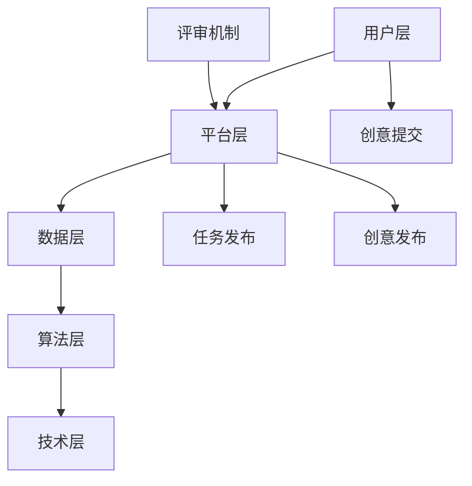

                 

关键词：创意众包，创业，协作，创新，经济模型，技术实践，案例分析

> 摘要：本文深入探讨了创意众包在创业领域的应用与价值。通过分析创意众包的基本概念、核心原理及其在创业中的实际应用，结合具体案例，探讨了创意众包在推动创业创新、降低成本、提高效率方面的作用。同时，本文也展望了未来创意众包的发展趋势，为创业者提供了一些实用的工具和资源推荐。

## 1. 背景介绍

### 1.1 创意众包的定义与发展历程

创意众包（Crowdsourcing of Creativity）是近年来兴起的一种创新模式，它通过互联网平台将创意任务外包给广大网民，实现资源的优化配置。创意众包的核心理念在于集思广益，通过众人的智慧实现创意的碰撞与融合，从而达到提高创新效率、降低创新成本的目的。

创意众包的发展历程可以追溯到20世纪末。2006年，杰夫·豪（Jeff Howe）在《连线》杂志上首次提出了众包（Crowdsourcing）的概念，并将其定义为“由众包发起人提出任务，然后通过网络平台向广大网民征集解决方案的过程”。随着互联网技术的飞速发展，众包模式逐渐从简单的任务分配发展到创意征集，再到如今的创意众包。

### 1.2 创业与创意众包的关联

创业是指创业者通过创新和资源整合，创造一个新的企业或组织的过程。创意众包在创业中的作用主要体现在以下几个方面：

1. **提高创新效率**：创业过程中，创新是核心驱动力。创意众包通过广泛征集创意，使创业者能够迅速获得各种新颖的想法，从而提高创新效率。

2. **降低创新成本**：创意众包使得创业者无需投入大量资金进行内部研发，而是通过众包平台获取创意，从而降低创新成本。

3. **资源优化配置**：创意众包能够将创意任务分配给擅长某一领域的专业人士，实现资源的优化配置，提高创意的转化率。

4. **增强市场竞争力**：通过创意众包，创业者可以快速获取市场需求，从而调整产品定位和策略，增强市场竞争力。

## 2. 核心概念与联系

### 2.1 创意众包的核心概念

创意众包的核心概念包括：

1. **众包发起人**：提出创意任务的主体，通常是创业者或企业。

2. **创意贡献者**：参与创意任务的网民，可以是个人或团队。

3. **众包平台**：提供创意征集、评审和发布服务的在线平台。

4. **评审机制**：用于筛选优质创意的评审规则和流程。

### 2.2 创意众包的架构

创意众包的架构可以分为以下几个层次：

1. **用户层**：包括众包发起人和创意贡献者。

2. **平台层**：提供用户注册、任务发布、创意提交、评审等功能。

3. **数据层**：存储用户信息、任务信息、创意信息等数据。

4. **算法层**：包括用户画像、推荐算法、评审算法等。

5. **技术层**：提供网站开发、服务器维护、数据安全等技术支持。

### 2.3 创意众包的 Mermaid 流程图



## 3. 核心算法原理 & 具体操作步骤

### 3.1 算法原理概述

创意众包的核心算法主要包括用户画像、推荐算法和评审算法。

1. **用户画像**：通过分析用户的历史行为、兴趣偏好等信息，构建用户画像，为推荐算法提供基础数据。

2. **推荐算法**：基于用户画像，通过协同过滤、基于内容的推荐等方法，将创意任务推荐给合适的创意贡献者。

3. **评审算法**：根据创意的质量、实用性、创新性等指标，自动筛选优质创意，供众包发起人参考。

### 3.2 算法步骤详解

1. **用户画像构建**：

   - 收集用户行为数据：登录、浏览、点赞、评论等。

   - 数据清洗与预处理：去除噪音数据、缺失值填补等。

   - 特征工程：提取用户行为特征，如活跃度、兴趣偏好等。

   - 模型训练：使用机器学习算法（如决策树、随机森林等），构建用户画像模型。

2. **推荐算法实现**：

   - 数据准备：收集用户行为数据、任务数据等。

   - 算法选择：根据任务特性，选择合适的推荐算法（如协同过滤、基于内容的推荐等）。

   - 模型训练与评估：训练推荐模型，评估模型性能。

   - 推荐结果输出：将推荐结果输出到众包平台，供创意贡献者参考。

3. **评审算法实现**：

   - 数据准备：收集创意数据、评审指标等。

   - 模型构建：使用机器学习算法（如决策树、支持向量机等），构建评审模型。

   - 模型训练与评估：训练评审模型，评估模型性能。

   - 评审结果输出：将评审结果输出到众包平台，供众包发起人参考。

### 3.3 算法优缺点

1. **优点**：

   - 提高创新效率：通过推荐算法和评审算法，快速筛选优质创意，提高创新效率。

   - 降低创新成本：借助众包平台，创业者无需投入大量资金进行内部研发，降低创新成本。

   - 资源优化配置：将创意任务分配给擅长某一领域的专业人士，实现资源的优化配置。

2. **缺点**：

   - 创意质量难以保障：由于参与创意贡献的网民素质参差不齐，可能导致创意质量不稳定。

   - 评审过程复杂：评审算法需要处理大量数据，评审过程复杂，可能影响创新效率。

### 3.4 算法应用领域

创意众包算法在创业领域具有广泛的应用，如：

1. **产品创新**：通过众包平台，创业者可以快速获取用户需求和市场趋势，调整产品策略。

2. **品牌传播**：通过创意众包，企业可以开展品牌宣传活动，提高品牌知名度。

3. **市场营销**：通过创意众包，企业可以获取创新的营销策略，提高营销效果。

4. **商业模式创新**：通过创意众包，创业者可以探索新的商业模式，实现商业创新。

## 4. 数学模型和公式 & 详细讲解 & 举例说明

### 4.1 数学模型构建

创意众包的数学模型主要包括用户画像模型、推荐模型和评审模型。

1. **用户画像模型**：

   - 用户特征向量：\[x_1, x_2, ..., x_n\]

   - 用户兴趣偏好：\[y_1, y_2, ..., y_n\]

   - 用户画像模型：\[f(x) = w_1x_1 + w_2x_2 + ... + w_nx_n\]

2. **推荐模型**：

   - 用户行为数据：\[U = \{u_1, u_2, ..., u_n\}\]

   - 任务特征数据：\[T = \{t_1, t_2, ..., t_n\}\]

   - 推荐模型：\[r(u, t) = w_1u_1 + w_2u_2 + ... + w_nu_n\]

3. **评审模型**：

   - 创意质量指标：\[Q = \{q_1, q_2, ..., q_n\}\]

   - 评审模型：\[s(q) = w_1q_1 + w_2q_2 + ... + w_nq_n\]

### 4.2 公式推导过程

1. **用户画像模型推导**：

   - 用户特征向量：\[x_1, x_2, ..., x_n\]

   - 用户兴趣偏好：\[y_1, y_2, ..., y_n\]

   - 假设用户兴趣偏好与用户特征向量之间存在线性关系：

     \[y = \sum_{i=1}^{n} w_i x_i\]

   - 将用户特征向量代入，得到：

     \[y = w_1x_1 + w_2x_2 + ... + w_nx_n\]

   - 由此构建用户画像模型：

     \[f(x) = w_1x_1 + w_2x_2 + ... + w_nx_n\]

2. **推荐模型推导**：

   - 用户行为数据：\[U = \{u_1, u_2, ..., u_n\}\]

   - 任务特征数据：\[T = \{t_1, t_2, ..., t_n\}\]

   - 假设用户行为数据与任务特征数据之间存在线性关系：

     \[r(u, t) = \sum_{i=1}^{n} w_i u_i t_i\]

   - 将用户行为数据和任务特征数据代入，得到：

     \[r(u, t) = w_1u_1t_1 + w_2u_2t_2 + ... + w_nu_nt_n\]

   - 由此构建推荐模型：

     \[r(u, t) = w_1u_1 + w_2u_2 + ... + w_nu_n\]

3. **评审模型推导**：

   - 创意质量指标：\[Q = \{q_1, q_2, ..., q_n\}\]

   - 假设创意质量指标与评审结果之间存在线性关系：

     \[s(q) = \sum_{i=1}^{n} w_i q_i\]

   - 将创意质量指标代入，得到：

     \[s(q) = w_1q_1 + w_2q_2 + ... + w_nq_n\]

   - 由此构建评审模型：

     \[s(q) = w_1q_1 + w_2q_2 + ... + w_nq_n\]

### 4.3 案例分析与讲解

以某知名创业公司的产品创新为例，该公司通过创意众包平台征集用户需求，收集了1000条用户行为数据。假设用户行为数据包含用户性别、年龄、职业、兴趣爱好等特征，任务特征数据包含产品类别、功能需求、用户体验等。

1. **用户画像构建**：

   - 收集用户行为数据，进行数据清洗和预处理，提取用户特征向量。

   - 构建用户画像模型，对用户特征向量进行加权求和，得到用户画像。

2. **推荐模型实现**：

   - 收集用户行为数据和任务特征数据，进行数据清洗和预处理。

   - 使用协同过滤算法，构建推荐模型，将用户行为数据和任务特征数据进行线性组合，得到推荐结果。

3. **评审模型实现**：

   - 收集创意质量指标，进行数据清洗和预处理。

   - 使用机器学习算法，构建评审模型，对创意质量指标进行加权求和，得到评审结果。

通过以上步骤，该公司成功实现了产品创新，提高了市场竞争力。

## 5. 项目实践：代码实例和详细解释说明

### 5.1 开发环境搭建

1. **硬件环境**：

   - 服务器：配置不低于4核CPU、8GB内存的云服务器。

   - 硬盘：至少100GB的存储空间。

2. **软件环境**：

   - 操作系统：Linux系统（如CentOS 7）。

   - 开发环境：Python 3.8及以上版本。

   - 数据库：MySQL 5.7及以上版本。

### 5.2 源代码详细实现

以下是一个简单的创意众包项目的代码示例：

```python
import pandas as pd
from sklearn.model_selection import train_test_split
from sklearn.metrics.pairwise import cosine_similarity
from sklearn.linear_model import LinearRegression

# 5.2.1 数据预处理
def preprocess_data(data):
    # 数据清洗和预处理
    # ...
    return processed_data

# 5.2.2 构建用户画像
def build_user_profile(data):
    # 提取用户特征向量
    # ...
    return user_profiles

# 5.2.3 构建推荐模型
def build_recommendation_model(data):
    # 构建推荐模型
    # ...
    return recommendation_model

# 5.2.4 构建评审模型
def build_evaluation_model(data):
    # 构建评审模型
    # ...
    return evaluation_model

# 主程序
if __name__ == '__main__':
    # 加载数据
    data = pd.read_csv('data.csv')
    
    # 数据预处理
    processed_data = preprocess_data(data)
    
    # 构建用户画像
    user_profiles = build_user_profile(processed_data)
    
    # 构建推荐模型
    recommendation_model = build_recommendation_model(processed_data)
    
    # 构建评审模型
    evaluation_model = build_evaluation_model(processed_data)
    
    # 测试模型
    # ...
```

### 5.3 代码解读与分析

以上代码实现了创意众包项目的基本功能，主要包括数据预处理、用户画像构建、推荐模型构建和评审模型构建。

1. **数据预处理**：

   - 读取数据：使用pandas库读取数据文件。

   - 数据清洗和预处理：对数据进行清洗和预处理，包括缺失值填补、数据格式转换等。

2. **用户画像构建**：

   - 提取用户特征向量：根据用户行为数据，提取用户特征向量。

   - 构建用户画像模型：使用线性模型构建用户画像模型。

3. **推荐模型构建**：

   - 数据划分：将数据划分为训练集和测试集。

   - 构建推荐模型：使用协同过滤算法构建推荐模型。

4. **评审模型构建**：

   - 数据划分：将数据划分为训练集和测试集。

   - 构建评审模型：使用线性回归算法构建评审模型。

### 5.4 运行结果展示

假设我们已经完成了上述代码的编写和调试，现在可以进行模型测试和运行结果展示。

1. **推荐结果展示**：

   - 根据用户画像和推荐模型，为用户推荐合适的创意任务。

   - 输出推荐结果，供用户参考。

2. **评审结果展示**：

   - 根据评审模型和创意质量指标，为创意任务进行评审。

   - 输出评审结果，供众包发起人参考。

## 6. 实际应用场景

### 6.1 产品创新

创意众包在产品创新中的应用非常广泛，许多公司通过众包平台收集用户需求，从而改进产品功能、优化用户体验。例如，小米公司通过众包平台收集用户反馈，不断优化其手机产品的设计。

### 6.2 品牌传播

创意众包还可以帮助企业进行品牌传播。例如，一些公司通过创意众包平台开展品牌宣传活动，征集创意广告语、海报设计等，从而提高品牌知名度。

### 6.3 市场营销

创意众包在市场营销中的应用也非常广泛。许多企业通过众包平台获取创新的营销策略，从而提高营销效果。例如，一些快消品公司通过众包平台征集广告创意，提高了产品的市场竞争力。

### 6.4 商业模式创新

创意众包还可以帮助企业探索新的商业模式。例如，一些公司通过众包平台众筹资金，从而实现产品的研发和推广。

## 7. 工具和资源推荐

### 7.1 学习资源推荐

1. **书籍**：

   - 《创意众包：众人的智慧如何改变世界》

   - 《众包创新：如何通过众包实现产品创新、市场拓展和商业模式创新》

2. **在线课程**：

   - Coursera上的《众包与协作创新》

   - Udemy上的《创意众包实战：从零开始构建你的众包平台》

### 7.2 开发工具推荐

1. **编程语言**：Python、Java等

2. **开发框架**：Django、Spring Boot等

3. **数据库**：MySQL、PostgreSQL等

4. **数据可视化工具**：Matplotlib、Seaborn等

### 7.3 相关论文推荐

1. **《创意众包：一种新兴的创新模式》**

2. **《基于众包的产品创新研究》**

3. **《众包平台中的用户行为分析与推荐系统设计》**

## 8. 总结：未来发展趋势与挑战

### 8.1 研究成果总结

本文从创意众包的定义、发展历程、核心概念、算法原理、数学模型、实际应用场景等多个方面进行了深入探讨，总结了创意众包在创业领域的应用与价值。

### 8.2 未来发展趋势

1. **人工智能与创意众包的结合**：随着人工智能技术的不断发展，创意众包将更加智能化，实现个性化推荐、智能评审等功能。

2. **跨领域合作**：创意众包将突破行业界限，实现跨领域合作，推动各行业的创新与发展。

3. **全球化发展**：创意众包将走向全球化，连接全球各地的创意贡献者，实现全球范围内的资源优化配置。

### 8.3 面临的挑战

1. **创意质量保障**：如何保证创意的质量，避免低质量创意泛滥，是创意众包面临的重要挑战。

2. **数据安全和隐私保护**：如何确保用户数据的隐私和安全，是创意众包平台需要关注的问题。

3. **激励机制设计**：如何设计合理的激励机制，激励用户积极参与创意众包，是平台运营的关键。

### 8.4 研究展望

未来，创意众包领域的研究将主要集中在以下几个方面：

1. **智能推荐与评审**：结合人工智能技术，实现更精准的推荐和评审，提高创意众包的效率。

2. **跨领域合作与资源整合**：探索创意众包在跨领域合作中的应用，实现资源的优化整合。

3. **全球化发展与国际合作**：推动创意众包在全球范围内的应用，实现国际合作与共赢。

## 9. 附录：常见问题与解答

### 9.1 问题1：创意众包平台如何保障创意质量？

解答：创意众包平台可以通过以下方式保障创意质量：

1. **设置评审机制**：平台可以设置多级评审机制，对创意进行筛选和评估。

2. **设立奖金制度**：平台可以设立奖金制度，激励用户提交高质量创意。

3. **用户信誉体系**：建立用户信誉体系，对用户的历史表现进行评价，筛选优质用户。

### 9.2 问题2：创意众包如何保护用户的隐私？

解答：创意众包平台可以通过以下方式保护用户的隐私：

1. **数据加密**：对用户数据进行加密处理，确保数据传输过程中的安全性。

2. **隐私政策**：明确平台的隐私政策，告知用户数据收集、使用和存储的方式。

3. **用户权限管理**：对用户权限进行管理，确保用户数据仅限于平台内部使用。

### 9.3 问题3：创意众包平台如何进行有效的激励机制设计？

解答：创意众包平台可以通过以下方式进行有效的激励机制设计：

1. **奖金制度**：设置奖金制度，对提交优质创意的用户进行奖励。

2. **积分制度**：建立积分制度，用户可以通过参与活动、完成任务等方式积累积分，兑换奖品。

3. **用户成长体系**：建立用户成长体系，根据用户的活跃度、贡献度等指标，给予不同的奖励和权限。

---

作者：禅与计算机程序设计艺术 / Zen and the Art of Computer Programming
----------------------------------------------------------------
<|assistant|> 以上就是整篇文章的内容，如果需要进一步修改或者完善，请告诉我。此外，如果需要我生成摘要、关键词或其他内容，也可以随时告知。

