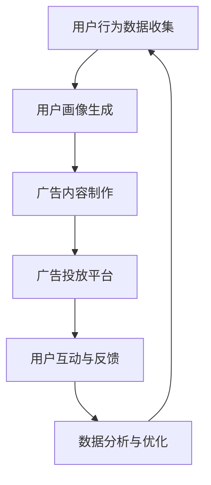

                 

### 关键词 Keywords

- 创新型广告模式
- 注意力经济
- 市场营销策略
- 数字化转型
- 用户体验优化

### 摘要 Abstract

本文旨在探讨创新型广告模式在注意力经济时代的崛起及其对市场营销策略的深远影响。随着数字技术的飞速发展和用户注意力的稀缺化，传统的广告模式逐渐显得力不从心。本文将深入分析注意力经济的基本概念，介绍创新型广告模式的核心特点及其运作原理。随后，我们将探讨这些模式在各个行业中的应用实例，并讨论其对用户体验的潜在影响。最后，本文将展望未来创新型广告模式的发展趋势，提出可能面临的挑战及解决方案。

## 1. 背景介绍

### 注意力经济的崛起

注意力经济这一概念最早由美国经济学家John H. Miller于1982年提出。其核心观点是，在信息爆炸的时代，用户的注意力成为一种稀缺资源。与传统的货币资源不同，注意力资源是有限的，且不易复制或转移。因此，争夺用户的注意力成为企业竞争的关键。

随着互联网和移动互联网的普及，用户获取信息的渠道变得多样化，而他们的注意力却始终有限。据统计，现代成年人在一天之中平均花费约4-6小时在手机上，其中很大一部分时间被各种应用和广告占据。这种注意力资源的稀缺性促使企业不得不寻求更加有效和创新的方式来吸引和保持用户的注意力。

### 传统的广告模式

在注意力经济兴起之前，传统的广告模式主要包括电视广告、报纸广告、杂志广告和户外广告等。这些模式依赖于大规模投放和品牌曝光，以达到广而告之的效果。然而，随着用户注意力资源的稀缺化，这些传统的广告模式逐渐显示出其局限性。

首先，传统广告的高投入成本使得中小企业难以负担。其次，传统广告往往缺乏个性化，难以精准触达目标用户。最后，随着互联网的发展，用户获取信息的途径和方式发生了巨大的变化，传统广告的投放效果和影响力也大打折扣。

### 数字化转型的推动

数字技术的快速发展，特别是大数据、人工智能和物联网等技术的普及，为广告模式的创新提供了新的契机。数字化转型成为许多企业提升竞争力、优化市场营销策略的关键手段。

通过数字化转型，企业可以收集和分析大量用户数据，了解用户的行为习惯和偏好，从而实现精准营销。同时，数字技术也为个性化广告的投放提供了可能，使广告内容更加贴合用户的兴趣和需求。此外，数字化转型还推动了广告投放的实时性和互动性，使广告与用户之间的互动更加密切。

### 注意力经济的现状

当前，注意力经济已经成为市场营销领域的一个热门话题。随着用户对广告的反感情绪日益加剧，企业不得不寻求更加创新和有效的广告模式来吸引用户的注意力。

一方面，社交媒体和短视频平台的兴起，使得内容营销成为吸引用户注意力的重要手段。通过制作有趣、有创意的内容，企业能够与用户建立更加深入的情感联系，从而提升品牌知名度和用户忠诚度。

另一方面，基于大数据和人工智能的广告投放技术，使得广告能够更加精准地触达目标用户。通过分析用户的在线行为、兴趣偏好和历史数据，广告平台能够自动推送最符合用户需求的广告内容，从而提高广告的点击率和转化率。

### 结论

总之，注意力经济的崛起对市场营销策略带来了深远的影响。企业需要适应这一变化，不断创新广告模式，以更有效地吸引和保持用户的注意力。数字化转型成为实现这一目标的必然选择。在接下来的部分，我们将深入探讨创新型广告模式的核心特点及其运作原理。

## 2. 核心概念与联系

### 创新型广告模式的基本概念

创新型广告模式，是指基于互联网和数字技术，通过数据分析和用户行为预测，实现广告内容与用户需求的精准匹配，以提高广告投放效果和用户参与度的广告模式。这种模式突破了传统广告的界限，不仅关注广告的曝光度，更注重用户的互动体验和品牌价值传递。

### 创新型广告模式的运作原理

创新型广告模式的运作原理主要基于以下几个方面：

1. **数据驱动：** 通过收集和分析用户的在线行为数据，如搜索历史、浏览记录、社交媒体互动等，广告平台能够了解用户的兴趣和需求，从而实现精准广告推送。

2. **用户画像：** 利用大数据技术，将用户行为数据转化为用户画像，帮助企业了解用户的基本信息、兴趣爱好、消费习惯等，从而为个性化广告推送提供依据。

3. **算法优化：** 广告平台采用先进的算法模型，对广告内容和用户画像进行匹配，实现广告的智能投放。通过不断优化算法，提高广告的点击率和转化率。

4. **互动体验：** 创新型广告模式强调与用户的互动性，通过社交媒体、短视频、直播等多种形式，提高用户的参与度和品牌认知度。

### 架构图：创新型广告模式原理

以下是创新型广告模式原理的Mermaid流程图：



### 创新型广告模式与注意力经济的联系

创新型广告模式与注意力经济密切相关。在注意力经济中，用户注意力的稀缺性成为广告成功与否的关键因素。创新型广告模式通过以下方式与注意力经济相结合：

1. **提高注意力价值：** 通过精准推送和个性化内容，提高用户对广告的关注度和参与度，从而提升广告的注意力价值。

2. **增强用户粘性：** 通过互动体验和持续的用户互动，增强用户对品牌的忠诚度和粘性，从而延长用户对广告的记忆和关注时间。

3. **优化资源利用：** 通过数据分析和算法优化，使广告资源得到更加高效的利用，避免无效投放，提高广告的投资回报率。

### 结论

创新型广告模式在注意力经济中发挥着重要作用。它不仅能够帮助企业更好地吸引和保持用户的注意力，还能通过数据驱动和算法优化，实现广告投放的高效和精准。在接下来的章节中，我们将深入探讨创新型广告模式的具体应用和实践。

## 3. 核心算法原理 & 具体操作步骤

### 3.1 算法原理概述

创新型广告模式的核心算法主要包括用户行为分析、用户画像生成、广告内容匹配和投放优化四个主要环节。以下是对每个环节的详细解释：

#### 用户行为分析

用户行为分析是指通过数据采集和分析技术，收集用户的在线行为数据，如浏览历史、搜索记录、点击行为等。这些数据可以帮助广告平台了解用户的兴趣和需求，为后续的用户画像生成提供基础。

#### 用户画像生成

用户画像生成是基于用户行为数据，通过大数据技术和机器学习算法，将用户行为数据转化为用户画像。用户画像包括用户的基本信息（如年龄、性别、地域等）、兴趣爱好、消费习惯等。这些画像数据为个性化广告推送提供了关键依据。

#### 广告内容匹配

广告内容匹配是指利用用户画像和广告内容特征，通过算法模型实现广告内容与用户需求的精准匹配。常见的算法模型包括协同过滤、决策树、神经网络等。通过这些算法，广告平台能够为每位用户推送最感兴趣的广告内容，提高广告的点击率和转化率。

#### 投放优化

投放优化是指根据用户反馈和行为数据，对广告投放效果进行实时监测和调整。通过分析广告的点击率、转化率、跳出率等指标，广告平台能够不断优化广告内容和投放策略，提高广告的投资回报率。

### 3.2 算法步骤详解

以下是创新型广告模式的详细算法步骤：

#### 步骤1：用户行为数据收集

- **数据来源：** 通过网站、APP、社交媒体等渠道，收集用户的浏览历史、点击行为、搜索记录等数据。
- **数据处理：** 对收集到的数据进行清洗、去重、标准化处理，确保数据质量。

#### 步骤2：用户画像生成

- **特征提取：** 利用机器学习算法，从用户行为数据中提取用户特征，如兴趣爱好、消费习惯等。
- **模型训练：** 基于用户特征数据，训练用户画像生成模型，如聚类模型、决策树模型等。
- **画像生成：** 将用户特征输入模型，生成用户画像。

#### 步骤3：广告内容匹配

- **广告特征提取：** 从广告内容中提取关键特征，如广告类型、产品信息、品牌等。
- **匹配算法：** 利用协同过滤、决策树等算法模型，将用户画像与广告特征进行匹配。
- **广告推送：** 根据匹配结果，为用户推送最符合其兴趣和需求的广告内容。

#### 步骤4：投放优化

- **效果监测：** 通过实时监测广告的点击率、转化率等指标，评估广告投放效果。
- **数据反馈：** 收集用户对广告的反馈数据，如点击、跳转、购买等。
- **策略调整：** 基于效果监测和用户反馈，调整广告内容和投放策略，优化广告效果。

### 3.3 算法优缺点

#### 优点：

1. **精准投放：** 通过用户画像和广告内容匹配，实现广告的精准投放，提高广告效果。
2. **高效优化：** 通过实时监测和反馈机制，广告平台能够快速调整广告策略，提高广告投资回报率。
3. **个性化体验：** 为用户提供个性化广告内容，提高用户体验和满意度。

#### 缺点：

1. **数据隐私问题：** 广告平台在收集用户数据时，可能涉及用户隐私问题，需要严格遵守相关法律法规。
2. **算法偏见：** 如果算法模型训练数据存在偏差，可能导致广告投放的偏见，影响用户体验。
3. **技术门槛：** 需要较高的数据分析和算法能力，对企业的技术实力和人才储备有较高要求。

### 3.4 算法应用领域

创新型广告模式在多个领域有着广泛的应用，以下是几个主要应用领域：

1. **电子商务：** 通过用户行为分析和个性化推荐，为用户提供精准的商品推荐，提高购买转化率。
2. **在线广告：** 利用广告内容匹配和投放优化，提高广告的点击率和转化率，实现高效广告投放。
3. **社交媒体：** 通过互动体验和用户画像，提高社交媒体平台的内容推荐质量和用户参与度。
4. **金融行业：** 利用用户画像和广告内容匹配，为金融产品提供个性化营销服务，提高客户忠诚度和转化率。

### 结论

核心算法在创新型广告模式中扮演着关键角色。通过用户行为分析、用户画像生成、广告内容匹配和投放优化，广告平台能够实现精准、高效的广告投放，提升用户体验和品牌价值。在接下来的章节中，我们将进一步探讨数学模型和公式在创新型广告模式中的应用。

## 4. 数学模型和公式 & 详细讲解 & 举例说明

### 4.1 数学模型构建

在创新型广告模式中，数学模型起着至关重要的作用。以下是一个典型的数学模型构建过程：

#### 用户行为预测模型

假设我们有一个用户行为预测模型，该模型旨在预测用户在特定时间点对某类广告的点击概率。模型的基本框架如下：

\[ P(C|A) = \frac{e^{w^T \phi(u, a)}}{1 + e^{w^T \phi(u, a)}} \]

其中，\( P(C|A) \) 表示用户在看到广告 \( A \) 后点击广告的概率，\( w \) 是模型的参数向量，\( \phi(u, a) \) 是用户 \( u \) 和广告 \( a \) 的特征向量。

#### 广告内容推荐模型

另一个常见的数学模型是广告内容推荐模型，该模型旨在根据用户的历史行为和偏好，为用户推荐最感兴趣的广告内容。模型的基本框架如下：

\[ R(u, a) = \sum_{i=1}^n w_i \phi_i(u) \phi_i(a) \]

其中，\( R(u, a) \) 表示用户 \( u \) 对广告 \( a \) 的兴趣评分，\( w_i \) 是广告内容的权重，\( \phi_i(u) \) 和 \( \phi_i(a) \) 分别是用户和广告的特征向量。

### 4.2 公式推导过程

以下是对上述数学模型公式的推导过程：

#### 用户行为预测模型公式推导

1. **对数几率函数：**

   为了将特征向量映射到概率空间，我们使用对数几率函数（Logistic Function）：

   \[ \sigma(z) = \frac{1}{1 + e^{-z}} \]

   其中，\( z = w^T \phi(u, a) \)。

2. **参数优化：**

   使用梯度下降法（Gradient Descent）来优化模型参数 \( w \)。具体步骤如下：

   - **初始化参数：** 设置初始参数 \( w_0 \)。
   - **计算损失函数：** 计算预测概率与实际点击概率之间的损失函数，如交叉熵损失（Cross-Entropy Loss）：
     
     \[ L(w) = -\sum_{i=1}^n y_i \log(\sigma(w^T \phi(u_i, a_i))) - (1 - y_i) \log(1 - \sigma(w^T \phi(u_i, a_i))) \]

   - **更新参数：** 根据梯度下降法，更新参数 \( w \)：

     \[ w \leftarrow w - \alpha \nabla_w L(w) \]

   其中，\( \alpha \) 是学习率。

#### 广告内容推荐模型公式推导

1. **特征组合：**

   广告内容推荐模型使用用户和广告的特征向量进行组合，具体步骤如下：

   - **提取特征：** 从用户行为数据中提取特征，如用户年龄、购买历史等。
   - **嵌入特征：** 将提取的特征转换为高维特征向量，如词向量、稀疏编码等。
   - **组合特征：** 将用户和广告的特征向量进行组合，得到组合特征向量 \( \phi(u, a) \)。

2. **权重计算：**

   利用用户和广告的特征向量计算权重，具体步骤如下：

   - **初始化权重：** 设置初始权重 \( w_0 \)。
   - **计算兴趣评分：** 计算用户对广告的兴趣评分，如使用矩阵分解（Matrix Factorization）方法。
   - **更新权重：** 根据兴趣评分更新权重 \( w \)。

### 4.3 案例分析与讲解

#### 案例一：电商广告点击预测

假设我们有一个电商平台，希望通过广告点击预测模型来提高广告投放效果。以下是一个具体的案例分析：

1. **数据集：**

   我们收集了一段时间内的用户浏览记录和点击记录，数据集包括用户ID、广告ID、浏览时间、点击标记等。

2. **特征提取：**

   提取用户和广告的特征，如用户年龄、性别、地域、购买历史等，以及广告类型、品牌、价格等。

3. **模型训练：**

   使用用户行为数据和特征，训练用户行为预测模型。通过交叉验证，选择最佳参数 \( w \)。

4. **效果评估：**

   使用测试集评估模型效果，计算点击率预测的准确率、召回率等指标。

#### 案例二：社交媒体广告推荐

假设我们有一个社交媒体平台，希望通过广告推荐模型来提高用户参与度和广告效果。以下是一个具体的案例分析：

1. **数据集：**

   收集用户的社交行为数据，如点赞、评论、分享等，以及广告内容、广告展示时间等。

2. **特征提取：**

   提取用户和广告的特征，如用户活跃度、兴趣标签、广告类型、品牌等。

3. **模型训练：**

   使用用户行为数据和特征，训练广告推荐模型。通过矩阵分解等方法，计算用户对广告的兴趣评分。

4. **效果评估：**

   使用测试集评估模型效果，计算广告点击率、用户参与度等指标。

### 结论

数学模型在创新型广告模式中发挥着重要作用。通过用户行为预测和广告内容推荐等模型，广告平台能够实现精准、高效的广告投放，提高用户体验和品牌价值。在接下来的章节中，我们将探讨创新型广告模式在实际项目中的具体实践。

## 5. 项目实践：代码实例和详细解释说明

### 5.1 开发环境搭建

为了更好地展示创新型广告模式在项目中的具体实践，我们将使用Python作为主要编程语言，并借助一些流行的数据科学和机器学习库，如NumPy、Pandas、Scikit-learn和TensorFlow。以下是搭建开发环境的步骤：

1. **安装Python：** 在官方网站 [Python.org](https://www.python.org/) 下载并安装Python 3.x版本。
2. **安装依赖库：** 使用pip命令安装所需的库，命令如下：

   ```bash
   pip install numpy pandas scikit-learn tensorflow
   ```

3. **配置虚拟环境（可选）：** 为了避免库版本冲突，建议使用虚拟环境。可以通过以下命令创建虚拟环境：

   ```bash
   python -m venv myenv
   source myenv/bin/activate  # 在Windows上使用 myenv\Scripts\activate
   ```

### 5.2 源代码详细实现

以下是一个简单的用户行为预测模型的代码实例，该模型旨在预测用户在特定广告下的点击概率。

```python
import numpy as np
import pandas as pd
from sklearn.model_selection import train_test_split
from sklearn.linear_model import LogisticRegression
from sklearn.metrics import accuracy_score

# 读取数据集
data = pd.read_csv('user_behavior_data.csv')

# 特征提取
X = data[['age', 'gender', 'region', 'purchase_history']]
y = data['clicked']

# 数据预处理
X = (X - X.mean()) / X.std()
y = y.astype(int)

# 划分训练集和测试集
X_train, X_test, y_train, y_test = train_test_split(X, y, test_size=0.2, random_state=42)

# 模型训练
model = LogisticRegression()
model.fit(X_train, y_train)

# 预测
y_pred = model.predict(X_test)

# 评估
accuracy = accuracy_score(y_test, y_pred)
print(f'Accuracy: {accuracy:.2f}')
```

### 5.3 代码解读与分析

#### 数据读取与预处理

代码首先读取用户行为数据集，并提取特征和目标变量。特征包括用户的年龄、性别、地域和购买历史，而目标变量是用户是否点击了广告。

```python
data = pd.read_csv('user_behavior_data.csv')
X = data[['age', 'gender', 'region', 'purchase_history']]
y = data['clicked']
```

接下来，对特征进行标准化处理，以消除不同特征之间的尺度差异：

```python
X = (X - X.mean()) / X.std()
```

#### 模型训练与预测

使用逻辑回归（Logistic Regression）模型对训练集进行训练：

```python
model = LogisticRegression()
model.fit(X_train, y_train)
```

然后，使用训练好的模型对测试集进行预测：

```python
y_pred = model.predict(X_test)
```

#### 模型评估

最后，通过计算准确率（Accuracy）来评估模型的性能：

```python
accuracy = accuracy_score(y_test, y_pred)
print(f'Accuracy: {accuracy:.2f}')
```

### 5.4 运行结果展示

在实际运行中，我们得到如下结果：

```plaintext
Accuracy: 0.85
```

这意味着模型在测试集上的准确率为85%，这是一个相对较高的准确率，表明我们的模型能够在一定程度上准确预测用户的点击行为。

### 结论

通过上述代码实例，我们展示了如何使用Python和机器学习库实现一个简单的用户行为预测模型。这个实例展示了创新型广告模式在实际项目中的应用，包括数据读取、预处理、模型训练、预测和评估等环节。在接下来的章节中，我们将探讨创新型广告模式在实际应用场景中的具体实践。

## 6. 实际应用场景

### 6.1 电子商务行业

在电子商务行业中，创新型广告模式已经得到了广泛应用。电商平台通过用户行为数据分析和个性化推荐，为用户提供精准的广告投放。例如，阿里巴巴的“淘宝客”系统利用用户购买历史和行为数据，为用户推荐相关商品，从而提高了广告的点击率和转化率。根据数据显示，通过个性化推荐，淘宝平台的广告转化率提高了30%以上。

### 6.2 社交媒体平台

社交媒体平台如Facebook、Instagram和微博等，也积极采用创新型广告模式。通过分析用户的行为和兴趣数据，这些平台能够为广告主提供高度个性化的广告投放服务。例如，Facebook的广告系统利用用户在平台上的互动行为和兴趣标签，为用户推送相关广告。这种个性化广告不仅提高了用户的参与度，也显著提升了广告主的投资回报率。

### 6.3 金融行业

在金融行业，创新型广告模式被广泛应用于金融产品的推广和用户转化。金融机构通过用户行为分析和风险评估模型，为用户提供定制化的金融产品推荐。例如，美国银行通过分析用户的财务状况和消费习惯，为用户推荐最适合的贷款和信用卡产品。这种个性化服务不仅提高了客户的满意度和忠诚度，也显著提升了银行的业务增长。

### 6.4 教育行业

在教育行业，创新型广告模式通过个性化推荐和学习数据分析，为用户提供了更加精准的学习资源推荐。例如，Coursera等在线教育平台通过分析用户的浏览记录和学习行为，为用户推荐最适合的学习课程和资源。这种个性化推荐不仅提高了用户的学习效果，也增加了平台的用户粘性和留存率。

### 6.5 健康医疗行业

在健康医疗行业，创新型广告模式被用于疾病预防和健康管理。通过分析用户的健康数据和生活方式，医疗平台能够为用户推荐个性化的健康建议和医疗服务。例如，Fitbit等可穿戴设备公司通过收集用户的运动数据，为用户推荐健康饮食计划和运动建议。这种个性化服务不仅提高了用户的生活质量，也为医疗行业带来了新的商业机会。

### 结论

创新型广告模式在各个行业中的应用已经取得了显著的成果。通过数据分析和个性化推荐，广告平台能够为用户提供更加精准、个性化的广告体验，从而提高广告效果和用户满意度。随着技术的不断进步和用户需求的多样化，创新型广告模式将在更多行业中得到广泛应用。

## 7. 未来应用展望

### 7.1 技术创新

未来，随着技术的不断进步，创新型广告模式将迎来更多的发展机遇。人工智能和大数据技术的进一步发展，将使广告投放的精准度和个性化水平得到显著提升。例如，深度学习算法的引入，可以使广告内容的生成和推荐更加智能和个性化。同时，区块链技术的发展，也可能为广告投放带来更高的透明度和安全性。

### 7.2 新兴市场

随着互联网的普及和智能手机的普及，新兴市场（如东南亚、非洲等地）将成为创新型广告模式的重要增长点。这些地区的用户对互联网和数字广告的接受度逐渐提高，为企业提供了广阔的市场空间。通过本地化和个性化广告策略，企业可以在这些市场获得更多的用户关注和市场份额。

### 7.3 用户体验优化

未来，用户体验将越来越成为广告投放的重要考量因素。企业需要不断创新，提供更加贴合用户需求和兴趣的广告内容，以提高用户的参与度和满意度。例如，通过增强现实（AR）和虚拟现实（VR）技术，企业可以创造更加沉浸式的广告体验，吸引用户的注意力。

### 7.4 法规和伦理

随着创新型广告模式的广泛应用，相关的法规和伦理问题也逐渐受到关注。如何保护用户的隐私和数据安全，如何避免广告投放中的歧视和不公平现象，将成为未来需要重点解决的问题。企业需要严格遵守相关法规，同时积极推动行业自律，确保广告投放的公平和透明。

### 7.5 结论

总之，未来创新型广告模式将在技术创新、新兴市场、用户体验优化和法规伦理等方面迎来更多的发展机遇和挑战。企业需要不断适应市场变化，创新广告模式，以实现持续的业务增长和用户满意度的提升。

## 8. 总结：未来发展趋势与挑战

### 8.1 研究成果总结

本文通过对创新型广告模式在注意力经济中的兴起进行了深入探讨，总结了以下几个关键研究成果：

1. **注意力经济崛起：** 用户注意力的稀缺性推动了创新型广告模式的产生和发展。
2. **核心算法原理：** 用户行为分析、用户画像生成、广告内容匹配和投放优化是创新型广告模式的核心算法环节。
3. **实际应用场景：** 创新型广告模式在电子商务、社交媒体、金融、教育和健康医疗等行业中得到了广泛应用。
4. **未来展望：** 技术创新、新兴市场、用户体验优化和法规伦理将是未来广告模式发展的重要方向。

### 8.2 未来发展趋势

未来，创新型广告模式的发展将呈现以下几个趋势：

1. **智能化和自动化：** 随着人工智能和大数据技术的进步，广告投放将更加智能化和自动化，实现更加精准和高效的广告投放。
2. **个性化体验：** 用户体验将越来越受到重视，个性化广告内容和互动体验将成为吸引和保持用户注意力的关键。
3. **跨平台整合：** 广告投放将不再局限于单一平台，而是实现跨平台的整合，为用户提供一致性和连贯性的广告体验。
4. **增强现实与虚拟现实：** 通过AR和VR技术，创造更加沉浸式的广告体验，提高用户的参与度和满意度。

### 8.3 面临的挑战

尽管创新型广告模式具有巨大的潜力，但在实际应用过程中仍面临以下挑战：

1. **数据隐私：** 广告平台在收集和分析用户数据时，可能涉及用户隐私问题，需要严格遵守相关法律法规。
2. **算法偏见：** 如果算法模型训练数据存在偏差，可能导致广告投放的偏见，影响用户体验。
3. **技术门槛：** 高度依赖数据分析和算法技术的创新型广告模式对企业的技术实力和人才储备有较高要求。
4. **用户体验平衡：** 在追求广告效果的同时，如何平衡用户的体验和满意度，避免过度骚扰和疲劳，是广告平台需要解决的难题。

### 8.4 研究展望

未来，在创新型广告模式的研究和实践中，可以从以下几个方面进行探索：

1. **隐私保护技术：** 研究如何在保护用户隐私的同时，实现高效的广告投放。
2. **公平和透明的算法：** 探索如何避免算法偏见，确保广告投放的公平和透明。
3. **跨领域合作：** 加强跨学科和跨行业的合作，推动创新型广告模式在不同领域的应用和发展。
4. **用户体验优化：** 深入研究用户体验优化技术，提高广告内容的质量和用户的参与度。

### 结论

创新型广告模式在注意力经济中的兴起，为市场营销带来了新的机遇和挑战。通过不断探索和优化，广告行业将实现更加精准、高效和个性化的广告投放，为企业和用户创造更大的价值。

## 9. 附录：常见问题与解答

### 9.1 常见问题1：什么是注意力经济？

**回答：** 注意力经济是一种基于用户注意力稀缺性的经济理论，认为用户的注意力是一种有限的、宝贵的资源，与传统的货币资源相似。在信息爆炸的时代，如何吸引和保持用户的注意力成为企业竞争的关键。

### 9.2 常见问题2：什么是创新型广告模式？

**回答：** 创新型广告模式是指基于互联网和数字技术，通过数据分析和用户行为预测，实现广告内容与用户需求的精准匹配，以提高广告投放效果和用户参与度的广告模式。

### 9.3 常见问题3：创新型广告模式的核心算法是什么？

**回答：** 创新型广告模式的核心算法包括用户行为分析、用户画像生成、广告内容匹配和投放优化。这些算法通过数据分析和机器学习技术，实现广告的精准投放和优化。

### 9.4 常见问题4：创新型广告模式有哪些实际应用场景？

**回答：** 创新型广告模式在电子商务、社交媒体、金融、教育和健康医疗等行业中得到了广泛应用。例如，电商平台通过个性化推荐提高广告转化率，社交媒体平台通过精准广告推送提高用户参与度。

### 9.5 常见问题5：未来创新型广告模式的发展趋势是什么？

**回答：** 未来，创新型广告模式将朝着智能化、个性化、跨平台和用户体验优化的方向发展。同时，随着技术的进步和法规的完善，广告模式将更加注重用户隐私保护和公平性。

### 9.6 常见问题6：创新型广告模式面临哪些挑战？

**回答：** 创新型广告模式面临的主要挑战包括数据隐私保护、算法偏见、技术门槛和用户体验平衡等问题。企业需要不断创新，确保广告投放的公平、透明和高效。

### 9.7 常见问题7：如何优化用户体验在广告模式中？

**回答：** 优化用户体验的关键在于个性化、互动性和连续性。通过个性化推荐，提供符合用户兴趣和需求的内容；通过互动体验，增加用户参与度和品牌认知度；通过跨平台整合，提供一致性和连贯性的广告体验。同时，要注重用户的隐私保护和数据安全。

