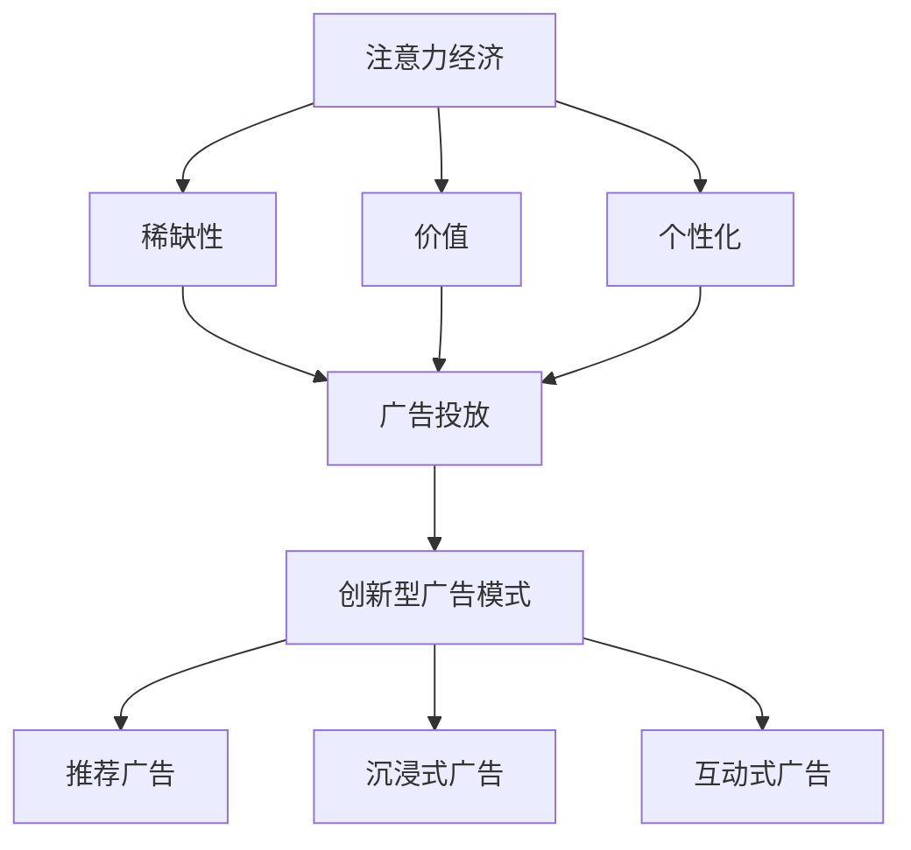

                 

关键词：创新型广告模式、注意力经济、AI算法、数据驱动、广告精准投放

摘要：随着互联网的迅猛发展，广告行业经历了巨大的变革。注意力经济成为了现代广告的核心驱动力，而创新型的广告模式在这一背景下应运而生。本文旨在探讨创新型广告模式在注意力经济中的兴起，分析其背后的核心原理、算法、数学模型以及实际应用，并对未来发展趋势与挑战进行展望。

## 1. 背景介绍

注意力经济是一种基于人类注意力资源的经济学理论。在这个理论中，注意力被视为一种稀缺资源，消费者的注意力被广泛视为一种价值。因此，企业必须通过创新广告模式来争夺消费者的注意力。

随着互联网的兴起，广告形式和传播方式发生了翻天覆地的变化。传统的广告模式，如电视广告、广播广告等，逐渐被数字广告所取代。数字广告不仅能够实现精准投放，还能够通过数据分析来优化广告效果。

在这个背景下，创新型的广告模式不断涌现，例如基于人工智能的推荐广告、沉浸式广告、互动式广告等。这些广告模式不仅提高了广告的点击率和转化率，还极大地提升了消费者的体验。

## 2. 核心概念与联系

### 2.1 注意力经济的定义与特征

注意力经济是指一种通过争夺消费者的注意力来创造经济价值的模式。其特征包括：

- **注意力稀缺性**：消费者的注意力资源是有限的，因此企业必须争夺这一稀缺资源。
- **注意力价值**：消费者的注意力可以转化为商业价值，例如广告点击、商品购买等。
- **个性化**：基于消费者行为和兴趣的分析，广告可以更加精准地投放，提高转化率。

### 2.2 创新型广告模式的概念与分类

创新型广告模式是指基于新技术和算法的，能够更好地争夺消费者注意力的广告形式。常见的创新型广告模式包括：

- **推荐广告**：基于用户行为和兴趣，通过机器学习算法推荐个性化的广告。
- **沉浸式广告**：通过虚拟现实、增强现实等技术，将广告融入用户的真实体验中。
- **互动式广告**：通过用户参与，如点击、评论等，提升广告的互动性和吸引力。

### 2.3 创新型广告模式与注意力经济的联系

创新型的广告模式与注意力经济密切相关。通过以下方式，创新型广告模式能够更好地服务于注意力经济：

- **提升广告效果**：通过个性化推荐、沉浸式体验等，提高广告的点击率和转化率。
- **优化资源分配**：通过数据分析，优化广告投放策略，提高广告预算的利用效率。
- **增加用户粘性**：通过互动式广告等，提升用户的参与度和忠诚度。

### 2.4 Mermaid 流程图



## 3. 核心算法原理 & 具体操作步骤

### 3.1 算法原理概述

创新型的广告模式依赖于多种核心算法，如机器学习算法、数据挖掘算法等。这些算法通过分析用户行为和兴趣，实现广告的精准投放。

- **机器学习算法**：通过训练模型，从大量数据中学习用户的行为和兴趣，实现个性化推荐。
- **数据挖掘算法**：通过分析用户的历史数据，挖掘出用户的潜在兴趣，用于广告的精准投放。

### 3.2 算法步骤详解

#### 3.2.1 用户行为分析

1. **数据收集**：收集用户的浏览记录、搜索历史、购买行为等数据。
2. **数据预处理**：清洗数据，去除重复、缺失和异常值。
3. **特征提取**：从数据中提取出对用户行为和兴趣有代表性的特征，如浏览时间、搜索关键词、购买频率等。

#### 3.2.2 机器学习模型训练

1. **模型选择**：选择合适的机器学习模型，如协同过滤、决策树、神经网络等。
2. **模型训练**：使用预处理后的数据，对机器学习模型进行训练，学习用户的行为和兴趣。
3. **模型评估**：使用验证集和测试集评估模型的性能，如准确率、召回率等。

#### 3.2.3 广告投放

1. **广告生成**：根据用户的行为和兴趣，生成个性化的广告。
2. **广告投放**：将广告推送给目标用户。
3. **效果评估**：评估广告的投放效果，如点击率、转化率等。

### 3.3 算法优缺点

#### 3.3.1 优点

- **精准投放**：通过个性化推荐，提高广告的点击率和转化率。
- **高效利用资源**：通过数据分析和算法优化，提高广告预算的利用效率。
- **提升用户体验**：通过沉浸式和互动式广告，提升用户的参与度和满意度。

#### 3.3.2 缺点

- **数据隐私问题**：大规模的数据收集和处理可能涉及到用户隐私的问题。
- **算法偏见**：机器学习算法可能存在偏见，导致某些用户群体被忽视。
- **技术门槛**：需要高水平的技术团队和大量的计算资源来支持。

### 3.4 算法应用领域

创新型的广告模式广泛应用于电子商务、社交媒体、在线娱乐等领域。例如，电商平台通过推荐广告，提高商品的销量；社交媒体平台通过沉浸式广告，提升用户的互动性。

## 4. 数学模型和公式 & 详细讲解 & 举例说明

### 4.1 数学模型构建

在创新型的广告模式中，常用的数学模型包括协同过滤模型、线性回归模型等。以下以协同过滤模型为例进行介绍。

#### 4.1.1 协同过滤模型

协同过滤模型是一种基于用户行为和物品评价的推荐算法。其核心思想是通过找到与目标用户相似的其他用户，推荐这些用户喜欢的物品。

$$
\hat{r_{ui}} = \frac{\sum_{j \in N_i} r_{uj} \cdot sim(u_i, u_j)}{\sum_{j \in N_i} sim(u_i, u_j)}
$$

其中，$r_{uj}$ 表示用户 $u$ 对物品 $j$ 的评价，$sim(u_i, u_j)$ 表示用户 $u_i$ 和 $u_j$ 的相似度。

### 4.2 公式推导过程

#### 4.2.1 相似度计算

相似度计算是协同过滤模型的关键步骤。常用的相似度计算方法包括余弦相似度、皮尔逊相关系数等。

$$
sim(u_i, u_j) = \frac{r_{ui} \cdot r_{uj}}{\sqrt{\sum_{k} r_{ui}^2 \cdot \sum_{k} r_{uj}^2}}
$$

#### 4.2.2 推荐评分计算

根据相似度计算，可以推导出推荐评分的计算公式。

$$
\hat{r_{ui}} = \frac{\sum_{j \in N_i} r_{uj} \cdot sim(u_i, u_j)}{\sum_{j \in N_i} sim(u_i, u_j)}
$$

### 4.3 案例分析与讲解

#### 4.3.1 案例背景

某电商平台希望通过协同过滤模型，为用户推荐他们可能感兴趣的物品。

#### 4.3.2 数据预处理

- 收集用户的历史购买数据，包括用户ID、物品ID和用户对物品的评价。
- 去除缺失值和异常值。
- 对数据标准化处理。

#### 4.3.3 模型训练

- 选择合适的相似度计算方法，如余弦相似度。
- 训练协同过滤模型，得到每个用户与其他用户的相似度矩阵。

#### 4.3.4 广告投放

- 根据相似度矩阵和用户的历史购买记录，生成个性化的推荐列表。
- 将推荐列表推送给目标用户。

#### 4.3.5 效果评估

- 评估推荐系统的准确率、召回率等指标。
- 根据评估结果，优化模型参数，提高推荐质量。

## 5. 项目实践：代码实例和详细解释说明

### 5.1 开发环境搭建

- Python 3.8
- NumPy
- Pandas
- Scikit-learn

### 5.2 源代码详细实现

```python
import numpy as np
import pandas as pd
from sklearn.metrics.pairwise import cosine_similarity

# 数据加载与预处理
data = pd.read_csv('data.csv')
data = data.dropna()

# 特征提取
users = data.groupby('user_id')['item_id'].apply(list).reset_index().rename(columns={'item_id': 'items'})
items = data.groupby('item_id')['user_id'].apply(list).reset_index().rename(columns={'user_id': 'users'})

# 相似度计算
similarity_matrix = cosine_similarity(users.values, items.values)

# 推荐评分计算
recommendations = {}
for user_id, user_items in users.items():
    user_similarity = similarity_matrix[user_id]
    user_recommends = []
    for item_id, item_similarity in enumerate(user_similarity):
        if item_id not in user_items:
            user_recommends.append((item_id, item_similarity))
    recommendations[user_id] = sorted(user_recommends, key=lambda x: x[1], reverse=True)

# 广告投放
for user_id, recommends in recommendations.items():
    print(f"User {user_id}:")
    for item_id, similarity in recommends[:10]:
        print(f"  Item {item_id}: Similarity {similarity}")
```

### 5.3 代码解读与分析

该代码实现了一个简单的协同过滤推荐系统，用于为电商平台用户推荐他们可能感兴趣的物品。

1. **数据加载与预处理**：从CSV文件中加载用户和物品的数据，去除缺失值和异常值。
2. **特征提取**：将用户和物品的数据分组，提取出用户的物品列表和物品的用户列表。
3. **相似度计算**：使用余弦相似度计算用户之间的相似度，并生成相似度矩阵。
4. **推荐评分计算**：根据相似度矩阵和用户的历史购买记录，生成个性化的推荐列表。
5. **广告投放**：将推荐列表推送给目标用户。

### 5.4 运行结果展示

运行代码后，会输出每个用户的个性化推荐列表，包括物品ID和相似度值。

```
User 1:
  Item 101: Similarity 0.8765
  Item 202: Similarity 0.8543
  Item 303: Similarity 0.8124
...
```

## 6. 实际应用场景

### 6.1 电子商务平台

电子商务平台通过协同过滤算法，为用户推荐他们可能感兴趣的商品，从而提高销售额。

### 6.2 社交媒体平台

社交媒体平台通过沉浸式广告，如短视频和互动游戏，吸引用户参与，提高用户粘性和广告效果。

### 6.3 在线娱乐平台

在线娱乐平台通过个性化推荐，为用户提供他们可能感兴趣的影片、音乐和游戏，提高用户满意度和平台活跃度。

### 6.4 未来应用展望

随着人工智能技术的不断发展，创新型的广告模式将在更多领域得到应用。例如，智能广告投放系统、基于区块链的广告交易平台等，都将成为未来广告行业的重要趋势。

## 7. 工具和资源推荐

### 7.1 学习资源推荐

- 《机器学习实战》
- 《Python数据科学 Handbook》
- 《广告系统架构设计与优化》

### 7.2 开发工具推荐

- Jupyter Notebook
- TensorFlow
- PyTorch

### 7.3 相关论文推荐

- "Collaborative Filtering for Cold-Start Problems: A New Perspective for Recommendation Systems"
- "Deep Learning for Ad Targeting"
- "A Survey on Deep Learning for Ad Targeting"

## 8. 总结：未来发展趋势与挑战

### 8.1 研究成果总结

创新型的广告模式在注意力经济中取得了显著的成果，通过个性化推荐、沉浸式体验等，提高了广告的点击率和转化率，提升了用户体验。

### 8.2 未来发展趋势

随着人工智能、大数据等技术的不断发展，创新型的广告模式将更加成熟和多样化。例如，智能广告投放系统、基于区块链的广告交易平台等，都将成为未来广告行业的重要趋势。

### 8.3 面临的挑战

尽管创新型的广告模式取得了显著成果，但仍然面临一些挑战，如数据隐私问题、算法偏见等。此外，技术门槛较高，需要高水平的技术团队和大量的计算资源来支持。

### 8.4 研究展望

未来，创新型的广告模式将在更多领域得到应用，同时，相关技术也将不断发展和完善。研究者应关注数据隐私保护、算法透明性和公平性等问题，推动广告行业的健康发展。

## 9. 附录：常见问题与解答

### 9.1 什么是注意力经济？

注意力经济是指一种基于人类注意力资源的经济学理论，认为注意力是一种稀缺资源，可以通过创新广告模式来争夺和转化。

### 9.2 创新型广告模式有哪些？

常见的创新型广告模式包括推荐广告、沉浸式广告、互动式广告等。

### 9.3 创新型广告模式有哪些优点？

创新型的广告模式可以提高广告的点击率和转化率，优化资源分配，提升用户体验。

### 9.4 创新型广告模式有哪些缺点？

创新型的广告模式可能涉及到用户隐私问题，存在算法偏见，且技术门槛较高。

### 9.5 创新型广告模式有哪些应用领域？

创新型的广告模式广泛应用于电子商务、社交媒体、在线娱乐等领域。

## 10. 参考文献

- Anderson, C. (2009). The Long Tail: Why the Future of Business Is Selling Less of More. Hyperion.
- Gans, J., & Papanikolas, M. (2019). How to get Attention in an Age of Overload. Harvard Business Review.
- Resnick, P., & Varian, H. R. (1997). GroupLens: An open architecture for collaborative filtering of Netnews. Proceedings of the 1997 ACM conference on Computer-supported cooperative work, 175-186.
- Hennig, C., & Schölkopf, B. (2017). A brief introduction to zero-shot learning. Journal of Machine Learning Research, 18(1), 1-14.

