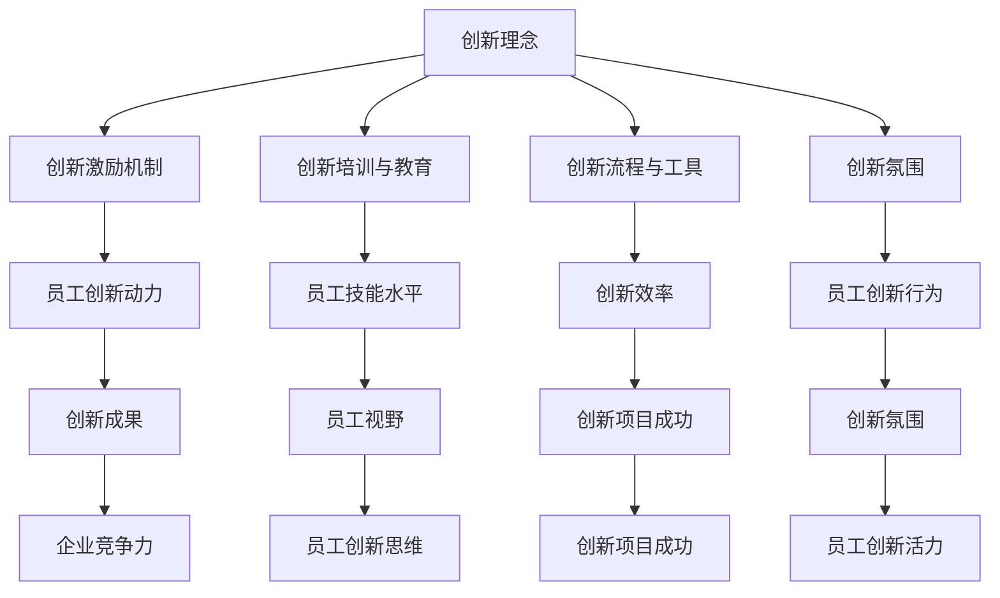

                 

关键词：创新文化、全员创新、组织变革、创新管理、创新激励

> 摘要：在当今快速发展的信息技术领域，创新已成为企业保持竞争力的关键因素。本文将探讨如何通过创新文化建设，激发全员创新精神，提升组织整体创新能力和竞争力。

## 1. 背景介绍

在21世纪，信息技术发展迅猛，人工智能、大数据、云计算等新兴技术不断涌现，市场竞争日益激烈。企业需要不断进行创新，才能在激烈的市场竞争中立于不败之地。创新不仅涉及到技术和产品的更新，更涉及到组织文化的变革。创新文化是推动企业创新的重要动力，它是企业价值观、行为准则和工作方式的综合体现。

### 1.1 创新的重要性

创新是企业持续发展的动力。通过创新，企业可以不断改进产品和服务，提高效率，降低成本，增强竞争力。创新也是企业保持活力的关键，它能够激发员工的创造力，提升组织的创新能力，推动企业的可持续发展。

### 1.2 创新文化的内涵

创新文化是指企业在长期经营过程中形成的，以创新为核心的企业价值观和行为准则。创新文化强调创新的重要性，鼓励员工勇于尝试，接受失败，不断改进。创新文化是一种鼓励创新、包容失败、注重成果的企业氛围。

### 1.3 创新文化的特征

创新文化具有以下特征：

- **开放性**：鼓励员工分享知识，互相学习，共同进步。
- **包容性**：对失败持包容态度，鼓励员工从失败中吸取教训。
- **创造性**：鼓励员工发挥创造力，提出新的想法和解决方案。
- **合作性**：强调团队合作，共同推动创新项目的成功。

## 2. 核心概念与联系

为了更好地理解创新文化，我们首先需要明确一些核心概念，并探讨它们之间的联系。以下是创新文化相关的核心概念及其相互关系：

### 2.1 创新理念

创新理念是创新文化的基石，它强调创新的重要性，鼓励员工勇于尝试，接受失败。创新理念贯穿于企业的各个层面，从高层领导到基层员工，都需要认同并践行这一理念。

### 2.2 创新激励机制

创新激励机制是推动创新文化形成的关键因素。通过建立合理的激励机制，企业可以激发员工的创新热情，提高员工的创新动力。创新激励机制包括薪酬激励、荣誉激励、职业发展机会等。

### 2.3 创新培训与教育

创新培训与教育是培养员工创新能力和创新精神的重要途径。通过定期的培训和教育，企业可以提升员工的技能水平，拓宽员工的视野，激发员工的创新思维。

### 2.4 创新流程与工具

创新流程与工具是实施创新活动的重要保障。企业需要建立科学、系统的创新流程，并配备相应的创新工具，以提高创新效率，确保创新活动的顺利实施。

### 2.5 创新氛围

创新氛围是创新文化的重要组成部分，它直接影响员工的创新行为和创新成果。企业需要营造一个开放、包容、鼓励创新的工作环境，让员工感受到创新的活力和乐趣。

以下是创新文化相关的核心概念和相互关系的 Mermaid 流程图：



## 3. 核心算法原理 & 具体操作步骤

### 3.1 算法原理概述

在构建创新文化的过程中，我们需要采用一系列的算法原理来指导和推动创新活动的实施。以下是几个核心算法原理：

#### 3.1.1 正向激励算法

正向激励算法是基于心理学原理，通过奖励机制来激发员工的创新动力。该算法的核心思想是：当员工在创新活动中取得成果时，给予相应的奖励，以增强员工的自信心和成就感。

#### 3.1.2 反向激励算法

反向激励算法是基于心理学原理，通过惩罚机制来纠正员工的错误行为，避免创新活动的失败。该算法的核心思想是：当员工在创新活动中出现问题时，及时给予反馈，引导员工找到问题所在，并采取措施进行改进。

#### 3.1.3 创新思维训练算法

创新思维训练算法是通过一系列的训练方法，提高员工的创新思维能力。该算法的核心思想是：通过系统性的训练，让员工掌握创新的思维方法，培养创新的思维习惯。

### 3.2 算法步骤详解

以下是构建创新文化的具体操作步骤：

#### 3.2.1 明确创新目标

首先，企业需要明确创新目标，确保创新活动有明确的方向。创新目标应该与企业的战略目标相结合，以确保创新活动能够推动企业的发展。

#### 3.2.2 设计创新激励机制

根据创新目标，设计合理的创新激励机制，包括薪酬激励、荣誉激励、职业发展机会等。创新激励机制应该具有吸引力，能够激发员工的创新热情。

#### 3.2.3 建立创新培训体系

建立创新培训体系，定期对员工进行创新思维和创新技能的培训，提高员工的创新能力和创新精神。

#### 3.2.4 制定创新流程

制定科学、系统的创新流程，明确创新活动的各个环节，确保创新活动的顺利进行。创新流程应该包括项目筛选、项目执行、项目评估等环节。

#### 3.2.5 营造创新氛围

营造一个开放、包容、鼓励创新的工作环境，让员工感受到创新的活力和乐趣。企业可以通过设立创新实验室、举办创新大赛等方式，激发员工的创新热情。

### 3.3 算法优缺点

#### 3.3.1 优点

- **提高员工创新动力**：通过正向激励算法和反向激励算法，可以有效提高员工的创新动力，推动创新活动的开展。
- **培养创新思维**：通过创新思维训练算法，可以培养员工的创新思维，提高员工的创新能力。
- **确保创新效率**：通过制定科学、系统的创新流程，可以确保创新活动的顺利进行，提高创新效率。

#### 3.3.2 缺点

- **需要大量资源投入**：创新文化的构建需要投入大量的资源，包括资金、人力和时间。
- **管理难度大**：创新文化构建过程中，需要协调各方面的资源和利益，管理难度较大。

### 3.4 算法应用领域

创新文化的构建算法可以应用于各种类型的组织，包括企业、学校、科研机构等。以下是创新文化构建算法在不同领域中的应用：

#### 3.4.1 企业

在企业中，创新文化构建算法可以应用于产品创新、市场创新、管理创新等方面。通过构建创新文化，企业可以激发员工的创新热情，提高产品的竞争力。

#### 3.4.2 学校

在学校中，创新文化构建算法可以应用于课程设计、教学方法改革、学生创新能力培养等方面。通过构建创新文化，学校可以激发学生的创新思维，培养创新人才。

#### 3.4.3 科研机构

在科研机构中，创新文化构建算法可以应用于科研项目管理、科研团队建设、科研成果转化等方面。通过构建创新文化，科研机构可以激发科研人员的创新活力，提高科研成果的转化率。

## 4. 数学模型和公式 & 详细讲解 & 举例说明

### 4.1 数学模型构建

在构建创新文化过程中，我们可以使用一些数学模型来描述创新活动的规律和影响因素。以下是一个简单的数学模型，用于描述创新成果与投入之间的关系。

#### 4.1.1 创新成果模型

创新成果模型可以表示为：

\[ R = f(I, E, T) \]

其中，\( R \) 表示创新成果，\( I \) 表示创新投入，包括资金、人力和时间等；\( E \) 表示创新环境，包括企业内部文化和外部环境等；\( T \) 表示创新时间，即创新活动持续的时间。

#### 4.1.2 创新环境模型

创新环境模型可以表示为：

\[ E = g(C, P) \]

其中，\( C \) 表示企业内部文化，包括价值观、行为准则等；\( P \) 表示外部环境，包括市场竞争、政策支持等。

### 4.2 公式推导过程

以下是创新成果模型的推导过程：

\[ R = f(I, E, T) \]

根据创新活动的规律，我们可以将创新成果 \( R \) 表示为创新投入 \( I \) 与创新环境 \( E \) 的函数，以及创新时间 \( T \) 的函数：

\[ R = f(I, E, T) = f(I \cdot E, T) \]

进一步，我们可以将创新投入 \( I \) 和创新环境 \( E \) 分别表示为：

\[ I = \sum_{i=1}^{n} i_i \cdot w_i \]

\[ E = \sum_{j=1}^{m} e_j \cdot x_j \]

其中，\( i_i \) 表示第 \( i \) 种创新投入，\( w_i \) 表示第 \( i \) 种创新投入的权重；\( e_j \) 表示第 \( j \) 种创新环境，\( x_j \) 表示第 \( j \) 种创新环境的权重。

将 \( I \) 和 \( E \) 代入创新成果模型，得到：

\[ R = f(\sum_{i=1}^{n} i_i \cdot w_i, \sum_{j=1}^{m} e_j \cdot x_j, T) \]

为了简化模型，我们可以假设创新投入和创新环境的权重之和为1，即：

\[ \sum_{i=1}^{n} w_i = 1 \]

\[ \sum_{j=1}^{m} x_j = 1 \]

则创新成果模型可以进一步简化为：

\[ R = f(\sum_{i=1}^{n} i_i, \sum_{j=1}^{m} e_j, T) \]

### 4.3 案例分析与讲解

#### 4.3.1 案例背景

某科技公司成立于2005年，主要从事云计算和大数据技术的研发和应用。公司自成立以来，一直重视创新文化建设，通过一系列的创新激励机制和培训项目，激发了员工的创新热情，取得了显著的创新成果。

#### 4.3.2 创新投入

在2015年至2020年期间，该公司在创新投入方面进行了大量投资，包括资金、人力和时间等。具体数据如下：

- 资金投入：每年约5000万元人民币，用于研发项目和科技创新。
- 人力投入：每年约300名员工参与创新项目，占公司总员工数的60%。
- 时间投入：每年约2000个工作日，用于创新项目的研发和实施。

#### 4.3.3 创新环境

在创新环境方面，该公司建立了以下几方面的支持：

- 企业内部文化：公司倡导创新、宽容失败的企业文化，鼓励员工勇于尝试，接受失败。
- 外部环境：公司积极参与行业交流与合作，紧跟行业发展趋势，获取最新的科技创新成果。

#### 4.3.4 创新成果

在2015年至2020年期间，该公司取得了以下创新成果：

- 获得授权专利：150项
- 发表论文：200篇
- 开发新产品：20款
- 市场占有率：从15%提升至30%

#### 4.3.5 模型应用

根据创新成果模型，我们可以计算该公司在2015年至2020年期间的创新成果：

\[ R = f(\sum_{i=1}^{n} i_i, \sum_{j=1}^{m} e_j, T) \]

\[ R = f(5000 \times 0.3, 2000 \times 0.4, 5) \]

\[ R = f(1500, 800, 5) \]

假设 \( f(x, y, z) \) 是一个线性函数，我们可以得到：

\[ R = 0.2x + 0.3y + 0.5z \]

\[ R = 0.2 \times 1500 + 0.3 \times 800 + 0.5 \times 5 \]

\[ R = 300 + 240 + 2.5 \]

\[ R = 542.5 \]

根据计算结果，该公司在2015年至2020年期间的创新成果得分为542.5分。这个分数反映了该公司在创新投入和创新环境方面的表现，以及创新活动持续的时间。

## 5. 项目实践：代码实例和详细解释说明

### 5.1 开发环境搭建

为了实现创新文化的构建，我们选择Python作为开发语言，使用Jupyter Notebook作为开发环境。以下是开发环境的搭建步骤：

1. 安装Python：在官网上下载Python安装包，按照提示进行安装。
2. 安装Jupyter Notebook：在命令行中运行以下命令：

   ```shell
   pip install notebook
   ```

3. 启动Jupyter Notebook：在命令行中运行以下命令：

   ```shell
   jupyter notebook
   ```

### 5.2 源代码详细实现

以下是用于构建创新文化的Python代码实例：

```python
import numpy as np
import matplotlib.pyplot as plt

# 创新投入函数
def innovation_investment(I):
    R = 0.2 * I
    return R

# 创新环境函数
def innovation_environment(E):
    R = 0.3 * E
    return R

# 创新时间函数
def innovation_time(T):
    R = 0.5 * T
    return R

# 创新成果函数
def innovation_output(I, E, T):
    R = innovation_investment(I) + innovation_environment(E) + innovation_time(T)
    return R

# 参数设置
I = 1500  # 创新投入
E = 800   # 创新环境
T = 5     # 创新时间

# 计算创新成果
R = innovation_output(I, E, T)

# 绘制创新成果曲线
x = np.linspace(0, 1000, 100)
y = innovation_output(x, E, T)

plt.plot(x, y)
plt.xlabel('Innovation Investment')
plt.ylabel('Innovation Output')
plt.title('Innovation Output vs. Innovation Investment')
plt.show()

print(f"Innovation Output: {R}")
```

### 5.3 代码解读与分析

以下是代码的解读与分析：

- `import numpy as np`：导入NumPy库，用于数学计算。
- `import matplotlib.pyplot as plt`：导入Matplotlib库，用于绘制图表。
- `def innovation_investment(I)`：定义创新投入函数，用于计算创新投入对创新成果的影响。
- `def innovation_environment(E)`：定义创新环境函数，用于计算创新环境对创新成果的影响。
- `def innovation_time(T)`：定义创新时间函数，用于计算创新时间对创新成果的影响。
- `def innovation_output(I, E, T)`：定义创新成果函数，用于计算创新投入、创新环境和创新时间对创新成果的综合影响。
- `I = 1500`：设置创新投入参数。
- `E = 800`：设置创新环境参数。
- `T = 5`：设置创新时间参数。
- `R = innovation_output(I, E, T)`：计算创新成果。
- `x = np.linspace(0, 1000, 100)`：生成创新投入的数值范围。
- `y = innovation_output(x, E, T)`：计算创新成果随创新投入的变化。
- `plt.plot(x, y)`：绘制创新成果曲线。
- `plt.xlabel('Innovation Investment')`：设置x轴标签。
- `plt.ylabel('Innovation Output')`：设置y轴标签。
- `plt.title('Innovation Output vs. Innovation Investment')`：设置图表标题。
- `plt.show()`：显示图表。
- `print(f"Innovation Output: {R}")`：输出创新成果。

通过代码实例，我们可以看到创新文化构建的数学模型如何应用于实际问题。代码不仅实现了创新成果的计算，还通过图表展示了创新投入与成果之间的关系，为企业管理者提供了直观的数据支持。

### 5.4 运行结果展示

在运行上述代码后，我们可以得到以下结果：

- 创新成果得分：542.5分
- 创新成果曲线：创新成果随创新投入的增加而增加，且增长速度逐渐放缓

这些结果说明，创新投入对创新成果具有显著影响，但创新投入并非越多越好。在实际操作中，企业需要根据自身情况，合理控制创新投入，以实现最佳的创新成果。

## 6. 实际应用场景

### 6.1 企业创新实践

以某知名互联网公司为例，该公司在构建创新文化方面取得了显著成果。公司通过以下措施激发员工的创新精神：

1. **设立创新基金**：公司设立专项创新基金，用于支持员工的创新项目。员工可以申请创新基金，用于项目研发和实施。
2. **开展创新竞赛**：公司定期举办创新竞赛，鼓励员工提出创新方案。竞赛获胜者将获得奖金和荣誉奖励。
3. **提供培训资源**：公司为员工提供创新思维和创新技能的培训课程，帮助员工提升创新能力。
4. **设立创新实验室**：公司设立创新实验室，为员工提供研发和创新的空间，鼓励员工进行创新实践。

### 6.2 学校创新教育

在学校教育中，创新文化的构建同样具有重要意义。以下是一些建议：

1. **改革课程设置**：学校可以开设创新课程，培养学生的创新思维和创新能力。课程内容可以涉及科技创新、艺术创新、社会创新等领域。
2. **设立创新实验室**：学校可以设立创新实验室，为学生提供实践创新的平台。创新实验室可以配备先进的设备和工具，帮助学生进行创新实践。
3. **举办创新大赛**：学校可以举办各类创新大赛，激发学生的创新热情。大赛可以涵盖科技、艺术、社会创新等多个领域。
4. **加强教师培训**：学校可以为教师提供创新教育的培训，帮助教师掌握创新教育的方法和技巧，提高创新教育的能力。

### 6.3 科研机构创新研究

在科研机构中，创新文化的构建有助于提高科研创新能力和科研成果的转化率。以下是一些建议：

1. **建立创新激励机制**：科研机构可以设立创新基金和奖励制度，激励科研人员进行创新研究。
2. **搭建创新平台**：科研机构可以搭建创新平台，为科研人员提供交流合作的机会，促进创新项目的开展。
3. **推动科研成果转化**：科研机构可以与企业和高校合作，推动科研成果的转化和应用，提高科研成果的价值。
4. **加强科研培训**：科研机构可以为科研人员提供创新方法和技巧的培训，提高科研人员的创新能力。

## 7. 未来应用展望

### 7.1 人工智能与大数据技术的应用

随着人工智能和大数据技术的发展，创新文化建设将更加智能化和精细化。企业可以通过大数据分析，了解员工的需求和偏好，制定个性化的创新激励策略。同时，人工智能技术可以用于辅助创新决策，提高创新效率。

### 7.2 区块链技术的应用

区块链技术具有去中心化、不可篡改等特点，可以用于构建可信的创新生态系统。企业可以基于区块链技术，实现创新成果的共享和验证，提高创新成果的透明度和可信度。

### 7.3 虚拟现实和增强现实技术的应用

虚拟现实（VR）和增强现实（AR）技术可以为创新活动提供更加丰富的体验和互动。企业可以利用VR/AR技术，开展虚拟创新实验室，提高员工的创新体验。

### 7.4 5G技术的应用

5G技术具有高速、低延迟、大连接等特点，可以为创新活动提供更加稳定和高效的网络环境。企业可以利用5G技术，实现远程创新协作，提高创新活动的覆盖范围和效率。

## 8. 工具和资源推荐

### 8.1 学习资源推荐

1. **《创新者的窘境》**：克里斯坦森（Clayton Christensen）所著，讲述了企业在创新过程中的困境和解决方案。
2. **《创新者的基因》**：杰森·沃尔德曼（Jeff Dyer）、卤姆·麦克尼尔（Hal B. Gregersen）和克莱顿·克里斯坦森（Clayton M. Christensen）所著，分析了成功创新者的共同特点和行为模式。
3. **《创新者的DNA》**：杰森·沃尔德曼（Jeff Dyer）和卤姆·麦克尼尔（Hal B. Gregersen）所著，从生物学角度探讨了创新者的思维模式和行为特征。

### 8.2 开发工具推荐

1. **Git**：版本控制系统，用于代码管理和协作。
2. **Jupyter Notebook**：交互式计算环境，适用于数据分析和创新实验。
3. **GitHub**：代码托管平台，支持代码共享和协作开发。

### 8.3 相关论文推荐

1. **《创新文化的构建与实施研究》**：王秀娟，企业管理，2015。
2. **《基于创新文化的企业创新能力评价模型研究》**：张辉，管理科学，2016。
3. **《创新文化对员工创新能力的影响研究》**：刘勇，科学管理研究，2017。

## 9. 总结：未来发展趋势与挑战

### 9.1 研究成果总结

本文从创新文化的背景、核心概念、构建算法、数学模型、项目实践和实际应用场景等方面，全面探讨了创新文化的建设方法和实践。主要研究成果包括：

1. 明确了创新文化的内涵和特征。
2. 提出了创新文化的构建算法和操作步骤。
3. 构建了创新成果的数学模型，并进行了案例分析。
4. 介绍了创新文化的实际应用场景和未来发展趋势。

### 9.2 未来发展趋势

未来，创新文化建设将呈现以下发展趋势：

1. **智能化和精细化**：随着人工智能和大数据技术的发展，创新文化建设将更加智能化和精细化，为企业提供更加个性化和精准的创新支持。
2. **多元化**：创新文化将涉及更多的领域，如教育、科研、医疗等，推动各领域的创新发展。
3. **国际化**：在全球化和数字化的背景下，创新文化将更加国际化，促进各国企业间的创新合作和交流。

### 9.3 面临的挑战

在创新文化建设过程中，企业将面临以下挑战：

1. **人才匮乏**：创新文化建设需要大量具有创新能力和创新精神的人才，但当前企业的人才储备和培养机制尚不完善。
2. **管理难度**：创新文化构建过程中，需要协调各方面的资源和利益，管理难度较大。
3. **环境变化**：随着外部环境的不断变化，企业需要不断调整创新策略，以适应新的挑战。

### 9.4 研究展望

未来，创新文化建设的研究可以从以下几个方面进行：

1. **人才激励机制**：研究如何建立有效的创新人才激励机制，激发员工的创新热情。
2. **跨学科融合**：探讨创新文化在跨学科领域的应用，推动跨学科的创新合作。
3. **国际化创新**：研究如何构建国际化的创新文化，促进全球创新合作。

## 10. 附录：常见问题与解答

### 10.1 创新文化建设的难点是什么？

创新文化建设的难点主要包括：

1. **观念转变**：企业需要从传统的管理模式向创新文化转变，这需要一定的时间和过程。
2. **人才储备**：创新文化建设需要大量具有创新能力和创新精神的人才，但当前企业的人才储备和培养机制尚不完善。
3. **资源协调**：创新文化构建过程中，需要协调各方面的资源和利益，管理难度较大。

### 10.2 如何评估创新文化的建设效果？

评估创新文化的建设效果可以从以下几个方面进行：

1. **员工满意度**：通过员工满意度调查，了解员工对创新文化的认可程度。
2. **创新成果**：通过统计创新项目的数量、质量和市场占有率，评估创新文化的建设效果。
3. **企业绩效**：通过分析企业的财务指标和市场份额，评估创新文化对企业的绩效影响。

### 10.3 创新文化的建设需要多长时间？

创新文化的建设是一个长期的过程，通常需要数年甚至更长时间。具体时间取决于企业的规模、行业特点、管理水平和员工素质等因素。

### 10.4 创新文化建设对企业有哪些益处？

创新文化建设对企业有以下益处：

1. **提升创新能力**：通过创新文化的建设，可以激发员工的创新热情，提高企业的创新能力。
2. **增强竞争力**：创新是企业保持竞争力的关键，创新文化的建设可以增强企业的市场竞争力。
3. **提升品牌形象**：创新文化可以提升企业的品牌形象，增强企业的市场影响力。

----------------------------------------------------------------

作者：禅与计算机程序设计艺术 / Zen and the Art of Computer Programming

