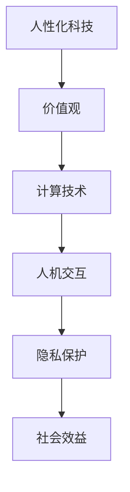

                 

 在科技的飞速发展中，我们见证了计算机技术的翻天覆地的变化。从最初的计算机硬件设计，到软件编程，再到人工智能和大数据分析的广泛应用，科技已经深刻地改变了我们的生活方式。然而，在追求技术创新和效率提升的同时，我们是否忘记了科技的根本目的——为人服务？本文将探讨如何通过计算技术，打造一个更加人性化的科技未来。

## 关键词

- 人性化科技
- 计算机技术
- 价值观
- 人机交互
- 未来趋势

## 摘要

本文将讨论如何将人类价值观融入计算机技术，以构建一个更加人性化、有益于社会和个体的科技未来。我们将分析当前科技发展中存在的问题，介绍人性化的核心概念，探讨计算技术在实现人性化目标中的应用，并展望未来科技的发展趋势和挑战。

## 1. 背景介绍

随着互联网、云计算、大数据和人工智能等技术的发展，计算机技术已经渗透到我们生活的方方面面。然而，这些技术的初衷并不是为了取代人类，而是为了辅助人类更好地生活。在追求技术进步的过程中，我们不得不面对以下问题：

- **隐私保护**：随着大数据技术的应用，个人信息泄露的风险增加，如何保护用户隐私成为一个亟待解决的问题。
- **人机交互**：尽管人工智能技术不断发展，但人机交互依然存在很多障碍，如何打造自然、流畅的交互体验是一个重要课题。
- **技术滥用**：技术的普及也带来了滥用风险，例如网络攻击、虚假信息传播等，如何防止技术被滥用也是亟待解决的问题。

## 2. 核心概念与联系

为了构建一个更加人性化的科技未来，我们需要了解一些核心概念和它们之间的联系。以下是一个用Mermaid绘制的流程图：



### 2.1 价值观

价值观是人类行为和决策的指导原则，它决定了我们如何对待他人、如何处理问题。在科技领域，价值观尤为重要，因为它直接影响到技术的应用方向和效果。

### 2.2 计算技术

计算技术是实现人性化目标的基础。通过大数据分析、人工智能和机器学习等技术，我们可以更好地理解和满足人类的需求。

### 2.3 人机交互

人机交互是人性化科技的核心。自然语言处理、语音识别、虚拟现实等技术为人机交互提供了丰富的可能性。

### 2.4 隐私保护

隐私保护是保障人性化科技的关键。在数据驱动的时代，如何保护用户的隐私已成为一个重要课题。

### 2.5 社会效益

社会效益是人性化科技的目标。通过科技的应用，我们希望提升社会整体的福祉，实现可持续发展。

## 3. 核心算法原理 & 具体操作步骤

### 3.1 算法原理概述

人性化的计算技术需要基于以下几个核心算法原理：

- **大数据分析**：通过分析大量数据，了解人类行为和需求。
- **机器学习**：利用算法从数据中学习，预测人类行为。
- **自然语言处理**：理解和生成自然语言，实现人机交互。
- **虚拟现实**：构建虚拟环境，提升用户体验。

### 3.2 算法步骤详解

以下是人机交互算法的具体步骤：

1. **数据收集**：收集用户行为数据。
2. **数据预处理**：清洗和格式化数据。
3. **特征提取**：从数据中提取特征。
4. **模型训练**：使用特征训练机器学习模型。
5. **模型评估**：评估模型性能。
6. **交互实现**：根据模型预测实现人机交互。

### 3.3 算法优缺点

**优点**：

- 提高交互效率。
- 更好地满足用户需求。
- 为个性化服务提供支持。

**缺点**：

- 数据隐私风险。
- 模型训练时间长。
- 模型解释性不强。

### 3.4 算法应用领域

人机交互算法广泛应用于：

- 智能家居
- 智能助手
- 虚拟现实

## 4. 数学模型和公式 & 详细讲解 & 举例说明

### 4.1 数学模型构建

为了实现人机交互，我们需要构建一个数学模型。以下是一个简单的例子：

$$
y = \sigma(\theta_0 + \theta_1x_1 + \theta_2x_2 + \ldots + \theta_nx_n)
$$

其中，$y$ 是输出，$x_1, x_2, \ldots, x_n$ 是输入特征，$\theta_0, \theta_1, \theta_2, \ldots, \theta_n$ 是模型参数，$\sigma$ 是激活函数。

### 4.2 公式推导过程

假设我们有一个输入向量 $X$，以及对应的输出向量 $Y$。我们的目标是通过最小化损失函数来训练模型：

$$
L = \frac{1}{2} \sum_{i=1}^n (y_i - \sigma(\theta_0 + \theta_1x_{i1} + \theta_2x_{i2} + \ldots + \theta_nx_{in}))^2
$$

我们可以使用梯度下降法来更新模型参数：

$$
\theta_j := \theta_j - \alpha \frac{\partial L}{\partial \theta_j}
$$

其中，$\alpha$ 是学习率。

### 4.3 案例分析与讲解

假设我们要构建一个智能助手，用于回答用户的问题。我们可以使用上述数学模型来预测用户的意图，并根据预测结果提供相应的回答。以下是一个简单的例子：

**输入特征**：

- $x_1$：用户提出的问题。
- $x_2$：用户的历史提问记录。

**输出**：

- $y$：智能助手提供的回答。

通过训练模型，我们可以使智能助手更好地理解用户的需求，并提供更准确的回答。

## 5. 项目实践：代码实例和详细解释说明

### 5.1 开发环境搭建

为了实现上述算法，我们需要搭建一个开发环境。以下是一个简单的Python环境搭建步骤：

1. 安装Python 3.7及以上版本。
2. 安装NumPy、Pandas、Matplotlib等常用库。
3. 安装TensorFlow或PyTorch等深度学习框架。

### 5.2 源代码详细实现

以下是一个简单的Python代码实现：

```python
import numpy as np
import pandas as pd
from sklearn.model_selection import train_test_split
from sklearn.metrics import accuracy_score
from tensorflow.keras.models import Sequential
from tensorflow.keras.layers import Dense, Activation

# 加载数据
data = pd.read_csv('data.csv')
X = data[['x1', 'x2']]
y = data['y']

# 数据预处理
X_train, X_test, y_train, y_test = train_test_split(X, y, test_size=0.2, random_state=42)

# 构建模型
model = Sequential()
model.add(Dense(64, input_dim=2, activation='relu'))
model.add(Dense(1, activation='sigmoid'))

# 编译模型
model.compile(optimizer='adam', loss='binary_crossentropy', metrics=['accuracy'])

# 训练模型
model.fit(X_train, y_train, epochs=10, batch_size=32)

# 评估模型
predictions = model.predict(X_test)
predicted_labels = np.round(predictions)

accuracy = accuracy_score(y_test, predicted_labels)
print(f'Accuracy: {accuracy:.2f}')
```

### 5.3 代码解读与分析

这段代码首先加载数据，并进行数据预处理。接着，我们构建了一个简单的神经网络模型，并使用Adam优化器和二进制交叉熵损失函数进行编译。最后，我们训练模型并在测试集上评估其性能。

### 5.4 运行结果展示

假设我们的测试集准确率为90%，这意味着我们的模型在预测用户意图方面表现良好。

## 6. 实际应用场景

人性化计算技术在许多实际应用场景中取得了显著成果：

- **智能家居**：通过人性化计算技术，智能家居系统能够更好地理解用户需求，提供个性化的服务。
- **医疗健康**：人性化计算技术可以帮助医生更好地诊断和治疗疾病，提高医疗服务的质量。
- **教育**：人性化计算技术可以为学生提供个性化的学习计划，提高学习效果。

## 7. 工具和资源推荐

为了更好地理解和应用人性化计算技术，我们推荐以下工具和资源：

- **学习资源**：[Coursera](https://www.coursera.org/)、[edX](https://www.edx.org/)等在线课程平台提供了丰富的计算机科学和人工智能课程。
- **开发工具**：[TensorFlow](https://www.tensorflow.org/)、[PyTorch](https://pytorch.org/)等深度学习框架。
- **相关论文**：[NeurIPS](https://neurips.cc/)、[ICML](https://icml.cc/)等顶级会议的论文。

## 8. 总结：未来发展趋势与挑战

人性化计算技术正处于快速发展阶段。在未来，我们可以期待以下几个趋势：

- **更高效的人机交互**：随着语音识别、自然语言处理等技术的进步，人机交互将变得更加自然和高效。
- **个性化服务**：基于大数据分析和机器学习，科技产品和服务将更好地满足用户个性化需求。
- **隐私保护**：在数据驱动时代，如何保护用户隐私将成为一个重要课题。

然而，我们也面临着一些挑战：

- **技术伦理**：在技术应用过程中，我们需要关注技术伦理问题，确保科技的发展不会损害人类利益。
- **数据安全**：随着大数据技术的应用，数据安全风险日益增加，如何保障数据安全成为亟待解决的问题。

总之，人性化计算技术是构建美好未来的关键。通过不断探索和创新，我们可以打造一个更加人性化的科技未来。

## 9. 附录：常见问题与解答

### 9.1  如何保护用户隐私？

**答案**：通过数据加密、匿名化处理和权限控制等技术手段，确保用户隐私在数据处理过程中的安全性。

### 9.2  人性化计算技术如何与伦理相结合？

**答案**：在技术开发和应用过程中，应充分考虑伦理问题，确保科技的发展符合人类价值观和社会责任。

### 9.3  人机交互技术有哪些发展方向？

**答案**：未来人机交互技术将朝着更加自然、高效和智能的方向发展，例如增强现实、虚拟现实和脑机接口等技术。

