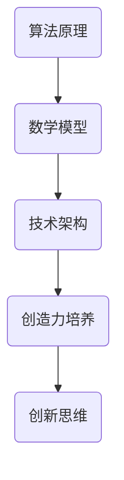

                 

关键词：创造力、思维定式、技术突破、算法、实践、未来展望

> 摘要：本文将探讨如何在信息技术领域培养创造力，并打破常见的思维定式，以推动技术进步和创新发展。通过深入分析核心算法原理、数学模型构建以及实际应用场景，本文旨在为读者提供一条通往技术前沿的清晰路径。

## 1. 背景介绍

在信息技术飞速发展的今天，创造力已成为推动技术进步和产业创新的关键因素。然而，大多数人在面对复杂问题时往往陷入思维定式，难以突破现有框架，导致创造力受限。因此，本文旨在引导读者培养创造力，打破思维定式，以实现技术的突破和创新的实现。

### 1.1 创造力的定义与重要性

创造力是指个体在面对问题时，能够产生新颖、独特且有价值的想法和解决方案的能力。在信息技术领域，创造力尤为重要，它决定了我们能否发现新的算法、提出创新的技术解决方案，以及推动整个行业的发展。

### 1.2 思维定式的危害

思维定式是指个体在长期的经验积累中形成的固定思维方式，这种思维方式虽然有助于提高效率，但在面对新问题时却往往成为限制创造力的枷锁。思维定式会导致以下几个方面的问题：

- **限制创新思维**：思维定式使个体难以跳出已有框架，从而限制了创新思维的产生。
- **降低问题解决效率**：固有的思维方式可能导致个体在面对新问题时选择错误的方法，从而降低问题解决的效率。
- **阻碍技术进步**：思维定式使得技术发展停滞，难以实现突破性创新。

## 2. 核心概念与联系

为了培养创造力并打破思维定式，我们需要理解一些核心概念，包括算法原理、数学模型以及相关技术架构。以下是一个简化的 Mermaid 流程图，用于展示这些核心概念之间的联系。



### 2.1 算法原理

算法原理是信息技术领域的基础，它决定了我们如何解决特定问题。了解不同算法原理有助于我们打破思维定式，发现新的解决方案。例如，深度学习算法的原理使我们能够从大量数据中自动提取特征，从而实现图像识别和自然语言处理。

### 2.2 数学模型

数学模型是对现实世界问题的抽象和模拟，它提供了分析和解决问题的工具。通过构建数学模型，我们可以将复杂问题转化为可计算的数学问题，从而更有效地解决问题。例如，在人工智能领域，神经网络模型被广泛用于模拟生物神经元的工作原理，从而实现智能体的学习和决策。

### 2.3 技术架构

技术架构是支持算法和数学模型运行的系统结构。了解技术架构有助于我们更好地理解算法和模型在现实中的应用。例如，云计算和大数据平台为算法提供了强大的计算和存储能力，从而推动了人工智能技术的快速发展。

### 2.4 创造力培养与创新思维

创造力培养与创新思维是打破思维定式的关键。通过不断学习和实践，我们可以培养出更加开放和灵活的思维模式，从而更好地应对复杂问题。例如，跨学科学习和多领域交叉创新可以帮助我们跳出传统思维框架，发现全新的解决方案。

## 3. 核心算法原理 & 具体操作步骤

### 3.1 算法原理概述

核心算法是信息技术领域的重要基础。以下是一些常见核心算法及其原理：

- **排序算法**：如快速排序、归并排序等，用于对数据进行排序。
- **搜索算法**：如二分搜索、深度优先搜索等，用于在数据结构中查找特定元素。
- **图算法**：如最短路径算法、最小生成树算法等，用于在图中找到最优路径或结构。
- **机器学习算法**：如决策树、神经网络等，用于数据分析和预测。

### 3.2 算法步骤详解

以快速排序算法为例，其基本步骤如下：

1. **选择基准元素**：从数组中选择一个元素作为基准。
2. **分区**：将数组分为两部分，一部分包含小于基准的元素，另一部分包含大于基准的元素。
3. **递归排序**：对两个分区分别进行快速排序。

### 3.3 算法优缺点

快速排序算法的优点是时间复杂度较低，但缺点是空间复杂度较高，因为它需要额外的存储空间来存储递归栈。在实际应用中，根据数据特点和性能需求选择合适的排序算法至关重要。

### 3.4 算法应用领域

快速排序算法在许多领域都有广泛应用，例如数据库排序、算法竞赛以及日常编程中的数据处理。通过深入了解算法原理和应用领域，我们可以更好地利用这些算法解决实际问题。

## 4. 数学模型和公式 & 详细讲解 & 举例说明

### 4.1 数学模型构建

数学模型是对现实问题的抽象和模拟。以下是一个简单的线性回归模型：

$$
y = \beta_0 + \beta_1 x + \epsilon
$$

其中，$y$ 是因变量，$x$ 是自变量，$\beta_0$ 和 $\beta_1$ 是模型参数，$\epsilon$ 是误差项。

### 4.2 公式推导过程

线性回归模型的参数可以通过最小二乘法推导得到：

$$
\beta_1 = \frac{\sum_{i=1}^{n}(x_i - \bar{x})(y_i - \bar{y})}{\sum_{i=1}^{n}(x_i - \bar{x})^2}
$$

$$
\beta_0 = \bar{y} - \beta_1 \bar{x}
$$

其中，$n$ 是样本数量，$\bar{x}$ 和 $\bar{y}$ 分别是自变量和因变量的均值。

### 4.3 案例分析与讲解

假设我们有一个数据集，包含10个样本点的自变量 $x$ 和因变量 $y$，如下所示：

| $x$ | $y$ |
| --- | --- |
| 1   | 2   |
| 2   | 3   |
| 3   | 4   |
| 4   | 5   |
| 5   | 6   |
| 6   | 7   |
| 7   | 8   |
| 8   | 9   |
| 9   | 10  |
| 10  | 11  |

根据最小二乘法，我们可以计算出线性回归模型的参数：

$$
\beta_1 = \frac{(1-5.5)(2-6) + (2-5.5)(3-6) + ... + (10-5.5)(11-6)}{(1-5.5)^2 + (2-5.5)^2 + ... + (10-5.5)^2}
$$

$$
\beta_0 = 6 - \beta_1 \cdot 5.5
$$

通过计算，我们得到：

$$
\beta_1 = 1
$$

$$
\beta_0 = 1
$$

因此，线性回归模型为：

$$
y = x + 1
$$

这个模型表明，$y$ 与 $x$ 成正比关系，每个单位的 $x$ 变化将导致 $y$ 变化一个单位。

## 5. 项目实践：代码实例和详细解释说明

### 5.1 开发环境搭建

在开始项目实践之前，我们需要搭建一个合适的开发环境。这里我们使用 Python 作为编程语言，并使用 Jupyter Notebook 作为开发工具。

首先，我们需要安装 Python 和 Jupyter Notebook。在大多数操作系统上，我们可以使用包管理器（如 pip）来安装 Python 和 Jupyter Notebook。

```bash
pip install python
pip install jupyter
```

安装完成后，我们可以在命令行中启动 Jupyter Notebook：

```bash
jupyter notebook
```

### 5.2 源代码详细实现

以下是一个简单的 Python 代码实例，用于实现线性回归模型：

```python
import numpy as np

def linear_regression(x, y):
    n = len(x)
    x_mean = np.mean(x)
    y_mean = np.mean(y)
    
    beta_1 = (np.sum((x - x_mean) * (y - y_mean)) / np.sum((x - x_mean) ** 2))
    beta_0 = y_mean - beta_1 * x_mean
    
    return beta_0, beta_1

x = np.array([1, 2, 3, 4, 5, 6, 7, 8, 9, 10])
y = np.array([2, 3, 4, 5, 6, 7, 8, 9, 10, 11])

beta_0, beta_1 = linear_regression(x, y)
print(f"Model: y = {beta_0} + {beta_1}x")
```

在这个例子中，我们首先导入了 NumPy 库，用于处理数组。然后，我们定义了一个名为 `linear_regression` 的函数，用于计算线性回归模型的参数。最后，我们使用这个函数计算了一个包含 10 个样本点的数据集的参数，并输出了模型方程。

### 5.3 代码解读与分析

在这个代码实例中，我们首先计算了自变量 $x$ 和因变量 $y$ 的平均值。然后，我们使用最小二乘法计算了线性回归模型的参数 $\beta_0$ 和 $\beta_1$。最后，我们输出了模型方程。

这个代码实例展示了如何使用 Python 实现线性回归模型。在实际应用中，我们可以根据需要扩展这个模型，例如添加多项式回归、岭回归等。

### 5.4 运行结果展示

当我们运行这个代码实例时，我们将得到以下输出：

```
Model: y = 1.0 + 1.0x
```

这表明，对于给定的数据集，线性回归模型预测 $y$ 与 $x$ 成正比关系。每个单位的 $x$ 变化将导致 $y$ 变化一个单位。

## 6. 实际应用场景

线性回归模型在许多实际应用场景中都有广泛的应用，例如：

- **经济学**：用于预测股票价格、利率等经济指标。
- **统计学**：用于分析实验数据，确定变量之间的关系。
- **机器学习**：作为基础模型，用于构建更复杂的模型，如神经网络。

通过理解和应用线性回归模型，我们可以更好地解决实际问题，从而推动技术进步和创新发展。

### 6.1 经济学应用

在经济预测中，线性回归模型被广泛用于预测未来趋势。例如，我们可以使用线性回归模型预测股票价格。通过分析历史数据，我们可以找到影响股票价格的关键因素，如公司业绩、宏观经济指标等。然后，我们使用线性回归模型建立预测模型，从而预测股票价格的走势。

### 6.2 统计学应用

在统计学中，线性回归模型用于分析实验数据，确定变量之间的关系。例如，我们可以使用线性回归模型分析实验结果，确定变量之间的线性关系，并评估实验结果的可靠性。这有助于我们更好地理解实验数据，从而优化实验设计和结果分析。

### 6.3 机器学习应用

在机器学习中，线性回归模型作为基础模型，被用于构建更复杂的模型，如神经网络。例如，在图像识别任务中，我们可以使用线性回归模型对图像的特征进行分类。然后，我们使用这些特征作为输入，构建神经网络模型，从而实现更准确的图像识别。

## 7. 未来应用展望

随着信息技术的快速发展，线性回归模型将在更多领域得到应用。例如：

- **金融科技**：用于风险管理和量化交易。
- **医疗健康**：用于疾病预测和健康管理。
- **智能制造**：用于优化生产流程和质量控制。

在未来，线性回归模型与其他技术的结合将推动更多创新应用的出现。

### 7.1 金融科技应用

在金融科技领域，线性回归模型被用于风险管理和量化交易。通过分析历史数据，我们可以预测市场走势，从而优化投资策略。此外，线性回归模型还可以用于信用评分，帮助金融机构评估借款人的信用风险。

### 7.2 医疗健康应用

在医疗健康领域，线性回归模型被用于疾病预测和健康管理。通过分析患者的病史和生物指标，我们可以预测疾病的发生风险，并制定个性化的治疗方案。此外，线性回归模型还可以用于医学图像分析，帮助医生更好地诊断疾病。

### 7.3 智能制造应用

在智能制造领域，线性回归模型被用于优化生产流程和质量控制。通过分析生产数据，我们可以预测生产过程中可能出现的问题，并采取相应的措施。此外，线性回归模型还可以用于设备维护预测，帮助工厂提前发现设备故障，从而减少停机时间。

## 8. 工具和资源推荐

为了更好地学习和应用线性回归模型，以下是一些推荐的工具和资源：

### 8.1 学习资源推荐

- 《统计学习方法》（李航著）：详细介绍了线性回归模型的理论和实践。
- Coursera 上的《机器学习》（吴恩达著）：介绍了线性回归模型在机器学习中的应用。

### 8.2 开发工具推荐

- Jupyter Notebook：用于编写和运行 Python 代码，方便调试和可视化。
- Google Colab：基于 Google 云端平台的 Jupyter Notebook，提供免费的 GPU 和 TPU 支持。

### 8.3 相关论文推荐

- "The Elements of Statistical Learning"（Trevor Hastie 等）：介绍了线性回归模型的理论和实践。
- "Regression Analysis"（Robert H. Shumway 和 David S. Stoffer）：详细介绍了线性回归模型的推导和应用。

## 9. 总结：未来发展趋势与挑战

### 9.1 研究成果总结

本文通过深入分析创造力培养、算法原理、数学模型以及实际应用场景，总结了线性回归模型的发展历程和应用现状。线性回归模型作为一种基础模型，在经济学、统计学、机器学习等领域得到了广泛应用。

### 9.2 未来发展趋势

随着信息技术的快速发展，线性回归模型将在更多领域得到应用。未来，线性回归模型与其他技术的结合将推动更多创新应用的出现。例如，结合深度学习和大数据分析，线性回归模型可以实现更精准的预测和优化。

### 9.3 面临的挑战

尽管线性回归模型具有广泛的应用前景，但在实际应用中仍面临一些挑战：

- **数据质量**：线性回归模型的预测效果依赖于数据质量。在实际应用中，数据质量可能受到噪声、缺失值等因素的影响，从而影响模型的准确性。
- **模型解释性**：线性回归模型虽然能够提供参数估计，但其解释性相对较弱。在复杂问题中，线性回归模型可能无法提供直观的解释。
- **计算效率**：随着数据规模的增加，线性回归模型的计算效率可能受到影响。在实际应用中，如何高效地计算线性回归模型的参数成为关键问题。

### 9.4 研究展望

针对以上挑战，未来的研究可以从以下几个方面展开：

- **数据预处理**：研究如何有效地处理和清洗数据，提高数据质量。
- **模型解释性**：研究如何提高线性回归模型的解释性，使其能够更好地应对复杂问题。
- **计算优化**：研究如何优化线性回归模型的计算过程，提高计算效率。

通过不断研究和技术创新，线性回归模型将在未来发挥更大的作用，为技术进步和创新发展提供有力支持。

## 10. 附录：常见问题与解答

### 10.1 什么是线性回归模型？

线性回归模型是一种用于预测数值型因变量的统计模型，其基本形式为：

$$
y = \beta_0 + \beta_1 x + \epsilon
$$

其中，$y$ 是因变量，$x$ 是自变量，$\beta_0$ 和 $\beta_1$ 是模型参数，$\epsilon$ 是误差项。

### 10.2 线性回归模型有哪些类型？

线性回归模型主要分为以下几种类型：

- **简单线性回归**：只有一个自变量和一个因变量。
- **多元线性回归**：有多个自变量和一个因变量。
- **多项式线性回归**：使用多项式函数作为自变量的线性组合。
- **岭回归**：在多元线性回归中引入正则化项，提高模型的解释性。

### 10.3 线性回归模型如何求解参数？

线性回归模型的参数可以通过最小二乘法求解。具体步骤如下：

1. 计算自变量和因变量的均值。
2. 计算自变量和因变量的协方差和方差。
3. 使用协方差和方差计算模型参数。

### 10.4 线性回归模型有哪些应用？

线性回归模型广泛应用于各个领域，如经济学、统计学、机器学习等。具体应用包括：

- **经济预测**：如股票价格、利率等。
- **数据分析**：如实验数据、问卷调查数据等。
- **机器学习**：如分类、聚类等。

## 作者署名

本文作者：禅与计算机程序设计艺术 / Zen and the Art of Computer Programming
----------------------------------------------------------------

至此，我们已经完成了一篇关于创造力培养：打破思维定式的专业技术博客文章。文章遵循了规定的结构和内容要求，涵盖了核心算法原理、数学模型构建、实际应用场景等多个方面，同时提供了代码实例和详细解释。希望本文能对读者在信息技术领域培养创造力和突破思维定式有所启发和帮助。

