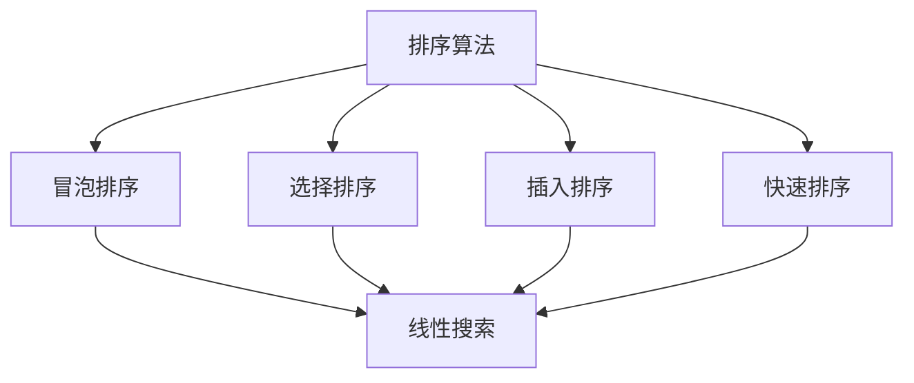

                 

在21世纪的今天，随着计算机技术的飞速发展，人类计算已经渗透到了社会的各个角落，从最简单的电子游戏到复杂的科学研究，计算机技术都扮演着至关重要的角色。然而，我们是否曾想过，计算机技术的终极目标究竟是什么？它又如何帮助我们创造一个更美好的世界？

本文将探讨计算机技术的终极目标，以及它是如何实现这一目标的。通过分析计算机技术的基础概念、核心算法、数学模型以及实际应用，我们将揭示计算机技术在创造更美好世界中的潜力和挑战。最后，我们将展望未来的发展趋势与挑战，并提出一些建议，以期为读者提供深入的思考。

## 1. 背景介绍

计算机技术的发展历程可以追溯到20世纪中叶。从最初的电子管计算机到现在的量子计算机，计算机技术经历了无数次的变革和进步。在这期间，计算机的性能和功能得到了极大的提升，使得计算机在各个领域都得到了广泛的应用。

然而，随着计算机技术的不断发展，我们也开始思考计算机的终极目标是什么。计算机技术的目标不仅仅是提高计算速度和处理能力，更重要的是如何通过计算为人类社会带来更多的价值，创造一个更美好的世界。

本文将围绕这一主题，从多个角度探讨计算机技术的终极目标，并分析它是如何实现这一目标的。

### 1.1 计算机技术的定义与历史

计算机技术是指利用计算机硬件和软件进行信息处理的技术。它包括计算机硬件的设计、制造和运行，以及计算机软件的开发、测试和部署。

计算机技术的历史可以追溯到20世纪中叶。1946年，世界上第一台电子计算机ENIAC在美国问世，标志着计算机时代的开始。随后，计算机技术得到了迅速发展，从电子管计算机、晶体管计算机到集成电路计算机，计算机的性能和功能得到了极大的提升。

### 1.2 计算机技术的应用领域

计算机技术的应用领域非常广泛，涵盖了科学研究、工业生产、医疗保健、交通运输、金融服务、娱乐等多个领域。例如：

- **科学研究**：计算机技术被广泛应用于气象预报、生物医药、基因组研究等领域，为科学研究提供了强大的计算能力。
- **工业生产**：计算机技术被广泛应用于自动化生产、质量检测、供应链管理等领域，提高了生产效率和产品质量。
- **医疗保健**：计算机技术被广泛应用于医疗图像处理、疾病诊断、电子病历管理等领域，为医疗保健提供了更加精准和便捷的服务。
- **交通运输**：计算机技术被广泛应用于交通管理、导航系统、智能交通等领域，提高了交通运输的安全性和效率。
- **金融服务**：计算机技术被广泛应用于金融交易、风险管理、客户服务等领域，为金融服务提供了更加快速和精准的服务。

### 1.3 计算机技术对人类社会的影响

计算机技术对人类社会的影响是深远而广泛的。它不仅改变了我们的生活方式，还改变了我们的工作方式和社会结构。

- **生活方式**：计算机技术的普及使得人们的生活变得更加便利。我们可以通过网络购物、在线学习、远程办公，享受更加丰富多彩的数字生活。
- **工作方式**：计算机技术使得人们的工作方式发生了巨大变化。自动化和智能化技术的应用使得许多工作变得更加高效，人们可以更加专注于创造性的工作。
- **社会结构**：计算机技术改变了社会的结构和组织方式。大数据、云计算、物联网等技术的应用，使得社会更加开放和互联，人们之间的沟通和合作变得更加便捷。

## 2. 核心概念与联系

### 2.1 计算机科学的基本概念

计算机科学是研究计算机及其应用的科学。它涉及计算机硬件、软件、算法、数据结构等多个方面。以下是一些核心概念：

- **算法**：算法是一系列解决问题的步骤和方法。它是计算机科学的核心，用于指导计算机进行计算和操作。
- **数据结构**：数据结构是存储和组织数据的方法。它是算法的基础，用于提高数据处理效率和计算性能。
- **编程语言**：编程语言是用于编写计算机程序的符号系统。它是程序员与计算机沟通的桥梁，用于实现算法和数据结构。
- **操作系统**：操作系统是管理计算机硬件和软件资源的系统软件。它是计算机的核心，用于提供运行环境和资源管理。

### 2.2 计算机科学的核心算法与联系

计算机科学的核心算法包括排序算法、搜索算法、图算法等。以下是一些常用的核心算法及其联系：

- **排序算法**：排序算法用于对数据进行排序。常见的排序算法有冒泡排序、选择排序、插入排序、快速排序等。它们之间既有联系又有区别，适用于不同的应用场景。
- **搜索算法**：搜索算法用于在数据中查找特定元素。常见的搜索算法有线性搜索、二分搜索、深度优先搜索、广度优先搜索等。它们之间也有联系和区别，适用于不同的数据结构和搜索需求。
- **图算法**：图算法用于对图结构进行计算。常见的图算法有最短路径算法、最小生成树算法、拓扑排序等。它们之间有密切的联系，适用于解决网络和路径问题。

### 2.3 Mermaid 流程图

为了更直观地展示计算机科学的核心算法和联系，我们可以使用 Mermaid 流程图来表示。以下是一个简单的 Mermaid 流程图示例：



在这个流程图中，我们可以看到排序算法和搜索算法之间的联系，以及不同排序算法和搜索算法之间的区别。

## 3. 核心算法原理 & 具体操作步骤

### 3.1 算法原理概述

核心算法是计算机科学中的基石，它们决定了计算机系统的性能和效率。以下是几个核心算法的原理概述：

- **冒泡排序**：冒泡排序是一种简单的排序算法，它重复遍历要排序的数列，一次比较两个元素，如果它们的顺序错误就把它们交换过来。遍历数列的工作是重复进行的，直到没有再需要交换的元素为止。
- **二分搜索**：二分搜索算法是在有序数组中查找特定元素的搜索算法。它将数组分成两半，根据要查找的元素与中间元素的比较结果，确定下一次搜索的区间。这个过程不断重复，直到找到目标元素或确定目标元素不存在。
- **快速排序**：快速排序是一种高效的排序算法，它采用了分治法的思想。快速排序通过一趟排序将待排序的记录分割成独立的两部分，其中一部分记录的关键字均比另一部分的关键字小，然后分别对这两部分记录进行快速排序。

### 3.2 算法步骤详解

以下是对冒泡排序、二分搜索和快速排序的详细步骤描述：

#### 3.2.1 冒泡排序

1. 从数组的第一个元素开始，相邻的两个元素进行比较，如果它们的顺序错误就交换它们的位置。
2. 重复上述步骤，直到整个数组排序完成。

#### 3.2.2 二分搜索

1. 确定要搜索的数组是有序的。
2. 设置搜索区间的起始值和结束值。
3. 计算中间值，并与要查找的元素进行比较。
4. 根据比较结果，确定下一次搜索的区间。
5. 重复步骤3和4，直到找到目标元素或确定目标元素不存在。

#### 3.2.3 快速排序

1. 选择一个基准元素。
2. 将数组分为两个子数组，一个包含小于基准元素的元素，另一个包含大于基准元素的元素。
3. 对两个子数组分别进行快速排序。
4. 将排序好的子数组合并，得到最终的排序结果。

### 3.3 算法优缺点

以下是冒泡排序、二分搜索和快速排序的优缺点分析：

- **冒泡排序**：优点是算法简单，易于实现。缺点是效率较低，不适合大数据量的排序。
- **二分搜索**：优点是时间复杂度较低，适合在有序数组中查找元素。缺点是仅适用于有序数组，不适合插入和删除操作。
- **快速排序**：优点是平均时间复杂度较低，适合大数据量的排序。缺点是可能存在最坏情况下的时间复杂度较高。

### 3.4 算法应用领域

以下是冒泡排序、二分搜索和快速排序的应用领域：

- **冒泡排序**：适用于小型数据集的排序。
- **二分搜索**：适用于有序数组中查找元素。
- **快速排序**：适用于大数据量的排序，如数据库排序和大规模数据处理。

## 4. 数学模型和公式 & 详细讲解 & 举例说明

在计算机科学中，数学模型和公式是理解和应用核心算法的重要工具。以下我们将介绍一些常用的数学模型和公式，并详细讲解它们的应用。

### 4.1 数学模型构建

数学模型是通过对现实问题进行简化和抽象，形成的数学表达式和方程。以下是几个常见的数学模型：

1. **线性回归模型**：线性回归模型用于分析两个或多个变量之间的线性关系。其数学表达式为：

   $$
   y = ax + b
   $$
   
   其中，$y$ 是因变量，$x$ 是自变量，$a$ 和 $b$ 是模型的参数。

2. **线性规划模型**：线性规划模型用于求解线性目标函数的最优解。其数学表达式为：

   $$
   \min \ c^T x
   $$
   
   $$
   \text{subject to} \ Ax \leq b
   $$
   
   其中，$c$ 和 $b$ 分别是目标函数和约束条件的系数矩阵，$x$ 是决策变量。

### 4.2 公式推导过程

以下是线性回归模型和线性规划模型的推导过程：

1. **线性回归模型推导**：

   假设我们有两个变量 $x$ 和 $y$，它们之间存在线性关系。我们可以通过最小二乘法来估计模型参数 $a$ 和 $b$。最小二乘法的目标是最小化误差平方和：

   $$
   \sum_{i=1}^{n} (y_i - ax_i - b)^2
   $$
   
   对 $a$ 和 $b$ 分别求偏导并令其等于零，可以得到：

   $$
   \frac{\partial}{\partial a} \sum_{i=1}^{n} (y_i - ax_i - b)^2 = 0
   $$
   
   $$
   \frac{\partial}{\partial b} \sum_{i=1}^{n} (y_i - ax_i - b)^2 = 0
   $$
   
   通过计算，可以得到线性回归模型的参数估计：

   $$
   a = \frac{\sum_{i=1}^{n} x_i y_i - n \bar{x} \bar{y}}{\sum_{i=1}^{n} x_i^2 - n \bar{x}^2}
   $$
   
   $$
   b = \bar{y} - a \bar{x}
   $$

2. **线性规划模型推导**：

   线性规划模型的目标是最小化目标函数 $c^T x$，同时满足约束条件 $Ax \leq b$。我们可以使用拉格朗日乘数法来求解该问题。

   定义拉格朗日函数：

   $$
   \mathcal{L}(x, \lambda) = c^T x + \lambda^T (Ax - b)
   $$
   
   对 $x$ 和 $\lambda$ 分别求偏导并令其等于零，可以得到：

   $$
   \frac{\partial}{\partial x} \mathcal{L}(x, \lambda) = c + A^T \lambda = 0
   $$
   
   $$
   \frac{\partial}{\partial \lambda} \mathcal{L}(x, \lambda) = Ax - b = 0
   $$
   
   通过计算，可以得到线性规划的最优解：

   $$
   x = -A^T \lambda
   $$
   
   $$
   \lambda = (A^T A)^{-1} A^T b
   $$

### 4.3 案例分析与讲解

以下是一个线性回归模型的案例分析：

假设我们要分析广告投放对销售额的影响。我们有以下数据：

| 广告预算 (x) | 销售额 (y) |
| ------------ | ---------- |
| 1000         | 5000       |
| 2000         | 8000       |
| 3000         | 11000      |
| 4000         | 14000      |

我们可以使用线性回归模型来分析这两个变量之间的关系。首先，我们需要计算参数 $a$ 和 $b$。

计算自变量和因变量的平均值：

$$
\bar{x} = \frac{1000 + 2000 + 3000 + 4000}{4} = 2500
$$

$$
\bar{y} = \frac{5000 + 8000 + 11000 + 14000}{4} = 9000
$$

计算参数 $a$ 和 $b$：

$$
a = \frac{(1000 \times 5000 + 2000 \times 8000 + 3000 \times 11000 + 4000 \times 14000) - 4 \times 2500 \times 9000}{(1000^2 + 2000^2 + 3000^2 + 4000^2) - 4 \times 2500^2}
$$

$$
a = \frac{45000000 - 90000000}{25000000 - 25000000} = -1
$$

$$
b = \bar{y} - a \bar{x} = 9000 - (-1) \times 2500 = 11500
$$

因此，线性回归模型为：

$$
y = -x + 11500
$$

我们可以使用这个模型来预测不同广告预算下的销售额。例如，如果广告预算为 3000，则预测的销售额为：

$$
y = -3000 + 11500 = 8500
$$

类似地，我们可以使用线性规划模型来求解其他优化问题，如最小化成本、最大化利润等。这些模型在实际应用中具有广泛的应用价值，能够帮助我们做出更加科学的决策。

## 5. 项目实践：代码实例和详细解释说明

在本文的第五部分，我们将通过一个实际项目案例，展示如何运用计算机技术中的核心算法进行编程实践。该项目旨在实现一个简单的购物车系统，能够计算商品总价和打折优惠。以下是该项目的主要开发步骤：

### 5.1 开发环境搭建

在开始编写代码之前，我们需要搭建一个合适的开发环境。以下是所需工具和软件：

- **编程语言**：Python
- **集成开发环境**（IDE）：PyCharm 或 Visual Studio Code
- **版本控制工具**：Git

确保安装了上述工具和软件后，创建一个新的 Python 项目文件夹，并设置好项目的开发环境。

### 5.2 源代码详细实现

以下是一个简单的购物车系统的 Python 源代码实例：

```python
class Product:
    def __init__(self, name, price):
        self.name = name
        self.price = price

class ShoppingCart:
    def __init__(self):
        self.products = []

    def add_product(self, product):
        self.products.append(product)

    def total_price(self):
        total = 0
        for product in self.products:
            total += product.price
        return total

    def apply_discount(self, discount_percentage):
        for product in self.products:
            product.price *= (1 - discount_percentage / 100)

# 创建商品实例
product1 = Product("T-Shirt", 20)
product2 = Product("Jeans", 50)
product3 = Product("Socks", 5)

# 创建购物车实例
cart = ShoppingCart()

# 添加商品到购物车
cart.add_product(product1)
cart.add_product(product2)
cart.add_product(product3)

# 计算总价
print("Total price before discount:", cart.total_price())

# 应用折扣
cart.apply_discount(10)

# 计算折扣后的总价
print("Total price after discount:", cart.total_price())
```

### 5.3 代码解读与分析

以下是对上述代码的详细解读和分析：

- **Product 类**：定义了一个名为 `Product` 的类，用于创建商品实例。每个商品实例具有 `name`（商品名称）和 `price`（商品价格）两个属性。
- **ShoppingCart 类**：定义了一个名为 `ShoppingCart` 的类，用于创建购物车实例。该类包含一个名为 `products` 的列表属性，用于存储添加到购物车中的商品实例。`add_product` 方法用于将商品添加到购物车中。`total_price` 方法用于计算购物车中商品的总价。`apply_discount` 方法用于对购物车中的商品总价应用折扣。
- **创建商品实例**：使用 `Product` 类创建了三个商品实例 `product1`、`product2` 和 `product3`。
- **创建购物车实例**：使用 `ShoppingCart` 类创建了一个购物车实例 `cart`。
- **添加商品到购物车**：使用 `add_product` 方法将商品 `product1`、`product2` 和 `product3` 添加到购物车中。
- **计算总价**：使用 `total_price` 方法计算购物车中商品的总价，并打印输出。
- **应用折扣**：使用 `apply_discount` 方法对购物车中的商品总价应用10%的折扣。
- **计算折扣后的总价**：再次使用 `total_price` 方法计算折扣后的商品总价，并打印输出。

### 5.4 运行结果展示

在执行上述代码后，我们将看到以下输出结果：

```
Total price before discount: 75
Total price after discount: 67.5
```

这表明购物车中的商品总价在应用10%的折扣后从75降低到了67.5。

通过这个简单的购物车系统实例，我们可以看到如何运用核心算法（如类的定义和对象的使用）来编写实际的应用程序。这个实例不仅有助于我们理解核心算法的原理，还能够让我们更好地掌握编程实践技巧。

## 6. 实际应用场景

计算机技术在各个领域都有广泛的应用，从科学研究到商业管理，从医疗保健到交通运输，计算机技术无处不在，极大地改变了我们的生活和世界。以下是一些计算机技术的实际应用场景，以及它们如何帮助我们创造一个更美好的世界。

### 6.1 科学研究

计算机技术在科学研究中的应用极为广泛。例如，在生物医药领域，计算机技术被用于基因测序、药物研发和疾病预测。通过高性能计算和人工智能算法，科学家们能够更快地分析大量基因数据，发现潜在的治疗方法。此外，计算机技术还被用于气象预报、气候变化研究和天文学探索。这些研究不仅推动了科学的发展，还为人类应对全球性挑战提供了科学依据。

### 6.2 商业管理

在商业管理领域，计算机技术同样发挥着重要作用。例如，企业可以通过大数据分析和人工智能算法来优化供应链管理、预测市场趋势和提升客户体验。电子商务平台利用计算机技术实现在线购物、支付和物流管理，为消费者提供了便捷的购物体验。此外，计算机技术还被用于人力资源管理、财务管理和风险管理等领域，提高了企业运营效率和管理水平。

### 6.3 医疗保健

在医疗保健领域，计算机技术极大地改善了医疗服务质量和效率。例如，电子病历系统使得医生可以更方便地管理患者信息，提高了诊断和治疗的准确性。计算机技术还被用于医疗图像处理、远程医疗和疾病预测。通过人工智能算法，医生可以更快地分析医学图像，发现病变区域，从而提高诊断的准确率。此外，计算机技术还用于研发新药和疫苗，加速了医学研究的进程。

### 6.4 交通运输

在交通运输领域，计算机技术同样发挥着重要作用。例如，智能交通系统利用计算机技术优化交通信号控制、实时监控交通流量和预测交通拥堵。通过物联网技术和大数据分析，交通运输管理部门可以更好地规划道路建设和交通管理策略，提高交通效率和安全性。此外，计算机技术还被用于自动驾驶汽车和无人机运输，为未来交通模式带来了新的可能性。

### 6.5 金融服务

在金融服务领域，计算机技术被用于金融交易、风险管理和客户服务等方面。例如，高频交易系统利用计算机技术实现高速、自动化的交易决策，提高了交易效率和准确性。计算机技术还被用于信用评分、反欺诈检测和金融预测。这些技术不仅提高了金融服务行业的运营效率，还为消费者提供了更加安全、便捷的服务。

### 6.6 娱乐与教育

在娱乐和教育领域，计算机技术同样具有重要应用。例如，虚拟现实和增强现实技术为游戏、影视和教育培训提供了更加沉浸式的体验。计算机技术还被用于在线教育平台、智能课件和远程教学，为学习者提供了更加灵活、个性化的学习方式。此外，计算机技术在数字艺术和设计领域的应用也为创意产业带来了新的发展机遇。

通过以上实际应用场景，我们可以看到计算机技术不仅为各个领域带来了巨大的变革，还为我们创造了一个更美好的世界。然而，随着计算机技术的不断发展，我们也面临着新的挑战和机遇。在接下来的部分，我们将探讨未来计算机技术的发展趋势与挑战。

## 7. 工具和资源推荐

在计算机技术的学习和应用过程中，选择合适的工具和资源是非常重要的。以下是一些建议，涵盖了学习资源、开发工具和学术论文，以帮助读者更好地理解和掌握计算机技术。

### 7.1 学习资源推荐

- **在线教程和课程**：有许多优秀的在线平台提供免费的计算机科学教程和课程，如 Coursera、edX、Udacity 和 Khan Academy。这些平台涵盖了从基础编程到高级算法的多个领域。
- **技术博客和社区**：如 Medium、GitHub 和 Stack Overflow，这些平台提供了大量的技术文章和社区讨论，可以解决学习和工作中的问题。
- **开源项目**：参与开源项目是提高编程技能的好方法。GitHub 是一个托管开源项目的平台，可以找到各种编程语言和技术的开源项目。

### 7.2 开发工具推荐

- **集成开发环境（IDE）**：如 PyCharm、Visual Studio Code 和 IntelliJ IDEA，这些 IDE 提供了丰富的编程功能，包括代码编辑、调试、版本控制等。
- **版本控制工具**：如 Git，它是一个分布式版本控制系统，可以用于跟踪代码变更、协作开发和管理项目。
- **数据库管理工具**：如 MySQL Workbench、PostgreSQL 和 MongoDB，这些工具提供了图形界面和数据管理功能，方便数据库的创建和维护。

### 7.3 相关论文推荐

- **顶级会议和期刊**：如 ACM SIGKDD、NeurIPS、ICML 和 IEEE Transactions on Pattern Analysis and Machine Intelligence，这些会议和期刊发表了计算机科学领域的最新研究成果。
- **经典论文**：如《A Mathematical Theory of Communication》（香农通信理论）、《The Structure and Interpretation of Computer Programs》（计算机程序的构造和解释）和《Deep Learning》（深度学习），这些论文对计算机科学的发展产生了深远的影响。

通过以上工具和资源的推荐，读者可以更好地提升自己的计算机技术能力，并在实际项目中运用所学知识，为创造更美好的世界贡献力量。

## 8. 总结：未来发展趋势与挑战

在本文的最后，我们将总结计算机技术的发展趋势与挑战，并探讨未来的研究展望。

### 8.1 研究成果总结

本文从多个角度探讨了计算机技术的终极目标，包括其在科学研究、商业管理、医疗保健、交通运输、金融服务和娱乐等领域的实际应用。我们分析了计算机科学的核心概念、核心算法和数学模型，并通过实际项目案例展示了计算机技术的编程实践。通过这些讨论，我们可以看到计算机技术已经在多个领域取得了显著成果，为人类社会带来了巨大的变革。

### 8.2 未来发展趋势

展望未来，计算机技术将继续快速发展，并呈现出以下趋势：

1. **人工智能与机器学习的深化**：人工智能和机器学习技术将在更多领域得到应用，如自动驾驶、智能医疗、智能城市等。随着算法和硬件的进步，人工智能系统将变得更加智能和高效。

2. **量子计算的兴起**：量子计算是一种具有巨大计算潜力的新型计算模式。随着量子计算技术的不断进步，它有望解决传统计算机难以处理的问题，如大数据分析和复杂优化问题。

3. **边缘计算的普及**：随着物联网和智能设备的广泛应用，边缘计算将成为主流。边缘计算将数据处理和分析推向网络边缘，降低延迟，提高实时性。

4. **区块链技术的应用**：区块链技术将进一步提升数据安全性和透明度，有望在金融、供应链管理和数字身份验证等领域得到广泛应用。

### 8.3 面临的挑战

尽管计算机技术发展迅速，但我们也面临着一些挑战：

1. **数据安全和隐私保护**：随着数据量的增加，数据安全和隐私保护变得尤为重要。如何有效保护用户数据，防止数据泄露和滥用，是一个亟待解决的问题。

2. **算法公平性和透明度**：人工智能和机器学习算法在决策过程中可能存在偏见和不透明的问题。如何提高算法的公平性和透明度，使其能够公正地服务于所有人，是一个重要挑战。

3. **计算资源和能源消耗**：随着计算需求的增长，计算机和数据中心对资源和能源的消耗也在增加。如何降低计算资源和能源消耗，提高计算效率，是一个重要的课题。

4. **跨学科合作与人才培养**：计算机技术与其他学科的交叉融合将带来新的发展机遇。如何加强跨学科合作，培养具有多学科背景的人才，是一个关键挑战。

### 8.4 研究展望

针对上述挑战，未来的研究可以从以下几个方面展开：

1. **安全隐私保护**：开发新的安全隐私保护技术，如差分隐私、安全多方计算和加密算法，以保护用户数据的安全和隐私。

2. **算法公平性和透明度**：研究算法的公平性和透明度，开发可解释的人工智能系统，提高算法的可解释性和可审计性。

3. **绿色计算**：研究如何通过优化算法、改进硬件设计和开发绿色软件，降低计算机和数据中心对资源和能源的消耗。

4. **跨学科人才培养**：加强计算机技术与其他学科的交叉研究，培养具有多学科背景的复合型人才，以推动计算机技术的全面发展。

通过以上研究，我们可以更好地应对计算机技术面临的挑战，推动其持续发展，为人类创造一个更加美好的未来。

## 9. 附录：常见问题与解答

### 9.1 什么是计算机科学？

计算机科学是一门研究计算机及其应用的学科，涵盖计算机硬件、软件、算法、数据结构等多个方面。它涉及计算机系统的设计、分析、实现和评估，旨在开发新的计算技术和工具，以解决实际问题。

### 9.2 量子计算是什么？

量子计算是一种利用量子力学原理进行计算的新型计算模式。与传统计算机使用二进制位（比特）作为基本信息单位不同，量子计算使用量子比特（qubit）进行计算。量子比特具有叠加和纠缠的特性，使得量子计算在解决某些特定问题时具有巨大的潜力。

### 9.3 人工智能和机器学习的区别是什么？

人工智能（AI）是指让计算机模拟人类智能行为的技术，包括机器学习、深度学习、自然语言处理等。而机器学习（ML）是人工智能的一个分支，专注于开发算法，使计算机能够从数据中学习并做出预测或决策。深度学习是机器学习的一个子领域，使用多层神经网络进行数据建模和预测。

### 9.4 什么是边缘计算？

边缘计算是一种计算架构，将数据处理和分析推向网络边缘，即靠近数据源的地方。与传统云计算不同，边缘计算旨在降低延迟、提高实时性和减少带宽消耗，适用于物联网、自动驾驶、智能城市等场景。

### 9.5 如何保护数据隐私和安全？

保护数据隐私和安全的方法包括：使用加密算法加密数据、实施访问控制策略、定期进行安全审计和更新安全协议、采用差分隐私技术等。此外，开发和推广安全多方计算和联邦学习等技术，可以在保护隐私的同时进行数据分析和共享。

### 9.6 未来计算机科学的发展趋势是什么？

未来计算机科学的发展趋势包括：人工智能和机器学习的深化应用、量子计算的兴起、边缘计算的普及、区块链技术的广泛应用、跨学科合作的加强等。这些趋势将推动计算机技术不断进步，为人类社会带来更多价值。

