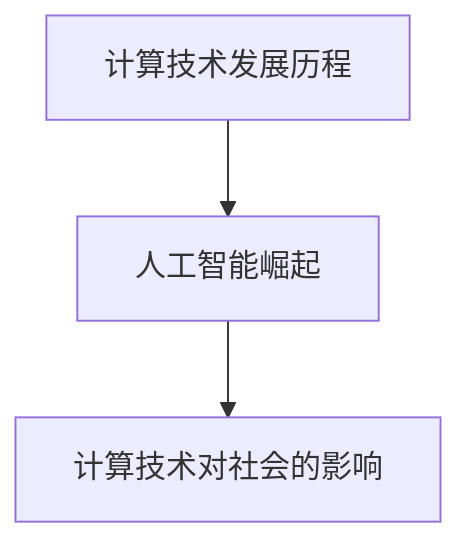
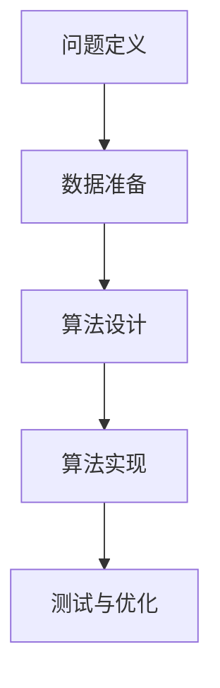

                 

 关键词：计算、人工智能、可持续发展、社会进步、技术伦理

> 摘要：本文探讨了人类计算的终极目标——创造更美好的世界。通过分析计算技术的演变、人工智能的发展及其对社会的影响，本文提出了计算技术在未来应遵循的伦理原则和可持续发展路径，旨在为人类社会的进步提供技术支撑。

## 1. 背景介绍

计算作为现代科技的基石，已经深刻地改变了人类社会的方方面面。从简单的算术运算到复杂的数据分析，计算技术的进步推动了科技革命和产业变革。尤其是近年来，人工智能（AI）的迅猛发展，使得计算技术开始在更广泛的领域展现其潜力。然而，随着计算能力的不断提升，我们不得不面对新的挑战：如何确保计算技术能够造福全人类，而不仅仅是少数精英？

本文将从以下几个方面展开讨论：首先，回顾计算技术的发展历程和人工智能的崛起；其次，分析计算技术对社会的影响，特别是对经济、环境和社会公正的挑战；最后，探讨计算技术的未来发展方向，包括伦理原则的制定和可持续发展路径的规划。

## 2. 核心概念与联系

### 2.1 计算技术发展历程

计算技术的发展历程可以分为几个关键阶段：

- **早期计算机：** 从20世纪40年代至60年代，计算机主要由电子管组成，计算速度较慢，主要应用于军事和科学研究领域。
- **集成电路时代：** 20世纪60年代末至70年代初，集成电路的出现大幅提高了计算机的计算速度和可靠性，使得计算机开始进入商业和民用领域。
- **个人计算机时代：** 20世纪80年代至90年代，个人计算机的普及使得计算技术开始深入到日常生活的各个方面。
- **云计算和大数据时代：** 21世纪初至今，随着互联网的普及和数据中心的建设，云计算和大数据技术使得数据处理和分析的能力大幅提升，为人工智能的发展提供了坚实的基础。

### 2.2 人工智能的崛起

人工智能（AI）是计算技术发展中的一个重要分支，其目标是使计算机具备人类智能。人工智能的发展可以分为以下几个阶段：

- **符号人工智能：** 20世纪50年代至70年代，人工智能主要集中在基于规则的系统和专家系统，但局限性较大。
- **感知人工智能：** 20世纪80年代至90年代，随着计算机硬件的升级，人工智能开始关注感知和图像处理，如机器视觉和语音识别。
- **深度学习时代：** 21世纪初，深度学习技术的突破使得人工智能在图像识别、自然语言处理等领域取得了显著进展。

### 2.3 计算技术对社会的影响

计算技术对社会的影响是深远且多层次的，包括以下几个方面：

- **经济发展：** 计算技术的进步推动了数字经济的发展，改变了传统产业的生产和运营模式。
- **环境改善：** 通过计算技术，我们可以更好地进行环境监测和资源管理，实现可持续发展。
- **社会公正：** 计算技术的普及可以提高教育、医疗等公共服务的质量，促进社会公平。

### 2.4 核心概念原理与架构的 Mermaid 流程图



## 3. 核心算法原理 & 具体操作步骤

### 3.1 算法原理概述

计算技术的核心在于算法的设计和实现。算法原理可以分为以下几个方面：

- **计算效率：** 如何在有限的计算资源下，实现最快的计算速度。
- **计算精度：** 如何在保证计算速度的同时，确保计算结果的准确性。
- **算法复杂度：** 算法的复杂度是衡量算法优劣的重要指标。

### 3.2 算法步骤详解

算法的实现通常分为以下几个步骤：

- **问题定义：** 明确需要解决的问题。
- **数据准备：** 收集并准备所需的数据。
- **算法设计：** 设计适合问题的算法。
- **算法实现：** 将算法转化为计算机可以执行的代码。
- **测试与优化：** 对算法进行测试和优化，确保其性能和准确性。

### 3.3 算法优缺点

每种算法都有其优缺点。以下是一个简单的算法优缺点分析：

- **冒泡排序：** 优点是简单易懂，缺点是效率较低。
- **快速排序：** 优点是效率较高，缺点是实现较为复杂。

### 3.4 算法应用领域

算法的应用领域非常广泛，包括：

- **数据结构：** 如数组、链表、树等。
- **算法理论：** 如图论、动态规划等。
- **机器学习：** 如线性回归、决策树、神经网络等。

### 3.5 核心算法原理与架构的 Mermaid 流程图



## 4. 数学模型和公式 & 详细讲解 & 举例说明

### 4.1 数学模型构建

数学模型是计算技术的重要组成部分，其构建通常包括以下几个步骤：

- **问题抽象：** 将实际问题转化为数学问题。
- **变量定义：** 定义问题中的变量。
- **公式推导：** 推导出描述问题的数学公式。
- **模型验证：** 验证模型的准确性和可靠性。

### 4.2 公式推导过程

以线性回归模型为例，其公式推导过程如下：

- **问题抽象：** 确定因变量和自变量之间的关系。
- **变量定义：** 设定自变量 $x$ 和因变量 $y$。
- **公式推导：** 通过最小二乘法推导出线性回归模型公式。

### 4.3 案例分析与讲解

以下是一个线性回归模型的案例：

- **数据集：** 收集一组房屋售价和房屋面积的数据。
- **模型构建：** 使用线性回归模型预测房屋售价。
- **模型验证：** 使用验证集评估模型性能。

## 5. 项目实践：代码实例和详细解释说明

### 5.1 开发环境搭建

- **软件要求：** Python 3.x、Jupyter Notebook。
- **硬件要求：** 个人电脑或云服务器。

### 5.2 源代码详细实现

```python
# 导入必要的库
import numpy as np
import pandas as pd
from sklearn.linear_model import LinearRegression
from sklearn.model_selection import train_test_split

# 加载数据集
data = pd.read_csv('house_prices.csv')
X = data['area']
y = data['price']

# 数据预处理
X = X.values.reshape(-1, 1)
y = y.values.reshape(-1, 1)

# 数据划分
X_train, X_test, y_train, y_test = train_test_split(X, y, test_size=0.2, random_state=42)

# 模型训练
model = LinearRegression()
model.fit(X_train, y_train)

# 模型评估
score = model.score(X_test, y_test)
print(f'Model score: {score}')

# 预测
prediction = model.predict(X_test)
```

### 5.3 代码解读与分析

上述代码首先导入了必要的库，包括 NumPy、Pandas 和 scikit-learn。然后，从 CSV 文件中加载数据集，并对数据进行预处理，将自变量和因变量分别提取出来。接着，使用 train_test_split 函数将数据集划分为训练集和测试集。随后，使用 LinearRegression 类创建线性回归模型，并调用 fit 方法进行训练。最后，使用 score 方法评估模型性能，并使用 predict 方法进行预测。

### 5.4 运行结果展示

运行上述代码后，可以看到模型得分和预测结果。模型得分越高，表示模型性能越好。通过对比预测结果和实际结果，可以评估模型的准确性。

## 6. 实际应用场景

计算技术在实际应用场景中具有广泛的应用，以下是一些典型的应用案例：

- **医疗健康：** 通过计算技术，可以实现疾病预测、个性化治疗等，提高医疗服务的质量。
- **环境保护：** 通过计算技术，可以进行环境监测、资源管理，实现可持续发展。
- **教育：** 通过计算技术，可以实现在线教育、智能教育，提高教育资源的利用效率。

## 7. 未来应用展望

随着计算技术的不断发展，未来应用场景将更加广泛。以下是一些未来应用展望：

- **智能城市：** 通过计算技术，可以实现智能交通、智能能源管理，提高城市运行效率。
- **农业：** 通过计算技术，可以实现智能农业，提高农业生产效率。
- **金融：** 通过计算技术，可以实现智能金融，提高金融服务质量。

## 8. 工具和资源推荐

### 8.1 学习资源推荐

- **书籍：** 《深度学习》、《机器学习实战》
- **在线课程：** Coursera、edX、Udacity

### 8.2 开发工具推荐

- **编程语言：** Python、Java
- **框架：** TensorFlow、PyTorch、Scikit-learn

### 8.3 相关论文推荐

- **深度学习：** "Deep Learning" (Goodfellow et al., 2016)
- **机器学习：** "Machine Learning: A Probabilistic Perspective" (Koller and Friedman, 2009)

## 9. 总结：未来发展趋势与挑战

### 9.1 研究成果总结

计算技术在过去几十年取得了显著的成果，包括人工智能、大数据、云计算等领域的突破。这些成果不仅推动了科技革命和产业变革，也为人类社会的进步提供了强大的技术支撑。

### 9.2 未来发展趋势

未来，计算技术将继续朝着智能化、高效化、可持续化的方向发展。人工智能将更加深入地应用于各个领域，大数据技术将实现更高的数据处理能力，云计算将提供更强大的计算资源。

### 9.3 面临的挑战

然而，计算技术也面临一些挑战，包括数据隐私保护、算法公平性、技术伦理等问题。如何解决这些问题，将决定计算技术能否真正造福全人类。

### 9.4 研究展望

在未来的研究中，我们需要关注以下几个方面：

- **人工智能伦理：** 如何确保人工智能的发展符合伦理原则，不损害人类利益。
- **可持续发展：** 如何通过计算技术实现可持续发展，保护地球资源。
- **社会公平：** 如何通过计算技术提高社会公平，消除数字鸿沟。

## 10. 附录：常见问题与解答

### 10.1 计算技术如何影响经济？

计算技术通过提高生产效率、降低运营成本、创造新的商业模式，对经济产生了深远影响。例如，云计算技术使得企业可以按需购买计算资源，降低IT成本；人工智能技术则可以帮助企业提高生产效率，降低人力成本。

### 10.2 如何确保计算技术的可持续发展？

确保计算技术的可持续发展需要从多个方面入手，包括：

- **资源优化：** 通过优化数据存储、传输和处理，减少能源消耗。
- **技术迭代：** 持续推进技术创新，提高计算效率。
- **政策引导：** 制定相关政策和标准，引导计算技术向可持续发展方向前进。

### 10.3 如何解决计算技术的数据隐私问题？

解决计算技术的数据隐私问题需要采取以下措施：

- **数据加密：** 对敏感数据进行加密，防止数据泄露。
- **隐私保护算法：** 开发和应用隐私保护算法，确保数据处理过程中的隐私安全。
- **法律法规：** 加强法律法规建设，规范数据处理行为。

以上就是对“创造更美好的世界：人类计算的终极目标”这篇文章的撰写。希望这篇文章能够帮助读者更好地理解计算技术的意义和未来发展方向。作者：禅与计算机程序设计艺术 / Zen and the Art of Computer Programming。

