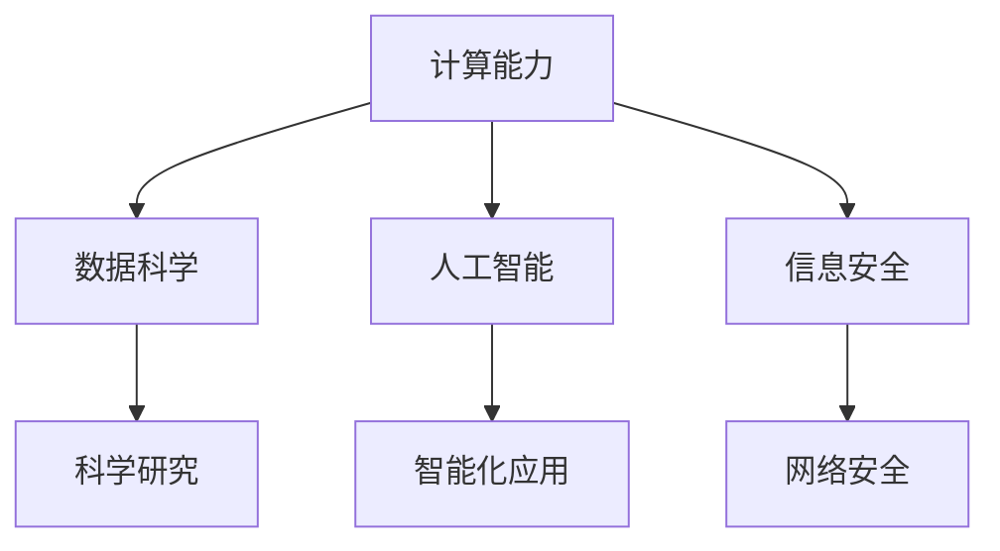

                 

在21世纪的今天，随着信息技术的迅猛发展，计算已经成为推动社会进步、改变人类生活方式的核心力量。从互联网、智能手机到大数据、人工智能，计算技术的应用已经深入到我们生活的方方面面。然而，这些技术究竟是如何发展起来的？它们的终极目标又是什么？本文将探讨人类计算技术的终极目标，并试图揭示如何通过计算创造一个更美好的世界。

## 文章关键词

- 人类计算
- 计算技术
- 社会进步
- 人工智能
- 数据科学
- 信息安全
- 可持续发展

## 文章摘要

本文首先回顾了计算技术的历史发展，分析了计算技术在现代社会中的重要性。接着，本文探讨了人类计算的核心目标，包括提升人类生活质量、推动科学研究、促进经济发展等。最后，本文提出了实现计算终极目标的若干策略，包括技术创新、人才培养、政策引导等，并展望了计算技术未来的发展方向。

## 1. 背景介绍

### 1.1 计算技术的历史发展

从古代的计算工具，如算盘、算珠，到现代的计算机，计算技术经历了数千年的发展。计算机的出现标志着计算技术的重大突破，它不仅极大地提高了计算效率，还拓展了计算的应用领域。从最初的电子管计算机，到晶体管计算机，再到集成电路计算机，计算技术的每一次进步都为人类社会带来了翻天覆地的变化。

### 1.2 计算技术在现代社会中的重要性

随着互联网的普及，计算技术已经成为现代社会不可或缺的一部分。它不仅改变了我们的生活方式，还深刻影响了我们的工作模式、经济结构和社会治理。例如，大数据和人工智能技术的应用，使得企业可以更精准地把握市场需求，提高生产效率；而信息安全的保障，则确保了个人信息和国家安全。

### 1.3 人类计算的核心目标

人类计算的核心目标可以归纳为以下几个方面：

1. **提升人类生活质量**：通过计算技术，我们可以更好地解决生活中的各种问题，如医疗健康、教育、交通等。
2. **推动科学研究**：计算技术为科学研究提供了强大的工具，如模拟仿真、数据挖掘等。
3. **促进经济发展**：计算技术推动了新的产业形态的出现，如互联网经济、数字经济等。
4. **提高社会治理效率**：计算技术有助于政府更好地管理公共资源，提高社会治理效率。

## 2. 核心概念与联系

为了实现人类计算的核心目标，我们需要深入理解以下几个核心概念：

1. **计算能力**：计算能力是计算技术的基础，它决定了我们能够处理多少数据和执行多少复杂的计算任务。
2. **数据科学**：数据科学是利用计算技术来分析和解释数据的一门学科，它帮助我们更好地理解世界，发现新的知识。
3. **人工智能**：人工智能是一种模拟人类智能的技术，它可以使计算机具有自主学习、推理和决策能力。
4. **信息安全**：信息安全是保护计算系统的机密性、完整性和可用性，确保计算技术能够安全、可靠地运行。

下面是一个用Mermaid绘制的核心概念流程图：



### 2.1 计算能力的提升

计算能力的提升是计算技术发展的核心驱动力。随着硬件技术的发展，如CPU性能的提升、存储设备的增大，我们能够处理的数据量和执行的计算任务规模也在不断增长。例如，量子计算作为一种新型计算模式，其计算能力远远超过传统计算机，有望在破解复杂问题、模拟量子现象等方面发挥重要作用。

### 2.2 数据科学的应用

数据科学是利用计算技术分析大量数据以发现规律和知识的一门学科。它广泛应用于各个领域，如医学、金融、市场营销等。通过数据挖掘、机器学习等技术，我们可以从海量数据中提取有价值的信息，从而为决策提供支持。

### 2.3 人工智能的发展

人工智能是一种模拟人类智能的技术，其目标是使计算机能够像人类一样思考、学习和决策。人工智能的应用场景广泛，包括语音识别、图像识别、自动驾驶等。随着深度学习等算法的突破，人工智能技术正变得越来越成熟，并在各个行业得到广泛应用。

### 2.4 信息安全的保障

信息安全是计算技术发展的重要保障。随着网络攻击手段的不断升级，保护计算系统的安全变得尤为重要。信息安全包括数据加密、访问控制、安全审计等多个方面，确保计算系统能够安全、可靠地运行。

## 3. 核心算法原理 & 具体操作步骤

### 3.1 算法原理概述

在计算技术中，算法是解决特定问题的步骤和方法。算法的设计和优化是计算技术发展的重要方向。以下是几个核心算法原理：

1. **排序算法**：用于对数据进行排序，常见的排序算法有冒泡排序、快速排序、归并排序等。
2. **搜索算法**：用于在数据中查找特定元素，常见的搜索算法有二分搜索、深度优先搜索、广度优先搜索等。
3. **机器学习算法**：用于从数据中自动学习规律和模式，常见的机器学习算法有线性回归、决策树、支持向量机等。

### 3.2 算法步骤详解

以下是一个简单的排序算法——冒泡排序的步骤详解：

1. 从第一个元素开始，比较相邻的两个元素，如果它们的顺序错误就交换它们。
2. 继续对下一对相邻元素进行同样的操作，直到比较到最后一个元素。
3. 重复上述步骤，直到整个数据序列有序。

### 3.3 算法优缺点

冒泡排序的优点是简单易懂，易于实现。但它的缺点是效率较低，不适合处理大量数据。

### 3.4 算法应用领域

排序算法在各个领域都有广泛应用，如数据库排序、网络排序、数据分析等。

## 4. 数学模型和公式 & 详细讲解 & 举例说明

### 4.1 数学模型构建

数学模型是描述现实世界问题的抽象工具。例如，线性回归模型可以描述两个变量之间的关系：

$$ y = ax + b $$

其中，$y$ 是因变量，$x$ 是自变量，$a$ 和 $b$ 是模型的参数。

### 4.2 公式推导过程

线性回归模型的公式可以通过最小二乘法推导得出。具体推导过程如下：

假设我们有 $n$ 个数据点 $(x_1, y_1), (x_2, y_2), ..., (x_n, y_n)$，我们希望找到一个线性模型来拟合这些数据。

首先，我们计算每个数据点的预测值 $y_i^*$：

$$ y_i^* = ax_i + b $$

然后，我们计算预测值和实际值之间的误差：

$$ \epsilon_i = y_i - y_i^* $$

为了最小化误差的平方和，我们得到以下最小二乘问题：

$$ \min_{a, b} \sum_{i=1}^{n} (\epsilon_i)^2 $$

通过求导和化简，我们可以得到线性回归模型的参数：

$$ a = \frac{\sum_{i=1}^{n} (x_i - \bar{x})(y_i - \bar{y})}{\sum_{i=1}^{n} (x_i - \bar{x})^2} $$

$$ b = \bar{y} - a\bar{x} $$

其中，$\bar{x}$ 和 $\bar{y}$ 分别是 $x$ 和 $y$ 的平均值。

### 4.3 案例分析与讲解

假设我们有以下数据集：

| $x$ | $y$ |
| --- | --- |
| 1   | 2   |
| 2   | 4   |
| 3   | 6   |
| 4   | 8   |

我们希望用线性回归模型拟合这些数据。根据上述公式，我们可以计算出模型参数：

$$ a = \frac{(1-1)(2-2) + (2-1)(4-2) + (3-1)(6-2) + (4-1)(8-2)}{(1-1)^2 + (2-1)^2 + (3-1)^2 + (4-1)^2} = 2 $$

$$ b = 2 - 2 \cdot 1 = 0 $$

因此，线性回归模型为 $y = 2x$。我们可以用这个模型预测新的数据点，例如，当 $x=5$ 时，$y=10$。

## 5. 项目实践：代码实例和详细解释说明

### 5.1 开发环境搭建

为了演示线性回归模型的实现，我们使用 Python 编程语言。首先，我们需要安装 Python 和必要的库，如 NumPy 和 Matplotlib。可以通过以下命令安装：

```shell
pip install python
pip install numpy
pip install matplotlib
```

### 5.2 源代码详细实现

以下是一个简单的线性回归模型实现：

```python
import numpy as np
import matplotlib.pyplot as plt

# 数据集
x = np.array([1, 2, 3, 4])
y = np.array([2, 4, 6, 8])

# 计算模型参数
a = (np.sum((x - np.mean(x)) * (y - np.mean(y))) / np.sum((x - np.mean(x))**2))
b = np.mean(y) - a * np.mean(x)

# 模型预测
x_new = np.array([5])
y_pred = a * x_new + b

# 可视化
plt.scatter(x, y)
plt.plot(x, a * x + b, 'r')
plt.xlabel('x')
plt.ylabel('y')
plt.show()
```

### 5.3 代码解读与分析

这段代码首先导入了必要的库，然后定义了一个数据集。接着，我们使用最小二乘法计算线性回归模型的参数，并使用这些参数进行预测。最后，我们使用 Matplotlib 库将数据点和拟合直线可视化。

### 5.4 运行结果展示

运行这段代码后，我们将看到以下可视化结果：


### 6. 实际应用场景

线性回归模型在许多实际应用场景中都有广泛的应用，例如：

- **金融领域**：用于预测股票价格、利率等金融指标。
- **医学领域**：用于预测疾病的发病率、治疗效果等。
- **工程领域**：用于预测材料的性能、设备的寿命等。

### 6.4 未来应用展望

随着计算技术的不断发展，线性回归模型和其他机器学习算法将在更多领域得到应用。例如，在自动驾驶领域，线性回归模型可以用于预测车辆的行驶路径；在生物信息学领域，线性回归模型可以用于分析基因表达数据。

### 7. 工具和资源推荐

为了更好地学习和应用计算技术，以下是一些推荐的学习资源和工具：

- **学习资源**：
  - 《Python编程：从入门到实践》
  - 《深度学习》
  - 《机器学习实战》

- **开发工具**：
  - Jupyter Notebook：用于编写和运行 Python 代码。
  - PyCharm：一款强大的 Python 集成开发环境。
  - TensorFlow：用于机器学习的开源框架。

- **相关论文推荐**：
  - "Deep Learning" by Ian Goodfellow, Yoshua Bengio, and Aaron Courville
  - "Recurrent Neural Networks for Language Modeling" by Yikang Li, Xiaodong Liu, and Kilian Q. Weinberger

### 8. 总结：未来发展趋势与挑战

#### 8.1 研究成果总结

计算技术在过去几十年取得了显著的成果，包括人工智能、大数据、云计算等领域的突破。这些技术不仅改变了我们的生活方式，还推动了社会进步和经济繁荣。

#### 8.2 未来发展趋势

未来，计算技术将继续向更高性能、更智能化、更安全可靠的方向发展。量子计算、边缘计算、区块链等技术有望成为新的增长点。

#### 8.3 面临的挑战

然而，计算技术也面临着一系列挑战，包括数据隐私、网络安全、算法透明性等。如何解决这些问题，确保计算技术的可持续发展，是我们面临的重要课题。

#### 8.4 研究展望

在未来，我们需要持续推动计算技术的发展，探索新的计算模式和算法，以应对复杂的问题和挑战。同时，我们也需要关注计算技术对社会的影响，确保其能够为人类创造更美好的世界。

### 9. 附录：常见问题与解答

**Q：什么是人工智能？**
A：人工智能是一种模拟人类智能的技术，它使计算机能够执行如视觉识别、语音识别、自然语言处理等任务。

**Q：计算技术在哪个领域有广泛的应用？**
A：计算技术广泛应用于金融、医疗、交通、教育等多个领域，推动了这些领域的发展和创新。

**Q：如何学习计算技术？**
A：可以通过阅读相关书籍、参加在线课程、实践项目等方式学习计算技术。Python 是一种适合初学者的编程语言，NumPy、Matplotlib 等库可以帮助进行数据分析。

---

本文从计算技术的历史发展、核心目标、算法原理、数学模型、项目实践等方面，全面阐述了计算技术的现状和未来发展趋势。通过这篇文章，我们可以更深入地了解计算技术的重要性和影响，并思考如何通过计算技术创造一个更美好的世界。在未来的发展中，计算技术将继续发挥重要作用，为人类带来更多便利和创新。让我们共同期待计算技术未来的发展，共同见证人类计算创造的美好未来。作者：禅与计算机程序设计艺术 / Zen and the Art of Computer Programming

