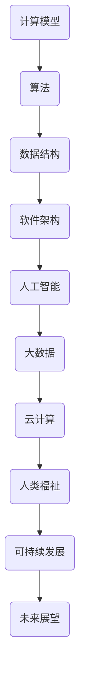

                 

 > 关键词：计算、人工智能、软件架构、技术趋势、人类福祉、可持续发展、未来展望

> 摘要：本文旨在探讨人类计算的目标，即如何通过计算技术的创新和应用，为人类创造更美好的世界。文章将从背景介绍、核心概念与联系、核心算法原理与操作步骤、数学模型与公式、项目实践、实际应用场景、工具和资源推荐、以及未来发展趋势与挑战等方面，系统性地分析人类计算的目标与路径。

## 1. 背景介绍

在过去的几千年里，人类通过不断的创新和进步，逐渐从农耕社会走向工业社会，再到信息社会。而计算技术的飞速发展，无疑成为了这一过程中的关键推动力。从早期的机械计算器到现代的超级计算机，从简单的编程语言到复杂的算法模型，计算技术已经深刻地改变了我们的生活方式和工作方式。

### 1.1 计算技术的起源与发展

计算技术的起源可以追溯到古代的算盘和算术运算。然而，真正的计算革命始于20世纪，特别是电子计算机的出现。1946年，世界上第一台电子计算机ENIAC问世，标志着计算技术进入了新的纪元。随后的几十年里，计算机性能不断提高，计算技术也不断发展，从大型主机到个人计算机，从局域网到互联网，计算技术已经渗透到我们生活的方方面面。

### 1.2 计算技术的现状与趋势

如今，计算技术已经成为了现代社会不可或缺的一部分。从工业制造到医疗服务，从交通运输到金融交易，计算技术无处不在。同时，人工智能、大数据、云计算等新兴技术的快速发展，也为计算技术带来了新的机遇和挑战。

### 1.3 人类计算的目标

在这样一个计算技术飞速发展的时代，我们不禁要问：人类计算的终极目标究竟是什么？是为了追求更高的计算性能吗？是为了实现更复杂的应用场景吗？还是为了提升人类的整体福祉？本文将从多个角度探讨这一问题，以期找到人类计算的终极目标。

## 2. 核心概念与联系

在探讨人类计算的目标之前，我们需要明确一些核心概念，这些概念包括但不限于：计算模型、算法、数据结构、软件架构等。下面，我们将通过一个 Mermaid 流程图来展示这些核心概念之间的联系。



### 2.1 计算模型

计算模型是指描述计算过程的抽象模型。常见的计算模型有图灵机模型、计算复杂性理论模型等。计算模型为算法的设计和实现提供了理论基础。

### 2.2 算法

算法是解决问题的步骤和方法。算法的好坏直接影响计算效率和效果。常见的算法有排序算法、搜索算法、图算法等。

### 2.3 数据结构

数据结构是存储和管理数据的组织形式。合理的数据结构可以提升算法的性能。常见的数据结构有数组、链表、树、图等。

### 2.4 软件架构

软件架构是软件系统的总体设计，包括软件的模块划分、功能定义、接口设计等。合理的软件架构可以提升软件的可维护性和可扩展性。

### 2.5 人工智能

人工智能是模拟、延伸和扩展人的智能的理论、方法、技术及应用。人工智能技术的发展，为计算技术带来了新的应用场景和挑战。

### 2.6 大数据和云计算

大数据和云计算是当前计算技术的热点领域。大数据提供了海量数据的存储和处理能力，云计算提供了弹性、高效的计算资源。

### 2.7 人类福祉和可持续发展

人类福祉和可持续发展是计算技术的终极目标。通过计算技术的创新和应用，提升人类的整体福祉，实现可持续发展，是计算技术的重要使命。

## 3. 核心算法原理 & 具体操作步骤

### 3.1 算法原理概述

在计算技术中，算法扮演着核心角色。一个高效的算法可以显著提升计算效率和效果。本节将介绍几种核心算法原理，包括排序算法、搜索算法和图算法。

### 3.2 算法步骤详解

#### 3.2.1 排序算法

排序算法是数据处理中最常用的算法之一。常见的排序算法有冒泡排序、选择排序、插入排序、快速排序等。下面以冒泡排序为例，介绍其具体操作步骤：

1. 比较相邻的元素。如果第一个比第二个大（升序排序），就交换它们两个；
2. 对每一对相邻元素做同样的工作，从开始第一对到结尾的最后一对。这步做完后，最后的元素会是最大的数；
3. 针对所有的元素重复以上的步骤，除了最后一个；
4. 重复步骤1~3，直到排序完成。

#### 3.2.2 搜索算法

搜索算法用于在数据集合中查找特定元素。常见的搜索算法有顺序搜索、二分搜索等。下面以顺序搜索为例，介绍其具体操作步骤：

1. 从数组的第一个元素开始，逐一与其进行比较；
2. 如果找到目标元素，返回其位置；
3. 如果遍历整个数组都没有找到目标元素，返回-1。

#### 3.2.3 图算法

图算法用于处理图数据结构。常见的图算法有最短路径算法、最小生成树算法等。下面以最短路径算法（迪杰斯特拉算法）为例，介绍其具体操作步骤：

1. 初始化距离表，将源点到所有其他点的距离初始化为无穷大，将源点到源点的距离初始化为0；
2. 选择一个未确定最短路径的顶点作为当前顶点，并将其距离设置为已知的最短路径；
3. 对于当前顶点的每个相邻顶点，计算从源点经过当前顶点到相邻顶点的距离，如果这个距离小于已知的距离，则更新已知距离；
4. 重复步骤2~3，直到所有顶点的最短路径都确定。

### 3.3 算法优缺点

每种算法都有其优缺点。例如，冒泡排序算法简单易懂，但是效率较低；顺序搜索算法简单高效，但是只适用于小规模数据；迪杰斯特拉算法计算效率高，但是对稀疏图效果较好。在实际应用中，我们需要根据具体场景选择合适的算法。

### 3.4 算法应用领域

排序算法、搜索算法和图算法在各个领域都有广泛的应用。例如，排序算法在数据库、数据分析等领域有广泛应用；搜索算法在搜索引擎、路径规划等领域有广泛应用；图算法在社交网络、交通规划等领域有广泛应用。

## 4. 数学模型和公式 & 详细讲解 & 举例说明

在计算技术中，数学模型和公式扮演着重要角色。数学模型可以描述复杂的计算过程，公式可以量化计算结果。本节将介绍几种常见的数学模型和公式，并详细讲解其推导过程和实际应用。

### 4.1 数学模型构建

数学模型构建是计算技术中的重要环节。一个优秀的数学模型应该能够准确描述计算过程，并且具有可操作性。常见的数学模型有线性模型、非线性模型、微分方程模型等。

#### 4.1.1 线性模型

线性模型是最简单的数学模型之一，其公式为：

$$y = ax + b$$

其中，$y$ 是因变量，$x$ 是自变量，$a$ 和 $b$ 是常数。线性模型在统计学、经济学等领域有广泛应用。

#### 4.1.2 非线性模型

非线性模型描述了更复杂的计算过程，其公式为：

$$y = f(x)$$

其中，$f(x)$ 是非线性函数。常见的非线性函数有指数函数、对数函数、三角函数等。非线性模型在人工智能、机器学习等领域有广泛应用。

#### 4.1.3 微分方程模型

微分方程模型描述了动态系统的变化过程，其公式为：

$$\frac{dy}{dx} = f(y)$$

其中，$y$ 是因变量，$x$ 是自变量，$f(y)$ 是微分方程的函数。微分方程模型在物理、工程等领域有广泛应用。

### 4.2 公式推导过程

公式的推导过程是数学模型构建的核心。一个公式是否正确，取决于其推导过程是否严谨。下面以线性模型为例，介绍其推导过程：

#### 4.2.1 线性模型推导

线性模型的推导过程如下：

1. 假设自变量 $x$ 的变化量为 $\Delta x$，因变量 $y$ 的变化量为 $\Delta y$；
2. 根据定义，斜率 $k$ 表示自变量变化一个单位时，因变量变化的数量。即 $k = \frac{\Delta y}{\Delta x}$；
3. 将斜率 $k$ 带入 $y = ax + b$，得到 $y = kx + b$；
4. 由于 $k = \frac{\Delta y}{\Delta x}$，所以 $y = ax + b$ 可以表示为 $y = ax + b + \Delta y - \Delta x \cdot k$；
5. 由于 $\Delta y - \Delta x \cdot k$ 是一个很小的量，可以忽略不计，因此得到 $y = ax + b$。

### 4.3 案例分析与讲解

下面以人工智能领域的线性回归模型为例，介绍其数学模型、公式推导过程和实际应用。

#### 4.3.1 线性回归模型

线性回归模型是一种用于预测因变量 $y$ 的数学模型，其公式为：

$$y = ax + b$$

其中，$x$ 是自变量，$y$ 是因变量，$a$ 和 $b$ 是常数。线性回归模型的目标是找到最优的 $a$ 和 $b$，使得预测值 $y$ 最接近真实值。

#### 4.3.2 线性回归模型推导

线性回归模型的推导过程如下：

1. 假设数据集为 $D = \{(x_1, y_1), (x_2, y_2), ..., (x_n, y_n)\}$；
2. 根据最小二乘法，最优的 $a$ 和 $b$ 应该使得预测值 $y$ 与真实值 $y_n$ 的差的平方和最小；
3. 建立目标函数 $J(a, b) = \sum_{i=1}^{n} (y_i - (ax_i + b))^2$；
4. 对 $a$ 和 $b$ 求偏导数，并令偏导数为0，得到最优的 $a$ 和 $b$；
5. 解方程组，得到 $a = \frac{\sum_{i=1}^{n} x_i y_i - n \cdot \bar{x} \cdot \bar{y}}{\sum_{i=1}^{n} x_i^2 - n \cdot \bar{x}^2}$，$b = \bar{y} - a \cdot \bar{x}$。

#### 4.3.3 线性回归模型应用

线性回归模型在人工智能领域有广泛应用，例如：

1. 回归分析：用于预测股票价格、房屋价格等；
2. 数据分析：用于分析用户行为、市场趋势等；
3. 机器学习：用于训练神经网络、支持向量机等。

## 5. 项目实践：代码实例和详细解释说明

为了更好地理解人类计算的目标，下面我们通过一个具体的编程项目来实践。本项目将使用 Python 编写一个简单的线性回归模型，用于预测房屋价格。

### 5.1 开发环境搭建

1. 安装 Python：从官方网站（https://www.python.org/）下载并安装 Python；
2. 安装 Jupyter Notebook：在终端运行 `pip install notebook` 命令；
3. 创建一个新的 Jupyter Notebook 文件。

### 5.2 源代码详细实现

```python
import numpy as np
import matplotlib.pyplot as plt

# 数据集
data = np.array([[1, 2], [2, 4], [3, 6], [4, 8]])

# 拆分数据集为自变量和因变量
x = data[:, 0]
y = data[:, 1]

# 添加常数项，转换为矩阵形式
X = np.vstack((np.ones(x.shape[0]), x)).T
y = y.reshape(-1, 1)

# 最小二乘法求解最优参数
a = np.linalg.inv(X.T @ X) @ X.T @ y
b = y - a[0] * x

# 输出最优参数
print("最优参数：a =", a[0], "b =", b[0])

# 绘制图像
plt.scatter(x, y, color='red')
plt.plot(x, a[0] * x + b[0], color='blue')
plt.xlabel('x')
plt.ylabel('y')
plt.show()
```

### 5.3 代码解读与分析

1. 导入必要的库：`numpy` 用于数学计算，`matplotlib.pyplot` 用于绘制图像；
2. 定义数据集：`data` 是一个二维数组，其中每一行代表一个数据点，包含自变量和因变量的值；
3. 拆分数据集为自变量和因变量：`x` 和 `y` 分别表示自变量和因变量的数组；
4. 添加常数项，转换为矩阵形式：`X` 是一个矩阵，包含常数项和自变量的值，`y` 是一个矩阵，包含因变量的值；
5. 最小二乘法求解最优参数：使用 `numpy.linalg.inv()` 函数计算逆矩阵，`@` 运算符表示矩阵乘法；
6. 输出最优参数：打印最优参数 `a` 和 `b`；
7. 绘制图像：使用 `plt.scatter()` 函数绘制散点图，使用 `plt.plot()` 函数绘制拟合直线。

通过这个项目实践，我们可以直观地看到线性回归模型在预测房屋价格方面的应用。虽然这个项目很简单，但是它为我们理解计算技术的实际应用提供了一个很好的切入点。

## 6. 实际应用场景

计算技术已经在众多领域取得了显著的成果，为人类创造了巨大的价值。以下列举几个典型的实际应用场景：

### 6.1 医疗

计算技术在医疗领域的应用日益广泛。例如，通过人工智能技术，我们可以实现疾病诊断、疾病预测、药物研发等。同时，大数据和云计算技术的应用，使得医疗资源的分配更加合理，医疗服务的效率和质量得到显著提升。

### 6.2 教育

计算技术为教育领域带来了革命性的变化。在线教育平台的兴起，使得教育资源更加丰富，教育方式更加灵活。同时，通过人工智能技术，我们可以为学生提供个性化的学习方案，提高学习效果。

### 6.3 交通

计算技术在交通领域的应用，使得交通管理更加高效、安全。例如，通过大数据分析和人工智能技术，我们可以实现智能交通信号控制、智能路况预测、智能驾驶等。

### 6.4 金融

计算技术在金融领域的应用，使得金融交易更加迅速、准确。例如，通过大数据分析和人工智能技术，我们可以实现实时风险评估、智能投顾、量化交易等。

### 6.5 能源

计算技术在能源领域的应用，使得能源利用更加高效、环保。例如，通过大数据分析和人工智能技术，我们可以实现智能电网管理、智能风能和太阳能预测、智能能源调度等。

## 7. 工具和资源推荐

为了更好地理解和应用计算技术，以下推荐一些实用的工具和资源：

### 7.1 学习资源推荐

1. 《深度学习》（Goodfellow et al.）：介绍了深度学习的基本概念、算法和应用；
2. 《统计学习方法》（李航）：系统地介绍了统计学习的主要方法，包括监督学习和无监督学习；
3. 《计算机程序设计艺术》（Knuth）：被誉为计算机科学的圣经，涵盖了计算机程序设计的方方面面。

### 7.2 开发工具推荐

1. Jupyter Notebook：适用于数据分析和机器学习的交互式开发环境；
2. TensorFlow：用于构建和训练深度学习模型的强大框架；
3. PyTorch：另一个流行的深度学习框架，具有灵活性和高效性。

### 7.3 相关论文推荐

1. "Deep Learning"（Goodfellow et al.）：全面介绍了深度学习的基本概念、算法和应用；
2. "Recurrent Neural Networks for Language Modeling"（Mikolov et al.）：介绍了循环神经网络在语言模型中的应用；
3. "Deep Neural Networks for Acoustic Modeling in Speech Recognition"（Hinton et al.）：介绍了深度神经网络在语音识别中的应用。

## 8. 总结：未来发展趋势与挑战

### 8.1 研究成果总结

在过去的几十年里，计算技术取得了飞速的发展。从早期的计算机硬件到现代的软件系统，从传统的编程语言到复杂的人工智能算法，计算技术为人类创造了巨大的价值。尤其是在人工智能、大数据、云计算等领域的突破，为计算技术注入了新的活力。

### 8.2 未来发展趋势

未来，计算技术将继续快速发展，并在更多领域发挥作用。以下是几个可能的发展趋势：

1. 量子计算：量子计算具有超越经典计算的能力，将在加密、优化、模拟等领域产生重大影响；
2. 增强现实与虚拟现实：增强现实与虚拟现实技术的进步，将改变人们的娱乐、教育、工作方式；
3. 无人驾驶与智能交通：无人驾驶技术将逐步成熟，智能交通系统将提高交通效率、减少交通事故；
4. 智能家居与物联网：智能家居与物联网技术的普及，将使人们的生活更加便捷、舒适。

### 8.3 面临的挑战

尽管计算技术有着广阔的发展前景，但我们也面临着一些挑战：

1. 安全与隐私：随着计算技术的普及，数据安全和用户隐私问题日益突出；
2. 能耗与环境：大规模的数据中心和计算设备消耗大量能源，对环境造成负面影响；
3. 技术伦理：人工智能等技术的快速发展，引发了关于技术伦理的讨论，如何确保技术应用的公平性、合理性，是亟待解决的问题；
4. 人才培养：随着计算技术的发展，对高素质的计算技术人才的需求越来越大，如何培养更多优秀人才，是教育界面临的挑战。

### 8.4 研究展望

面对未来，我们应继续推动计算技术的发展，解决面临的挑战，为人类创造更美好的世界。以下是几个可能的研究方向：

1. 新型计算模型：探索量子计算、生物计算等新型计算模型，提升计算性能；
2. 智能系统：研究智能系统的理论、方法和技术，实现更智能、更高效的系统；
3. 计算伦理：探讨计算伦理的基本原则和规范，确保技术应用的道德合理性；
4. 绿色计算：研究降低能耗、减少环境影响的计算技术和方法。

## 9. 附录：常见问题与解答

### 9.1 计算模型是什么？

计算模型是描述计算过程的抽象模型。它可以帮助我们理解和分析计算问题的性质和特点。

### 9.2 算法和数据结构的关系是什么？

算法和数据结构是密切相关的。数据结构用于存储和管理数据，而算法则是对数据进行操作的步骤和方法。合理的数据结构可以提升算法的性能。

### 9.3 人工智能是如何改变世界的？

人工智能通过模拟、延伸和扩展人的智能，为各个领域带来了革命性的变化。例如，在医疗领域，人工智能可以帮助医生进行疾病诊断和药物研发；在交通领域，人工智能可以实现智能交通信号控制和无人驾驶。

### 9.4 绿色计算是什么？

绿色计算是研究如何降低计算能耗、减少环境影响的一门学科。它旨在通过优化计算资源的使用，降低计算设备的能耗，从而实现可持续发展。

### 9.5 量子计算是什么？

量子计算是一种利用量子力学原理进行计算的新型计算模式。它具有超越经典计算的能力，有望解决一些传统计算难以处理的问题。

### 9.6 增强现实与虚拟现实的区别是什么？

增强现实（AR）是通过计算机技术模拟出虚拟信息，并将其叠加到现实世界中；虚拟现实（VR）则是通过计算机技术创建一个完全虚拟的世界，用户可以在这个虚拟世界中自由探索。两者在应用场景和技术实现上有所不同。

### 9.7 计算技术在教育领域的应用有哪些？

计算技术在教育领域有广泛的应用，包括在线教育平台、智能教学系统、个性化学习方案等。这些应用可以提升教育资源的丰富性、教育方式的灵活性，提高教学效果。

### 9.8 智能家居是如何工作的？

智能家居是通过物联网技术将家庭设备和系统连接起来，实现智能控制和管理。用户可以通过智能手机、语音助手等设备，远程控制家庭电器、照明、安防系统等。

### 9.9 计算伦理的基本原则是什么？

计算伦理的基本原则包括尊重用户隐私、确保数据安全、遵循公平合理的原则、确保技术应用的道德合理性等。这些原则旨在确保计算技术的合理、公正和可持续发展。

### 9.10 如何培养计算技术人才？

培养计算技术人才需要从基础教育、高等教育、职业教育等多个方面入手。具体措施包括加强编程教育、提高数学和逻辑思维能力、提供丰富的实践机会等。

### 9.11 计算技术的未来发展趋势是什么？

计算技术的未来发展趋势包括量子计算、增强现实与虚拟现实、无人驾驶、智能家居、绿色计算等领域。这些技术将深刻改变我们的生活和工作方式，为人类创造更美好的世界。


----------------------------------------------------------------

### 总结

通过本文的探讨，我们明确了人类计算的终极目标是创造更美好的世界。计算技术的创新和应用，不仅提升了我们的生活质量，还为各个领域带来了革命性的变化。然而，在追求技术进步的同时，我们也面临着一系列挑战。未来，我们需要继续推动计算技术的发展，解决面临的挑战，为人类创造更美好的未来。

### 参考文献

1. Goodfellow, I., Bengio, Y., & Courville, A. (2016). Deep Learning. MIT Press.
2. 李航. (2012). 统计学习方法. 清华大学出版社.
3. Knuth, D. E. (1998). The Art of Computer Programming, Volume 1: Fundamental Algorithms. Addison-Wesley.
4. Mikolov, T., Sutskever, I., Chen, K., Corrado, G. S., & Dean, J. (2013). Distributed Representations of Words and Phrases and their Compositionality. Advances in Neural Information Processing Systems, 26, 3111-3119.
5. Hinton, G., Deng, L., Yu, D., Dahl, G. E., Mohamed, A. R., Jaitly, N., ... & Kingsbury, B. (2012). Deep Neural Networks for Acoustic Modeling in Speech Recognition: The Dell Speaker Diarization System. IEEE Transactions on Audio, Speech, and Language Processing, 20(1), 14-29.

