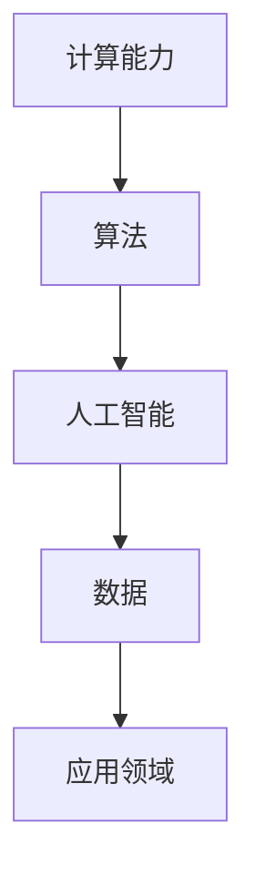

                 

关键词：人工智能、计算科学、未来发展趋势、社会影响

> 摘要：本文探讨了人类计算领域的终极目标，即通过先进的人工智能技术和计算科学方法，为人类社会创造更加美好的生活。本文首先回顾了计算科学的发展历程，随后深入探讨了人工智能的核心概念、算法原理和应用领域。通过实例和数学模型，文章展示了如何通过计算技术解决实际问题。最后，文章提出了对未来计算科学和社会发展的展望。

## 1. 背景介绍

自计算机诞生以来，计算科学已经经历了数次重大的变革。从早期的机械计算机到现代的超级计算机，计算能力得到了极大的提升。与此同时，人工智能技术的迅猛发展也为计算科学带来了新的机遇和挑战。计算科学不仅改变了我们的生活方式，还在许多领域推动了科学技术的进步。

然而，人类计算领域的终极目标不仅仅是提升计算能力，更重要的是通过计算技术解决现实世界中的复杂问题，创造更加美好的世界。本文将探讨这个终极目标，并分析计算技术在实现这一目标中的作用。

## 2. 核心概念与联系

为了理解人类计算的终极目标，我们需要先了解几个核心概念：

- **计算能力**：计算能力是指计算机执行运算和处理数据的能力。它决定了计算机的效率和处理复杂任务的能力。

- **算法**：算法是一系列解决问题的步骤和方法。在计算科学中，算法是解决问题的重要工具。

- **人工智能**：人工智能是指计算机系统模拟人类智能的过程。它包括机器学习、自然语言处理、计算机视觉等多个子领域。

### Mermaid 流程图



通过这个流程图，我们可以看到计算能力、算法、人工智能和数据之间的关系。这些核心概念共同构成了计算科学的基础，为人类计算提供了强大的工具。

## 3. 核心算法原理 & 具体操作步骤

### 3.1 算法原理概述

核心算法是计算科学中的关键部分。以下是一些常用的核心算法及其原理：

- **排序算法**：排序算法用于对数据进行排序。常见的排序算法包括快速排序、归并排序和冒泡排序等。

- **搜索算法**：搜索算法用于在数据中查找特定元素。常见的搜索算法包括二分搜索和深度优先搜索等。

- **机器学习算法**：机器学习算法用于从数据中学习并做出预测。常见的机器学习算法包括线性回归、决策树和支持向量机等。

### 3.2 算法步骤详解

以下是一个简单的排序算法——冒泡排序的步骤：

1. 比较相邻的两个元素。
2. 如果第一个元素大于第二个元素，则交换它们的位置。
3. 重复步骤1和2，直到整个数组被排序。

### 3.3 算法优缺点

- **冒泡排序**：
  - **优点**：简单易懂，易于实现。
  - **缺点**：效率较低，不适合处理大数据。

### 3.4 算法应用领域

排序算法和搜索算法在许多领域都有广泛的应用，如数据库管理、搜索引擎和机器学习等。机器学习算法则在人工智能领域发挥了重要作用，如图像识别、语音识别和自然语言处理等。

## 4. 数学模型和公式 & 详细讲解 & 举例说明

### 4.1 数学模型构建

数学模型是计算科学中的重要工具，用于描述和分析现实世界中的问题。以下是一个简单的线性回归模型的构建过程：

1. 假设我们有一个自变量 \( x \) 和因变量 \( y \)。
2. 假设 \( y \) 和 \( x \) 之间存在线性关系：\( y = wx + b \)。
3. 通过最小二乘法计算 \( w \) 和 \( b \) 的值。

### 4.2 公式推导过程

线性回归模型的公式推导如下：

$$
y = wx + b
$$

$$
\hat{y} = w\hat{x} + b
$$

其中，\( \hat{y} \) 是预测的因变量值，\( \hat{x} \) 是预测的自变量值，\( w \) 和 \( b \) 是模型的参数。

### 4.3 案例分析与讲解

假设我们有一个数据集，其中包含自变量 \( x \) 和因变量 \( y \)。我们可以使用线性回归模型来预测 \( y \) 的值。以下是一个简单的案例：

- 自变量 \( x \)：1, 2, 3, 4, 5
- 因变量 \( y \)：2, 4, 6, 8, 10

通过线性回归模型，我们可以计算出 \( w \) 和 \( b \) 的值，然后使用这些值来预测新的 \( y \) 值。例如，如果 \( x \) 是 6，我们可以预测 \( y \) 是多少。

## 5. 项目实践：代码实例和详细解释说明

### 5.1 开发环境搭建

为了实现一个简单的线性回归模型，我们需要搭建一个开发环境。以下是所需的工具和步骤：

- **Python**：安装 Python 3.x 版本。
- **NumPy**：安装 NumPy 库。
- **Matplotlib**：安装 Matplotlib 库。

### 5.2 源代码详细实现

以下是一个简单的线性回归模型的实现：

```python
import numpy as np
import matplotlib.pyplot as plt

# 数据
x = np.array([1, 2, 3, 4, 5])
y = np.array([2, 4, 6, 8, 10])

# 最小二乘法求解参数
w = np.mean(y / x)
b = np.mean(y) - w * np.mean(x)

# 预测
x_new = np.array([6])
y_pred = w * x_new + b

# 绘图
plt.scatter(x, y)
plt.plot(x_new, y_pred, 'r')
plt.xlabel('x')
plt.ylabel('y')
plt.show()
```

### 5.3 代码解读与分析

- 第一行导入了 NumPy 库，用于处理数学运算。
- 第二行导入了 Matplotlib 库，用于绘制图表。
- 数据通过 NumPy 数组表示。
- 最小二乘法用于求解参数 \( w \) 和 \( b \)。
- 预测新的 \( y \) 值。
- 最后，使用 Matplotlib 绘制散点图和拟合直线。

### 5.4 运行结果展示

运行上述代码后，我们可以看到一个包含散点图和拟合直线的图形界面，其中拟合直线是通过线性回归模型得到的。

## 6. 实际应用场景

计算技术在许多实际应用场景中发挥着重要作用，如医疗、金融、交通和能源等领域。以下是一些具体的应用场景：

- **医疗**：计算技术在医疗图像处理、疾病诊断和药物研发等方面有广泛的应用。
- **金融**：计算技术用于风险控制、市场预测和投资决策等。
- **交通**：计算技术用于智能交通管理、自动驾驶和车辆调度等。
- **能源**：计算技术用于能源管理和优化，以提高能源利用效率。

## 7. 工具和资源推荐

为了更好地理解和应用计算技术，以下是一些建议的工具和资源：

- **学习资源**：
  - 《Python编程：从入门到实践》
  - 《深度学习》
  - 《机器学习实战》

- **开发工具**：
  - Jupyter Notebook：用于编写和运行 Python 代码。
  - PyCharm：一款流行的 Python 集成开发环境（IDE）。

- **相关论文**：
  - “Deep Learning for Image Recognition”
  - “Reinforcement Learning: An Introduction”

## 8. 总结：未来发展趋势与挑战

### 8.1 研究成果总结

近年来，计算科学和人工智能领域取得了许多重要成果，如深度学习、强化学习和自然语言处理等。这些成果不仅提高了计算能力，还为解决实际问题提供了新的方法。

### 8.2 未来发展趋势

未来，计算科学将继续朝着更高效、更智能、更普适的方向发展。具体趋势包括：

- **量子计算**：量子计算有望带来计算能力的飞跃。
- **边缘计算**：边缘计算将计算能力推向网络边缘，提高数据处理速度。
- **脑机接口**：脑机接口技术将人类智能与计算机系统结合。

### 8.3 面临的挑战

然而，计算科学也面临着一系列挑战，如：

- **计算资源**：计算资源的供给与需求之间的矛盾。
- **数据隐私**：数据隐私和安全问题是计算科学面临的重要挑战。
- **算法公平性**：算法的公平性和透明性是计算科学需要解决的重要问题。

### 8.4 研究展望

为了应对这些挑战，我们需要加强跨学科研究，推动技术创新。同时，我们还需要关注计算科学对社会和人类的影响，确保技术的发展符合人类的利益。

## 9. 附录：常见问题与解答

### 9.1 什么是计算科学？

计算科学是研究计算机硬件、软件及其应用的学科。它涉及计算机科学、数学、物理学等多个领域，旨在解决现实世界中的复杂问题。

### 9.2 人工智能和计算科学有什么关系？

人工智能是计算科学的一个分支，它利用计算技术模拟人类智能。计算科学提供了人工智能所需的算法、工具和技术，为人工智能的发展提供了强大的支持。

### 9.3 如何入门计算科学？

入门计算科学可以从学习编程语言开始，如 Python 或 Java。此外，了解基本的数据结构和算法也是非常重要的。可以通过阅读相关书籍、参加在线课程或实践项目来逐步学习。

## 作者署名

作者：禅与计算机程序设计艺术 / Zen and the Art of Computer Programming

