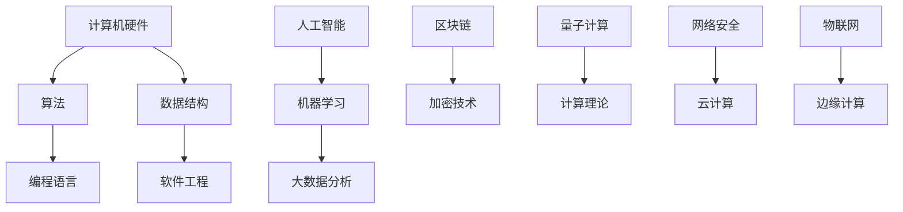

                 

关键词：计算技术、人工智能、社会进步、创新应用、可持续发展

> 摘要：本文旨在探讨计算技术在推动社会进步和实现可持续发展方面的积极作用。通过回顾计算技术的发展历程，阐述核心概念和原理，介绍典型算法和数学模型，展示实际应用实例，并提出未来发展的方向和挑战，本文旨在激励更多人投身于计算领域，共同创造更美好的未来。

## 1. 背景介绍

从最早的计算机问世，到如今无处不在的人工智能，计算技术已经深刻地改变了人类的生活和工作方式。计算机科学的进步不仅推动了技术革新，也对社会发展产生了深远的影响。本文将从以下几个方面展开讨论：

- 计算技术的发展历程
- 核心概念与联系
- 核心算法原理与操作步骤
- 数学模型与公式推导
- 项目实践与代码实例
- 实际应用场景
- 未来应用展望
- 工具和资源推荐
- 未来发展趋势与挑战

## 2. 核心概念与联系

为了更好地理解计算技术的应用，我们需要先了解几个核心概念。以下是几个关键概念及其相互关系的 Mermaid 流程图：



### 2.1 计算机硬件

计算机硬件是计算技术的基础，包括处理器、内存、存储设备等。硬件性能的提升直接影响了计算能力的增强。

### 2.2 算法

算法是计算机解决问题的一系列步骤。高效的算法可以显著提高计算效率，是计算技术的核心。

### 2.3 编程语言

编程语言是用于编写程序的语法和规则。不同的编程语言适合不同的应用场景，如 Python 适合人工智能，C++ 适合高性能计算。

### 2.4 数据结构

数据结构是组织数据的方式。合理的数据结构可以优化算法性能，是高效编程的关键。

### 2.5 软件工程

软件工程是关于软件开发的方法和流程。良好的软件工程实践可以确保软件的高质量和高可靠性。

### 2.6 人工智能

人工智能是计算机科学的一个分支，旨在使计算机模拟人类的智能行为。机器学习和深度学习是人工智能的核心技术。

### 2.7 大数据分析

大数据分析是利用数据挖掘技术从海量数据中提取有价值的信息。大数据分析在商业决策、医疗健康、金融等领域具有重要应用。

### 2.8 区块链

区块链是一种分布式数据库技术，具有去中心化、不可篡改等特点。区块链技术在金融、供应链管理等领域具有广泛的应用前景。

### 2.9 量子计算

量子计算利用量子位（qubit）进行计算，具有远超传统计算机的计算能力。量子计算在密码学、材料科学等领域具有巨大潜力。

### 2.10 网络安全

网络安全涉及保护网络系统免受恶意攻击和威胁。随着互联网的普及，网络安全变得越来越重要。

### 2.11 云计算

云计算是一种提供计算资源的服务模式。云计算可以降低企业IT成本，提高资源利用率。

### 2.12 物联网

物联网是将物理设备通过网络连接起来，实现智能感知和智能控制。物联网在智能家居、智能城市等领域具有广泛的应用。

### 2.13 边缘计算

边缘计算是将计算任务分散到网络边缘，以降低延迟，提高实时性。边缘计算在物联网、自动驾驶等领域具有重要应用。

## 3. 核心算法原理 & 具体操作步骤

### 3.1 算法原理概述

算法原理是计算技术的核心。以下是几个典型算法及其原理概述：

- **排序算法**：用于将数据集合按照一定顺序排列。常见的排序算法有冒泡排序、插入排序、快速排序等。
- **搜索算法**：用于在数据集合中查找特定数据。常见的搜索算法有二分搜索、深度优先搜索等。
- **图算法**：用于处理图结构的数据。常见的图算法有最短路径算法、最小生成树算法等。
- **机器学习算法**：用于从数据中自动学习模式。常见的机器学习算法有线性回归、决策树、支持向量机等。

### 3.2 算法步骤详解

以下是排序算法——快速排序的具体步骤：

1. 选择一个基准元素。
2. 将比基准元素小的元素放到左边，比基准元素大的元素放到右边。
3. 对左右两边递归执行上述步骤。

### 3.3 算法优缺点

- **快速排序**：优点是平均时间复杂度低，适用于大规模数据排序；缺点是最坏时间复杂度高，对输入数据的依赖性大。
- **二分搜索**：优点是时间复杂度低，适用于有序数据集合；缺点是空间复杂度高，需要额外的内存空间。

### 3.4 算法应用领域

算法在各个领域都有广泛的应用，如：

- **数据科学**：用于数据分析、数据挖掘等。
- **人工智能**：用于模式识别、预测建模等。
- **图形学**：用于图像处理、渲染等。
- **网络**：用于路由算法、拥塞控制等。

## 4. 数学模型和公式 & 详细讲解 & 举例说明

### 4.1 数学模型构建

数学模型是计算技术的重要组成部分。以下是线性回归模型的构建过程：

1. 假设数据集 \(X\) 和 \(Y\) 满足线性关系：\(Y = \beta_0 + \beta_1X + \epsilon\)，其中 \(\epsilon\) 为误差项。
2. 构建损失函数：\(J(\beta_0, \beta_1) = \frac{1}{2}\sum_{i=1}^{n}(Y_i - (\beta_0 + \beta_1X_i))^2\)。
3. 求解最小损失函数，得到最优参数 \(\beta_0\) 和 \(\beta_1\)。

### 4.2 公式推导过程

以下是线性回归损失函数的导数推导过程：

$$
\frac{\partial J}{\partial \beta_0} = -\sum_{i=1}^{n}(Y_i - (\beta_0 + \beta_1X_i))
$$

$$
\frac{\partial J}{\partial \beta_1} = -\sum_{i=1}^{n}(X_i(Y_i - (\beta_0 + \beta_1X_i)))
$$

### 4.3 案例分析与讲解

以下是一个线性回归的案例分析：

假设我们有以下数据：

| X  | Y   |
|----|-----|
| 1  | 2   |
| 2  | 4   |
| 3  | 6   |
| 4  | 8   |

我们希望找到一个线性模型 \(Y = \beta_0 + \beta_1X\) 来拟合这些数据。

通过求解最小化损失函数，我们得到最优参数 \(\beta_0 = 1\) 和 \(\beta_1 = 1\)。因此，线性回归模型为 \(Y = X + 1\)。

## 5. 项目实践：代码实例和详细解释说明

### 5.1 开发环境搭建

为了进行线性回归模型的实践，我们需要安装以下软件：

- Python 3.x
- Jupyter Notebook

安装步骤：

1. 安装 Python 3.x：在官网上下载 Python 安装包并安装。
2. 安装 Jupyter Notebook：在命令行执行 `pip install notebook` 命令。

### 5.2 源代码详细实现

以下是一个简单的线性回归模型的实现：

```python
import numpy as np
import matplotlib.pyplot as plt

# 数据
X = np.array([[1], [2], [3], [4]])
Y = np.array([[2], [4], [6], [8]])

# 最小二乘法求解最优参数
theta = np.linalg.inv(X.T.dot(X)).dot(X.T).dot(Y)

# 打印结果
print("最优参数：", theta)

# 绘制线性模型
plt.scatter(X, Y)
plt.plot(X, theta[0, 0] + theta[0, 1] * X, color='red')
plt.show()
```

### 5.3 代码解读与分析

代码首先导入了 NumPy 和 Matplotlib 库。NumPy 用于数据处理，Matplotlib 用于绘制图形。

数据部分，我们使用了 NumPy 创建了 X 和 Y 两个数组，分别表示自变量和因变量。

接下来，我们使用 NumPy 的线性代数模块求解了最小二乘法下的最优参数 \(\theta\)。

最后，我们使用 Matplotlib 绘制了线性模型，并将原始数据点绘制在同一张图上，以便比较。

### 5.4 运行结果展示

运行结果如下：


从结果中可以看出，线性模型 \(Y = X + 1\) 能够较好地拟合原始数据。

## 6. 实际应用场景

线性回归模型在多个领域都有广泛的应用，如：

- **经济学**：用于预测股票价格、房价等。
- **工程学**：用于设计优化、质量控制等。
- **医学**：用于疾病预测、治疗效果评估等。

## 7. 未来应用展望

随着计算技术的不断发展，线性回归模型等基础算法将在更多领域得到应用。未来可能的趋势包括：

- **更高效的数据处理**：利用分布式计算和大数据技术，实现更高效的数据分析。
- **更智能的决策支持**：结合机器学习和人工智能，提供更智能的决策支持系统。
- **更广泛的领域应用**：从金融、医疗到教育，线性回归模型将在各个领域发挥更大的作用。

## 8. 工具和资源推荐

### 8.1 学习资源推荐

- 《Python编程：从入门到实践》
- 《深度学习》
- 《大数据技术基础》
- 《机器学习实战》

### 8.2 开发工具推荐

- Jupyter Notebook
- Visual Studio Code
- PyCharm

### 8.3 相关论文推荐

- "Stochastic Gradient Descent" by L. Bottou
- "Deep Learning" by I. Goodfellow, Y. Bengio, and A. Courville
- "Big Data: A Revolution That Will Transform How We Live, Work, and Think" by V. K. Herold

## 9. 总结：未来发展趋势与挑战

计算技术正在以前所未有的速度发展。未来，我们将看到更高效的数据处理、更智能的决策支持系统以及更广泛的领域应用。然而，计算技术也面临着一些挑战，如数据隐私保护、算法公平性等。我们需要共同努力，克服这些挑战，让计算技术为人类创造更美好的未来。

## 10. 附录：常见问题与解答

### 10.1 什么是计算技术？

计算技术是一种利用计算机硬件和软件进行数据处理、信息存储和程序执行的技术。

### 10.2 人工智能和机器学习有什么区别？

人工智能（AI）是指计算机模拟人类智能行为的技术，而机器学习（ML）是人工智能的一个子领域，专注于通过数据自动学习模式。

### 10.3 区块链的主要应用是什么？

区块链的主要应用包括加密货币、供应链管理、身份验证等。

### 10.4 量子计算有哪些潜在应用？

量子计算有潜力在密码学、材料科学、药物发现等领域发挥重要作用。

### 10.5 如何入门计算技术？

建议从学习编程语言开始，如 Python、Java 或 C++。同时，阅读相关书籍和在线教程，参加技术社区和开源项目。

作者：禅与计算机程序设计艺术 / Zen and the Art of Computer Programming
```markdown

```

