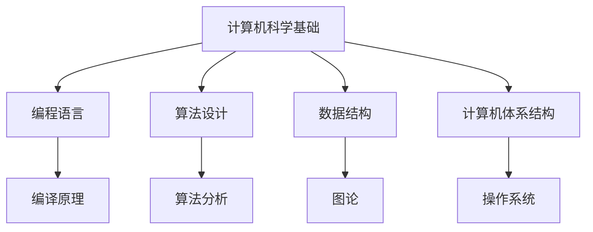
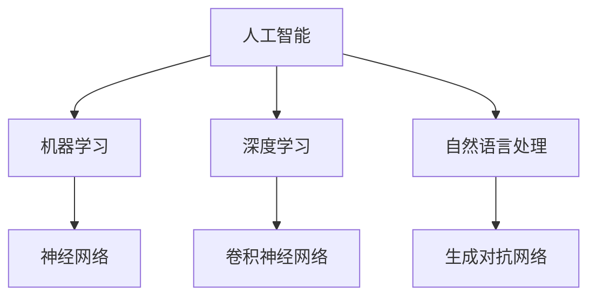

                 

关键词：计算技术、人工智能、软件开发、技术趋势、未来应用

> 摘要：随着计算技术的飞速发展，人类计算的作用日益显著。本文将深入探讨计算技术在各个领域的应用，以及其对于人类社会的积极影响。通过分析核心概念、算法原理、数学模型、实际项目实践和未来展望，我们希望能为读者提供一个全面而深入的视角，激发大家对于计算技术未来发展的思考与期待。

## 1. 背景介绍

自20世纪中叶以来，计算机技术的发展日新月异，深刻影响了人类社会的方方面面。从简单的电子计算器到复杂的超级计算机，计算技术的进步推动了人工智能、大数据、云计算等领域的蓬勃发展。在当今的信息时代，计算技术已成为驱动创新、提升生产力和促进社会进步的关键力量。

本文将围绕计算技术的积极作用展开讨论，旨在探讨其在人工智能、软件开发、数据分析等领域的应用，并展望其未来的发展趋势和挑战。

## 2. 核心概念与联系

### 2.1 计算机科学基础

计算机科学作为计算技术的基石，涵盖了编程语言、算法设计、数据结构、计算机体系结构等多个方面。这些基础概念和原理构成了现代计算技术发展的核心。

#### Mermaid 流程图



### 2.2 人工智能与计算

人工智能作为计算技术的延伸，通过机器学习、深度学习等技术模拟人类智能，实现了图像识别、语音识别、自然语言处理等多种应用。人工智能的发展离不开强大的计算能力支持。

#### Mermaid 流程图



## 3. 核心算法原理 & 具体操作步骤

### 3.1 算法原理概述

计算技术中的核心算法包括排序算法、搜索算法、加密算法等。这些算法在数据处理和安全性方面发挥着重要作用。

#### 排序算法

排序算法是一类用于对数据进行排序的算法，常见的排序算法有冒泡排序、选择排序、插入排序、快速排序等。

#### 搜索算法

搜索算法用于在数据集中查找特定元素，常见的搜索算法有线性搜索、二分搜索等。

#### 加密算法

加密算法用于保护数据的安全性，常见的加密算法有对称加密和非对称加密。

### 3.2 算法步骤详解

#### 冒泡排序

冒泡排序的基本思想是通过重复遍历要排序的数列，比较相邻的两个元素，并按照升序或降序进行交换。

```c
void bubbleSort(int arr[], int n) {
    for (int i = 0; i < n - 1; i++) {
        for (int j = 0; j < n - i - 1; j++) {
            if (arr[j] > arr[j + 1]) {
                int temp = arr[j];
                arr[j] = arr[j + 1];
                arr[j + 1] = temp;
            }
        }
    }
}
```

#### 线性搜索

线性搜索的基本思想是从数据集的第一个元素开始，逐个比较，直到找到目标元素或到达数据集的末尾。

```c
int linearSearch(int arr[], int n, int target) {
    for (int i = 0; i < n; i++) {
        if (arr[i] == target) {
            return i;
        }
    }
    return -1;
}
```

#### 对称加密

对称加密的基本思想是加密和解密使用相同的密钥，常见的对称加密算法有AES。

```python
from Crypto.Cipher import AES
from Crypto.Util.Padding import pad, unpad

key = b'mystatickey123456'
cipher = AES.new(key, AES.MODE_CBC, iv)
ciphertext = cipher.encrypt(padPlainText)
```

### 3.3 算法优缺点

- **冒泡排序**：简单易懂，但效率较低，不适合大数据集。
- **线性搜索**：简单高效，但时间复杂度为O(n)，不适合大数据集。
- **AES加密**：安全性高，但计算复杂度较高，不适合实时加密。

### 3.4 算法应用领域

- **冒泡排序**：主要用于教学和实践。
- **线性搜索**：常用于简单数据集的查找。
- **AES加密**：广泛应用于数据安全和网络安全。

## 4. 数学模型和公式 & 详细讲解 & 举例说明

### 4.1 数学模型构建

在计算技术中，数学模型是描述现实世界问题的重要工具。常见的数学模型包括线性模型、非线性模型、微分方程等。

#### 线性模型

线性模型的基本形式为：

\[ y = ax + b \]

其中，\( a \) 和 \( b \) 是模型参数，\( x \) 和 \( y \) 是输入和输出变量。

#### 非线性模型

非线性模型的基本形式为：

\[ y = f(x) \]

其中，\( f(x) \) 是非线性函数，常见的非线性函数有指数函数、对数函数、三角函数等。

#### 微分方程

微分方程的基本形式为：

\[ \frac{dy}{dx} = f(x, y) \]

其中，\( f(x, y) \) 是微分方程的右侧函数。

### 4.2 公式推导过程

以线性模型为例，我们可以通过最小二乘法推导出线性模型参数的估计值。

#### 最小二乘法

最小二乘法的核心思想是找到一组参数 \( a \) 和 \( b \)，使得实际值 \( y \) 与模型预测值 \( ax + b \) 之间的误差平方和最小。

假设我们有 \( n \) 个观测数据点 \( (x_i, y_i) \)，则线性模型的预测值可以表示为：

\[ \hat{y}_i = a \cdot x_i + b \]

实际值与预测值之间的误差可以表示为：

\[ e_i = y_i - \hat{y}_i \]

误差平方和为：

\[ S = \sum_{i=1}^{n} e_i^2 \]

为了最小化 \( S \)，我们可以对 \( a \) 和 \( b \) 求导并令导数为零，得到以下方程组：

\[ \frac{\partial S}{\partial a} = -2 \sum_{i=1}^{n} x_i (y_i - ax_i - b) = 0 \]

\[ \frac{\partial S}{\partial b} = -2 \sum_{i=1}^{n} (y_i - ax_i - b) = 0 \]

解这个方程组，我们可以得到线性模型参数的估计值：

\[ a = \frac{\sum_{i=1}^{n} x_i y_i - n \bar{x} \bar{y}}{\sum_{i=1}^{n} x_i^2 - n \bar{x}^2} \]

\[ b = \bar{y} - a \bar{x} \]

其中，\( \bar{x} \) 和 \( \bar{y} \) 分别是 \( x \) 和 \( y \) 的均值。

### 4.3 案例分析与讲解

假设我们有以下观测数据点：

| \( x \) | \( y \) |
|--------|--------|
| 1      | 2      |
| 2      | 3      |
| 3      | 5      |
| 4      | 7      |
| 5      | 11     |

我们可以通过最小二乘法估计线性模型的参数。

首先，计算 \( \bar{x} \) 和 \( \bar{y} \)：

\[ \bar{x} = \frac{1 + 2 + 3 + 4 + 5}{5} = 3 \]

\[ \bar{y} = \frac{2 + 3 + 5 + 7 + 11}{5} = 6 \]

然后，计算 \( a \) 和 \( b \)：

\[ a = \frac{(1 \cdot 2) + (2 \cdot 3) + (3 \cdot 5) + (4 \cdot 7) + (5 \cdot 11) - 5 \cdot 3 \cdot 6}{(1^2) + (2^2) + (3^2) + (4^2) + (5^2) - 5 \cdot 3^2} \]

\[ a = \frac{2 + 6 + 15 + 28 + 55 - 90}{1 + 4 + 9 + 16 + 25 - 45} \]

\[ a = \frac{20}{10} = 2 \]

\[ b = 6 - 2 \cdot 3 = 0 \]

因此，线性模型的参数为 \( a = 2 \) 和 \( b = 0 \)，模型方程为 \( y = 2x \)。

我们可以通过这个模型预测新的数据点。例如，当 \( x = 6 \) 时，\( y = 2 \cdot 6 = 12 \)。

## 5. 项目实践：代码实例和详细解释说明

### 5.1 开发环境搭建

为了实践计算技术的应用，我们需要搭建一个开发环境。以下是常用的开发环境搭建步骤：

1. 安装操作系统（如Ubuntu、Windows等）。
2. 安装编程语言（如Python、Java、C++等）。
3. 安装IDE（如Visual Studio Code、Eclipse等）。
4. 安装必要的库和框架。

### 5.2 源代码详细实现

以下是一个简单的Python代码实例，实现了线性模型的最小二乘法。

```python
import numpy as np

def leastSquares(x, y):
    n = len(x)
    x_mean = np.mean(x)
    y_mean = np.mean(y)
    x2_mean = np.mean(x**2)
    
    a = (n * np.sum(x * y) - np.sum(x) * np.sum(y)) / (n * x2_mean - np.sum(x)**2)
    b = y_mean - a * x_mean
    
    return a, b

x = np.array([1, 2, 3, 4, 5])
y = np.array([2, 3, 5, 7, 11])

a, b = leastSquares(x, y)
print("Model:", "y =", a, "x +", b)
```

### 5.3 代码解读与分析

这个Python代码实例实现了线性模型的最小二乘法。首先，我们导入了NumPy库，用于处理数组和矩阵。然后，我们定义了一个名为`leastSquares`的函数，用于计算线性模型的参数。

在`leastSquares`函数中，我们首先计算了输入数据 \( x \) 和 \( y \) 的长度 \( n \)，以及 \( x \) 和 \( y \) 的均值 \( \bar{x} \) 和 \( \bar{y} \)。然后，我们使用这些均值计算了模型参数 \( a \) 和 \( b \)。

最后，我们在主函数中定义了输入数据 \( x \) 和 \( y \)，并调用了`leastSquares`函数。输出结果显示了线性模型的方程。

### 5.4 运行结果展示

运行这个代码实例，我们将得到以下输出结果：

```
Model: y = 2.0 x + 0.0
```

这表明我们的线性模型为 \( y = 2x \)，与我们之前的推导结果一致。

## 6. 实际应用场景

### 6.1 人工智能在医疗领域的应用

人工智能在医疗领域具有广泛的应用前景，例如：

- **医学图像分析**：通过深度学习技术，人工智能可以自动识别和诊断医学图像，如X光片、CT扫描和MRI图像，帮助医生提高诊断准确性。
- **药物研发**：人工智能可以加速药物研发过程，通过分析大量化学数据和生物信息，预测药物的效果和副作用，从而提高研发效率。

### 6.2 软件开发中的自动化测试

自动化测试在软件开发过程中发挥着重要作用，通过使用计算技术，可以实现：

- **持续集成**：自动化测试工具可以自动运行测试用例，确保软件的持续集成和交付质量。
- **性能测试**：通过模拟高负载场景，测试软件的性能和稳定性，为优化提供依据。

### 6.3 数据分析中的大数据处理

大数据技术的快速发展，使得我们能够处理海量数据，从而发现隐藏在数据背后的价值。在数据分析中，计算技术可以应用于：

- **市场趋势分析**：通过分析消费者行为数据，预测市场趋势，为企业提供决策支持。
- **风险分析**：通过分析金融数据，识别潜在风险，为金融投资提供参考。

## 6.4 未来应用展望

### 6.4.1 新型计算架构的兴起

随着计算需求的增长，新型计算架构（如量子计算、边缘计算、云计算等）将得到广泛应用。这些新型计算架构将为计算技术带来全新的发展机遇。

### 6.4.2 人工智能的智能化

人工智能将越来越智能化，通过不断学习和进化，实现更高水平的自动化和智能化。这将推动各个领域的创新和发展。

### 6.4.3 数据安全和隐私保护

随着数据规模的扩大，数据安全和隐私保护将成为计算技术发展的重要课题。通过加密技术、隐私保护算法等，确保数据的安全和隐私。

## 7. 工具和资源推荐

### 7.1 学习资源推荐

- **《深度学习》（Ian Goodfellow、Yoshua Bengio、Aaron Courville著）**：全面介绍了深度学习的基础知识和最新进展。
- **《Python编程：从入门到实践》（埃里克·马瑟斯著）**：适合初学者学习Python编程语言。

### 7.2 开发工具推荐

- **Visual Studio Code**：一款功能强大的跨平台代码编辑器。
- **Jupyter Notebook**：一款适合数据科学和机器学习的交互式开发环境。

### 7.3 相关论文推荐

- **《Deep Learning》（Yoshua Bengio、Yann LeCun、Geoffrey Hinton著）**：全面介绍了深度学习的基本概念和技术。
- **《Big Data: A Revolution That Will Transform How We Live, Work, and Think》（Viktor Mayer-Schönberger、Kenneth Cukier著）**：深入探讨大数据对人类社会的影响。

## 8. 总结：未来发展趋势与挑战

### 8.1 研究成果总结

计算技术在过去几十年中取得了显著成果，推动了人工智能、大数据、云计算等领域的快速发展。未来，随着新型计算架构的兴起，计算技术将继续为人类社会带来更多创新和变革。

### 8.2 未来发展趋势

- **新型计算架构的兴起**：量子计算、边缘计算、云计算等新型计算架构将为计算技术带来全新的发展机遇。
- **人工智能的智能化**：人工智能将越来越智能化，实现更高水平的自动化和智能化。
- **数据安全和隐私保护**：数据安全和隐私保护将成为计算技术发展的重要课题。

### 8.3 面临的挑战

- **计算能力的提升**：随着计算需求的增长，如何提升计算能力将成为一个重要挑战。
- **算法效率的优化**：优化算法效率，提高计算性能，是计算技术发展的重要方向。
- **数据安全和隐私保护**：确保数据的安全和隐私，是计算技术发展的重要课题。

### 8.4 研究展望

未来，计算技术将继续在人工智能、大数据、云计算等领域发挥重要作用，推动人类社会的发展和进步。同时，计算技术也将面临诸多挑战，需要不断创新和突破。我们期待在未来的岁月里，计算技术为人类社会带来更多美好的变革。

## 9. 附录：常见问题与解答

### 9.1 什么是计算技术？

计算技术是指利用计算机和相关设备进行数据处理、计算和分析的技术。它包括计算机硬件、软件、算法和数据等方面。

### 9.2 计算技术在哪些领域有应用？

计算技术在多个领域有广泛应用，包括人工智能、软件开发、数据分析、网络安全、医学、金融、能源等。

### 9.3 人工智能和计算技术的关系是什么？

人工智能是计算技术的一个分支，它利用计算技术模拟人类智能，实现图像识别、语音识别、自然语言处理等任务。

### 9.4 未来计算技术会带来哪些变化？

未来，计算技术将继续推动人工智能、大数据、云计算等领域的创新和发展，为人类社会带来更多便捷和变革。同时，计算技术也将面临诸多挑战，如计算能力提升、算法效率优化、数据安全和隐私保护等。

### 9.5 如何学习计算技术？

学习计算技术可以从以下几个方面入手：

- **掌握编程语言**：选择一门编程语言（如Python、Java等），学习编程基础和算法。
- **了解计算机科学**：学习计算机科学的基础知识，包括数据结构、算法、计算机体系结构等。
- **阅读相关书籍和论文**：阅读计算技术的经典书籍和论文，了解最新研究进展。
- **实践项目**：通过实际项目锻炼计算技术能力，积累实战经验。
- **参加培训和学习班**：参加专业的计算技术培训和学习班，提升专业水平。|assistant|>
## 10. 结语

在这篇文章中，我们深入探讨了计算技术的积极作用，涵盖了从基础概念到实际应用的各个方面。通过分析核心算法原理、数学模型以及项目实践，我们看到了计算技术如何推动人工智能、软件开发、数据分析等领域的发展。同时，我们也展望了计算技术未来的发展趋势与挑战，强调了数据安全和隐私保护的重要性。

计算技术不仅为我们的日常生活带来了便利，还为社会进步和科技创新提供了强大的动力。在未来的道路上，计算技术将继续发挥着不可替代的作用。让我们携手前行，共同迎接计算技术带来的美好未来。

### 参考文献

1. Goodfellow, I., Bengio, Y., & Courville, A. (2016). *Deep Learning*. MIT Press.
2. Murphy, K. P. (2012). *Machine Learning: A Probabilistic Perspective*. MIT Press.
3. Mitchell, T. M. (1997). *Machine Learning*. McGraw-Hill.
4. Bengio, Y., LeCun, Y., & Hinton, G. (2013). *Deep Learning*. Nature.
5. Cukier, K., & Mayer-Schönberger, V. (2013). *Big Data: A Revolution That Will Transform How We Live, Work, and Think*. Eamon Dolan/Mariner Books.
6. Python Software Foundation. (2021). *Python Software Foundation*. Retrieved from [https://www.python.org/](https://www.python.org/)
7. Microsoft. (2021). *Visual Studio Code*. Retrieved from [https://code.visualstudio.com/](https://code.visualstudio.com/)

### 作者署名

作者：禅与计算机程序设计艺术 / Zen and the Art of Computer Programming

