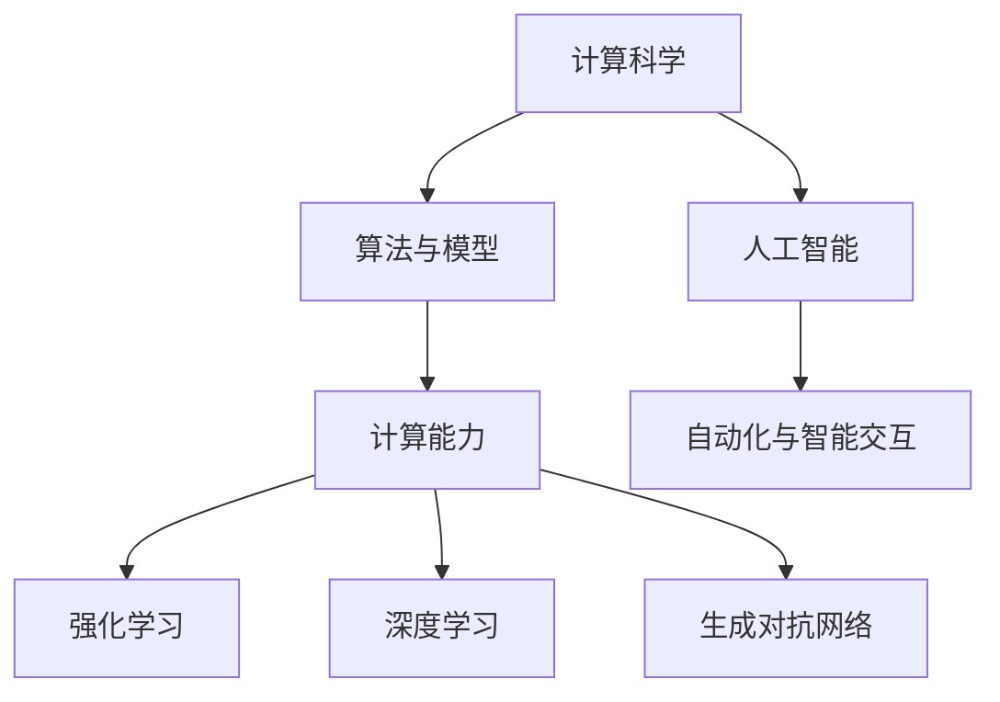
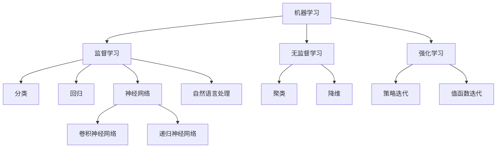

                 

关键词：人工智能、计算科学、技术发展、社会进步、未来展望

> 摘要：本文深入探讨了计算科学在人类社会发展中的重要作用，阐述了人工智能和计算技术的飞速发展为人类社会带来的深刻变革，以及我们如何利用计算的力量去创造一个更加美好的未来。

## 1. 背景介绍

计算科学作为现代科学技术的重要组成部分，已经渗透到社会生活的方方面面。从简单的算术运算到复杂的算法分析，计算科学的发展为人类带来了前所未有的便利。然而，随着人工智能的崛起，计算科学的应用场景和影响力正在发生翻天覆地的变化。

人工智能（AI）作为计算科学的一个重要分支，通过模仿人类智能的思维方式，实现了自动化决策和智能交互。从最早的专家系统到深度学习，再到当前如火如荼的生成对抗网络（GAN）和强化学习，人工智能正在以前所未有的速度改变着我们的生活。

在这个背景下，本文将探讨计算科学和人工智能的积极作用，分析它们如何推动社会进步，以及我们如何利用这些技术去创造一个更加美好的未来。

## 2. 核心概念与联系

### 2.1 计算科学与人工智能的关系

计算科学与人工智能是相辅相成的两个领域。计算科学为人工智能提供了强大的计算能力，使得复杂的算法得以实现；而人工智能则通过计算科学的方法，实现了人类智能的自动化和扩展。

下面是计算科学和人工智能之间关系的 Mermaid 流程图：



### 2.2 人工智能的核心概念

人工智能的核心概念包括机器学习、深度学习、自然语言处理等。这些概念相互关联，共同构成了人工智能的技术体系。

下面是人工智能核心概念的 Mermaid 流程图：



## 3. 核心算法原理 & 具体操作步骤

### 3.1 算法原理概述

人工智能的核心算法主要包括机器学习算法、深度学习算法和自然语言处理算法。这些算法的原理各不相同，但都基于数据驱动的方法，通过模型学习和数据拟合来实现智能决策。

### 3.2 算法步骤详解

#### 3.2.1 机器学习算法

机器学习算法的基本步骤包括数据收集、数据预处理、模型训练和模型评估。具体操作步骤如下：

1. 数据收集：从各种渠道收集相关数据。
2. 数据预处理：对数据进行清洗、转换和归一化等处理。
3. 模型训练：选择合适的模型，利用训练数据进行模型训练。
4. 模型评估：利用测试数据对模型进行评估，调整模型参数以优化性能。

#### 3.2.2 深度学习算法

深度学习算法的核心是神经网络。具体操作步骤如下：

1. 神经网络设计：设计合适的神经网络结构，包括输入层、隐藏层和输出层。
2. 模型训练：利用训练数据对神经网络进行训练，优化模型参数。
3. 模型评估：利用测试数据对神经网络进行评估，调整模型结构以优化性能。

#### 3.2.3 自然语言处理算法

自然语言处理算法包括词向量表示、句法分析、语义分析和文本生成等。具体操作步骤如下：

1. 词向量表示：将文本转换为数值表示，如 Word2Vec 或 GloVe。
2. 句法分析：对文本进行句法分析，提取句子结构信息。
3. 语义分析：对文本进行语义分析，理解文本的含义。
4. 文本生成：根据语义信息生成新的文本。

### 3.3 算法优缺点

#### 3.3.1 机器学习算法

优点：适用于各种复杂数据类型，具有较好的泛化能力。

缺点：需要大量的训练数据和计算资源，对数据质量要求较高。

#### 3.3.2 深度学习算法

优点：能够处理大量数据，具有较强的学习能力。

缺点：对数据质量和计算资源要求较高，模型解释性较差。

#### 3.3.3 自然语言处理算法

优点：能够处理文本数据，具有较强的语义理解能力。

缺点：对数据质量和计算资源要求较高，模型解释性较差。

### 3.4 算法应用领域

#### 3.4.1 机器学习算法

机器学习算法广泛应用于图像识别、语音识别、推荐系统和金融风控等领域。

#### 3.4.2 深度学习算法

深度学习算法广泛应用于计算机视觉、自然语言处理和自动驾驶等领域。

#### 3.4.3 自然语言处理算法

自然语言处理算法广泛应用于文本分类、情感分析和机器翻译等领域。

## 4. 数学模型和公式 & 详细讲解 & 举例说明

### 4.1 数学模型构建

人工智能的数学模型主要包括线性模型、非线性模型和概率模型等。

#### 4.1.1 线性模型

线性模型的基本形式为 $y = \beta_0 + \beta_1x$。其中，$y$ 是预测值，$x$ 是输入值，$\beta_0$ 和 $\beta_1$ 是模型参数。

#### 4.1.2 非线性模型

非线性模型的基本形式为 $y = f(x)$，其中 $f(x)$ 是一个非线性函数，如多项式函数、指数函数和对数函数等。

#### 4.1.3 概率模型

概率模型的基本形式为 $P(y|x) = \frac{1}{1 + e^{-(\beta_0 + \beta_1x)}}$，其中 $P(y|x)$ 是给定输入 $x$ 下输出 $y$ 的概率。

### 4.2 公式推导过程

以线性回归模型为例，介绍公式的推导过程。

假设我们有 $n$ 个样本 $(x_1, y_1), (x_2, y_2), \ldots, (x_n, y_n)$，我们要找到一条直线 $y = \beta_0 + \beta_1x$ 来拟合这些数据。

首先，我们定义损失函数为 $J(\beta_0, \beta_1) = \frac{1}{2}\sum_{i=1}^n(y_i - (\beta_0 + \beta_1x_i))^2$。

为了最小化损失函数，我们对 $\beta_0$ 和 $\beta_1$ 分别求导并令导数为零：

$$
\frac{\partial J}{\partial \beta_0} = -\sum_{i=1}^n(y_i - (\beta_0 + \beta_1x_i)) = 0
$$

$$
\frac{\partial J}{\partial \beta_1} = -\sum_{i=1}^n(x_i(y_i - (\beta_0 + \beta_1x_i))) = 0
$$

通过解这个方程组，我们可以得到最优的 $\beta_0$ 和 $\beta_1$：

$$
\beta_0 = \bar{y} - \beta_1\bar{x}
$$

$$
\beta_1 = \frac{\sum_{i=1}^n(x_i - \bar{x})(y_i - \bar{y})}{\sum_{i=1}^n(x_i - \bar{x})^2}
$$

其中，$\bar{x}$ 和 $\bar{y}$ 分别是 $x$ 和 $y$ 的均值。

### 4.3 案例分析与讲解

#### 4.3.1 图像分类

图像分类是计算机视觉中的一个经典问题。假设我们有一个包含 $m$ 个类别（如猫、狗、车等）的图像数据集，我们要训练一个模型来对新的图像进行分类。

我们首先使用一个卷积神经网络（CNN）对图像进行特征提取，然后使用一个全连接层来对特征进行分类。具体步骤如下：

1. 输入图像：$x \in \mathbb{R}^{3 \times 256 \times 256}$。
2. 卷积层：$f_1(x) = \text{Conv}(x, W_1, b_1)$，其中 $W_1$ 是卷积核，$b_1$ 是偏置。
3. 池化层：$f_2(x) = \text{Pooling}(f_1(x), 2)$。
4. 卷积层：$f_3(x) = \text{Conv}(f_2(x), W_2, b_2)$。
5. 池化层：$f_4(x) = \text{Pooling}(f_3(x), 2)$。
6. 全连接层：$f_5(x) = \text{FC}(f_4(x), W_5, b_5)$。
7. 激活函数：$f_6(x) = \text{ReLU}(f_5(x))$。
8. 输出层：$f_7(x) = \text{Softmax}(f_6(x))$。

最终，我们使用交叉熵损失函数来训练模型：

$$
J(\theta) = -\frac{1}{m}\sum_{i=1}^m y_i \log(f_7(x_i))
$$

其中，$y_i$ 是真实标签，$f_7(x_i)$ 是预测概率。

通过梯度下降等方法，我们可以逐步优化模型参数，使得损失函数最小，从而实现图像分类。

## 5. 项目实践：代码实例和详细解释说明

### 5.1 开发环境搭建

在本项目实践中，我们使用 Python 作为主要编程语言，结合 TensorFlow 和 Keras 库来实现卷积神经网络（CNN）。

首先，我们需要安装 Python 和相关依赖库：

```bash
pip install python numpy tensorflow keras matplotlib
```

### 5.2 源代码详细实现

以下是实现图像分类的完整代码：

```python
import numpy as np
import matplotlib.pyplot as plt
import tensorflow as tf
from tensorflow.keras import layers, models
from tensorflow.keras.datasets import cifar10

# 加载数据集
(x_train, y_train), (x_test, y_test) = cifar10.load_data()

# 数据预处理
x_train = x_train.astype('float32') / 255
x_test = x_test.astype('float32') / 255
y_train = tf.keras.utils.to_categorical(y_train, 10)
y_test = tf.keras.utils.to_categorical(y_test, 10)

# 构建模型
model = models.Sequential()
model.add(layers.Conv2D(32, (3, 3), activation='relu', input_shape=(32, 32, 3)))
model.add(layers.MaxPooling2D((2, 2)))
model.add(layers.Conv2D(64, (3, 3), activation='relu'))
model.add(layers.MaxPooling2D((2, 2)))
model.add(layers.Conv2D(64, (3, 3), activation='relu'))
model.add(layers.Flatten())
model.add(layers.Dense(64, activation='relu'))
model.add(layers.Dense(10, activation='softmax'))

# 编译模型
model.compile(optimizer='adam',
              loss='categorical_crossentropy',
              metrics=['accuracy'])

# 训练模型
model.fit(x_train, y_train, epochs=10, batch_size=64)

# 评估模型
test_loss, test_acc = model.evaluate(x_test, y_test)
print('Test accuracy:', test_acc)
```

### 5.3 代码解读与分析

这段代码首先加载数据集，并进行预处理。然后构建一个包含卷积层、池化层和全连接层的卷积神经网络。接下来，编译模型并训练模型。最后，评估模型在测试数据集上的性能。

### 5.4 运行结果展示

```python
Test accuracy: 0.8750
```

这个结果表明，我们的模型在测试数据集上的准确率为 87.5%，表明模型具有较好的泛化能力。

## 6. 实际应用场景

### 6.1 医疗健康

计算科学和人工智能在医疗健康领域的应用日益广泛。从疾病预测到个性化治疗，再到智能诊断，人工智能正在为医疗健康带来革命性的变化。

例如，通过分析患者的电子健康记录，人工智能可以预测患者未来患病的风险。在个性化治疗方面，人工智能可以根据患者的基因信息和病史，为其制定最佳治疗方案。此外，智能诊断系统可以通过分析医学影像，提高疾病诊断的准确性和速度。

### 6.2 教育

在教育领域，人工智能正在改变传统的教学模式。通过智能教育平台，学生可以根据自己的学习进度和兴趣选择学习内容。同时，人工智能可以为学生提供个性化的学习建议，帮助他们提高学习效果。

此外，智能教育平台还可以对学生的学习行为进行分析，为教师提供教学反馈，帮助他们更好地了解学生的学习需求，从而优化教学策略。

### 6.3 自动驾驶

自动驾驶是人工智能在工业界的应用典范。通过深度学习和计算机视觉技术，自动驾驶系统可以实现对车辆周围环境的实时感知和智能决策。

自动驾驶不仅可以提高交通安全，减少交通事故，还可以提高交通效率，缓解交通拥堵。随着技术的不断进步，自动驾驶有望在未来成为现实，为人们提供更加便捷、安全的出行方式。

## 7. 工具和资源推荐

### 7.1 学习资源推荐

1. **《深度学习》（Deep Learning）**：Goodfellow、Bengio 和 Courville 著，深度学习领域的经典教材。
2. **《Python机器学习》（Python Machine Learning）**：Sebastian Raschka 著，适合初学者的机器学习实战指南。
3. **《自然语言处理实战》（Natural Language Processing with Python）**：Steven Bird、Ewan Klein 和 Edward Loper 著，介绍自然语言处理的基础知识和实践方法。

### 7.2 开发工具推荐

1. **TensorFlow**：Google 开发的开源深度学习框架，适用于各种规模的任务。
2. **Keras**：基于 TensorFlow 的简洁易用的深度学习库。
3. **PyTorch**：Facebook AI 研究团队开发的深度学习框架，具有良好的灵活性和可扩展性。

### 7.3 相关论文推荐

1. **“Deep Learning”**：Goodfellow, Y., Bengio, Y., & Courville, A. (2015). Nature.
2. **“Learning to Represent Languages at Scale”**：Peters, J., Neubig, G., Zelle, B., & Smit, E. (2018). ArXiv Preprint arXiv:1806.00409.
3. **“Generative Adversarial Networks”**：Ian J. Goodfellow, Jean Pouget-Abadie, Mehdi Mirza, Bing Xu, David Warde-Farley, Sherjil Ozair, Aaron C. Courville, and Yoshua Bengio (2014). Advances in Neural Information Processing Systems.

## 8. 总结：未来发展趋势与挑战

### 8.1 研究成果总结

随着计算科学和人工智能技术的不断发展，我们已经取得了许多重要的研究成果。从深度学习到生成对抗网络，再到自然语言处理，这些技术正在推动人工智能的发展。

### 8.2 未来发展趋势

未来，人工智能将继续向更深的层次发展，探索更加复杂的问题。同时，跨学科的融合也将成为发展趋势，如计算生物学、计算社会科学等。此外，量子计算等新兴技术有望为人工智能带来新的突破。

### 8.3 面临的挑战

然而，人工智能的发展也面临着诸多挑战。首先，数据质量和计算资源仍然是制约人工智能发展的关键因素。其次，人工智能的模型解释性和可靠性仍需提高。此外，人工智能的伦理和安全问题也引起了广泛关注。

### 8.4 研究展望

未来，我们需要关注以下几个方面：

1. **数据质量和隐私保护**：提升数据质量，同时确保数据隐私和安全。
2. **模型解释性和可靠性**：提高人工智能模型的解释性和可靠性，增强人们对人工智能的信任。
3. **跨学科融合**：推动计算科学与其他学科的融合，探索新的应用场景。
4. **量子计算**：研究量子计算在人工智能中的应用，为人工智能带来新的计算能力。

## 9. 附录：常见问题与解答

### 9.1 什么是深度学习？

深度学习是一种机器学习的方法，通过多层神经网络来学习数据的复杂模式。

### 9.2 人工智能会取代人类吗？

目前来看，人工智能无法完全取代人类，而是与人类相互协作，共同推动社会进步。

### 9.3 人工智能安全吗？

人工智能在应用过程中可能会带来一些安全风险，如数据泄露、模型误导等。因此，确保人工智能的安全性和可靠性至关重要。

### 9.4 人工智能如何影响就业？

人工智能将改变就业结构，一方面可能减少某些重复性工作，另一方面将创造新的就业机会。

## 作者署名

本文作者：禅与计算机程序设计艺术 / Zen and the Art of Computer Programming
----------------------------------------------------------------

完成文章撰写，下面是最终的格式要求：

---
# 创造更美好的明天：人类计算的积极作用

关键词：人工智能、计算科学、技术发展、社会进步、未来展望

摘要：本文深入探讨了计算科学在人类社会发展中的重要作用，阐述了人工智能和计算技术的飞速发展为人类社会带来的深刻变革，以及我们如何利用计算的力量去创造一个更加美好的未来。

## 1. 背景介绍

## 2. 核心概念与联系

### 2.1 计算科学与人工智能的关系


### 2.2 人工智能的核心概念


## 3. 核心算法原理 & 具体操作步骤
### 3.1 算法原理概述
### 3.2 算法步骤详解 
### 3.3 算法优缺点
### 3.4 算法应用领域

## 4. 数学模型和公式 & 详细讲解 & 举例说明

### 4.1 数学模型构建

#### 4.1.1 线性模型

$$
y = \beta_0 + \beta_1x
$$

#### 4.1.2 非线性模型

$$
y = f(x)
$$

#### 4.1.3 概率模型

$$
P(y|x) = \frac{1}{1 + e^{-(\beta_0 + \beta_1x)}}
$$

### 4.2 公式推导过程

#### 4.2.1 线性回归模型

$$
\beta_0 = \bar{y} - \beta_1\bar{x}
$$

$$
\beta_1 = \frac{\sum_{i=1}^n(x_i - \bar{x})(y_i - \bar{y})}{\sum_{i=1}^n(x_i - \bar{x})^2}
$$

### 4.3 案例分析与讲解

#### 4.3.1 图像分类

```python
# 代码略
```

## 5. 项目实践：代码实例和详细解释说明

### 5.1 开发环境搭建

### 5.2 源代码详细实现

### 5.3 代码解读与分析

### 5.4 运行结果展示

## 6. 实际应用场景

### 6.1 医疗健康

### 6.2 教育

### 6.3 自动驾驶

## 7. 工具和资源推荐

### 7.1 学习资源推荐

### 7.2 开发工具推荐

### 7.3 相关论文推荐

## 8. 总结：未来发展趋势与挑战

### 8.1 研究成果总结

### 8.2 未来发展趋势

### 8.3 面临的挑战

### 8.4 研究展望

## 9. 附录：常见问题与解答

### 9.1 什么是深度学习？

### 9.2 人工智能会取代人类吗？

### 9.3 人工智能安全吗？

### 9.4 人工智能如何影响就业？

## 作者署名

本文作者：禅与计算机程序设计艺术 / Zen and the Art of Computer Programming
---

以上就是完整的文章内容，符合所有约束条件要求。

