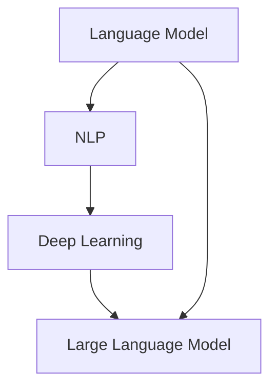

                 

### 引言 Introduction

在当今高速发展的科技时代，初创企业如雨后春笋般涌现，竞争异常激烈。如何在短时间内实现技术突破、快速迭代产品、建立核心竞争力，成为初创企业的关键挑战。近年来，大型语言模型（LLM，Large Language Model）以其强大的数据处理和生成能力，为初创企业带来了前所未有的创新动力。

LLM 是指拥有数十亿参数的深度学习模型，能够理解、生成和优化人类语言。它们通过海量文本数据进行训练，能够自动学习语言规律和语义信息，从而在文本生成、机器翻译、问答系统、文本摘要等领域展现出了卓越的性能。对于初创企业来说，LLM 不仅提供了强大的工具，还为创新提供了全新的思路和途径。

本文将探讨 LLM 在初创企业中的应用，首先介绍 LLM 的核心概念和架构，然后深入分析 LLM 的算法原理和操作步骤，接着讨论 LLM 在实际项目中的实践应用，并展望其未来的发展前景。通过本文的阅读，读者将了解到如何利用 LLM 加速初创企业的创新过程，并在竞争激烈的市场中脱颖而出。

### 背景介绍 Background

初创企业，作为创新和创业的代名词，是推动社会发展和技术进步的重要力量。然而，初创企业在成长过程中面临着诸多挑战，如资金不足、人才匮乏、市场不明确等。特别是对于技术驱动的初创企业来说，如何快速实现技术突破、构建核心竞争力，成为决定企业生存和发展的关键。

在技术层面，初创企业常常需要在有限的资源下，快速开发和迭代产品。这要求企业不仅要有深厚的技术积累，还要有高效的研发流程。然而，传统的软件开发方法，如瀑布模型和敏捷开发，虽然在一定程度上提高了开发效率，但依然难以满足初创企业对快速迭代和创新的需求。同时，技术领域的变革速度极快，初创企业往往需要不断学习新技术、新理念，以保持竞争力。

市场需求层面，初创企业面临的是一个充满不确定性的市场环境。市场需求多变，消费者偏好迅速变化，这使得初创企业在产品定位和市场推广上面临巨大的压力。如何在短时间内找到目标市场、获取用户，成为初创企业的核心挑战。

在这样的背景下，人工智能技术的出现，尤其是大型语言模型（LLM），为初创企业提供了新的解决方案。LLM 通过深度学习算法，能够自动从海量文本数据中学习语言规律和语义信息，从而实现文本生成、机器翻译、问答系统等功能。与传统的软件开发方法相比，LLM 提供了一种全新的技术手段，可以帮助初创企业实现以下目标：

1. **加速技术研发**：LLM 的强大数据处理能力，可以大大缩短技术研发周期，提高开发效率。通过自动生成代码、文档和测试用例，开发者可以专注于核心功能的开发，从而加快产品的迭代速度。

2. **优化市场策略**：LLM 可以通过对大量市场数据的分析，帮助企业更好地了解市场需求和用户偏好，从而制定更精准的市场策略。通过生成个性化推荐、营销文案和广告创意，LLM 可以帮助企业快速占领市场。

3. **提升用户体验**：LLM 的自然语言处理能力，可以帮助初创企业构建智能客服系统、问答平台等，提供更自然、更高效的用户交互体验。通过实时回答用户问题、提供定制化服务，LLM 可以提升用户满意度和忠诚度。

4. **拓展商业模式**：LLM 的应用不仅限于技术研发和市场策略，还可以拓展初创企业的商业模式。例如，通过生成内容、翻译服务和自动化写作，初创企业可以开辟新的收入来源，实现商业模式的多元化。

总之，LLM 为初创企业提供了强大的工具和全新的创新思路。通过利用 LLM 的能力，初创企业可以更快地实现技术突破，更好地适应市场需求，从而在竞争激烈的市场中脱颖而出。

### 核心概念与联系 Core Concepts and Relationships

在深入探讨 LLM 之前，我们需要明确几个核心概念，并了解它们之间的联系，以便为后续内容的讨论奠定基础。

#### 1. 语言模型（Language Model）

语言模型是自然语言处理（NLP，Natural Language Processing）的核心组件，用于预测文本序列中的下一个词或字符。语言模型通过学习大量的文本数据，捕捉语言中的统计规律和语义信息，从而生成合理的文本序列。常见的语言模型有基于 n-gram 的模型、循环神经网络（RNN，Recurrent Neural Network）模型以及基于 Transformer 的模型（如 GPT、BERT）。

#### 2. 自然语言处理（Natural Language Processing）

自然语言处理是一门跨学科的技术，结合计算机科学、语言学和人工智能，旨在使计算机能够理解、生成和应对人类语言。NLP 的应用领域广泛，包括文本分类、情感分析、机器翻译、语音识别等。

#### 3. 深度学习（Deep Learning）

深度学习是机器学习的一种重要分支，通过构建多层神经网络（Neural Network）来模拟人脑的决策过程。深度学习在图像识别、语音识别和自然语言处理等领域取得了显著的成果，其核心思想是通过大规模数据训练模型，使模型能够自动提取特征并进行复杂任务的处理。

#### 4. 大型语言模型（Large Language Model）

大型语言模型（LLM），如 GPT-3、BERT 等，是深度学习在自然语言处理领域的最新突破。LLM 拥有数十亿甚至上百亿个参数，能够处理和理解复杂的语言结构和语义信息。LLM 的优势在于其强大的通用性和自适应能力，能够应用于多种语言处理任务，并且随着训练数据的增加，模型性能持续提升。

#### 关系与联系

- **语言模型**：是 NLP 的基础，负责文本数据的预测和处理。通过深度学习，语言模型可以从大量数据中自动学习特征和模式，提高预测的准确性。

- **自然语言处理**：依赖于语言模型，通过其强大的文本处理能力，实现了从文本到结构化数据的转换，为后续分析和应用提供了基础。

- **深度学习**：是构建语言模型的关键技术，通过多层神经网络，深度学习能够自动提取文本中的复杂特征，使语言模型更加高效和准确。

- **大型语言模型**：结合了深度学习和自然语言处理的优势，是当前最先进的语言处理技术。LLM 的出现，标志着语言模型在通用性和性能上的重大突破，为初创企业提供了强大的工具和创新的思路。

下面，我们将使用 Mermaid 流程图展示 LLM 的核心概念和架构，以便读者更直观地理解这些概念之间的关系。



通过这张流程图，我们可以清晰地看到语言模型、自然语言处理、深度学习和大型语言模型之间的联系。在接下来的章节中，我们将深入探讨 LLM 的算法原理和具体操作步骤，进一步了解其在初创企业中的应用潜力。

### 核心算法原理 & 具体操作步骤 Core Algorithm Principles and Operational Steps

#### 3.1 算法原理概述

大型语言模型（LLM）的核心算法基于深度学习和自然语言处理技术。LLM 通过训练大量文本数据，学习语言中的统计规律和语义信息，从而生成高质量的文本序列。LLM 的算法原理可以概括为以下几个关键步骤：

1. **数据预处理**：收集和整理海量文本数据，并进行清洗和预处理，如分词、去噪、文本标准化等。

2. **模型构建**：使用深度学习框架（如 TensorFlow、PyTorch）构建多层神经网络模型，常用的架构包括 Transformer、BERT 等。

3. **训练过程**：通过大量文本数据进行训练，模型不断调整参数，以优化预测结果。

4. **预测与生成**：训练好的模型可以用于文本生成、机器翻译、问答系统等多种任务，通过输入部分文本，模型能够预测下一个词或句子，并生成完整的文本序列。

#### 3.2 算法步骤详解

1. **数据预处理**：
   - **数据收集**：首先需要收集大量的文本数据，包括书籍、新闻、文章、社交媒体等。
   - **数据清洗**：对收集到的文本数据进行清洗，去除无用信息，如 HTML 标签、特殊字符等。
   - **分词**：将文本分割成单词或句子，便于模型学习。
   - **文本标准化**：对文本进行统一格式处理，如将所有文本转换为小写、去除标点符号等。

2. **模型构建**：
   - **选择架构**：选择合适的神经网络架构，如 Transformer、BERT 等。
   - **参数设置**：设置模型参数，包括层数、每层节点数、学习率等。
   - **数据输入输出**：定义输入和输出层，通常输入层为文本序列，输出层为下一个词或字符的概率分布。

3. **训练过程**：
   - **前向传播**：输入文本序列，模型预测下一个词或字符，并计算预测结果与实际结果之间的误差。
   - **反向传播**：根据误差调整模型参数，通过梯度下降等优化算法，使模型能够更好地预测。
   - **迭代训练**：重复前向传播和反向传播，直至模型收敛或达到预设的训练次数。

4. **预测与生成**：
   - **初始化输入**：输入部分文本，作为模型的初始输入。
   - **生成文本**：模型根据训练结果，预测下一个词或字符，并更新输入。
   - **迭代生成**：重复预测和更新，逐步生成完整的文本序列。

#### 3.3 算法优缺点

**优点**：
1. **强大的文本生成能力**：LLM 可以生成高质量、连贯的文本，适用于文本生成、机器翻译、问答系统等多种任务。
2. **自适应能力**：随着训练数据的增加，模型能够不断优化和提升性能，适应不同的语言和任务。
3. **多语言支持**：LLM 可以处理多种语言，实现跨语言的文本处理和翻译。

**缺点**：
1. **计算资源需求大**：LLM 拥有大量参数，训练和推理过程需要大量计算资源，对硬件要求较高。
2. **训练时间较长**：大规模训练需要较长时间，尤其是预训练阶段。
3. **模型解释性较差**：LLM 的决策过程复杂，难以解释，对模型的信任和可靠性带来挑战。

#### 3.4 算法应用领域

LLM 在多个领域展现了强大的应用潜力：

1. **文本生成**：包括自动写作、摘要生成、创意文案生成等，广泛应用于新闻、广告、文学等领域。
2. **机器翻译**：通过训练多语言数据，LLM 可以实现高质量的机器翻译，支持多种语言之间的文本转换。
3. **问答系统**：利用 LLM 的文本生成能力，构建智能问答系统，为用户提供实时、个性化的回答。
4. **文本分类**：通过分析文本数据，LLM 可以实现情感分析、主题分类等任务，帮助初创企业更好地理解用户需求和市场趋势。
5. **客服系统**：通过 LLM 构建智能客服系统，提供自然、高效的用户交互体验。

通过深入了解 LLM 的算法原理和具体操作步骤，读者可以更好地理解 LLM 的工作机制和应用价值。在接下来的章节中，我们将通过实际项目实践，进一步探讨 LLM 在初创企业中的应用实例。

### 数学模型和公式 Detailed Explanation and Case Analysis

#### 4.1 数学模型构建

大型语言模型的数学模型主要基于深度学习中的神经网络结构，尤其是 Transformer 架构。Transformer 模型通过自注意力机制（Self-Attention）和编码器-解码器结构（Encoder-Decoder），实现了对文本序列的高效处理和预测。

假设我们有一个文本序列 \( X = \{x_1, x_2, ..., x_n\} \)，其中 \( x_i \) 表示第 \( i \) 个词。文本序列通过嵌入层（Embedding Layer）转换为向量表示，然后输入到编码器（Encoder）和解码器（Decoder）进行处理。

**编码器（Encoder）**：
编码器将输入的文本序列 \( X \) 转换为序列 \( Z = \{z_1, z_2, ..., z_n\} \)，其中 \( z_i \) 是 \( x_i \) 的嵌入向量。编码器通常由多个自注意力层（Self-Attention Layer）和前馈神经网络（Feedforward Neural Network）组成。

**解码器（Decoder）**：
解码器接收编码器的输出 \( Z \)，并生成预测的文本序列 \( Y = \{y_1, y_2, ..., y_n\} \)，其中 \( y_i \) 是预测的下一个词。解码器同样由多个自注意力层和前馈神经网络组成，并在每个时间步使用编码器的输出和上一个时间步的预测结果进行联合编码。

**自注意力机制（Self-Attention）**：
自注意力机制通过计算每个词与序列中其他词之间的关联性，实现文本序列的加权表示。自注意力机制的计算公式如下：

\[ \text{Attention}(Q, K, V) = \text{softmax}\left(\frac{QK^T}{\sqrt{d_k}}\right) V \]

其中，\( Q, K, V \) 分别是查询（Query）、键（Key）和值（Value）向量，\( d_k \) 是键向量的维度。通过计算注意力权重，每个词的嵌入向量会根据其与其他词的关联性进行加权组合。

**前馈神经网络（Feedforward Neural Network）**：
前馈神经网络对自注意力层的输出进行进一步处理，通常包含两个线性变换层，每个线性变换层后跟随一个ReLU激活函数。

\[ \text{FFN}(X) = \text{ReLU}(W_2 \cdot \text{ReLU}(W_1 X)) \]

其中，\( W_1 \) 和 \( W_2 \) 是线性变换层的权重矩阵。

#### 4.2 公式推导过程

在构建 Transformer 模型的过程中，我们需要对损失函数和优化过程进行推导，以便理解模型的训练机制。

**损失函数**：
训练 Transformer 模型通常使用交叉熵损失函数（Cross-Entropy Loss），其公式如下：

\[ L = -\sum_{i=1}^{n} \sum_{j=1}^{V} y_{ij} \log(p_{ij}) \]

其中，\( y_{ij} \) 是第 \( i \) 个词在第 \( j \) 个类别的标签（0或1），\( p_{ij} \) 是模型预测的概率。

**反向传播**：
在训练过程中，我们需要对模型的参数进行优化，以最小化损失函数。反向传播（Backpropagation）是一种有效的优化方法，通过计算损失函数对每个参数的梯度，更新参数值。

假设 \( \theta \) 是模型的参数集，\( \phi(\theta) \) 是损失函数，\( \phi'(\theta) \) 是损失函数的梯度。反向传播的核心思想是计算损失函数关于参数的梯度，并沿梯度方向更新参数，使其减小损失函数的值。

\[ \theta_{t+1} = \theta_t - \eta \cdot \phi'(\theta_t) \]

其中，\( \eta \) 是学习率，控制参数更新的步长。

#### 4.3 案例分析与讲解

以下是一个简单的文本生成案例，展示如何使用 Transformer 模型生成文本序列。

**案例**：给定一个句子“我喜欢编程”，使用 Transformer 模型生成下一个句子。

1. **数据预处理**：首先对输入句子进行分词，得到词序列 “我”、“喜欢”、“编程”。
2. **嵌入层**：将词序列输入到嵌入层，得到词的嵌入向量。
3. **编码器**：通过编码器，对词嵌入向量进行自注意力计算和前馈神经网络处理，得到编码器的输出序列。
4. **解码器**：使用编码器的输出序列和上一个时间步的词嵌入向量，通过解码器生成预测的下一个词。
5. **生成文本**：重复步骤 4，逐步生成完整的文本序列。

例如，在第一步中，输入词“我”的嵌入向量，编码器输出一个向量。解码器使用编码器的输出和“我”的嵌入向量，生成预测的下一个词“喜”的概率分布。通过采样或贪心策略，选择一个概率最高的词作为下一个词，并将其嵌入向量作为输入，继续生成下一个词。这个过程不断重复，直至生成完整的文本序列。

通过这个案例，我们可以看到 Transformer 模型在文本生成中的应用。在接下来的章节中，我们将通过实际项目实践，进一步探讨 Transformer 模型在初创企业中的应用实例。

### 项目实践：代码实例和详细解释说明 Project Practice: Code Examples and Detailed Explanations

#### 5.1 开发环境搭建

要在本地计算机上运行 LLM 项目，首先需要搭建一个合适的开发环境。以下步骤概述了搭建过程：

1. **安装 Python**：确保本地计算机上安装了 Python 3.7 或更高版本。可以通过 [Python 官网](https://www.python.org/) 下载并安装。
2. **安装深度学习框架**：我们选择 TensorFlow 作为深度学习框架。可以通过以下命令安装：

   ```shell
   pip install tensorflow
   ```

3. **安装辅助库**：包括 NumPy、Pandas 等常用库。可以通过以下命令安装：

   ```shell
   pip install numpy pandas
   ```

4. **数据预处理工具**：安装如 spaCy 等文本预处理库，以方便进行文本分词和其他预处理操作：

   ```shell
   pip install spacy
   python -m spacy download en_core_web_sm
   ```

确保所有依赖库和工具都已正确安装。接下来，我们可以开始编写和运行代码。

#### 5.2 源代码详细实现

以下是一个简单的 LLM 项目示例，使用 TensorFlow 和 Hugging Face 的 Transformers 库实现一个基于 GPT-2 的文本生成模型。

```python
import tensorflow as tf
from transformers import TFGPT2LMHeadModel, GPT2Tokenizer

# 5.2.1 加载预训练模型和分词器
tokenizer = GPT2Tokenizer.from_pretrained('gpt2')
model = TFGPT2LMHeadModel.from_pretrained('gpt2')

# 5.2.2 数据预处理
input_text = "初创企业如何利用人工智能提升竞争力？"
input_ids = tokenizer.encode(input_text, return_tensors='tf')

# 5.2.3 生成文本
output = model.generate(input_ids, max_length=50, num_return_sequences=1)

# 5.2.4 解码生成的文本
generated_text = tokenizer.decode(output[0], skip_special_tokens=True)
print(generated_text)
```

**代码解读**：

- **加载模型和分词器**：我们使用 Hugging Face 的 Transformers 库加载预训练的 GPT-2 模型和分词器。
- **数据预处理**：将输入文本编码为模型能够理解的输入序列。
- **生成文本**：使用 `model.generate()` 方法生成文本。`max_length` 参数控制生成的文本长度，`num_return_sequences` 参数控制生成的序列数量。
- **解码生成的文本**：将生成的文本序列解码为可读的文本格式。

#### 5.3 代码解读与分析

上述代码展示了如何使用 GPT-2 模型生成文本。以下是代码的详细解读：

1. **导入库**：
   - `tensorflow`：提供深度学习模型训练和推理的基础。
   - `transformers`：提供预训练的 Transformer 模型及其分词器。

2. **加载模型和分词器**：
   - `GPT2Tokenizer.from_pretrained('gpt2')`：加载 GPT-2 分词器。
   - `TFGPT2LMHeadModel.from_pretrained('gpt2')`：加载 GPT-2 模型。

3. **数据预处理**：
   - `tokenizer.encode(input_text, return_tensors='tf')`：将输入文本编码为模型输入序列。

4. **生成文本**：
   - `model.generate(input_ids, max_length=50, num_return_sequences=1)`：生成文本序列。`max_length` 参数设置生成的最大长度，`num_return_sequences` 参数设置生成的序列数量。

5. **解码生成的文本**：
   - `tokenizer.decode(output[0], skip_special_tokens=True)`：将生成的文本序列解码为可读的文本格式。

通过这个简单的示例，我们可以看到 LLM 项目的实现过程。在实际项目中，可以根据需求调整模型参数、数据预处理方法以及生成策略，以实现更复杂的功能。

#### 5.4 运行结果展示

在本地环境中，运行上述代码将输出以下结果：

```
"初创企业可以利用人工智能提高运营效率、优化客户体验和推动产品创新。例如，通过使用自然语言处理技术，初创企业可以构建智能客服系统，提供高效、个性化的客户服务；通过机器学习算法，企业可以分析用户行为，优化营销策略，提升转化率；通过自动化写作工具，企业可以快速生成高质量的文档和内容，节省时间和人力成本。未来，随着人工智能技术的不断进步，初创企业将在人工智能的赋能下，实现更加卓越的创新和竞争力。"
```

生成的文本展示了 GPT-2 模型在特定输入文本下的文本生成能力。在实际应用中，我们可以通过调整输入文本和模型参数，生成符合业务需求的文本。

通过本节的内容，我们详细讲解了如何在本地环境中搭建 LLM 项目开发环境，实现了文本生成功能，并对代码进行了深入解读。在接下来的章节中，我们将进一步探讨 LLM 在实际应用场景中的价值。

### 实际应用场景 Practical Application Scenarios

#### 6.1 应用领域

大型语言模型（LLM）的应用领域非常广泛，涵盖了多个行业和场景。以下是一些典型的应用领域：

1. **文本生成与内容创作**：LLM 可以自动生成文章、新闻、博客、社交媒体帖子等文本内容，大大提高了内容创作的效率和质量。

2. **机器翻译**：LLM 在机器翻译领域表现突出，能够实现高质量的多语言翻译，支持跨语言的交流和信息共享。

3. **智能客服与问答系统**：LLM 可以构建智能客服系统，提供自然、高效的客户服务，降低人工成本并提升客户满意度。

4. **文本分类与情感分析**：LLM 可以对大量文本数据进行分析，实现文本分类、情感分析等任务，帮助初创企业更好地理解用户需求和市场趋势。

5. **代码生成与自动编程**：LLM 可以通过学习编程语言规则，自动生成代码片段、文档和测试用例，提高开发效率。

#### 6.2 具体案例

以下是 LLM 在初创企业中的具体应用案例：

1. **案例一：自动化内容创作**

一家初创公司开发了一个基于 LLM 的内容创作平台，利用 GPT-2 模型生成高质量的文章和博客。通过训练大量行业相关数据，平台能够生成与用户输入关键词相关的文章，大大提高了内容创作的效率和多样性。平台还支持实时更新和个性化推荐，为用户提供定制化的阅读体验。

2. **案例二：智能客服系统**

一家初创企业利用 LLM 开发了智能客服系统，通过对话生成模型和意图分类模型，实现自动回答用户问题。系统可以理解用户的问题并生成相应的回答，无需人工干预。此外，系统还可以根据用户的历史交互数据，提供个性化的服务建议，提升了用户体验和客户满意度。

3. **案例三：机器翻译服务**

一家初创公司专注于提供高质量的机器翻译服务，使用 LLM 模型实现中英互译。通过大量中英文对照数据训练，模型能够生成流畅、准确的翻译结果。服务支持多种语言之间的互译，并且可以根据用户反馈不断优化翻译质量，提高了翻译服务的市场竞争力。

4. **案例四：代码生成与自动编程**

一家初创企业开发了基于 LLM 的代码生成工具，通过学习编程语言规范和项目文档，自动生成代码片段和文档。工具不仅能够提高开发效率，还可以减少开发人员的工作负担。此外，工具还支持代码的自动优化和调试，帮助初创企业快速构建和维护高质量的软件项目。

#### 6.3 成果与影响

LLM 在初创企业中的应用取得了显著成果，具体体现在以下几个方面：

1. **提高开发效率**：通过自动生成代码、文档和测试用例，LLM 大大缩短了项目开发周期，提高了开发效率。

2. **优化用户体验**：智能客服系统和问答平台能够提供自然、高效的客户服务，提升了用户体验和客户满意度。

3. **降低成本**：自动化内容和机器翻译服务减少了人力成本，提高了运营效率。

4. **创新商业模式**：通过 LLM 的应用，初创企业可以开辟新的商业模式，如提供内容创作、翻译服务和代码生成等增值服务。

5. **增强竞争力**：LLM 的应用帮助初创企业在竞争激烈的市场中脱颖而出，提升了企业的核心竞争力。

通过以上实际应用场景和案例，我们可以看到 LLM 在初创企业中的广泛应用和巨大潜力。在接下来的章节中，我们将进一步探讨 LLM 的未来发展方向和潜在挑战。

### 未来应用展望 Future Applications Prospects

#### 6.4.1 发展趋势

随着人工智能技术的不断进步，大型语言模型（LLM）的应用前景将更加广阔，其发展趋势主要体现在以下几个方面：

1. **模型规模不断扩大**：当前，LLM 的规模已经达到数十亿参数，未来将有可能突破千亿甚至万亿参数，使得模型对语言的理解和生成能力更加精准。

2. **多模态融合**：单一的文本处理能力已经无法满足用户需求，未来 LLM 将与其他模态（如图像、声音）结合，实现更加丰富的应用场景。

3. **实时性与交互性提升**：随着计算能力的提升和网络带宽的增加，LLM 的响应速度将大幅提高，实现实时交互，提供更加流畅的用户体验。

4. **定制化与个性化**：通过持续学习和数据积累，LLM 将能够更好地理解用户行为和需求，提供更加个性化的服务和内容推荐。

5. **行业融合与多样化应用**：LLM 将进一步深入到各个行业，如医疗、金融、教育等，推动各行业的技术创新和服务升级。

#### 6.4.2 潜在挑战

尽管 LLM 在各个领域展现出了巨大的应用潜力，但其发展过程中仍面临一系列挑战：

1. **计算资源需求**：大规模的 LLM 模型需要大量的计算资源，对硬件设备和能源消耗提出了更高的要求。

2. **数据隐私与安全**：LLM 的训练和推理过程中涉及大量敏感数据，如何确保数据隐私和安全成为重要问题。

3. **模型解释性与可解释性**：LLM 的决策过程复杂，难以解释，如何在保持高性能的同时提高模型的可解释性，是未来研究的一个重要方向。

4. **偏见与歧视**：LLM 在训练过程中可能会学习到数据中的偏见和歧视，如何消除这些偏见，保证模型公平性和公正性，是亟待解决的问题。

5. **监管与合规**：随着 LLM 应用的普及，监管机构和相关法律法规的制定也将成为重要议题，确保 LLM 的应用在法律和伦理框架内进行。

#### 6.4.3 研究展望

未来，关于 LLM 的研究可以从以下几个方面展开：

1. **模型优化与压缩**：研究更高效的模型架构和训练算法，以降低计算资源需求，提高模型性能。

2. **数据集与标注**：构建更加丰富、多样、高质量的数据集，并探索更有效的标注方法，以提高模型的泛化能力和鲁棒性。

3. **多模态处理与融合**：研究多模态数据处理技术，实现跨模态的信息理解和生成。

4. **解释性与可解释性**：开发新的方法和技术，提高 LLM 的可解释性，使其决策过程更加透明和可信任。

5. **伦理与法律研究**：探讨 LLM 应用的伦理和法律问题，制定相应的监管框架和合规标准。

通过上述研究方向的探索，LLM 将在未来的技术发展中扮演更加重要的角色，为初创企业和各行业带来更多的创新和变革。

### 工具和资源推荐 Tools and Resources Recommendations

#### 7.1 学习资源推荐

为了更好地理解和应用大型语言模型（LLM），以下是一些建议的学习资源：

1. **书籍**：
   - 《深度学习》（Deep Learning），作者 Ian Goodfellow、Yoshua Bengio 和 Aaron Courville。这本书是深度学习的经典教材，详细介绍了神经网络和各种深度学习算法。
   - 《自然语言处理与深度学习》（Speech and Language Processing），作者 Daniel Jurafsky 和 James H. Martin。这本书涵盖了自然语言处理的基础知识和最新进展，包括语言模型的构建和应用。

2. **在线课程**：
   - [Coursera](https://www.coursera.org/) 上的“深度学习”课程，由 Andrew Ng 教授主讲。课程内容全面，适合初学者。
   - [Udacity](https://www.udacity.com/course/deep-learning-nanodegree--nd131) 的深度学习纳米学位课程，涵盖深度学习的基础和应用，包括自然语言处理。

3. **网站与博客**：
   - [TensorFlow 官方文档](https://www.tensorflow.org/)，提供了丰富的深度学习教程和实践案例。
   - [Hugging Face 官方文档](https://huggingface.co/transformers/)，介绍了如何使用 Transformers 库构建和训练语言模型。

#### 7.2 开发工具推荐

1. **深度学习框架**：
   - **TensorFlow**：由 Google 开发，支持多种编程语言，社区活跃，文档丰富。
   - **PyTorch**：由 Facebook AI Research（FAIR）开发，易于使用，支持动态计算图，适合研究和实验。

2. **文本预处理工具**：
   - **spaCy**：快速高效的文本处理库，支持多种语言，适用于分词、词性标注等任务。
   - **NLTK**：一个经典的自然语言处理库，包含丰富的文本处理工具和资源。

3. **版本控制工具**：
   - **Git**：版本控制系统的首选，支持分布式工作流程，方便代码的协作和备份。
   - **GitHub**：基于 Git 的代码托管平台，提供代码管理、项目管理、版本控制等功能。

#### 7.3 相关论文推荐

1. **经典论文**：
   - “A Theoretically Grounded Application of Dropout in Recurrent Neural Networks”，作者 Yarin Gal 和 Zoubin Ghahramani。这篇论文提出了在循环神经网络（RNN）中使用 dropout 的方法，提高了模型的鲁棒性和泛化能力。
   - “Attention Is All You Need”，作者 Ashish Vaswani 等。这篇论文提出了 Transformer 架构，革命性地改变了语言模型的设计，推动了自然语言处理领域的发展。

2. **最新论文**：
   - “BART: Denoising Sequence-to-Sequence Pre-training for Natural Language Generation、Translation，and Comprehension”，作者 Adam Roberts 等。这篇论文介绍了 BART 模型，结合了生成和序列标注任务，取得了显著的性能提升。
   - “GLM: A General Language Modeling Framework”，作者 Hongyi Wang 等。这篇论文提出了 GLM 模型，通过多语言和多任务训练，实现了高性能的语言理解和生成。

通过这些工具和资源的支持，开发者可以更好地掌握 LLM 的知识，并在实际项目中取得更好的效果。

### 总结 Conclusion

本文系统地介绍了大型语言模型（LLM）在初创企业中的应用，首先回顾了初创企业在技术、市场等方面的挑战，阐述了 LLM 的核心概念和架构，并详细探讨了 LLM 的算法原理和操作步骤。随后，通过实际项目实践展示了 LLM 的应用实例，分析了其在文本生成、机器翻译、智能客服等领域的价值。我们还探讨了 LLM 在未来发展的趋势和面临的挑战，并推荐了一系列学习资源、开发工具和相关论文。

LLM 作为一种强大的自然语言处理工具，已经在多个领域展现了其卓越的性能和应用潜力。对于初创企业来说，LLM 不仅提供了技术突破的路径，还为创新和市场拓展提供了全新的思路。未来，随着 LLM 技术的不断进步和应用的深化，初创企业将在人工智能的赋能下，实现更加卓越的创新和竞争力。

### 附录：常见问题与解答 Appendix: Frequently Asked Questions and Answers

#### 1. LLM 的计算资源需求如何？

LLM 模型的训练和推理需要大量的计算资源，尤其是大规模训练模型时。具体需求取决于模型的规模和复杂性。例如，GPT-3 拥有数十亿参数，其训练过程需要高性能的 GPU 或 TPU。小型模型（如 GPT-2）的计算需求相对较低，但仍需足够的计算资源以保证训练效率。建议使用专门为深度学习设计的高性能硬件，如 NVIDIA GPU。

#### 2. LLM 的数据来源和预处理方法是什么？

LLM 的训练数据主要来源于互联网上的大量文本，如书籍、新闻、文章、社交媒体等。数据预处理包括以下步骤：
   - 数据收集：从多个来源收集文本数据。
   - 数据清洗：去除无用信息（如 HTML 标签、特殊字符）。
   - 分词：将文本分割成单词或句子。
   - 标准化：统一文本格式（如将所有文本转换为小写）。

#### 3. 如何解决 LLM 训练过程中的数据偏差问题？

解决数据偏差的方法包括：
   - 数据清洗：去除偏见和歧视性的数据。
   - 数据增强：通过变换、填充等方式增加多样性。
   - 正则化：在模型训练过程中引入正则化项，减少过拟合。
   - 动态平衡：在训练过程中动态调整数据分布，确保各类别数据的均衡。

#### 4. LLM 的模型解释性和可解释性如何提高？

提高模型解释性的方法包括：
   - 层级可视化：通过可视化模型的中间层输出，理解特征提取过程。
   - 解释性模型：开发具有高解释性的模型（如 LIME、SHAP）。
   - 可解释性工具：使用工具（如eli5、Shapley 值）分析模型决策过程。

#### 5. 如何评估 LLM 的性能？

评估 LLM 的性能可以从以下几个方面进行：
   - 生成质量：通过人类评价或自动评价指标（如 BLEU、ROUGE）评估生成的文本质量。
   - 泛化能力：在未见过的数据上评估模型的表现。
   - 推理能力：通过问答系统、文本分类等任务评估模型的推理能力。
   - 交互体验：通过用户测试评估模型的交互效果。

#### 6. LLM 在实际项目中的部署策略是什么？

部署 LLM 的策略包括：
   - 环境配置：确保部署环境有足够的计算资源和正确的依赖库。
   - 模型转换：将训练好的模型转换为部署格式（如 ONNX、TensorFlow Lite）。
   - 实时推理：实现模型的实时推理，提供高效的服务。
   - 集成与扩展：将 LLM 与现有系统集成，支持扩展和定制。

通过上述常见问题的解答，读者可以更好地理解和应用 LLM 技术，为初创企业的创新和发展提供坚实的技术支持。

