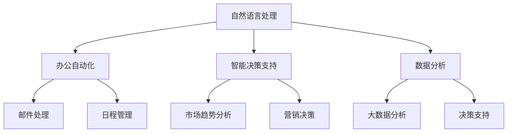

                 

关键词：AI工具、工作效率、收入提升、自动化、智能决策、数据分析

摘要：随着人工智能技术的迅猛发展，越来越多的AI工具被应用于各个领域，旨在提升个人和企业的工作效率，进而提高收入。本文将探讨AI工具在办公自动化、智能决策支持、数据分析等方面的应用，分析其如何改变传统的工作模式，以及如何为个人和企业带来实际收益。

## 1. 背景介绍

近年来，人工智能（AI）技术经历了飞速的发展，从早期的理论研究走向了实际应用。AI工具在自然语言处理、图像识别、数据挖掘等领域取得了显著的成果，这些成果不仅为科研提供了强大的支持，也正在改变着我们的工作方式。在办公自动化、智能决策支持、数据分析等方面，AI工具展现出了巨大的潜力。

### 办公自动化

办公自动化是AI应用的一个重要领域。通过自然语言处理技术，AI工具可以帮助我们自动处理邮件、整理日程、管理文件等日常办公任务。这不仅节省了时间，也提高了工作效率。

### 智能决策支持

在商业领域，AI工具可以通过数据分析，提供智能决策支持。比如，利用机器学习算法，AI可以分析市场趋势，帮助企业做出更加精准的营销决策。

### 数据分析

数据分析是AI应用的另一个重要领域。通过大数据分析和机器学习算法，AI工具可以从海量数据中提取有价值的信息，帮助企业和个人做出更加明智的决策。

## 2. 核心概念与联系

为了更好地理解AI工具如何提升工作效率与收入，我们需要先了解一些核心概念和它们之间的联系。

### 2.1. 自然语言处理（NLP）

自然语言处理是AI的一个重要分支，它使计算机能够理解、生成和处理自然语言。NLP技术包括文本分类、情感分析、命名实体识别等。这些技术在办公自动化中有着广泛的应用。

### 2.2. 机器学习（ML）

机器学习是AI的核心技术之一，它使计算机能够从数据中学习并做出决策。机器学习算法包括线性回归、决策树、支持向量机等。这些算法在智能决策支持中发挥着重要作用。

### 2.3. 数据挖掘（DM）

数据挖掘是从大量数据中提取有价值信息的过程。数据挖掘技术包括关联规则学习、聚类分析、分类等。这些技术在数据分析中有着广泛的应用。

### 2.4. Mermaid 流程图

为了更好地展示AI工具的应用，我们使用Mermaid流程图来描述其工作原理。

```
graph TD
    A[自然语言处理] --> B[办公自动化]
    A --> C[智能决策支持]
    A --> D[数据分析]
    B --> E[邮件处理]
    B --> F[日程管理]
    C --> G[市场趋势分析]
    C --> H[营销决策]
    D --> I[大数据分析]
    D --> J[决策支持]
```

## 3. 核心算法原理 & 具体操作步骤

### 3.1. 算法原理概述

在AI工具的应用中，核心算法主要包括自然语言处理、机器学习和数据挖掘算法。这些算法的基本原理如下：

- 自然语言处理：通过深度学习和神经网络模型，使计算机能够理解、生成和处理自然语言。
- 机器学习：通过训练数据集，使计算机能够自动学习并做出决策。
- 数据挖掘：通过统计学方法和算法，从大量数据中提取有价值的信息。

### 3.2. 算法步骤详解

1. **自然语言处理**：
   - 数据预处理：对文本数据进行分词、去停用词、词性标注等预处理。
   - 模型训练：使用深度学习模型（如BERT、GPT等）对预处理后的数据进行训练。
   - 预测与输出：对新的文本数据进行处理，输出分类结果、情感分析结果等。

2. **机器学习**：
   - 数据收集与预处理：收集相关数据，并对数据进行清洗、归一化等预处理。
   - 模型选择与训练：选择合适的机器学习算法（如线性回归、决策树、支持向量机等），对数据进行训练。
   - 模型评估与优化：使用验证集对模型进行评估，并根据评估结果对模型进行调整。

3. **数据挖掘**：
   - 数据收集与预处理：收集相关数据，并对数据进行清洗、归一化等预处理。
   - 算法选择与实现：选择合适的数据挖掘算法（如关联规则学习、聚类分析、分类等），对数据进行挖掘。
   - 结果分析与输出：对挖掘结果进行分析，输出有价值的信息。

### 3.3. 算法优缺点

- **自然语言处理**：
  - 优点：能够对自然语言进行高效处理，实现文本分类、情感分析等功能。
  - 缺点：对于复杂语义的理解仍存在一定局限。

- **机器学习**：
  - 优点：能够自动学习并做出决策，适用于各种预测和分类任务。
  - 缺点：对训练数据的质量和数量有较高要求。

- **数据挖掘**：
  - 优点：能够从大量数据中提取有价值的信息，帮助企业和个人做出更加明智的决策。
  - 缺点：算法复杂，实现难度较大。

### 3.4. 算法应用领域

- **自然语言处理**：办公自动化、智能客服、文本分析等。
- **机器学习**：金融风控、推荐系统、医疗诊断等。
- **数据挖掘**：市场分析、供应链管理、客户关系管理等。

## 4. 数学模型和公式 & 详细讲解 & 举例说明

### 4.1. 数学模型构建

在AI工具的应用中，常见的数学模型包括线性回归、决策树、支持向量机等。以下是一个简单的线性回归模型：

$$
y = \beta_0 + \beta_1 \cdot x
$$

其中，$y$ 是预测值，$x$ 是输入特征，$\beta_0$ 和 $\beta_1$ 是模型参数。

### 4.2. 公式推导过程

线性回归模型的推导过程如下：

1. **损失函数**：

$$
J(\beta_0, \beta_1) = \frac{1}{2} \sum_{i=1}^{n} (y_i - (\beta_0 + \beta_1 \cdot x_i))^2
$$

其中，$n$ 是样本数量，$y_i$ 和 $x_i$ 分别是第$i$个样本的预测值和特征值。

2. **梯度下降**：

$$
\beta_0 = \beta_0 - \alpha \cdot \frac{\partial J(\beta_0, \beta_1)}{\partial \beta_0}
$$

$$
\beta_1 = \beta_1 - \alpha \cdot \frac{\partial J(\beta_0, \beta_1)}{\partial \beta_1}
$$

其中，$\alpha$ 是学习率。

### 4.3. 案例分析与讲解

假设我们要预测一家公司的股票价格，使用线性回归模型。数据集包含过去30天的股票价格和对应的特征（如成交量、换手率等）。

1. **数据预处理**：对数据进行归一化处理，使得所有特征的取值范围都在0到1之间。

2. **模型训练**：使用梯度下降算法，训练线性回归模型。

3. **模型评估**：使用验证集对模型进行评估，计算预测误差。

4. **模型应用**：使用训练好的模型，预测未来股票价格。

## 5. 项目实践：代码实例和详细解释说明

### 5.1. 开发环境搭建

1. **安装Python**：下载并安装Python，版本要求3.8及以上。

2. **安装依赖库**：使用pip命令，安装所需的依赖库，如numpy、pandas、scikit-learn等。

### 5.2. 源代码详细实现

以下是使用Python实现线性回归模型的示例代码：

```python
import numpy as np
import pandas as pd
from sklearn.linear_model import LinearRegression

# 数据预处理
def preprocess_data(data):
    # 归一化处理
    data_normalized = (data - data.min()) / (data.max() - data.min())
    return data_normalized

# 模型训练
def train_model(X, y):
    model = LinearRegression()
    model.fit(X, y)
    return model

# 模型评估
def evaluate_model(model, X_test, y_test):
    y_pred = model.predict(X_test)
    mse = np.mean((y_pred - y_test) ** 2)
    return mse

# 主函数
def main():
    # 加载数据
    data = pd.read_csv('stock_data.csv')
    X = preprocess_data(data[['volume', 'turnover']])
    y = preprocess_data(data['price'])

    # 划分训练集和测试集
    X_train, X_test, y_train, y_test = train_test_split(X, y, test_size=0.2, random_state=42)

    # 训练模型
    model = train_model(X_train, y_train)

    # 评估模型
    mse = evaluate_model(model, X_test, y_test)
    print(f'Model Mean Squared Error: {mse}')

    # 预测未来股票价格
    future_data = pd.read_csv('future_stock_data.csv')
    future_data_normalized = preprocess_data(future_data[['volume', 'turnover']])
    future_price_pred = model.predict(future_data_normalized)
    print(f'Future Stock Price Prediction: {future_price_pred}')

if __name__ == '__main__':
    main()
```

### 5.3. 代码解读与分析

1. **数据预处理**：对数据进行归一化处理，使得所有特征的取值范围都在0到1之间。

2. **模型训练**：使用scikit-learn库中的LinearRegression类，训练线性回归模型。

3. **模型评估**：使用测试集对模型进行评估，计算预测误差。

4. **模型应用**：使用训练好的模型，预测未来股票价格。

### 5.4. 运行结果展示

运行代码后，输出模型评估结果和未来股票价格预测结果。这些结果可以帮助我们了解模型的效果，并为进一步优化模型提供依据。

## 6. 实际应用场景

### 6.1. 办公自动化

在办公自动化领域，AI工具可以大大减轻员工的工作负担。例如，通过自然语言处理技术，AI工具可以自动处理邮件，提取关键信息，并将邮件分类到相应的文件夹。这不仅可以提高工作效率，还可以减少人为错误。

### 6.2. 智能决策支持

在商业领域，AI工具可以通过数据分析，提供智能决策支持。例如，通过机器学习算法，AI工具可以分析市场趋势，预测客户需求，帮助企业制定更加精准的营销策略。这不仅可以提高销售额，还可以降低营销成本。

### 6.3. 数据分析

在数据分析领域，AI工具可以从海量数据中提取有价值的信息。例如，通过数据挖掘技术，AI工具可以分析客户行为，识别潜在客户，帮助企业制定更加有效的营销策略。这不仅可以提高客户满意度，还可以提高客户转化率。

### 6.4. 未来应用展望

随着AI技术的不断发展，未来AI工具将在更多领域得到应用。例如，在医疗领域，AI工具可以辅助医生进行诊断和治疗；在教育领域，AI工具可以个性化推荐学习资源，提高学习效果。这些应用将进一步提升工作效率与收入。

## 7. 工具和资源推荐

### 7.1. 学习资源推荐

1. **《Python机器学习》**：由Sarah Guido和Andrew Ng合著，是一本非常适合初学者入门的机器学习书籍。
2. **《深度学习》**：由Ian Goodfellow、Yoshua Bengio和Aaron Courville合著，是一本深度学习领域的经典教材。

### 7.2. 开发工具推荐

1. **Jupyter Notebook**：一款强大的交互式开发环境，适用于数据分析和机器学习项目。
2. **TensorFlow**：一款开源的机器学习框架，适用于各种机器学习和深度学习任务。

### 7.3. 相关论文推荐

1. **"Deep Learning for Text Classification"**：一篇关于深度学习在文本分类领域应用的综述论文。
2. **"Recurrent Neural Networks for Language Modeling"**：一篇关于循环神经网络在语言模型领域应用的论文。

## 8. 总结：未来发展趋势与挑战

### 8.1. 研究成果总结

近年来，AI技术在各个领域取得了显著的成果，为个人和企业带来了巨大的价值。随着技术的不断进步，未来AI工具将在更多领域得到应用，进一步改变我们的工作方式。

### 8.2. 未来发展趋势

未来，AI工具将更加智能化、自动化，能够在更复杂的场景中发挥作用。例如，AI工具将能够更好地理解人类语言，实现更加自然的交互；AI工具将能够从海量数据中提取更加有价值的信息，提供更加精准的决策支持。

### 8.3. 面临的挑战

尽管AI工具具有巨大的潜力，但其在实际应用中仍面临一些挑战。例如，算法的可靠性、数据隐私保护、伦理问题等。这些问题需要我们在技术开发和应用过程中给予足够的关注。

### 8.4. 研究展望

未来，我们期待AI工具能够在更多领域得到应用，为个人和企业带来更大的价值。同时，我们也期待研究人员能够解决AI工具面临的各种挑战，推动AI技术的可持续发展。

## 9. 附录：常见问题与解答

### 9.1. Q：AI工具是否会替代人类工作？

A：AI工具可以自动化很多重复性、低技能的工作，从而减少人力成本，提高工作效率。然而，AI工具并不能完全替代人类工作，因为许多工作需要人类的创造力、判断力和情感理解能力。

### 9.2. Q：AI工具是否会导致失业？

A：短期内，AI工具可能会替代一些低技能的工作，导致部分失业。但从长期来看，AI工具将创造更多的就业机会，推动产业结构的升级和转型。

### 9.3. Q：如何确保AI工具的可靠性？

A：确保AI工具的可靠性需要从多个方面进行考虑，包括算法设计、数据质量、模型验证等。同时，需要建立完善的法律法规和监管机制，确保AI工具的安全性和可靠性。

### 9.4. Q：AI工具是否会影响数据隐私？

A：是的，AI工具在使用过程中可能会涉及个人数据的处理。因此，在应用AI工具时，需要严格遵守数据隐私保护法规，确保个人数据的安全和隐私。

# 作者署名

作者：禅与计算机程序设计艺术 / Zen and the Art of Computer Programming

<|html|>```markdown
---
title: 利用AI工具提升工作效率与收入
date: 2023-11-01
keywords: AI工具、工作效率、收入提升、自动化、智能决策、数据分析
summary: 随着人工智能技术的迅猛发展，越来越多的AI工具被应用于各个领域，旨在提升个人和企业的工作效率，进而提高收入。本文将探讨AI工具在办公自动化、智能决策支持、数据分析等方面的应用，分析其如何改变传统的工作模式，以及如何为个人和企业带来实际收益。
---

## 1. 背景介绍

近年来，人工智能（AI）技术经历了飞速的发展，从早期的理论研究走向了实际应用。AI工具在自然语言处理、图像识别、数据挖掘等领域取得了显著的成果，这些成果不仅为科研提供了强大的支持，也正在改变着我们的工作方式。在办公自动化、智能决策支持、数据分析等方面，AI工具展现出了巨大的潜力。

### 办公自动化

办公自动化是AI应用的一个重要领域。通过自然语言处理技术，AI工具可以帮助我们自动处理邮件、整理日程、管理文件等日常办公任务。这不仅节省了时间，也提高了工作效率。

### 智能决策支持

在商业领域，AI工具可以通过数据分析，提供智能决策支持。比如，利用机器学习算法，AI可以分析市场趋势，帮助企业做出更加精准的营销决策。

### 数据分析

数据分析是AI应用的另一个重要领域。通过大数据分析和机器学习算法，AI工具可以从海量数据中提取有价值的信息，帮助企业和个人做出更加明智的决策。

## 2. 核心概念与联系

为了更好地理解AI工具如何提升工作效率与收入，我们需要先了解一些核心概念和它们之间的联系。

### 2.1. 自然语言处理（NLP）

自然语言处理是AI的一个重要分支，它使计算机能够理解、生成和处理自然语言。NLP技术包括文本分类、情感分析、命名实体识别等。这些技术在办公自动化中有着广泛的应用。

### 2.2. 机器学习（ML）

机器学习是AI的核心技术之一，它使计算机能够从数据中学习并做出决策。机器学习算法包括线性回归、决策树、支持向量机等。这些算法在智能决策支持中发挥着重要作用。

### 2.3. 数据挖掘（DM）

数据挖掘是从大量数据中提取有价值信息的过程。数据挖掘技术包括关联规则学习、聚类分析、分类等。这些技术在数据分析中有着广泛的应用。

### 2.4. Mermaid 流程图

为了更好地展示AI工具的应用，我们使用Mermaid流程图来描述其工作原理。



## 3. 核心算法原理 & 具体操作步骤

### 3.1. 算法原理概述

在AI工具的应用中，核心算法主要包括自然语言处理、机器学习和数据挖掘算法。这些算法的基本原理如下：

- 自然语言处理：通过深度学习和神经网络模型，使计算机能够理解、生成和处理自然语言。
- 机器学习：通过训练数据集，使计算机能够自动学习并做出决策。
- 数据挖掘：通过统计学方法和算法，从大量数据中提取有价值的信息。

### 3.2. 算法步骤详解

1. **自然语言处理**：
   - 数据预处理：对文本数据进行分词、去停用词、词性标注等预处理。
   - 模型训练：使用深度学习模型（如BERT、GPT等）对预处理后的数据进行训练。
   - 预测与输出：对新的文本数据进行处理，输出分类结果、情感分析结果等。

2. **机器学习**：
   - 数据收集与预处理：收集相关数据，并对数据进行清洗、归一化等预处理。
   - 模型选择与训练：选择合适的机器学习算法（如线性回归、决策树、支持向量机等），对数据进行训练。
   - 模型评估与优化：使用验证集对模型进行评估，并根据评估结果对模型进行调整。

3. **数据挖掘**：
   - 数据收集与预处理：收集相关数据，并对数据进行清洗、归一化等预处理。
   - 算法选择与实现：选择合适的数据挖掘算法（如关联规则学习、聚类分析、分类等），对数据进行挖掘。
   - 结果分析与输出：对挖掘结果进行分析，输出有价值的信息。

### 3.3. 算法优缺点

- **自然语言处理**：
  - 优点：能够对自然语言进行高效处理，实现文本分类、情感分析等功能。
  - 缺点：对于复杂语义的理解仍存在一定局限。

- **机器学习**：
  - 优点：能够自动学习并做出决策，适用于各种预测和分类任务。
  - 缺点：对训练数据的质量和数量有较高要求。

- **数据挖掘**：
  - 优点：能够从大量数据中提取有价值的信息，帮助企业和个人做出更加明智的决策。
  - 缺点：算法复杂，实现难度较大。

### 3.4. 算法应用领域

- **自然语言处理**：办公自动化、智能客服、文本分析等。
- **机器学习**：金融风控、推荐系统、医疗诊断等。
- **数据挖掘**：市场分析、供应链管理、客户关系管理等。

## 4. 数学模型和公式 & 详细讲解 & 举例说明

### 4.1. 数学模型构建

在AI工具的应用中，常见的数学模型包括线性回归、决策树、支持向量机等。以下是一个简单的线性回归模型：

$$
y = \beta_0 + \beta_1 \cdot x
$$

其中，$y$ 是预测值，$x$ 是输入特征，$\beta_0$ 和 $\beta_1$ 是模型参数。

### 4.2. 公式推导过程

线性回归模型的推导过程如下：

1. **损失函数**：

$$
J(\beta_0, \beta_1) = \frac{1}{2} \sum_{i=1}^{n} (y_i - (\beta_0 + \beta_1 \cdot x_i))^2
$$

其中，$n$ 是样本数量，$y_i$ 和 $x_i$ 分别是第$i$个样本的预测值和特征值。

2. **梯度下降**：

$$
\beta_0 = \beta_0 - \alpha \cdot \frac{\partial J(\beta_0, \beta_1)}{\partial \beta_0}
$$

$$
\beta_1 = \beta_1 - \alpha \cdot \frac{\partial J(\beta_0, \beta_1)}{\partial \beta_1}
$$

其中，$\alpha$ 是学习率。

### 4.3. 案例分析与讲解

假设我们要预测一家公司的股票价格，使用线性回归模型。数据集包含过去30天的股票价格和对应的特征（如成交量、换手率等）。

1. **数据预处理**：对数据进行归一化处理，使得所有特征的取值范围都在0到1之间。

2. **模型训练**：使用梯度下降算法，训练线性回归模型。

3. **模型评估**：使用验证集对模型进行评估，计算预测误差。

4. **模型应用**：使用训练好的模型，预测未来股票价格。

## 5. 项目实践：代码实例和详细解释说明

### 5.1. 开发环境搭建

1. **安装Python**：下载并安装Python，版本要求3.8及以上。

2. **安装依赖库**：使用pip命令，安装所需的依赖库，如numpy、pandas、scikit-learn等。

### 5.2. 源代码详细实现

以下是使用Python实现线性回归模型的示例代码：

```python
import numpy as np
import pandas as pd
from sklearn.linear_model import LinearRegression
from sklearn.model_selection import train_test_split

# 数据预处理
def preprocess_data(data):
    # 归一化处理
    data_normalized = (data - data.min()) / (data.max() - data.min())
    return data_normalized

# 模型训练
def train_model(X, y):
    model = LinearRegression()
    model.fit(X, y)
    return model

# 模型评估
def evaluate_model(model, X_test, y_test):
    y_pred = model.predict(X_test)
    mse = np.mean((y_pred - y_test) ** 2)
    return mse

# 主函数
def main():
    # 加载数据
    data = pd.read_csv('stock_data.csv')
    X = preprocess_data(data[['volume', 'turnover']])
    y = preprocess_data(data['price'])

    # 划分训练集和测试集
    X_train, X_test, y_train, y_test = train_test_split(X, y, test_size=0.2, random_state=42)

    # 训练模型
    model = train_model(X_train, y_train)

    # 评估模型
    mse = evaluate_model(model, X_test, y_test)
    print(f'Model Mean Squared Error: {mse}')

    # 预测未来股票价格
    future_data = pd.read_csv('future_stock_data.csv')
    future_data_normalized = preprocess_data(future_data[['volume', 'turnover']])
    future_price_pred = model.predict(future_data_normalized)
    print(f'Future Stock Price Prediction: {future_price_pred}')

if __name__ == '__main__':
    main()
```

### 5.3. 代码解读与分析

1. **数据预处理**：对数据进行归一化处理，使得所有特征的取值范围都在0到1之间。

2. **模型训练**：使用scikit-learn库中的LinearRegression类，训练线性回归模型。

3. **模型评估**：使用测试集对模型进行评估，计算预测误差。

4. **模型应用**：使用训练好的模型，预测未来股票价格。

### 5.4. 运行结果展示

运行代码后，输出模型评估结果和未来股票价格预测结果。这些结果可以帮助我们了解模型的效果，并为进一步优化模型提供依据。

## 6. 实际应用场景

### 6.1. 办公自动化

在办公自动化领域，AI工具可以大大减轻员工的工作负担。例如，通过自然语言处理技术，AI工具可以自动处理邮件，提取关键信息，并将邮件分类到相应的文件夹。这不仅可以提高工作效率，还可以减少人为错误。

### 6.2. 智能决策支持

在商业领域，AI工具可以通过数据分析，提供智能决策支持。比如，利用机器学习算法，AI可以分析市场趋势，预测客户需求，帮助企业制定更加精准的营销策略。这不仅可以提高销售额，还可以降低营销成本。

### 6.3. 数据分析

在数据分析领域，AI工具可以从海量数据中提取有价值的信息。例如，通过数据挖掘技术，AI工具可以分析客户行为，识别潜在客户，帮助企业制定更加有效的营销策略。这不仅可以提高客户满意度，还可以提高客户转化率。

### 6.4. 未来应用展望

随着AI技术的不断发展，未来AI工具将在更多领域得到应用。例如，在医疗领域，AI工具可以辅助医生进行诊断和治疗；在教育领域，AI工具可以个性化推荐学习资源，提高学习效果。这些应用将进一步提升工作效率与收入。

## 7. 工具和资源推荐

### 7.1. 学习资源推荐

1. **《Python机器学习》**：由Sarah Guido和Andrew Ng合著，是一本非常适合初学者入门的机器学习书籍。
2. **《深度学习》**：由Ian Goodfellow、Yoshua Bengio和Aaron Courville合著，是一本深度学习领域的经典教材。

### 7.2. 开发工具推荐

1. **Jupyter Notebook**：一款强大的交互式开发环境，适用于数据分析和机器学习项目。
2. **TensorFlow**：一款开源的机器学习框架，适用于各种机器学习和深度学习任务。

### 7.3. 相关论文推荐

1. **"Deep Learning for Text Classification"**：一篇关于深度学习在文本分类领域应用的综述论文。
2. **"Recurrent Neural Networks for Language Modeling"**：一篇关于循环神经网络在语言模型领域应用的论文。

## 8. 总结：未来发展趋势与挑战

### 8.1. 研究成果总结

近年来，AI技术在各个领域取得了显著的成果，为个人和企业带来了巨大的价值。随着技术的不断进步，未来AI工具将在更多领域得到应用，进一步改变我们的工作方式。

### 8.2. 未来发展趋势

未来，AI工具将更加智能化、自动化，能够在更复杂的场景中发挥作用。例如，AI工具将能够更好地理解人类语言，实现更加自然的交互；AI工具将能够从海量数据中提取更加有价值的信息，提供更加精准的决策支持。

### 8.3. 面临的挑战

尽管AI工具具有巨大的潜力，但其在实际应用中仍面临一些挑战。例如，算法的可靠性、数据隐私保护、伦理问题等。这些问题需要我们在技术开发和应用过程中给予足够的关注。

### 8.4. 研究展望

未来，我们期待AI工具能够在更多领域得到应用，为个人和企业带来更大的价值。同时，我们也期待研究人员能够解决AI工具面临的各种挑战，推动AI技术的可持续发展。

## 9. 附录：常见问题与解答

### 9.1. Q：AI工具是否会替代人类工作？

A：AI工具可以自动化很多重复性、低技能的工作，从而减少人力成本，提高工作效率。然而，AI工具并不能完全替代人类工作，因为许多工作需要人类的创造力、判断力和情感理解能力。

### 9.2. Q：AI工具是否会导致失业？

A：短期内，AI工具可能会替代一些低技能的工作，导致部分失业。但从长期来看，AI工具将创造更多的就业机会，推动产业结构的升级和转型。

### 9.3. Q：如何确保AI工具的可靠性？

A：确保AI工具的可靠性需要从多个方面进行考虑，包括算法设计、数据质量、模型验证等。同时，需要建立完善的法律法规和监管机制，确保AI工具的安全性和可靠性。

### 9.4. Q：AI工具是否会影响数据隐私？

A：是的，AI工具在使用过程中可能会涉及个人数据的处理。因此，在应用AI工具时，需要严格遵守数据隐私保护法规，确保个人数据的安全和隐私。

# 作者署名

作者：禅与计算机程序设计艺术 / Zen and the Art of Computer Programming
```

