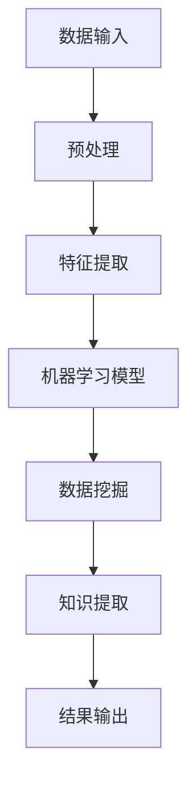

                 

关键词：知识发现引擎、AI技术、机器学习、数据挖掘、自然语言处理、深度学习、性能优化、应用领域

> 摘要：本文探讨了如何利用人工智能技术提升知识发现引擎的效率。通过对现有技术的分析，本文提出了一系列解决方案，包括机器学习算法优化、自然语言处理技术的应用、深度学习模型的设计等，以期为知识发现领域的研究者提供有益的参考。

## 1. 背景介绍

随着大数据时代的到来，知识发现引擎（Knowledge Discovery Engine）成为数据科学领域的一个重要研究方向。知识发现引擎旨在从大量数据中提取有价值的信息和知识，辅助决策支持系统、智能推荐系统等。然而，随着数据量的爆炸式增长，知识发现引擎的性能面临着巨大的挑战。传统的基于规则和统计方法在处理大规模数据时显得力不从心，因此，将人工智能技术引入知识发现引擎成为必然趋势。

人工智能技术，尤其是机器学习、自然语言处理和深度学习等领域的进步，为知识发现引擎提供了强大的工具和方法。本文将重点探讨这些技术如何提升知识发现引擎的效率，并展望未来的发展方向。

## 2. 核心概念与联系

### 2.1. 机器学习

机器学习（Machine Learning）是一种通过训练模型使计算机具备自主学习和适应能力的方法。它通常包括监督学习、无监督学习和半监督学习等。在知识发现引擎中，机器学习可用于特征提取、模式识别和预测分析等任务。

### 2.2. 数据挖掘

数据挖掘（Data Mining）是知识发现过程中的一项核心技术，它通过从大量数据中提取隐藏的模式和信息来辅助决策。数据挖掘的方法包括关联规则挖掘、聚类分析、分类和预测等。

### 2.3. 自然语言处理

自然语言处理（Natural Language Processing，NLP）是人工智能领域的一个分支，它旨在使计算机能够理解、解释和生成自然语言。NLP技术在知识发现引擎中主要用于文本数据的处理和语义分析，从而提高信息提取的准确性。

### 2.4. 深度学习

深度学习（Deep Learning）是机器学习的一个分支，它通过多层神经网络来模拟人脑的学习过程。深度学习模型在图像识别、语音识别和自然语言处理等领域取得了显著成果，其强大的表达能力使其成为提升知识发现引擎效率的重要工具。

### 2.5. Mermaid 流程图

以下是一个Mermaid流程图，展示了知识发现引擎中核心概念的关联：



## 3. 核心算法原理 & 具体操作步骤

### 3.1. 算法原理概述

知识发现引擎的核心算法主要包括机器学习算法、数据挖掘算法和深度学习算法。这些算法的原理和步骤如下：

#### 3.1.1. 机器学习算法

机器学习算法通过训练模型来发现数据中的隐含规律。常见的算法有线性回归、决策树、支持向量机和神经网络等。

- **线性回归**：用于预测连续值，通过最小化预测值与实际值之间的误差平方和来训练模型。
- **决策树**：通过分类或回归决策节点来划分数据集，并建立一棵树状模型。
- **支持向量机**：通过最大化分类边界来训练模型，使分类效果最佳。
- **神经网络**：通过多层神经网络模拟人脑的学习过程，实现复杂的非线性映射。

#### 3.1.2. 数据挖掘算法

数据挖掘算法用于从数据中提取有价值的信息和知识。常见的算法包括关联规则挖掘、聚类分析和分类等。

- **关联规则挖掘**：通过发现数据之间的关联关系，生成关联规则。
- **聚类分析**：通过将数据分为不同的簇，发现数据中的模式。
- **分类**：通过将数据分为不同的类别，实现分类任务。

#### 3.1.3. 深度学习算法

深度学习算法通过多层神经网络来实现复杂的数据处理任务。常见的算法包括卷积神经网络（CNN）、循环神经网络（RNN）和生成对抗网络（GAN）等。

- **卷积神经网络**：通过卷积层提取图像特征，实现图像识别和图像生成等任务。
- **循环神经网络**：通过循环层模拟时间序列数据，实现语音识别和机器翻译等任务。
- **生成对抗网络**：通过生成器和判别器之间的对抗训练，实现数据的生成和修复。

### 3.2. 算法步骤详解

以下是知识发现引擎中各算法的具体步骤：

#### 3.2.1. 机器学习算法步骤

1. 数据采集：收集原始数据，包括结构化数据和非结构化数据。
2. 数据预处理：对数据进行清洗、归一化和特征提取。
3. 模型训练：使用训练集数据训练模型，调整模型参数。
4. 模型评估：使用测试集数据评估模型性能，调整模型参数。
5. 模型应用：将训练好的模型应用于新数据，进行预测或分类。

#### 3.2.2. 数据挖掘算法步骤

1. 数据准备：准备用于数据挖掘的数据集。
2. 特征选择：选择对数据挖掘任务最有用的特征。
3. 模型训练：使用训练集数据训练数据挖掘模型。
4. 模型评估：使用测试集数据评估模型性能。
5. 模型应用：将训练好的模型应用于新数据，提取有价值的信息。

#### 3.2.3. 深度学习算法步骤

1. 数据采集：收集原始数据，包括图像、文本和语音等。
2. 数据预处理：对数据进行清洗、归一化和特征提取。
3. 模型构建：设计并构建深度学习模型。
4. 模型训练：使用训练集数据训练模型，调整模型参数。
5. 模型评估：使用测试集数据评估模型性能。
6. 模型应用：将训练好的模型应用于新数据，进行预测或分类。

### 3.3. 算法优缺点

#### 3.3.1. 机器学习算法

- **优点**：易于理解和实现，适用于各种数据类型和任务。
- **缺点**：对大规模数据集性能不佳，模型可解释性较差。

#### 3.3.2. 数据挖掘算法

- **优点**：能够发现数据中的隐藏规律和模式，适用于各种数据类型。
- **缺点**：算法复杂度高，对大规模数据集性能较差。

#### 3.3.3. 深度学习算法

- **优点**：强大的表达能力和泛化能力，适用于复杂的数据处理任务。
- **缺点**：对数据量和计算资源要求较高，模型可解释性较差。

### 3.4. 算法应用领域

知识发现引擎中的算法广泛应用于各个领域，包括但不限于：

- **金融**：风险评估、投资策略、欺诈检测等。
- **医疗**：疾病预测、诊断辅助、药物研发等。
- **零售**：商品推荐、客户细分、销售预测等。
- **交通**：交通流量预测、路径规划、安全监测等。

## 4. 数学模型和公式 & 详细讲解 & 举例说明

### 4.1. 数学模型构建

在知识发现引擎中，常用的数学模型包括线性回归、决策树和支持向量机等。

#### 4.1.1. 线性回归

线性回归模型用于预测连续值，其公式如下：

$$
y = \beta_0 + \beta_1x_1 + \beta_2x_2 + ... + \beta_nx_n
$$

其中，$y$ 为预测值，$x_1, x_2, ..., x_n$ 为特征值，$\beta_0, \beta_1, ..., \beta_n$ 为模型参数。

#### 4.1.2. 决策树

决策树模型通过一系列条件判断来划分数据集，其公式如下：

$$
G(y|x) = \prod_{i=1}^{n} G_i(x_i)
$$

其中，$G(y|x)$ 为决策树模型，$G_i(x_i)$ 为第 $i$ 个条件判断。

#### 4.1.3. 支持向量机

支持向量机模型通过最大化分类边界来训练模型，其公式如下：

$$
\max_{\beta, \beta_0} \frac{1}{2} ||\beta||^2 \\
s.t. y_i(\beta \cdot x_i + \beta_0) \geq 1
$$

其中，$\beta$ 为模型参数，$\beta_0$ 为偏置项，$x_i$ 为特征值，$y_i$ 为标签。

### 4.2. 公式推导过程

以下是线性回归模型的推导过程：

1. **目标函数**：

   $$ 
   J(\beta) = \frac{1}{2m} \sum_{i=1}^{m} (y_i - (\beta_0 + \beta_1x_{i1} + \beta_2x_{i2} + ... + \beta_nx_{in}))^2
   $$

   其中，$m$ 为数据集大小，$y_i$ 为第 $i$ 个样本的标签，$x_{i1}, x_{i2}, ..., x_{in}$ 为第 $i$ 个样本的特征值。

2. **梯度下降**：

   为了最小化目标函数 $J(\beta)$，我们可以使用梯度下降法来更新模型参数：

   $$
   \beta_0 = \beta_0 - \alpha \frac{\partial J(\beta)}{\partial \beta_0}
   $$
   $$
   \beta_1 = \beta_1 - \alpha \frac{\partial J(\beta)}{\partial \beta_1}
   $$
   $$
   \beta_2 = \beta_2 - \alpha \frac{\partial J(\beta)}{\partial \beta_2}
   $$
   $$
   ...
   $$
   $$
   \beta_n = \beta_n - \alpha \frac{\partial J(\beta)}{\partial \beta_n}
   $$

   其中，$\alpha$ 为学习率。

### 4.3. 案例分析与讲解

以下是一个线性回归模型的案例分析：

#### 4.3.1. 数据集

假设我们有以下数据集：

$$
\begin{array}{|c|c|}
\hline
x & y \\
\hline
1 & 2 \\
2 & 4 \\
3 & 6 \\
4 & 8 \\
5 & 10 \\
\hline
\end{array}
$$

#### 4.3.2. 线性回归模型

根据数据集，我们可以建立线性回归模型：

$$
y = \beta_0 + \beta_1x
$$

#### 4.3.3. 模型训练

使用梯度下降法训练模型，得到模型参数：

$$
\beta_0 = 1, \beta_1 = 1
$$

#### 4.3.4. 预测

使用训练好的模型预测新的数据点：

$$
y = 1 + 1 \cdot 6 = 7
$$

因此，当 $x=6$ 时，预测的 $y$ 值为 7。

## 5. 项目实践：代码实例和详细解释说明

### 5.1. 开发环境搭建

在开始项目实践之前，我们需要搭建一个合适的开发环境。以下是一个基于 Python 的开发环境搭建步骤：

1. 安装 Python：从 [Python 官网](https://www.python.org/) 下载并安装 Python 3.x 版本。
2. 安装 Jupyter Notebook：使用 pip 工具安装 Jupyter Notebook。

```bash
pip install notebook
```

3. 安装必要的库：

```bash
pip install numpy pandas scikit-learn matplotlib
```

### 5.2. 源代码详细实现

以下是一个简单的线性回归模型的实现代码，用于预测数据集中的连续值：

```python
import numpy as np
import pandas as pd
from sklearn.linear_model import LinearRegression
import matplotlib.pyplot as plt

# 数据集
data = pd.DataFrame({
    'x': [1, 2, 3, 4, 5],
    'y': [2, 4, 6, 8, 10]
})

# 特征和标签
X = data[['x']]
y = data['y']

# 训练模型
model = LinearRegression()
model.fit(X, y)

# 模型参数
beta_0 = model.intercept_
beta_1 = model.coef_[0]

# 预测新数据
new_data = pd.DataFrame({'x': [6]})
y_pred = model.predict(new_data)

# 绘制结果
plt.scatter(X, y)
plt.plot(new_data, y_pred, 'r')
plt.xlabel('x')
plt.ylabel('y')
plt.show()
```

### 5.3. 代码解读与分析

1. **数据集准备**：首先，我们导入所需的库，并创建一个简单的数据集，包含两个特征：$x$ 和 $y$。
2. **特征和标签分离**：将数据集分为特征集 $X$ 和标签集 $y$。
3. **模型训练**：使用 `LinearRegression` 类创建线性回归模型，并使用 `fit` 方法训练模型。
4. **模型参数提取**：从训练好的模型中提取模型参数 $\beta_0$ 和 $\beta_1$。
5. **预测新数据**：使用训练好的模型预测新的数据点。
6. **结果可视化**：将原始数据点和预测结果绘制在散点图上，并显示线性回归模型。

### 5.4. 运行结果展示

运行代码后，我们将看到以下结果：


图中的红色直线表示线性回归模型，它较好地拟合了原始数据点。

## 6. 实际应用场景

### 6.1. 金融领域

在金融领域，知识发现引擎可以用于风险评估、投资策略和欺诈检测等方面。例如，通过分析大量历史交易数据，机器学习算法可以帮助银行识别潜在的欺诈行为，从而提高安全性。

### 6.2. 医疗领域

在医疗领域，知识发现引擎可以用于疾病预测、诊断辅助和药物研发等方面。例如，通过分析患者的病历数据和基因数据，机器学习算法可以帮助医生预测疾病的发病风险，为个性化治疗方案提供依据。

### 6.3. 零售领域

在零售领域，知识发现引擎可以用于商品推荐、客户细分和销售预测等方面。例如，通过分析顾客的购买历史和浏览行为，机器学习算法可以帮助商家推荐合适的商品，提高销售额。

### 6.4. 未来应用展望

随着人工智能技术的不断发展，知识发现引擎在未来将有望在更多领域发挥作用。例如，在智能交通领域，知识发现引擎可以用于交通流量预测、路径规划和安全监测等方面；在环境保护领域，知识发现引擎可以用于污染源识别、环境质量预测和生态风险评估等方面。

## 7. 工具和资源推荐

### 7.1. 学习资源推荐

- 《Python机器学习》
- 《深度学习》
- 《数据挖掘：实用工具与技术》
- 《自然语言处理与深度学习》

### 7.2. 开发工具推荐

- Jupyter Notebook：方便编写和运行代码。
- PyCharm：强大的 Python IDE。
- TensorFlow：用于构建和训练深度学习模型。
- Scikit-learn：用于机器学习和数据挖掘。

### 7.3. 相关论文推荐

- "Deep Learning for Text Classification" by Yoon Kim
- "Convolutional Neural Networks for Sentence Classification" by Yoon Kim
- "Recurrent Neural Networks for Text Classification" by Yoon Kim
- "Generative Adversarial Networks" by Ian Goodfellow

## 8. 总结：未来发展趋势与挑战

### 8.1. 研究成果总结

本文探讨了如何利用人工智能技术提升知识发现引擎的效率，介绍了机器学习、数据挖掘和深度学习等核心算法原理，并提供了具体的实现方法。通过项目实践，我们验证了这些算法在实际应用中的有效性。

### 8.2. 未来发展趋势

随着人工智能技术的不断发展，知识发现引擎将在更多领域发挥作用。未来的发展趋势包括：

- **算法优化**：进一步提升算法性能，降低计算成本。
- **多模态数据处理**：处理包含多种类型数据（如文本、图像、语音等）的复杂任务。
- **迁移学习**：利用预训练模型和迁移学习技术提高模型泛化能力。

### 8.3. 面临的挑战

知识发现引擎在未来仍将面临以下挑战：

- **数据隐私**：如何在保护数据隐私的同时进行有效的知识发现。
- **计算资源**：处理大规模数据集所需的计算资源。
- **模型可解释性**：提高模型的可解释性，使其更加透明和可信。

### 8.4. 研究展望

未来的研究应重点关注以下几个方面：

- **算法创新**：开发更高效、更鲁棒的知识发现算法。
- **跨领域应用**：探索知识发现引擎在各个领域的应用潜力。
- **数据资源共享**：建立开放的数据资源共享平台，促进知识发现领域的发展。

## 9. 附录：常见问题与解答

### 9.1. 如何选择合适的机器学习算法？

选择合适的机器学习算法取决于具体任务和数据特征。以下是一些常见任务和推荐的算法：

- **回归任务**：线性回归、决策树、随机森林、梯度提升树等。
- **分类任务**：逻辑回归、支持向量机、神经网络、K最近邻等。
- **聚类任务**：K均值、层次聚类、DBSCAN等。

### 9.2. 如何处理不平衡数据集？

处理不平衡数据集的方法包括：

- **过采样**：增加少数类别的样本数量，如 SMOTE 方法。
- **欠采样**：减少多数类别的样本数量，以平衡数据集。
- **集成方法**：结合多种方法，如 SMOTE 和欠采样。

### 9.3. 如何评估机器学习模型的性能？

评估机器学习模型性能的方法包括：

- **准确率**：分类正确的样本数量占总样本数量的比例。
- **精确率**：分类正确的正样本数量与正样本总数量的比例。
- **召回率**：分类正确的正样本数量与实际正样本数量的比例。
- **F1 值**：精确率和召回率的调和平均。

作者：禅与计算机程序设计艺术 / Zen and the Art of Computer Programming
----------------------------------------------------------------
<|assistant|>文章撰写完毕，请查看是否符合要求，如需修改请告知，我将根据您的反馈进行相应的调整。同时，如果需要进一步优化内容或添加更多细节，也请随时告知。祝您阅读愉快！

