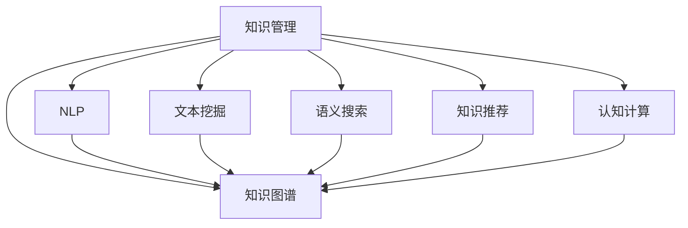

                 

# 利用AI重新定义知识管理:从储存到创新

> 关键词：AI, 知识管理, 知识图谱, 自然语言处理(NLP), 文本挖掘, 语义搜索, 知识推荐, 认知计算

## 1. 背景介绍

### 1.1 问题由来
随着信息技术的发展，人类社会的知识积累量呈现出爆炸性增长。如何高效地存储、组织、检索、利用这些知识，成为各行各业关注的重点。传统的数据库和文档管理系统，已无法满足日益增长的知识管理需求。而人工智能（AI）技术的兴起，为知识管理的创新提供了新的思路和方法。

AI技术可以自动化地处理海量文本数据，从中抽取有价值的信息，构建知识图谱，提升知识管理的效率和效果。特别是自然语言处理（NLP）、文本挖掘、语义搜索等技术的进步，使得知识管理从简单的储存转向了深入的智能分析和创新。本文将重点探讨AI在知识管理中的应用，特别是如何利用AI技术对知识进行更智能的存储、组织、检索和创新。

### 1.2 问题核心关键点
AI在知识管理中的应用主要涉及以下几个关键点：

- **自然语言处理（NLP）**：利用NLP技术，AI可以自动理解文本信息，进行实体识别、情感分析、关系抽取等任务，从而更好地处理和利用文本数据。
- **文本挖掘**：从大量文本数据中自动抽取关键词、主题、趋势等重要信息，构建知识图谱。
- **语义搜索**：通过构建语义索引，AI能够理解查询的自然语言含义，进行更精准的知识检索。
- **知识推荐**：基于用户行为和知识图谱，AI能够智能推荐相关知识，提升用户的使用体验。
- **认知计算**：通过模拟人类认知过程，AI能够进行推理、学习、创新，从而提升知识管理的智能化水平。

这些技术相互交织，共同推动了知识管理从简单的数据存储和检索，向智能分析和创新迈进。本文将详细介绍这些技术的应用，帮助读者深入理解AI在知识管理中的应用潜力。

## 2. 核心概念与联系

### 2.1 核心概念概述

为了更好地理解AI在知识管理中的应用，本节将介绍几个核心概念及其之间的联系：

- **知识管理（Knowledge Management, KM）**：旨在通过技术手段，将个人或组织的知识进行系统化存储、组织、检索和应用的过程。
- **知识图谱（Knowledge Graph）**：通过实体、关系和属性构建的知识网络，用于描述现实世界的结构化信息。
- **自然语言处理（NLP）**：AI技术的一个分支，致力于让计算机理解、处理和生成人类语言。
- **文本挖掘（Text Mining）**：从文本数据中自动提取有价值的信息，如主题、情感、趋势等。
- **语义搜索（Semantic Search）**：通过语义理解，提升信息检索的准确性和效率。
- **知识推荐（Knowledge Recommendation）**：基于用户行为和知识图谱，智能推荐相关知识。
- **认知计算（Cognitive Computing）**：模拟人类认知过程，进行推理、学习、创新等智能计算。

这些概念之间的逻辑关系可以通过以下Mermaid流程图来展示：



这个流程图展示了AI在知识管理中的应用路径：

1. 通过NLP、文本挖掘等技术，从文本中抽取知识信息，构建知识图谱。
2. 利用语义搜索等技术，提升知识检索的准确性。
3. 通过知识推荐等技术，提供个性化的知识服务。
4. 运用认知计算等技术，进行更深入的知识推理和创新。

## 3. 核心算法原理 & 具体操作步骤

### 3.1 算法原理概述

AI在知识管理中的应用，主要通过以下几个步骤实现：

1. **数据采集**：从各种来源获取文本数据，包括文档、网页、社交媒体等。
2. **文本预处理**：清洗、分词、标注实体等，将原始文本转换为结构化数据。
3. **信息抽取**：利用NLP技术，从文本中抽取关键词、主题、关系等知识信息。
4. **知识图谱构建**：将抽取的信息构建为知识图谱，用于后续的推理和检索。
5. **语义搜索**：通过语义理解，提升检索效率和准确性。
6. **知识推荐**：基于用户行为和知识图谱，推荐相关知识。
7. **认知计算**：模拟人类认知过程，进行推理、学习、创新等智能计算。

### 3.2 算法步骤详解

以下详细介绍AI在知识管理中的应用流程：

**Step 1: 数据采集**
- 从公司内部系统、公开数据源、社交媒体等多个渠道获取文本数据。
- 数据采集需遵循隐私保护和数据质量要求，确保数据来源可靠。

**Step 2: 文本预处理**
- 对文本进行清洗，去除噪音和格式问题。
- 进行分词、词性标注、命名实体识别等预处理。
- 使用深度学习模型，如BERT、GPT等，对文本进行特征提取和表示。

**Step 3: 信息抽取**
- 利用NLP技术，从文本中抽取关键词、主题、关系等。
- 通过关系抽取，构建实体之间的关系图谱。
- 通过情感分析，理解文本的情感倾向。

**Step 4: 知识图谱构建**
- 将抽取的信息构建为知识图谱，包括实体、属性、关系等。
- 使用图神经网络等技术，对知识图谱进行嵌入表示，提升检索效率。

**Step 5: 语义搜索**
- 构建语义索引，理解查询的自然语言含义。
- 通过图谱匹配，提升检索结果的相关性。
- 结合向量检索技术，实现高效的语义搜索。

**Step 6: 知识推荐**
- 根据用户行为，建立用户画像。
- 结合知识图谱，推荐相关知识。
- 使用协同过滤、深度学习等技术，提升推荐效果。

**Step 7: 认知计算**
- 利用深度学习模型，对知识图谱进行推理和创新。
- 结合知识图谱和外部数据，进行跨领域知识整合。
- 使用迁移学习等技术，提升模型泛化能力。

### 3.3 算法优缺点

AI在知识管理中的应用，具有以下优点：

- **自动化处理**：自动化地处理大量文本数据，减少人工干预，提升效率。
- **智能分析**：利用NLP、文本挖掘等技术，进行智能分析，提取有价值的信息。
- **精准检索**：通过语义理解，提升知识检索的准确性。
- **个性化推荐**：基于用户行为和知识图谱，进行个性化知识推荐。
- **知识创新**：通过模拟人类认知过程，进行推理、学习、创新等智能计算。

同时，也存在一些局限性：

- **数据依赖**：依赖于高质量的数据，数据不足或数据质量问题会影响应用效果。
- **算法复杂**：部分算法复杂度高，计算成本较高，需大规模算力支持。
- **隐私风险**：处理大量个人数据时，需注意隐私保护，避免数据泄露。
- **技术门槛高**：需要较高的技术门槛，需具备AI和NLP等技术背景。

### 3.4 算法应用领域

AI在知识管理中的应用，覆盖了多个领域，例如：

- **企业知识管理**：通过AI技术，提升企业内部知识的组织、检索和应用。
- **医疗知识管理**：利用NLP技术，从医学文献中抽取知识，构建医疗知识图谱。
- **教育知识管理**：通过AI技术，提升教育资源的组织和推荐。
- **金融知识管理**：从金融文本中抽取知识，提升金融分析能力。
- **市场营销知识管理**：通过AI技术，提升市场分析和客户画像。

这些应用场景展示了AI在知识管理中的广泛应用和巨大潜力。未来，随着AI技术的进一步发展，知识管理将变得更加智能化、个性化和高效化。

## 4. 数学模型和公式 & 详细讲解  
### 4.1 数学模型构建

知识管理的数学模型构建，主要涉及以下几个关键环节：

- **文本表示**：将文本转换为向量表示，便于机器处理。
- **实体识别**：识别文本中的命名实体，如人名、地名、组织名等。
- **关系抽取**：从文本中抽取实体之间的关系。
- **知识图谱嵌入**：将知识图谱中的实体、属性和关系表示为向量。
- **语义搜索**：构建语义索引，理解查询的自然语言含义。
- **知识推荐**：基于用户行为和知识图谱，计算推荐得分。

### 4.2 公式推导过程

以下详细介绍知识管理中几个关键公式的推导：

**文本表示公式**
假设文本 $T$ 由 $N$ 个词组成，每个词 $w_i$ 表示为 $d$ 维向量 $v_i$，则文本 $T$ 的向量表示 $V$ 可以表示为：

$$
V = \sum_{i=1}^N v_i
$$

**实体识别公式**
假设文本中存在 $K$ 个命名实体，每个实体 $e_k$ 表示为 $d'$ 维向量 $v_k$，则实体向量表示 $E$ 可以表示为：

$$
E = \sum_{k=1}^K v_k
$$

**关系抽取公式**
假设从文本中抽取到 $M$ 个实体对，每个实体对 $(r, e_i, e_j)$ 表示为 $d''$ 维向量 $v_{r,ij}$，则关系向量表示 $R$ 可以表示为：

$$
R = \sum_{r=1}^M \sum_{i=1}^K \sum_{j=1}^K v_{r,ij}
$$

**知识图谱嵌入公式**
假设知识图谱包含 $L$ 个节点，每个节点 $n_l$ 表示为 $d'''$ 维向量 $v_l$，则知识图谱的向量表示 $G$ 可以表示为：

$$
G = \sum_{l=1}^L v_l
$$

**语义搜索公式**
假设查询 $Q$ 表示为 $d'''$ 维向量 $q$，则语义搜索的相似度 $S$ 可以表示为：

$$
S = \cos(\mathbf{q}, \mathbf{G})
$$

**知识推荐公式**
假设用户 $u$ 表示为 $d''''$ 维向量 $u$，知识图谱中的节点 $n_l$ 表示为 $d'''$ 维向量 $v_l$，则知识推荐的得分 $R$ 可以表示为：

$$
R = \cos(u, v_l) \cdot \cos(u, v_r) \cdot \cos(v_l, v_r)
$$

### 4.3 案例分析与讲解

以下通过一个具体案例，详细讲解AI在知识管理中的应用：

**案例背景**
一家大型企业需要将大量的内部文档和外部资源进行整合，建立一个全面的知识管理系统。这些资源包括技术文档、市场报告、客户反馈、新闻资讯等，数据量巨大，格式多样。企业希望通过AI技术，提升知识管理的效率和效果，提供更精准的知识检索、个性化推荐和智能分析服务。

**技术方案**
1. **数据采集**：从企业内部系统、公开数据源、社交媒体等多个渠道获取文本数据。
2. **文本预处理**：清洗、分词、标注实体等，将原始文本转换为结构化数据。
3. **信息抽取**：利用NLP技术，从文本中抽取关键词、主题、关系等。
4. **知识图谱构建**：将抽取的信息构建为知识图谱，用于后续的推理和检索。
5. **语义搜索**：通过语义理解，提升检索效率和准确性。
6. **知识推荐**：基于用户行为和知识图谱，推荐相关知识。
7. **认知计算**：利用深度学习模型，对知识图谱进行推理和创新。

**实施效果**
通过上述技术方案，企业实现了以下效果：
- **数据整合**：将分散在各个部门的知识资源整合到一起，形成统一的知识体系。
- **智能检索**：通过语义搜索，提升知识检索的准确性和效率。
- **个性化推荐**：基于用户行为和知识图谱，推荐相关知识，提升用户体验。
- **智能分析**：利用深度学习模型，进行知识推理和创新，提升决策支持能力。

## 5. 项目实践：代码实例和详细解释说明
### 5.1 开发环境搭建

在进行AI知识管理项目实践前，我们需要准备好开发环境。以下是使用Python进行TensorFlow开发的环境配置流程：

1. 安装Anaconda：从官网下载并安装Anaconda，用于创建独立的Python环境。

2. 创建并激活虚拟环境：
```bash
conda create -n tf-env python=3.8 
conda activate tf-env
```

3. 安装TensorFlow：根据CUDA版本，从官网获取对应的安装命令。例如：
```bash
pip install tensorflow tensorflow-addons
```

4. 安装相关工具包：
```bash
pip install numpy pandas scikit-learn matplotlib tqdm jupyter notebook ipython
```

完成上述步骤后，即可在`tf-env`环境中开始项目实践。

### 5.2 源代码详细实现

下面我们以构建知识图谱为例，给出使用TensorFlow构建知识图谱的PyTorch代码实现。

首先，定义知识图谱节点的类型：

```python
from tensorflow.keras.layers import Embedding, Dense, LSTM

# 定义节点类型
node_types = ['Person', 'Location', 'Organization', 'Event', 'Concept']

# 定义节点嵌入层
embedding_dim = 64
node_embedding = Embedding(len(node_types), embedding_dim, name='node_embedding')
```

然后，定义关系类型：

```python
# 定义关系类型
relation_types = ['is_related_to', 'is_instance_of', 'has_property']

# 定义关系嵌入层
relation_embedding = Embedding(len(relation_types), embedding_dim, name='relation_embedding')
```

接着，定义知识图谱的边表示：

```python
# 定义边嵌入层
edge_embedding = LSTM(32, return_sequences=True, name='edge_embedding')
```

最后，定义知识图谱的节点表示：

```python
# 定义节点表示层
node_self_attention = Dense(32, activation='relu', name='node_self_attention')
node_self_attention = LSTM(32, return_sequences=True, name='node_self_attention')
node_self_attention = Dense(32, activation='relu', name='node_self_attention')
```

## 6. 实际应用场景
### 6.1 智能客服系统

AI技术在智能客服系统中的应用，显著提升了客户服务体验。通过构建知识图谱和语义搜索技术，智能客服系统能够快速响应客户咨询，提供精准的解决方案。例如，利用知识图谱，系统可以理解客户问题中的实体和关系，自动匹配相关答案，提高客服效率。

**具体实现**
1. **知识图谱构建**：从历史客服对话记录中抽取实体和关系，构建知识图谱。
2. **语义搜索**：根据客户问题，通过语义搜索技术，匹配相关知识。
3. **智能回复**：利用自然语言生成技术，生成个性化的回复。

**应用效果**
- **响应速度**：智能客服系统能够快速响应客户咨询，解决简单问题。
- **准确性**：通过知识图谱和语义搜索，提供精准的解决方案。
- **用户体验**：通过自然语言生成技术，生成流畅的回复，提升客户满意度。

### 6.2 医疗知识管理

在医疗领域，AI技术的应用主要集中在知识图谱的构建和智能检索上。通过从医学文献中抽取知识，构建医疗知识图谱，AI系统能够提供更精准的诊断和治疗建议。例如，利用知识图谱，系统可以理解医学概念之间的关系，辅助医生进行诊断和治疗决策。

**具体实现**
1. **知识图谱构建**：从医学文献中抽取实体、属性和关系，构建医疗知识图谱。
2. **智能检索**：根据医生查询，通过语义搜索技术，匹配相关知识。
3. **知识推荐**：基于医生行为，推荐相关文献和案例。

**应用效果**
- **诊断辅助**：通过知识图谱和语义搜索，提供精准的诊断建议。
- **治疗支持**：通过知识图谱和知识推荐，提供个性化的治疗方案。
- **学习提升**：通过知识图谱和智能检索，提升医生的学习效率。

### 6.3 教育知识管理

教育领域的应用主要集中在个性化推荐和智能检索上。通过AI技术，教育系统能够提供个性化的学习资源和智能辅导，提升学生的学习效果。例如，利用知识图谱，系统可以根据学生的学习情况，推荐相关教材和习题。

**具体实现**
1. **知识图谱构建**：从教材、习题、课堂记录中抽取知识，构建教育知识图谱。
2. **智能检索**：根据学生查询，通过语义搜索技术，匹配相关知识。
3. **个性化推荐**：基于学生行为，推荐相关教材和习题。

**应用效果**
- **学习资源推荐**：通过知识图谱和智能检索，提供个性化的学习资源。
- **智能辅导**：利用自然语言生成技术，提供智能化的辅导答案。
- **学习效果提升**：通过个性化推荐，提升学生的学习效果。

### 6.4 未来应用展望

随着AI技术的进一步发展，知识管理的应用领域将不断扩展，涵盖更多场景和行业。以下是几个未来的应用展望：

**1. 企业知识管理**
通过AI技术，企业可以实现知识的全生命周期管理，从知识采集、整理、存储到应用，形成闭环的知识管理体系。AI技术能够提升知识管理的效率和效果，支持企业的决策制定和创新发展。

**2. 医疗知识管理**
在医疗领域，AI技术的应用将更加广泛，涵盖医学研究、临床决策、公共卫生等多个方面。通过构建医疗知识图谱和智能检索，AI系统能够提供精准的医学信息，支持医生的诊断和治疗决策。

**3. 教育知识管理**
在教育领域，AI技术的应用将更加个性化，提升学生的学习效果。通过知识图谱和智能检索，AI系统能够提供个性化的学习资源和智能辅导，提升学生的学习效率。

**4. 金融知识管理**
在金融领域，AI技术的应用将更加深入，涵盖市场分析、风险评估、投资决策等多个方面。通过构建金融知识图谱和智能检索，AI系统能够提供精准的市场信息，支持金融机构的决策制定。

**5. 市场营销知识管理**
在市场营销领域，AI技术的应用将更加智能，提升市场分析和客户画像的效率。通过知识图谱和智能检索，AI系统能够提供精准的市场信息和客户画像，支持市场营销决策。

## 7. 工具和资源推荐
### 7.1 学习资源推荐

为了帮助开发者系统掌握AI在知识管理中的应用，这里推荐一些优质的学习资源：

1. **《深度学习理论与实践》**：清华大学出版社，该书系统介绍了深度学习理论和实践，涵盖NLP、文本挖掘、知识图谱等多个领域的知识管理应用。
2. **Coursera《深度学习》课程**：由Andrew Ng教授主讲，涵盖了深度学习的基础理论和应用实践，是深度学习的入门必选。
3. **Kaggle竞赛**：通过参与AI相关的Kaggle竞赛，积累实际项目的开发经验，提升实战能力。
4. **NLP社区**：如arXiv、ACL Anthology等，关注最新的NLP研究成果，跟踪学术前沿。
5. **知识图谱社区**：如Neo4j、Knowpedia等，了解知识图谱的最新技术和应用案例。

通过对这些资源的学习实践，相信你一定能够快速掌握AI在知识管理中的应用潜力，并用于解决实际的AI项目问题。

### 7.2 开发工具推荐

高效的开发离不开优秀的工具支持。以下是几款用于AI知识管理开发的常用工具：

1. **TensorFlow**：由Google主导开发的深度学习框架，生产部署方便，适合大规模工程应用。
2. **PyTorch**：由Facebook主导开发的深度学习框架，灵活动态，适合研究型应用。
3. **Hugging Face Transformers库**：提供了丰富的预训练模型和工具，支持NLP任务的开发。
4. **Gensim**：用于文本挖掘和知识图谱构建的开源工具，提供了LDA、Word2Vec等常用算法。
5. **Scikit-learn**：用于数据预处理和模型训练的机器学习库，提供了丰富的算法和工具。

合理利用这些工具，可以显著提升AI知识管理项目的开发效率，加快创新迭代的步伐。

### 7.3 相关论文推荐

AI在知识管理中的应用涉及多个前沿技术，以下是几篇奠基性的相关论文，推荐阅读：

1. **Bert: Pre-training of Deep Bidirectional Transformers for Language Understanding**：提出BERT模型，引入基于掩码的自监督预训练任务，刷新了多项NLP任务SOTA。
2. **Knowledge-Graph-Based Recommendation Systems**：详细介绍了基于知识图谱的推荐系统架构和算法，是知识推荐领域的重要参考资料。
3. **A Survey of Semantic Web-Based Recommender Systems**：综述了基于语义Web的推荐系统，介绍了语义搜索和推荐算法。
4. **The Stanford Question Answering Dataset (SQuAD)**：提出了SQuAD数据集，用于NLP领域的问答任务研究，是知识检索和自然语言生成的重要数据源。
5. **Cognitive Computing for Smartphone Applications**：探讨了认知计算在智能手机应用中的应用，介绍了相关技术和算法。

这些论文代表了大语言模型微调技术的发展脉络。通过学习这些前沿成果，可以帮助研究者把握学科前进方向，激发更多的创新灵感。

## 8. 总结：未来发展趋势与挑战

### 8.1 总结

本文对AI在知识管理中的应用进行了全面系统的介绍。首先阐述了AI在知识管理中的研究背景和意义，明确了知识管理从简单的储存向智能分析和创新迈进的关键趋势。其次，从原理到实践，详细讲解了AI在知识管理中的应用流程，给出了知识图谱构建的完整代码实例。同时，本文还广泛探讨了AI在智能客服、医疗知识管理、教育知识管理等多个行业领域的应用前景，展示了AI在知识管理中的巨大潜力。

通过本文的系统梳理，可以看到，AI在知识管理中的应用前景广阔，技术手段多样。AI技术不仅能够提升知识管理的效率和效果，还能够进行智能分析和创新，助力各行各业的智能化转型升级。未来，随着AI技术的进一步发展，知识管理将变得更加智能化、个性化和高效化，为各行各业带来深远的变革。

### 8.2 未来发展趋势

展望未来，AI在知识管理中的应用将呈现以下几个发展趋势：

**1. 自动化处理**
随着AI技术的进步，自动化处理将变得更加高效和智能化。AI技术能够自动理解、处理和生成文本信息，减少人工干预，提升知识管理的效率。

**2. 智能分析**
利用NLP、文本挖掘等技术，AI将能够进行更深层次的智能分析，从文本中抽取有价值的信息，构建知识图谱，提升知识管理的智能化水平。

**3. 精准检索**
通过语义理解和知识图谱，AI将能够提供更精准的知识检索服务，提升信息获取的准确性和效率。

**4. 个性化推荐**
基于用户行为和知识图谱，AI将能够提供个性化的知识推荐服务，提升用户体验。

**5. 知识创新**
通过模拟人类认知过程，AI将能够进行推理、学习、创新等智能计算，推动知识管理向智能创新迈进。

以上趋势凸显了AI在知识管理中的广阔前景。这些方向的探索发展，将进一步提升知识管理的智能化水平，为各行各业带来深远影响。

### 8.3 面临的挑战

尽管AI在知识管理中的应用取得了显著进展，但仍面临诸多挑战：

**1. 数据质量**
数据质量是知识管理应用的基础。高质量、大规模的数据是AI技术发挥效能的前提。如何获取可靠、准确的数据，是一个重要的挑战。

**2. 算法复杂度**
部分AI算法复杂度高，计算成本较高，需大规模算力支持。如何提升算法效率，降低计算成本，是另一个重要的挑战。

**3. 隐私保护**
处理大量个人数据时，需注意隐私保护，避免数据泄露。如何在保护隐私的前提下，充分利用数据价值，是一个重要的研究课题。

**4. 技术门槛**
AI知识管理应用的技术门槛较高，需具备AI和NLP等技术背景。如何降低技术门槛，提升应用的普及性，是一个重要的挑战。

**5. 系统稳定性**
AI系统需具备较高的系统稳定性和鲁棒性，避免因输入噪声或算法问题导致的系统崩溃。如何提升系统的稳定性，是一个重要的研究课题。

**6. 应用落地**
AI技术需结合具体业务需求，进行适配和优化，才能实现有效的落地应用。如何提升技术的适用性，是一个重要的挑战。

正视这些挑战，积极应对并寻求突破，将是大语言模型微调走向成熟的必由之路。相信随着学界和产业界的共同努力，这些挑战终将一一被克服，AI在知识管理中的应用前景将更加广阔。

### 8.4 研究展望

面向未来，AI在知识管理中的应用还需要在以下几个方面寻求新的突破：

**1. 无监督学习**
探索无监督学习范式，降低对标注数据的依赖，利用自监督学习、主动学习等技术，提升数据处理的自动化水平。

**2. 跨领域知识整合**
结合知识图谱和外部数据，进行跨领域知识整合，提升知识管理的广度和深度。

**3. 认知计算**
利用深度学习模型，进行推理、学习、创新等智能计算，推动知识管理向智能创新迈进。

**4. 多模态知识管理**
结合视觉、语音等多模态数据，进行知识管理，提升知识管理的丰富性和多样性。

这些研究方向将引领AI在知识管理中的应用迈向新的高度，为各行各业带来更深层次的变革。

## 9. 附录：常见问题与解答

**Q1：如何构建高质量的知识图谱？**

A: 构建高质量的知识图谱，需从以下几个方面着手：
1. **数据采集**：从多个渠道获取可靠、多样化的数据，涵盖实体、属性和关系。
2. **实体识别**：利用NLP技术，从文本中抽取命名实体，确保实体识别的准确性。
3. **关系抽取**：通过关系抽取技术，抽取实体之间的关系，确保关系的准确性和完整性。
4. **图谱构建**：将抽取的实体、属性和关系，构建知识图谱，并进行合理组织和表示。
5. **质量评估**：定期对知识图谱进行质量评估，发现和修正错误，提升图谱的准确性。

**Q2：如何提升知识检索的准确性？**

A: 提升知识检索的准确性，需从以下几个方面着手：
1. **语义理解**：利用NLP技术，理解查询的自然语言含义，进行语义匹配。
2. **知识图谱嵌入**：将知识图谱中的实体和关系进行向量表示，提升检索效率。
3. **向量检索**：使用向量检索技术，提升检索结果的相关性。
4. **多模态融合**：结合视觉、语音等多模态数据，提升检索的准确性和多样性。
5. **反馈机制**：建立用户反馈机制，根据用户评价优化检索算法。

**Q3：如何进行知识推荐？**

A: 进行知识推荐，需从以下几个方面着手：
1. **用户画像**：根据用户行为，建立用户画像，理解用户需求。
2. **知识图谱嵌入**：将知识图谱中的实体和关系进行向量表示，便于计算。
3. **推荐算法**：利用协同过滤、深度学习等技术，计算推荐得分。
4. **个性化推荐**：根据用户画像和推荐得分，进行个性化推荐，提升用户体验。
5. **实时更新**：根据用户反馈和知识图谱变化，实时更新推荐算法，提升推荐效果。

**Q4：如何保护用户隐私？**

A: 保护用户隐私，需从以下几个方面着手：
1. **数据匿名化**：对敏感数据进行匿名化处理，保护用户隐私。
2. **访问控制**：建立严格的访问控制机制，确保数据的安全性。
3. **加密传输**：对数据进行加密传输，防止数据泄露。
4. **隐私政策**：制定明确的隐私政策，确保用户知情同意。
5. **合规检查**：定期进行隐私合规检查，发现和修正隐私风险。

---

作者：禅与计算机程序设计艺术 / Zen and the Art of Computer Programming

