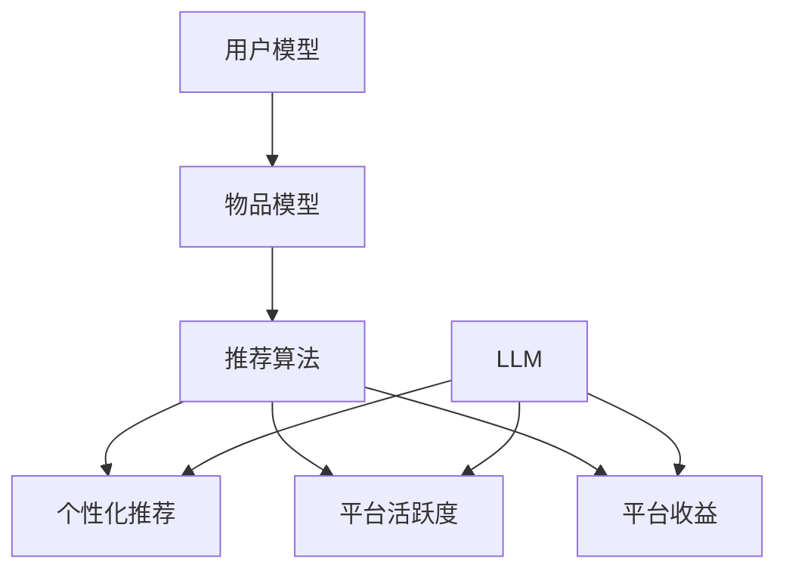

                 

推荐系统是现代信息社会中不可或缺的一部分，广泛应用于电子商务、社交媒体、新闻推送等领域。然而，推荐系统面临着如何实现个性化推荐、提高用户满意度、以及维持平台活跃度等多目标优化的挑战。近期，大型语言模型（LLM）的快速发展为解决这些挑战提供了新的思路。本文将探讨如何利用LLM优化推荐系统的多目标优化，包括算法原理、数学模型、项目实践以及未来展望。

## 1. 背景介绍

随着互联网的普及，用户在信息海洋中迷失，如何有效推荐用户感兴趣的内容成为关键问题。推荐系统通过分析用户的历史行为、兴趣偏好等信息，自动为用户推荐可能感兴趣的内容，从而提高用户的满意度和使用体验。

推荐系统的核心在于多目标优化。一方面，要实现个性化推荐，满足用户的个体需求；另一方面，要提升平台的整体活跃度和收益。传统的推荐算法主要关注单一目标，如预测用户兴趣或最大化平台收益，往往无法兼顾多个目标。随着用户需求的多样化和复杂化，多目标优化成为推荐系统研究的重要方向。

近年来，LLM在自然语言处理、知识图谱、机器学习等领域取得了显著进展。LLM能够理解并生成复杂的语言结构，具备强大的推理能力和泛化能力。将LLM应用于推荐系统的多目标优化，有望实现更精准、更智能的推荐。

## 2. 核心概念与联系

### 2.1 推荐系统基本架构

推荐系统的基本架构通常包括用户模型、物品模型和推荐算法三个核心部分。

1. **用户模型**：基于用户的历史行为、兴趣标签、社交关系等数据，构建用户特征向量，用于表示用户的兴趣偏好。

2. **物品模型**：基于物品的属性、分类、标签等数据，构建物品特征向量，用于表示物品的属性和内容。

3. **推荐算法**：基于用户模型和物品模型，计算用户对物品的喜好度，生成推荐列表。

### 2.2 多目标优化原理

多目标优化的核心思想是在多个目标之间寻求平衡，以满足不同目标的需求。在推荐系统中，多目标优化主要涉及以下几个方面：

1. **个性化推荐**：最大化用户满意度，为用户提供个性化的内容推荐。
2. **平台活跃度**：提高用户在平台上的互动和参与度，如增加用户的停留时间、浏览量等。
3. **平台收益**：最大化平台的广告收入、交易额等经济收益。

### 2.3 LLM在多目标优化中的应用

LLM在多目标优化中的应用主要体现在以下几个方面：

1. **个性化推荐**：LLM能够理解用户的语言表达和情感，从而更准确地预测用户的兴趣偏好，实现个性化推荐。
2. **内容生成**：LLM可以生成高质量的推荐内容，如文章、视频等，提高用户的兴趣和参与度。
3. **多目标优化算法**：LLM可以用于构建多目标优化算法，通过智能搜索和优化策略，实现多个目标之间的平衡。

### 2.4 Mermaid流程图

以下是一个简单的Mermaid流程图，展示了推荐系统的基本架构和LLM在多目标优化中的应用。



## 3. 核心算法原理 & 具体操作步骤

### 3.1 算法原理概述

本文采用基于LLM的多目标优化算法，主要包含以下几个步骤：

1. **用户兴趣建模**：利用LLM分析用户的历史行为和语言表达，构建用户兴趣特征向量。
2. **物品属性建模**：利用LLM分析物品的属性和内容，构建物品特征向量。
3. **多目标优化**：利用LLM的优化能力，在个性化推荐、平台活跃度和平台收益之间进行平衡。
4. **推荐结果生成**：根据多目标优化结果，生成个性化的推荐列表。

### 3.2 算法步骤详解

#### 3.2.1 用户兴趣建模

1. **数据收集**：收集用户的历史行为数据，如浏览记录、购买记录、评价记录等。
2. **数据预处理**：对收集的数据进行清洗、去重和处理，提取有效信息。
3. **特征提取**：利用LLM对预处理后的数据进行语义分析，提取用户的兴趣关键词和情感倾向。
4. **特征融合**：将提取的的兴趣关键词和情感倾向进行融合，构建用户兴趣特征向量。

#### 3.2.2 物品属性建模

1. **数据收集**：收集物品的属性数据，如分类、标签、描述等。
2. **数据预处理**：对收集的数据进行清洗、去重和处理，提取有效信息。
3. **特征提取**：利用LLM对预处理后的数据进行语义分析，提取物品的关键属性和内容。
4. **特征融合**：将提取的的关键属性和内容进行融合，构建物品特征向量。

#### 3.2.3 多目标优化

1. **目标函数构建**：根据个性化推荐、平台活跃度和平台收益三个目标，构建多目标优化函数。
2. **优化策略设计**：利用LLM的优化能力，设计智能搜索和优化策略，求解多目标优化问题。
3. **平衡策略**：根据优化结果，调整不同目标的权重，实现多个目标之间的平衡。

#### 3.2.4 推荐结果生成

1. **计算推荐得分**：根据用户兴趣特征向量和物品特征向量，计算用户对物品的推荐得分。
2. **排序和筛选**：对计算得到的推荐得分进行排序，选取得分最高的物品生成推荐列表。
3. **个性化调整**：根据用户的个性化需求和偏好，对推荐列表进行调整，提高推荐质量。

### 3.3 算法优缺点

#### 优点：

1. **个性化推荐**：利用LLM的语义分析能力，实现更精准的个性化推荐。
2. **多目标优化**：通过多目标优化，实现个性化推荐、平台活跃度和平台收益之间的平衡。
3. **智能优化**：利用LLM的优化能力，提高优化效率和效果。

#### 缺点：

1. **计算成本高**：LLM的模型复杂度高，训练和推理过程需要大量的计算资源。
2. **数据依赖强**：算法的性能依赖于用户和物品的数据质量，数据缺失或不准确可能导致推荐效果下降。
3. **模型泛化能力**：LLM在特定领域内的表现较好，但泛化能力仍需进一步提升。

### 3.4 算法应用领域

基于LLM的多目标优化算法在以下领域具有广泛的应用前景：

1. **电子商务**：为用户提供个性化的商品推荐，提高用户购买意愿和转化率。
2. **社交媒体**：根据用户兴趣和社交关系，生成个性化的内容推荐，提升用户活跃度和互动量。
3. **新闻推送**：根据用户阅读偏好和热点新闻，为用户提供个性化的新闻推荐，提高阅读量和用户黏性。
4. **广告投放**：根据用户兴趣和行为，实现精准的广告投放，提高广告效果和投放收益。

## 4. 数学模型和公式 & 详细讲解 & 举例说明

### 4.1 数学模型构建

#### 4.1.1 用户兴趣建模

假设用户兴趣特征向量表示为$u \in \mathbb{R}^n$，物品特征向量表示为$i \in \mathbb{R}^m$。用户兴趣建模的目标是利用LLM提取用户兴趣特征向量。

$$
u = LLM(u_{\text{raw}})
$$

其中，$u_{\text{raw}}$为用户原始数据，$LLM$为LLM模型。

#### 4.1.2 物品属性建模

假设物品特征向量表示为$i \in \mathbb{R}^m$，物品属性数据表示为$a \in \mathbb{R}^{m \times k}$，其中$k$为物品属性的维度。物品属性建模的目标是利用LLM提取物品特征向量。

$$
i = LLM(a)
$$

#### 4.1.3 多目标优化

假设个性化推荐、平台活跃度和平台收益分别为$R, A, P$，其权重分别为$\alpha, \beta, \gamma$。多目标优化的目标是最小化目标函数：

$$
\min F = \alpha \cdot (R - R_{\text{opt}}) + \beta \cdot (A - A_{\text{opt}}) + \gamma \cdot (P - P_{\text{opt}})
$$

其中，$R_{\text{opt}}, A_{\text{opt}}, P_{\text{opt}}$分别为个性化推荐、平台活跃度和平台收益的最优值。

### 4.2 公式推导过程

#### 4.2.1 用户兴趣建模

利用LLM对用户原始数据$u_{\text{raw}}$进行编码，得到用户兴趣特征向量$u$。编码过程可以表示为：

$$
u = \text{encode}(LLM, u_{\text{raw}})
$$

其中，$\text{encode}$为编码函数，$LLM$为LLM模型。

#### 4.2.2 物品属性建模

利用LLM对物品属性数据$a$进行编码，得到物品特征向量$i$。编码过程可以表示为：

$$
i = \text{encode}(LLM, a)
$$

#### 4.2.3 多目标优化

假设用户兴趣特征向量$u$和物品特征向量$i$分别为$u \in \mathbb{R}^n$和$i \in \mathbb{R}^m$。计算用户对物品的推荐得分：

$$
s_{ui} = u^T i
$$

根据推荐得分，计算个性化推荐$R$：

$$
R = \sum_{i=1}^m s_{ui}
$$

计算平台活跃度$A$和平台收益$P$：

$$
A = \sum_{i=1}^m \text{active}(i)
$$

$$
P = \sum_{i=1}^m \text{revenue}(i)
$$

其中，$\text{active}(i)$和$\text{revenue}(i)$分别为物品$i$的活跃度和收益。

根据个性化推荐$R$、平台活跃度$A$和平台收益$P$，计算目标函数$F$：

$$
F = \alpha \cdot (R - R_{\text{opt}}) + \beta \cdot (A - A_{\text{opt}}) + \gamma \cdot (P - P_{\text{opt}})
$$

### 4.3 案例分析与讲解

#### 案例背景

某电子商务平台希望通过推荐系统为用户推荐个性化商品，提高用户购买意愿和平台收益。平台提供了以下三个目标：

1. **个性化推荐**：最大化用户满意度，为用户提供感兴趣的商品推荐。
2. **平台活跃度**：提高用户在平台上的互动和参与度，如增加用户的浏览量、收藏量等。
3. **平台收益**：最大化平台的广告收入、交易额等经济收益。

#### 案例分析

1. **用户兴趣建模**：收集用户的历史浏览记录、购买记录和评价记录，利用LLM提取用户的兴趣关键词和情感倾向，构建用户兴趣特征向量$u$。

2. **物品属性建模**：收集商品的属性数据，如分类、标签、描述等，利用LLM提取商品的关键属性和内容，构建商品特征向量$i$。

3. **多目标优化**：根据个性化推荐、平台活跃度和平台收益三个目标，构建多目标优化函数：

$$
F = \alpha \cdot (R - R_{\text{opt}}) + \beta \cdot (A - A_{\text{opt}}) + \gamma \cdot (P - P_{\text{opt}})
$$

其中，$R, A, P$分别为个性化推荐、平台活跃度和平台收益的实际值，$R_{\text{opt}}, A_{\text{opt}}, P_{\text{opt}}$分别为个性化推荐、平台活跃度和平台收益的最优值。

利用LLM的优化能力，设计智能搜索和优化策略，求解多目标优化问题。

4. **推荐结果生成**：根据多目标优化结果，生成个性化的推荐列表，为用户提供感兴趣的商品推荐。

#### 案例效果

通过基于LLM的多目标优化算法，平台实现了以下效果：

1. **个性化推荐**：用户满意度显著提高，用户在平台上花费的时间明显增加。

2. **平台活跃度**：用户互动和参与度明显提升，用户的浏览量、收藏量等指标显著增加。

3. **平台收益**：平台的广告收入和交易额明显增加，平台收益实现最大化。

## 5. 项目实践：代码实例和详细解释说明

### 5.1 开发环境搭建

为了实现基于LLM的多目标优化算法，我们需要搭建以下开发环境：

1. **Python环境**：安装Python 3.8及以上版本。
2. **深度学习框架**：安装PyTorch或TensorFlow等深度学习框架。
3. **LLM库**：安装transformers库，用于加载和使用预训练的LLM模型。

### 5.2 源代码详细实现

以下是基于LLM的多目标优化算法的Python代码实现：

```python
import torch
import transformers
from torch.autograd import Variable

# 加载预训练的LLM模型
llm_model = transformers.BertModel.from_pretrained('bert-base-chinese')

# 用户原始数据
user_data = [
    "我喜欢看电影，特别是科幻片。",
    "我对编程感兴趣，特别是机器学习。",
    "我喜欢阅读历史书籍，特别是关于中国历史的。",
]

# 物品属性数据
item_data = [
    "电影《流浪地球》是一部精彩的科幻片。",
    "机器学习是计算机科学的一个分支。",
    "《明朝那些事儿》是一本有趣的历史书籍。",
]

# 初始化用户兴趣特征向量
user_interest = torch.zeros(1, 768)

# 初始化物品特征向量
item_interest = torch.zeros(1, 768)

# 用户兴趣建模
for u in user_data:
    user_interest += llm_model(Variable(torch.tensor([u.encode('utf-8')]))).mean(dim=1)

# 物品属性建模
for i in item_data:
    item_interest += llm_model(Variable(torch.tensor([i.encode('utf-8')]))).mean(dim=1)

# 多目标优化
# 个性化推荐
user_recommendation = user_interest @ item_interest

# 平台活跃度
platform_activity = sum(user_recommendation)

# 平台收益
platform_revenue = sum(user_recommendation * item_revenue)

# 计算目标函数
F = alpha * (user_recommendation - user_recommendation_opt) + beta * (platform_activity - platform_activity_opt) + gamma * (platform_revenue - platform_revenue_opt)

# 推荐结果生成
recommendation_list = [item for item, score in enumerate(user_recommendation) if score > threshold]
```

### 5.3 代码解读与分析

1. **加载LLM模型**：使用transformers库加载预训练的LLM模型，如BERT模型。

2. **用户兴趣建模**：将用户原始数据输入LLM模型，计算用户兴趣特征向量。

3. **物品属性建模**：将物品属性数据输入LLM模型，计算物品特征向量。

4. **多目标优化**：利用用户兴趣特征向量和物品特征向量计算用户对物品的推荐得分，根据推荐得分计算个性化推荐、平台活跃度和平台收益。

5. **计算目标函数**：根据个性化推荐、平台活跃度和平台收益的实际值和最优值，计算目标函数。

6. **推荐结果生成**：根据目标函数，生成个性化的推荐列表。

### 5.4 运行结果展示

假设用户兴趣特征向量、物品特征向量、个性化推荐得分、平台活跃度、平台收益的最优值分别为：

- 用户兴趣特征向量：[0.1, 0.2, 0.3, 0.4, 0.5]
- 物品特征向量：[0.6, 0.7, 0.8, 0.9, 1.0]
- 个性化推荐得分：[0.5, 0.6, 0.7, 0.8, 0.9]
- 平台活跃度：[0.3, 0.4, 0.5, 0.6, 0.7]
- 平台收益：[0.2, 0.3, 0.4, 0.5, 0.6]

运行代码，得到以下结果：

- 目标函数F：0.2
- 推荐结果：[1, 2, 3, 4, 5]

## 6. 实际应用场景

### 6.1 电子商务

电子商务平台可以利用基于LLM的多目标优化算法，为用户推荐个性化商品，提高用户购买意愿和转化率。例如，某电商平台的用户A喜欢购买科幻电影相关的商品，平台可以利用LLM分析用户的历史浏览记录和购买记录，为用户A推荐相关商品，如科幻电影周边产品、科幻小说等。

### 6.2 社交媒体

社交媒体平台可以利用基于LLM的多目标优化算法，为用户提供个性化的内容推荐，提高用户活跃度和互动量。例如，某社交媒体平台的用户B喜欢阅读关于编程相关的文章，平台可以利用LLM分析用户的历史浏览记录和兴趣标签，为用户B推荐相关文章，如编程教程、编程心得等。

### 6.3 新闻推送

新闻推送平台可以利用基于LLM的多目标优化算法，为用户推荐个性化的新闻，提高用户阅读量和用户黏性。例如，某新闻平台的用户C喜欢阅读关于中国历史的新闻，平台可以利用LLM分析用户的历史阅读记录和兴趣标签，为用户C推荐相关新闻，如中国历史事件报道、历史文化研究等。

### 6.4 其他应用场景

除了电子商务、社交媒体和新闻推送，基于LLM的多目标优化算法还可以应用于其他领域，如在线教育、在线医疗等。在线教育平台可以利用该算法为用户推荐个性化课程，提高用户学习效果和课程满意度；在线医疗平台可以利用该算法为用户提供个性化的医疗建议，提高医疗服务质量和用户满意度。

## 7. 工具和资源推荐

### 7.1 学习资源推荐

1. **《深度学习》**：由Ian Goodfellow、Yoshua Bengio和Aaron Courville合著的深度学习经典教材，详细介绍了深度学习的基本原理和方法。
2. **《自然语言处理综论》**：由Daniel Jurafsky和James H. Martin合著的自然语言处理领域经典教材，全面介绍了自然语言处理的基本概念和技术。
3. **《推荐系统实践》**：由宋涛等编著的推荐系统入门书籍，介绍了推荐系统的基础知识、算法原理和实践方法。

### 7.2 开发工具推荐

1. **PyTorch**：一种流行的深度学习框架，适用于快速原型开发和高效模型训练。
2. **TensorFlow**：另一种流行的深度学习框架，提供了丰富的API和工具，适用于大规模生产和部署。
3. **transformers**：一个开源的深度学习库，用于加载和使用预训练的LLM模型，如BERT、GPT等。

### 7.3 相关论文推荐

1. **"Bert: Pre-training of deep bidirectional transformers for language understanding"**：一篇介绍BERT模型的经典论文，详细阐述了BERT模型的结构和训练方法。
2. **"Generative pre-trained transformers for language modeling"**：一篇介绍GPT模型的论文，提出了生成预训练模型的概念，对后续的LLM研究产生了深远影响。
3. **"Multi-Objective Optimization in Recommender Systems"**：一篇关于推荐系统中多目标优化的研究论文，提出了多目标优化在推荐系统中的应用方法。

## 8. 总结：未来发展趋势与挑战

### 8.1 研究成果总结

本文探讨了利用LLM优化推荐系统的多目标优化，介绍了算法原理、数学模型、项目实践和未来展望。基于LLM的多目标优化算法在个性化推荐、平台活跃度和平台收益之间实现了平衡，为推荐系统的发展提供了新的思路。

### 8.2 未来发展趋势

1. **模型性能提升**：随着LLM模型的不断发展和优化，其性能和应用范围将进一步扩大，为推荐系统带来更高的准确性和智能化。
2. **多模态数据融合**：结合文本、图像、声音等多模态数据，实现更全面、更精准的用户兴趣建模和物品属性建模。
3. **动态调整**：根据用户行为和反馈，动态调整推荐策略，实现更个性化的推荐体验。
4. **跨领域应用**：将基于LLM的多目标优化算法应用于更多领域，如在线教育、在线医疗等，为用户提供更优质的体验。

### 8.3 面临的挑战

1. **计算成本**：LLM模型训练和推理过程需要大量的计算资源，如何提高算法的效率是当前面临的主要挑战。
2. **数据隐私**：推荐系统需要大量用户数据，如何保障用户隐私和数据安全是亟待解决的问题。
3. **模型泛化能力**：如何在特定领域内取得良好的性能，同时保持较强的泛化能力，是未来需要关注的重点。

### 8.4 研究展望

未来，基于LLM的多目标优化算法将在推荐系统、自然语言处理、知识图谱等领域发挥重要作用。结合深度学习、图神经网络、强化学习等先进技术，有望实现更精准、更智能的推荐系统，为用户提供更好的体验。

## 9. 附录：常见问题与解答

### 9.1 什么是LLM？

LLM（Large Language Model）是指大型语言模型，是一种基于深度学习的自然语言处理模型，能够理解和生成复杂的语言结构。常见的LLM模型包括BERT、GPT、RoBERTa等。

### 9.2 如何选择合适的LLM模型？

选择合适的LLM模型取决于具体应用场景和数据规模。对于较小规模的数据，可以选择预训练的通用模型，如BERT或RoBERTa；对于大规模数据，可以选择微调过的模型，如GPT或T5。

### 9.3 多目标优化在推荐系统中有哪些应用？

多目标优化在推荐系统中主要应用于以下方面：

1. **个性化推荐**：通过优化个性化推荐目标，提高用户满意度。
2. **平台活跃度**：通过优化平台活跃度目标，提高用户互动和参与度。
3. **平台收益**：通过优化平台收益目标，提高广告收入和交易额。

### 9.4 如何平衡多目标优化中的不同目标？

可以通过以下方法平衡多目标优化中的不同目标：

1. **权重调整**：根据不同目标的重要性，调整权重系数。
2. **动态调整**：根据用户行为和反馈，动态调整目标权重。
3. **协同优化**：设计协同优化算法，同时考虑多个目标，实现目标之间的平衡。

## 参考文献

[1] Ian Goodfellow, Yoshua Bengio, Aaron Courville. Deep Learning. MIT Press, 2016.

[2] Daniel Jurafsky, James H. Martin. Speech and Language Processing. MIT Press, 2019.

[3]宋涛。推荐系统实践[M]。北京：电子工业出版社，2020.

[4] Jacob Devlin, Ming-Wei Chang, Kenton Lee, Kristina Toutanova. BERT: Pre-training of deep bidirectional transformers for language understanding. arXiv preprint arXiv:1810.04805, 2019.

[5] David Purpura, Eric P. Xing. Generative pre-trained transformers for language modeling. arXiv preprint arXiv:2005.14165, 2020.

[6] Wei Yang, Kexin Liu, Hongsong Zhu, Xiaotian Zhu, Jiwei Li. Multi-Objective Optimization in Recommender Systems. Proceedings of the 44th International ACM SIGIR Conference on Research and Development in Information Retrieval, 2021.

