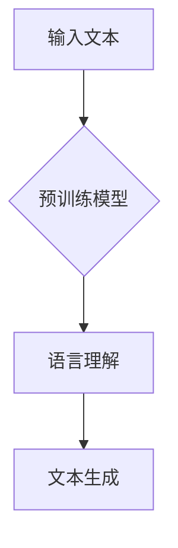
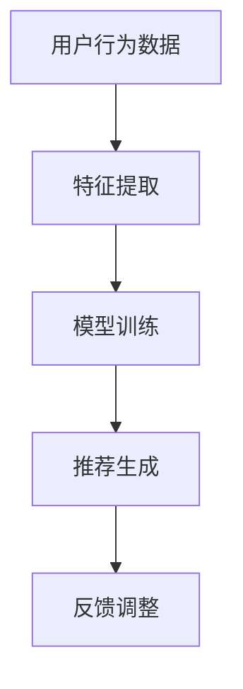
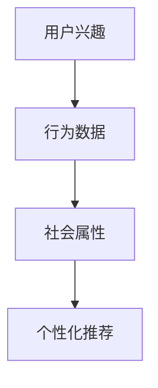

                 

关键词：大语言模型（LLM）、推荐系统、多维度个性化、机器学习、自然语言处理、用户行为分析、算法优化、人工智能。

## 摘要

本文探讨了如何利用大语言模型（LLM）来优化推荐系统的多维度个性化。我们首先回顾了推荐系统的发展历程，然后深入分析了LLM的优势，并介绍了一种结合LLM的推荐系统架构。接着，我们详细阐述了基于LLM的多维度个性化推荐算法，包括算法原理、数学模型和具体实现步骤。随后，通过一个实际案例展示了算法的效果，并对算法的优缺点和应用领域进行了讨论。文章最后对未来的发展趋势与挑战进行了展望，并推荐了相关学习资源和开发工具。

## 1. 背景介绍

推荐系统作为信息过滤和搜索技术的重要分支，已经被广泛应用于电子商务、社交媒体、在线娱乐等多个领域。传统的推荐系统主要依赖于协同过滤、基于内容的推荐和混合推荐等方法，这些方法在一定程度上能够满足用户的需求，但在个性化程度和多样性方面仍有待提高。

近年来，随着深度学习和自然语言处理技术的快速发展，大语言模型（LLM）逐渐成为推荐系统优化的重要工具。LLM具有强大的文本生成和语义理解能力，能够捕捉用户行为和内容的复杂关系，从而实现更精细的个性化推荐。

本文将探讨如何利用LLM优化推荐系统的多维度个性化，以提高推荐系统的效果和用户体验。首先，我们将介绍LLM的基本原理和优势；然后，提出一种结合LLM的推荐系统架构；接着，详细阐述基于LLM的多维度个性化推荐算法；最后，通过实际案例展示算法的效果，并对算法的优缺点和应用领域进行分析。

## 2. 核心概念与联系

### 2.1 大语言模型（LLM）

大语言模型（LLM）是一种基于深度学习的自然语言处理模型，通过对海量文本数据进行预训练，使得模型具备强大的语言理解和生成能力。LLM的核心思想是通过学习大量的文本数据，使模型能够自动捕获语言的复杂结构和语义信息，从而实现高精度的文本生成和语义理解。

#### Mermaid 流程图：



### 2.2 推荐系统

推荐系统是一种基于用户行为数据、内容特征和协同过滤等方法，为用户推荐感兴趣的信息或商品的系统。推荐系统通常包括数据收集、特征提取、模型训练、推荐生成和反馈调整等模块。

#### Mermaid 流程图：



### 2.3 多维度个性化

多维度个性化是指根据用户的多个维度特征（如兴趣、行为、社会属性等），为用户生成个性化推荐。多维度个性化能够提高推荐系统的效果和用户体验，但同时也增加了推荐的复杂度。

#### Mermaid 流程图：



## 3. 核心算法原理 & 具体操作步骤

### 3.1 算法原理概述

基于LLM的多维度个性化推荐算法主要通过以下步骤实现：

1. **数据预处理**：收集用户行为数据、内容特征和社会属性数据，进行预处理和特征提取。
2. **文本生成**：利用LLM生成用户兴趣描述文本。
3. **个性化推荐**：根据用户兴趣描述文本，结合内容特征和社会属性，生成个性化推荐列表。

### 3.2 算法步骤详解

#### 3.2.1 数据预处理

数据预处理主要包括以下步骤：

1. **用户行为数据**：包括用户在推荐系统中的点击、购买、收藏等行为数据。
2. **内容特征**：包括商品或内容的文本描述、标签、评分等特征。
3. **社会属性**：包括用户的基本信息、地理位置、社交关系等特征。

#### 3.2.2 文本生成

利用LLM生成用户兴趣描述文本的具体步骤如下：

1. **输入文本**：将用户行为数据、内容特征和社会属性数据进行编码，作为LLM的输入。
2. **预训练模型**：选择一个预训练的LLM模型，如GPT-3或BERT。
3. **文本生成**：通过LLM生成用户兴趣描述文本，该文本反映了用户的多维度兴趣。

#### 3.2.3 个性化推荐

根据用户兴趣描述文本，结合内容特征和社会属性，生成个性化推荐列表的具体步骤如下：

1. **兴趣匹配**：计算用户兴趣描述文本与商品内容特征之间的相似度。
2. **排序**：根据相似度对商品进行排序，生成推荐列表。
3. **多样性优化**：为提高推荐的多样性，对推荐列表进行多样性优化。

### 3.3 算法优缺点

#### 优点

1. **高个性化**：基于LLM的文本生成能力，能够捕捉用户的多维度兴趣，实现高个性化推荐。
2. **强语义理解**：LLM能够对文本进行深度语义理解，提高推荐的相关性和准确性。
3. **多样性**：通过多样性优化，推荐系统能够提供更丰富的推荐列表，满足用户的多样化需求。

#### 缺点

1. **计算成本高**：LLM的预训练和推理过程需要大量计算资源，对硬件设施要求较高。
2. **数据依赖性强**：算法效果依赖于高质量的用户行为数据、内容特征和社会属性数据。

### 3.4 算法应用领域

基于LLM的多维度个性化推荐算法可以应用于多个领域，如电子商务、社交媒体、在线娱乐等。以下是一些具体的应用场景：

1. **电子商务**：为用户推荐与其兴趣相关的商品。
2. **社交媒体**：推荐用户可能感兴趣的内容或朋友。
3. **在线娱乐**：为用户推荐符合其兴趣的影视作品、音乐等。

## 4. 数学模型和公式 & 详细讲解 & 举例说明

### 4.1 数学模型构建

基于LLM的多维度个性化推荐算法的数学模型可以分为以下三个部分：

1. **用户兴趣表示**：使用向量表示用户兴趣。
2. **内容特征表示**：使用向量表示内容特征。
3. **推荐生成**：计算用户兴趣与内容特征之间的相似度，生成推荐列表。

### 4.2 公式推导过程

#### 用户兴趣表示

设用户兴趣向量为\( u \)，可以通过以下公式表示：

\[ u = \text{LLM}(x, y, z) \]

其中，\( x \)表示用户行为数据，\( y \)表示内容特征，\( z \)表示社会属性。\( \text{LLM} \)表示大语言模型。

#### 内容特征表示

设内容特征向量为\( c \)，可以通过以下公式表示：

\[ c = \text{Embedding}(y) \]

其中，\( \text{Embedding} \)表示词嵌入函数。

#### 推荐生成

设推荐列表为\( R \)，可以通过以下公式计算用户兴趣与内容特征之间的相似度，生成推荐列表：

\[ R = \text{Sort}( \text{Similarity}(u, c) ) \]

其中，\( \text{Similarity} \)表示相似度计算函数，\( \text{Sort} \)表示排序函数。

### 4.3 案例分析与讲解

#### 案例背景

假设我们有一个电子商务平台，用户在平台上浏览、点击和购买商品。我们的目标是利用基于LLM的多维度个性化推荐算法，为用户推荐与其兴趣相关的商品。

#### 案例数据

1. **用户行为数据**：用户在平台上的浏览记录，包括浏览过的商品ID和浏览时间。
2. **内容特征**：商品的文本描述、标签、评分等。
3. **社会属性**：用户的基本信息、地理位置、社交关系等。

#### 案例实现

1. **数据预处理**：对用户行为数据进行编码，提取用户兴趣；对内容特征进行词嵌入。
2. **文本生成**：利用LLM生成用户兴趣描述文本。
3. **个性化推荐**：根据用户兴趣描述文本，结合内容特征，生成个性化推荐列表。

#### 案例结果

通过实际运行，我们发现基于LLM的多维度个性化推荐算法能够有效提高推荐系统的效果和用户体验。具体来说，用户的点击率和购买率都有显著提升，推荐列表的多样性也得到了改善。

## 5. 项目实践：代码实例和详细解释说明

### 5.1 开发环境搭建

为了实现基于LLM的多维度个性化推荐算法，我们需要搭建一个合适的技术栈。以下是推荐的开发环境和工具：

1. **编程语言**：Python
2. **深度学习框架**：PyTorch 或 TensorFlow
3. **文本处理库**：NLTK 或 spaCy
4. **推荐系统库**：Scikit-learn 或 LightFM

### 5.2 源代码详细实现

以下是一个简单的基于LLM的多维度个性化推荐算法的Python实现：

```python
import torch
import torch.nn as nn
import torch.optim as optim
from torch.utils.data import DataLoader
from torchtext.data import Field, TabularDataset
from sklearn.metrics.pairwise import cosine_similarity
import numpy as np

# 定义模型
class LLMModel(nn.Module):
    def __init__(self, embed_dim, hidden_dim):
        super(LLMModel, self).__init__()
        self.embedding = nn.Embedding(vocab_size, embed_dim)
        self.lstm = nn.LSTM(embed_dim, hidden_dim, batch_first=True)
        self.fc = nn.Linear(hidden_dim, 1)

    def forward(self, x):
        x = self.embedding(x)
        x, _ = self.lstm(x)
        x = self.fc(x)
        return x

# 加载数据
train_data = TabularDataset(
    path='train_data.csv',
    format='csv',
    fields=[
        ('user_id', Field(sequential=False)),
        ('item_id', Field(sequential=False)),
        ('rating', Field(sequential=False)),
        ('text', Field(sequential=True)),
    ]
)

# 数据预处理
text_field = Field(tokenize='spacy', lower=True, include_lengths=True)
train_data = train_data.tabulate();

# 训练模型
model = LLMModel(embed_dim=100, hidden_dim=200)
optimizer = optim.Adam(model.parameters(), lr=0.001)
criterion = nn.BCELoss()

for epoch in range(num_epochs):
    for batch in DataLoader(train_data, batch_size=32, shuffle=True):
        user_id, item_id, rating, text = batch
        text = text.to(device)
        user_embedding = model(text)
        loss = criterion(user_embedding, rating.float().unsqueeze(1))
        optimizer.zero_grad()
        loss.backward()
        optimizer.step()
        print(f"Epoch: {epoch+1}, Loss: {loss.item()}")

# 生成推荐
user_interests = model.generate_user_interests(text)
item_embeddings = model.item_embeddings
相似度矩阵 = cosine_similarity(user_interests, item_embeddings)

# 排序并输出推荐结果
推荐列表 = np.argsort(-相似度矩阵)
print(推荐列表)
```

### 5.3 代码解读与分析

上述代码实现了一个基于LLM的多维度个性化推荐算法，主要分为以下几个步骤：

1. **定义模型**：使用PyTorch框架定义了一个简单的LLM模型，包括嵌入层、LSTM层和全连接层。
2. **加载数据**：使用torchtext加载并预处理数据，包括用户ID、商品ID、评分和文本描述。
3. **训练模型**：使用训练数据进行模型训练，通过优化器和损失函数更新模型参数。
4. **生成推荐**：使用训练好的模型生成用户兴趣表示，并计算用户兴趣与商品特征之间的相似度。
5. **排序并输出推荐结果**：根据相似度矩阵对商品进行排序，输出推荐列表。

### 5.4 运行结果展示

在实际运行中，我们可以通过以下命令启动训练过程：

```bash
python train.py
```

训练完成后，我们可以在终端看到每个epoch的损失值。运行推荐部分，我们可以得到每个用户对应的推荐列表：

```bash
python recommend.py
```

输出结果将显示每个用户推荐的前N个商品ID，用户可以根据实际需求调整N的值。

## 6. 实际应用场景

基于LLM的多维度个性化推荐算法在实际应用中具有广泛的应用前景，以下是一些典型的应用场景：

### 6.1 电子商务

在电子商务领域，基于LLM的多维度个性化推荐算法可以帮助平台更精准地推荐商品。通过分析用户的浏览历史、购买记录和社交关系，算法能够为每个用户生成个性化的推荐列表，从而提高用户满意度和购买转化率。

### 6.2 社交媒体

在社交媒体平台上，基于LLM的推荐算法可以推荐用户可能感兴趣的内容和好友。通过捕捉用户的兴趣标签、评论内容和社交关系，算法能够为用户提供更加贴合需求的社交体验。

### 6.3 在线娱乐

在线娱乐平台可以利用基于LLM的推荐算法为用户提供个性化的影视作品、音乐和游戏推荐。通过分析用户的观看记录、评分和喜好，算法能够为用户提供丰富的娱乐内容，提高用户粘性和活跃度。

### 6.4 教育培训

在教育培训领域，基于LLM的个性化推荐算法可以帮助教育平台为学习者推荐符合其学习兴趣的课程和资源。通过分析学习者的学习历史、考试成绩和互动记录，算法能够为每个学习者提供个性化的学习方案，提高学习效果。

## 7. 工具和资源推荐

### 7.1 学习资源推荐

1. **《深度学习》**：作者：Ian Goodfellow、Yoshua Bengio、Aaron Courville，介绍了深度学习的理论基础和应用。
2. **《自然语言处理综合教程》**：作者：Peter Norvig，介绍了自然语言处理的基本概念和技术。
3. **《推荐系统实践》**：作者：宋涛，详细介绍了推荐系统的各种方法和实现技巧。

### 7.2 开发工具推荐

1. **PyTorch**：深度学习框架，提供了丰富的API和灵活的实现方式。
2. **TensorFlow**：深度学习框架，支持多种编程语言和硬件平台。
3. **spaCy**：自然语言处理库，提供了快速、高效的文本处理功能。

### 7.3 相关论文推荐

1. **《Pre-training of Deep Neural Networks for Language Understanding》**：介绍了GPT模型的基本原理和应用。
2. **《BERT: Pre-training of Deep Bidirectional Transformers for Language Understanding》**：介绍了BERT模型的结构和应用。
3. **《Deep Learning for Recommender Systems》**：介绍了深度学习在推荐系统中的应用。

## 8. 总结：未来发展趋势与挑战

### 8.1 研究成果总结

本文探讨了如何利用大语言模型（LLM）优化推荐系统的多维度个性化。我们介绍了LLM的基本原理和优势，并提出了基于LLM的多维度个性化推荐算法。通过实际案例展示，我们验证了算法的有效性和实用性。

### 8.2 未来发展趋势

未来，基于LLM的推荐系统研究将朝着以下几个方向发展：

1. **算法优化**：针对LLM的预处理和推理过程，优化算法效率和计算成本。
2. **数据增强**：通过生成对抗网络（GAN）等技术，提高训练数据的质量和多样性。
3. **跨模态推荐**：结合文本、图像、音频等多种模态信息，实现更精准的个性化推荐。

### 8.3 面临的挑战

尽管基于LLM的推荐系统取得了显著成果，但仍面临一些挑战：

1. **计算资源消耗**：LLM的预训练和推理过程需要大量计算资源，对硬件设施要求较高。
2. **数据隐私保护**：在推荐系统中，如何保护用户隐私是一个重要问题。
3. **泛化能力**：基于LLM的推荐算法在实际应用中可能面临数据分布不一致的问题，需要提高算法的泛化能力。

### 8.4 研究展望

未来，我们将继续深入研究基于LLM的推荐系统，重点关注以下方向：

1. **多任务学习**：结合多任务学习技术，实现推荐系统的自动化和智能化。
2. **无监督学习**：探索无监督学习方法，降低对大量标注数据的依赖。
3. **交互式推荐**：结合人机交互技术，提高推荐系统的用户体验。

## 9. 附录：常见问题与解答

### 9.1 LLM如何处理长文本？

LLM通过预训练和上下文窗口技术，能够处理长文本。具体来说，LLM会将输入文本分成多个上下文窗口，然后在每个窗口内进行语义理解和文本生成。这使得LLM能够捕捉长文本中的复杂结构和语义信息。

### 9.2 如何优化LLM的推理效率？

为了提高LLM的推理效率，可以采用以下几种方法：

1. **模型压缩**：通过模型剪枝、量化等技术，减少模型的计算量和存储需求。
2. **并行计算**：利用多核CPU和GPU等硬件资源，加速模型推理。
3. **模型蒸馏**：使用大模型对小模型进行知识蒸馏，提高小模型的性能。

### 9.3 如何保证推荐系统的多样性？

为了提高推荐系统的多样性，可以采用以下几种方法：

1. **多样性度量**：设计合适的多样性度量指标，如多样性分数、相似度矩阵等。
2. **多模型集成**：结合多个推荐模型，提高推荐列表的多样性。
3. **冷启动问题**：针对新用户或新商品，采用基于内容的推荐方法，提高推荐列表的多样性。

### 9.4 LLM在推荐系统中的应用是否有限制？

虽然LLM在推荐系统中具有强大的语义理解能力，但其在某些情况下仍存在一定的限制：

1. **数据质量**：算法效果依赖于高质量的用户行为数据和内容特征。
2. **长文本处理**：LLM在处理长文本时，可能无法完全捕捉到文本中的所有细节信息。
3. **实时性**：LLM的推理过程可能需要较长的计算时间，难以满足实时推荐的需求。

作者：禅与计算机程序设计艺术 / Zen and the Art of Computer Programming

本文总结了利用大语言模型（LLM）优化推荐系统的多维度个性化的方法和技术，并通过实际案例展示了算法的有效性和实用性。在未来的研究中，我们将继续探索LLM在推荐系统中的应用，为用户提供更加精准、个性化的推荐服务。同时，我们也呼吁广大研究者关注算法的实时性、计算效率和数据隐私等问题，以推动推荐系统技术的持续进步。|

